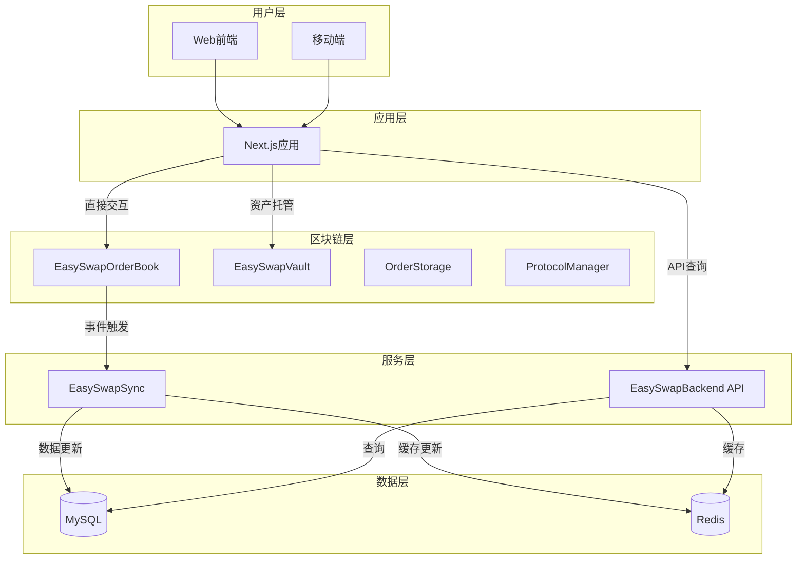

# NFTMarketplace

NFTMarketplace 是一个去中心化的 NFT 交易市场平台，采用智能合约 + 前端直连 + 后端索引的架构设计。用户可以直接通过前端与智能合约交互完成 NFT 交易，所有交易逻辑在链上执行，后端服务仅负责数据索引和查询，确保交易的去中心化和安全性。

## 项目概述

### 核心功能

- **订单交易系统**：支持挂单（List）和竞价（Bid）两种订单类型
- **订单匹配引擎**：基于红黑树的价格排序算法，自动匹配买卖订单
- **资产托管管理**：通过保管库合约安全托管 NFT 和 ETH
- **多链支持**：支持 Ethereum 主网及 EVM 兼容链
- **实时数据同步**：后端服务监听链上事件，实时更新数据库

### 主要特性

- **去中心化设计**：前端直接与智能合约交互，业务逻辑在链上执行
- **安全机制**：重入保护、权限控制、可暂停合约、安全转账
- **可升级架构**：采用代理合约模式，支持合约升级
- **高性能**：红黑树排序算法、高效订单匹配、缓存优化

## 技术栈

### 前端技术

- **框架**：Next.js 15.1.5、React 19.0.0
- **样式**：Tailwind CSS 3.4.1
- **UI组件**：Radix UI、Headless UI、Lucide React
- **钱包集成**：Wagmi 2.14.8、Viem 2.x、RainbowKit 2.2.2
- **状态管理**：TanStack Query (React Query) 5.64.1
- **图表**：Recharts 2.15.0
- **国际化**：i18next 24.2.1
- **包管理**：pnpm

### 智能合约

- **语言**：Solidity 0.8.20
- **开发框架**：Hardhat 2.22.19
- **依赖库**：OpenZeppelin Contracts 5.2.0、OpenZeppelin Upgrades 3.9.0、ERC721A 4.3.0
- **区块链交互**：ethers 6.13.5

### 后端技术

- **语言**：Go 1.21
- **框架**：Gin 1.9.1、go-zero 1.5.5
- **ORM**：GORM
- **区块链交互**：go-ethereum 1.12.0
- **日志**：Zap (uber-go/zap)
- **配置管理**：Viper

### 数据存储

- **关系型数据库**：MySQL
- **缓存**：Redis

### 开发工具

- **容器化**：Docker、Docker Compose
- **版本控制**：Git
- **模块管理**：go modules (Go)、pnpm (前端)

## 项目架构

### 整体架构



### 数据流向

1. **用户操作流程**：用户通过前端操作 → 直接调用智能合约 → 合约触发事件 → 后端服务监听并更新数据库 → 前端通过API查询最新状态

2. **订单处理流程**：
   - 创建订单：用户授权NFT → 创建订单 → 链上验证和存储 → 触发事件
   - 订单匹配：找到匹配订单 → 验证双方订单 → 执行交易 → 转移资产 → 支付手续费

3. **数据同步机制**：链上事件监听 → 实时同步 → 定期数据清理 → 缓存策略优化

### 模块间关系

- **前端 ↔ 智能合约**：直接交互，实现去中心化交易
- **后端 ↔ 数据库**：负责数据持久化和状态管理
- **后端 ↔ 区块链**：监听事件，维护链下数据镜像
- **智能合约 ↔ 保管库**：安全的资产托管和转移

## 目录结构

```
NFTMarketplace/
├── frontend/                          # Next.js前端应用
│   ├── app/                          # 页面路由目录
│   │   ├── activity/                 # 交易活动页面
│   │   ├── airdrop/                  # 空投活动页面
│   │   ├── collections/              # NFT集合页面
│   │   ├── portfolio/                # 用户资产组合页面
│   │   ├── layout.tsx                # 应用布局组件
│   │   └── page.tsx                  # 首页
│   ├── components/                   # UI组件目录
│   ├── hooks/                        # 自定义React Hooks
│   ├── lib/                          # 工具库和辅助函数
│   ├── contracts/                    # 智能合约ABI和类型定义
│   ├── config/                       # 配置文件
│   ├── api/                          # API调用封装
│   ├── public/                       # 静态资源
│   ├── package.json                  # 前端依赖配置
│   └── README.md                     # 前端模块说明
│
├── Backend/                          # Go后端服务
│   ├── EasySwapBackend/              # 主要API服务
│   │   ├── src/
│   │   │   ├── main.go               # 服务入口
│   │   │   ├── api/                  # API路由处理
│   │   │   ├── service/              # 业务逻辑层
│   │   │   ├── dao/                  # 数据访问层
│   │   │   └── types/                # 类型定义
│   │   ├── config/                   # 配置文件目录
│   │   └── README.md                 # 后端服务说明
│   │
│   ├── EasySwapBase/                 # 基础框架
│   │   ├── chain/                    # 链配置
│   │   ├── evm/                      # EVM交互
│   │   ├── ordermanager/             # 订单管理核心逻辑
│   │   ├── stores/                   # 数据存储封装
│   │   ├── xhttp/                    # HTTP工具
│   │   ├── logger/                   # 日志工具
│   │   ├── go.mod                    # Go模块配置
│   │   └── README.md                 # 基础框架说明
│   │
│   └── EasySwapSync/                 # 数据同步服务
│       ├── service/                  # 同步服务
│       │   └── orderbookindexer/     # 订单簿索引服务
│       ├── db/                       # 数据库迁移
│       ├── docker-compose.yml        # Docker编排配置
│       └── README.md                 # 同步服务说明
│
├── EasySwapContract/                 # 智能合约
│   ├── contracts/                    # 合约源码
│   │   ├── EasySwapOrderBook.sol     # 订单簿主合约
│   │   ├── EasySwapVault.sol         # 资产保管库合约
│   │   ├── OrderStorage.sol          # 订单存储合约
│   │   ├── OrderValidator.sol        # 订单验证合约
│   │   ├── ProtocolManager.sol       # 协议管理合约
│   │   ├── interface/                # 接口定义
│   │   ├── libraries/                # 库文件
│   │   │   ├── LibOrder.sol          # 订单数据结构
│   │   │   ├── LibPayInfo.sol        # 支付工具
│   │   │   ├── LibTransferSafe.sol   # 安全转账
│   │   │   └── RedBlackTree.sol      # 红黑树实现
│   │   └── test/                     # 测试合约
│   ├── scripts/                      # 部署和交互脚本
│   ├── test/                         # 合约测试
│   ├── hardhat.config.ts             # Hardhat配置
│   ├── package.json                  # 合约依赖配置
│   └── README.md                     # 合约模块说明
│
├── CLAUDE.md                         # 项目协作指南
└── README.md                         # 本文件
```

## 核心文件说明

### 项目入口和配置文件

#### 前端入口

- **frontend/app/layout.tsx**：Next.js应用根布局，定义全局样式和主题配置
- **frontend/app/page.tsx**：应用首页，展示平台主要功能入口
- **frontend/package.json**：前端项目依赖配置，包含所有npm包和脚本命令
- **frontend/next.config.ts**：Next.js框架配置文件

#### 智能合约配置

- **EasySwapContract/hardhat.config.ts**：Hardhat编译和部署配置
- **EasySwapContract/package.json**：智能合约项目依赖配置

#### 后端配置

- **Backend/EasySwapBackend/src/main.go**：后端API服务入口，初始化HTTP服务器和路由
- **Backend/EasySwapBackend/config/config.toml**：后端服务配置（数据库、合约地址等）

### 核心业务逻辑实现

#### 智能合约层

- **EasySwapContract/contracts/EasySwapOrderBook.sol**（约755行）
  - 订单簿主合约，核心功能包括：
  - 订单创建：makeOrders() 处理挂单和竞价
  - 订单匹配：matchOrders() 执行买卖订单匹配
  - 价格排序：使用红黑树维护订单价格顺序
  - 事件触发：LogMake、LogMatch、LogCancel

- **EasySwapContract/contracts/EasySwapVault.sol**（约167行）
  - 资产保管库合约，核心功能包括：
  - NFT托管：存储待交易的NFT
  - ETH管理：保管买家支付的ETH
  - 安全转账：NFT和ETH的安全转移机制

- **EasySwapContract/contracts/OrderStorage.sol**（约397行）
  - 订单存储合约，负责：
  - 订单数据持久化
  - 订单状态管理
  - 订单查询接口

- **EasySwapContract/contracts/OrderValidator.sol**（约123行）
  - 订单验证合约，执行：
  - 订单合法性检查
  - 所有权验证
  - 价格和有效期验证

- **EasySwapContract/contracts/ProtocolManager.sol**（约49行）
  - 协议管理合约，管理：
  - 手续费费率设置
  - 管理员权限控制
  - 协议参数配置

#### 前端应用层

- **frontend/app/collections/page.tsx**：NFT集合列表页，展示所有集合及排名
- **frontend/app/collections/[name]/page.tsx**：集合详情页，展示特定集合的NFT和交易数据
- **frontend/app/portfolio/page.tsx**：用户资产组合页，展示用户持有的NFT资产
- **frontend/app/activity/page.tsx**：交易活动记录页，展示历史交易数据
- **frontend/components/**：UI组件库，包含可复用的界面组件

#### 后端服务层

- **Backend/EasySwapBackend/src/service/portfolio.go**：用户资产组合服务，处理用户NFT资产查询
- **Backend/EasySwapBackend/src/service/order.go**：订单信息服务，获取订单和出价信息
- **Backend/EasySwapBackend/src/service/collection.go**：集合管理服务，处理集合信息和排名
- **Backend/EasySwapBackend/src/service/activity.go**：活动记录服务，管理交易历史

### 数据模型和API接口

#### 智能合约数据结构

- **EasySwapContract/contracts/libraries/LibOrder.sol**
  - Order结构体：订单数据定义
  - Side枚举：买卖方向
  - SaleKind枚举：销售类型
  - Asset结构体：NFT资产定义

#### 后端数据模型

- **Backend/EasySwapBackend/src/types/**：后端数据类型定义
- **Backend/EasySwapSync/db/migrations/**：数据库表结构和迁移脚本

### 关键组件和服务模块

#### 订单管理

- **Backend/EasySwapBase/ordermanager/service.go**：订单服务主逻辑
- **Backend/EasySwapBase/ordermanager/queue.go**：订单队列管理
- **Backend/EasySwapBase/ordermanager/expiredorder.go**：过期订单处理
- **Backend/EasySwapBase/ordermanager/floorprice.go**：地板价计算

#### 事件同步

- **Backend/EasySwapSync/service/orderbookindexer/service.go**：订单簿事件同步服务
  - SyncOrderBookEventLoop()：持续监听链上事件
  - handleMakeEvent()：处理订单创建事件
  - handleMatchEvent()：处理订单匹配事件
  - handleCancelEvent()：处理订单取消事件

#### 区块链交互

- **Backend/EasySwapBase/evm/**：EVM交互模块，处理与以太坊网络的通信
- **Backend/EasySwapBase/chain/**：多链配置和管理

#### 数据存储

- **Backend/EasySwapBase/stores/**：数据存储封装，提供数据库和缓存操作接口

### 前端工具和辅助模块

- **frontend/hooks/**：自定义React Hooks，封装可复用的状态逻辑
- **frontend/lib/**：工具函数和辅助库
- **frontend/config/**：应用配置文件
- **frontend/api/**：API调用封装，与后端服务通信

## 快速开始

### 环境要求

- Node.js 18+
- Go 1.21+
- MySQL 8.0+
- Redis 6.0+
- pnpm
- Docker（推荐用于本地开发）

### 安装和运行

详细安装和运行说明请参考各子模块的README文件：

- [智能合约部署](EasySwapContract/README.md)
- [后端服务运行](Backend/EasySwapBackend/README.md)
- [前端应用启动](frontend/README.md)

## 技术亮点

1. **去中心化架构**：前端直接与智能合约交互，交易逻辑在链上执行，后端仅提供索引服务
2. **高效订单匹配**：使用红黑树算法实现价格排序，优化订单匹配效率
3. **可升级设计**：采用代理合约模式，支持合约升级而不影响现有数据
4. **多链支持**：架构设计支持扩展到其他EVM兼容链
5. **安全机制**：重入保护、权限控制、可暂停合约、安全转账等多重安全保障
6. **实时数据同步**：后端服务监听链上事件，实时更新数据库状态

## 许可证

本项目采用 ISC 许可证。
