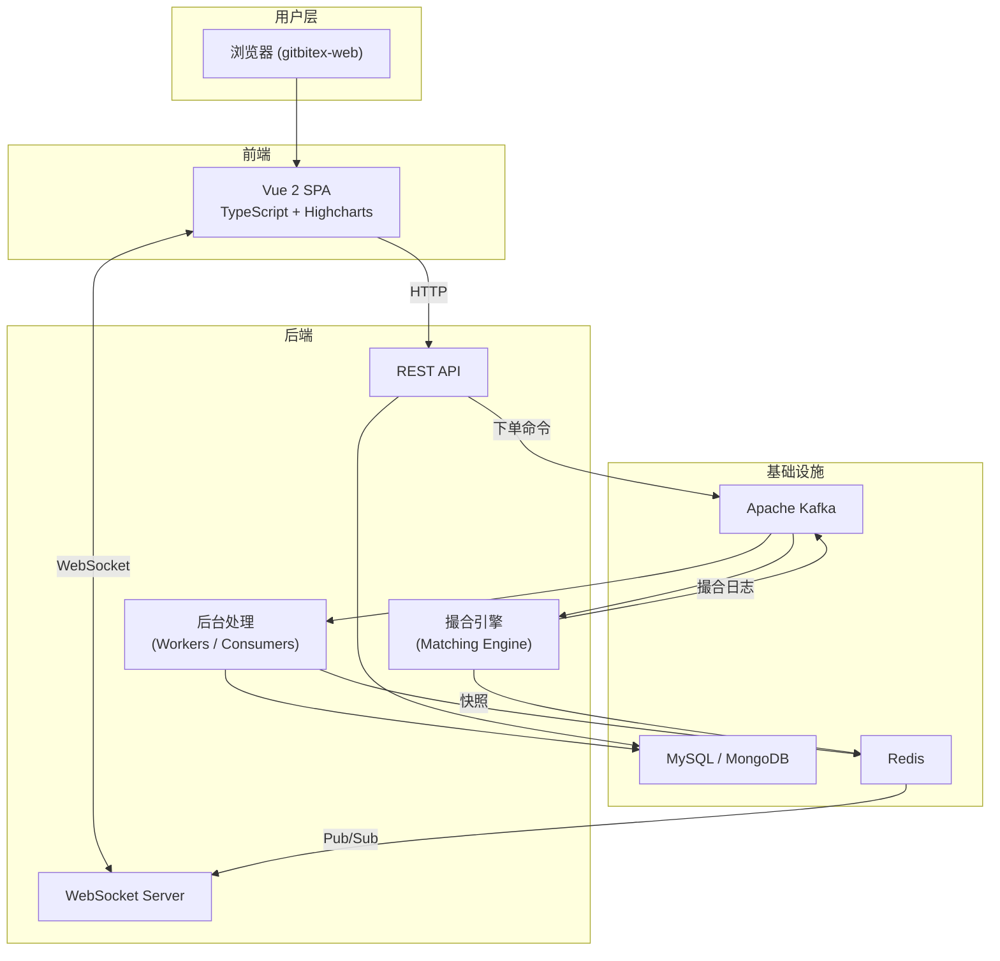
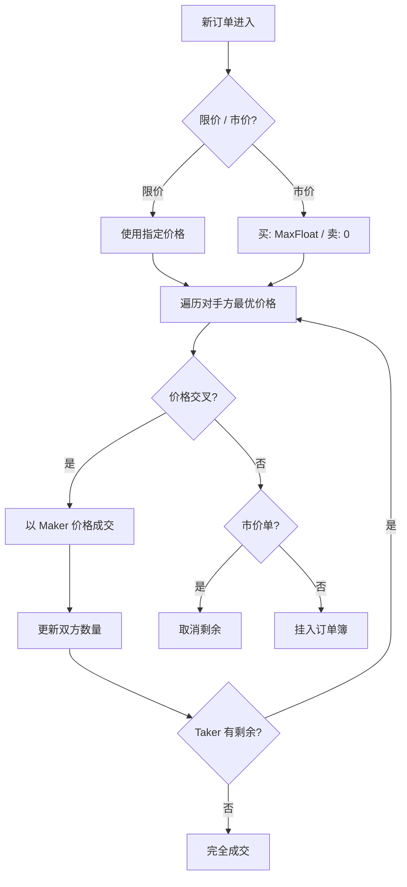
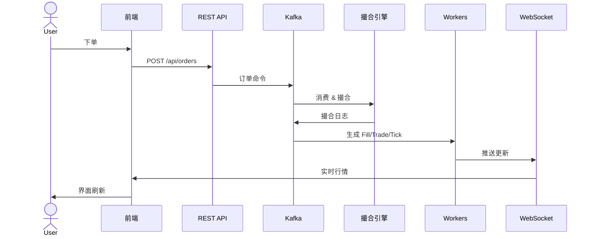

# GitBitEx — 开源中心化加密货币交易所 (CEX)

> 一个功能完整的现货交易所系统，包含撮合引擎、订单管理、实时行情推送、K 线图表等核心模块。  
> 项目包含 Go 版后端（原版）、Java 版后端（重构版）和 Vue 前端三个子系统。

---

## 系统架构总览



**架构分层说明：**

- **用户层**：用户通过浏览器访问 `gitbitex-web` 前端应用，作为系统的统一入口。
- **前端**：基于 Vue 2 的单页应用（SPA），使用 TypeScript 开发，集成 Highcharts 提供 K 线图表与深度图展示，负责行情渲染、下单交互及账户管理等用户界面。
- **后端**：包含四个核心模块——**REST API** 处理业务请求并将下单命令写入 Kafka；**WebSocket Server** 通过 Redis Pub/Sub 获取实时数据并推送到前端；**撮合引擎**从 Kafka 消费订单，执行价格优先-时间优先撮合，将结果回写 Kafka 并定期向 Redis 保存快照；**Workers** 消费撮合日志，完成成交记录持久化、行情计算及缓存更新等后台任务。
- **基础设施**：**Kafka** 作为全局消息总线，解耦下单、撮合、结算各环节；**MySQL / MongoDB** 分别为 Go 版和 Java 版提供持久化存储；**Redis** 承担缓存、撮合快照及实时数据推送通道的角色。

**整体数据流为**：用户在前端下单 → REST API 接收请求并将订单命令写入 Kafka → 撮合引擎消费订单并执行撮合，将成交日志回写 Kafka → Workers 消费日志完成数据库持久化和 Redis 缓存更新 → Redis 通过 Pub/Sub 通知 WebSocket Server → WebSocket 将最新行情、订单状态等实时推送到前端 → 用户界面自动刷新，形成从下单到行情刷新的完整闭环。

---

## 项目结构

```
cex/
├── gitbitex-spot/     # Go 版后端（原版）
├── gitbitex-new/      # Java 版后端（Spring Boot 重构版）
├── gitbitex-web/      # Vue 2 + TypeScript 前端
└── docs/              # 完整技术文档
    ├── overview.md
    ├── comparison.md
    ├── gitbitex-spot/   (8 篇模块文档)
    ├── gitbitex-new/    (8 篇模块文档)
    └── gitbitex-web/    (5 篇模块文档)
```

---

## 子项目介绍

### gitbitex-spot（Go 版后端）

| 项 | 说明 |
|-----|------|
| 语言 | Go |
| 数据库 | MySQL（需开启 BINLOG ROW 格式） |
| 消息队列 | Apache Kafka |
| 缓存 | Redis |
| REST 框架 | Gin |
| WebSocket | gorilla/websocket |

**核心特性：**
- 基于红黑树（TreeMap）的内存订单簿，O(log n) 价格层级操作
- 每产品独立撮合引擎，4 个 goroutine 流水线（Fetcher → Applier → Committer → Snapshotter）
- MySQL Binlog CDC 驱动实时数据推送
- Bitmap 滑动窗口去重（10,000 容量）
- 分片 Worker 并行处理（orderId % 10 / userId % 10）

**快速启动：**

```bash
cd gitbitex-spot

# 1. 创建数据库并执行建表脚本
mysql -u root -p < ddl.sql

# 2. 修改配置
vim conf.json

# 3. 编译运行
go build -o gitbitex-spot
./gitbitex-spot
```

服务端口：REST `:8001` | WebSocket `:8002` | pprof `:6060`

---

### gitbitex-new（Java 版后端）

| 项 | 说明 |
|-----|------|
| 语言 | Java 14 |
| 框架 | Spring Boot |
| 数据库 | MongoDB（需副本集支持事务） |
| 消息队列 | Apache Kafka |
| 缓存 | Redis (Redisson) |
| 监控 | Micrometer + Prometheus |

**相比 Go 版的改进：**
- 撮合引擎内置 AccountBook，余额管理原子化（hold/unhold/exchange）
- 支持 TimeInForce（GTC/IOC/GTX）
- Kafka 消息 Zstandard 压缩 + 幂等 Producer
- MongoDB 事务快照，恢复一致性更强
- 崩溃线程 3 秒自动重启
- Prometheus 指标暴露

**快速启动：**

```bash
cd gitbitex-new

# 使用 Docker Compose 启动依赖
docker-compose up -d

# 编译运行
mvn clean package -DskipTests
java -jar target/gitbitex-new-*.jar
```

服务端口：REST + WebSocket `:8080` | Prometheus `:7002`

---

### gitbitex-web（前端）

| 项 | 说明 |
|-----|------|
| 框架 | Vue 2.5 + TypeScript 2.9 |
| 状态管理 | Vuex 3.0 |
| 图表 | Highcharts 7.2 + TradingView |
| 构建 | Gulp 3.9 + Webpack 3.10 |
| 样式 | Bootstrap 4 + LESS |

**功能页面：**
- `/trade/:id` — 交易页（K 线、深度图、订单簿、下单、成交历史）
- `/` — 首页（产品列表、行情概览）
- `/account/*` — 账户管理（登录、注册、钱包、订单历史）

**快速启动：**

```bash
cd gitbitex-web

npm install
npm start        # 开发模式 → http://localhost:3000
npm run build    # 生产构建 → build/web/
```

---

## 核心技术架构

### 撮合引擎

两个版本都实现了 **价格优先-时间优先（Price-Time Priority）** 撮合算法：



1. **新订单进入**：系统接收一笔新订单（Taker），首先判断其类型。
2. **价格确定**：若为限价单，使用用户指定的价格；若为市价单，买单价格设为最大值（MaxFloat，确保吃到所有卖单），卖单价格设为 0（确保吃到所有买单）。
3. **对手方匹配**：按确定的价格遍历对手方订单簿，从最优价格层级开始逐级匹配，判断是否存在价格交叉（即买价 ≥ 卖价）。所谓最优价格层级，是指对 Taker 最有利的价格档位——买单匹配卖单簿中最低卖价，卖单匹配买单簿中最高买价。
4. **成交处理**：若价格交叉，以 Maker（挂单方）的价格成交，并更新双方剩余数量。若 Taker 仍有剩余数量，则回到步骤 3 继续匹配下一最优价格；若已完全成交，则流程结束。
5. **未成交处理**：若不存在价格交叉，则根据订单类型分流——市价单无法继续匹配，直接取消剩余数量；限价单则以未成交部分挂入订单簿，等待后续订单匹配。
```
1. 市价单的目标是"立即成交"。用户选择市价单，就意味着只接受马上执行，不接受等待。如果已经没有价格交叉的对手方挂单，说明订单簿里当前没有可匹配的对象，继续挂着也没有意义——因为市价单没有指定价格，即使后续有新挂单进入，也无法定义"什么时候该成交"。所以直接取消剩余数量。

2. 限价单的目标是"以指定价格或更好的价格成交"。用户明确给出了一个期望价格，当暂时没有匹配的对手方时，将未成交部分挂入订单簿是合理的——后续新的对手方订单进入时，只要出现价格交叉，就能自动触发匹配。

简单来说：市价单没有价格锚点，无法挂单等待；限价单自带价格，天然适合作为挂单留在订单簿中。
```

> **术语说明**：
> **Taker**（吃单方）指新进入的订单，主动与订单簿中的挂单成交
> **Maker**（挂单方）指已存在于订单簿中的限价单，为市场提供流动性

### 订单簿

```
OrderBook
├── Asks (卖单) — TreeMap 价格升序
│   ├── 100.5 → [Order1, Order2, Order3]  (FIFO)
│   ├── 101.0 → [Order4, Order5]
│   └── 101.5 → [Order6]
└── Bids (买单) — TreeMap 价格降序
    ├── 100.0 → [Order7, Order8]
    ├──  99.5 → [Order9, Order10]
    └──  99.0 → [Order11]
```

订单簿由两个 TreeMap 组成，分别管理卖单（Asks）和买单（Bids）。**Asks 按价格升序排列**，顶部即最低卖价，是买方能拿到的最优价格；**Bids 按价格降序排列**，顶部即最高买价，是卖方能拿到的最优价格。这种排列方式使撮合引擎无需遍历整个订单簿，直接取首元素即可获得最优价格层级，实现 O(log n) 的匹配效率。

每个价格层级下维护一个 FIFO 队列，同一价格的订单按进入顺序排列，先进入的先成交，从而保证**同价格下时间优先**的撮合规则。价格排序实现价格优先，FIFO 实现时间优先，两者结合完整支撑了价格优先-时间优先的撮合算法。


### 数据流



1. **用户下单**：用户在前端交易页面提交买卖订单。
2. **请求发送**：前端通过 `POST /api/orders` 将订单请求发送至 REST API。
3. **消息入队**：REST API 将订单封装为命令消息写入 Kafka，实现异步解耦。
4. **撮合执行**：撮合引擎从 Kafka 消费订单，按价格优先-时间优先算法执行匹配。
5. **结果回写**：撮合引擎将成交日志（Fill/Trade/Tick）回写 Kafka，供下游消费。
6. **后台结算**：Workers 消费 Kafka 中的撮合日志，完成成交记录持久化、行情计算及缓存更新，并通过 Redis Pub/Sub 通知 WebSocket Server。
7. **行情推送**：WebSocket Server 将最新的成交、深度、行情等数据实时推送到前端。
8. **界面刷新**：前端接收到推送后自动更新 K 线图、订单簿和账户状态，用户无需手动刷新页面。

整个过程中 Kafka 两次作为中转：第一次传递原始订单，第二次传递撮合结果，确保各模块之间松耦合、可独立扩展。

```
Fill（成交明细）：一笔 Taker 订单与一笔 Maker 订单之间的单次匹配记录。例如一个买单吃掉了 3 个卖单，就会产生 3 条 Fill，每条记录双方订单 ID、成交价格、成交数量等。一个 Taker 订单可以有多个 Fill。

Trade（交易记录）：一次撮合事件中买卖双方的聚合成交记录。通常一个 Fill 对应一条 Trade，记录哪个用户买了、哪个用户卖了，是面向用户展示的"最近成交"数据的来源。

Tick（行情快照）：每次成交后生成的最新价格行情，包含最新价、成交量、24h 最高/最低价等，用于驱动 K 线图、行情列表等展示。本质上是对一系列 Trade 的聚合统计。

简单来说：Fill 是撮合引擎的内部记录，Trade 是面向用户的成交记录，Tick 是面向市场的行情快照。
```

---

## Go 版 vs Java 版核心对比

| 维度 | gitbitex-spot (Go) | gitbitex-new (Java) |
|------|-------------------|-------------------|
| 数据库 | MySQL | MongoDB |
| 撮合线程模型 | 4 goroutine 流水线 × N 产品 | 单线程 Kafka Consumer |
| 余额管理 | REST 层外部冻结 | 引擎内 AccountBook 管理 |
| Kafka Topic | 每产品独立 Topic | 全局共享 Topic |
| 结算模式 | 两阶段异步 (Fill→Bill→Account) | 引擎内即时 exchange() |
| 消息格式 | JSON | 类型头 + FastJSON + Zstandard |
| 变更推送 | MySQL Binlog CDC | Redis Pub/Sub |
| 快照存储 | Redis (TTL 7天) | MongoDB 事务 |
| 去重 | Bitmap 滑动窗口 | Kafka 幂等 Producer |
| 监控 | pprof | Prometheus |

> 详细对比请参阅 [docs/comparison.md](docs/comparison.md)

---

## 依赖环境

| 组件 | Go 版需要 | Java 版需要 | 说明 |
|------|:---------:|:---------:|------|
| MySQL | ✅ | ❌ | 需开启 BINLOG ROW 格式 |
| MongoDB | ❌ | ✅ | 需配置为副本集（支持事务） |
| Apache Kafka | ✅ | ✅ | 消息队列 |
| Redis | ✅ | ✅ | 缓存 + Pub/Sub |
| Node.js | — | — | 前端构建需要 |

---

## 文档目录

完整技术文档位于 `docs/` 目录：

| 文档 | 说明 |
|------|------|
| **总览** | |
| [overview.md](docs/overview.md) | 三项目全局概览、技术栈对比、目录结构 |
| [comparison.md](docs/comparison.md) | Go vs Java 版 16 章详细对比 |
| **gitbitex-spot (Go 版)** | |
| [architecture.md](docs/gitbitex-spot/architecture.md) | 项目背景、整体架构、启动流程 |
| [matching-engine.md](docs/gitbitex-spot/matching-engine.md) | 撮合引擎核心算法 |
| [order-book.md](docs/gitbitex-spot/order-book.md) | 订单簿数据结构 |
| [kafka-messaging.md](docs/gitbitex-spot/kafka-messaging.md) | Kafka 消息设计 |
| [data-model.md](docs/gitbitex-spot/data-model.md) | MySQL 数据模型 ER 图 |
| [rest-api.md](docs/gitbitex-spot/rest-api.md) | REST API 接口 |
| [websocket.md](docs/gitbitex-spot/websocket.md) | WebSocket 推送 |
| [workers.md](docs/gitbitex-spot/workers.md) | Worker 处理管线 |
| **gitbitex-new (Java 版)** | |
| [architecture.md](docs/gitbitex-new/architecture.md) | 项目背景、Spring Boot 架构 |
| [matching-engine.md](docs/gitbitex-new/matching-engine.md) | 撮合引擎核心算法 |
| [order-book.md](docs/gitbitex-new/order-book.md) | 订单簿数据结构 |
| [kafka-messaging.md](docs/gitbitex-new/kafka-messaging.md) | Kafka 双 Topic 架构 |
| [data-model.md](docs/gitbitex-new/data-model.md) | MongoDB 数据模型 |
| [rest-api.md](docs/gitbitex-new/rest-api.md) | REST API 接口 |
| [websocket.md](docs/gitbitex-new/websocket.md) | WebSocket Feed 系统 |
| [market-data.md](docs/gitbitex-new/market-data.md) | 行情数据管线 |
| **gitbitex-web (前端)** | |
| [architecture.md](docs/gitbitex-web/architecture.md) | 前端架构、构建系统 |
| [components.md](docs/gitbitex-web/components.md) | Vue 组件体系 |
| [state-management.md](docs/gitbitex-web/state-management.md) | Vuex 状态管理 |
| [websocket.md](docs/gitbitex-web/websocket.md) | 实时通信 |
| [charts.md](docs/gitbitex-web/charts.md) | K 线图、深度图 |

---

## License

本项目用于学习和研究中心化交易所系统架构。