# GitBitEx CEX 交易所系统架构文档

> 本文档面向新加入项目的开发者，目标是读完后能理解三个子项目（gitbitex-spot、gitbitex-new、gitbitex-web）的完整架构、核心撮合引擎实现、以及新旧版本之间的技术对比。

---

## 1. 项目概述

GitBitEx 是一个完整的中心化加密货币交易所（CEX）系统，包含三个子项目：

| 项目 | 语言 | 定位 | 说明 |
|------|------|------|------|
| **gitbitex-spot** | Go | 老版本后端 | 基于 MySQL + Redis + Kafka 的现货交易系统 |
| **gitbitex-new** | Java (Spring Boot) | 新版本后端 | 基于 MongoDB + Redis + Kafka 的重构版本 |
| **gitbitex-web** | TypeScript (Vue 2) | 前端 | 交易所 Web 前端，支持 K 线、深度图、订单簿、下单 |

三个项目共同实现了一个典型 CEX 的核心功能闭环：用户注册登录 → 充值 → 下单 → 撮合引擎匹配 → 成交 → 结算 → 实时行情推送。

---

## 2. 技术栈对比

### 2.1 gitbitex-spot（Go 版）

| 类别 | 技术 | 说明 |
|------|------|------|
| 语言 | Go | 全部后端逻辑 |
| 数据库 | MySQL | 订单、账户、成交、K 线等持久化 |
| 缓存 | Redis | 撮合快照、Binlog CDC 通道、WebSocket 推送 |
| 消息队列 | Kafka | 订单投递、撮合日志分发 |
| REST 框架 | Gin | HTTP API |
| WebSocket | gorilla/websocket | 实时行情推送 |
| 数据结构 | TreeMap (红黑树) | 订单簿价格层级排序 |
| CDC | go-mysql binlog | MySQL 变更捕获驱动实时推送 |

### 2.2 gitbitex-new（Java 版）

| 类别 | 技术 | 说明 |
|------|------|------|
| 语言 | Java 14 | Spring Boot 应用 |
| 数据库 | MongoDB | 订单、成交、K 线、快照（需副本集支持事务） |
| 缓存 | Redis (Redisson) | 订单簿快照、Pub/Sub 实时推送 |
| 消息队列 | Kafka | 命令/消息双 Topic 架构 |
| REST 框架 | Spring MVC | HTTP API |
| WebSocket | Spring WebSocket | 实时行情推送 |
| 数据结构 | TreeMap + LinkedHashMap | 价格层级 + 价格内 FIFO 队列 |
| 序列化 | FastJSON + Zstandard 压缩 | Kafka 消息高效编解码 |
| 线程模型 | StripedExecutorService | 保证同一 Session 消息有序投递 |
| 监控 | Micrometer + Prometheus | 指标暴露（端口 7002） |

### 2.3 gitbitex-web（前端）

| 类别 | 技术 | 版本 | 说明 |
|------|------|------|------|
| 框架 | Vue 2 + TypeScript | 2.5.17 / 2.9 | 类装饰器风格 SPA |
| 状态管理 | Vuex | 3.0.1 | AccountStore + TradeStore |
| 路由 | Vue Router | 3.0.1 | History 模式，11 个路由 |
| HTTP | Axios | 0.19.0 | 单例请求封装 |
| 图表 | Highcharts + TradingView | 7.2.0 | K 线、深度图、技术指标 |
| 构建 | Gulp + Webpack | 3.9.1 / 3.10.0 | TypeScript 转译 + LESS 编译 |
| 样式 | Bootstrap 4 + LESS | 4.3.1 | 暗色主题 |

---

## 3. 系统总体架构图

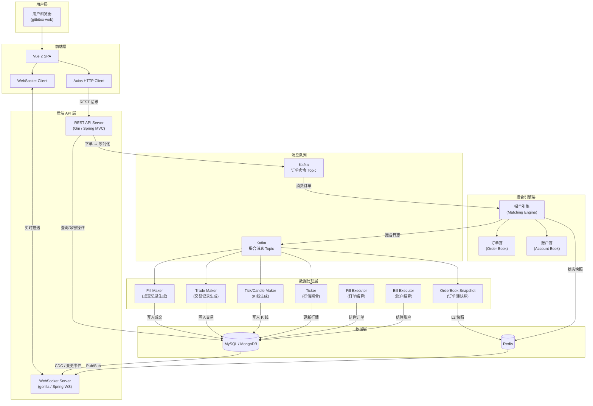
```mermaid
graph TB
    subgraph 用户层
        Browser["用户浏览器<br/>(gitbitex-web)"]
    end

    subgraph 前端层
        VueApp["Vue 2 SPA"]
        WS_Client["WebSocket Client"]
        HTTP_Client["Axios HTTP Client"]
    end

    subgraph 后端 API 层
        REST["REST API Server<br/>(Gin / Spring MVC)"]
        WS_Server["WebSocket Server<br/>(gorilla / Spring WS)"]
    end

    subgraph 消息队列
        Kafka_Order["Kafka<br/>订单命令 Topic"]
        Kafka_Log["Kafka<br/>撮合消息 Topic"]
    end

    subgraph 撮合引擎层
        Engine["撮合引擎<br/>(Matching Engine)"]
        OB["订单簿<br/>(Order Book)"]
        AB["账户簿<br/>(Account Book)"]
    end

    subgraph 数据处理层
        FillMaker["Fill Maker<br/>(成交记录生成)"]
        TradeMaker["Trade Maker<br/>(交易记录生成)"]
        TickMaker["Tick/Candle Maker<br/>(K 线生成)"]
        TickerMaker["Ticker<br/>(行情聚合)"]
        OBSnapshot["OrderBook Snapshot<br/>(订单簿快照)"]
        FillExecutor["Fill Executor<br/>(订单结算)"]
        BillExecutor["Bill Executor<br/>(账户结算)"]
    end

    subgraph 数据层
        DB[("MySQL / MongoDB")]
        Redis[("Redis")]
    end

    Browser --> VueApp
    VueApp --> HTTP_Client
    VueApp --> WS_Client
    HTTP_Client -->|"REST 请求"| REST
    WS_Client <-->|"实时推送"| WS_Server

    REST -->|"下单 → 序列化"| Kafka_Order
    REST -->|"查询/余额操作"| DB

    Kafka_Order -->|"消费订单"| Engine
    Engine --> OB
    Engine --> AB
    Engine -->|"撮合日志"| Kafka_Log

    Kafka_Log --> FillMaker
    Kafka_Log --> TradeMaker
    Kafka_Log --> TickMaker
    Kafka_Log --> TickerMaker
    Kafka_Log --> OBSnapshot

    FillMaker -->|"写入成交"| DB
    TradeMaker -->|"写入交易"| DB
    TickMaker -->|"写入 K 线"| DB
    TickerMaker -->|"更新行情"| DB
    OBSnapshot -->|"L2 快照"| Redis

    FillExecutor -->|"结算订单"| DB
    BillExecutor -->|"结算账户"| DB

    Engine -->|"状态快照"| Redis
    DB -->|"CDC / 变更事件"| WS_Server
    Redis -->|"Pub/Sub"| WS_Server
```

---

## 4. 核心撮合引擎详解

撮合引擎是 CEX 的心脏，两个版本都实现了**价格优先-时间优先（Price-Time Priority）**算法。

### 4.1 撮合引擎架构图

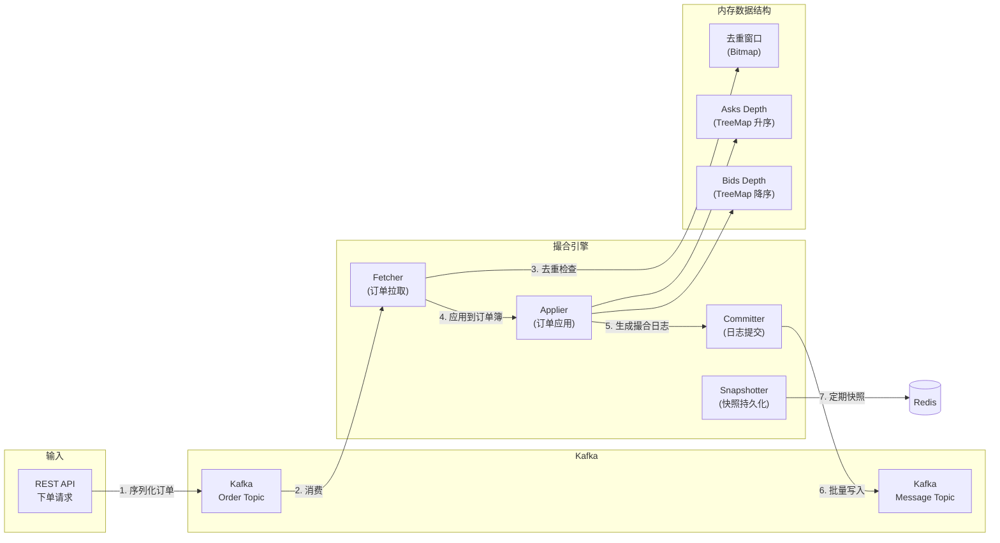
```mermaid
graph LR
    subgraph 输入
        API["REST API<br/>下单请求"]
    end

    subgraph Kafka
        KOT["Kafka<br/>Order Topic"]
        KMT["Kafka<br/>Message Topic"]
    end

    subgraph 撮合引擎
        Fetcher["Fetcher<br/>(订单拉取)"]
        Applier["Applier<br/>(订单应用)"]
        Committer["Committer<br/>(日志提交)"]
        Snapshotter["Snapshotter<br/>(快照持久化)"]
    end

    subgraph 内存数据结构
        OB_Asks["Asks Depth<br/>(TreeMap 升序)"]
        OB_Bids["Bids Depth<br/>(TreeMap 降序)"]
        Window["去重窗口<br/>(Bitmap)"]
    end

    API -->|"1. 序列化订单"| KOT
    KOT -->|"2. 消费"| Fetcher
    Fetcher -->|"3. 去重检查"| Window
    Fetcher -->|"4. 应用到订单簿"| Applier
    Applier --> OB_Asks
    Applier --> OB_Bids
    Applier -->|"5. 生成撮合日志"| Committer
    Committer -->|"6. 批量写入"| KMT
    Snapshotter -->|"7. 定期快照"| Redis[("Redis")]
```

### 4.2 订单簿数据结构

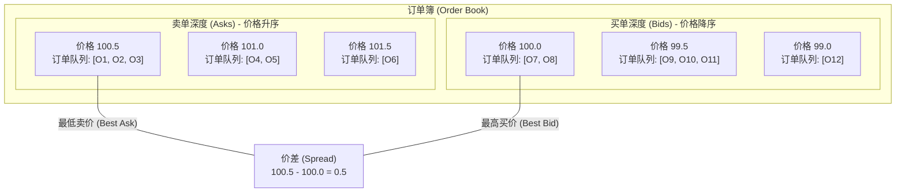
```mermaid
graph TD
    subgraph OrderBook["订单簿 (Order Book)"]
        subgraph Asks["卖单深度 (Asks) - 价格升序"]
            A1["价格 100.5<br/>订单队列: [O1, O2, O3]"]
            A2["价格 101.0<br/>订单队列: [O4, O5]"]
            A3["价格 101.5<br/>订单队列: [O6]"]
        end
        subgraph Bids["买单深度 (Bids) - 价格降序"]
            B1["价格 100.0<br/>订单队列: [O7, O8]"]
            B2["价格 99.5<br/>订单队列: [O9, O10, O11]"]
            B3["价格 99.0<br/>订单队列: [O12]"]
        end
    end

    A1 ---|"最低卖价 (Best Ask)"| Spread["价差 (Spread)<br/>100.5 - 100.0 = 0.5"]
    B1 ---|"最高买价 (Best Bid)"| Spread
```

**核心数据结构实现：**

| 层级 | Go 版 (spot) | Java 版 (new) |
|------|-------------|---------------|
| 价格层级排序 | `TreeMap` (红黑树) | `TreeMap<BigDecimal, PriceGroupedOrderCollection>` |
| 价格内订单队列 | 数组遍历 | `LinkedHashMap<String, Order>`（FIFO 插入序） |
| 订单快速查找 | 遍历 | `HashMap<String, Order>` O(1) 查找 |
| 买单排序 | 降序（高价优先） | `Collections.reverseOrder()` 降序 |
| 卖单排序 | 升序（低价优先） | 自然序升序 |

### 4.3 撮合算法流程

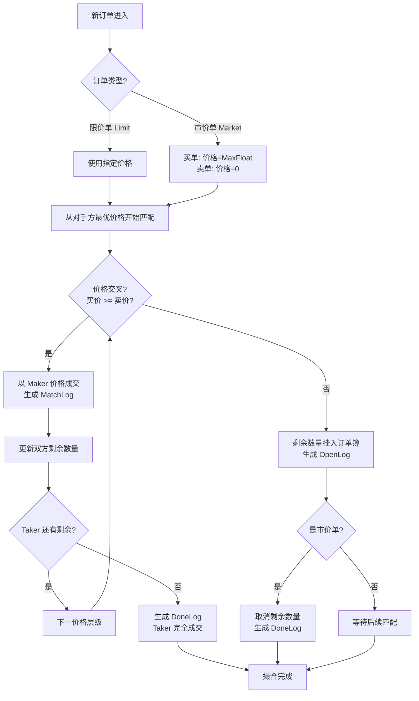
```mermaid
flowchart TD
    Start["新订单进入"] --> CheckType{订单类型?}

    CheckType -->|"限价单 Limit"| SetPrice["使用指定价格"]
    CheckType -->|"市价单 Market"| SetMarket["买单: 价格=MaxFloat<br/>卖单: 价格=0"]

    SetPrice --> Match["从对手方最优价格开始匹配"]
    SetMarket --> Match

    Match --> CheckCross{价格交叉?<br/>买价 >= 卖价?}

    CheckCross -->|"否"| AddToBook["剩余数量挂入订单簿<br/>生成 OpenLog"]
    CheckCross -->|"是"| Execute["以 Maker 价格成交<br/>生成 MatchLog"]

    Execute --> UpdateQty["更新双方剩余数量"]
    UpdateQty --> CheckRemain{Taker 还有剩余?}

    CheckRemain -->|"是"| NextLevel["下一价格层级"]
    NextLevel --> CheckCross
    CheckRemain -->|"否"| Done["生成 DoneLog<br/>Taker 完全成交"]

    AddToBook --> CheckMarket{是市价单?}
    CheckMarket -->|"是"| CancelRemain["取消剩余数量<br/>生成 DoneLog"]
    CheckMarket -->|"否"| WaitMatch["等待后续匹配"]

    Done --> End["撮合完成"]
    CancelRemain --> End
    WaitMatch --> End
```

### 4.4 撮合日志类型

撮合引擎产生三种不可变日志，写入 Kafka 作为事件源（Event Sourcing）：

| 日志类型 | 含义 | 包含信息 |
|---------|------|---------|
| **OpenLog** | 限价单挂入订单簿 | OrderId, RemainingSize, Price, Side |
| **MatchLog** | 两个订单成交 | TakerOrderId, MakerOrderId, Price, Size, TradeId |
| **DoneLog** | 订单生命周期结束 | OrderId, RemainingSize, Reason(filled/cancelled) |

### 4.5 快照与恢复机制

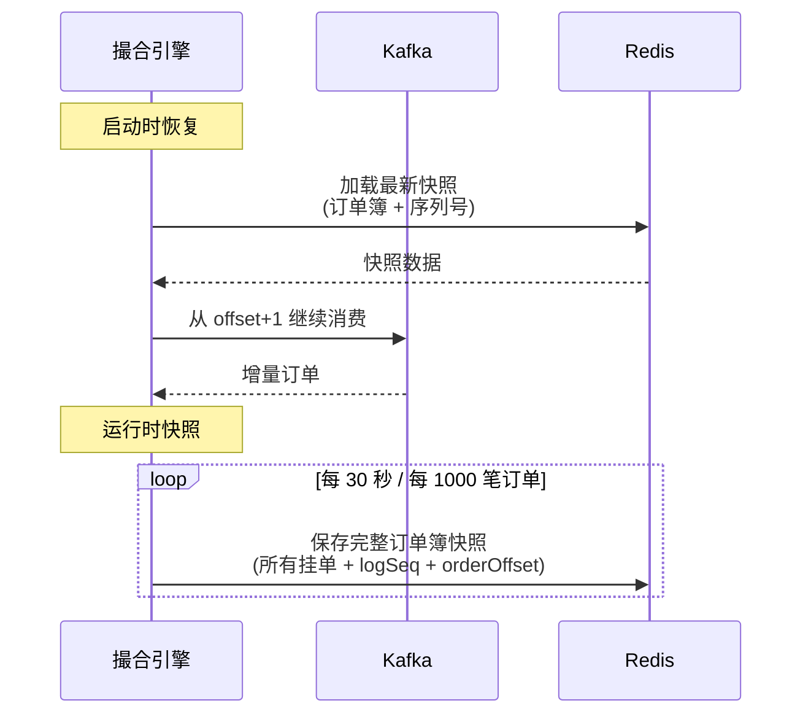
```mermaid
sequenceDiagram
    participant Engine as 撮合引擎
    participant Kafka as Kafka
    participant Redis as Redis

    Note over Engine: 启动时恢复
    Engine->>Redis: 加载最新快照<br/>(订单簿 + 序列号)
    Redis-->>Engine: 快照数据
    Engine->>Kafka: 从 offset+1 继续消费
    Kafka-->>Engine: 增量订单

    Note over Engine: 运行时快照
    loop 每 30 秒 / 每 1000 笔订单
        Engine->>Redis: 保存完整订单簿快照<br/>(所有挂单 + logSeq + orderOffset)
    end
```

| 项目 | 快照存储 | 触发条件 | 快照内容 |
|------|---------|---------|---------|
| Go 版 | Redis (TTL 7天) | 30 秒或 1000 笔订单 | 全部挂单 + tradeSeq + logSeq + 去重窗口 |
| Java 版 | MongoDB (事务) | 1000 条命令 | 全部挂单 + 账户余额 + 产品配置 + 各序列号 |

---

## 5. 订单全生命周期

### 5.1 订单状态流转

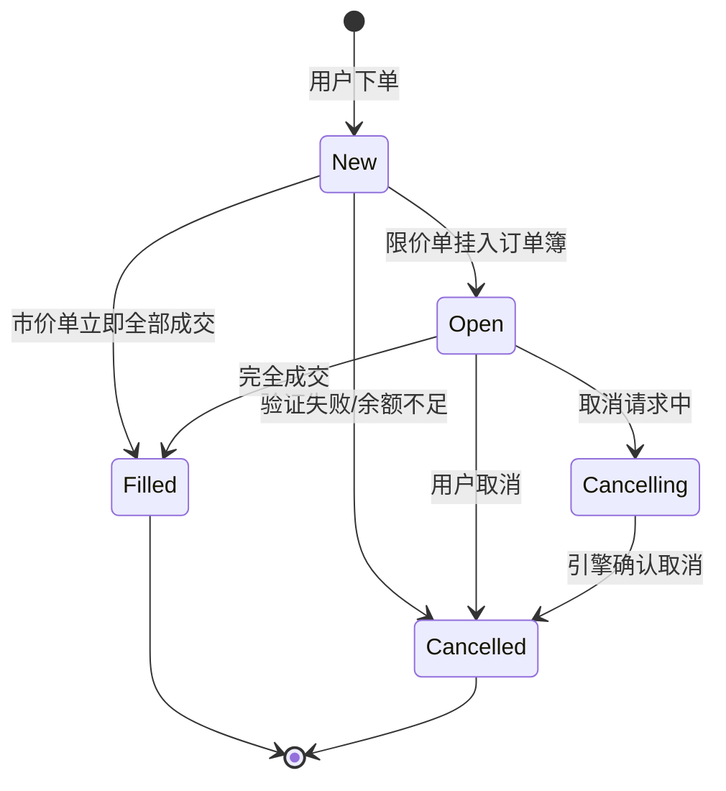
```mermaid
stateDiagram-v2
    [*] --> New: 用户下单
    New --> Open: 限价单挂入订单簿
    New --> Filled: 市价单立即全部成交
    New --> Cancelled: 验证失败/余额不足
    Open --> Filled: 完全成交
    Open --> Cancelled: 用户取消
    Open --> Cancelling: 取消请求中
    Cancelling --> Cancelled: 引擎确认取消
    Filled --> [*]
    Cancelled --> [*]
```

### 5.2 下单到结算完整流程

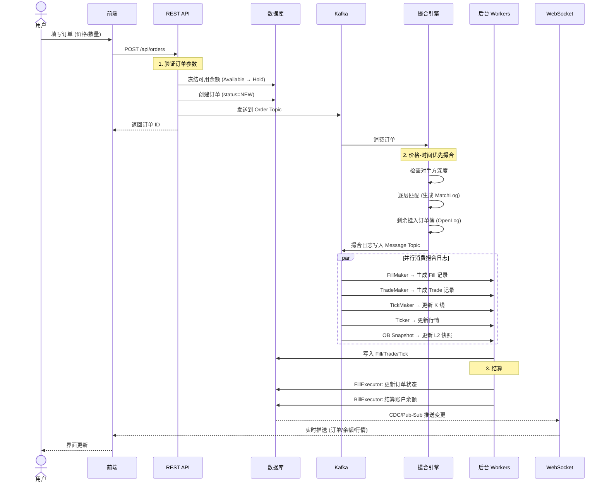
```mermaid
sequenceDiagram
    actor User as 用户
    participant Web as 前端
    participant API as REST API
    participant DB as 数据库
    participant Kafka as Kafka
    participant ME as 撮合引擎
    participant Workers as 后台 Workers
    participant WS as WebSocket

    User->>Web: 填写订单 (价格/数量)
    Web->>API: POST /api/orders

    Note over API: 1. 验证订单参数
    API->>DB: 冻结可用余额 (Available → Hold)
    API->>DB: 创建订单 (status=NEW)
    API->>Kafka: 发送到 Order Topic
    API-->>Web: 返回订单 ID

    Kafka->>ME: 消费订单
    Note over ME: 2. 价格-时间优先撮合
    ME->>ME: 检查对手方深度
    ME->>ME: 逐层匹配 (生成 MatchLog)
    ME->>ME: 剩余挂入订单簿 (OpenLog)
    ME->>Kafka: 撮合日志写入 Message Topic

    par 并行消费撮合日志
        Kafka->>Workers: FillMaker → 生成 Fill 记录
        Kafka->>Workers: TradeMaker → 生成 Trade 记录
        Kafka->>Workers: TickMaker → 更新 K 线
        Kafka->>Workers: Ticker → 更新行情
        Kafka->>Workers: OB Snapshot → 更新 L2 快照
    end

    Workers->>DB: 写入 Fill/Trade/Tick
    Note over Workers: 3. 结算
    Workers->>DB: FillExecutor: 更新订单状态
    Workers->>DB: BillExecutor: 结算账户余额

    DB-->>WS: CDC/Pub-Sub 推送变更
    WS-->>Web: 实时推送 (订单/余额/行情)
    Web-->>User: 界面更新
```

---

## 6. Go 版 vs Java 版核心对比

### 6.1 架构对比总览

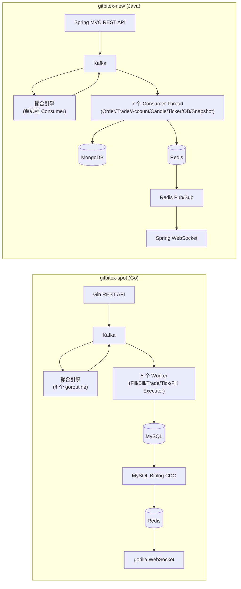
```mermaid
graph LR
    subgraph Go版["gitbitex-spot (Go)"]
        direction TB
        G_API["Gin REST API"]
        G_Engine["撮合引擎<br/>(4 个 goroutine)"]
        G_MySQL[("MySQL")]
        G_Redis[("Redis")]
        G_Kafka["Kafka"]
        G_BinLog["MySQL Binlog CDC"]
        G_WS["gorilla WebSocket"]
        G_Workers["5 个 Worker<br/>(Fill/Bill/Trade/Tick/Fill Executor)"]

        G_API --> G_Kafka
        G_Kafka --> G_Engine
        G_Engine --> G_Kafka
        G_Kafka --> G_Workers
        G_Workers --> G_MySQL
        G_MySQL --> G_BinLog
        G_BinLog --> G_Redis
        G_Redis --> G_WS
    end

    subgraph Java版["gitbitex-new (Java)"]
        direction TB
        J_API["Spring MVC REST API"]
        J_Engine["撮合引擎<br/>(单线程 Consumer)"]
        J_MongoDB[("MongoDB")]
        J_Redis[("Redis")]
        J_Kafka["Kafka"]
        J_PubSub["Redis Pub/Sub"]
        J_WS["Spring WebSocket"]
        J_Threads["7 个 Consumer Thread<br/>(Order/Trade/Account/Candle/Ticker/OB/Snapshot)"]

        J_API --> J_Kafka
        J_Kafka --> J_Engine
        J_Engine --> J_Kafka
        J_Kafka --> J_Threads
        J_Threads --> J_MongoDB
        J_Threads --> J_Redis
        J_Redis --> J_PubSub
        J_PubSub --> J_WS
    end
```

### 6.2 核心差异对比表

| 维度 | Go 版 (gitbitex-spot) | Java 版 (gitbitex-new) |
|------|----------------------|----------------------|
| **数据库** | MySQL | MongoDB（需副本集支持事务） |
| **变更推送** | MySQL Binlog CDC → Redis | Redis Pub/Sub 直推 |
| **撮合线程模型** | 4 个 goroutine（Fetcher/Applier/Committer/Snapshotter） | 单线程 Kafka Consumer |
| **账户管理** | 撮合引擎外部管理（REST 层冻结余额） | 撮合引擎内部 AccountBook（引擎内 hold/exchange） |
| **Kafka Topic** | 每产品独立 Topic：`matching_order_{productId}` | 全局共享 Topic：`Matching-Engine-Command` |
| **消息格式** | JSON 字符串 | 1字节类型头 + FastJSON + Zstandard 压缩 |
| **快照存储** | Redis（TTL 7 天） | MongoDB（事务保证一致性） |
| **结算流程** | 两阶段：Fill → Bill → 异步结算 | 引擎内即时结算（exchange 原子操作） |
| **去重机制** | Bitmap 滑动窗口（10000 容量） | Kafka 幂等 Producer（acks=all） |
| **Worker 模式** | Redis List BRPop + 分片（orderId % 10） | Kafka Consumer Group 分区消费 |
| **订单簿快照** | Redis L2（1000 层） | Redis L2/L3（25 层），差量推送 |
| **WebSocket 投递** | 直接推送 | StripedExecutorService 保序投递 |
| **监控** | pprof（:6060） | Micrometer + Prometheus（:7002） |
| **部署** | 二进制 | Docker（JIB Maven 插件，OpenJDK 14） |

### 6.3 撮合引擎内部对比

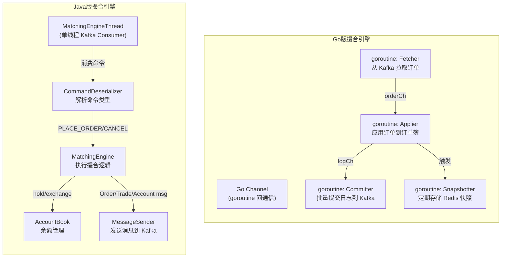
```mermaid
graph TB
    subgraph Go版撮合引擎
        direction TB
        G_Chan["Go Channel<br/>(goroutine 间通信)"]
        G_Fetch["goroutine: Fetcher<br/>从 Kafka 拉取订单"]
        G_Apply["goroutine: Applier<br/>应用订单到订单簿"]
        G_Commit["goroutine: Committer<br/>批量提交日志到 Kafka"]
        G_Snap["goroutine: Snapshotter<br/>定期存储 Redis 快照"]

        G_Fetch -->|"orderCh"| G_Apply
        G_Apply -->|"logCh"| G_Commit
        G_Apply -->|"触发"| G_Snap
    end

    subgraph Java版撮合引擎
        direction TB
        J_Thread["MatchingEngineThread<br/>(单线程 Kafka Consumer)"]
        J_Cmd["CommandDeserializer<br/>解析命令类型"]
        J_ME["MatchingEngine<br/>执行撮合逻辑"]
        J_AB["AccountBook<br/>余额管理"]
        J_MS["MessageSender<br/>发送消息到 Kafka"]

        J_Thread -->|"消费命令"| J_Cmd
        J_Cmd -->|"PLACE_ORDER/CANCEL"| J_ME
        J_ME -->|"hold/exchange"| J_AB
        J_ME -->|"Order/Trade/Account msg"| J_MS
    end
```

**关键设计差异：**

1. **余额管理位置**
   - Go 版：REST 层在下单时冻结余额（Available → Hold），撮合引擎只负责匹配
   - Java 版：撮合引擎内部管理 AccountBook，hold/unhold/exchange 都在引擎内完成，保证原子性

2. **Kafka Topic 策略**
   - Go 版：每个交易对独立 Topic（`matching_order_BTC-USDT`），天然隔离
   - Java 版：全局单 Topic（`Matching-Engine-Command`），通过消息类型字段区分

3. **结算模式**
   - Go 版：异步两阶段结算——FillMaker 生成 Fill 记录 → FillExecutor 结算订单 → BillExecutor 结算余额
   - Java 版：引擎内即时结算——exchange() 在撮合时直接完成资金转移，持久化线程异步写库

---

## 7. Kafka 消息流详解

### 7.1 Go 版消息流

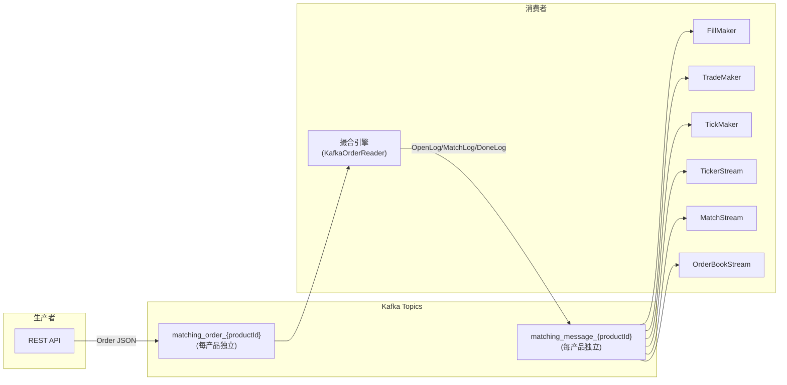
```mermaid
graph LR
    subgraph 生产者
        REST["REST API"]
    end

    subgraph Kafka Topics
        OT["matching_order_{productId}<br/>(每产品独立)"]
        MT["matching_message_{productId}<br/>(每产品独立)"]
    end

    subgraph 消费者
        Engine["撮合引擎<br/>(KafkaOrderReader)"]
        FM["FillMaker"]
        TM["TradeMaker"]
        TK["TickMaker"]
        TS["TickerStream"]
        MS["MatchStream"]
        OBS["OrderBookStream"]
    end

    REST -->|"Order JSON"| OT
    OT --> Engine
    Engine -->|"OpenLog/MatchLog/DoneLog"| MT
    MT --> FM
    MT --> TM
    MT --> TK
    MT --> TS
    MT --> MS
    MT --> OBS
```

### 7.2 Java 版消息流

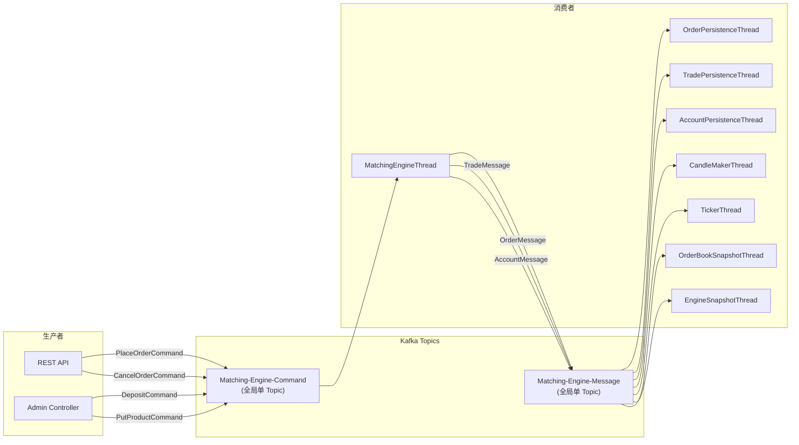
```mermaid
graph LR
    subgraph 生产者
        REST["REST API"]
        Admin["Admin Controller"]
    end

    subgraph Kafka Topics
        CMD["Matching-Engine-Command<br/>(全局单 Topic)"]
        MSG["Matching-Engine-Message<br/>(全局单 Topic)"]
    end

    subgraph 消费者
        Engine["MatchingEngineThread"]
        OP["OrderPersistenceThread"]
        TP["TradePersistenceThread"]
        AP["AccountPersistenceThread"]
        CM["CandleMakerThread"]
        TT["TickerThread"]
        OBS["OrderBookSnapshotThread"]
        Snap["EngineSnapshotThread"]
    end

    REST -->|"PlaceOrderCommand"| CMD
    REST -->|"CancelOrderCommand"| CMD
    Admin -->|"DepositCommand"| CMD
    Admin -->|"PutProductCommand"| CMD
    CMD --> Engine
    Engine -->|"OrderMessage"| MSG
    Engine -->|"TradeMessage"| MSG
    Engine -->|"AccountMessage"| MSG
    MSG --> OP
    MSG --> TP
    MSG --> AP
    MSG --> CM
    MSG --> TT
    MSG --> OBS
    MSG --> Snap
```

**命令类型（Java 版）：**

| 命令 | 说明 |
|------|------|
| `PLACE_ORDER` | 下单（限价/市价） |
| `CANCEL_ORDER` | 取消订单 |
| `DEPOSIT` | 充值（增加可用余额） |
| `PUT_PRODUCT` | 添加/更新交易对 |

**消息类型（Java 版）：**

| 消息 | 说明 |
|------|------|
| `ORDER` | 订单状态变更（NEW/OPEN/FILLED/CANCELLED） |
| `TRADE` | 成交记录 |
| `ACCOUNT` | 账户余额变更 |
| `PRODUCT` | 交易对配置变更 |

---

## 8. 数据模型

### 8.1 Go 版数据模型（MySQL）

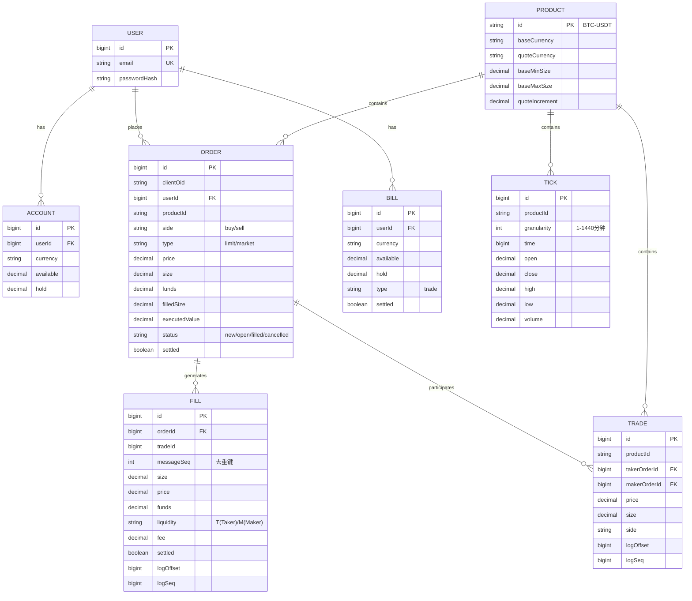
```mermaid
erDiagram
    USER {
        bigint id PK
        string email UK
        string passwordHash
    }

    ACCOUNT {
        bigint id PK
        bigint userId FK
        string currency
        decimal available
        decimal hold
    }

    ORDER {
        bigint id PK
        string clientOid
        bigint userId FK
        string productId
        string side "buy/sell"
        string type "limit/market"
        decimal price
        decimal size
        decimal funds
        decimal filledSize
        decimal executedValue
        string status "new/open/filled/cancelled"
        boolean settled
    }

    FILL {
        bigint id PK
        bigint orderId FK
        bigint tradeId
        int messageSeq "去重键"
        decimal size
        decimal price
        decimal funds
        string liquidity "T(Taker)/M(Maker)"
        decimal fee
        boolean settled
        bigint logOffset
        bigint logSeq
    }

    TRADE {
        bigint id PK
        string productId
        bigint takerOrderId FK
        bigint makerOrderId FK
        decimal price
        decimal size
        string side
        bigint logOffset
        bigint logSeq
    }

    BILL {
        bigint id PK
        bigint userId FK
        string currency
        decimal available
        decimal hold
        string type "trade"
        boolean settled
    }

    TICK {
        bigint id PK
        string productId
        int granularity "1-1440分钟"
        bigint time
        decimal open
        decimal close
        decimal high
        decimal low
        decimal volume
    }

    PRODUCT {
        string id PK "BTC-USDT"
        string baseCurrency
        string quoteCurrency
        decimal baseMinSize
        decimal baseMaxSize
        decimal quoteIncrement
    }

    USER ||--o{ ACCOUNT : has
    USER ||--o{ ORDER : places
    ORDER ||--o{ FILL : generates
    ORDER ||--o{ TRADE : participates
    USER ||--o{ BILL : has
    PRODUCT ||--o{ ORDER : contains
    PRODUCT ||--o{ TRADE : contains
    PRODUCT ||--o{ TICK : contains
```

### 8.2 Java 版数据模型（MongoDB）

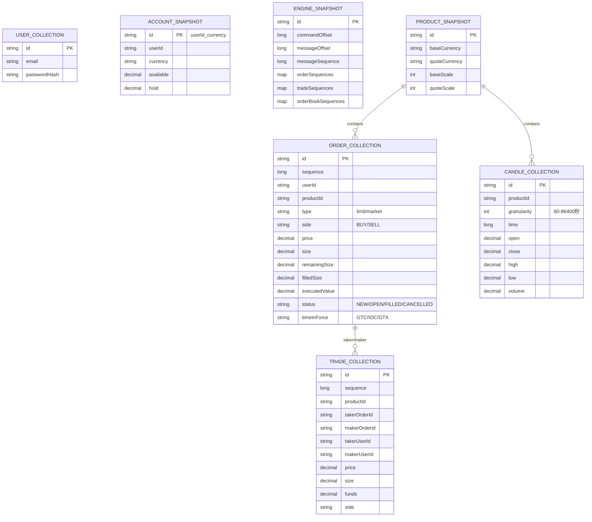
```mermaid
erDiagram
    USER_COLLECTION {
        string id PK
        string email
        string passwordHash
    }

    ORDER_COLLECTION {
        string id PK
        long sequence
        string userId
        string productId
        string type "limit/market"
        string side "BUY/SELL"
        decimal price
        decimal size
        decimal remainingSize
        decimal filledSize
        decimal executedValue
        string status "NEW/OPEN/FILLED/CANCELLED"
        string timeInForce "GTC/IOC/GTX"
    }

    TRADE_COLLECTION {
        string id PK
        long sequence
        string productId
        string takerOrderId
        string makerOrderId
        string takerUserId
        string makerUserId
        decimal price
        decimal size
        decimal funds
        string side
    }

    ACCOUNT_SNAPSHOT {
        string id PK "userId_currency"
        string userId
        string currency
        decimal available
        decimal hold
    }

    ENGINE_SNAPSHOT {
        string id PK
        long commandOffset
        long messageOffset
        long messageSequence
        map orderSequences
        map tradeSequences
        map orderBookSequences
    }

    CANDLE_COLLECTION {
        string id PK
        string productId
        int granularity "60-86400秒"
        long time
        decimal open
        decimal close
        decimal high
        decimal low
        decimal volume
    }

    PRODUCT_SNAPSHOT {
        string id PK
        string baseCurrency
        string quoteCurrency
        int baseScale
        int quoteScale
    }

    ORDER_COLLECTION ||--o{ TRADE_COLLECTION : "taker/maker"
    PRODUCT_SNAPSHOT ||--o{ ORDER_COLLECTION : contains
    PRODUCT_SNAPSHOT ||--o{ CANDLE_COLLECTION : contains
```

---

## 9. WebSocket 实时推送系统

### 9.1 推送架构

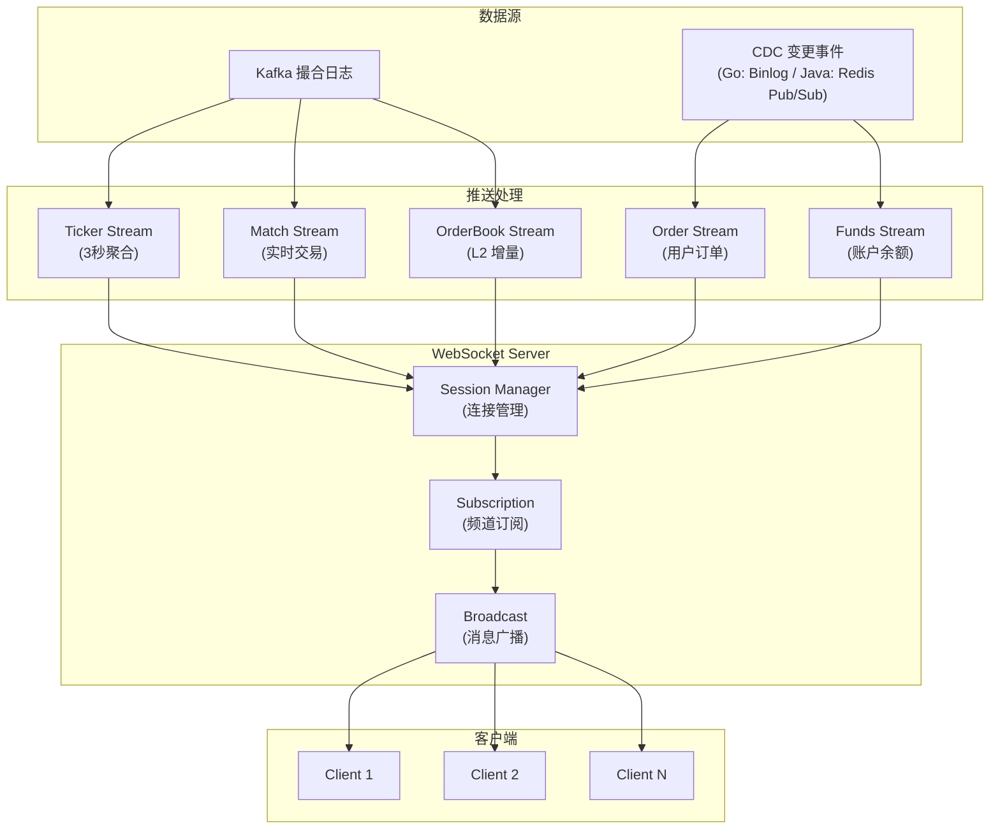
```mermaid
graph TB
    subgraph 数据源
        Kafka["Kafka 撮合日志"]
        CDC["CDC 变更事件<br/>(Go: Binlog / Java: Redis Pub/Sub)"]
    end

    subgraph 推送处理
        TickerS["Ticker Stream<br/>(3秒聚合)"]
        MatchS["Match Stream<br/>(实时交易)"]
        OBS["OrderBook Stream<br/>(L2 增量)"]
        OrderS["Order Stream<br/>(用户订单)"]
        FundsS["Funds Stream<br/>(账户余额)"]
    end

    subgraph WebSocket Server
        SM["Session Manager<br/>(连接管理)"]
        Sub["Subscription<br/>(频道订阅)"]
        Broadcast["Broadcast<br/>(消息广播)"]
    end

    subgraph 客户端
        C1["Client 1"]
        C2["Client 2"]
        C3["Client N"]
    end

    Kafka --> TickerS
    Kafka --> MatchS
    Kafka --> OBS
    CDC --> OrderS
    CDC --> FundsS

    TickerS --> SM
    MatchS --> SM
    OBS --> SM
    OrderS --> SM
    FundsS --> SM

    SM --> Sub
    Sub --> Broadcast
    Broadcast --> C1
    Broadcast --> C2
    Broadcast --> C3
```

### 9.2 WebSocket 频道

| 频道 | 数据内容 | 推送频率 |
|------|---------|---------|
| `level2:{productId}` | 订单簿 L2 深度变更 | 实时（增量 + 全量快照） |
| `match:{productId}` | 最新成交 | 实时 |
| `ticker:{productId}` | 24h 行情（开高低收量） | 每 3 秒 |
| `order:{productId}:{userId}` | 用户订单状态变更 | 实时 |
| `funds:{userId}` | 用户账户余额变更 | 实时 |
| `candles:{productId}` | K 线更新（Java 版） | 实时 |

### 9.3 前端 WebSocket 消息处理

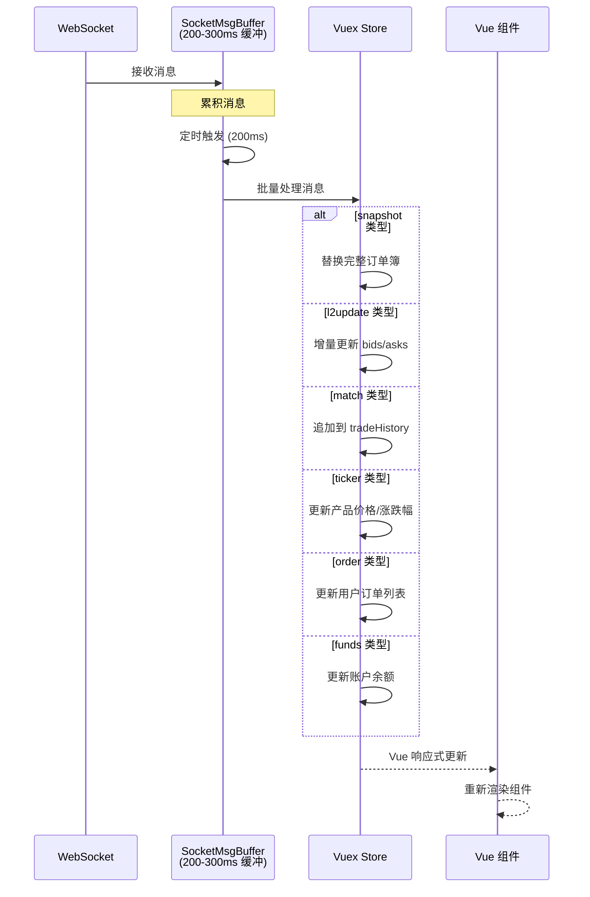
```mermaid
sequenceDiagram
    participant WS as WebSocket
    participant Buffer as SocketMsgBuffer<br/>(200-300ms 缓冲)
    participant Store as Vuex Store
    participant UI as Vue 组件

    WS->>Buffer: 接收消息
    Note over Buffer: 累积消息
    Buffer->>Buffer: 定时触发 (200ms)
    Buffer->>Store: 批量处理消息

    alt snapshot 类型
        Store->>Store: 替换完整订单簿
    else l2update 类型
        Store->>Store: 增量更新 bids/asks
    else match 类型
        Store->>Store: 追加到 tradeHistory
    else ticker 类型
        Store->>Store: 更新产品价格/涨跌幅
    else order 类型
        Store->>Store: 更新用户订单列表
    else funds 类型
        Store->>Store: 更新账户余额
    end

    Store-->>UI: Vue 响应式更新
    UI-->>UI: 重新渲染组件
```

---

## 10. 前端架构详解

### 10.1 前端组件架构

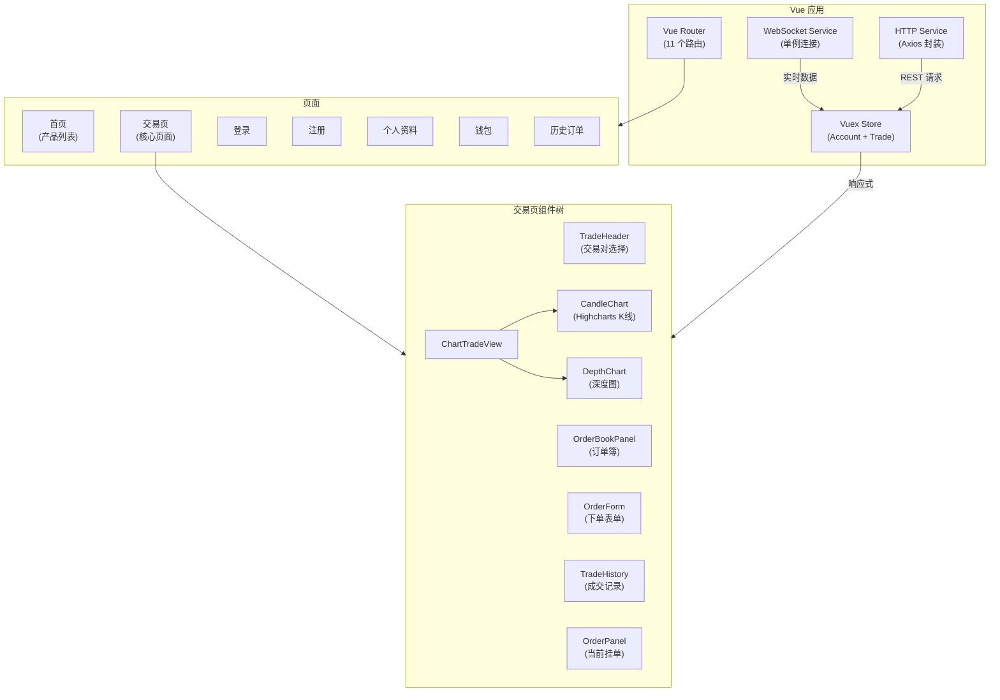
```mermaid
graph TB
    subgraph App["Vue 应用"]
        Router["Vue Router<br/>(11 个路由)"]
        Store["Vuex Store<br/>(Account + Trade)"]
        WS["WebSocket Service<br/>(单例连接)"]
        HTTP["HTTP Service<br/>(Axios 封装)"]
    end

    subgraph Pages["页面"]
        Home["首页<br/>(产品列表)"]
        Trade["交易页<br/>(核心页面)"]
        Signin["登录"]
        Signup["注册"]
        Profile["个人资料"]
        Wallet["钱包"]
        Orders["历史订单"]
    end

    subgraph TradePage["交易页组件树"]
        Header["TradeHeader<br/>(交易对选择)"]
        Chart["ChartTradeView"]
        Candle["CandleChart<br/>(Highcharts K线)"]
        Depth["DepthChart<br/>(深度图)"]
        OBPanel["OrderBookPanel<br/>(订单簿)"]
        OrderForm["OrderForm<br/>(下单表单)"]
        TradeHist["TradeHistory<br/>(成交记录)"]
        UserOrders["OrderPanel<br/>(当前挂单)"]
    end

    Router --> Pages
    Trade --> TradePage
    Chart --> Candle
    Chart --> Depth

    WS -->|"实时数据"| Store
    HTTP -->|"REST 请求"| Store
    Store -->|"响应式"| TradePage
```

### 10.2 前端数据流

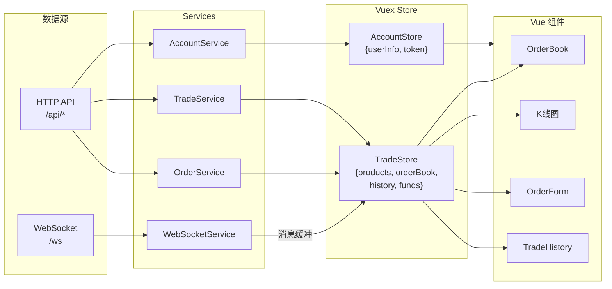
```mermaid
graph LR
    subgraph 数据源
        HTTP_API["HTTP API<br/>/api/*"]
        WS_Conn["WebSocket<br/>/ws"]
    end

    subgraph Services
        AccSvc["AccountService"]
        TradeSvc["TradeService"]
        OrderSvc["OrderService"]
        WSSvc["WebSocketService"]
    end

    subgraph Store["Vuex Store"]
        AccStore["AccountStore<br/>{userInfo, token}"]
        TradeStore["TradeStore<br/>{products, orderBook,<br/>history, funds}"]
    end

    subgraph Components["Vue 组件"]
        OB["OrderBook"]
        KC["K线图"]
        OF["OrderForm"]
        TH["TradeHistory"]
    end

    HTTP_API --> AccSvc
    HTTP_API --> TradeSvc
    HTTP_API --> OrderSvc
    WS_Conn --> WSSvc

    AccSvc --> AccStore
    TradeSvc --> TradeStore
    OrderSvc --> TradeStore
    WSSvc -->|"消息缓冲"| TradeStore

    AccStore --> Components
    TradeStore --> OB
    TradeStore --> KC
    TradeStore --> OF
    TradeStore --> TH
```

### 10.3 前端路由表

| 路径 | 页面 | 需要登录 | 说明 |
|------|------|---------|------|
| `/` | HomePage | 否 | 产品列表首页 |
| `/trade/:id` | TradePage | 否 | 交易页面（核心） |
| `/account/signin` | SigninPage | 否 | 登录 |
| `/account/signup` | SignupPage | 否 | 注册 |
| `/account/profile` | ProfilePage | 是 | 个人资料 |
| `/account/wallet` | WalletPage | 是 | 钱包余额 |
| `/account/wallet/deposit` | DepositPage | 是 | 充值 |
| `/account/wallet/withdrawal` | WithdrawalPage | 是 | 提现 |
| `/account/order` | OrderPage | 是 | 历史订单 |
| `/account/forgot` | ForgotPage | 否 | 忘记密码 |

---

## 11. REST API 接口

### 11.1 公共接口

| 方法 | 路径 | 说明 |
|------|------|------|
| POST | `/api/users` | 用户注册 |
| POST | `/api/users/accessToken` | 用户登录（返回 JWT） |
| GET | `/api/products` | 获取所有交易对 |
| GET | `/api/products/{id}/trades` | 获取最近成交 |
| GET | `/api/products/{id}/candles` | 获取 K 线数据 |
| GET | `/api/configs` | 获取系统配置 |

### 11.2 需要认证的接口

| 方法 | 路径 | 说明 |
|------|------|------|
| POST | `/api/orders` | 下单 |
| DELETE | `/api/orders/{id}` | 取消订单 |
| DELETE | `/api/orders?productId=X` | 批量取消 |
| GET | `/api/orders` | 查询用户订单（分页） |
| GET | `/api/accounts` | 查询账户余额 |
| GET | `/api/users/self` | 获取用户信息 |
| POST | `/api/users/password` | 修改密码 |
| GET | `/api/wallets/{currency}/address` | 获取充值地址 |
| POST | `/api/wallets/{currency}/withdrawal` | 提现 |

### 11.3 下单请求格式

```json
{
  "productId": "BTC-USDT",
  "side": "buy",
  "type": "limit",
  "price": "50000.00",
  "size": "0.1"
}
```

---

## 12. 数据处理 Worker 管线

### 12.1 Go 版 Worker 管线

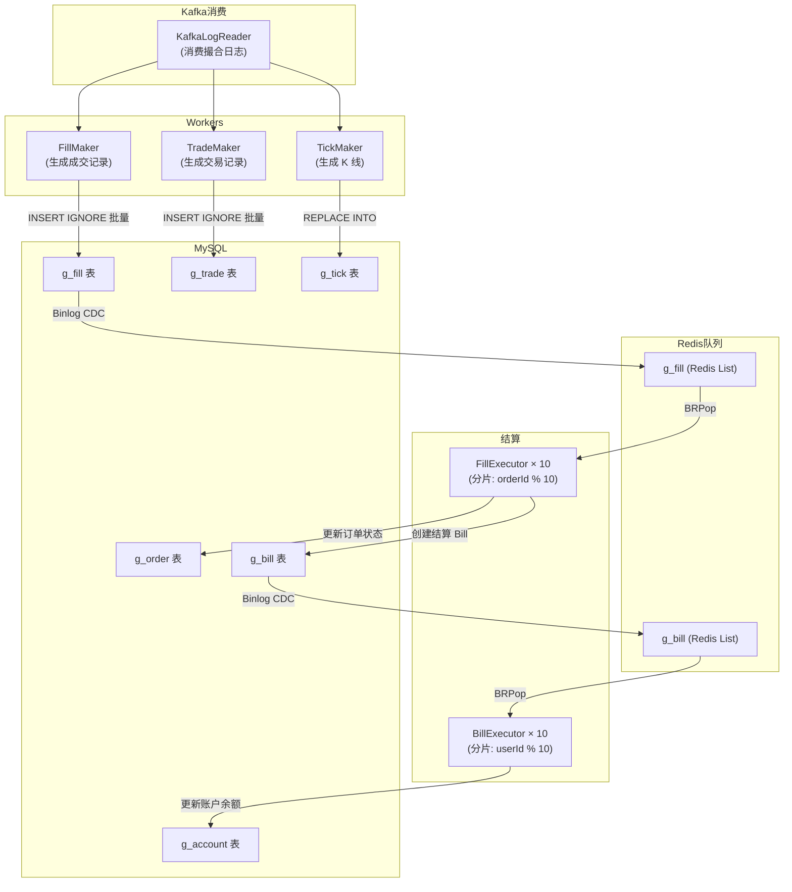
```mermaid
graph TB
    subgraph Kafka消费
        KLR["KafkaLogReader<br/>(消费撮合日志)"]
    end

    subgraph Workers
        FM["FillMaker<br/>(生成成交记录)"]
        TM["TradeMaker<br/>(生成交易记录)"]
        TKM["TickMaker<br/>(生成 K 线)"]
    end

    subgraph Redis队列
        RF["g_fill (Redis List)"]
        RB["g_bill (Redis List)"]
    end

    subgraph 结算
        FE["FillExecutor × 10<br/>(分片: orderId % 10)"]
        BE["BillExecutor × 10<br/>(分片: userId % 10)"]
    end

    subgraph MySQL
        DB_Fill["g_fill 表"]
        DB_Trade["g_trade 表"]
        DB_Tick["g_tick 表"]
        DB_Order["g_order 表"]
        DB_Account["g_account 表"]
        DB_Bill["g_bill 表"]
    end

    KLR --> FM
    KLR --> TM
    KLR --> TKM

    FM -->|"INSERT IGNORE 批量"| DB_Fill
    TM -->|"INSERT IGNORE 批量"| DB_Trade
    TKM -->|"REPLACE INTO"| DB_Tick

    DB_Fill -->|"Binlog CDC"| RF
    DB_Bill -->|"Binlog CDC"| RB

    RF -->|"BRPop"| FE
    RB -->|"BRPop"| BE

    FE -->|"更新订单状态"| DB_Order
    FE -->|"创建结算 Bill"| DB_Bill
    BE -->|"更新账户余额"| DB_Account
```

### 12.2 Java 版 Consumer Thread 管线

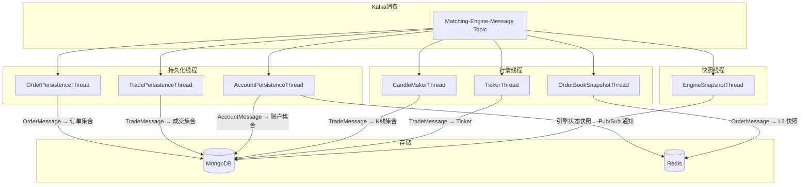
```mermaid
graph TB
    subgraph Kafka消费
        MSG["Matching-Engine-Message Topic"]
    end

    subgraph 持久化线程
        OP["OrderPersistenceThread"]
        TP["TradePersistenceThread"]
        AP["AccountPersistenceThread"]
    end

    subgraph 行情线程
        CM["CandleMakerThread"]
        TT["TickerThread"]
        OBS["OrderBookSnapshotThread"]
    end

    subgraph 快照线程
        ES["EngineSnapshotThread"]
    end

    subgraph 存储
        MongoDB[("MongoDB")]
        Redis[("Redis")]
    end

    MSG --> OP
    MSG --> TP
    MSG --> AP
    MSG --> CM
    MSG --> TT
    MSG --> OBS
    MSG --> ES

    OP -->|"OrderMessage → 订单集合"| MongoDB
    TP -->|"TradeMessage → 成交集合"| MongoDB
    AP -->|"AccountMessage → 账户集合"| MongoDB
    AP -->|"Pub/Sub 通知"| Redis
    CM -->|"TradeMessage → K线集合"| MongoDB
    TT -->|"TradeMessage → Ticker"| MongoDB
    OBS -->|"OrderMessage → L2 快照"| Redis
    ES -->|"引擎状态快照"| MongoDB
```

---

## 13. K 线生成机制

### 13.1 Go 版 TickMaker

| 粒度（分钟） | 1 | 3 | 5 | 15 | 30 | 60 | 120 | 240 | 360 | 720 | 1440 |
|-------------|---|---|---|----|----|----|----|-----|-----|-----|------|
| 说明 | 1分 | 3分 | 5分 | 15分 | 30分 | 1时 | 2时 | 4时 | 6时 | 12时 | 1天 |

### 13.2 Java 版 CandleMaker

| 粒度（秒） | 60 | 300 | 900 | 1800 | 3600 | 21600 | 86400 |
|-----------|----|----|-----|------|------|-------|-------|
| 说明 | 1分 | 5分 | 15分 | 30分 | 1时 | 6时 | 1天 |

**生成逻辑：**
1. 消费 MatchLog/TradeMessage
2. 将成交时间对齐到粒度边界（`time - time % granularity`）
3. 更新 OHLCV：Open（首笔）、High（最高）、Low（最低）、Close（最新）、Volume（累加）
4. 批量 Upsert 到数据库

---

## 14. 启动引导流程

### 14.1 Go 版启动流程

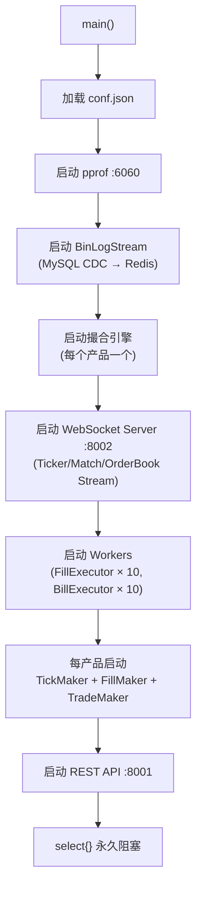
```mermaid
graph TD
    Start["main()"] --> LoadConf["加载 conf.json"]
    LoadConf --> PProf["启动 pprof :6060"]
    PProf --> BinLog["启动 BinLogStream<br/>(MySQL CDC → Redis)"]
    BinLog --> Engines["启动撮合引擎<br/>(每个产品一个)"]
    Engines --> WSServer["启动 WebSocket Server :8002<br/>(Ticker/Match/OrderBook Stream)"]
    WSServer --> Workers["启动 Workers<br/>(FillExecutor × 10, BillExecutor × 10)"]
    Workers --> PerProduct["每产品启动<br/>TickMaker + FillMaker + TradeMaker"]
    PerProduct --> RESTServer["启动 REST API :8001"]
    RESTServer --> Block["select{} 永久阻塞"]
```

### 14.2 Java 版启动流程

```mermaid
graph TD
    Start["Application.main()"] --> Spring["Spring Boot 启动"]
    Spring --> Config["AppConfiguration 加载<br/>(Kafka, MongoDB, Redis)"]
    Config --> Bootstrap["Bootstrap.run()"]
    Bootstrap --> Engine["启动 MatchingEngineThread<br/>(恢复快照 → 消费命令)"]
    Engine --> Persist["启动持久化线程<br/>(Order/Trade/Account)"]
    Persist --> Market["启动行情线程<br/>(Candle/Ticker/OrderBook)"]
    Market --> Snapshot["启动 EngineSnapshotThread"]
    Snapshot --> Feed["WebSocket FeedMessageListener<br/>(Redis Pub/Sub → WS 推送)"]
    Feed --> REST["Spring MVC REST API :8080"]
```

---

## 15. 前端启动与初始化流程

```mermaid
sequenceDiagram
    participant Browser as 浏览器
    participant Main as main.ts
    participant App as App.init()
    participant FW as Framework
    participant Store as StoreService
    participant WS as WebSocket

    Browser->>Main: 加载 app.js
    Main->>Main: 注册所有 Page 和 Component
    Main->>FW: initModules(pages, components)
    FW->>FW: 安装 Vue Router + Vuex
    Main->>App: init(callback)
    App->>Store: Account.current()<br/>(GET /api/users/self)
    Store-->>App: 用户信息（或未登录）
    App->>Store: Trade.loadProducts()<br/>(GET /api/products)
    Store-->>App: 产品列表
    App->>WS: connect()
    WS-->>App: 连接建立
    App->>WS: subscribe(所有产品 Ticker)
    App->>FW: bootstrap()
    FW->>FW: 注册所有 Vue 组件
    FW->>FW: 创建 Router 实例
    FW->>Browser: 挂载到 #App
```

---

## 16. 部署架构

```mermaid
graph TB
    subgraph 基础设施
        Kafka["Apache Kafka<br/>(消息队列)"]
        MySQL["MySQL<br/>(Go 版)"]
        MongoDB["MongoDB 副本集<br/>(Java 版)"]
        Redis["Redis<br/>(缓存 + Pub/Sub)"]
    end

    subgraph Go版部署
        G_Binary["gitbitex-spot 二进制<br/>(单进程, 多 goroutine)"]
        G_REST[":8001 REST API"]
        G_WS[":8002 WebSocket"]
        G_PProf[":6060 pprof"]
    end

    subgraph Java版部署
        J_Docker["Docker 容器<br/>(JIB + OpenJDK 14)"]
        J_REST[":8080 REST + WS"]
        J_Metrics[":7002 Prometheus"]
    end

    subgraph 前端部署
        Nginx["Nginx / CDN"]
        Static["静态文件<br/>(index.html + app.js + app.css)"]
    end

    G_Binary --> MySQL
    G_Binary --> Redis
    G_Binary --> Kafka
    G_Binary --> G_REST
    G_Binary --> G_WS

    J_Docker --> MongoDB
    J_Docker --> Redis
    J_Docker --> Kafka
    J_Docker --> J_REST

    Nginx --> Static
    Static -->|"API 代理"| G_REST
    Static -->|"WS 代理"| G_WS
```

---

## 17. 关键设计模式总结

| 设计模式 | 应用场景 | Go 版 | Java 版 |
|---------|---------|-------|---------|
| **事件溯源 (Event Sourcing)** | 撮合日志作为唯一事实源 | MatchLog 不可变日志 | Kafka Message 不可变消息 |
| **CQRS** | 读写分离 | 写入 Kafka，读取 MySQL | 写入 Kafka，读取 MongoDB |
| **CDC (变更数据捕获)** | 数据库变更推送 | MySQL Binlog → Redis | Redis Pub/Sub 直推 |
| **快照恢复** | 引擎崩溃恢复 | Redis 快照 + Kafka 重放 | MongoDB 事务快照 + Kafka 重放 |
| **分片处理** | Worker 并行 | orderId/userId % N 分片 | Kafka 分区消费 |
| **滑动窗口去重** | 防止重复订单 | Bitmap 10000 容量窗口 | Kafka 幂等 Producer |
| **观察者模式** | 日志分发 | LogReader 注册多个 Observer | Kafka Consumer Group 多消费者 |
| **条带化执行** | WS 消息有序投递 | 直接推送 | StripedExecutorService 保序 |

---

## 18. 性能与可靠性考量

### 18.1 性能优化点

| 优化项 | 说明 |
|--------|------|
| **红黑树订单簿** | O(log n) 价格层级插入/删除/查找 |
| **批量写入** | Fill/Trade/Tick 批量 100-1000 条写入 |
| **消息缓冲** | 前端 200-300ms 缓冲减少 DOM 更新 |
| **LRU 缓存** | Go 版 FillExecutor 缓存已结算订单跳过重复处理 |
| **Zstandard 压缩** | Java 版 Kafka 消息压缩减少网络开销 |
| **L2 增量推送** | 只推送订单簿变化部分而非全量 |

### 18.2 可靠性保障

| 保障项 | 说明 |
|--------|------|
| **快照 + 重放** | 引擎崩溃后从快照恢复，重放增量日志 |
| **INSERT IGNORE** | Go 版通过唯一键约束防止重复 Fill/Trade |
| **Kafka acks=all** | Java 版消息写入所有副本后才确认 |
| **两阶段结算** | Go 版 Bill 先创建后结算，确保资金安全 |
| **MongoDB 事务** | Java 版快照保存使用事务保证原子性 |
| **线程自动重启** | Java 版 UncaughtExceptionHandler 3 秒后重启崩溃线程 |
