# GitBitEx 加密货币交易所后端：Go 版 vs Java 版 详细对比

## 目录

1. [概述](#1-概述)
2. [架构对比](#2-架构对比)
3. [撮合引擎对比](#3-撮合引擎对比)
4. [余额管理对比](#4-余额管理对比)
5. [订单簿对比](#5-订单簿对比)
6. [Kafka 策略对比](#6-kafka-策略对比)
7. [数据库对比](#7-数据库对比)
8. [结算流程对比](#8-结算流程对比)
9. [实时推送对比](#9-实时推送对比)
10. [Worker/线程模型对比](#10-worker线程模型对比)
11. [快照与恢复对比](#11-快照与恢复对比)
12. [WebSocket 对比](#12-websocket-对比)
13. [监控与运维对比](#13-监控与运维对比)
14. [K 线与行情对比](#14-k-线与行情对比)
15. [优劣势总结](#15-优劣势总结)
16. [迁移建议](#16-迁移建议)

---

## 1. 概述

### 1.1 项目背景

GitBitEx 是一个开源的加密货币现货交易所后端实现。项目经历了从 **Go 语言（gitbitex-spot）** 到 **Java 语言（gitbitex-new）** 的重写。两个版本在核心功能上一致——都实现了订单撮合、账户管理、行情推送、K 线生成等交易所核心功能——但在架构设计、技术选型和实现细节上存在显著差异。

### 1.2 重写动因

| 维度 | Go 版本的局限 | Java 版本的改进 |
|------|-------------|---------------|
| **生态成熟度** | Go 在金融领域的库和框架相对较少 | Spring Boot 生态极其成熟，企业级支持完善 |
| **并发模型** | goroutine + channel 模型灵活但复杂度高 | 线程模型更直观，异常处理更完善 |
| **数据库** | MySQL 单点瓶颈，Binlog CDC 链路较长 | MongoDB 天然支持水平扩展与文档模型 |
| **容错能力** | 无线程自动重启机制 | UncaughtExceptionHandler 自动重启崩溃线程 |
| **部署** | 需手动编译和配置 | Docker + JIB 一键容器化部署 |
| **TimeInForce** | 仅支持基础限价/市价单 | 支持 GTC、IOC、GTX 多种时间策略 |
| **监控** | 仅 pprof 基础性能分析 | Micrometer + Prometheus 企业级监控 |

### 1.3 高层对比总览

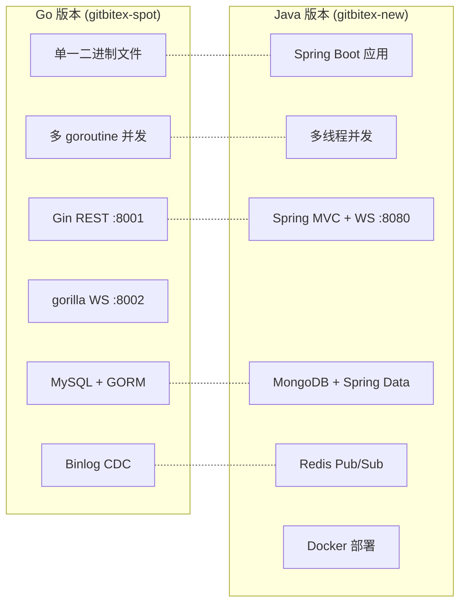
```mermaid
graph LR
    subgraph "Go 版本 (gitbitex-spot)"
        G1[单一二进制文件]
        G2[多 goroutine 并发]
        G3[Gin REST :8001]
        G4[gorilla WS :8002]
        G5[MySQL + GORM]
        G6[Binlog CDC]
    end

    subgraph "Java 版本 (gitbitex-new)"
        J1[Spring Boot 应用]
        J2[多线程并发]
        J3[Spring MVC + WS :8080]
        J4[MongoDB + Spring Data]
        J5[Redis Pub/Sub]
        J6[Docker 部署]
    end

    G1 -.- J1
    G2 -.- J2
    G3 -.- J3
    G5 -.- J4
    G6 -.- J5
```

---

## 2. 架构对比

### 2.1 Go 版本架构

Go 版本采用**单一二进制、多端口**的部署模式。REST API 和 WebSocket 运行在不同端口上，通过 Kafka 和 MySQL Binlog 实现组件间的异步通信。

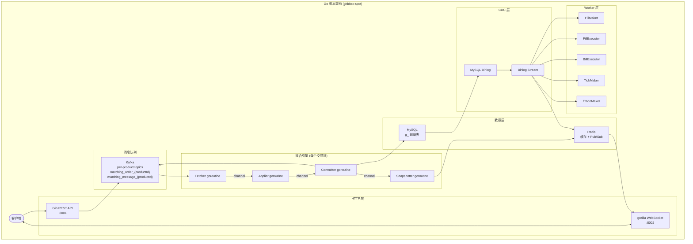
```mermaid
graph TB
    subgraph "Go 版本架构 (gitbitex-spot)"
        Client([客户端])

        subgraph "HTTP 层"
            GinREST["Gin REST API<br/>:8001"]
            GorillaWS["gorilla WebSocket<br/>:8002"]
        end

        subgraph "消息队列"
            KafkaGo["Kafka<br/>per-product topics<br/>matching_order_{productId}<br/>matching_message_{productId}"]
        end

        subgraph "撮合引擎 (每个交易对)"
            Fetcher["Fetcher goroutine"]
            Applier["Applier goroutine"]
            Committer["Committer goroutine"]
            Snapshotter["Snapshotter goroutine"]
        end

        subgraph "数据层"
            MySQL["MySQL<br/>g_ 前缀表"]
            RedisGo["Redis<br/>缓存 + Pub/Sub"]
        end

        subgraph "CDC 层"
            Binlog["MySQL Binlog"]
            BinlogStream["Binlog Stream"]
        end

        subgraph "Worker 层"
            FillMaker["FillMaker"]
            FillExecutor["FillExecutor"]
            BillExecutor["BillExecutor"]
            TickMaker["TickMaker"]
            TradeMaker["TradeMaker"]
        end

        Client --> GinREST
        Client <--> GorillaWS
        GinREST --> KafkaGo
        KafkaGo --> Fetcher
        Fetcher -->|channel| Applier
        Applier -->|channel| Committer
        Committer -->|channel| Snapshotter
        Committer --> KafkaGo
        Committer --> MySQL
        Snapshotter --> RedisGo
        MySQL --> Binlog
        Binlog --> BinlogStream
        BinlogStream --> FillMaker
        BinlogStream --> FillExecutor
        BinlogStream --> BillExecutor
        BinlogStream --> TickMaker
        BinlogStream --> TradeMaker
        BinlogStream --> RedisGo
        RedisGo --> GorillaWS
    end
```

### 2.2 Java 版本架构

Java 版本采用 **Spring Boot 单端口** 部署模式，REST API 和 WebSocket 统一在 8080 端口。使用 Kafka 全局 topic 和 Redis Pub/Sub 实现组件间通信。

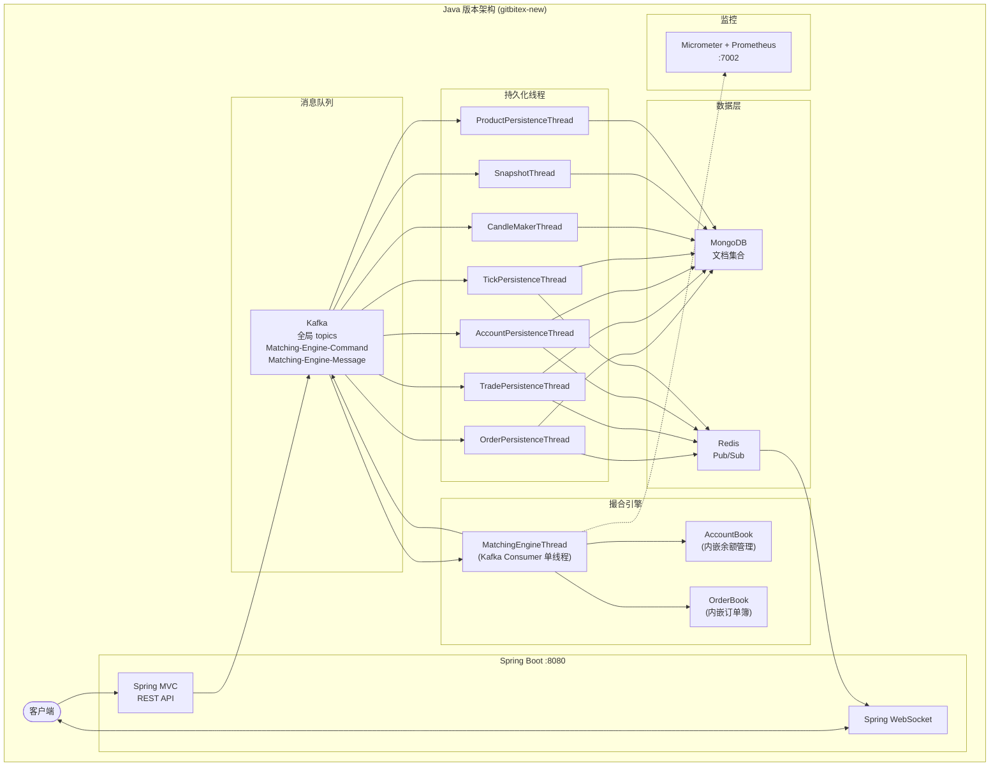
```mermaid
graph TB
    subgraph "Java 版本架构 (gitbitex-new)"
        ClientJ([客户端])

        subgraph "Spring Boot :8080"
            SpringMVC["Spring MVC<br/>REST API"]
            SpringWS["Spring WebSocket"]
        end

        subgraph "消息队列"
            KafkaJ["Kafka<br/>全局 topics<br/>Matching-Engine-Command<br/>Matching-Engine-Message"]
        end

        subgraph "撮合引擎"
            MatchThread["MatchingEngineThread<br/>(Kafka Consumer 单线程)"]
            AccountBook["AccountBook<br/>(内嵌余额管理)"]
            OrderBookJ["OrderBook<br/>(内嵌订单簿)"]
        end

        subgraph "数据层"
            MongoDB["MongoDB<br/>文档集合"]
            RedisJ["Redis<br/>Pub/Sub"]
        end

        subgraph "持久化线程"
            OrderPersist["OrderPersistenceThread"]
            TradePersist["TradePersistenceThread"]
            AccountPersist["AccountPersistenceThread"]
            TickPersist["TickPersistenceThread"]
            CandlePersist["CandleMakerThread"]
            SnapshotThread["SnapshotThread"]
            ProductPersist["ProductPersistenceThread"]
        end

        subgraph "监控"
            Micrometer["Micrometer + Prometheus<br/>:7002"]
        end

        ClientJ --> SpringMVC
        ClientJ <--> SpringWS
        SpringMVC --> KafkaJ
        KafkaJ --> MatchThread
        MatchThread --> AccountBook
        MatchThread --> OrderBookJ
        MatchThread --> KafkaJ
        KafkaJ --> OrderPersist
        KafkaJ --> TradePersist
        KafkaJ --> AccountPersist
        KafkaJ --> TickPersist
        KafkaJ --> CandlePersist
        KafkaJ --> SnapshotThread
        KafkaJ --> ProductPersist
        OrderPersist --> MongoDB
        TradePersist --> MongoDB
        AccountPersist --> MongoDB
        TickPersist --> MongoDB
        CandlePersist --> MongoDB
        SnapshotThread --> MongoDB
        ProductPersist --> MongoDB
        OrderPersist --> RedisJ
        TradePersist --> RedisJ
        AccountPersist --> RedisJ
        TickPersist --> RedisJ
        RedisJ --> SpringWS
        MatchThread -.-> Micrometer
    end
```

### 2.3 架构差异对比表

| 维度 | Go 版本 (gitbitex-spot) | Java 版本 (gitbitex-new) |
|------|------------------------|--------------------------|
| **运行模型** | 单一二进制文件 | Spring Boot JAR / Docker |
| **并发模型** | goroutine + channel | Thread + Kafka Consumer |
| **HTTP 框架** | Gin | Spring MVC |
| **WebSocket** | gorilla/websocket，独立端口 :8002 | Spring WebSocket，与 REST 共用 :8080 |
| **REST 端口** | :8001 | :8080 |
| **组件通信** | Kafka + MySQL Binlog CDC | Kafka + Redis Pub/Sub |
| **配置方式** | conf.json | application.properties |
| **端口数量** | 3 个（REST、WS、pprof） | 2 个（主应用、Prometheus） |

---

## 3. 撮合引擎对比

### 3.1 Go 版本：四 goroutine 流水线

Go 版本的撮合引擎为**每个交易对**创建一个独立的引擎实例，每个实例包含 4 个 goroutine，通过 channel 串联成流水线：

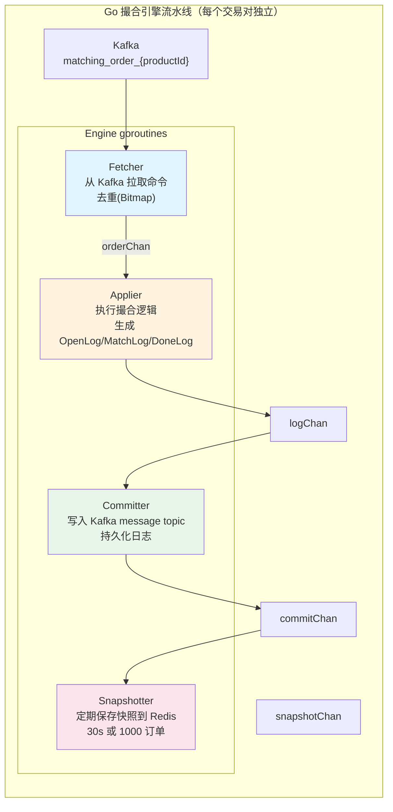
```mermaid
graph LR
    subgraph "Go 撮合引擎流水线（每个交易对独立）"
        KafkaTopic["Kafka<br/>matching_order_{productId}"]

        subgraph "Engine goroutines"
            F["Fetcher<br/>从 Kafka 拉取命令<br/>去重(Bitmap)"]
            A["Applier<br/>执行撮合逻辑<br/>生成 OpenLog/MatchLog/DoneLog"]
            C["Committer<br/>写入 Kafka message topic<br/>持久化日志"]
            S["Snapshotter<br/>定期保存快照到 Redis<br/>30s 或 1000 订单"]
        end

        CH1["logChan"]
        CH2["commitChan"]
        CH3["snapshotChan"]

        KafkaTopic --> F
        F -->|"orderChan"| A
        A --> CH1
        CH1 --> C
        C --> CH2
        CH2 --> S

        style F fill:#e1f5fe
        style A fill:#fff3e0
        style C fill:#e8f5e9
        style S fill:#fce4ec
    end
```

**执行流程详细说明：**

1. **Fetcher**：从 Kafka 的 `matching_order_{productId}` topic 消费订单命令，使用 Bitmap 滑动窗口（容量 10000）进行去重，去重后通过 channel 发送给 Applier
2. **Applier**：接收订单，执行撮合逻辑，生成三种日志类型（OpenLog、MatchLog、DoneLog），通过 channel 发送给 Committer
3. **Committer**：将日志写入 Kafka 的 `matching_message_{productId}` topic，并持久化到 MySQL，通过 channel 通知 Snapshotter
4. **Snapshotter**：定期（每 30 秒或每 1000 个订单）将订单簿快照保存到 Redis，设置 7 天 TTL

### 3.2 Java 版本：单线程命令循环

Java 版本使用**单个 MatchingEngineThread** 处理所有交易对的撮合请求，引擎内嵌了 AccountBook（余额管理）：

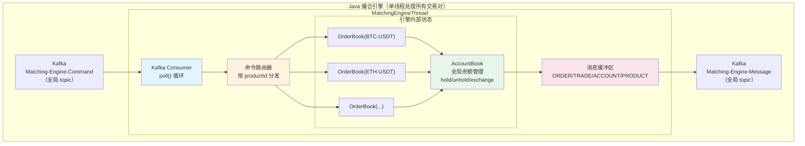
```mermaid
graph TB
    subgraph "Java 撮合引擎（单线程处理所有交易对）"
        KafkaCmd["Kafka<br/>Matching-Engine-Command<br/>（全局 topic）"]

        subgraph "MatchingEngineThread"
            Consumer["Kafka Consumer<br/>poll() 循环"]
            Router["命令路由器<br/>按 productId 分发"]

            subgraph "引擎内部状态"
                OB1["OrderBook(BTC-USDT)"]
                OB2["OrderBook(ETH-USDT)"]
                OBN["OrderBook(...)"]
                AB["AccountBook<br/>全局余额管理<br/>hold/unhold/exchange"]
            end

            MsgBuf["消息缓冲区<br/>ORDER/TRADE/ACCOUNT/PRODUCT"]
        end

        KafkaMsg["Kafka<br/>Matching-Engine-Message<br/>（全局 topic）"]

        KafkaCmd --> Consumer
        Consumer --> Router
        Router --> OB1
        Router --> OB2
        Router --> OBN
        OB1 --> AB
        OB2 --> AB
        OBN --> AB
        AB --> MsgBuf
        MsgBuf --> KafkaMsg

        style Consumer fill:#e1f5fe
        style Router fill:#fff3e0
        style AB fill:#e8f5e9
        style MsgBuf fill:#fce4ec
    end
```

**执行流程详细说明：**

1. **Consumer**：从全局 Kafka topic `Matching-Engine-Command` poll 消息
2. **命令路由**：按 productId 路由到对应的 OrderBook 实例
3. **撮合**：OrderBook 执行撮合，调用 AccountBook 进行 hold/unhold/exchange 操作
4. **输出**：生成 ORDER、TRADE、ACCOUNT、PRODUCT 四种消息类型，批量写入 `Matching-Engine-Message` topic

### 3.3 撮合引擎差异对比表

| 维度 | Go 版本 | Java 版本 |
|------|--------|----------|
| **引擎数量** | 每个交易对一个引擎实例 | 一个引擎处理所有交易对 |
| **并发模型** | 4 goroutine 流水线 | 单线程命令循环 |
| **goroutine/线程间通信** | Go channel | 无需通信（单线程） |
| **日志类型** | 3 种：OpenLog、MatchLog、DoneLog | 4 种：ORDER、TRADE、ACCOUNT、PRODUCT |
| **去重机制** | Bitmap 滑动窗口（10000 容量） | Kafka 幂等生产者（acks=all, retries=MAX） |
| **余额管理** | 引擎外部（REST 层预冻结） | 引擎内部（AccountBook） |
| **TimeInForce** | 不支持 | 支持 GTC、IOC、GTX |
| **吞吐优势** | 流水线并行，多交易对隔离 | 单线程简单，无锁竞争 |
| **故障恢复** | 无自动重启 | UncaughtExceptionHandler 3 秒后自动重启 |

---

## 4. 余额管理对比

### 4.1 Go 版本：外部余额管理（REST 层预冻结）

Go 版本中，余额的冻结操作在 REST 层完成——用户下单时，REST 接口先扣减可用余额并冻结对应金额，然后再将订单发送到 Kafka。撮合引擎本身不管理余额。

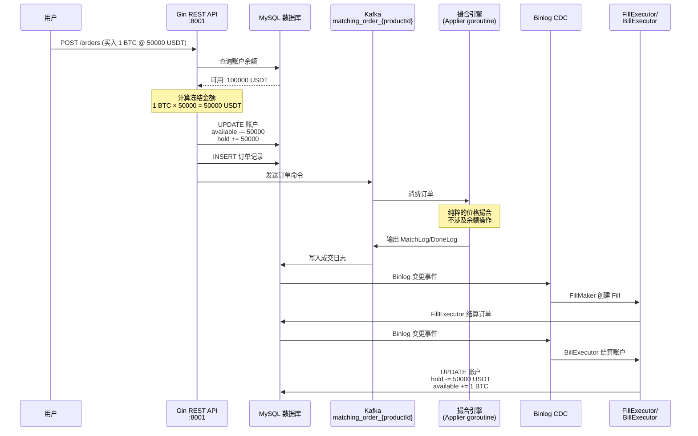
```mermaid
sequenceDiagram
    participant User as 用户
    participant REST as Gin REST API<br/>:8001
    participant MySQL as MySQL 数据库
    participant Kafka as Kafka<br/>matching_order_{productId}
    participant Engine as 撮合引擎<br/>(Applier goroutine)
    participant CDC as Binlog CDC
    participant Worker as FillExecutor/<br/>BillExecutor

    User->>REST: POST /orders (买入 1 BTC @ 50000 USDT)
    REST->>MySQL: 查询账户余额
    MySQL-->>REST: 可用: 100000 USDT

    Note over REST: 计算冻结金额:<br/>1 BTC × 50000 = 50000 USDT

    REST->>MySQL: UPDATE 账户<br/>available -= 50000<br/>hold += 50000
    REST->>MySQL: INSERT 订单记录
    REST->>Kafka: 发送订单命令

    Kafka->>Engine: 消费订单
    Note over Engine: 纯粹的价格撮合<br/>不涉及余额操作

    Engine->>Kafka: 输出 MatchLog/DoneLog
    Kafka->>MySQL: 写入成交日志
    MySQL->>CDC: Binlog 变更事件

    CDC->>Worker: FillMaker 创建 Fill
    Worker->>MySQL: FillExecutor 结算订单
    MySQL->>CDC: Binlog 变更事件
    CDC->>Worker: BillExecutor 结算账户
    Worker->>MySQL: UPDATE 账户<br/>hold -= 50000 USDT<br/>available += 1 BTC
```

### 4.2 Java 版本：内部余额管理（AccountBook）

Java 版本中，余额管理集成在撮合引擎内部的 AccountBook 中。下单时 REST 接口仅做参数校验，所有余额的 hold/unhold/exchange 操作都在撮合线程中原子性完成。

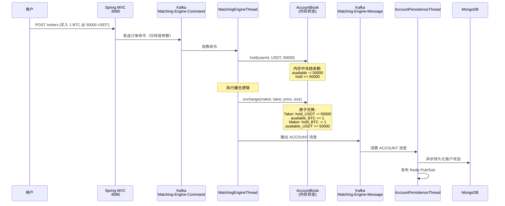
```mermaid
sequenceDiagram
    participant User as 用户
    participant REST as Spring MVC<br/>:8080
    participant Kafka as Kafka<br/>Matching-Engine-Command
    participant Engine as MatchingEngineThread
    participant AB as AccountBook<br/>(内存状态)
    participant KafkaOut as Kafka<br/>Matching-Engine-Message
    participant Persist as AccountPersistenceThread
    participant MongoDB as MongoDB

    User->>REST: POST /orders (买入 1 BTC @ 50000 USDT)
    REST->>Kafka: 发送订单命令（仅校验参数）

    Kafka->>Engine: 消费命令
    Engine->>AB: hold(userId, USDT, 50000)
    Note over AB: 内存中冻结余额:<br/>available -= 50000<br/>hold += 50000

    Note over Engine: 执行撮合逻辑

    Engine->>AB: exchange(maker, taker, price, size)
    Note over AB: 原子交换:<br/>Taker: hold_USDT -= 50000<br/>available_BTC += 1<br/>Maker: hold_BTC -= 1<br/>available_USDT += 50000

    Engine->>KafkaOut: 输出 ACCOUNT 消息

    KafkaOut->>Persist: 消费 ACCOUNT 消息
    Persist->>MongoDB: 异步持久化账户状态
    Persist->>Persist: 发布 Redis Pub/Sub
```

### 4.3 余额管理差异对比表

| 维度 | Go 版本 | Java 版本 |
|------|--------|----------|
| **冻结时机** | 下单时在 REST 层冻结 | 撮合时在引擎内冻结 |
| **余额状态存储** | MySQL 数据库（持久化） | AccountBook 内存（快照恢复） |
| **一致性保证** | 依赖 MySQL 事务 | 单线程顺序执行，天然一致 |
| **操作类型** | hold / unhold（外部） | hold / unhold / exchange（内部） |
| **结算方式** | 两阶段异步（CDC → Worker） | 引擎内即时交换 |
| **风险** | 预冻结可能浪费资金（订单被拒时需退回） | 引擎崩溃需从快照恢复 |
| **性能** | 每次下单都需数据库写操作 | 纯内存操作，高性能 |

---

## 5. 订单簿对比

### 5.1 Go 版本：TreeMap + Array

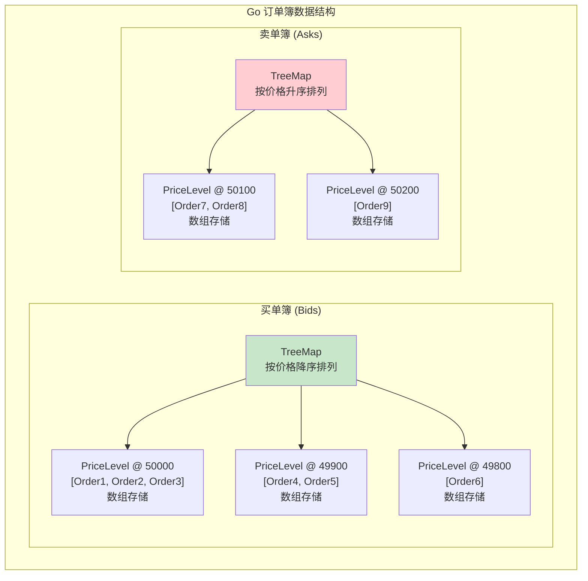
```mermaid
graph TB
    subgraph "Go 订单簿数据结构"
        subgraph "买单簿 (Bids)"
            BidTree["TreeMap<Price, PriceLevel><br/>按价格降序排列"]
            BPL1["PriceLevel @ 50000<br/>[Order1, Order2, Order3]<br/>数组存储"]
            BPL2["PriceLevel @ 49900<br/>[Order4, Order5]<br/>数组存储"]
            BPL3["PriceLevel @ 49800<br/>[Order6]<br/>数组存储"]
        end

        subgraph "卖单簿 (Asks)"
            AskTree["TreeMap<Price, PriceLevel><br/>按价格升序排列"]
            APL1["PriceLevel @ 50100<br/>[Order7, Order8]<br/>数组存储"]
            APL2["PriceLevel @ 50200<br/>[Order9]<br/>数组存储"]
        end

        BidTree --> BPL1
        BidTree --> BPL2
        BidTree --> BPL3
        AskTree --> APL1
        AskTree --> APL2
    end

    style BidTree fill:#c8e6c9
    style AskTree fill:#ffcdd2
```

**Go 版本特点：**
- 使用 TreeMap 按价格排序
- 每个价格级别使用**数组**存储该价位的所有订单
- 无独立的订单 ID → 订单的快速查找索引
- 不支持 TimeInForce

### 5.2 Java 版本：TreeMap + LinkedHashMap + HashMap

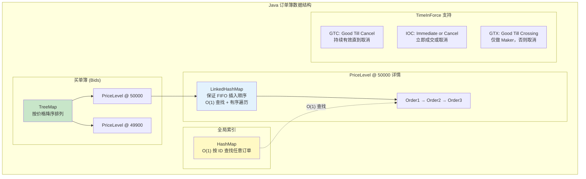
```mermaid
graph TB
    subgraph "Java 订单簿数据结构"
        subgraph "买单簿 (Bids)"
            JBidTree["TreeMap<Price, PriceLevel><br/>按价格降序排列"]
            JBPL1["PriceLevel @ 50000"]
            JBPL2["PriceLevel @ 49900"]
        end

        subgraph "PriceLevel @ 50000 详情"
            LHM["LinkedHashMap<OrderId, Order><br/>保证 FIFO 插入顺序<br/>O(1) 查找 + 有序遍历"]
            O1["Order1 → Order2 → Order3"]
        end

        subgraph "全局索引"
            HM["HashMap<OrderId, Order><br/>O(1) 按 ID 查找任意订单"]
        end

        subgraph "TimeInForce 支持"
            GTC["GTC: Good Till Cancel<br/>持续有效直到取消"]
            IOC["IOC: Immediate or Cancel<br/>立即成交或取消"]
            GTX["GTX: Good Till Crossing<br/>仅做 Maker，否则取消"]
        end

        JBidTree --> JBPL1
        JBidTree --> JBPL2
        JBPL1 --> LHM
        LHM --> O1
        HM -.->|"O(1) 查找"| O1
    end

    style JBidTree fill:#c8e6c9
    style LHM fill:#e3f2fd
    style HM fill:#fff9c4
```

### 5.3 订单簿差异对比表

| 维度 | Go 版本 | Java 版本 |
|------|--------|----------|
| **价格级别排序** | TreeMap | TreeMap |
| **同价位订单存储** | 数组（array/slice） | LinkedHashMap（FIFO 保证） |
| **订单 ID 查找** | 需遍历，O(n) | HashMap，O(1) |
| **FIFO 保证** | 数组天然有序，但删除 O(n) | LinkedHashMap，删除 O(1) |
| **TimeInForce** | 不支持 | GTC、IOC、GTX |
| **取消订单复杂度** | O(n)（需遍历数组） | O(1)（HashMap 直接定位） |
| **内存效率** | 较高（数组紧凑） | 较低（多层 Map 开销） |

---

## 6. Kafka 策略对比

### 6.1 Go 版本：Per-Product Topics

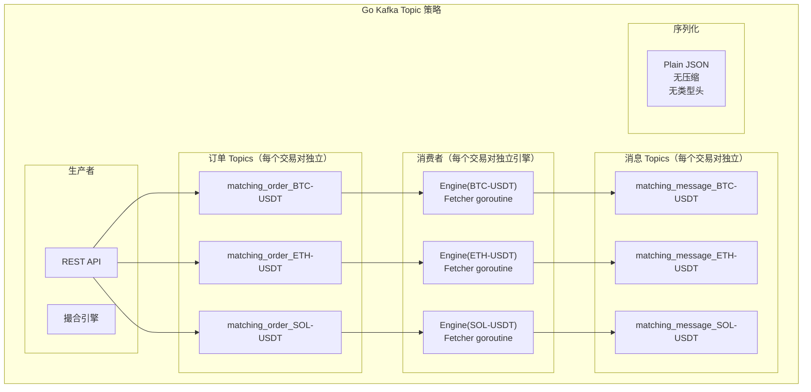
```mermaid
graph TB
    subgraph "Go Kafka Topic 策略"
        subgraph "生产者"
            REST_G["REST API"]
            Engine_G["撮合引擎"]
        end

        subgraph "订单 Topics（每个交易对独立）"
            T1["matching_order_BTC-USDT"]
            T2["matching_order_ETH-USDT"]
            T3["matching_order_SOL-USDT"]
        end

        subgraph "消息 Topics（每个交易对独立）"
            M1["matching_message_BTC-USDT"]
            M2["matching_message_ETH-USDT"]
            M3["matching_message_SOL-USDT"]
        end

        subgraph "消费者（每个交易对独立引擎）"
            E1["Engine(BTC-USDT)<br/>Fetcher goroutine"]
            E2["Engine(ETH-USDT)<br/>Fetcher goroutine"]
            E3["Engine(SOL-USDT)<br/>Fetcher goroutine"]
        end

        subgraph "序列化"
            JSON["Plain JSON<br/>无压缩<br/>无类型头"]
        end

        REST_G --> T1
        REST_G --> T2
        REST_G --> T3
        T1 --> E1
        T2 --> E2
        T3 --> E3
        E1 --> M1
        E2 --> M2
        E3 --> M3
    end
```

### 6.2 Java 版本：Global Shared Topics

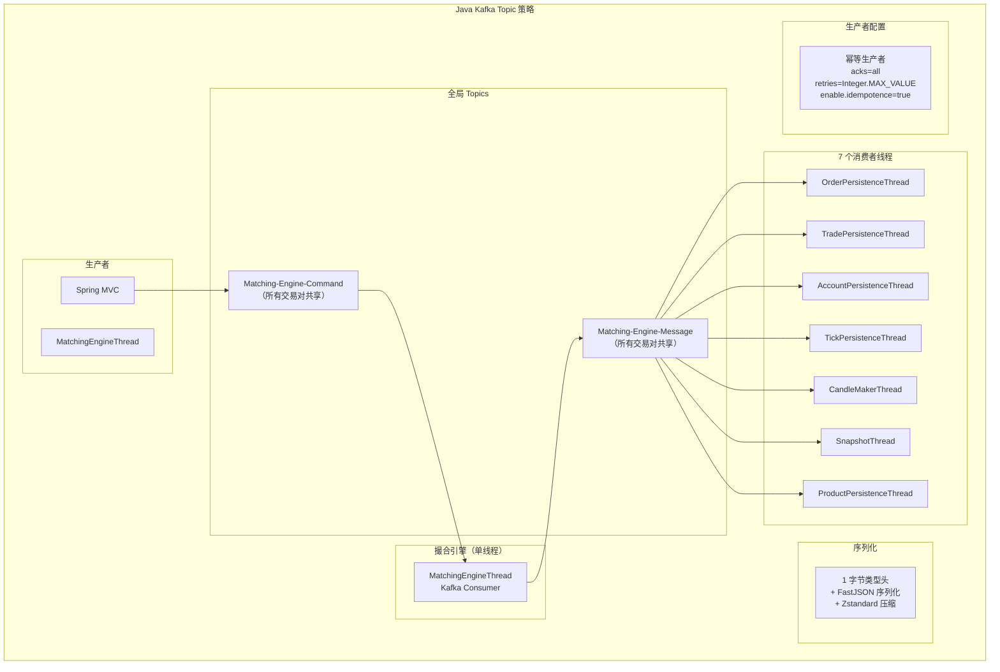
```mermaid
graph TB
    subgraph "Java Kafka Topic 策略"
        subgraph "生产者"
            REST_J["Spring MVC"]
            Engine_J["MatchingEngineThread"]
        end

        subgraph "全局 Topics"
            CMD["Matching-Engine-Command<br/>（所有交易对共享）"]
            MSG["Matching-Engine-Message<br/>（所有交易对共享）"]
        end

        subgraph "撮合引擎（单线程）"
            MT["MatchingEngineThread<br/>Kafka Consumer"]
        end

        subgraph "7 个消费者线程"
            C1["OrderPersistenceThread"]
            C2["TradePersistenceThread"]
            C3["AccountPersistenceThread"]
            C4["TickPersistenceThread"]
            C5["CandleMakerThread"]
            C6["SnapshotThread"]
            C7["ProductPersistenceThread"]
        end

        subgraph "序列化"
            SER["1 字节类型头<br/>+ FastJSON 序列化<br/>+ Zstandard 压缩"]
        end

        subgraph "生产者配置"
            IDMP["幂等生产者<br/>acks=all<br/>retries=Integer.MAX_VALUE<br/>enable.idempotence=true"]
        end

        REST_J --> CMD
        CMD --> MT
        MT --> MSG
        MSG --> C1
        MSG --> C2
        MSG --> C3
        MSG --> C4
        MSG --> C5
        MSG --> C6
        MSG --> C7
    end
```

### 6.3 Kafka 策略差异对比表

| 维度 | Go 版本 | Java 版本 |
|------|--------|----------|
| **Topic 策略** | Per-product（每交易对独立 topic） | 全局共享 topic |
| **命令 Topic** | `matching_order_{productId}` | `Matching-Engine-Command` |
| **消息 Topic** | `matching_message_{productId}` | `Matching-Engine-Message` |
| **Topic 数量** | 2 × 交易对数量 | 固定 2 个 |
| **序列化** | Plain JSON | 1 字节类型头 + FastJSON |
| **压缩** | 无 | Zstandard 压缩 |
| **生产者配置** | 默认配置 | 幂等生产者 (acks=all, retries=MAX) |
| **消息去重** | 引擎端 Bitmap 滑动窗口 | Kafka 幂等生产者保证 |
| **扩展性** | 新交易对需创建新 topic | 新交易对无需改动 topic |
| **隔离性** | 交易对间完全隔离 | 共享 topic，可能互相影响 |
| **运维复杂度** | 高（topic 数量多） | 低（固定 topic） |

---

## 7. 数据库对比

### 7.1 Go 版本：MySQL + GORM

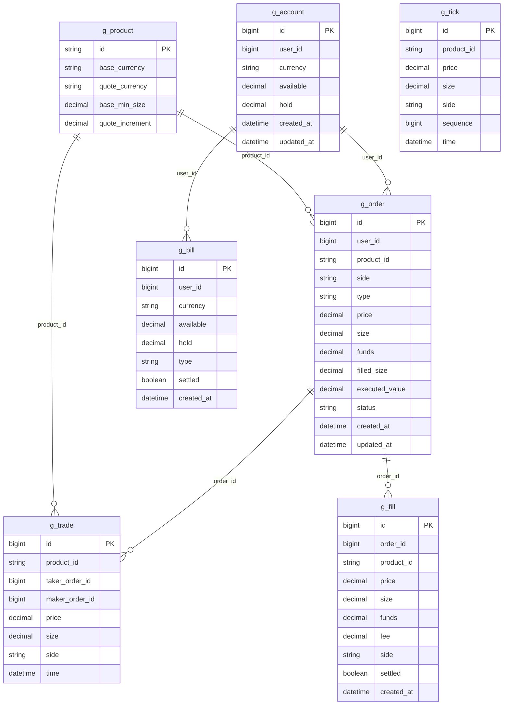
```mermaid
erDiagram
    g_account {
        bigint id PK
        bigint user_id
        string currency
        decimal available
        decimal hold
        datetime created_at
        datetime updated_at
    }

    g_order {
        bigint id PK
        bigint user_id
        string product_id
        string side
        string type
        decimal price
        decimal size
        decimal funds
        decimal filled_size
        decimal executed_value
        string status
        datetime created_at
        datetime updated_at
    }

    g_trade {
        bigint id PK
        string product_id
        bigint taker_order_id
        bigint maker_order_id
        decimal price
        decimal size
        string side
        datetime time
    }

    g_product {
        string id PK
        string base_currency
        string quote_currency
        decimal base_min_size
        decimal quote_increment
    }

    g_fill {
        bigint id PK
        bigint order_id
        string product_id
        decimal price
        decimal size
        decimal funds
        decimal fee
        string side
        boolean settled
        datetime created_at
    }

    g_bill {
        bigint id PK
        bigint user_id
        string currency
        decimal available
        decimal hold
        string type
        boolean settled
        datetime created_at
    }

    g_tick {
        bigint id PK
        string product_id
        decimal price
        decimal size
        string side
        bigint sequence
        datetime time
    }

    g_account ||--o{ g_order : "user_id"
    g_order ||--o{ g_trade : "order_id"
    g_order ||--o{ g_fill : "order_id"
    g_account ||--o{ g_bill : "user_id"
    g_product ||--o{ g_order : "product_id"
    g_product ||--o{ g_trade : "product_id"
```

### 7.2 Java 版本：MongoDB + Spring Data

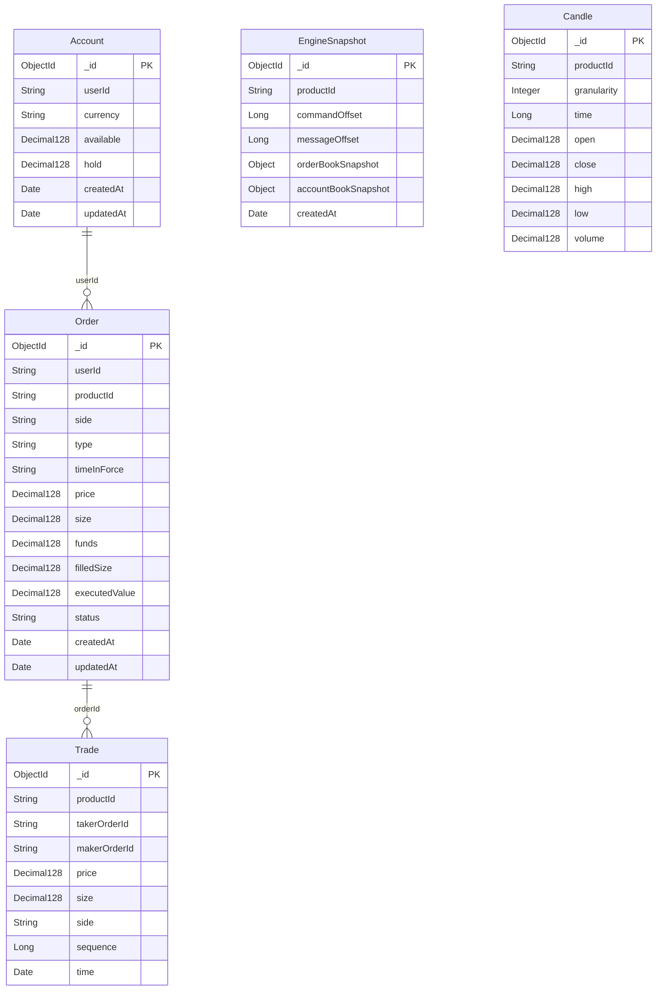
```mermaid
erDiagram
    Account {
        ObjectId _id PK
        String userId
        String currency
        Decimal128 available
        Decimal128 hold
        Date createdAt
        Date updatedAt
    }

    Order {
        ObjectId _id PK
        String userId
        String productId
        String side
        String type
        String timeInForce
        Decimal128 price
        Decimal128 size
        Decimal128 funds
        Decimal128 filledSize
        Decimal128 executedValue
        String status
        Date createdAt
        Date updatedAt
    }

    Trade {
        ObjectId _id PK
        String productId
        String takerOrderId
        String makerOrderId
        Decimal128 price
        Decimal128 size
        String side
        Long sequence
        Date time
    }

    EngineSnapshot {
        ObjectId _id PK
        String productId
        Long commandOffset
        Long messageOffset
        Object orderBookSnapshot
        Object accountBookSnapshot
        Date createdAt
    }

    Candle {
        ObjectId _id PK
        String productId
        Integer granularity
        Long time
        Decimal128 open
        Decimal128 close
        Decimal128 high
        Decimal128 low
        Decimal128 volume
    }

    Account ||--o{ Order : "userId"
    Order ||--o{ Trade : "orderId"
```

### 7.3 数据库差异对比表

| 维度 | Go 版本 (MySQL) | Java 版本 (MongoDB) |
|------|----------------|---------------------|
| **数据库类型** | 关系型（MySQL） | 文档型（MongoDB） |
| **ORM/ODM** | GORM 风格 ORM | Spring Data MongoDB |
| **表/集合前缀** | `g_` 前缀 | 无前缀 |
| **主键类型** | bigint 自增 | ObjectId |
| **小数类型** | DECIMAL | Decimal128 |
| **CDC 机制** | MySQL Binlog | 无（直接 Redis Pub/Sub） |
| **事务支持** | InnoDB 事务 | MongoDB 4.0+ 多文档事务 |
| **水平扩展** | 需分库分表 | 原生分片（Sharding） |
| **快照存储** | Redis（7 天 TTL） | MongoDB EngineSnapshot 集合 |
| **特有表/集合** | g_fill, g_bill, g_tick | EngineSnapshot, Candle |
| **TimeInForce 字段** | 无 | Order.timeInForce |
| **索引策略** | MySQL 索引 | MongoDB 复合索引 |

---

## 8. 结算流程对比

### 8.1 Go 版本：两阶段异步结算

Go 版本的结算是一个复杂的异步流水线，通过 MySQL Binlog CDC 驱动，分为多个阶段：

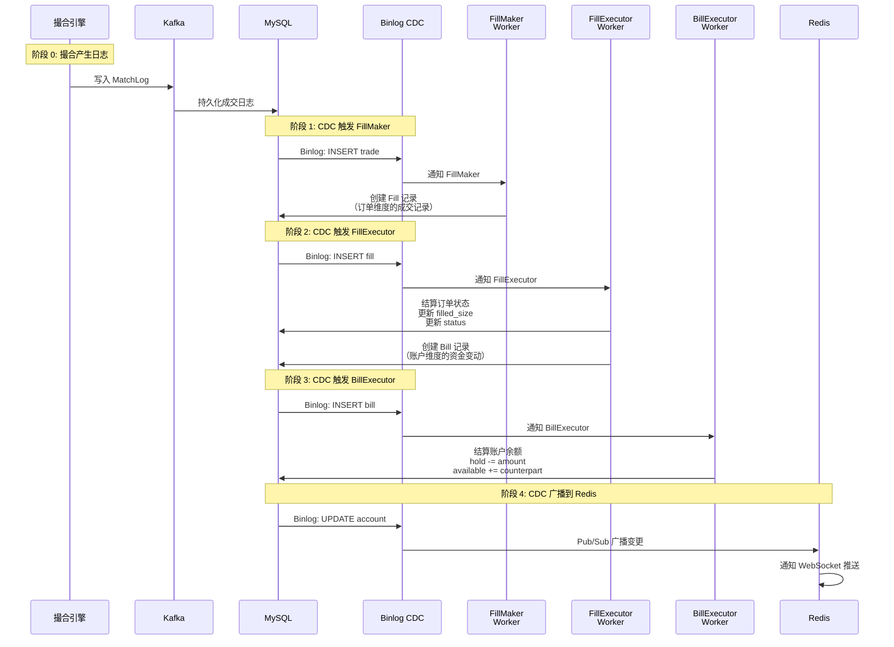
```mermaid
sequenceDiagram
    participant Engine as 撮合引擎
    participant Kafka as Kafka
    participant MySQL as MySQL
    participant CDC as Binlog CDC
    participant FM as FillMaker<br/>Worker
    participant FE as FillExecutor<br/>Worker
    participant BE as BillExecutor<br/>Worker
    participant Redis as Redis

    Note over Engine: 阶段 0: 撮合产生日志

    Engine->>Kafka: 写入 MatchLog
    Kafka->>MySQL: 持久化成交日志

    Note over MySQL,CDC: 阶段 1: CDC 触发 FillMaker

    MySQL->>CDC: Binlog: INSERT trade
    CDC->>FM: 通知 FillMaker
    FM->>MySQL: 创建 Fill 记录<br/>（订单维度的成交记录）

    Note over MySQL,CDC: 阶段 2: CDC 触发 FillExecutor

    MySQL->>CDC: Binlog: INSERT fill
    CDC->>FE: 通知 FillExecutor
    FE->>MySQL: 结算订单状态<br/>更新 filled_size<br/>更新 status
    FE->>MySQL: 创建 Bill 记录<br/>（账户维度的资金变动）

    Note over MySQL,CDC: 阶段 3: CDC 触发 BillExecutor

    MySQL->>CDC: Binlog: INSERT bill
    CDC->>BE: 通知 BillExecutor
    BE->>MySQL: 结算账户余额<br/>hold -= amount<br/>available += counterpart

    Note over MySQL,Redis: 阶段 4: CDC 广播到 Redis

    MySQL->>CDC: Binlog: UPDATE account
    CDC->>Redis: Pub/Sub 广播变更
    Redis->>Redis: 通知 WebSocket 推送
```

### 8.2 Java 版本：引擎内即时结算

Java 版本的结算在撮合引擎内部同步完成，持久化则异步进行：

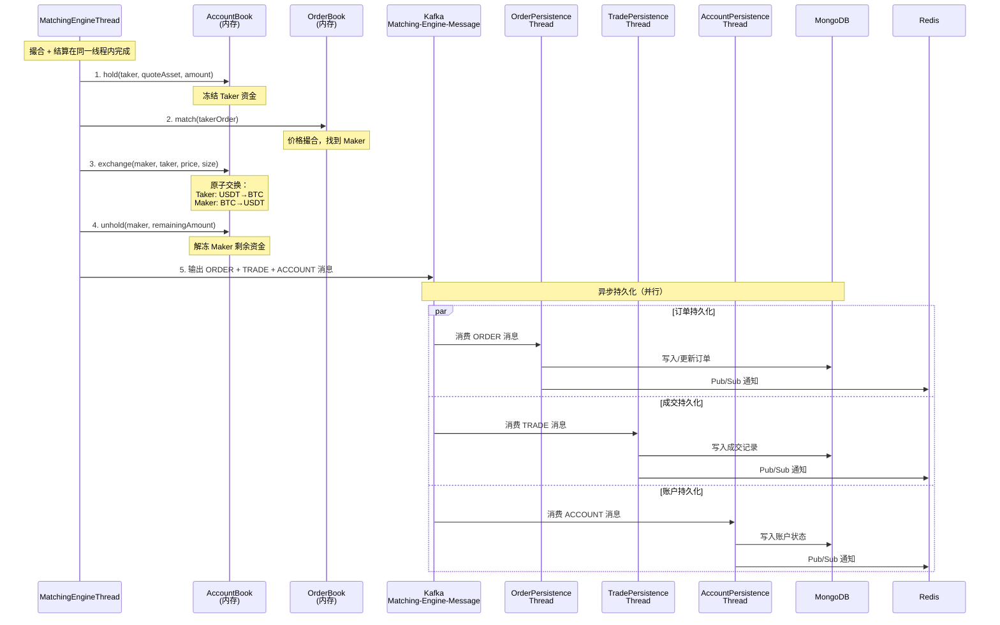
```mermaid
sequenceDiagram
    participant Engine as MatchingEngineThread
    participant AB as AccountBook<br/>(内存)
    participant OB as OrderBook<br/>(内存)
    participant KafkaOut as Kafka<br/>Matching-Engine-Message
    participant OP as OrderPersistence<br/>Thread
    participant TP as TradePersistence<br/>Thread
    participant AP as AccountPersistence<br/>Thread
    participant MongoDB as MongoDB
    participant Redis as Redis

    Note over Engine: 撮合 + 结算在同一线程内完成

    Engine->>AB: 1. hold(taker, quoteAsset, amount)
    Note over AB: 冻结 Taker 资金

    Engine->>OB: 2. match(takerOrder)
    Note over OB: 价格撮合，找到 Maker

    Engine->>AB: 3. exchange(maker, taker, price, size)
    Note over AB: 原子交换：<br/>Taker: USDT→BTC<br/>Maker: BTC→USDT

    Engine->>AB: 4. unhold(maker, remainingAmount)
    Note over AB: 解冻 Maker 剩余资金

    Engine->>KafkaOut: 5. 输出 ORDER + TRADE + ACCOUNT 消息

    Note over KafkaOut,MongoDB: 异步持久化（并行）

    par 订单持久化
        KafkaOut->>OP: 消费 ORDER 消息
        OP->>MongoDB: 写入/更新订单
        OP->>Redis: Pub/Sub 通知
    and 成交持久化
        KafkaOut->>TP: 消费 TRADE 消息
        TP->>MongoDB: 写入成交记录
        TP->>Redis: Pub/Sub 通知
    and 账户持久化
        KafkaOut->>AP: 消费 ACCOUNT 消息
        AP->>MongoDB: 写入账户状态
        AP->>Redis: Pub/Sub 通知
    end
```

### 8.3 结算流程差异对比表

| 维度 | Go 版本 | Java 版本 |
|------|--------|----------|
| **结算模式** | 两阶段异步（CDC 驱动） | 引擎内即时结算 |
| **结算时机** | 成交后通过 Binlog CDC 触发 | 撮合过程中同步完成 |
| **阶段数量** | 4 个阶段（Trade→Fill→Bill→Account） | 1 个阶段（引擎内 exchange） |
| **中间产物** | Fill 记录、Bill 记录 | 无中间产物 |
| **持久化** | 每阶段同步写 MySQL | 异步写 MongoDB |
| **延迟** | 高（多次 CDC + 多次写库） | 低（内存操作 + 异步持久化） |
| **一致性** | 最终一致（CDC 链路可能延迟） | 强一致（单线程顺序执行） |
| **可追溯性** | 高（每阶段有独立记录） | 低（依赖消息回放） |
| **复杂度** | 高（多 Worker、多阶段） | 低（单线程、直接结算） |

---

## 9. 实时推送对比

### 9.1 Go 版本：MySQL Binlog → Redis Pub/Sub → WebSocket

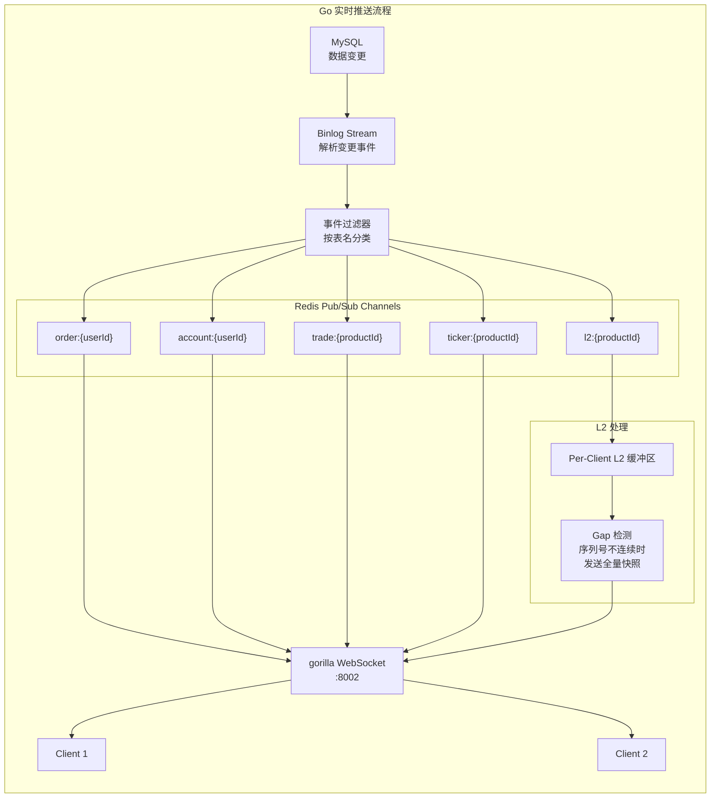
```mermaid
graph LR
    subgraph "Go 实时推送流程"
        MySQL["MySQL<br/>数据变更"]
        Binlog["Binlog Stream<br/>解析变更事件"]
        Filter["事件过滤器<br/>按表名分类"]

        subgraph "Redis Pub/Sub Channels"
            CH_Order["order:{userId}"]
            CH_Account["account:{userId}"]
            CH_Trade["trade:{productId}"]
            CH_Ticker["ticker:{productId}"]
            CH_L2["l2:{productId}"]
        end

        WS["gorilla WebSocket<br/>:8002"]
        Client1["Client 1"]
        Client2["Client 2"]

        subgraph "L2 处理"
            L2Buf["Per-Client L2 缓冲区"]
            GapDetect["Gap 检测<br/>序列号不连续时<br/>发送全量快照"]
        end

        MySQL --> Binlog
        Binlog --> Filter
        Filter --> CH_Order
        Filter --> CH_Account
        Filter --> CH_Trade
        Filter --> CH_Ticker
        Filter --> CH_L2
        CH_Order --> WS
        CH_Account --> WS
        CH_Trade --> WS
        CH_Ticker --> WS
        CH_L2 --> L2Buf
        L2Buf --> GapDetect
        GapDetect --> WS
        WS --> Client1
        WS --> Client2
    end
```

### 9.2 Java 版本：Redis Pub/Sub 直连 → WebSocket

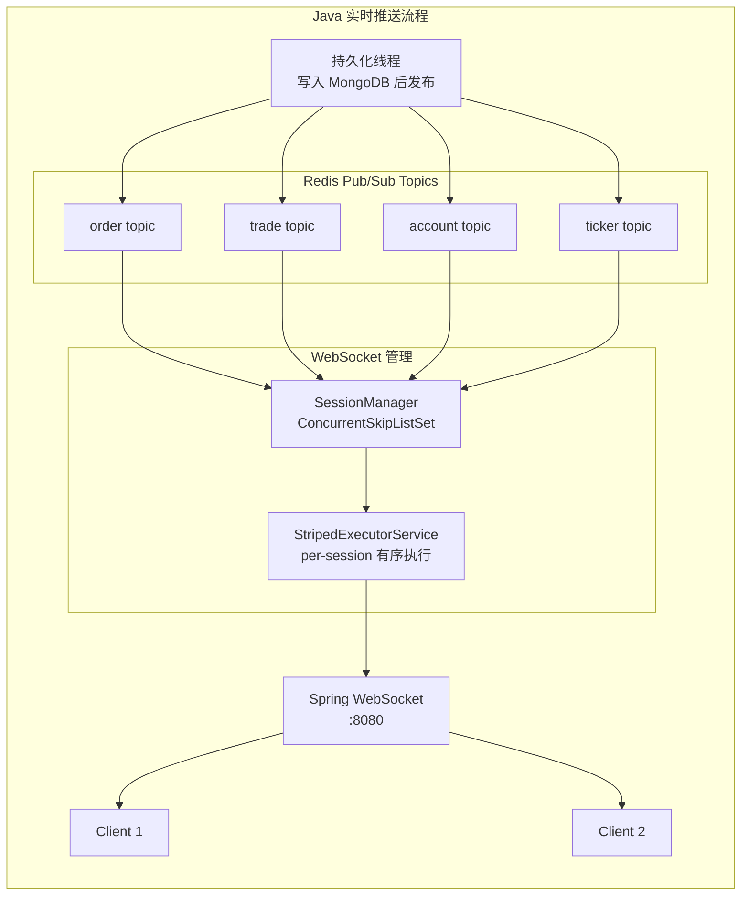
```mermaid
graph LR
    subgraph "Java 实时推送流程"
        Persist["持久化线程<br/>写入 MongoDB 后发布"]

        subgraph "Redis Pub/Sub Topics"
            RT_Order["order topic"]
            RT_Trade["trade topic"]
            RT_Account["account topic"]
            RT_Ticker["ticker topic"]
        end

        subgraph "WebSocket 管理"
            SM["SessionManager<br/>ConcurrentSkipListSet"]
            SE["StripedExecutorService<br/>per-session 有序执行"]
        end

        SpringWS["Spring WebSocket<br/>:8080"]
        C1["Client 1"]
        C2["Client 2"]

        Persist --> RT_Order
        Persist --> RT_Trade
        Persist --> RT_Account
        Persist --> RT_Ticker
        RT_Order --> SM
        RT_Trade --> SM
        RT_Account --> SM
        RT_Ticker --> SM
        SM --> SE
        SE --> SpringWS
        SpringWS --> C1
        SpringWS --> C2
    end
```

### 9.3 实时推送差异对比表

| 维度 | Go 版本 | Java 版本 |
|------|--------|----------|
| **数据源** | MySQL Binlog CDC | 持久化线程直接发布 |
| **中间件** | Redis Pub/Sub | Redis Pub/Sub |
| **WebSocket 库** | gorilla/websocket | Spring WebSocket |
| **端口** | 独立端口 :8002 | 共享端口 :8080 |
| **消息排序** | 直接推送（无特殊排序） | StripedExecutorService per-session 有序 |
| **L2 订单簿推送** | Per-client 缓冲区 + Gap 检测 | 标准推送 |
| **Session 管理** | 简单连接管理 | ConcurrentSkipListSet 有序管理 |
| **推送延迟** | 较高（Binlog 解析 + Redis） | 较低（直接发布 + Redis） |
| **可靠性** | 依赖 Binlog 位点 | 依赖 Redis 连接 |

---

## 10. Worker/线程模型对比

### 10.1 Go 版本：5 Worker 类型，Redis List 分片

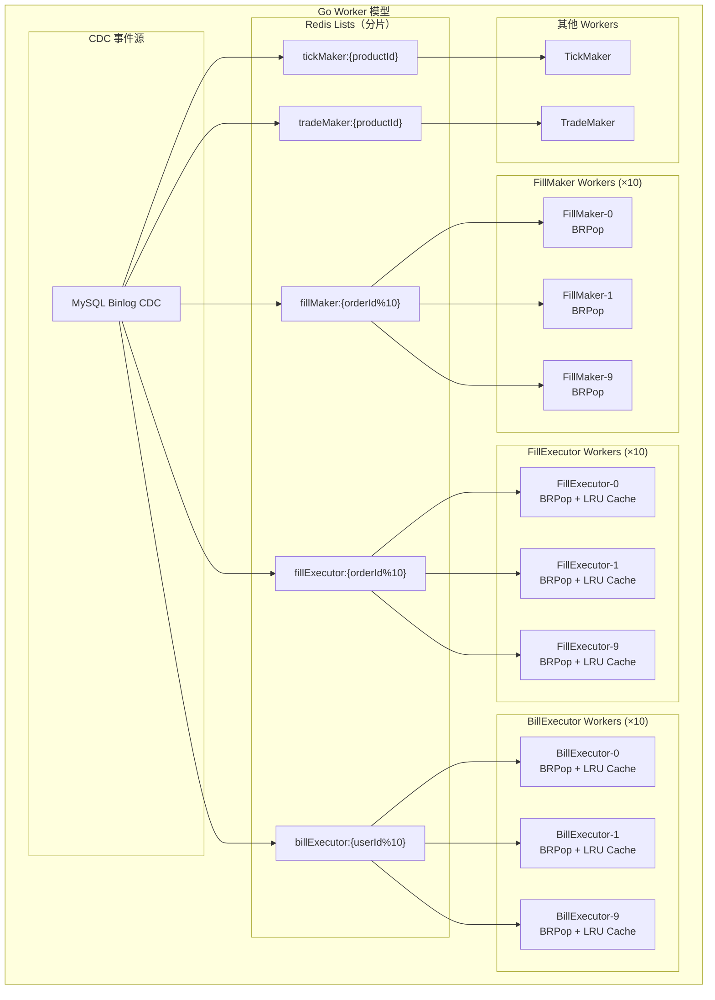
```mermaid
graph TB
    subgraph "Go Worker 模型"
        subgraph "CDC 事件源"
            BinlogCDC["MySQL Binlog CDC"]
        end

        subgraph "Redis Lists（分片）"
            RL1["fillMaker:{orderId%10}"]
            RL2["fillExecutor:{orderId%10}"]
            RL3["billExecutor:{userId%10}"]
            RL4["tickMaker:{productId}"]
            RL5["tradeMaker:{productId}"]
        end

        subgraph "FillMaker Workers (×10)"
            FM0["FillMaker-0<br/>BRPop"]
            FM1["FillMaker-1<br/>BRPop"]
            FMN["FillMaker-9<br/>BRPop"]
        end

        subgraph "FillExecutor Workers (×10)"
            FE0["FillExecutor-0<br/>BRPop + LRU Cache"]
            FE1["FillExecutor-1<br/>BRPop + LRU Cache"]
            FEN["FillExecutor-9<br/>BRPop + LRU Cache"]
        end

        subgraph "BillExecutor Workers (×10)"
            BE0["BillExecutor-0<br/>BRPop + LRU Cache"]
            BE1["BillExecutor-1<br/>BRPop + LRU Cache"]
            BEN["BillExecutor-9<br/>BRPop + LRU Cache"]
        end

        subgraph "其他 Workers"
            TM["TickMaker"]
            TRM["TradeMaker"]
        end

        BinlogCDC --> RL1
        BinlogCDC --> RL2
        BinlogCDC --> RL3
        BinlogCDC --> RL4
        BinlogCDC --> RL5

        RL1 --> FM0
        RL1 --> FM1
        RL1 --> FMN
        RL2 --> FE0
        RL2 --> FE1
        RL2 --> FEN
        RL3 --> BE0
        RL3 --> BE1
        RL3 --> BEN
        RL4 --> TM
        RL5 --> TRM
    end
```

**Go Worker 分片策略：**

| Worker 类型 | 分片键 | 分片数 | 队列类型 | 缓存 |
|------------|-------|--------|---------|------|
| FillMaker | orderId % 10 | 10 | Redis List + BRPop | 无 |
| FillExecutor | orderId % 10 | 10 | Redis List + BRPop | LRU Cache |
| BillExecutor | userId % 10 | 10 | Redis List + BRPop | LRU Cache |
| TickMaker | productId | 按交易对 | Redis List + BRPop | 无 |
| TradeMaker | productId | 按交易对 | Redis List + BRPop | 无 |

### 10.2 Java 版本：7 Consumer 线程，Kafka 分区并行

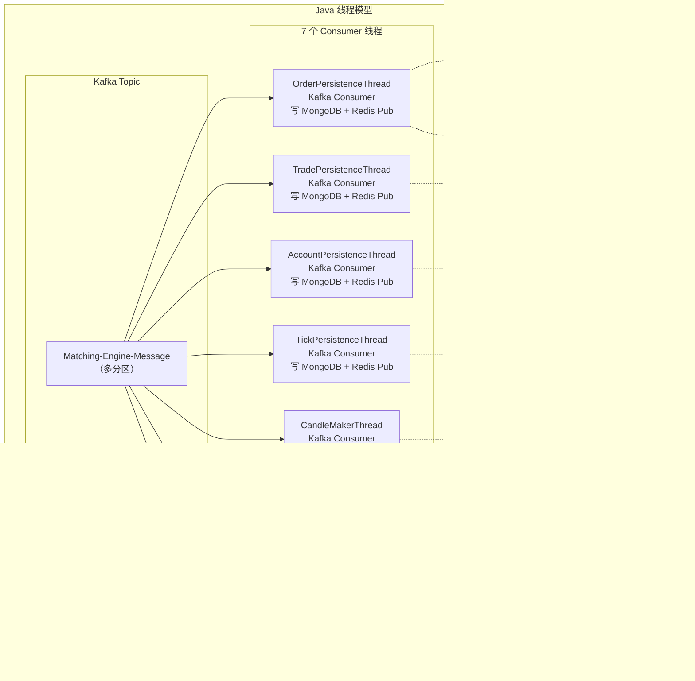
```mermaid
graph TB
    subgraph "Java 线程模型"
        subgraph "Kafka Topic"
            MSG["Matching-Engine-Message<br/>（多分区）"]
        end

        subgraph "7 个 Consumer 线程"
            T1["OrderPersistenceThread<br/>Kafka Consumer<br/>写 MongoDB + Redis Pub"]
            T2["TradePersistenceThread<br/>Kafka Consumer<br/>写 MongoDB + Redis Pub"]
            T3["AccountPersistenceThread<br/>Kafka Consumer<br/>写 MongoDB + Redis Pub"]
            T4["TickPersistenceThread<br/>Kafka Consumer<br/>写 MongoDB + Redis Pub"]
            T5["CandleMakerThread<br/>Kafka Consumer<br/>聚合 K 线数据"]
            T6["SnapshotThread<br/>Kafka Consumer<br/>定期保存快照"]
            T7["ProductPersistenceThread<br/>Kafka Consumer<br/>更新产品状态"]
        end

        subgraph "容错机制"
            UEH["UncaughtExceptionHandler<br/>线程崩溃 → 3 秒后自动重启"]
        end

        subgraph "监控"
            MC["Micrometer Counter<br/>命令计数"]
        end

        MSG --> T1
        MSG --> T2
        MSG --> T3
        MSG --> T4
        MSG --> T5
        MSG --> T6
        MSG --> T7
        T1 -.-> UEH
        T2 -.-> UEH
        T3 -.-> UEH
        T4 -.-> UEH
        T5 -.-> UEH
        T6 -.-> UEH
        T7 -.-> UEH
        T1 -.-> MC
    end
```

### 10.3 Worker/线程模型差异对比表

| 维度 | Go 版本 | Java 版本 |
|------|--------|----------|
| **Worker/线程数** | 5 种类型 | 7 种类型 |
| **消息源** | Redis List（BRPop 阻塞消费） | Kafka Consumer（poll 消费） |
| **并行策略** | 分片（orderId%10, userId%10） | Kafka 分区并行 |
| **分片数** | 10 个分片/Worker 类型 | Kafka 分区数决定 |
| **缓存** | LRU Cache（FillExecutor, BillExecutor） | 无本地缓存 |
| **线程安全** | 分片保证同一 ID 单线程处理 | Kafka 分区保证顺序性 |
| **容错** | 无自动重启 | UncaughtExceptionHandler 3 秒重启 |
| **监控** | 无 | Micrometer Counter |
| **消息过滤** | CDC 按表名路由 | 按消息类型头过滤 |

---

## 11. 快照与恢复对比

### 11.1 Go 版本：Redis 快照

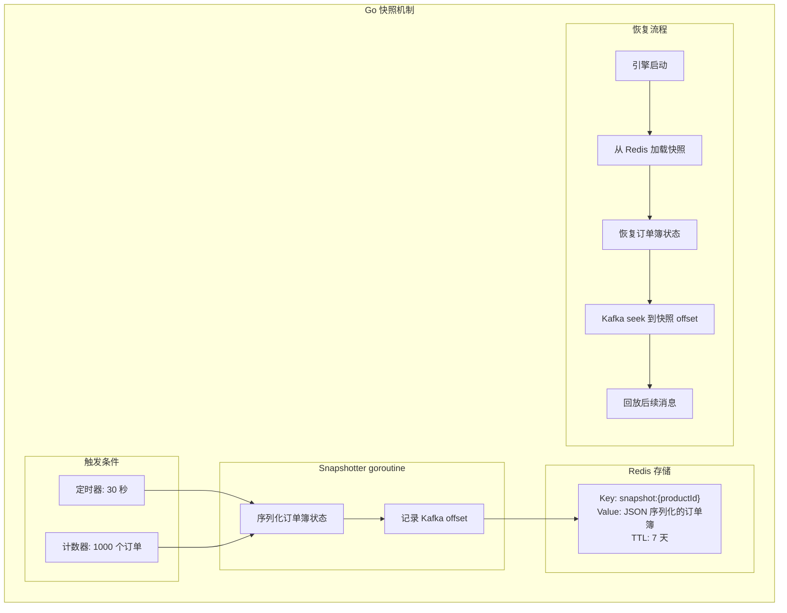
```mermaid
graph TB
    subgraph "Go 快照机制"
        subgraph "触发条件"
            Timer["定时器: 30 秒"]
            Counter["计数器: 1000 个订单"]
        end

        subgraph "Snapshotter goroutine"
            Snap["序列化订单簿状态"]
            Offset["记录 Kafka offset"]
        end

        subgraph "Redis 存储"
            RedisKey["Key: snapshot:{productId}<br/>Value: JSON 序列化的订单簿<br/>TTL: 7 天"]
        end

        subgraph "恢复流程"
            Start["引擎启动"]
            Load["从 Redis 加载快照"]
            Restore["恢复订单簿状态"]
            Seek["Kafka seek 到快照 offset"]
            Replay["回放后续消息"]
        end

        Timer --> Snap
        Counter --> Snap
        Snap --> Offset
        Offset --> RedisKey

        Start --> Load
        Load --> Restore
        Restore --> Seek
        Seek --> Replay
    end
```

### 11.2 Java 版本：MongoDB 事务快照

```mermaid
graph TB
    subgraph "Java 快照机制"
        subgraph "触发条件"
            JCounter["计数器: 每 1000 个命令"]
        end

        subgraph "SnapshotThread"
            JSnap["序列化引擎完整状态"]
            JData["快照内容:<br/>1. OrderBook 所有交易对<br/>2. AccountBook 全部余额<br/>3. commandOffset<br/>4. messageOffset"]
        end

        subgraph "MongoDB 存储"
            JColl["Collection: EngineSnapshot<br/>包含完整引擎状态<br/>使用 MongoDB 事务写入"]
        end

        subgraph "恢复流程"
            JStart["引擎启动"]
            JLoad["从 MongoDB 加载最新快照"]
            JRestore["恢复 OrderBook + AccountBook"]
            JSeek["Kafka seek 到 commandOffset"]
            JReplay["回放后续命令"]
        end

        JCounter --> JSnap
        JSnap --> JData
        JData --> JColl

        JStart --> JLoad
        JLoad --> JRestore
        JRestore --> JSeek
        JSeek --> JReplay
    end
```

### 11.3 快照与恢复差异对比表

| 维度 | Go 版本 | Java 版本 |
|------|--------|----------|
| **存储介质** | Redis | MongoDB |
| **触发条件** | 30 秒 或 1000 个订单 | 1000 个命令 |
| **快照内容** | 订单簿状态 + Kafka offset | OrderBook + AccountBook + 双 offset |
| **持久性** | 7 天 TTL（可能过期丢失） | 永久存储 |
| **事务保证** | Redis SET（单键原子） | MongoDB 多文档事务 |
| **包含余额** | 否（余额在 MySQL） | 是（AccountBook 完整状态） |
| **快照范围** | 每个交易对独立快照 | 全引擎统一快照 |
| **恢复速度** | 快（Redis 内存读取） | 较慢（MongoDB 磁盘读取） |
| **可靠性** | 低（TTL 过期、Redis 重启风险） | 高（MongoDB 持久化） |

---

## 12. WebSocket 对比

### 12.1 Go 版本：gorilla/websocket 直接推送

```mermaid
graph TB
    subgraph "Go WebSocket 架构"
        subgraph "gorilla/websocket :8002"
            ConnMgr["连接管理器"]
            C1["Client 1<br/>goroutine"]
            C2["Client 2<br/>goroutine"]
            C3["Client 3<br/>goroutine"]
        end

        subgraph "订阅管理"
            Sub["订阅注册表<br/>channel → [clients]"]
        end

        subgraph "L2 推送特殊处理"
            L2C1["Client1 L2 缓冲区"]
            L2C2["Client2 L2 缓冲区"]
            GapDet["Gap 检测器<br/>检查序列号连续性"]
            FullSnap["序列号不连续<br/>→ 发送全量快照"]
            IncrUpd["序列号连续<br/>→ 发送增量更新"]
        end

        subgraph "Redis 订阅"
            RedisSub["Redis Pub/Sub<br/>订阅数据变更频道"]
        end

        RedisSub --> ConnMgr
        ConnMgr --> Sub
        Sub --> C1
        Sub --> C2
        Sub --> C3
        C1 --> L2C1
        C2 --> L2C2
        L2C1 --> GapDet
        L2C2 --> GapDet
        GapDet -->|gap| FullSnap
        GapDet -->|no gap| IncrUpd
    end
```

### 12.2 Java 版本：Spring WebSocket + StripedExecutorService

```mermaid
graph TB
    subgraph "Java WebSocket 架构"
        subgraph "Spring WebSocket :8080"
            WSHandler["WebSocket Handler"]
        end

        subgraph "Session 管理"
            SessionMgr["SessionManager<br/>ConcurrentSkipListSet<br/>有序 Session 管理"]
            S1["Session 1"]
            S2["Session 2"]
            S3["Session 3"]
        end

        subgraph "StripedExecutorService"
            Stripe["按 Session 分条执行<br/>同一 Session 的消息<br/>保证顺序执行"]
            E1["Stripe-1 (Session 1)"]
            E2["Stripe-2 (Session 2)"]
            E3["Stripe-3 (Session 3)"]
        end

        subgraph "消息订阅"
            RedisSubJ["Redis Pub/Sub<br/>订阅数据变更"]
        end

        RedisSubJ --> SessionMgr
        SessionMgr --> S1
        SessionMgr --> S2
        SessionMgr --> S3
        S1 --> Stripe
        S2 --> Stripe
        S3 --> Stripe
        Stripe --> E1
        Stripe --> E2
        Stripe --> E3
        E1 --> WSHandler
        E2 --> WSHandler
        E3 --> WSHandler
    end
```

### 12.3 WebSocket 差异对比表

| 维度 | Go 版本 | Java 版本 |
|------|--------|----------|
| **WebSocket 库** | gorilla/websocket | Spring WebSocket |
| **端口** | 独立 :8002 | 共享 :8080 |
| **连接模型** | 每连接一个 goroutine | Session 池 |
| **消息排序** | 直接推送（Per-client goroutine） | StripedExecutorService per-session 有序 |
| **Session 管理** | 简单 Map | ConcurrentSkipListSet |
| **L2 深度推送** | Per-client 缓冲区 + Gap 检测 | 标准推送 |
| **全量/增量** | Gap 检测决定全量或增量 | 标准增量推送 |
| **并发安全** | goroutine 隔离 | StripedExecutorService 条带化 |
| **内存模型** | 每 client 独立缓冲区 | 共享线程池 |

---

## 13. 监控与运维对比

### 13.1 Go 版本：pprof

```mermaid
graph LR
    subgraph "Go 监控"
        App["Go 应用"]
        PProfHTTP["pprof HTTP<br/>:6060"]

        subgraph "pprof 功能"
            CPU["CPU Profile<br/>/debug/pprof/profile"]
            Heap["Heap Profile<br/>/debug/pprof/heap"]
            GR["Goroutine Profile<br/>/debug/pprof/goroutine"]
            Block["Block Profile<br/>/debug/pprof/block"]
            Trace["Trace<br/>/debug/pprof/trace"]
        end

        Dev["开发者<br/>go tool pprof"]

        App --> PProfHTTP
        PProfHTTP --> CPU
        PProfHTTP --> Heap
        PProfHTTP --> GR
        PProfHTTP --> Block
        PProfHTTP --> Trace
        Dev --> PProfHTTP
    end
```

### 13.2 Java 版本：Micrometer + Prometheus

```mermaid
graph LR
    subgraph "Java 监控"
        App["Spring Boot 应用"]
        Actuator["Spring Actuator<br/>/actuator/prometheus<br/>:7002"]

        subgraph "Micrometer 指标"
            Counter["Counter<br/>命令处理计数"]
            JVM["JVM 指标<br/>内存/GC/线程"]
            HTTP["HTTP 指标<br/>请求延迟/QPS"]
            Custom["自定义指标<br/>撮合延迟/队列深度"]
        end

        Prom["Prometheus<br/>定期拉取指标"]
        Grafana["Grafana<br/>可视化仪表板"]
        Alert["AlertManager<br/>告警"]

        App --> Actuator
        Actuator --> Counter
        Actuator --> JVM
        Actuator --> HTTP
        Actuator --> Custom
        Prom --> Actuator
        Prom --> Grafana
        Prom --> Alert
    end
```

### 13.3 监控与运维差异对比表

| 维度 | Go 版本 | Java 版本 |
|------|--------|----------|
| **监控工具** | pprof | Micrometer + Prometheus |
| **监控端口** | :6060 | :7002 |
| **指标类型** | CPU/内存/goroutine profile | Counter/Gauge/Timer/Summary |
| **采集方式** | 按需抓取（pull） | 定期拉取（Prometheus scrape） |
| **可视化** | go tool pprof CLI/Web UI | Grafana 仪表板 |
| **告警能力** | 无 | Prometheus AlertManager |
| **业务指标** | 无 | Micrometer Counter（命令计数） |
| **JVM/Runtime 指标** | goroutine/内存基础指标 | 完整 JVM 指标（GC/线程/内存池） |
| **生产就绪度** | 开发调试级别 | 企业生产级别 |
| **部署方式** | 原生二进制 + conf.json | Docker (JIB Maven) + OpenJDK 14 |
| **线程容错** | 无自动重启 | UncaughtExceptionHandler 3 秒重启 |

---

## 14. K 线与行情对比

### 14.1 Go 版本：11 级 K 线

```mermaid
graph TB
    subgraph "Go K 线系统"
        Trade_G["成交事件<br/>(Binlog CDC)"]
        TickMaker_G["TickMaker Worker"]

        subgraph "11 级 K 线粒度（分钟）"
            K1["1 分钟"]
            K3["3 分钟"]
            K5["5 分钟"]
            K15["15 分钟"]
            K30["30 分钟"]
            K60["1 小时"]
            K120["2 小时"]
            K240["4 小时"]
            K360["6 小时"]
            K720["12 小时"]
            K1440["1 天"]
        end

        MySQL_G["MySQL 存储"]

        Trade_G --> TickMaker_G
        TickMaker_G --> K1
        TickMaker_G --> K3
        TickMaker_G --> K5
        TickMaker_G --> K15
        TickMaker_G --> K30
        TickMaker_G --> K60
        TickMaker_G --> K120
        TickMaker_G --> K240
        TickMaker_G --> K360
        TickMaker_G --> K720
        TickMaker_G --> K1440
        K1 --> MySQL_G
        K3 --> MySQL_G
        K5 --> MySQL_G
        K15 --> MySQL_G
        K30 --> MySQL_G
        K60 --> MySQL_G
        K120 --> MySQL_G
        K240 --> MySQL_G
        K360 --> MySQL_G
        K720 --> MySQL_G
        K1440 --> MySQL_G
    end
```

### 14.2 Java 版本：7 级 K 线

```mermaid
graph TB
    subgraph "Java K 线系统"
        Trade_J["成交消息<br/>(Kafka Consumer)"]
        CandleMaker["CandleMakerThread"]

        subgraph "7 级 K 线粒度（秒）"
            C60["60s = 1 分钟"]
            C300["300s = 5 分钟"]
            C900["900s = 15 分钟"]
            C1800["1800s = 30 分钟"]
            C3600["3600s = 1 小时"]
            C21600["21600s = 6 小时"]
            C86400["86400s = 1 天"]
        end

        MongoDB_J["MongoDB Candle 集合"]

        Trade_J --> CandleMaker
        CandleMaker --> C60
        CandleMaker --> C300
        CandleMaker --> C900
        CandleMaker --> C1800
        CandleMaker --> C3600
        CandleMaker --> C21600
        CandleMaker --> C86400
        C60 --> MongoDB_J
        C300 --> MongoDB_J
        C900 --> MongoDB_J
        C1800 --> MongoDB_J
        C3600 --> MongoDB_J
        C21600 --> MongoDB_J
        C86400 --> MongoDB_J
    end
```

### 14.3 K 线差异对比表

| 粒度 | Go 版本 | Java 版本 |
|------|--------|----------|
| **1 分钟** | 1 min | 60s |
| **3 分钟** | 3 min | -- |
| **5 分钟** | 5 min | 300s |
| **15 分钟** | 15 min | 900s |
| **30 分钟** | 30 min | 1800s |
| **1 小时** | 60 min | 3600s |
| **2 小时** | 120 min | -- |
| **4 小时** | 240 min | -- |
| **6 小时** | 360 min | 21600s |
| **12 小时** | 720 min | -- |
| **1 天** | 1440 min | 86400s |
| **粒度总数** | **11 级** | **7 级** |
| **单位表示** | 分钟 | 秒 |
| **数据源** | Binlog CDC | Kafka Consumer |
| **存储** | MySQL | MongoDB Candle 集合 |

**差异分析：**
- Go 版本提供更细粒度的 K 线（3 分钟、2/4/12 小时），适合短线交易者
- Java 版本精简为 7 级主流粒度，减少计算和存储开销
- Java 版本缺少 3 分钟、2 小时、4 小时、12 小时这四个粒度

---

## 15. 优劣势总结

### 15.1 综合对比矩阵

| 评估维度 | Go 版本 (gitbitex-spot) | Java 版本 (gitbitex-new) | 胜出 |
|---------|------------------------|--------------------------|------|
| **部署复杂度** | 单一二进制，配置简单 | Docker 容器化，标准化部署 | 各有千秋 |
| **启动速度** | 毫秒级启动 | 秒级启动（JVM 预热） | Go |
| **内存占用** | 低（原生编译） | 较高（JVM 开销） | Go |
| **撮合延迟** | 低（goroutine 轻量） | 低（单线程无锁） | 持平 |
| **吞吐量** | 流水线并行，高吞吐 | 单线程瓶颈，但无锁竞争 | Go |
| **交易对隔离** | 完全隔离（独立引擎） | 共享（单引擎） | Go |
| **数据一致性** | 最终一致（CDC 链路长） | 强一致（引擎内结算） | Java |
| **结算延迟** | 高（多阶段 CDC） | 低（引擎内即时） | Java |
| **容错能力** | 无自动恢复 | 线程自动重启 | Java |
| **快照可靠性** | 低（Redis TTL 可能过期） | 高（MongoDB 持久化） | Java |
| **监控能力** | 基础（pprof） | 企业级（Prometheus） | Java |
| **TimeInForce** | 不支持 | GTC/IOC/GTX | Java |
| **K 线粒度** | 11 级（更丰富） | 7 级（更精简） | Go |
| **生态与库** | Go 金融生态较少 | Spring 生态成熟 | Java |
| **运维复杂度** | Topic 多，CDC 链路复杂 | Topic 少，链路简洁 | Java |
| **代码可维护性** | goroutine + channel 复杂 | 单线程模型直观 | Java |
| **可追溯性** | 高（Fill/Bill 独立记录） | 较低（依赖消息回放） | Go |
| **水平扩展** | 按交易对天然分片 | 需额外分片策略 | Go |
| **Kafka 消息大小** | 较大（Plain JSON） | 较小（压缩 + 类型头） | Java |
| **去重可靠性** | 一般（Bitmap 有容量限制） | 高（Kafka 幂等保证） | Java |

### 15.2 Go 版本核心优势

```mermaid
graph TB
    subgraph "Go 版本核心优势"
        A1["极低资源占用<br/>原生编译，无 JVM 开销"]
        A2["交易对完全隔离<br/>一个引擎崩溃不影响其他"]
        A3["流水线并行<br/>Fetcher→Applier→Committer→Snapshotter"]
        A4["天然水平扩展<br/>按交易对分片"]
        A5["更丰富的 K 线<br/>11 级粒度"]
        A6["高可追溯性<br/>Fill/Bill 独立记录链"]
        A7["毫秒级启动<br/>无预热延迟"]
    end
```

### 15.3 Java 版本核心优势

```mermaid
graph TB
    subgraph "Java 版本核心优势"
        B1["引擎内即时结算<br/>单线程强一致性"]
        B2["企业级监控<br/>Prometheus + Grafana"]
        B3["线程自动恢复<br/>3 秒自动重启"]
        B4["持久化快照<br/>MongoDB 事务保证"]
        B5["TimeInForce 支持<br/>GTC / IOC / GTX"]
        B6["运维简单<br/>全局 Topic + Docker"]
        B7["消息压缩<br/>Zstandard 减少带宽"]
        B8["Spring 生态<br/>成熟的企业级框架"]
    end
```

---

## 16. 迁移建议

### 16.1 从 Go 版本迁移到 Java 版本的关键考量

```mermaid
graph TB
    subgraph "迁移路线图"
        P1["Phase 1: 基础准备"]
        P2["Phase 2: 数据迁移"]
        P3["Phase 3: 引擎切换"]
        P4["Phase 4: 验证上线"]

        P1 --> P2 --> P3 --> P4

        subgraph "Phase 1 详情"
            P1A["搭建 MongoDB 集群"]
            P1B["搭建 Prometheus + Grafana"]
            P1C["准备 Docker 部署流水线"]
            P1D["Kafka Topic 规划<br/>从 per-product 迁移到全局 topic"]
        end

        subgraph "Phase 2 详情"
            P2A["MySQL → MongoDB 数据迁移<br/>账户/订单/成交历史"]
            P2B["Redis 快照 → MongoDB 快照<br/>引擎状态迁移"]
            P2C["K 线数据迁移<br/>注意粒度差异"]
        end

        subgraph "Phase 3 详情"
            P3A["停止 Go 撮合引擎"]
            P3B["导入最新快照到 Java 引擎"]
            P3C["启动 Java 引擎<br/>从快照恢复"]
            P3D["验证 AccountBook 余额一致"]
        end

        subgraph "Phase 4 详情"
            P4A["灰度放量<br/>先开放低流量交易对"]
            P4B["监控 Prometheus 指标"]
            P4C["对账：MySQL vs MongoDB"]
            P4D["全量切换"]
        end

        P1 --> P1A
        P1 --> P1B
        P1 --> P1C
        P1 --> P1D
        P2 --> P2A
        P2 --> P2B
        P2 --> P2C
        P3 --> P3A
        P3 --> P3B
        P3 --> P3C
        P3 --> P3D
        P4 --> P4A
        P4 --> P4B
        P4 --> P4C
        P4 --> P4D
    end
```

### 16.2 迁移风险与对策

| 风险点 | 描述 | 对策 |
|-------|------|------|
| **余额模型变更** | Go 在 MySQL 管理余额，Java 在引擎内存管理 | 迁移前全量对账，迁移后实时对账 |
| **结算流程差异** | 从两阶段异步变为引擎内即时 | 并行运行两套系统，比对结算结果 |
| **K 线粒度缺失** | Java 版缺少 3min/2h/4h/12h | 评估用户需求，必要时在 Java 版补充 |
| **Kafka Topic 变更** | 从 per-product 到 global topic | 使用 Kafka Connect 做 topic 桥接 |
| **数据库迁移** | MySQL → MongoDB 结构差异大 | 编写迁移脚本，全量+增量同步 |
| **WebSocket 兼容** | 端口和协议可能不同 | 使用 Nginx 做反向代理统一入口 |
| **快照格式** | Redis JSON → MongoDB 文档 | 编写转换工具，验证恢复正确性 |
| **去重机制** | Bitmap → Kafka 幂等 | 迁移窗口期做消息去重兜底 |

### 16.3 迁移检查清单

| 序号 | 检查项 | 状态 |
|------|-------|------|
| 1 | MongoDB 集群部署与性能测试 | -- |
| 2 | 全量账户余额迁移与对账 | -- |
| 3 | 历史订单和成交记录迁移 | -- |
| 4 | K 线数据迁移（注意粒度映射） | -- |
| 5 | Kafka Topic 迁移方案验证 | -- |
| 6 | Java 引擎快照恢复测试 | -- |
| 7 | AccountBook 余额一致性验证 | -- |
| 8 | WebSocket 客户端兼容性测试 | -- |
| 9 | Prometheus 监控仪表板配置 | -- |
| 10 | Docker 部署流水线验证 | -- |
| 11 | 灰度发布方案制定 | -- |
| 12 | 回滚方案准备 | -- |
| 13 | 压力测试（目标 TPS） | -- |
| 14 | 安全审计（API 兼容性） | -- |
| 15 | 文档更新（API/运维手册） | -- |

### 16.4 推荐迁移策略

```mermaid
graph LR
    subgraph "推荐：灰度迁移策略"
        Step1["1. 双写阶段<br/>Go 引擎主写<br/>Java 引擎影子写<br/>比对结果"]
        Step2["2. 灰度阶段<br/>低流量交易对<br/>切换到 Java 引擎<br/>监控 7 天"]
        Step3["3. 扩大阶段<br/>逐步增加<br/>Java 引擎负责<br/>的交易对"]
        Step4["4. 全量切换<br/>所有交易对<br/>迁移到 Java 引擎<br/>Go 引擎降级为备份"]
        Step5["5. 下线 Go<br/>确认稳定后<br/>下线 Go 引擎<br/>清理 MySQL"]

        Step1 --> Step2 --> Step3 --> Step4 --> Step5
    end
```

---

> **总结**：Java 版本（gitbitex-new）在架构简洁性、数据一致性、运维能力和容错性方面相比 Go 版本（gitbitex-spot）有显著提升，特别是引擎内即时结算和企业级监控是最大亮点。Go 版本则在资源效率、交易对隔离性和水平扩展能力上占优。迁移时需重点关注余额模型变更和结算流程差异带来的风险。
