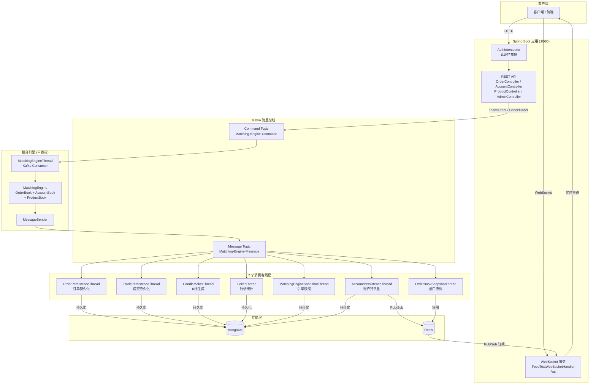
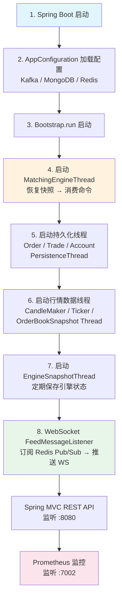
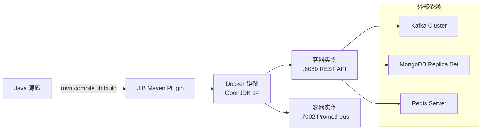

# gitbitex-new 系统架构文档

## 1. 项目背景

gitbitex-new 是一个用 Java/Spring Boot 重写的加密货币交易所后端系统。该项目是对原有交易所系统的全面重构，选择 Java 技术栈的核心原因包括：

- **MongoDB 的灵活性**：文档型数据库天然适合交易所中多变的数据结构（订单、快照、K线等），无需频繁迁移 schema
- **Spring 生态系统**：Spring Boot + Spring MVC + Spring WebSocket 提供了完整的 Web 框架支持，开发效率高
- **更好的监控能力**：集成 Spring Actuator + Prometheus，提供生产级监控指标（端口 7002）
- **成熟的并发模型**：Java 的线程模型和并发工具类非常适合撮合引擎这种对吞吐和延迟要求极高的场景

## 2. 技术栈

| 组件 | 技术选型 | 版本/说明 |
|------|---------|----------|
| 语言 | Java | OpenJDK 14 |
| Web 框架 | Spring Boot + Spring MVC | REST API |
| 实时通信 | Spring WebSocket | 行情推送 |
| 消息队列 | Apache Kafka | 命令与消息传递 |
| 数据库 | MongoDB | 持久化存储（需 Replica Set） |
| 缓存/Pub-Sub | Redis (Redisson) | 200 连接池，行情推送 |
| 序列化 | FastJSON | 命令/消息序列化 |
| 压缩 | Zstandard | Kafka 消息压缩 |
| 容器化 | Docker (JIB Maven Plugin) | 构建与部署 |
| 监控 | Prometheus + Spring Actuator | 端口 7002 |

## 3. 整体架构



## 4. 启动序列



## 5. 核心配置

应用配置文件 `application.properties` 中的关键设置：

| 配置项 | 说明 | 默认值 |
|-------|------|-------|
| `gbe.matching-engine-command-topic` | 撮合引擎命令 Topic | Matching-Engine-Command |
| `gbe.matching-engine-message-topic` | 撮合引擎消息 Topic | Matching-Engine-Message |
| `kafka.bootstrap-servers` | Kafka 集群地址 | — |
| `mongodb.uri` | MongoDB 连接字符串 | — |
| `redis.address` | Redis 地址 | — |
| `server.port` | REST API 端口 | 8080 |
| `management.server.port` | Prometheus 监控端口 | 7002 |

## 6. 部署方式

项目使用 **Google JIB Maven Plugin** 构建 Docker 镜像，基于 **OpenJDK 14** 运行时：



**端口映射**：
- `8080`：REST API + WebSocket
- `7002`：Prometheus 指标暴露（Spring Actuator）

## 7. 源码目录结构

```
gitbitex-new/
├── src/main/java/com/gitbitex/
│   ├── Bootstrap.java                    # 启动入口，初始化所有线程
│   ├── AppConfiguration.java             # 全局配置加载
│   ├── matchingengine/
│   │   ├── MatchingEngineThread.java     # 撮合引擎线程（Kafka Consumer）
│   │   ├── MatchingEngine.java           # 撮合引擎核心逻辑
│   │   ├── MatchingEngineSnapshotThread.java  # 引擎快照线程
│   │   ├── OrderBook.java               # 订单簿
│   │   ├── AccountBook.java             # 账户簿
│   │   ├── ProductBook.java             # 产品簿
│   │   ├── Depth.java                   # 深度（TreeMap 封装）
│   │   ├── PriceGroupedOrderCollection.java  # 价格分组订单集合
│   │   ├── MessageSender.java           # 消息发送器
│   │   ├── L2OrderBook.java             # L2 行情订单簿
│   │   ├── command/                     # 命令类型定义
│   │   └── message/                     # 消息类型定义
│   ├── kafka/
│   │   ├── KafkaConsumerThread.java      # Kafka 消费者基类
│   │   ├── CommandSerializer.java        # 命令序列化器
│   │   ├── CommandDeserializer.java      # 命令反序列化器
│   │   ├── MessageSerializer.java        # 消息序列化器
│   │   └── MessageDeserializer.java      # 消息反序列化器
│   ├── controller/
│   │   ├── OrderController.java          # 订单 API
│   │   ├── AccountController.java        # 账户 API
│   │   ├── ProductController.java        # 产品 API
│   │   ├── AdminController.java          # 管理 API
│   │   ├── UserController.java           # 用户 API
│   │   └── AuthInterceptor.java          # 认证拦截器
│   ├── feed/
│   │   ├── FeedTextWebSocketHandler.java # WebSocket 处理器
│   │   ├── FeedMessageListener.java      # Redis Pub/Sub 监听器
│   │   ├── SessionManager.java           # 会话管理
│   │   └── message/                      # Feed 消息类型
│   ├── marketdata/
│   │   ├── OrderPersistenceThread.java   # 订单持久化
│   │   ├── TradePersistenceThread.java   # 成交持久化
│   │   ├── AccountPersistenceThread.java # 账户持久化
│   │   ├── CandleMakerThread.java        # K线生成
│   │   ├── TickerThread.java             # 行情统计
│   │   └── OrderBookSnapshotThread.java  # 盘口快照
│   ├── manager/
│   │   ├── OrderManager.java             # 订单管理
│   │   ├── TradeManager.java             # 成交管理
│   │   └── AccountManager.java           # 账户管理
│   └── stripedexecutor/
│       └── StripedExecutorService.java   # 条纹化执行器
├── src/main/resources/
│   └── application.properties            # 应用配置
├── pom.xml                               # Maven 配置
└── Dockerfile / JIB config               # 容器化配置
```

## 8. 关键设计决策

### 8.1 单线程撮合引擎

**决策**：`MatchingEngineThread` 使用单线程处理所有撮合命令。

**理由**：
- 消除并发锁竞争，避免死锁风险
- 保证订单处理的严格顺序性（Price-Time Priority）
- 简化状态管理，AccountBook 和 OrderBook 不需要加锁
- 参考 LMAX Disruptor 的设计理念：单线程 + 无锁 = 极致性能

### 8.2 AccountBook 内置于引擎

**决策**：资金管理（`AccountBook`）直接嵌入撮合引擎内部，而非独立服务。

**理由**：
- 订单撮合与资金变动必须是原子操作：下单时 `hold()` 冻结资金 → 成交时 `exchange()` 划转资金
- 若资金管理独立，需要分布式事务，增加复杂度和延迟
- 单线程内操作 AccountBook，天然保证一致性

### 8.3 MongoDB 事务用于快照

**决策**：引擎快照使用 MongoDB 事务（要求 Replica Set），使用 Snapshot 隔离级别。

**理由**：
- 引擎快照包含多个集合（`snapshot_engine`、`snapshot_account`、`snapshot_order`、`snapshot_product`），必须保证原子写入
- 恢复时需要读取一致的快照状态
- MongoDB 4.0+ 的多文档事务满足需求，Snapshot 隔离级别防止读取到部分写入的快照

### 8.4 Kafka 全局单 Topic

**决策**：命令和消息各使用一个全局 Topic（而非按产品分 Topic）。

**理由**：
- 简化拓扑，降低运维复杂度
- 撮合引擎是单线程的，多 Topic 不会带来并行度提升
- 全局消息序列号（`messageSequence`）保证跨产品的消息有序
- 消费者可按需过滤，无需订阅多个 Topic
