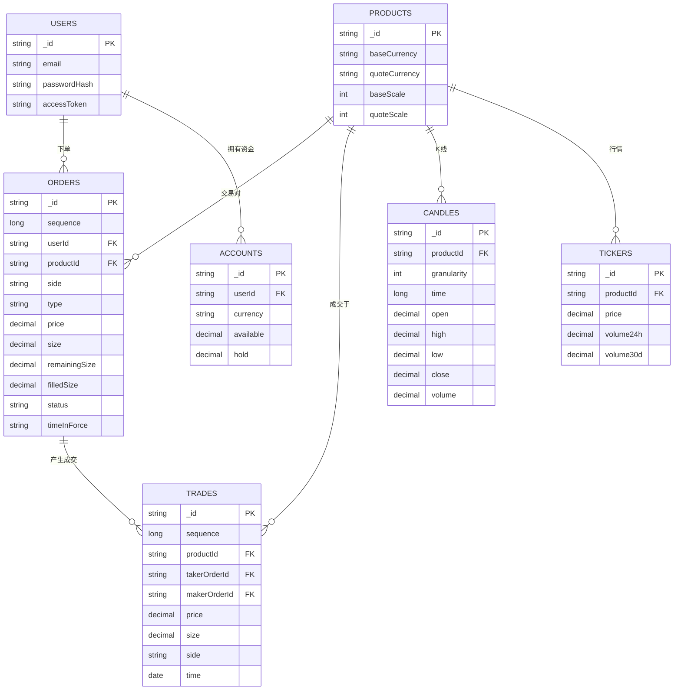
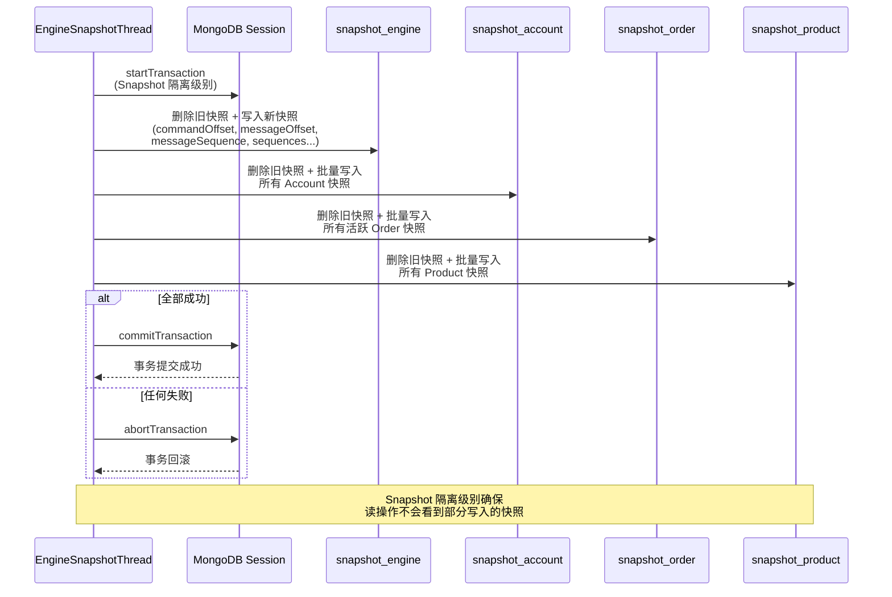
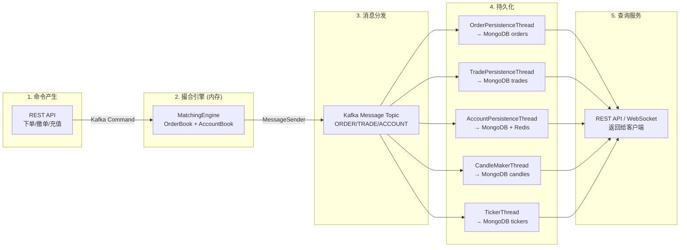

# gitbitex-new MongoDB 数据模型详解

## 1. 概述

gitbitex-new 使用 MongoDB 作为主要持久化存储，利用其文档型数据库的灵活性来存储交易所的各类数据。系统要求 MongoDB 以 **Replica Set** 模式运行，以支持多文档事务（用于引擎快照的原子写入）。

## 2. 集合总览

| 集合名 | 用途 | 写入方 | 读取方 |
|-------|------|-------|-------|
| `snapshot_engine` | 撮合引擎快照 | EngineSnapshotThread | MatchingEngineThread（启动恢复） |
| `snapshot_account` | 账户快照 | EngineSnapshotThread | MatchingEngineThread（启动恢复） |
| `snapshot_order` | 订单快照 | EngineSnapshotThread | MatchingEngineThread（启动恢复） |
| `snapshot_product` | 产品快照 | EngineSnapshotThread | MatchingEngineThread（启动恢复） |
| `orders` | 订单记录 | OrderPersistenceThread | OrderController（查询） |
| `trades` | 成交记录 | TradePersistenceThread | REST API（查询） |
| `candles` | K线数据 | CandleMakerThread | REST API / WebSocket |
| `tickers` | 行情统计 | TickerThread | REST API / WebSocket |
| `users` | 用户信息 | UserController | AuthInterceptor |

## 3. 快照集合 Schema

### 3.1 snapshot_engine（引擎快照）

引擎快照记录撮合引擎的全局状态，用于崩溃恢复。

| 字段 | 类型 | 说明 |
|------|------|------|
| `_id` | ObjectId | MongoDB 自动生成 |
| `commandOffset` | long | 已处理的最后一条 Kafka Command 的偏移量 |
| `messageOffset` | long | 已发送的最后一条 Kafka Message 的偏移量 |
| `messageSequence` | long | 全局消息序列号 |
| `orderSequences` | Map\<String, Long\> | 每个产品的订单序列号，key=productId |
| `tradeSequences` | Map\<String, Long\> | 每个产品的成交序列号，key=productId |
| `orderBookSequences` | Map\<String, Long\> | 每个产品的订单簿变更序列号，key=productId |
| `createdAt` | Date | 快照创建时间 |

### 3.2 snapshot_account（账户快照）

| 字段 | 类型 | 说明 |
|------|------|------|
| `_id` | String | 格式：`{userId}_{currency}`，复合主键 |
| `userId` | String | 用户 ID |
| `currency` | String | 币种（如 BTC, USDT） |
| `available` | BigDecimal | 可用余额 |
| `hold` | BigDecimal | 冻结余额 |

### 3.3 snapshot_order（订单快照）

| 字段 | 类型 | 说明 |
|------|------|------|
| `_id` | String | 订单 ID |
| `sequence` | long | 订单序列号 |
| `userId` | String | 用户 ID |
| `productId` | String | 交易对 |
| `side` | String | BUY / SELL |
| `type` | String | LIMIT / MARKET |
| `price` | BigDecimal | 限价价格 |
| `size` | BigDecimal | 下单数量 |
| `remainingSize` | BigDecimal | 剩余未成交数量 |
| `filledSize` | BigDecimal | 已成交数量 |
| `executedValue` | BigDecimal | 已成交金额 |
| `funds` | BigDecimal | 市价买单资金上限 |
| `remainingFunds` | BigDecimal | 市价买单剩余资金 |
| `status` | String | 订单状态 |
| `timeInForce` | String | GTC / IOC / GTX |

**复合索引**：`{ productId: 1, sequence: 1 }` — 用于按产品恢复订单簿时的有序查询。

### 3.4 snapshot_product（产品快照）

| 字段 | 类型 | 说明 |
|------|------|------|
| `_id` | String | 产品 ID（如 BTC-USDT） |
| `baseCurrency` | String | 基础币种 |
| `quoteCurrency` | String | 计价币种 |
| `baseScale` | int | 基础币种精度 |
| `quoteScale` | int | 计价币种精度 |

## 4. 业务数据集合 Schema

### 4.1 orders（订单记录）

由 `OrderPersistenceThread` 通过 `OrderManager` 写入。

| 字段 | 类型 | 说明 |
|------|------|------|
| `_id` | String | 订单 ID |
| `sequence` | long | 订单序列号 |
| `userId` | String | 用户 ID |
| `productId` | String | 交易对 |
| `side` | String | BUY / SELL |
| `type` | String | LIMIT / MARKET |
| `price` | BigDecimal | 限价价格 |
| `size` | BigDecimal | 下单数量 |
| `remainingSize` | BigDecimal | 剩余量 |
| `filledSize` | BigDecimal | 已成交量 |
| `executedValue` | BigDecimal | 已成交金额 |
| `status` | String | 订单状态 |
| `timeInForce` | String | 有效期策略 |
| `createdAt` | Date | 创建时间 |
| `updatedAt` | Date | 最后更新时间 |

### 4.2 trades（成交记录）

由 `TradePersistenceThread` 通过 `TradeManager` 写入。

| 字段 | 类型 | 说明 |
|------|------|------|
| `_id` | String | 成交 ID |
| `sequence` | long | 成交序列号 |
| `productId` | String | 交易对 |
| `takerOrderId` | String | Taker 订单 ID |
| `makerOrderId` | String | Maker 订单 ID |
| `price` | BigDecimal | 成交价格 |
| `size` | BigDecimal | 成交数量 |
| `side` | String | Taker 方向 |
| `time` | Date | 成交时间 |

### 4.3 candles（K线数据）

由 `CandleMakerThread` 写入。

| 字段 | 类型 | 说明 |
|------|------|------|
| `_id` | String | 复合 ID（productId + granularity + time） |
| `productId` | String | 交易对 |
| `granularity` | int | 时间粒度（秒）：60, 300, 900, 1800, 3600, 21600, 86400 |
| `time` | long | K线起始时间戳（对齐到粒度边界） |
| `open` | BigDecimal | 开盘价 |
| `high` | BigDecimal | 最高价 |
| `low` | BigDecimal | 最低价 |
| `close` | BigDecimal | 收盘价 |
| `volume` | BigDecimal | 成交量 |

### 4.4 tickers（行情统计）

由 `TickerThread` 写入。

| 字段 | 类型 | 说明 |
|------|------|------|
| `_id` | String | 产品 ID |
| `productId` | String | 交易对 |
| `price` | BigDecimal | 最新价 |
| `open24h` | BigDecimal | 24 小时开盘价 |
| `high24h` | BigDecimal | 24 小时最高价 |
| `low24h` | BigDecimal | 24 小时最低价 |
| `volume24h` | BigDecimal | 24 小时成交量 |
| `volume30d` | BigDecimal | 30 天成交量 |
| `time` | Date | 更新时间 |

### 4.5 users（用户信息）

| 字段 | 类型 | 说明 |
|------|------|------|
| `_id` | String | 用户 ID |
| `email` | String | 邮箱 |
| `passwordHash` | String | 密码哈希 |
| `accessToken` | String | 认证令牌 |
| `createdAt` | Date | 注册时间 |

## 5. 数据关系图

## 6. 事务模型

### MongoDB Replica Set 要求

引擎快照写入涉及 4 个集合的原子更新，必须使用 MongoDB 多文档事务：

### Snapshot 隔离级别

- 读操作在事务开始时获取一致的数据快照
- 恢复时读取的快照数据保证完整性
- 不会读到其他事务部分提交的数据

## 7. 索引策略

| 集合 | 索引 | 类型 | 用途 |
|------|------|------|------|
| `snapshot_order` | `{ productId: 1, sequence: 1 }` | 复合索引 | 按产品恢复订单簿 |
| `orders` | `{ _id: 1 }` | 主键（默认） | 按 ID 查询订单 |
| `orders` | `{ userId: 1, productId: 1 }` | 复合索引 | 用户订单列表查询 |
| `trades` | `{ productId: 1, time: -1 }` | 复合索引 | 成交历史查询 |
| `candles` | `{ productId: 1, granularity: 1, time: 1 }` | 复合索引 | K线数据查询 |
| `users` | `{ accessToken: 1 }` | 单字段索引 | 认证拦截器查询 |

## 8. 数据生命周期

### 数据一致性说明

- **引擎内存状态** 是系统的权威数据源（Source of Truth）
- MongoDB 中的数据是引擎状态的 **异步投影**（eventual consistency）
- 查询 API 返回的数据可能略有延迟（毫秒级）
- 只有引擎快照才使用事务保证原子性，其他持久化操作是单文档写入（MongoDB 单文档写入天然是原子的）

## 9. 关键源文件

| 文件 | 路径 | 说明 |
|------|------|------|
| MatchingEngineSnapshotThread | `matchingengine/MatchingEngineSnapshotThread.java` | 快照写入（事务） |
| MatchingEngineThread | `matchingengine/MatchingEngineThread.java` | 快照恢复 |
| OrderManager | `manager/OrderManager.java` | 订单 CRUD |
| TradeManager | `manager/TradeManager.java` | 成交 CRUD |
| AccountManager | `manager/AccountManager.java` | 账户 CRUD |
| AppConfiguration | `AppConfiguration.java` | MongoDB 配置 |
