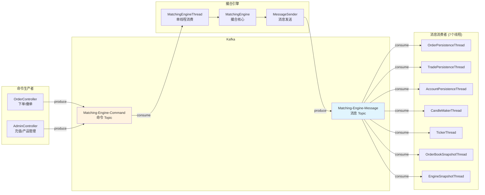
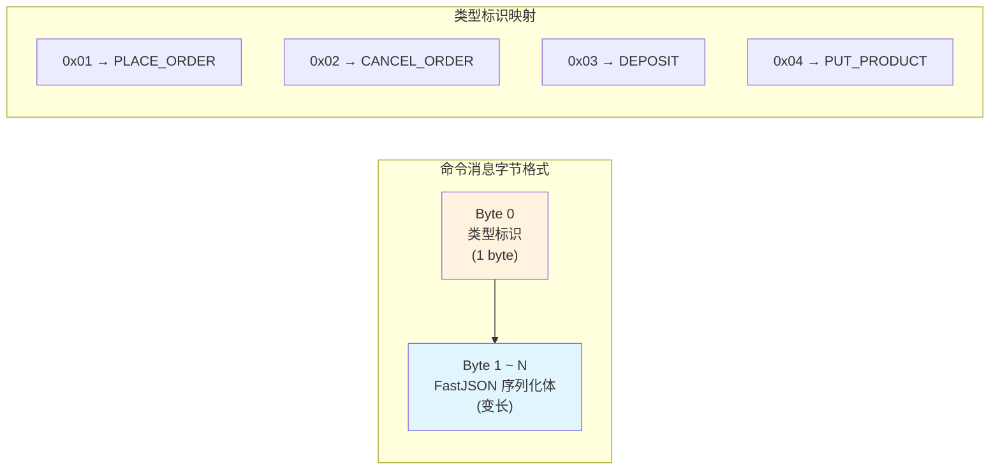
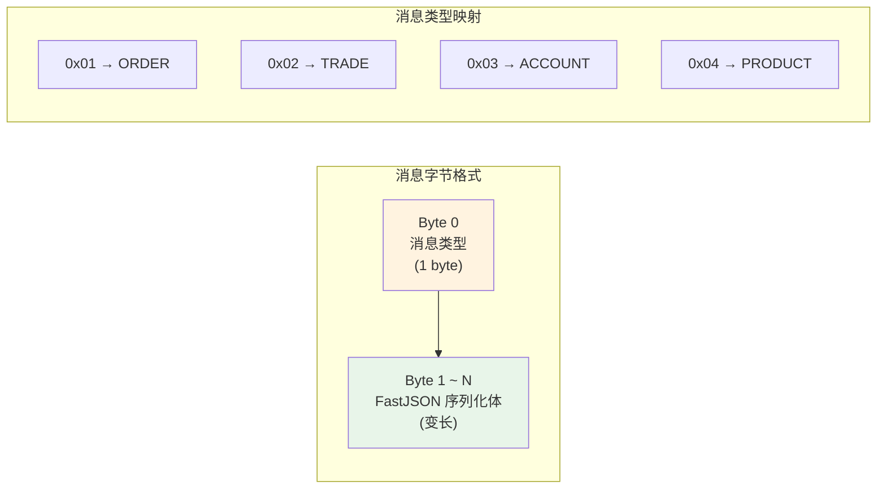
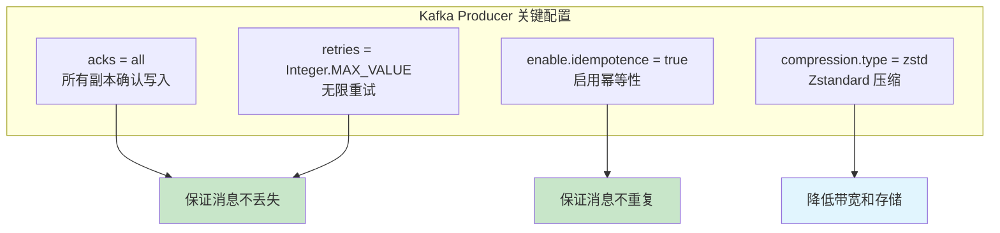
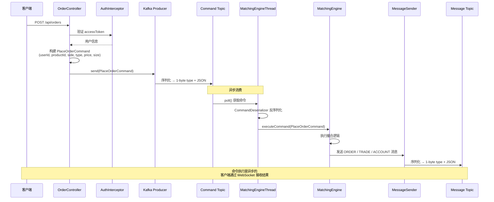
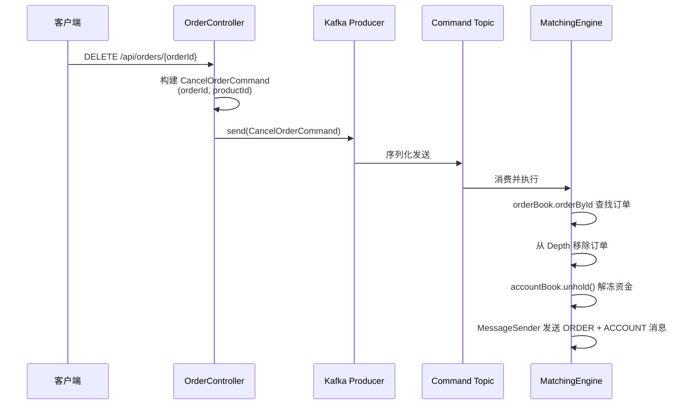
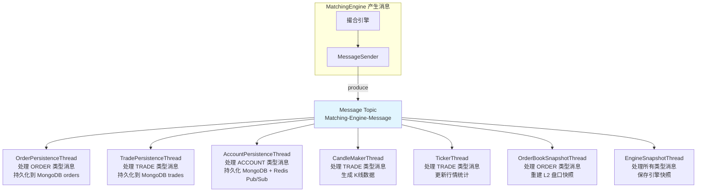
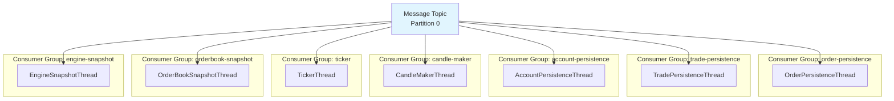
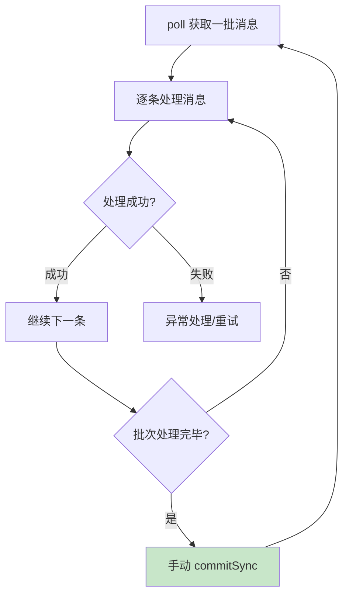

# gitbitex-new Kafka 消息系统详解

## 1. 概述

Kafka 是 gitbitex-new 的消息中枢，承担着撮合引擎与其他组件之间的解耦通信。系统采用 **双 Topic 架构**：一个用于命令输入，一个用于结果输出，形成清晰的数据流向。

## 2. 双 Topic 架构



### 为什么用全局单 Topic 而非按产品分 Topic？

| 方面 | 单 Topic（当前设计） | 多 Topic（按产品） |
|------|-------------------|------------------|
| 运维复杂度 | 低，只管理 2 个 Topic | 高，Topic 数量随产品增加 |
| 撮合引擎适配 | 天然匹配（单线程消费） | 需要多 consumer 或 topic 切换 |
| 全局序列号 | messageSequence 天然有序 | 需要额外的跨 Topic 排序机制 |
| 扩展性 | 单机性能上限受限 | 理论上可按产品水平扩展 |
| 消费者过滤 | 消费者需按需过滤 | 天然按产品隔离 |

**结论**：由于撮合引擎是单线程的，多 Topic 不会带来并行度提升，因此选择简单的单 Topic 方案。

## 3. 命令序列化

### 字节布局



### CommandSerializer

```
序列化流程:
1. 写入 1 字节类型标识 (CommandType.ordinal 或固定映射)
2. 使用 FastJSON 将 Command 对象序列化为 JSON 字符串
3. 将 JSON 字符串转为 UTF-8 字节数组
4. 拼接: [type_byte] + [json_bytes]
```

### CommandDeserializer

```
反序列化流程:
1. 读取第 1 个字节，确定命令类型
2. 根据类型映射到对应的 Command 类
3. 截取剩余字节，使用 FastJSON 反序列化为 Command 对象
```

## 4. 消息序列化

消息（Message）的序列化格式与命令完全相同：**1 字节类型 + FastJSON 体**。

### MessageSerializer / MessageDeserializer



## 5. Zstandard 压缩

Kafka Producer 配置使用 **Zstandard (zstd)** 压缩算法：

| 特性 | 说明 |
|------|------|
| 压缩率 | 优于 gzip 和 snappy，通常可达 5:1 以上 |
| 速度 | 解压速度极快，压缩速度与 gzip 相当 |
| CPU 开销 | 中等，适合高吞吐场景 |
| 适用性 | JSON 文本压缩效果极佳 |

由于命令和消息体都是 JSON 格式（FastJSON），文本类数据的压缩效果非常显著，可以大幅降低 Kafka 集群的磁盘和网络开销。

## 6. 幂等 Producer 配置



### 幂等性保证

- `acks=all`：消息必须被所有 ISR（In-Sync Replicas）确认后才算写入成功
- `retries=Integer.MAX_VALUE`：网络抖动或 Leader 切换时自动重试，不丢消息
- `enable.idempotence=true`：Kafka 内部使用 Producer ID + Sequence Number 去重，即使重试也不会产生重复消息

## 7. 命令流详解

### 下单命令流



### 撤单命令流



## 8. 消息流详解



### 消费者按需过滤

每个消费者线程虽然订阅同一个 Message Topic，但只处理自己关心的消息类型：

| 消费者线程 | 关心的消息类型 | 忽略的消息类型 |
|-----------|-------------|-------------|
| OrderPersistenceThread | ORDER | TRADE, ACCOUNT, PRODUCT |
| TradePersistenceThread | TRADE | ORDER, ACCOUNT, PRODUCT |
| AccountPersistenceThread | ACCOUNT | ORDER, TRADE, PRODUCT |
| CandleMakerThread | TRADE | ORDER, ACCOUNT, PRODUCT |
| TickerThread | TRADE | ORDER, ACCOUNT, PRODUCT |
| OrderBookSnapshotThread | ORDER | TRADE, ACCOUNT, PRODUCT |
| EngineSnapshotThread | 所有类型 | 无 |

## 9. Consumer Group 设计

每个消费者线程使用 **独立的 Consumer Group**，确保每个线程都能接收到 Message Topic 的全部消息。



**关键点**：
- 不同 Group 之间互不影响，各自维护自己的消费偏移量
- 同一消息被所有 Group 消费一次（广播模式）
- 撮合引擎的 Consumer 使用单独的 Group（如 `matching-engine`）

## 10. Offset 管理

### 手动提交

所有 Kafka 消费者均禁用自动提交（`enable.auto.commit=false`），采用手动 offset 提交：



### 基于快照的恢复

引擎快照记录了 `commandOffset`，恢复时可以精确 seek 到上次处理位置：

1. 从 MongoDB 加载最新快照
2. 获取 `commandOffset` 值
3. 调用 `consumer.seek(partition, commandOffset + 1)`
4. 从断点处继续消费

## 11. 命令类型详解

### PLACE_ORDER

| 字段 | 类型 | 说明 |
|------|------|------|
| `orderId` | String | 客户端生成的订单 ID |
| `userId` | String | 用户 ID |
| `productId` | String | 交易对（如 BTC-USDT） |
| `side` | OrderSide | BUY / SELL |
| `type` | OrderType | LIMIT / MARKET |
| `price` | BigDecimal | 限价价格（市价单可为 null） |
| `size` | BigDecimal | 数量 |
| `funds` | BigDecimal | 市价买单的资金上限 |
| `timeInForce` | TimeInForce | GTC / IOC / GTX |

### CANCEL_ORDER

| 字段 | 类型 | 说明 |
|------|------|------|
| `orderId` | String | 要撤销的订单 ID |
| `productId` | String | 交易对 |

### DEPOSIT

| 字段 | 类型 | 说明 |
|------|------|------|
| `userId` | String | 用户 ID |
| `currency` | String | 币种 |
| `amount` | BigDecimal | 充值金额 |

### PUT_PRODUCT

| 字段 | 类型 | 说明 |
|------|------|------|
| `productId` | String | 交易对 ID |
| `baseCurrency` | String | 基础币种 |
| `quoteCurrency` | String | 计价币种 |
| `baseScale` | int | 基础币种精度 |
| `quoteScale` | int | 计价币种精度 |

## 12. 消息类型详解

### ORDER 消息

包含订单的完整状态快照，每次订单状态变更都会发送。

| 字段 | 说明 |
|------|------|
| 所有 Order 字段 | id, userId, productId, side, type, price, size, remainingSize, filledSize, executedValue, status 等 |
| `sequence` | 消息序列号 |
| `offset` | Kafka 消息偏移量 |

### TRADE 消息

每笔成交产生一条 TRADE 消息。

| 字段 | 说明 |
|------|------|
| `tradeId` | 成交 ID |
| `productId` | 交易对 |
| `takerOrderId` | Taker 订单 ID |
| `makerOrderId` | Maker 订单 ID |
| `price` | 成交价格 |
| `size` | 成交数量 |
| `side` | Taker 方向 |
| `time` | 成交时间 |

### ACCOUNT 消息

余额变动时发送。

| 字段 | 说明 |
|------|------|
| `userId` | 用户 ID |
| `currency` | 币种 |
| `available` | 可用余额 |
| `hold` | 冻结余额 |

### PRODUCT 消息

产品信息变更时发送。

| 字段 | 说明 |
|------|------|
| `productId` | 交易对 ID |
| `baseCurrency` | 基础币种 |
| `quoteCurrency` | 计价币种 |
| `baseScale` | 基础精度 |
| `quoteScale` | 计价精度 |

## 13. 关键源文件

| 文件 | 路径 | 说明 |
|------|------|------|
| KafkaConsumerThread | `kafka/KafkaConsumerThread.java` | 消费者线程基类 |
| CommandSerializer | `kafka/CommandSerializer.java` | 命令序列化器 |
| CommandDeserializer | `kafka/CommandDeserializer.java` | 命令反序列化器 |
| MessageSerializer | `kafka/MessageSerializer.java` | 消息序列化器 |
| MessageDeserializer | `kafka/MessageDeserializer.java` | 消息反序列化器 |
| MessageSender | `matchingengine/MessageSender.java` | 引擎内消息发送器 |
| MatchingEngineThread | `matchingengine/MatchingEngineThread.java` | 撮合引擎 Kafka 消费者 |
| AppConfiguration | `AppConfiguration.java` | Kafka 配置加载 |
