# gitbitex-new 行情数据管道详解

## 1. 概述

行情数据管道是连接撮合引擎与外部世界的桥梁。撮合引擎产生的消息通过 Kafka Message Topic 分发给 **7 个消费者线程**，每个线程负责特定的数据处理任务：持久化、K线生成、行情统计、盘口快照等。

## 2. 整体管道架构

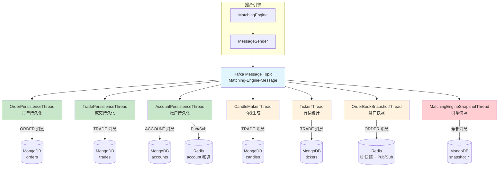

## 3. OrderPersistenceThread — 订单持久化

### 职责

消费 Kafka Message Topic 中的 **ORDER** 类型消息，将订单数据持久化到 MongoDB `orders` 集合，并通过 Redis Pub/Sub 通知 WebSocket 层。

### 处理流程

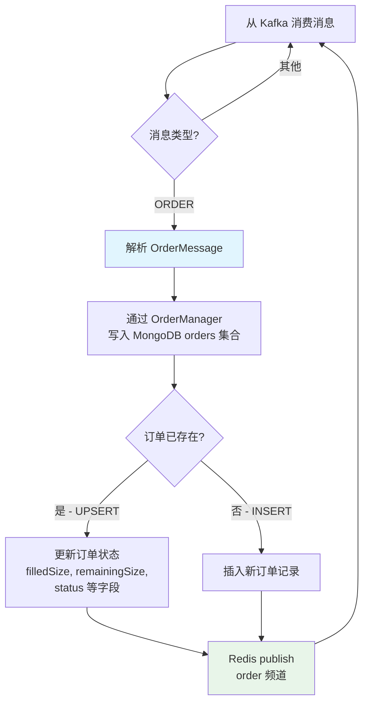

### 关键点

- 使用 MongoDB **upsert** 操作：如果订单已存在则更新，否则插入
- 一个订单在其生命周期中会收到多次 ORDER 消息（OPEN → 部分成交 → FILLED）
- 每次状态变更都会覆盖更新 MongoDB 中的记录
- 同时发布到 Redis `order` 频道，供 WebSocket `FeedMessageListener` 消费

## 4. TradePersistenceThread — 成交持久化

### 职责

消费 **TRADE** 类型消息，将成交记录持久化到 MongoDB `trades` 集合，并通知 WebSocket。

### 处理流程

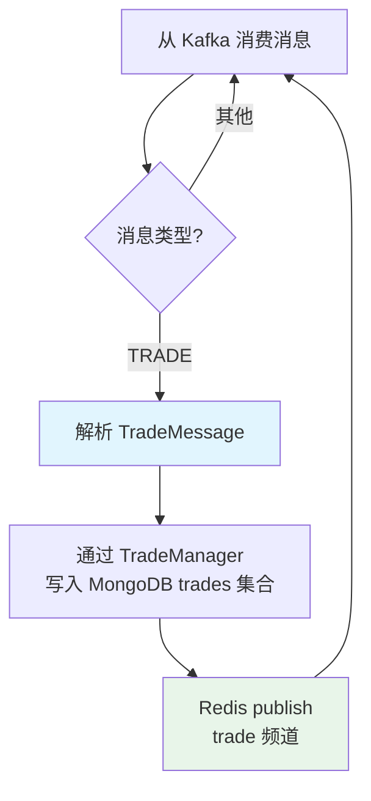

### 成交记录字段

| 字段 | 说明 |
|------|------|
| `tradeId` | 成交 ID（引擎分配） |
| `productId` | 交易对 |
| `takerOrderId` | Taker 订单 ID |
| `makerOrderId` | Maker 订单 ID |
| `price` | 成交价格（以 Maker 价格成交） |
| `size` | 成交数量 |
| `side` | Taker 方向 |
| `time` | 成交时间 |

## 5. AccountPersistenceThread — 账户持久化

### 职责

消费 **ACCOUNT** 类型消息，持久化到 MongoDB 并通过 Redis Pub/Sub 推送实时余额变更。

### 处理流程

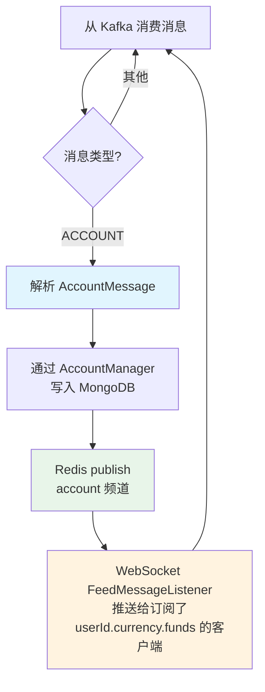

### 双写策略

AccountPersistenceThread 同时写入两个存储：
1. **MongoDB**：持久化存储，供 REST API 查询
2. **Redis Pub/Sub**：实时通知，供 WebSocket 推送

## 6. CandleMakerThread — K线生成

### 职责

消费 **TRADE** 类型消息，聚合为 OHLCV K线数据，支持 7 种时间粒度。

### 7 种时间粒度

| 粒度（秒） | 含义 | 说明 |
|-----------|------|------|
| 60 | 1 分钟 | 最小粒度 |
| 300 | 5 分钟 | |
| 900 | 15 分钟 | |
| 1800 | 30 分钟 | |
| 3600 | 1 小时 | |
| 21600 | 6 小时 | |
| 86400 | 1 天 | 最大粒度 |

### K线生成流程

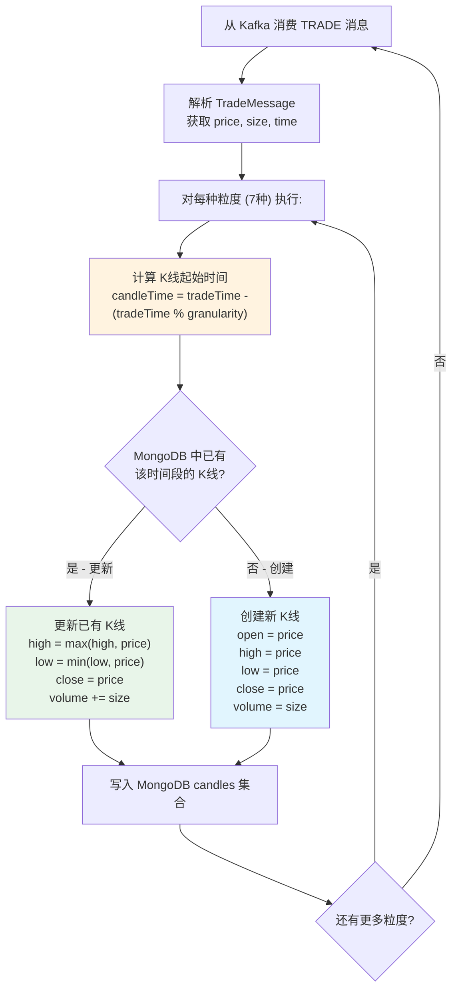

### 时间对齐公式

```
candleTime = tradeTime - (tradeTime % granularity)
```

**示例**：
- 成交时间：`10:37:42`（Unix timestamp: 1705312662）
- 1 分钟 K线时间：`1705312662 - (1705312662 % 60) = 1705312620` → `10:37:00`
- 5 分钟 K线时间：`1705312662 - (1705312662 % 300) = 1705312500` → `10:35:00`
- 1 小时 K线时间：`1705312662 - (1705312662 % 3600) = 1705312800` → `10:00:00`

### K线更新逻辑

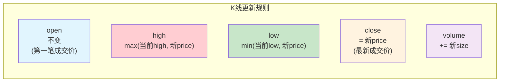

## 7. TickerThread — 行情统计

### 职责

消费 **TRADE** 类型消息，维护每个交易对的滚动窗口行情统计。

### 统计维度

| 指标 | 窗口 | 说明 |
|------|------|------|
| `price` | 实时 | 最新成交价 |
| `open24h` | 24 小时 | 24 小时前的开盘价 |
| `high24h` | 24 小时 | 24 小时内最高价 |
| `low24h` | 24 小时 | 24 小时内最低价 |
| `volume24h` | 24 小时 | 24 小时成交量 |
| `volume30d` | 30 天 | 30 天累计成交量 |

### 滚动窗口机制

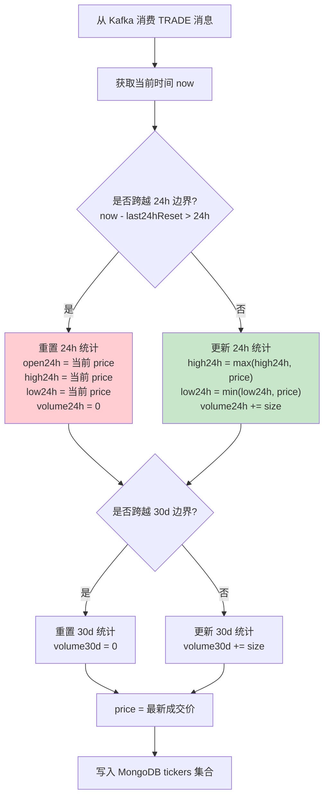

### 边界跨越判断

- **24h 边界**：当前时间 - 上次重置时间 > 86400 秒时触发重置
- **30d 边界**：当前时间 - 上次重置时间 > 2592000 秒时触发重置
- 重置后以当前成交价作为新周期的开盘价

## 8. OrderBookSnapshotThread — 盘口快照

### 职责

消费 **ORDER** 类型消息，在内存中重建 L2 订单簿，定期生成快照存储到 Redis。

### 快照触发条件

| 条件 | 说明 |
|------|------|
| 每 1000 个 sequence | 累计 1000 次订单簿变更后触发 |
| 每 1 秒 | 距上次快照超过 1 秒触发 |

两个条件满足任一即触发快照生成。

### 快照流程

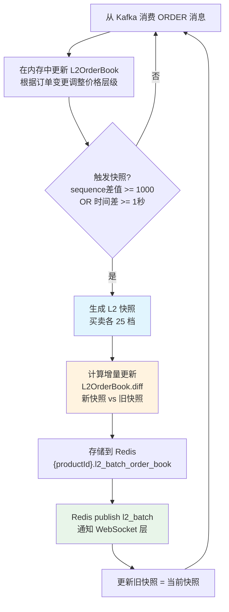

### L2 快照格式

```
{productId}.l2_batch_order_book = {
    "asks": [
        ["50000.00", "1.5", 3],    // [价格, 总量, 订单数]
        ["50001.00", "0.8", 1],
        ... (最多 25 档)
    ],
    "bids": [
        ["49999.00", "2.0", 5],
        ["49998.00", "1.2", 2],
        ... (最多 25 档)
    ]
}
```

### L3 快照

系统同时维护 L3（逐笔）快照，存储在 Redis `{productId}.l3_order_book` 中，包含每个价格层级下的所有订单详情。

## 9. MatchingEngineSnapshotThread — 引擎快照

### 职责

定期将撮合引擎的完整状态保存到 MongoDB，用于崩溃恢复。这是最关键的持久化线程。

### 快照内容

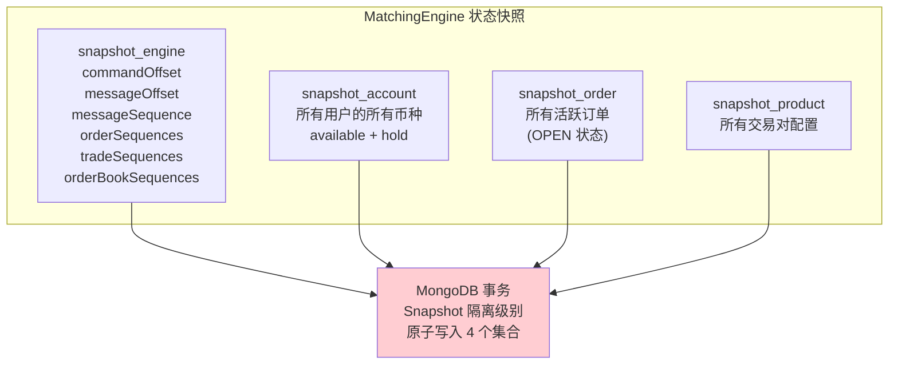

### 快照写入流程

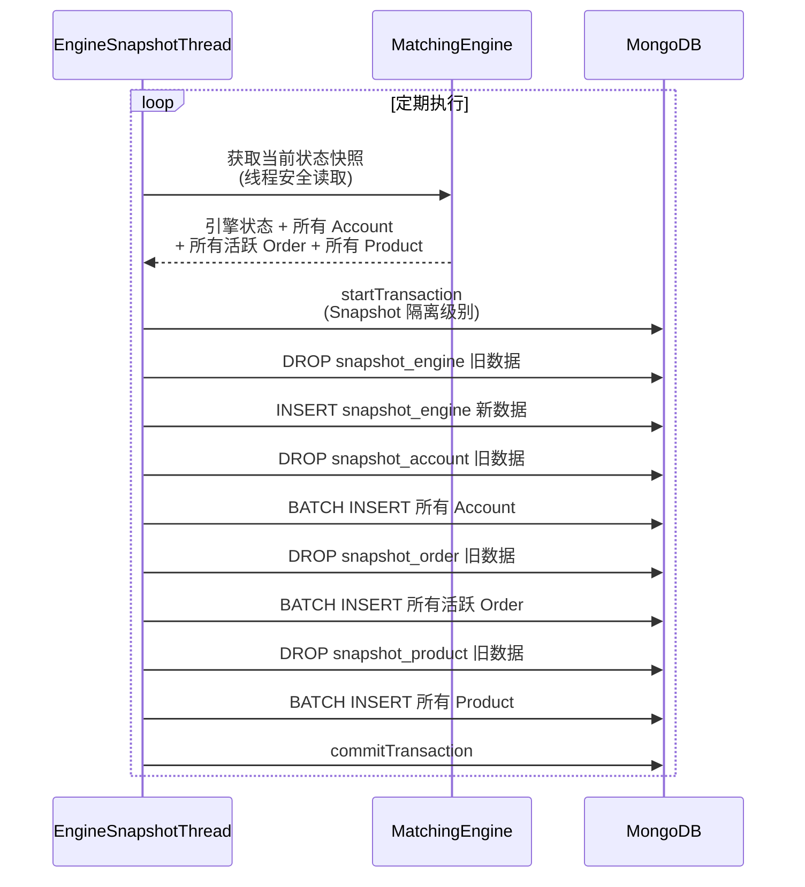

## 10. 线程模型

### KafkaConsumerThread 基类

所有 7 个消费者线程都继承自 `KafkaConsumerThread`，共享以下行为：

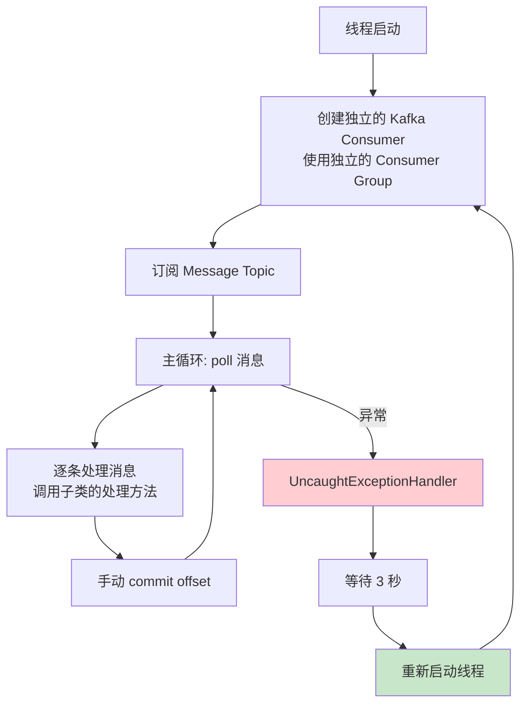

### 每个线程独立的 Kafka Consumer

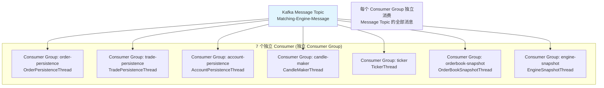

### UncaughtExceptionHandler — 线程自动恢复

当任何消费者线程因未捕获异常而终止时：

1. `UncaughtExceptionHandler` 捕获异常
2. 记录错误日志
3. 等待 **3 秒**（避免快速重启循环）
4. 创建新线程实例并启动

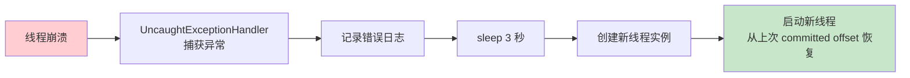

**恢复机制**：
- 新线程从最后一次 committed offset 开始消费
- 可能会重复处理一些消息（at-least-once 语义）
- 持久化操作需要是幂等的（upsert）以容忍重复处理

## 11. 消息处理总结

| 线程 | 消费消息类型 | 输出目标 | 处理频率 |
|------|------------|---------|---------|
| OrderPersistenceThread | ORDER | MongoDB orders + Redis order | 每条消息 |
| TradePersistenceThread | TRADE | MongoDB trades + Redis trade | 每条消息 |
| AccountPersistenceThread | ACCOUNT | MongoDB + Redis account | 每条消息 |
| CandleMakerThread | TRADE | MongoDB candles | 每条消息 x 7 粒度 |
| TickerThread | TRADE | MongoDB tickers | 每条消息 |
| OrderBookSnapshotThread | ORDER | Redis L2/L3 | 每 1000 seq 或 1 秒 |
| EngineSnapshotThread | 全部 | MongoDB snapshot_* | 定期（事务） |

## 12. 关键源文件

| 文件 | 路径 | 说明 |
|------|------|------|
| KafkaConsumerThread | `kafka/KafkaConsumerThread.java` | 消费者线程基类 |
| OrderPersistenceThread | `marketdata/OrderPersistenceThread.java` | 订单持久化 |
| TradePersistenceThread | `marketdata/TradePersistenceThread.java` | 成交持久化 |
| AccountPersistenceThread | `marketdata/AccountPersistenceThread.java` | 账户持久化 |
| CandleMakerThread | `marketdata/CandleMakerThread.java` | K线生成 |
| TickerThread | `marketdata/TickerThread.java` | 行情统计 |
| OrderBookSnapshotThread | `marketdata/OrderBookSnapshotThread.java` | 盘口快照 |
| MatchingEngineSnapshotThread | `matchingengine/MatchingEngineSnapshotThread.java` | 引擎快照 |
| OrderManager | `manager/OrderManager.java` | 订单 MongoDB 操作 |
| TradeManager | `manager/TradeManager.java` | 成交 MongoDB 操作 |
| AccountManager | `manager/AccountManager.java` | 账户 MongoDB/Redis 操作 |
| L2OrderBook | `matchingengine/L2OrderBook.java` | L2 行情维护与 diff |
| Bootstrap | `Bootstrap.java` | 所有线程的启动入口 |
