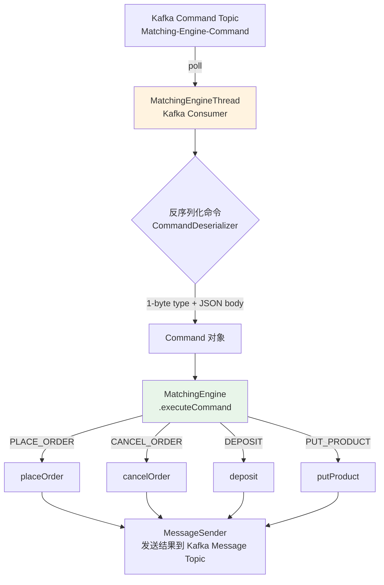
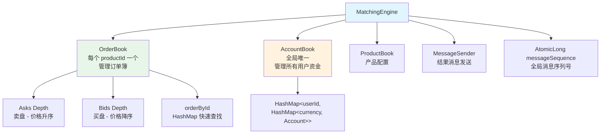
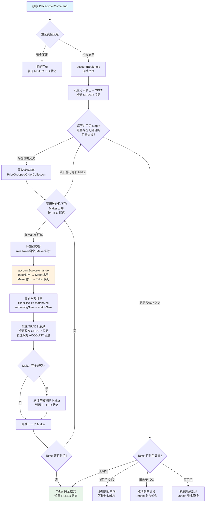
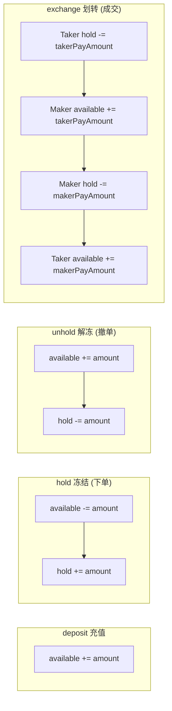
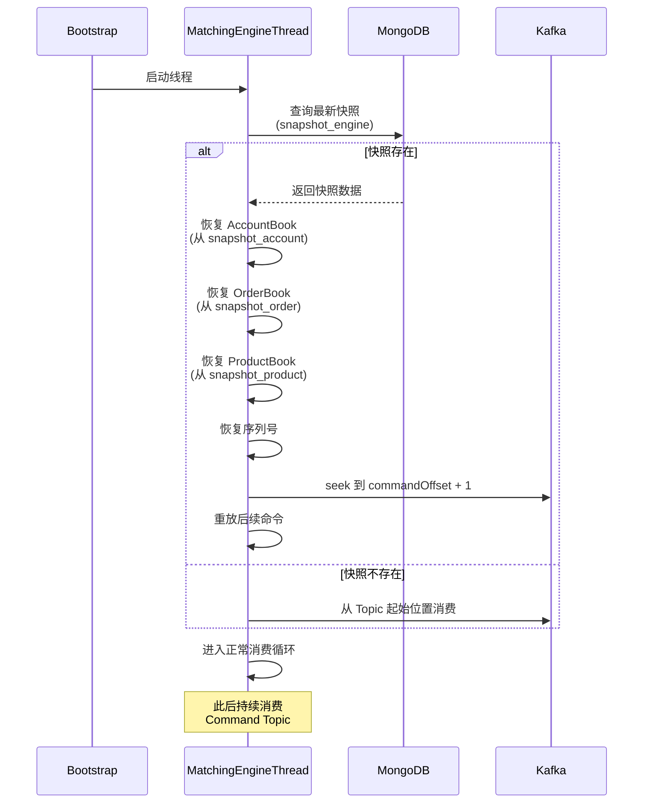

# gitbitex-new 撮合引擎详解

## 1. 概述

撮合引擎是交易所的核心组件，负责接收交易命令、执行订单撮合、管理资金划转。gitbitex-new 采用 **单线程** 设计，通过 Kafka 消费命令、内存中完成撮合、再将结果发布到 Kafka 消息 Topic。

## 2. 单线程设计理念

### 为什么选择单线程？

| 优势 | 说明 |
|------|------|
| 无锁 | OrderBook 和 AccountBook 不需要任何同步机制 |
| 确定性 | 相同的命令序列，必然产生相同的结果（可重放） |
| 低延迟 | 消除锁竞争和上下文切换开销 |
| 简单性 | 不需要处理并发 bug、死锁、竞态条件 |
| 可恢复 | 从快照恢复后重放 Kafka 命令即可恢复完整状态 |

这一设计灵感来源于 LMAX Disruptor 架构 —— 单线程处理器 + 无锁数据结构 = 极致性能。

## 3. MatchingEngineThread

`MatchingEngineThread` 继承自 `KafkaConsumerThread`，是一个专用的 Kafka 消费者线程。



### 消费流程

1. `MatchingEngineThread` 启动时先尝试恢复快照（见第 9 节）
2. 进入主循环：从 Kafka `Matching-Engine-Command` Topic 轮询消息
3. 每条消息通过 `CommandDeserializer` 反序列化为具体的 Command 对象
4. 调用 `MatchingEngine.executeCommand()` 分发处理
5. 处理结果通过 `MessageSender` 发送到 `Matching-Engine-Message` Topic

## 4. 命令类型

| 命令类型 | 类名 | 触发来源 | 说明 |
|---------|------|---------|------|
| `PLACE_ORDER` | `PlaceOrderCommand` | OrderController | 下单（限价/市价） |
| `CANCEL_ORDER` | `CancelOrderCommand` | OrderController | 撤单 |
| `DEPOSIT` | `DepositCommand` | AdminController | 充值（管理员操作） |
| `PUT_PRODUCT` | `PutProductCommand` | AdminController | 添加/更新交易对 |

## 5. MatchingEngine 核心结构

`MatchingEngine` 是撮合引擎的核心类，内部持有以下关键组件：



### 组件职责

- **OrderBook**：每个交易对（productId）对应一个 OrderBook 实例，管理买卖盘深度
- **AccountBook**：全局唯一实例，管理所有用户在所有币种上的可用余额和冻结余额
- **ProductBook**：存储交易对配置信息（精度、最小下单量等）
- **MessageSender**：将撮合结果（订单变更、成交记录、账户变动）发送到 Kafka Message Topic

## 6. 撮合算法流程

### 6.1 价格-时间优先（Price-Time Priority）

撮合遵循两个基本原则：
1. **价格优先**：买单价格高的优先成交，卖单价格低的优先成交
2. **时间优先**：同一价格下，先到的订单优先成交

### 6.2 下单撮合流程



### 6.3 撮合过程关键步骤详解

**Step 1: 资金冻结 (`accountBook.hold()`)**
- 买单：冻结 quoteAsset（如 USDT），金额 = price * size（限价）或 funds（市价）
- 卖单：冻结 baseAsset（如 BTC），数量 = size

**Step 2: 遍历对手盘**
- 买单遍历 asks（卖盘），从最低价开始
- 卖单遍历 bids（买盘），从最高价开始
- 价格交叉条件：买单价格 >= 卖单价格

**Step 3: 价格层级内 FIFO 匹配**
- 每个价格层级是一个 `PriceGroupedOrderCollection`（LinkedHashMap）
- 按插入顺序（时间优先）遍历 Maker 订单

**Step 4: 资金划转 (`accountBook.exchange()`)**
- 以 maker 价格成交（价格改善对 taker 有利）
- Taker 付出 → Maker 收到
- Maker 付出 → Taker 收到

**Step 5: 清理**
- 完全成交的 Maker 从订单簿中移除
- 空的价格层级自动移除

## 7. AccountBook 操作详解

`AccountBook` 是资金管理的核心，所有操作都在单线程中执行，无需加锁。

### 数据结构

```
HashMap<String(userId), HashMap<String(currency), Account>>
```

每个 `Account` 包含：
- `userId`：用户 ID
- `currency`：币种
- `available`：可用余额
- `hold`：冻结余额

### 操作流程



### exchange 详细示例

假设 BTC-USDT 交易对，Taker 买入 1 BTC @ 50000 USDT：

| 步骤 | Taker (买方) | Maker (卖方) |
|------|-------------|-------------|
| 成交前 | USDT: available=0, hold=50000 | BTC: available=0, hold=1 |
| exchange | USDT: hold -= 50000 | USDT: available += 50000 |
| exchange | BTC: available += 1 | BTC: hold -= 1 |
| 成交后 | USDT: hold=0, BTC: available=1 | USDT: available=50000, BTC: hold=0 |

## 8. 消息发送

每次状态变更后，`MessageSender` 将结果发送到 Kafka `Matching-Engine-Message` Topic：

| 消息类型 | 触发时机 | 包含信息 |
|---------|---------|---------|
| `ORDER` | 订单状态变更 | 完整订单信息（状态、已成交量、剩余量等） |
| `TRADE` | 每笔成交 | 成交价、成交量、买卖双方信息 |
| `ACCOUNT` | 余额变动 | 用户 ID、币种、可用余额、冻结余额 |
| `PRODUCT` | 产品变更 | 产品配置信息 |

## 9. 序列号追踪

撮合引擎维护多个序列号，确保消息的全局有序性和可追溯性：

| 序列号 | 类型 | 作用域 | 说明 |
|-------|------|-------|------|
| `messageSequence` | `AtomicLong` | 全局 | 所有消息的全局递增序列号 |
| `orderSequence` | `Map<productId, Long>` | 每个交易对 | 订单序列号，用于订单排序 |
| `tradeSequence` | `Map<productId, Long>` | 每个交易对 | 成交序列号，用于成交记录排序 |
| `orderBookSequence` | `Map<productId, Long>` | 每个交易对 | 订单簿变更序列号，用于增量更新 |

## 10. 引擎快照与恢复

### 快照机制

`MatchingEngineSnapshotThread` 定期将引擎完整状态保存到 MongoDB（使用事务，Snapshot 隔离级别）。

快照内容包括：
- `commandOffset`：已处理的 Kafka 命令偏移量
- `messageOffset`：已发送的消息偏移量
- `messageSequence`：全局消息序列号
- `orderSequences`：所有产品的订单序列号
- `tradeSequences`：所有产品的成交序列号
- `orderBookSequences`：所有产品的订单簿序列号
- 所有 `Account` 快照
- 所有活跃 `Order` 快照
- 所有 `Product` 快照

### 恢复流程



### 恢复的确定性保证

由于撮合引擎是确定性的（相同命令序列产生相同结果），从快照恢复后重放 Kafka 中剩余的命令，引擎状态会精确恢复到崩溃前的状态。这也是为什么选择单线程设计的重要原因之一。

## 11. 关键源文件

| 文件 | 路径 | 说明 |
|------|------|------|
| MatchingEngineThread | `matchingengine/MatchingEngineThread.java` | 撮合引擎线程，Kafka 消费者 |
| MatchingEngine | `matchingengine/MatchingEngine.java` | 撮合核心逻辑，命令分发 |
| OrderBook | `matchingengine/OrderBook.java` | 订单簿，管理买卖盘深度 |
| AccountBook | `matchingengine/AccountBook.java` | 账户簿，资金管理 |
| ProductBook | `matchingengine/ProductBook.java` | 产品配置管理 |
| MessageSender | `matchingengine/MessageSender.java` | 消息发送器 |
| Depth | `matchingengine/Depth.java` | 深度数据结构 |
| PriceGroupedOrderCollection | `matchingengine/PriceGroupedOrderCollection.java` | 价格分组订单集合 |
| MatchingEngineSnapshotThread | `matchingengine/MatchingEngineSnapshotThread.java` | 引擎快照线程 |
| KafkaConsumerThread | `kafka/KafkaConsumerThread.java` | Kafka 消费者线程基类 |
