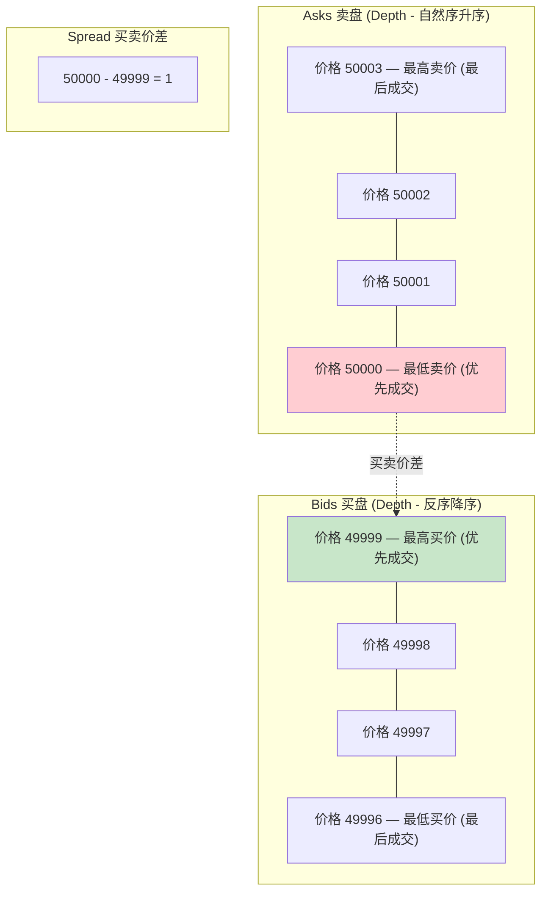
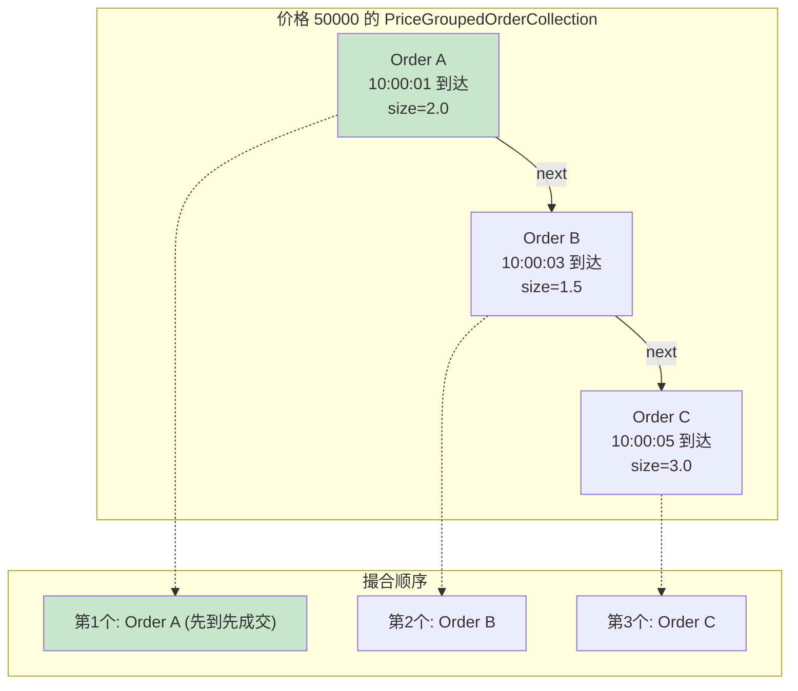
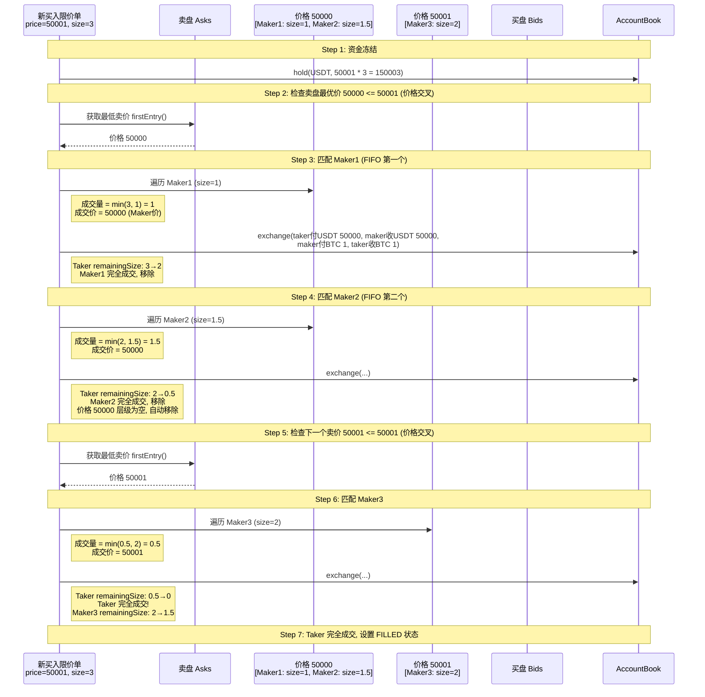
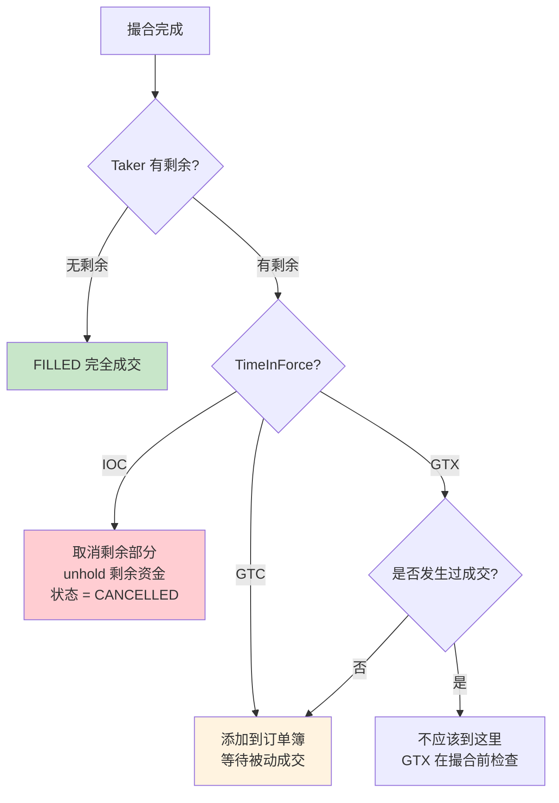
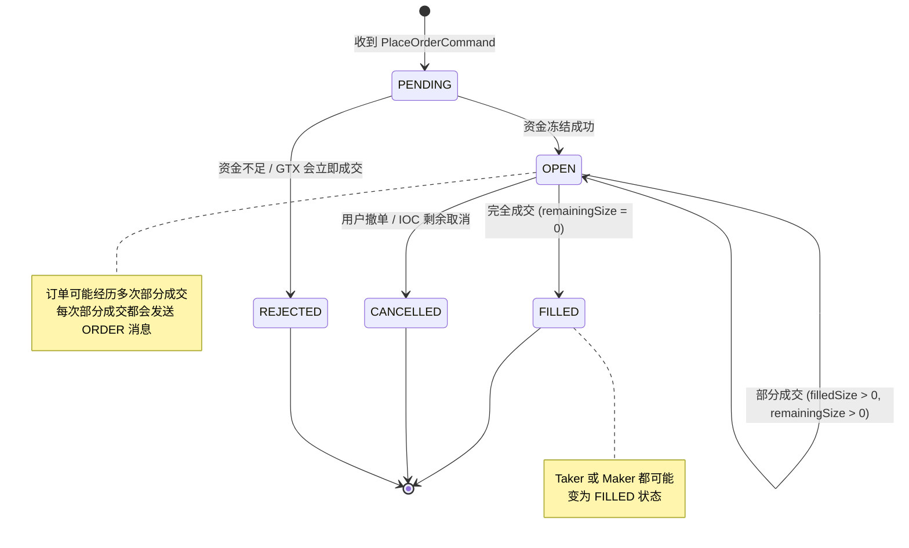
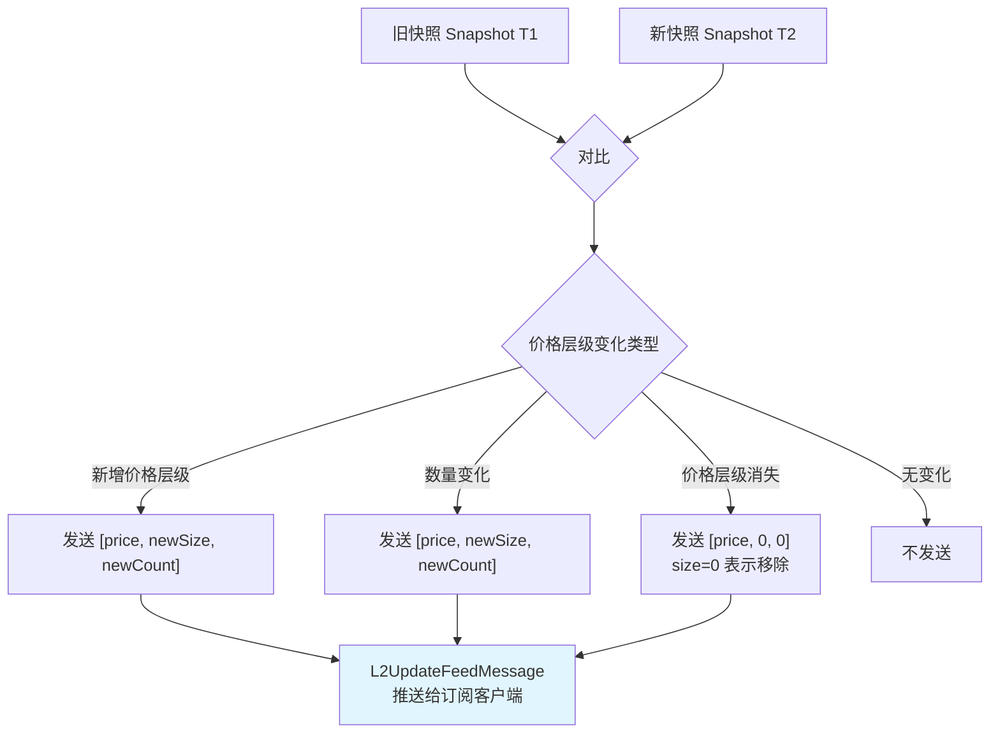

# gitbitex-new 订单簿数据结构详解

## 1. 概述

订单簿（OrderBook）是撮合引擎的核心数据结构，负责维护所有未成交订单的有序集合。gitbitex-new 的订单簿基于 TreeMap + LinkedHashMap 的组合实现了经典的 **价格-时间优先** 排序。

每个交易对（productId）拥有一个独立的 `OrderBook` 实例。

## 2. Depth 类 — 深度数据结构

`Depth` 继承自 `TreeMap<BigDecimal, PriceGroupedOrderCollection>`，是订单簿的核心容器。

### 买卖盘排序规则



| 方向 | 类型 | TreeMap 排序 | 优先成交 |
|------|------|-------------|---------|
| Asks (卖盘) | `TreeMap` 自然序 | 价格升序（低→高） | 最低卖价优先 |
| Bids (买盘) | `TreeMap` 反序 | 价格降序（高→低） | 最高买价优先 |

### TreeMap 的优势

- **O(log n) 插入/删除**：按价格插入新的价格层级
- **O(log n) 查找**：按价格查找特定层级
- **自动排序**：`firstEntry()` 始终返回最优价格（asks 最低卖价，bids 最高买价）
- **有序遍历**：天然支持按价格优先级遍历

## 3. PriceGroupedOrderCollection — 同价位订单集合

`PriceGroupedOrderCollection` 继承自 `LinkedHashMap<String, Order>`，其中 Key 是订单 ID。

### 为什么用 LinkedHashMap？



**LinkedHashMap 的关键特性**：
- 维护 **插入顺序**（insertion order），天然实现时间优先
- 同一价格下，先插入的订单一定先被遍历到，从而优先参与撮合
- O(1) 的按 ID 查找、插入、删除
- 不需要额外的时间戳比较或排序操作

### 价格层级的自动管理

当一个价格层级内的所有订单都被成交或撤销后，该 `PriceGroupedOrderCollection` 变为空。此时 `Depth`（TreeMap）会自动移除这个价格层级的 entry，保持数据结构的清洁。

## 4. orderById — 全局订单索引

```
HashMap<String(orderId), Order> orderById
```

`OrderBook` 维护一个全局的 `orderById` HashMap，提供 **O(1)** 的按 ID 查找能力。

**使用场景**：
- 撤单时快速定位订单：`CancelOrderCommand` 携带 orderId，通过 orderById 直接查找
- 避免遍历整个 Depth 结构查找特定订单
- 订单状态查询

## 5. Order 结构

| 字段 | 类型 | 说明 |
|------|------|------|
| `id` | `String` | 订单唯一标识 |
| `sequence` | `long` | 订单序列号（每个产品独立递增） |
| `userId` | `String` | 下单用户 |
| `type` | `OrderType` | 限价 (LIMIT) / 市价 (MARKET) |
| `side` | `OrderSide` | 买 (BUY) / 卖 (SELL) |
| `price` | `BigDecimal` | 限价价格（市价单为 null） |
| `size` | `BigDecimal` | 下单数量（基础币种） |
| `remainingSize` | `BigDecimal` | 剩余未成交数量 |
| `filledSize` | `BigDecimal` | 已成交数量 |
| `executedValue` | `BigDecimal` | 已成交金额（计价币种） |
| `funds` | `BigDecimal` | 市价买单的资金上限 |
| `remainingFunds` | `BigDecimal` | 市价买单的剩余资金 |
| `status` | `OrderStatus` | 订单状态 |
| `timeInForce` | `TimeInForce` | 有效期策略 |

## 6. 撮合过程详解

### 示例：买入限价单的撮合



## 7. TimeInForce 有效期策略

| 策略 | 全称 | 行为 |
|------|------|------|
| `GTC` | Good Till Cancel | 默认策略。未成交部分挂在订单簿中，直到被成交或手动撤销 |
| `IOC` | Immediate Or Cancel | 立即尽可能多地成交，未成交部分立即取消 |
| `GTX` | Good Till Crossing | Maker-Only 策略。如果会立即成交则拒绝，只允许挂单 |

### TimeInForce 处理流程



## 8. 订单状态机



## 9. L2OrderBook — 二级行情

`L2OrderBook` 用于生成和维护面向客户端的行情数据。

### 数据格式

L2 行情采用 **Line** 格式，每一行表示一个价格层级：

```
[price, size, count]
```

- `price`：价格
- `size`：该价格下的总挂单量
- `count`：该价格下的订单数量

### diff() 增量更新算法

`L2OrderBook.diff()` 方法用于计算两个快照之间的差异，生成增量更新消息：



**增量更新的优势**：
- 首次连接发送完整快照（L2SnapshotFeedMessage）
- 后续只发送变化的价格层级（L2UpdateFeedMessage）
- 大幅减少 WebSocket 带宽占用

### L2 快照深度

系统默认维护 **25 个价格层级** 的 L2 快照（买卖各 25 层），存储在 Redis 中。

## 10. 完整数据结构关系图

```mermaid
graph TB
    subgraph "OrderBook (per productId)"
        ASKS["asks: Depth<br/>(TreeMap 升序)"]
        BIDS["bids: Depth<br/>(TreeMap 降序)"]
        OBI["orderById: HashMap&lt;orderId, Order&gt;"]
    end

    subgraph "Depth (TreeMap)"
        P1["BigDecimal price1"]
        P2["BigDecimal price2"]
        P3["BigDecimal price3"]
    end

    subgraph "PriceGroupedOrderCollection (LinkedHashMap)"
        O1["Order 1 (先到)"] -->|next| O2["Order 2"] -->|next| O3["Order 3 (后到)"]
    end

    ASKS --> P1 & P2 & P3
    BIDS --> P1 & P2 & P3
    P1 --> O1
    OBI -.->|O(1) 查找| O1
    OBI -.->|O(1) 查找| O2
    OBI -.->|O(1) 查找| O3

    subgraph "Order 字段"
        FIELDS["id, sequence, userId<br/>type, side, price, size<br/>remainingSize, filledSize<br/>executedValue, funds<br/>remainingFunds, status<br/>timeInForce"]
    end

    O1 --- FIELDS

    style ASKS fill:#ffcdd2
    style BIDS fill:#c8e6c9
    style OBI fill:#fff3e0
```

## 11. 关键源文件

| 文件 | 路径 | 说明 |
|------|------|------|
| OrderBook | `matchingengine/OrderBook.java` | 订单簿主类，撮合逻辑入口 |
| Depth | `matchingengine/Depth.java` | 深度数据结构（TreeMap 封装） |
| PriceGroupedOrderCollection | `matchingengine/PriceGroupedOrderCollection.java` | 同价位订单集合（LinkedHashMap） |
| L2OrderBook | `matchingengine/L2OrderBook.java` | L2 行情订单簿，diff 算法 |
| Order | `matchingengine/Order.java` | 订单实体 |
| OrderType | `matchingengine/OrderType.java` | 订单类型枚举 |
| OrderSide | `matchingengine/OrderSide.java` | 订单方向枚举 |
| OrderStatus | `matchingengine/OrderStatus.java` | 订单状态枚举 |
| TimeInForce | `matchingengine/TimeInForce.java` | 有效期策略枚举 |
