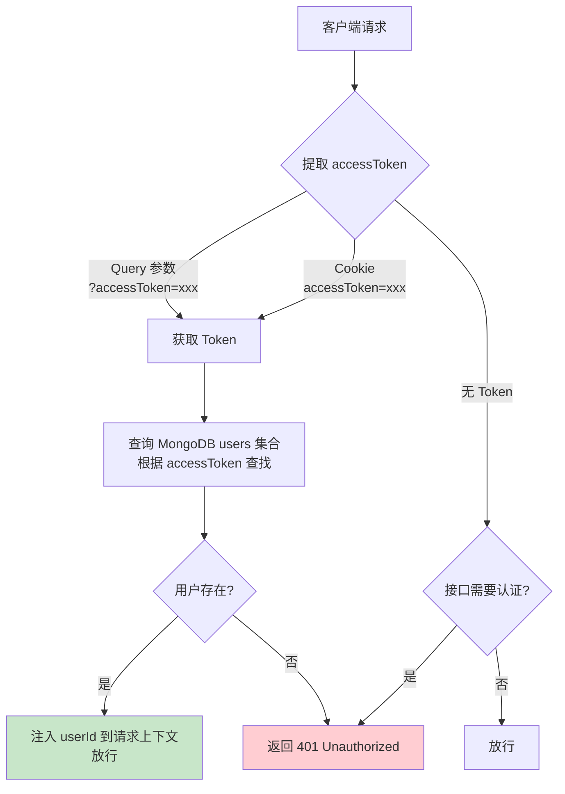
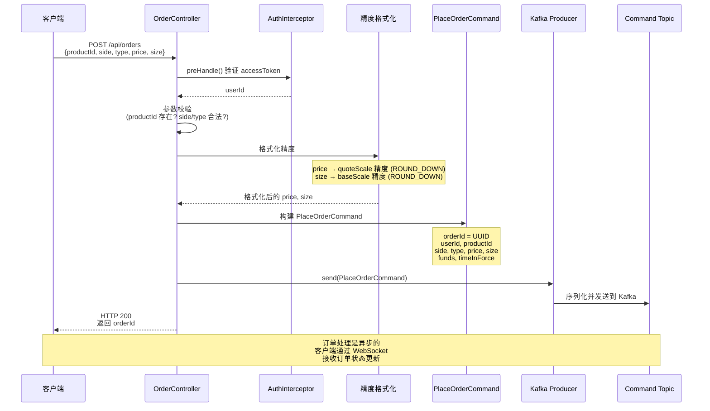
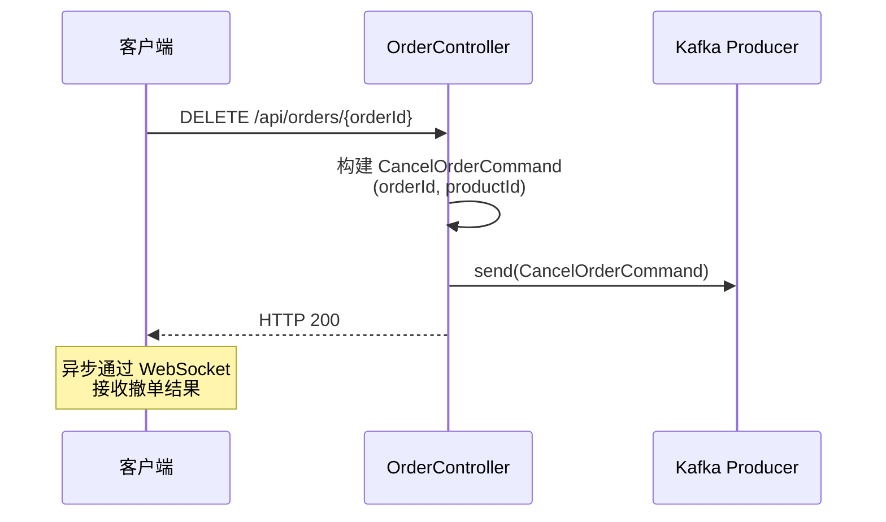
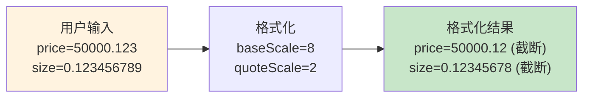

# gitbitex-new REST API 详解

## 1. 概述

gitbitex-new 使用 Spring MVC 提供 RESTful API，监听在 **8080 端口**。API 负责接收客户端请求并转化为 Kafka 命令（写操作）或从 MongoDB 查询数据（读操作）。

## 2. 认证机制

### AuthInterceptor

系统使用 `AuthInterceptor`（Spring HandlerInterceptor）进行认证，从请求中提取 `accessToken`。



### Token 来源优先级

1. **URL Query 参数**：`GET /api/orders?accessToken=abc123`
2. **Cookie**：`Cookie: accessToken=abc123`

## 3. API 端点总览

### 订单相关（OrderController）

| 方法 | 路径 | 认证 | 说明 |
|------|------|------|------|
| `POST` | `/api/orders` | 是 | 下单（限价/市价） |
| `DELETE` | `/api/orders/{orderId}` | 是 | 撤单 |
| `GET` | `/api/orders` | 是 | 查询用户订单列表 |

### 账户相关（AccountController）

| 方法 | 路径 | 认证 | 说明 |
|------|------|------|------|
| `GET` | `/api/accounts` | 是 | 查询用户所有币种余额 |

### 产品相关（ProductController）

| 方法 | 路径 | 认证 | 说明 |
|------|------|------|------|
| `GET` | `/api/products` | 否 | 获取所有交易对列表 |

### 管理员相关（AdminController）

| 方法 | 路径 | 认证 | 说明 |
|------|------|------|------|
| `POST` | `/api/admin/deposit` | 是 | 充值（管理员操作） |
| `POST` | `/api/admin/products` | 是 | 添加/更新交易对 |

### 其他

| 方法 | 路径 | 认证 | 说明 |
|------|------|------|------|
| — | UserController | — | 用户注册、登录 |
| — | ConfigController | — | 系统配置 |
| — | AppController | — | 应用信息 |
| — | CodeController | — | 验证码 |
| — | HomeController | — | 首页 |

## 4. 下单流程详解

### 请求格式

```json
POST /api/orders
Content-Type: application/json

{
    "productId": "BTC-USDT",
    "side": "BUY",
    "type": "LIMIT",
    "price": "50000.00",
    "size": "0.1",
    "funds": null,
    "timeInForce": "GTC"
}
```

### 完整下单流程



### 响应格式

```json
{
    "id": "550e8400-e29b-41d4-a716-446655440000",
    "productId": "BTC-USDT",
    "side": "BUY",
    "type": "LIMIT",
    "price": "50000.00",
    "size": "0.10000000",
    "status": "PENDING"
}
```

## 5. 撤单流程

### 请求

```
DELETE /api/orders/550e8400-e29b-41d4-a716-446655440000
```

### 流程



## 6. 订单精度格式化

不同交易对有不同的精度要求，`OrderController` 在发送命令前会进行精度格式化。

| 交易对 | baseScale | quoteScale | price 精度 | size 精度 |
|-------|-----------|------------|-----------|----------|
| BTC-USDT | 8 | 2 | 50000.**00** | 0.**10000000** |
| ETH-USDT | 8 | 2 | 3000.**00** | 1.**00000000** |
| DOGE-USDT | 2 | 6 | 0.**100000** | 100.**00** |

**舍入规则**：使用 `ROUND_DOWN`（向下截断），避免因四舍五入导致用户实际支付超过预期。



## 7. 查询订单

### 请求

```
GET /api/orders?productId=BTC-USDT&status=OPEN&limit=50
```

### 响应

```json
[
    {
        "id": "550e8400-e29b-41d4-a716-446655440000",
        "productId": "BTC-USDT",
        "side": "BUY",
        "type": "LIMIT",
        "price": "50000.00",
        "size": "0.10000000",
        "remainingSize": "0.05000000",
        "filledSize": "0.05000000",
        "executedValue": "2500.00",
        "status": "OPEN",
        "timeInForce": "GTC",
        "createdAt": "2024-01-15T10:30:00Z"
    }
]
```

## 8. 查询账户余额

### 请求

```
GET /api/accounts
```

### 响应

```json
[
    {
        "currency": "BTC",
        "available": "1.50000000",
        "hold": "0.10000000"
    },
    {
        "currency": "USDT",
        "available": "50000.00",
        "hold": "5000.00"
    }
]
```

## 9. 管理员接口

### 充值

```json
POST /api/admin/deposit
Content-Type: application/json

{
    "userId": "user-001",
    "currency": "USDT",
    "amount": "10000.00"
}
```

流程：构建 `DepositCommand` → 发送到 Kafka Command Topic → 撮合引擎执行 `accountBook.deposit()`。

### 添加交易对

```json
POST /api/admin/products
Content-Type: application/json

{
    "productId": "BTC-USDT",
    "baseCurrency": "BTC",
    "quoteCurrency": "USDT",
    "baseScale": 8,
    "quoteScale": 2
}
```

流程：构建 `PutProductCommand` → 发送到 Kafka Command Topic → 撮合引擎执行 `productBook.put()`。

## 10. 错误处理

### ExceptionAdvise（全局异常处理器）

Spring `@ControllerAdvice` 捕获所有异常并返回统一格式：

```json
{
    "message": "Insufficient funds",
    "code": "INSUFFICIENT_FUNDS"
}
```

### 常见错误码

| ErrorCode | HTTP 状态 | 说明 |
|-----------|----------|------|
| `UNAUTHORIZED` | 401 | 未认证或 Token 无效 |
| `PRODUCT_NOT_FOUND` | 404 | 交易对不存在 |
| `ORDER_NOT_FOUND` | 404 | 订单不存在 |
| `INVALID_PARAMETER` | 400 | 参数校验失败 |
| `INSUFFICIENT_FUNDS` | 400 | 资金不足 |

## 11. 请求处理架构

```mermaid
graph TB
    subgraph "Spring MVC 请求处理"
        REQ[HTTP 请求] --> DISP[DispatcherServlet]
        DISP --> AUTH[AuthInterceptor<br/>preHandle]
        AUTH --> CTRL[Controller<br/>业务逻辑]
        CTRL --> RESP[HTTP 响应]

        CTRL -->|写操作| KAFKA[Kafka Producer<br/>发送命令]
        CTRL -->|读操作| MONGO[MongoDB<br/>查询数据]
    end

    subgraph "异常处理"
        CTRL -->|异常| EA[ExceptionAdvise<br/>@ControllerAdvice]
        EA --> ERR[统一错误响应<br/>message + code]
    end

    style AUTH fill:#fff3e0
    style KAFKA fill:#e1f5fe
    style MONGO fill:#e8f5e9
```

## 12. 关键设计要点

### 异步处理模式

下单和撤单操作是 **异步** 的：
1. REST API 只负责将命令发送到 Kafka，不等待撮合结果
2. 客户端通过 WebSocket 订阅订单状态变更
3. 这种设计提高了 API 的吞吐量和响应速度

### 读写分离

- **写操作**：REST API → Kafka Command Topic → 撮合引擎
- **读操作**：REST API → MongoDB（持久化后的数据）

这意味着查询结果可能有 **轻微延迟**（毫秒级），但保证了系统的高吞吐和解耦。

## 13. 关键源文件

| 文件 | 路径 | 说明 |
|------|------|------|
| OrderController | `controller/OrderController.java` | 订单 API |
| AccountController | `controller/AccountController.java` | 账户 API |
| ProductController | `controller/ProductController.java` | 产品 API |
| AdminController | `controller/AdminController.java` | 管理员 API |
| UserController | `controller/UserController.java` | 用户 API |
| AuthInterceptor | `controller/AuthInterceptor.java` | 认证拦截器 |
| ExceptionAdvise | `controller/ExceptionAdvise.java` | 全局异常处理 |
| ConfigController | `controller/ConfigController.java` | 系统配置 API |
