# gitbitex-new WebSocket 实时推送系统详解

## 1. 概述

gitbitex-new 使用 Spring WebSocket 实现实时行情和订单推送。系统通过 Redis Pub/Sub 接收撮合引擎的处理结果，再通过 WebSocket 推送给订阅了相应频道的客户端。

WebSocket 服务端点：`ws://host:8080/ws`

## 2. 整体架构

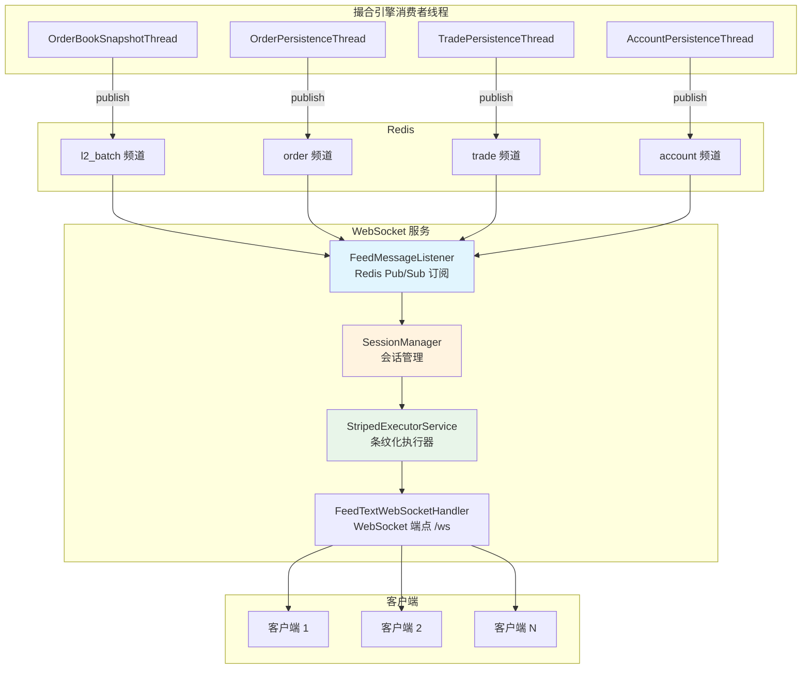

## 3. 频道列表

客户端通过订阅特定频道来接收相应数据。

| 频道格式 | 示例 | 认证 | 说明 |
|---------|------|------|------|
| `{productId}.level2` | `BTC-USDT.level2` | 否 | L2 盘口深度（25 档） |
| `{productId}.ticker` | `BTC-USDT.ticker` | 否 | 行情统计（24h/30d） |
| `{productId}.match` | `BTC-USDT.match` | 否 | 最新成交（逐笔） |
| `{userId}.{productId}.order` | `user1.BTC-USDT.order` | 是 | 用户订单状态变更 |
| `{userId}.{currency}.funds` | `user1.USDT.funds` | 是 | 用户资金余额变更 |

### 频道分类

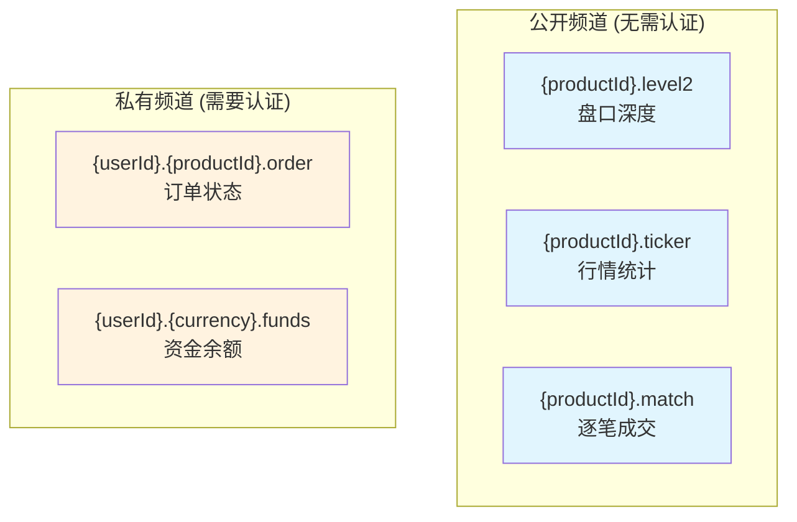

## 4. 消息类型

### 4.1 L2SnapshotFeedMessage — 盘口完整快照

客户端首次订阅 `level2` 频道时收到。

| 字段 | 类型 | 说明 |
|------|------|------|
| `type` | String | `l2_snapshot` |
| `productId` | String | 交易对 |
| `asks` | List\<List\> | 卖盘，每行 [price, size, count]，最多 25 档 |
| `bids` | List\<List\> | 买盘，每行 [price, size, count]，最多 25 档 |

### 4.2 L2UpdateFeedMessage — 盘口增量更新

后续的盘口变更以增量方式推送。

| 字段 | 类型 | 说明 |
|------|------|------|
| `type` | String | `l2_update` |
| `productId` | String | 交易对 |
| `changes` | List\<List\> | 变更列表，每行 [side, price, size]。size=0 表示删除该价位 |

### 4.3 TickerFeedMessage — 行情统计

| 字段 | 类型 | 说明 |
|------|------|------|
| `type` | String | `ticker` |
| `productId` | String | 交易对 |
| `price` | String | 最新价 |
| `open24h` | String | 24h 开盘价 |
| `high24h` | String | 24h 最高价 |
| `low24h` | String | 24h 最低价 |
| `volume24h` | String | 24h 成交量 |
| `volume30d` | String | 30d 成交量 |

### 4.4 OrderFeedMessage — 订单状态变更

| 字段 | 类型 | 说明 |
|------|------|------|
| `type` | String | `order` |
| `orderId` | String | 订单 ID |
| `productId` | String | 交易对 |
| `side` | String | BUY / SELL |
| `price` | String | 价格 |
| `size` | String | 数量 |
| `remainingSize` | String | 剩余量 |
| `filledSize` | String | 已成交量 |
| `status` | String | 订单状态 |

### 4.5 OrderMatchFeedMessage — 逐笔成交

| 字段 | 类型 | 说明 |
|------|------|------|
| `type` | String | `match` |
| `tradeId` | String | 成交 ID |
| `productId` | String | 交易对 |
| `price` | String | 成交价格 |
| `size` | String | 成交数量 |
| `side` | String | Taker 方向 |
| `time` | String | 成交时间 |

### 4.6 PongFeedMessage — 心跳响应

| 字段 | 类型 | 说明 |
|------|------|------|
| `type` | String | `pong` |

## 5. FeedMessageListener — Redis 订阅监听

`FeedMessageListener` 订阅 Redis Pub/Sub 的 4 个频道，将收到的消息转发给 WebSocket 客户端。

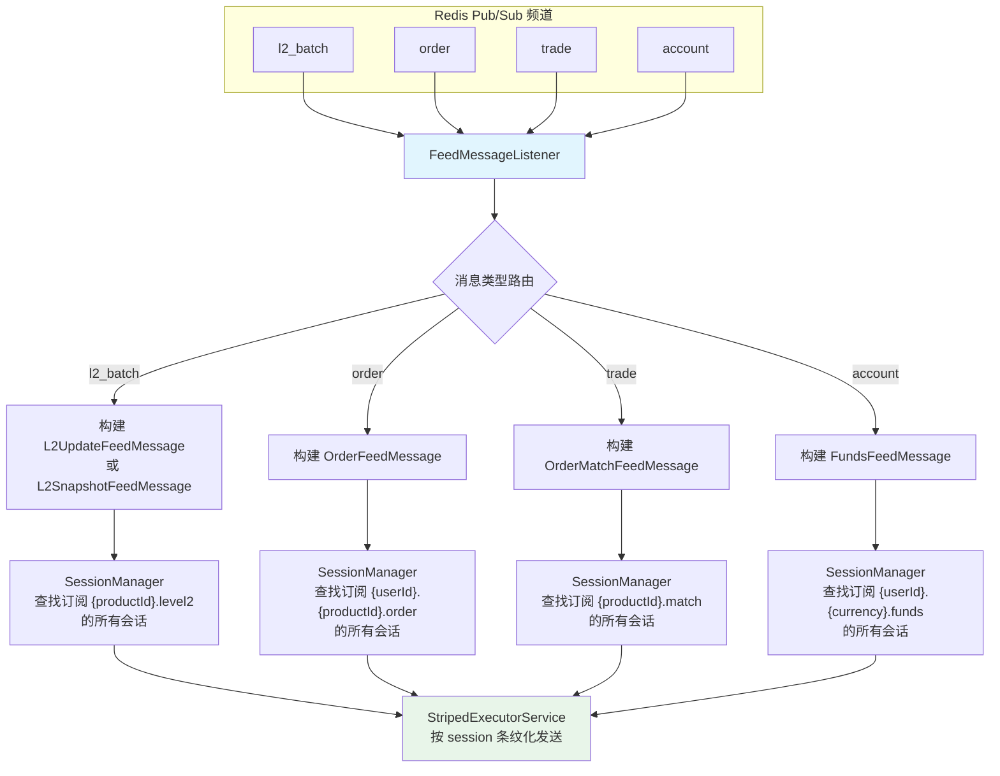

## 6. SessionManager — 会话管理

`SessionManager` 维护客户端会话与订阅频道之间的映射关系。

### 核心数据结构

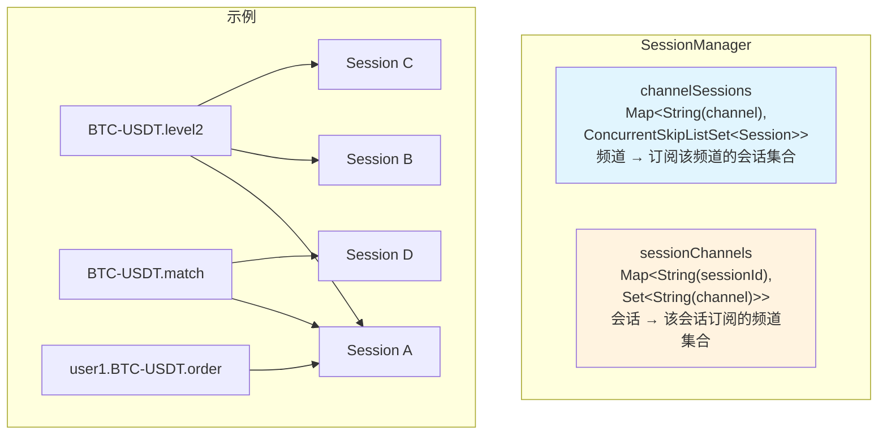

### ConcurrentSkipListSet

选择 `ConcurrentSkipListSet` 而非 `ConcurrentHashSet` 的原因：
- **线程安全**：支持高并发的读写操作
- **有序性**：可按会话 ID 排序，便于调试和管理
- **高效遍历**：推送消息时需要遍历所有订阅会话，SkipList 的遍历性能优秀

## 7. StripedExecutorService — 条纹化执行器

`StripedExecutorService` 是系统最精巧的并发组件之一，保证同一客户端的消息严格有序，同时不同客户端之间可以并行推送。

### 设计原理

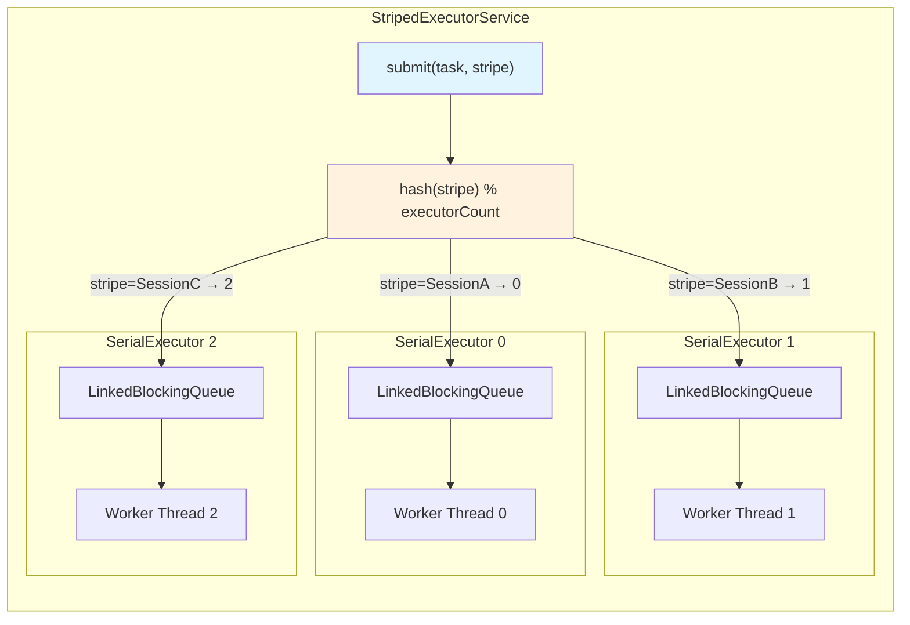

### 保序机制

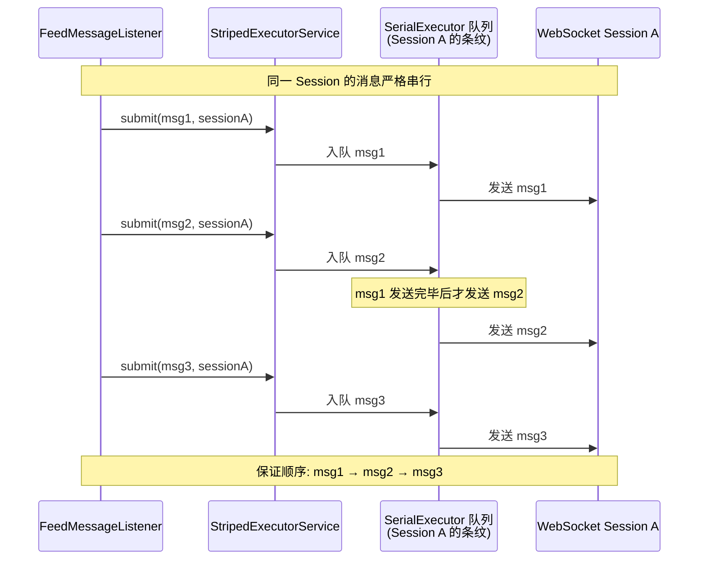

### 并行与串行的平衡

| 维度 | 行为 |
|------|------|
| 同一 Session（同一条纹） | **严格串行** — 消息按入队顺序依次发送 |
| 不同 Session（不同条纹） | **完全并行** — 互不影响，充分利用多核 |

### SerialExecutor 内部结构

每个条纹对应一个 `SerialExecutor`：

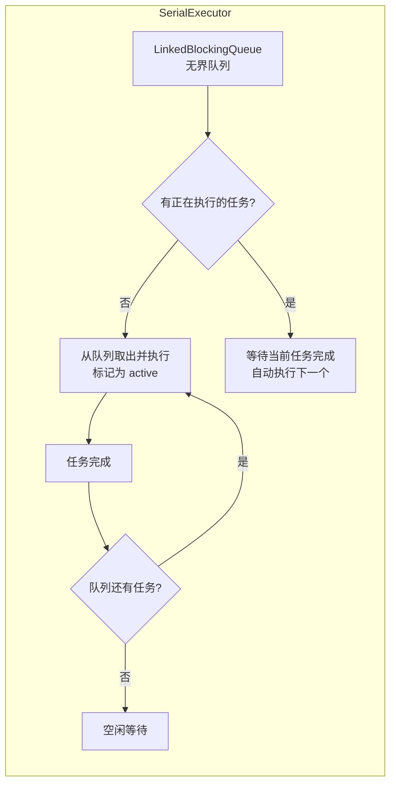

**关键实现细节**：
- `LinkedBlockingQueue` 是无界的，不会因队列满而阻塞生产者
- 每个 SerialExecutor 同一时刻只有一个任务在执行
- 任务完成后自动调度下一个任务（递归触发）

## 8. L2 增量更新机制

### L2OrderBook.diff() 算法

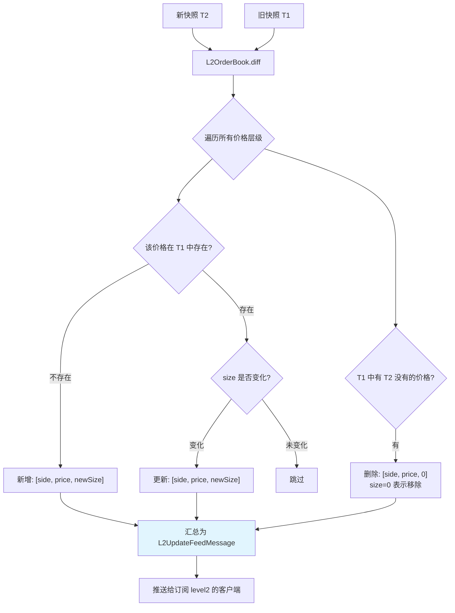

### 完整的 L2 推送流程

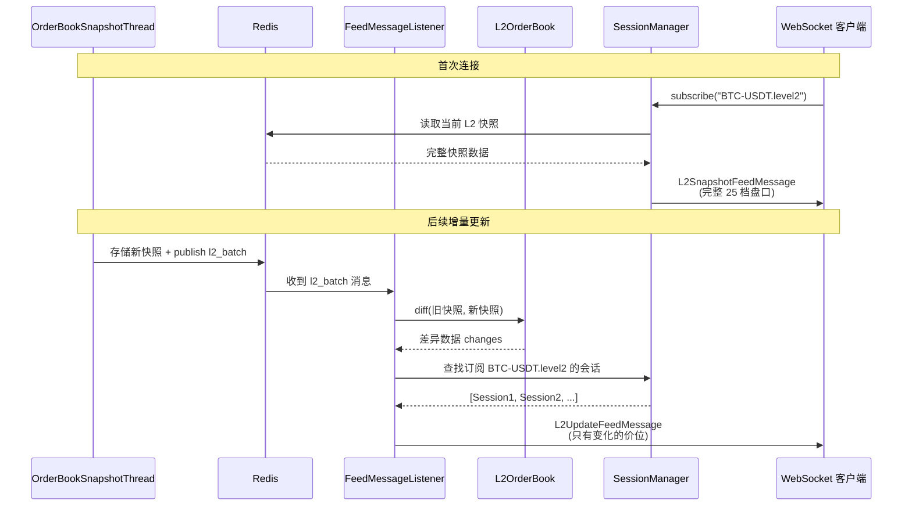

## 9. 订阅与取消订阅

### 订阅流程

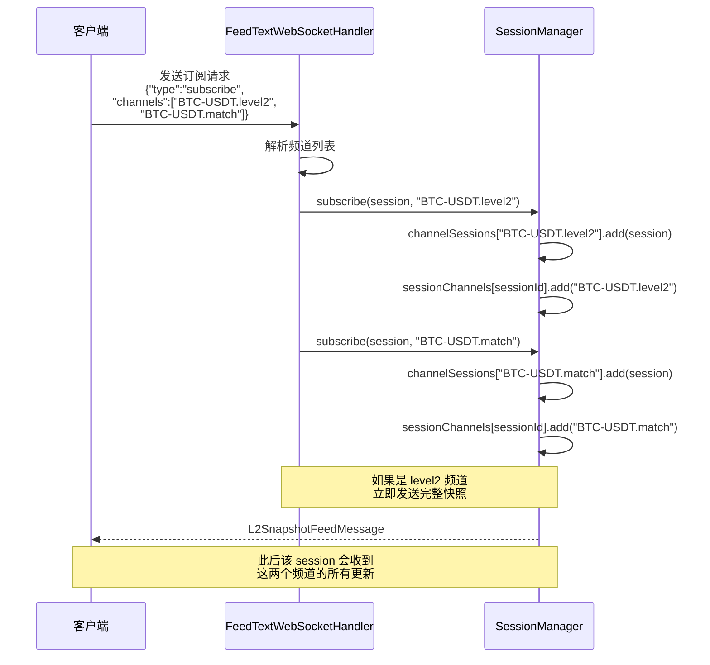

### 取消订阅 / 断开连接

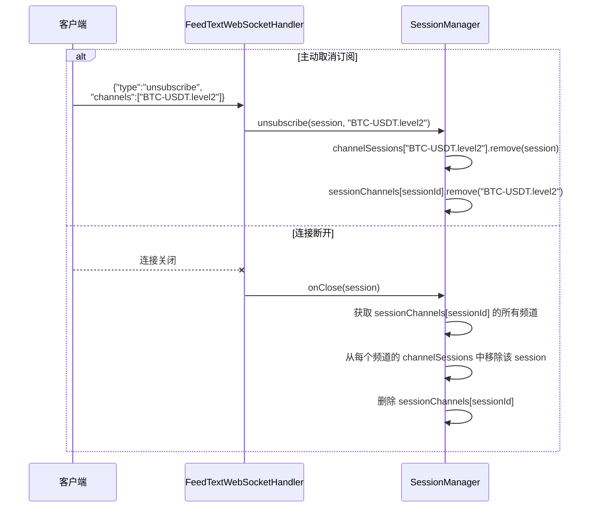

## 10. Ping/Pong 心跳机制

WebSocket 使用 Ping/Pong 机制保持连接活跃：

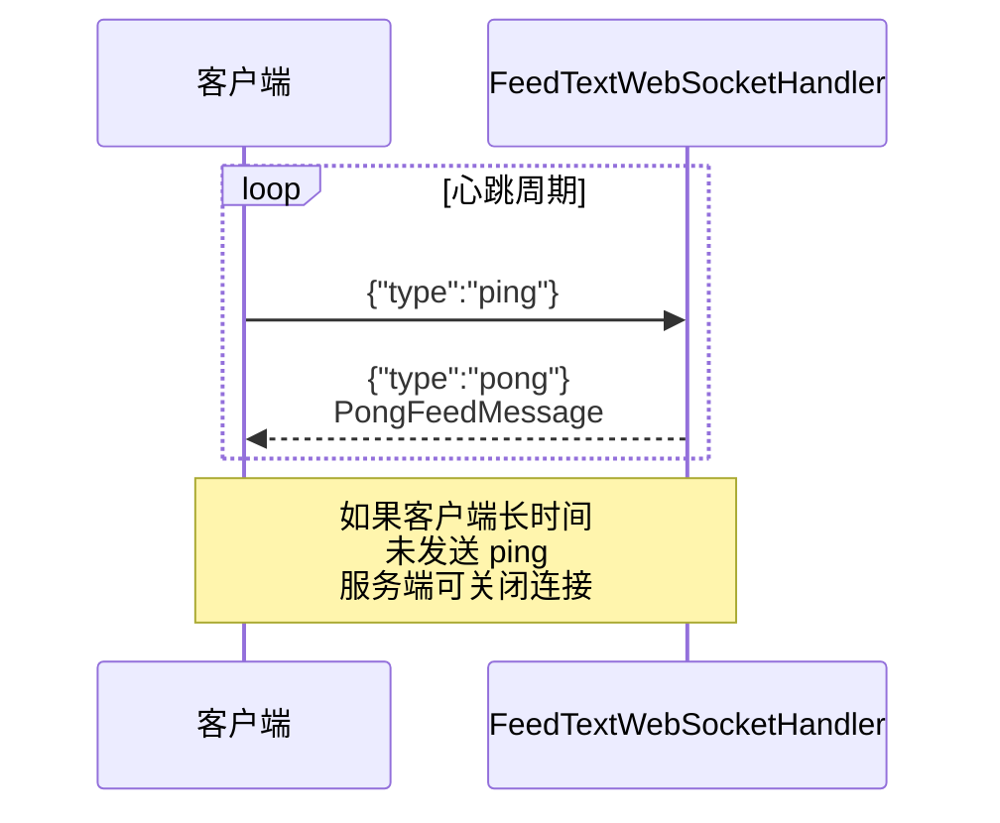

## 11. 线程模型总结

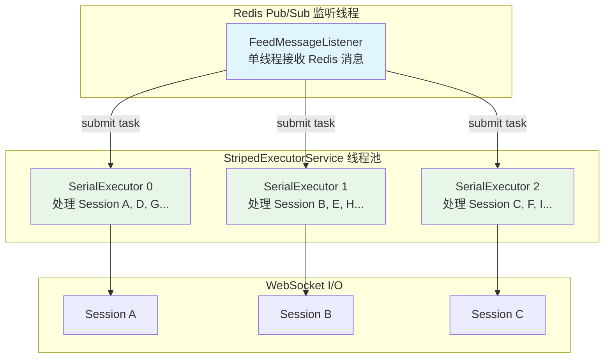

**线程分工**：
1. **FeedMessageListener** 线程：从 Redis 接收消息，分发到 StripedExecutorService
2. **StripedExecutorService** 线程池：按条纹分配任务，保证同一 Session 的消息有序
3. **WebSocket I/O**：实际的网络发送

## 12. 关键源文件

| 文件 | 路径 | 说明 |
|------|------|------|
| FeedTextWebSocketHandler | `feed/FeedTextWebSocketHandler.java` | WebSocket 端点处理器 |
| FeedMessageListener | `feed/FeedMessageListener.java` | Redis Pub/Sub 监听器 |
| SessionManager | `feed/SessionManager.java` | 会话与频道管理 |
| StripedExecutorService | `stripedexecutor/StripedExecutorService.java` | 条纹化执行器 |
| L2SnapshotFeedMessage | `feed/message/L2SnapshotFeedMessage.java` | L2 快照消息 |
| L2UpdateFeedMessage | `feed/message/L2UpdateFeedMessage.java` | L2 增量更新消息 |
| TickerFeedMessage | `feed/message/TickerFeedMessage.java` | 行情统计消息 |
| OrderFeedMessage | `feed/message/OrderFeedMessage.java` | 订单状态消息 |
| OrderMatchFeedMessage | `feed/message/OrderMatchFeedMessage.java` | 逐笔成交消息 |
| PongFeedMessage | `feed/message/PongFeedMessage.java` | 心跳响应消息 |
