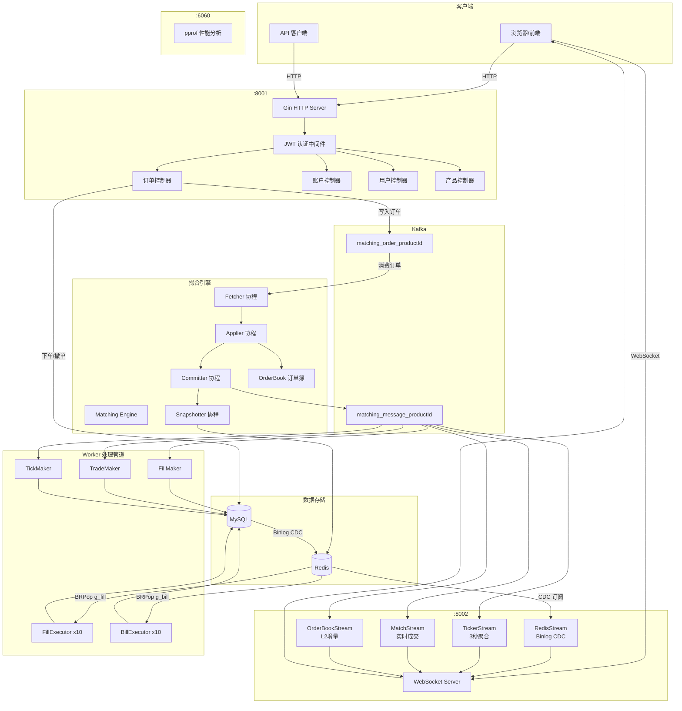
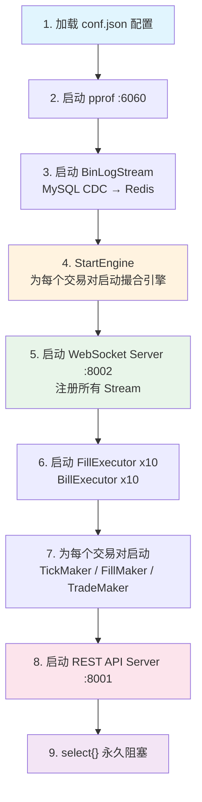

# GitBitEx-Spot 系统架构文档

## 1. 项目背景

GitBitEx-Spot 是一个使用 Go 语言实现的中心化加密货币交易所 (CEX) 现货交易系统。项目采用经典的撮合引擎架构，支持限价单和市价单，提供 REST API 和 WebSocket 实时推送，适用于数字资产现货交易场景。

## 2. 技术栈

| 组件 | 技术选型 | 用途 |
|------|----------|------|
| 编程语言 | Go | 高并发、低延迟的系统编程 |
| Web 框架 | Gin | REST API 服务 |
| 数据库 | MySQL | 持久化存储（订单、交易、账户等） |
| 消息队列 | Kafka | 撮合引擎的订单输入与日志输出 |
| 缓存/消息 | Redis | 快照存储、CDC 事件发布、任务队列 |
| WebSocket | Gorilla WebSocket | 实时行情与用户数据推送 |
| 认证 | JWT | 用户身份认证 |
| Binlog | Canal/go-mysql | MySQL 变更数据捕获 (CDC) |
| 数据结构 | TreeMap (红黑树) | 订单簿价格层级有序存储 |

## 3. 系统整体架构



## 4. 启动引导流程

系统通过 `main.go` 按照严格的顺序启动各组件：



### 启动顺序说明

| 步骤 | 操作 | 说明 |
|------|------|------|
| 1 | 加载配置 | 读取 `conf.json`，初始化全局配置 |
| 2 | pprof | 在 `:6060` 端口启动性能分析服务 |
| 3 | BinLogStream | 监听 MySQL binlog，将表变更推送到 Redis 频道 |
| 4 | StartEngine | 遍历所有产品，为每个交易对创建并启动撮合引擎 |
| 5 | WebSocket | 在 `:8002` 端口启动 WS 服务，挂载 Ticker/Match/OrderBook/Redis 四个 Stream |
| 6 | Executor | 启动 10 个 FillExecutor 和 10 个 BillExecutor 消费 Redis 队列 |
| 7 | Maker | 为每个交易对启动 TickMaker、FillMaker、TradeMaker 消费 Kafka 日志 |
| 8 | REST API | 在 `:8001` 端口启动 Gin HTTP 服务，注册所有路由 |
| 9 | 阻塞 | `select{}` 永久阻塞主协程，保持进程运行 |

## 5. 配置文件结构

系统配置通过 `conf.json` 文件管理：

```json
{
  "dataSource": {
    "address": "127.0.0.1:3306",
    "user": "root",
    "password": "xxx",
    "dbName": "gitbitex"
  },
  "redis": {
    "address": "127.0.0.1:6379",
    "password": ""
  },
  "kafka": {
    "brokers": ["127.0.0.1:9092"]
  },
  "restServer": {
    "address": ":8001"
  },
  "wsServer": {
    "address": ":8002",
    "path": "/ws"
  },
  "jwtSecret": "your-jwt-secret-key"
}
```

| 配置项 | 说明 |
|--------|------|
| `dataSource` | MySQL 连接配置（地址、用户名、密码、数据库名） |
| `redis` | Redis 连接配置（地址、密码） |
| `kafka` | Kafka Broker 列表 |
| `restServer` | REST API 监听地址，默认 `:8001` |
| `wsServer` | WebSocket 监听地址与路径，默认 `:8002/ws` |
| `jwtSecret` | JWT Token 签名密钥 |

## 6. 部署信息

### 部署方式

系统编译为单个 Go 二进制文件，部署简单：

| 端口 | 服务 | 协议 |
|------|------|------|
| 8001 | REST API | HTTP |
| 8002 | WebSocket | WS |
| 6060 | pprof 性能分析 | HTTP |

### 外部依赖

- **MySQL**: 数据持久化，需开启 binlog（row 模式）
- **Redis**: 快照存储、CDC 消息通道、任务队列
- **Kafka**: 撮合引擎订单传输与日志分发

## 7. 源代码目录结构

```
gitbitex-spot/
├── main.go                          # 程序入口，引导启动
├── conf.json                        # 配置文件
├── conf/
│   └── gbe_config.go                # 配置结构定义与加载
├── matching/                        # 撮合引擎核心模块
│   ├── engine.go                    # 引擎主体（4个协程）
│   ├── order_book.go                # 订单簿数据结构
│   ├── log.go                       # 日志类型定义（Open/Match/Done）
│   ├── window.go                    # 去重滑动窗口
│   ├── api.go                       # 引擎对外接口
│   ├── bootstrap.go                 # 引擎启动与恢复
│   ├── kafka_order_reader.go        # Kafka 订单读取
│   ├── kafka_log_store.go           # Kafka 日志写入
│   ├── kafka_log_reader.go          # Kafka 日志消费
│   └── redis_snapshot_store.go      # Redis 快照存储
├── models/                          # 数据模型与存储
│   ├── models.go                    # 核心模型定义
│   ├── store.go                     # 存储接口
│   ├── const.go                     # 常量定义
│   ├── binlog_stream.go             # MySQL Binlog CDC
│   └── mysql/                       # MySQL 存储实现
│       ├── store.go                 # MySQL 连接初始化
│       ├── order_store.go           # 订单 CRUD
│       ├── account_store.go         # 账户 CRUD
│       ├── fill_store.go            # 成交 CRUD
│       ├── trade_store.go           # 交易 CRUD
│       ├── bill_store.go            # 账单 CRUD
│       ├── tick_store.go            # K线 CRUD
│       ├── product_store.go         # 产品 CRUD
│       ├── user_store.go            # 用户 CRUD
│       └── config_store.go          # 配置 CRUD
├── rest/                            # REST API 层
│   ├── server.go                    # Gin 服务器
│   ├── bootstrap.go                 # 路由注册
│   ├── auth.go                      # JWT 认证中间件
│   ├── vo.go                        # 视图对象
│   ├── order_controller.go          # 订单 API
│   ├── account_controller.go        # 账户 API
│   ├── user_controller.go           # 用户 API
│   ├── product_controller.go        # 产品 API
│   ├── wallet_controller.go         # 钱包 API
│   └── conf_controller.go           # 配置 API
├── service/                         # 业务服务层
│   ├── order_service.go             # 订单业务逻辑
│   ├── account_service.go           # 账户业务逻辑
│   ├── user_service.go              # 用户业务逻辑
│   ├── fill_service.go              # 成交业务逻辑
│   ├── trade_service.go             # 交易业务逻辑
│   ├── tick_service.go              # K线业务逻辑
│   ├── product_service.go           # 产品业务逻辑
│   ├── wallet_service.go            # 钱包业务逻辑
│   └── conf_service.go              # 配置业务逻辑
├── pushing/                         # WebSocket 推送模块
│   ├── server.go                    # WS 服务器
│   ├── bootstrap.go                 # 推送启动
│   ├── client.go                    # 客户端管理
│   ├── subscription.go              # 频道订阅管理
│   ├── message.go                   # 消息类型定义
│   ├── order_book.go                # 本地订单簿副本
│   ├── order_book_stream.go         # L2 增量推送
│   ├── match_stream.go              # 成交推送
│   ├── ticker_stream.go             # Ticker 推送
│   └── redis_stream.go              # Redis CDC 推送
├── worker/                          # 后台工作协程
│   ├── fill_maker.go                # 成交记录生成
│   ├── trade_maker.go               # 交易记录生成
│   ├── tick_maker.go                # K线生成
│   ├── fill_executor.go             # 成交结算执行
│   └── bill_executor.go             # 账单结算执行
└── utils/
    └── utils.go                     # 工具函数
```

## 8. 相关文档

- [撮合引擎详解](matching-engine.md)
- [订单簿数据结构](order-book.md)
- [Kafka 消息系统](kafka-messaging.md)
- [数据模型设计](data-model.md)
- [REST API 接口](rest-api.md)
- [WebSocket 推送](websocket.md)
- [Worker 处理管道](workers.md)
