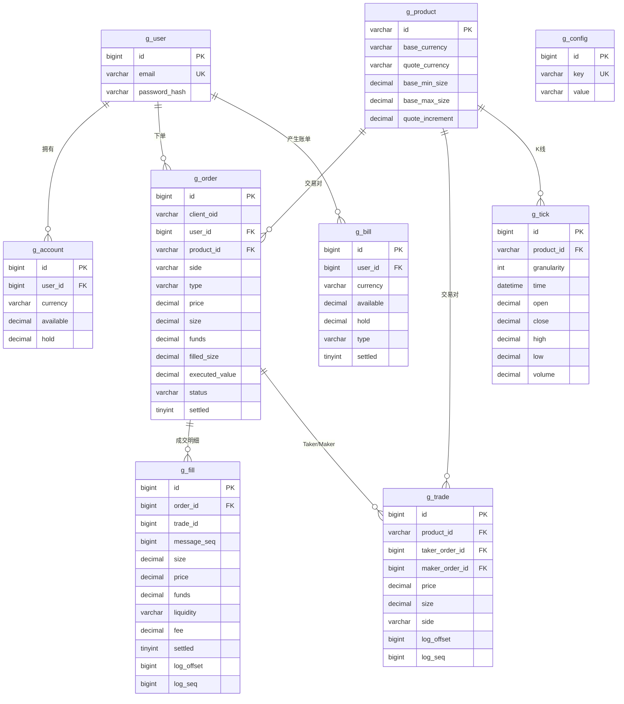
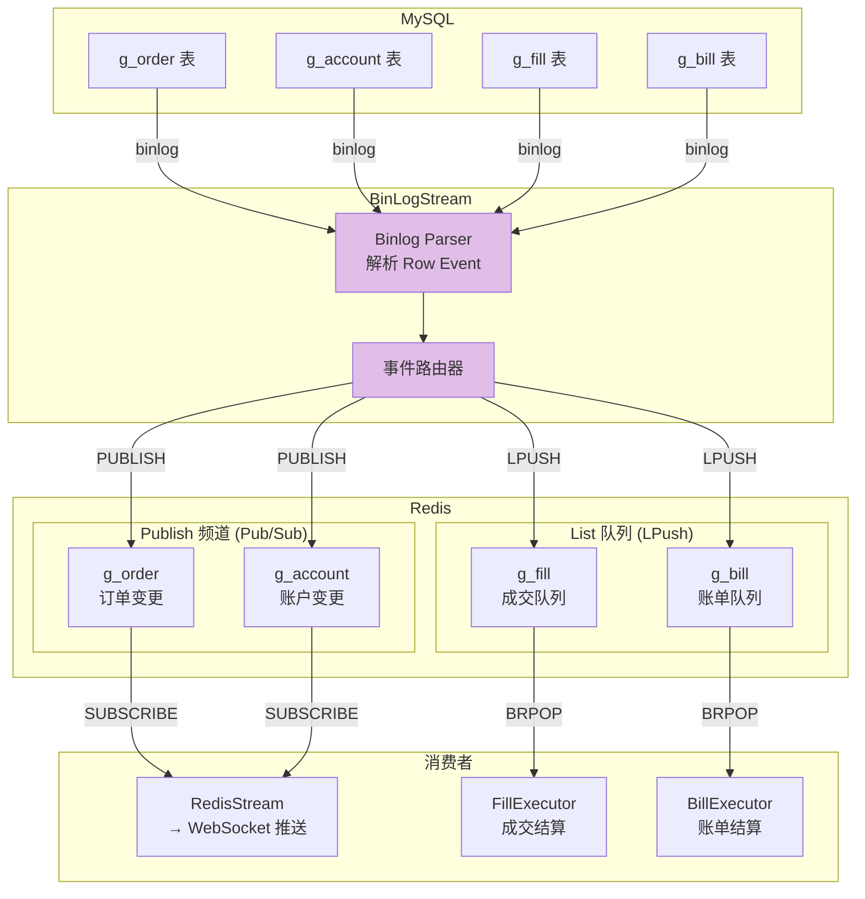
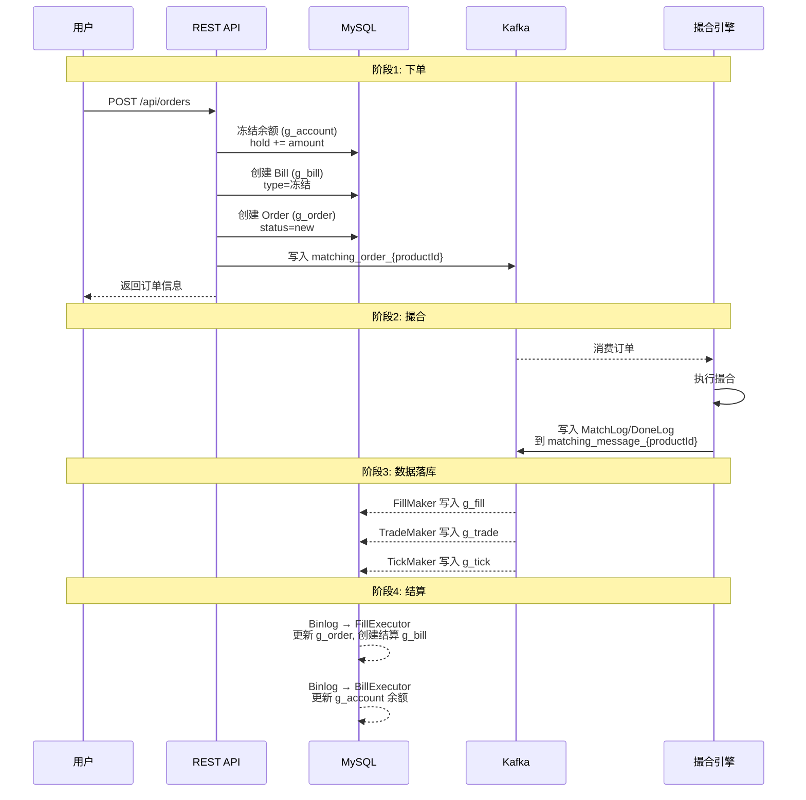

# 数据模型设计

## 1. 概述

GitBitEx-Spot 使用 MySQL 作为持久化存储，所有数据表统一使用 `g_` 前缀。系统通过 MySQL Binlog CDC 机制将数据变更实时推送到 Redis，驱动下游的结算和推送流程。

## 2. ER 关系图

## 3. 数据表详细说明

### 3.1 g_user - 用户表

| 字段 | 类型 | 约束 | 说明 |
|------|------|------|------|
| `id` | bigint | PK, AUTO_INCREMENT | 用户 ID |
| `email` | varchar(255) | UNIQUE, NOT NULL | 邮箱地址 |
| `password_hash` | varchar(255) | NOT NULL | 密码哈希值（bcrypt） |
| `created_at` | datetime | | 创建时间 |
| `updated_at` | datetime | | 更新时间 |

### 3.2 g_account - 账户表

| 字段 | 类型 | 约束 | 说明 |
|------|------|------|------|
| `id` | bigint | PK, AUTO_INCREMENT | 账户 ID |
| `user_id` | bigint | NOT NULL | 用户 ID |
| `currency` | varchar(32) | NOT NULL | 币种（BTC, USDT 等） |
| `available` | decimal(32,16) | NOT NULL, DEFAULT 0 | 可用余额 |
| `hold` | decimal(32,16) | NOT NULL, DEFAULT 0 | 冻结余额 |
| `created_at` | datetime | | 创建时间 |
| `updated_at` | datetime | | 更新时间 |

**唯一约束**: `UNIQUE(user_id, currency)` - 每个用户每种币只有一个账户

**余额关系**: `总余额 = available + hold`

### 3.3 g_order - 订单表

| 字段 | 类型 | 约束 | 说明 |
|------|------|------|------|
| `id` | bigint | PK, AUTO_INCREMENT | 订单 ID |
| `client_oid` | varchar(64) | | 客户端自定义订单 ID |
| `user_id` | bigint | NOT NULL | 用户 ID |
| `product_id` | varchar(32) | NOT NULL | 交易对 ID（如 BTC-USDT） |
| `side` | varchar(8) | NOT NULL | 方向: buy / sell |
| `type` | varchar(16) | NOT NULL | 类型: limit / market |
| `price` | decimal(32,16) | | 价格（限价单必填） |
| `size` | decimal(32,16) | | 数量（限价单和市价卖单） |
| `funds` | decimal(32,16) | | 资金额（市价买单） |
| `filled_size` | decimal(32,16) | DEFAULT 0 | 已成交数量 |
| `executed_value` | decimal(32,16) | DEFAULT 0 | 已成交金额 |
| `status` | varchar(16) | NOT NULL | 状态: new/open/filled/cancelled |
| `settled` | tinyint(1) | DEFAULT 0 | 是否已结算 |
| `created_at` | datetime | | 创建时间 |
| `updated_at` | datetime | | 更新时间 |

### 3.4 g_fill - 成交明细表

| 字段 | 类型 | 约束 | 说明 |
|------|------|------|------|
| `id` | bigint | PK, AUTO_INCREMENT | 成交 ID |
| `order_id` | bigint | NOT NULL | 关联订单 ID |
| `trade_id` | bigint | NOT NULL | 关联交易 ID |
| `message_seq` | bigint | NOT NULL | 撮合日志序列号 |
| `size` | decimal(32,16) | NOT NULL | 成交数量 |
| `price` | decimal(32,16) | NOT NULL | 成交价格 |
| `funds` | decimal(32,16) | NOT NULL | 成交金额 |
| `liquidity` | varchar(4) | NOT NULL | 流动性: T(Taker) / M(Maker) |
| `fee` | decimal(32,16) | DEFAULT 0 | 手续费 |
| `settled` | tinyint(1) | DEFAULT 0 | 是否已结算 |
| `log_offset` | bigint | | Kafka 消息偏移量 |
| `log_seq` | bigint | | 撮合日志序列号 |
| `created_at` | datetime | | 创建时间 |

**去重键**: `UNIQUE(order_id, message_seq)` - 每个订单的每个撮合序列号只产生一条 Fill

### 3.5 g_trade - 交易表

| 字段 | 类型 | 约束 | 说明 |
|------|------|------|------|
| `id` | bigint | PK, AUTO_INCREMENT | 交易 ID |
| `product_id` | varchar(32) | NOT NULL | 交易对 ID |
| `taker_order_id` | bigint | NOT NULL | Taker 订单 ID |
| `maker_order_id` | bigint | NOT NULL | Maker 订单 ID |
| `price` | decimal(32,16) | NOT NULL | 成交价格 |
| `size` | decimal(32,16) | NOT NULL | 成交数量 |
| `side` | varchar(8) | NOT NULL | Taker 方向 |
| `log_offset` | bigint | | Kafka 消息偏移量 |
| `log_seq` | bigint | | 撮合日志序列号 |
| `created_at` | datetime | | 创建时间 |

### 3.6 g_bill - 账单表

| 字段 | 类型 | 约束 | 说明 |
|------|------|------|------|
| `id` | bigint | PK, AUTO_INCREMENT | 账单 ID |
| `user_id` | bigint | NOT NULL | 用户 ID |
| `currency` | varchar(32) | NOT NULL | 币种 |
| `available` | decimal(32,16) | NOT NULL | available 变动量（正增负减） |
| `hold` | decimal(32,16) | NOT NULL | hold 变动量（正增负减） |
| `type` | varchar(32) | NOT NULL | 账单类型 |
| `settled` | tinyint(1) | DEFAULT 0 | 是否已结算 |
| `created_at` | datetime | | 创建时间 |

**账单类型**:
- 下单冻结: `available -= amount, hold += amount`
- 成交释放: `hold -= amount, available += received`
- 取消解冻: `hold -= amount, available += amount`

### 3.7 g_tick - K 线表

| 字段 | 类型 | 约束 | 说明 |
|------|------|------|------|
| `id` | bigint | PK, AUTO_INCREMENT | K 线 ID |
| `product_id` | varchar(32) | NOT NULL | 交易对 ID |
| `granularity` | int | NOT NULL | 粒度（分钟）: 1/3/5/15/30/60/120/240/360/720/1440 |
| `time` | datetime | NOT NULL | 时间窗口起始时间 |
| `open` | decimal(32,16) | | 开盘价 |
| `close` | decimal(32,16) | | 收盘价 |
| `high` | decimal(32,16) | | 最高价 |
| `low` | decimal(32,16) | | 最低价 |
| `volume` | decimal(32,16) | | 成交量 |

**更新策略**: 使用 `REPLACE INTO`，以 `(product_id, granularity, time)` 为唯一键

### 3.8 g_product - 产品表（交易对）

| 字段 | 类型 | 约束 | 说明 |
|------|------|------|------|
| `id` | varchar(32) | PK | 产品 ID（如 BTC-USDT） |
| `base_currency` | varchar(16) | NOT NULL | 基础币种（如 BTC） |
| `quote_currency` | varchar(16) | NOT NULL | 报价币种（如 USDT） |
| `base_min_size` | decimal(32,16) | | 最小下单数量 |
| `base_max_size` | decimal(32,16) | | 最大下单数量 |
| `quote_increment` | decimal(32,16) | | 报价精度 |

### 3.9 g_config - 配置表

| 字段 | 类型 | 约束 | 说明 |
|------|------|------|------|
| `id` | bigint | PK, AUTO_INCREMENT | 配置 ID |
| `key` | varchar(128) | UNIQUE | 配置键 |
| `value` | text | | 配置值 |

## 4. Binlog CDC 机制

系统通过监听 MySQL Binlog（Row 模式）捕获数据变更，将变更事件推送到 Redis，驱动下游处理：

### CDC 路由规则

| 数据表 | Redis 操作 | Key/Channel | 说明 |
|--------|-----------|-------------|------|
| `g_order` | `PUBLISH` | `g_order` | 订单变更推送到 WebSocket |
| `g_account` | `PUBLISH` | `g_account` | 账户变更推送到 WebSocket |
| `g_fill` | `LPUSH` | `g_fill` | 成交记录入队等待结算 |
| `g_bill` | `LPUSH` | `g_bill` | 账单记录入队等待结算 |

### Pub/Sub vs List

- **Pub/Sub (PUBLISH)**: 用于实时推送通知（订单状态变更、余额变更），允许丢失
- **List (LPUSH/BRPOP)**: 用于可靠的任务队列（成交结算、账单结算），不允许丢失

## 5. 订单生命周期中的数据流转

## 6. 关键索引设计

| 表 | 索引 | 类型 | 用途 |
|----|------|------|------|
| `g_account` | `(user_id, currency)` | UNIQUE | 确保每用户每币种唯一账户 |
| `g_order` | `(user_id, product_id, status)` | INDEX | 用户订单查询 |
| `g_fill` | `(order_id, message_seq)` | UNIQUE | 成交去重 |
| `g_trade` | `(product_id, created_at)` | INDEX | 交易对历史交易查询 |
| `g_tick` | `(product_id, granularity, time)` | UNIQUE | K 线数据唯一键（REPLACE INTO） |
| `g_bill` | `(user_id, settled)` | INDEX | 未结算账单查询 |

## 7. 关键源文件

| 文件路径 | 说明 |
|----------|------|
| `models/models.go` | 核心数据模型定义（所有表结构体） |
| `models/store.go` | 存储接口定义 |
| `models/const.go` | 常量定义（订单状态、方向、类型等） |
| `models/binlog_stream.go` | MySQL Binlog CDC 实现 |
| `models/mysql/store.go` | MySQL 连接初始化 |
| `models/mysql/order_store.go` | 订单 CRUD 操作 |
| `models/mysql/account_store.go` | 账户 CRUD 操作 |
| `models/mysql/fill_store.go` | 成交明细 CRUD |
| `models/mysql/trade_store.go` | 交易记录 CRUD |
| `models/mysql/bill_store.go` | 账单 CRUD |
| `models/mysql/tick_store.go` | K 线 CRUD |
| `models/mysql/product_store.go` | 产品 CRUD |
| `models/mysql/user_store.go` | 用户 CRUD |

## 8. 相关文档

- [系统架构概览](architecture.md)
- [Worker 处理管道](workers.md)
- [REST API 接口](rest-api.md)
