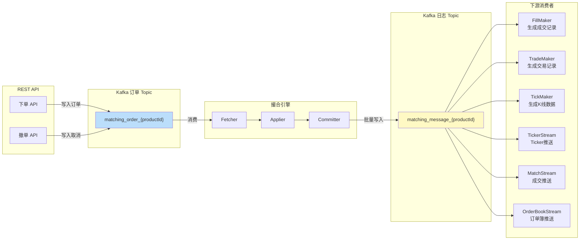
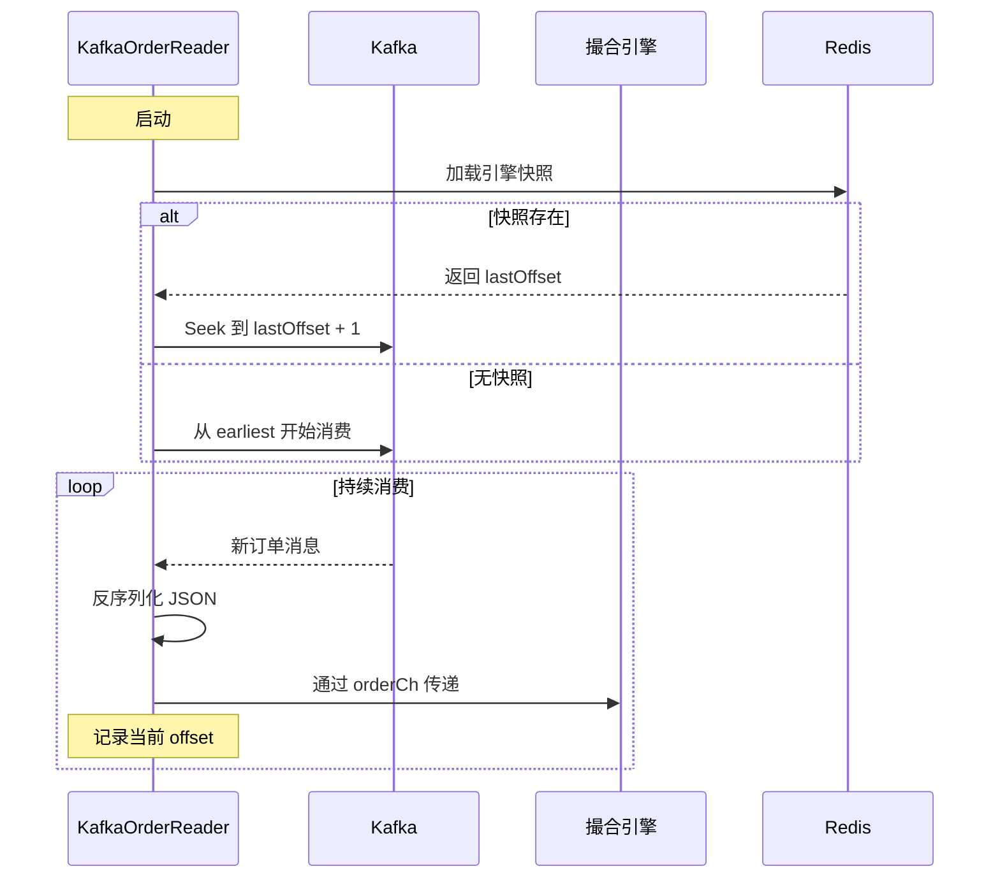
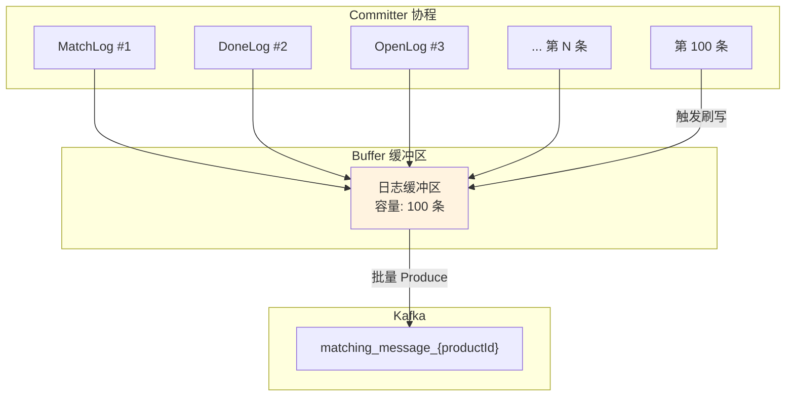
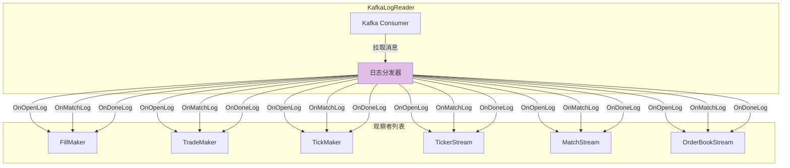
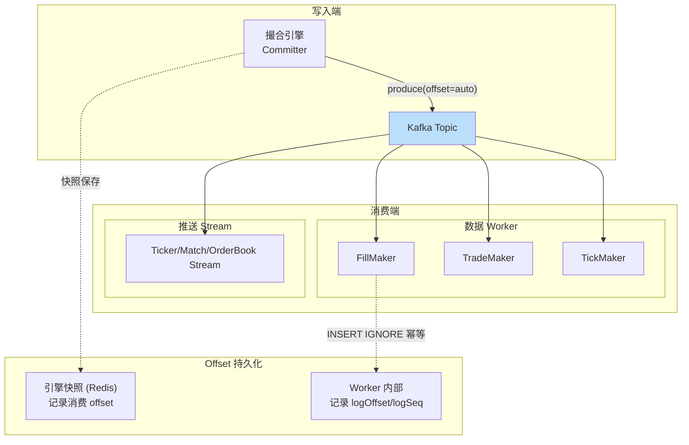

# Kafka 消息系统

## 1. 概述

Kafka 在 GitBitEx-Spot 中承担核心消息中间件角色，负责撮合引擎的订单输入与撮合日志的分发输出。系统采用**按交易对隔离**的 Topic 设计，确保每个交易对的消息流独立处理。

## 2. Topic 设计

### 命名规范

| Topic 模式 | 方向 | 说明 |
|------------|------|------|
| `matching_order_{productId}` | 入站 | REST API → 撮合引擎的订单通道 |
| `matching_message_{productId}` | 出站 | 撮合引擎 → 下游消费者的日志通道 |

### 示例

对于交易对 `BTC-USDT`：
- `matching_order_BTC-USDT` - 接收 BTC-USDT 的下单/撤单请求
- `matching_message_BTC-USDT` - 输出 BTC-USDT 的撮合日志

### 隔离优势

```mermaid
graph TB
    subgraph "交易对 BTC-USDT"
        OT1["matching_order_BTC-USDT"]
        E1["Engine BTC-USDT"]
        MT1["matching_message_BTC-USDT"]
        OT1 --> E1 --> MT1
    end

    subgraph "交易对 ETH-USDT"
        OT2["matching_order_ETH-USDT"]
        E2["Engine ETH-USDT"]
        MT2["matching_message_ETH-USDT"]
        OT2 --> E2 --> MT2
    end

    subgraph "交易对 SOL-USDT"
        OT3["matching_order_SOL-USDT"]
        E3["Engine SOL-USDT"]
        MT3["matching_message_SOL-USDT"]
        OT3 --> E3 --> MT3
    end

    style E1 fill:#c8e6c9
    style E2 fill:#c8e6c9
    style E3 fill:#c8e6c9
```



- 每个交易对完全独立，互不影响
- 消费者可以按需订阅特定交易对
- 单个交易对的流量激增不会影响其他交易对

## 3. 整体消息流



## 4. KafkaOrderReader - 订单读取

`KafkaOrderReader` 负责从 Kafka 订单 Topic 中消费订单消息，将其传递给撮合引擎。

### 核心机制

| 特性 | 说明 |
|------|------|
| 消费模式 | 单消费者，每个引擎独占一个 OrderReader |
| Offset 管理 | 基于 offset 恢复，引擎快照中记录消费位移 |
| 消息格式 | JSON 序列化的订单对象 |
| 恢复策略 | 从快照记录的 offset 处继续消费 |

### Offset 恢复流程



## 5. KafkaLogStore - 日志写入

`KafkaLogStore` 负责将撮合引擎产生的日志批量写入 Kafka 日志 Topic。

### 批量缓冲机制



| 参数 | 值 | 说明 |
|------|-----|------|
| 缓冲区大小 | 100 条 | 积累到 100 条日志后批量刷写 |
| 刷写触发 | 缓冲区满 | 达到 100 条时自动 flush |
| 原子性保证 | 单次撮合日志作为一个批次 | 一个订单产生的所有日志原子提交 |

### 日志序列号

每条写入的日志携带严格递增的 `logSeq`，消费者可据此进行：
- **顺序消费**: 确保按序处理
- **断点续传**: 从上次消费的 logSeq 后继续
- **去重检查**: 幂等处理已见过的 logSeq

## 6. KafkaLogReader - 日志消费

`KafkaLogReader` 采用**观察者模式**将日志分发给多个下游消费者。

### 观察者模式



### 消费者角色

| 消费者 | 处理内容 | 输出 |
|--------|----------|------|
| **FillMaker** | MatchLog → 创建 Fill 记录 | MySQL g_fill 表 |
| **TradeMaker** | MatchLog → 创建 Trade 记录 | MySQL g_trade 表 |
| **TickMaker** | MatchLog → 更新 K 线数据 | MySQL g_tick 表 |
| **TickerStream** | MatchLog → 3秒聚合 Ticker | WebSocket 推送 |
| **MatchStream** | MatchLog → 实时成交流 | WebSocket 推送 |
| **OrderBookStream** | OpenLog/MatchLog/DoneLog → 订单簿变更 | WebSocket 推送 |

### 特点

- **一对多分发**: 单次 Kafka 消费，多个观察者同时处理
- **按类型路由**: 不同日志类型触发不同的回调方法
- **独立处理**: 每个观察者独立处理，互不影响

## 7. 日志序列化格式

所有日志以 JSON 格式序列化：

### OpenLog

```json
{
    "type": "open",
    "sequence": 12345,
    "orderId": "order-001",
    "remainingSize": "1.5",
    "price": "50000.00",
    "side": "buy",
    "time": "2024-01-01T00:00:00Z"
}
```

### MatchLog

```json
{
    "type": "match",
    "sequence": 12346,
    "tradeId": 1001,
    "takerOrderId": "order-002",
    "makerOrderId": "order-001",
    "side": "buy",
    "price": "50000.00",
    "size": "0.5",
    "time": "2024-01-01T00:00:01Z"
}
```

### DoneLog

```json
{
    "type": "done",
    "sequence": 12347,
    "orderId": "order-002",
    "remainingSize": "0",
    "reason": "filled",
    "time": "2024-01-01T00:00:01Z"
}
```

## 8. Offset 管理策略



| 组件 | Offset 管理方式 | 说明 |
|------|----------------|------|
| KafkaOrderReader | 引擎快照中记录 | 恢复时从快照的 offset 继续 |
| KafkaLogReader (Worker) | 依赖幂等写入 | INSERT IGNORE 保证重复消费不报错 |
| KafkaLogReader (Stream) | 内存中维护 | Stream 重启后从头消费 |

## 9. 消费组策略

- **OrderReader**: 每个交易对的引擎独占一个消费者，不使用消费组
- **LogReader**: 多个观察者共享同一个消费者实例，由 LogReader 在进程内分发
- **隔离性**: 每个交易对的 Topic 独立，天然分区隔离

## 10. 错误处理与重试

| 场景 | 处理策略 |
|------|----------|
| Kafka 不可用 | 消费者阻塞等待重连 |
| 消息反序列化失败 | 记录日志，跳过该消息 |
| 写入失败 | 重试直到成功，阻塞后续消息 |
| 消费者 Lag | 各消费者独立消费速度，不相互阻塞 |
| 引擎重启 | 从快照的 offset 恢复，去重窗口过滤重复 |

## 11. 关键源文件

| 文件路径 | 说明 |
|----------|------|
| `matching/kafka_order_reader.go` | Kafka 订单消费者 |
| `matching/kafka_log_store.go` | Kafka 日志写入（批量缓冲） |
| `matching/kafka_log_reader.go` | Kafka 日志消费者（观察者模式） |
| `matching/engine.go` | 引擎中的 Fetcher 和 Committer 协程 |
| `conf/gbe_config.go` | Kafka broker 配置 |

## 12. 相关文档

- [撮合引擎详解](matching-engine.md)
- [Worker 处理管道](workers.md)
- [WebSocket 推送](websocket.md)
