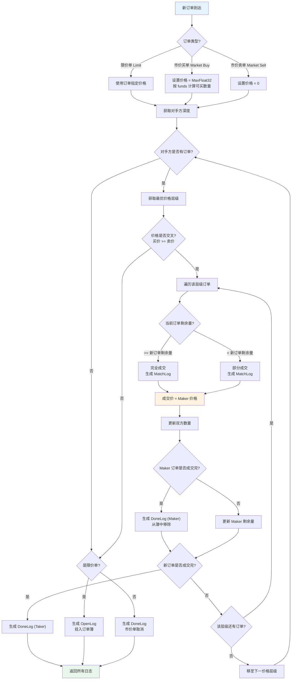
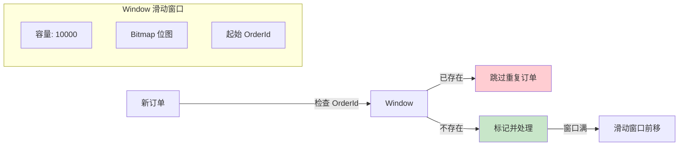
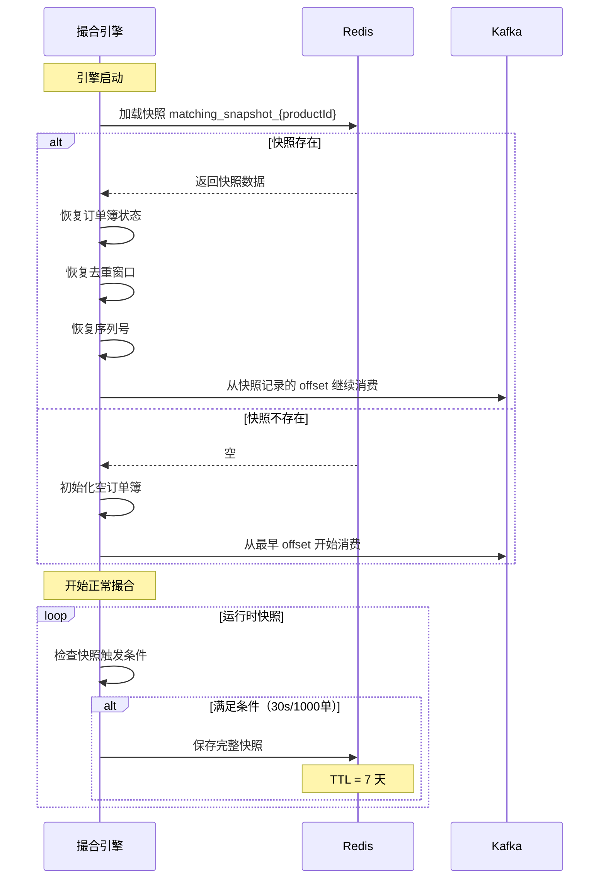

# 撮合引擎详解

## 1. 概述

撮合引擎是 GitBitEx-Spot 交易系统的核心组件，负责按照价格-时间优先原则对买卖订单进行匹配。系统为每个交易对（如 BTC-USDT）创建一个独立的撮合引擎实例，实现产品级别的隔离与并行处理。

## 2. 引擎架构

每个撮合引擎由 4 个协程（goroutine）协同工作，通过 Go channel 串联形成流水线：

```mermaid
graph LR
    subgraph Kafka
        OrderTopic["matching_order_{productId}"]
        LogTopic["matching_message_{productId}"]
    end

    subgraph 撮合引擎 Engine
        Fetcher["Fetcher<br/>订单获取协程"]
        Applier["Applier<br/>撮合执行协程"]
        Committer["Committer<br/>日志提交协程"]
        Snapshotter["Snapshotter<br/>快照协程"]

        OrderCh["orderCh<br/>(channel)"]
        LogCh["logCh<br/>(channel)"]
        SnapshotCh["snapshotCh<br/>(channel)"]
    end

    subgraph Redis
        Snapshot["matching_snapshot_{productId}"]
    end

    OrderTopic -->|消费| Fetcher
    Fetcher -->|Order| OrderCh
    OrderCh -->|Order| Applier
    Applier -->|[]Log| LogCh
    LogCh -->|[]Log| Committer
    Committer -->|写入| LogTopic
    Committer -->|触发| SnapshotCh
    SnapshotCh --> Snapshotter
    Snapshotter -->|保存| Snapshot

    style Fetcher fill:#bbdefb
    style Applier fill:#c8e6c9
    style Committer fill:#fff9c4
    style Snapshotter fill:#f8bbd0
```

### 协程职责

| 协程 | 职责 | 说明 |
|------|------|------|
| **Fetcher** | 订单获取 | 从 Kafka `matching_order_{productId}` 主题消费订单，通过 `orderCh` 传递给 Applier |
| **Applier** | 撮合执行 | 从 `orderCh` 接收订单，执行撮合逻辑，生成匹配日志，通过 `logCh` 传递给 Committer |
| **Committer** | 日志提交 | 从 `logCh` 接收日志批次，写入 Kafka `matching_message_{productId}` 主题，并触发快照 |
| **Snapshotter** | 快照保存 | 定期将引擎状态（订单簿、序列号等）保存到 Redis，用于故障恢复 |

## 3. 价格-时间优先算法

撮合引擎采用 **价格-时间优先 (Price-Time Priority)** 原则：

1. **价格优先**: 买单中出价最高的优先成交，卖单中要价最低的优先成交
2. **时间优先**: 相同价格的订单按照到达时间排序，先到先成交

### 数据结构选择

使用 **TreeMap（红黑树）** 实现有序存储，保证关键操作的时间复杂度：

| 操作 | 时间复杂度 | 说明 |
|------|-----------|------|
| 插入价格层级 | O(log n) | 新价格加入订单簿 |
| 删除价格层级 | O(log n) | 价格层级清空后移除 |
| 查找最优价格 | O(log n) | 获取最高买价/最低卖价 |
| 遍历匹配 | O(k log n) | k 为匹配的价格层级数 |

### 排序规则

- **买单 (Bids)**: 按价格**降序**排列，最高价在前（`TreeMap` 降序比较器）
- **卖单 (Asks)**: 按价格**升序**排列，最低价在前（`TreeMap` 升序比较器）

## 4. 订单撮合流程



### 成交价规则

**所有成交均以 Maker（挂单方）的价格成交**。例如：
- 订单簿中有一笔卖单挂价 100 USDT
- 新买单以 105 USDT 限价进入
- 成交价为 100 USDT（Maker 的挂单价）

## 5. 市价单处理

### 市价卖单 (Market Sell)

- 设置价格为 `0`，确保能与所有买单匹配
- 按指定的 `size`（数量）进行匹配
- 如果买方深度不足以完全成交，剩余部分取消

### 市价买单 (Market Buy)

- 设置价格为 `MaxFloat32`，确保能与所有卖单匹配
- 使用 `funds`（资金额度）而非 `size` 控制买入量
- 在每个价格层级动态计算可买数量：`可买数量 = 剩余资金 / 当前层级价格`
- 逐层消耗资金直至用尽或卖方深度耗尽

## 6. 撮合日志类型

撮合过程产生三种日志，每条日志携带严格递增的序列号 `logSeq`：

| 日志类型 | 触发时机 | 关键字段 | 说明 |
|----------|----------|----------|------|
| **OpenLog** | 限价单挂入订单簿 | orderId, remainingSize, price, side | 订单未能完全成交，剩余部分挂入簿中 |
| **MatchLog** | 订单成交 | takerOrderId, makerOrderId, size, price, side | 记录一次成交的双方信息、成交量与成交价 |
| **DoneLog** | 订单完成 | orderId, remainingSize, reason | 订单完全成交或被取消，从簿中移除 |

### 日志序列号

- 每条日志分配一个严格递增的 `logSeq`
- 用于消费者的顺序保证和断点续传
- 所有日志写入 Kafka 主题：`matching_message_{productId}`

### 批量写入

- 日志先写入缓冲区，积累到 **100 条** 后批量刷写到 Kafka
- 单次撮合产生的所有日志作为一个批次提交，保证原子性

## 7. 去重窗口机制

为防止引擎重启后的重复处理，系统实现了基于位图的滑动窗口去重机制：



### 工作原理

1. 维护一个容量为 10000 的位图窗口
2. 每处理一个订单，在位图中标记对应位置
3. 当新订单的 ID 落在窗口范围内，检查位图判断是否已处理
4. 窗口随着处理进度向前滑动，释放旧的位图空间
5. 快照时保存窗口状态，恢复时可直接还原

## 8. 快照与恢复

### 快照策略

| 触发条件 | 说明 |
|----------|------|
| 每 30 秒 | 定时快照 |
| 每处理 1000 个订单 | 增量快照 |
| TTL | 快照在 Redis 中保留 7 天 |

### 快照内容

| 数据项 | 说明 |
|--------|------|
| 所有挂单 | 订单簿中的所有未成交订单 |
| tradeSeq | 当前交易序列号 |
| logSeq | 最后日志序列号 |
| orderIdWindow | 去重窗口的完整状态 |
| Kafka offset | 消费位移，用于断点续传 |

### 恢复流程



## 9. 关键源文件

| 文件路径 | 说明 |
|----------|------|
| `matching/engine.go` | 引擎主体，4 个协程的实现 |
| `matching/order_book.go` | 订单簿数据结构与撮合逻辑 |
| `matching/log.go` | OpenLog / MatchLog / DoneLog 定义 |
| `matching/window.go` | 位图滑动窗口去重 |
| `matching/api.go` | 引擎对外 API 接口 |
| `matching/bootstrap.go` | 引擎启动、恢复逻辑 |
| `matching/kafka_order_reader.go` | Kafka 订单消费者 |
| `matching/kafka_log_store.go` | Kafka 日志写入（批量缓冲 100） |
| `matching/kafka_log_reader.go` | Kafka 日志消费者（观察者模式） |
| `matching/redis_snapshot_store.go` | Redis 快照读写 |

## 10. 相关文档

- [订单簿数据结构](order-book.md)
- [Kafka 消息系统](kafka-messaging.md)
- [系统架构概览](architecture.md)
