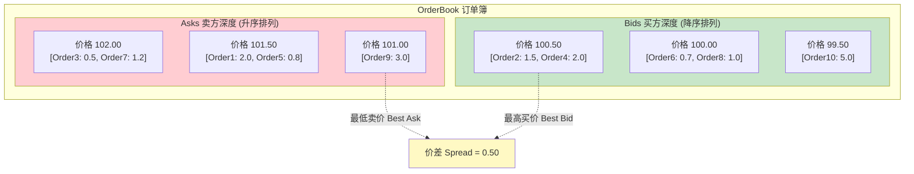
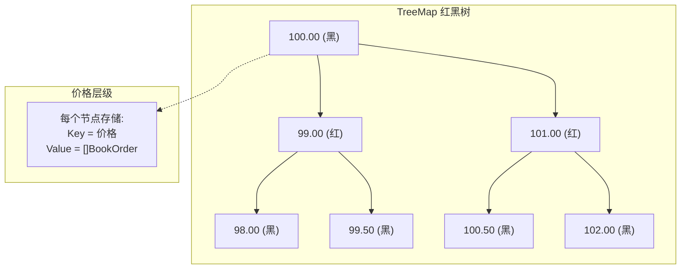
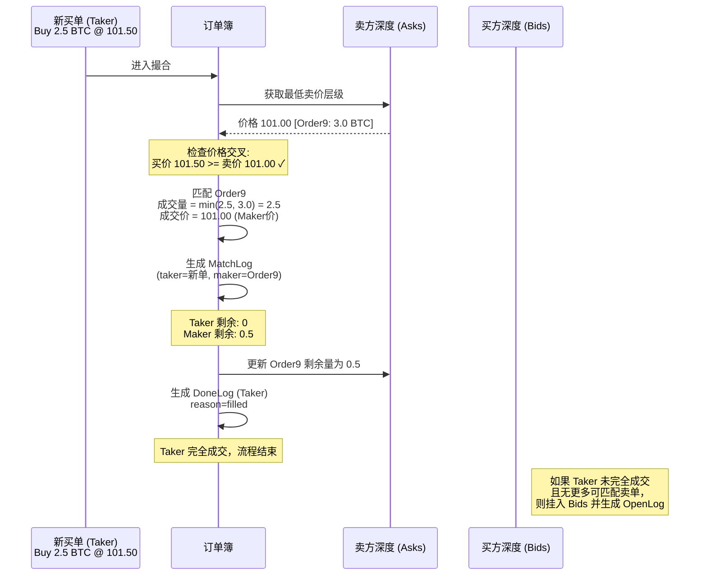
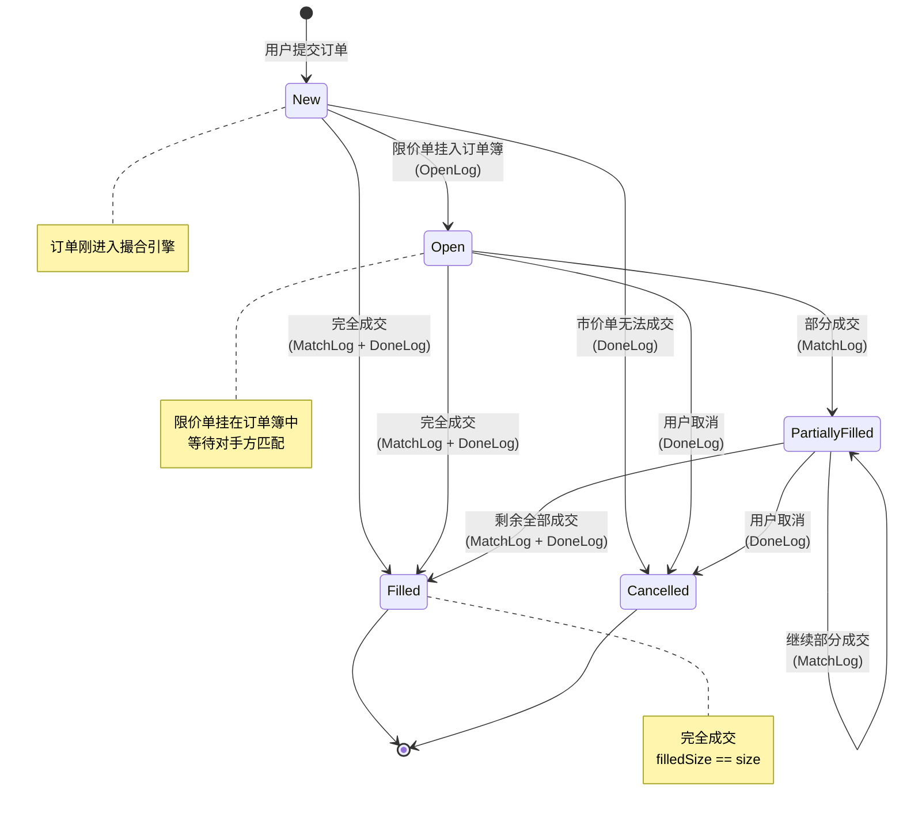
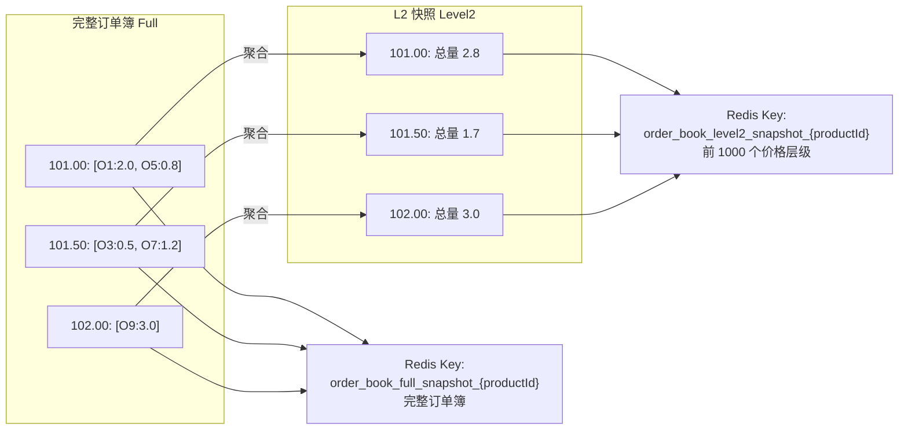

# 订单簿数据结构

## 1. 概述

订单簿（Order Book）是撮合引擎的核心数据结构，负责维护所有未成交的限价订单，并按照价格-时间优先原则进行订单匹配。每个交易对拥有一个独立的订单簿实例。

## 2. 核心数据结构



### 结构定义

```
OrderBook
├── asks: Depth          // 卖方深度（TreeMap 升序）
│   └── TreeMap<Price, []BookOrder>
└── bids: Depth          // 买方深度（TreeMap 降序）
    └── TreeMap<Price, []BookOrder>
```

### BookOrder 结构

| 字段 | 类型 | 说明 |
|------|------|------|
| `OrderId` | int64 | 订单唯一标识 |
| `Size` | decimal | 当前剩余数量 |
| `Price` | decimal | 订单价格 |
| `Side` | enum | 买方 (Buy) / 卖方 (Sell) |
| `Type` | enum | 限价 (Limit) / 市价 (Market) |

## 3. TreeMap 操作复杂度

订单簿使用 **TreeMap（红黑树）** 存储价格层级，每个价格层级包含一个订单数组（按时间排序）：



| 操作 | 复杂度 | 说明 |
|------|--------|------|
| `Put(price, orders)` | O(log n) | 插入新价格层级 |
| `Remove(price)` | O(log n) | 删除已清空的价格层级 |
| `Min()` / `Max()` | O(log n) | 获取最低/最高价格层级 |
| `Iterator()` | O(1) 每步 | 按序遍历所有价格层级 |
| 同一价格内查找订单 | O(k) | k 为该价格层级的订单数 |

**n** 为价格层级数量，通常远小于订单总数。

## 4. 订单匹配过程

以一笔限价买单到达为例，完整的匹配过程如下：



### 详细步骤

1. **确定对手方**: 买单匹配卖方深度 (Asks)，卖单匹配买方深度 (Bids)
2. **价格交叉检查**: 买价 >= 最低卖价（或卖价 <= 最高买价）时可成交
3. **逐层匹配**: 从最优价格层级开始，逐个订单匹配
4. **计算成交量**: `成交量 = min(Taker剩余, Maker剩余)`
5. **成交定价**: 以 Maker 的挂单价格成交
6. **更新数量**: 减少双方的剩余数量
7. **处理完成订单**: 剩余为 0 的订单生成 DoneLog 并移除
8. **层级用尽**: 当前价格层级全部匹配完后，移至下一价格层级
9. **无法继续匹配**: Taker 若有剩余且为限价单，挂入己方深度

## 5. 价格层级管理

### 添加订单到价格层级

```
1. 检查该价格的层级是否存在
2. 如果不存在 → 创建新层级，Put 到 TreeMap
3. 如果存在 → 将订单追加到该层级的订单数组末尾（时间优先）
```

### 从价格层级移除订单

```
1. 在该价格层级的订单数组中找到目标订单
2. 从数组中移除
3. 如果数组为空 → 从 TreeMap 中 Remove 该价格层级
```

### 更新订单数量（部分成交）

```
1. 找到对应的 BookOrder
2. 更新 Size = Size - 成交量
3. 如果 Size == 0 → 执行移除操作
```

## 6. 订单生命周期状态机



### 状态说明

| 状态 | 说明 | 对应日志 |
|------|------|----------|
| **New** | 订单刚进入撮合引擎，尚未处理 | - |
| **Open** | 限价单已挂入订单簿，等待匹配 | OpenLog |
| **PartiallyFilled** | 部分数量已成交，剩余仍挂在簿中 | MatchLog |
| **Filled** | 完全成交 | DoneLog (reason=filled) |
| **Cancelled** | 已取消（用户取消或市价单无法成交） | DoneLog (reason=cancelled) |

## 7. L2 快照生成

订单簿定期生成 Level 2 (L2) 快照，聚合每个价格层级的总量，推送给客户端：



### 快照存储

| Redis Key | 内容 | 用途 |
|-----------|------|------|
| `order_book_level2_snapshot_{productId}` | 买卖各前 1000 个价格层级的聚合量 | WebSocket L2 推送的初始快照 |
| `order_book_full_snapshot_{productId}` | 完整订单簿所有订单明细 | 订单簿恢复 |

## 8. 特殊场景处理

### 自成交防护

当同一用户的买单和卖单在簿中相遇时，需要检查是否为同一用户的订单。当前实现中撮合引擎不做自成交检查，由业务层处理。

### 空簿匹配

当对手方深度为空时：
- **限价单**: 直接挂入己方深度，生成 OpenLog
- **市价单**: 无法成交，生成 DoneLog (reason=cancelled)

### 大额订单穿越多层

一笔大额订单可能穿越多个价格层级：
1. 在第一层匹配完所有订单
2. 移至第二层继续匹配
3. 每次匹配均以当前 Maker 的价格成交
4. 最终可能产生多条 MatchLog，每条对应不同的成交价

## 9. 关键源文件

| 文件路径 | 说明 |
|----------|------|
| `matching/order_book.go` | 订单簿核心结构：OrderBook、Depth、BookOrder |
| `matching/engine.go` | 引擎中调用订单簿进行撮合的逻辑 |
| `matching/log.go` | 撮合日志定义 |
| `pushing/order_book.go` | WebSocket 推送模块中的本地订单簿副本 |
| `pushing/order_book_stream.go` | L2 增量推送与快照生成 |

## 10. 相关文档

- [撮合引擎详解](matching-engine.md)
- [Kafka 消息系统](kafka-messaging.md)
- [WebSocket 推送](websocket.md)
