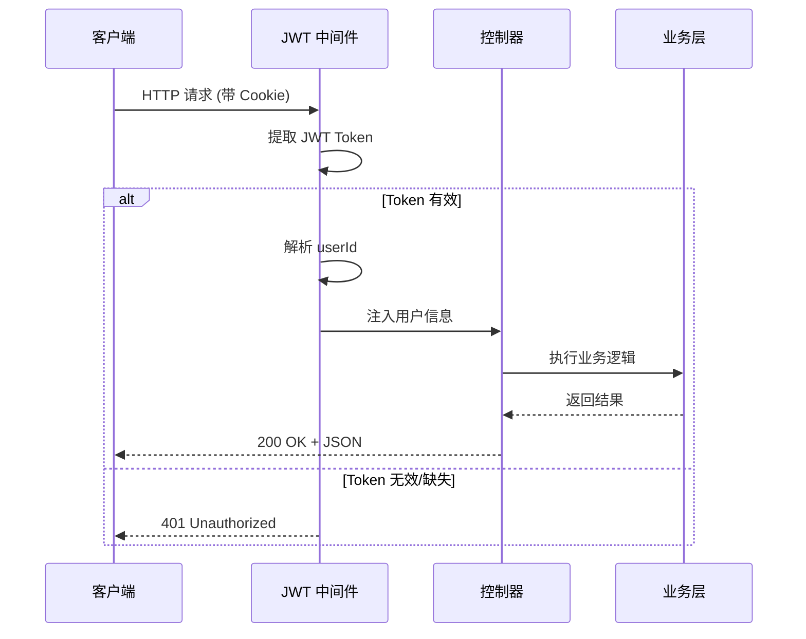
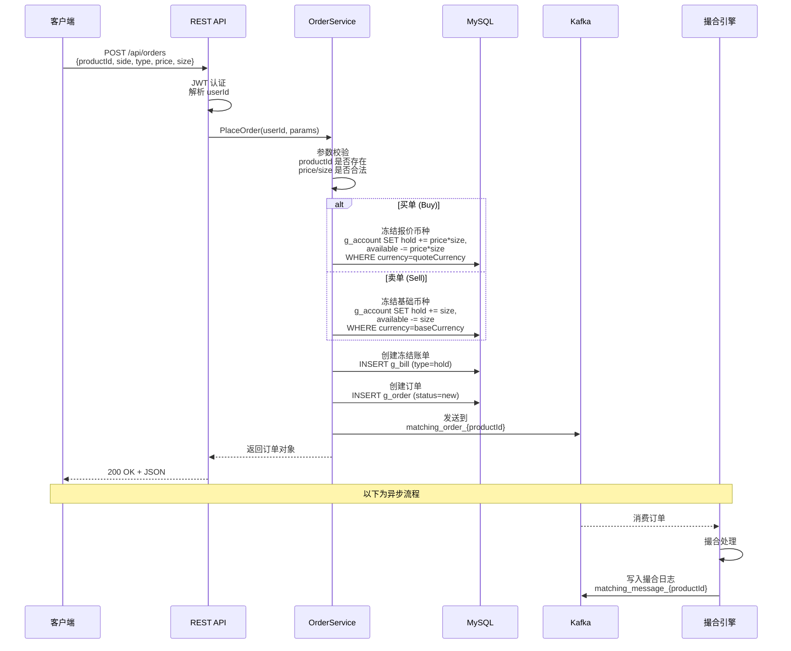

# REST API 接口文档

## 1. 概述

GitBitEx-Spot 的 REST API 基于 Gin 框架构建，提供用户管理、订单管理、账户查询和市场数据查询等接口。

### 服务配置

| 配置项 | 值 | 说明 |
|--------|-----|------|
| 框架 | Gin | Go HTTP Web 框架 |
| 监听端口 | `:8001` | 配置文件中 `restServer.address` |
| 认证方式 | JWT | 存储在 Cookie 中 |
| 数据格式 | JSON | 请求和响应均为 JSON |

## 2. 认证机制

### JWT Token

系统使用 JWT (JSON Web Token) 进行用户身份认证：

1. 用户通过 `/api/users/accessToken` 登录获取 Token
2. Token 存储在 HTTP Cookie 中
3. 需要认证的请求自动携带 Cookie
4. 服务端中间件验证 Token 有效性

### 认证中间件



## 3. 公开接口

以下接口无需认证即可访问：

| 方法 | 路径 | 说明 |
|------|------|------|
| `POST` | `/api/users` | 用户注册 |
| `POST` | `/api/users/accessToken` | 用户登录（获取 JWT） |
| `POST` | `/api/users/token` | 刷新 Token |
| `GET` | `/api/products` | 获取所有交易对 |
| `GET` | `/api/products/{id}/trades` | 获取交易对的最近成交 |
| `GET` | `/api/products/{id}/candles` | 获取 K 线数据 |

### 3.1 用户注册

**请求**:
```
POST /api/users
Content-Type: application/json
```

```json
{
    "email": "user@example.com",
    "password": "yourpassword"
}
```

**响应**:
```json
{
    "id": 1,
    "email": "user@example.com"
}
```

### 3.2 用户登录

**请求**:
```
POST /api/users/accessToken
Content-Type: application/json
```

```json
{
    "email": "user@example.com",
    "password": "yourpassword"
}
```

**响应**:
```
Set-Cookie: accessToken=eyJhbGciOiJIUzI1NiIs...
```

```json
{
    "token": "eyJhbGciOiJIUzI1NiIs..."
}
```

### 3.3 获取交易对列表

**请求**:
```
GET /api/products
```

**响应**:
```json
[
    {
        "id": "BTC-USDT",
        "baseCurrency": "BTC",
        "quoteCurrency": "USDT",
        "baseMinSize": "0.001",
        "baseMaxSize": "10000",
        "quoteIncrement": "0.01"
    }
]
```

### 3.4 获取最近成交

**请求**:
```
GET /api/products/BTC-USDT/trades
```

**响应**:
```json
[
    {
        "tradeId": 1001,
        "price": "50000.00",
        "size": "0.5",
        "side": "buy",
        "time": "2024-01-01T00:00:00Z"
    }
]
```

### 3.5 获取 K 线数据

**请求**:
```
GET /api/products/BTC-USDT/candles?granularity=60
```

| 参数 | 类型 | 说明 |
|------|------|------|
| `granularity` | int | K 线粒度（分钟）: 1/3/5/15/30/60/120/240/360/720/1440 |

**响应**:
```json
[
    [1704067200, "50000.00", "51000.00", "52000.00", "49500.00", "100.5"]
]
```

数组元素依次为: `[time, open, high, low, close, volume]`

## 4. 认证接口

以下接口需要 JWT 认证：

| 方法 | 路径 | 说明 |
|------|------|------|
| `POST` | `/api/orders` | 下单 |
| `DELETE` | `/api/orders/{id}` | 取消单个订单 |
| `DELETE` | `/api/orders` | 批量取消订单 |
| `GET` | `/api/orders` | 查询订单列表（分页） |
| `GET` | `/api/accounts` | 查询账户余额 |
| `GET` | `/api/users/self` | 获取当前用户信息 |
| `POST` | `/api/users/password` | 修改密码 |

### 4.1 下单

**请求**:
```
POST /api/orders
Content-Type: application/json
Cookie: accessToken=eyJ...
```

**限价单**:
```json
{
    "productId": "BTC-USDT",
    "side": "buy",
    "type": "limit",
    "price": "50000.00",
    "size": "0.5"
}
```

**市价买单**:
```json
{
    "productId": "BTC-USDT",
    "side": "buy",
    "type": "market",
    "funds": "25000.00"
}
```

**市价卖单**:
```json
{
    "productId": "BTC-USDT",
    "side": "sell",
    "type": "market",
    "size": "0.5"
}
```

**响应**:
```json
{
    "id": 12345,
    "productId": "BTC-USDT",
    "side": "buy",
    "type": "limit",
    "price": "50000.00",
    "size": "0.5",
    "filledSize": "0",
    "executedValue": "0",
    "status": "new",
    "createdAt": "2024-01-01T00:00:00Z"
}
```

### 4.2 取消订单

**单个取消**:
```
DELETE /api/orders/12345
Cookie: accessToken=eyJ...
```

**批量取消**:
```
DELETE /api/orders?productId=BTC-USDT&side=buy
Cookie: accessToken=eyJ...
```

| 参数 | 类型 | 必填 | 说明 |
|------|------|------|------|
| `productId` | string | 否 | 按交易对过滤 |
| `side` | string | 否 | 按方向过滤: buy/sell |

### 4.3 查询订单列表

**请求**:
```
GET /api/orders?productId=BTC-USDT&status=open&limit=20&before=100&after=50
Cookie: accessToken=eyJ...
```

| 参数 | 类型 | 必填 | 说明 |
|------|------|------|------|
| `productId` | string | 否 | 交易对过滤 |
| `status` | string | 否 | 状态过滤: open/filled/cancelled |
| `limit` | int | 否 | 每页数量，默认 20 |
| `before` | int64 | 否 | 游标: 返回 ID < before 的记录 |
| `after` | int64 | 否 | 游标: 返回 ID > after 的记录 |

**响应**:
```json
[
    {
        "id": 12345,
        "productId": "BTC-USDT",
        "side": "buy",
        "type": "limit",
        "price": "50000.00",
        "size": "0.5",
        "filledSize": "0.2",
        "executedValue": "10000.00",
        "status": "open",
        "createdAt": "2024-01-01T00:00:00Z"
    }
]
```

### 4.4 查询账户余额

**请求**:
```
GET /api/accounts
Cookie: accessToken=eyJ...
```

**响应**:
```json
[
    {
        "id": 1,
        "currency": "USDT",
        "available": "10000.00",
        "hold": "5000.00"
    },
    {
        "id": 2,
        "currency": "BTC",
        "available": "1.5",
        "hold": "0.5"
    }
]
```

## 5. 下单完整流程



### 关键要点

1. **同步返回**: 下单 API 在写入 Kafka 后立即返回，不等待撮合结果
2. **预冻结**: 下单时先冻结余额，确保资金安全
3. **原子操作**: 冻结余额、创建账单、创建订单在同一事务中完成
4. **异步撮合**: 撮合引擎异步消费 Kafka 中的订单

## 6. 分页机制

系统采用**游标分页** (Cursor-based Pagination)：

| 参数 | 说明 |
|------|------|
| `before` | 返回 ID 小于此值的记录（向前翻页） |
| `after` | 返回 ID 大于此值的记录（向后翻页） |
| `limit` | 每页记录数 |

**优势**:
- 避免传统 offset 分页的性能问题
- 数据变更不影响翻页一致性
- 适合实时变化的订单列表

## 7. 错误处理

| HTTP 状态码 | 说明 |
|-------------|------|
| 200 | 请求成功 |
| 400 | 请求参数错误 |
| 401 | 未认证或 Token 过期 |
| 404 | 资源不存在 |
| 500 | 服务器内部错误 |

错误响应格式:
```json
{
    "message": "错误描述信息"
}
```

## 8. 关键源文件

| 文件路径 | 说明 |
|----------|------|
| `rest/server.go` | Gin 服务器初始化与配置 |
| `rest/bootstrap.go` | 路由注册 |
| `rest/auth.go` | JWT 认证中间件 |
| `rest/vo.go` | 视图对象（VO）定义 |
| `rest/order_controller.go` | 订单相关 API（下单、撤单、查询） |
| `rest/account_controller.go` | 账户查询 API |
| `rest/user_controller.go` | 用户注册、登录 API |
| `rest/product_controller.go` | 产品与市场数据 API |
| `rest/wallet_controller.go` | 钱包相关 API |
| `service/order_service.go` | 订单业务逻辑（下单、撤单流程） |
| `service/user_service.go` | 用户业务逻辑（注册、认证） |
| `service/account_service.go` | 账户业务逻辑 |

## 9. 相关文档

- [系统架构概览](architecture.md)
- [数据模型设计](data-model.md)
- [WebSocket 推送](websocket.md)
