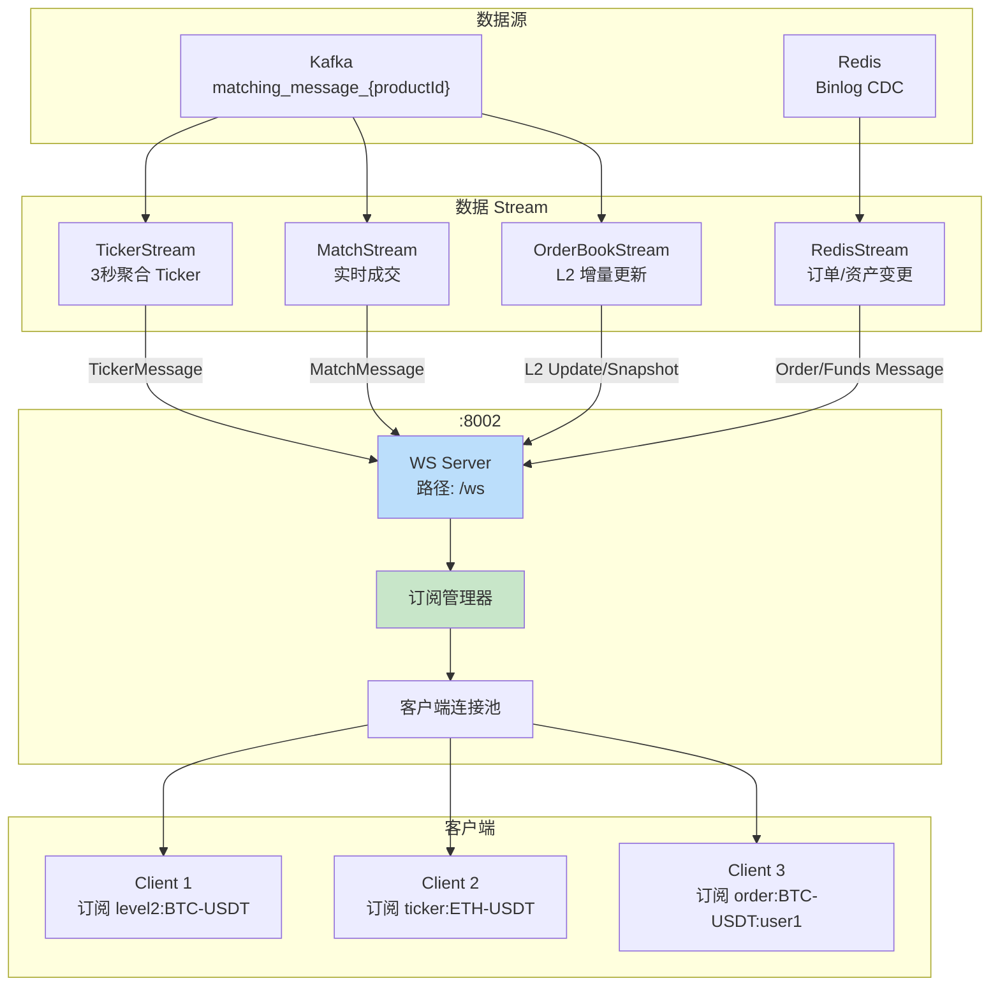
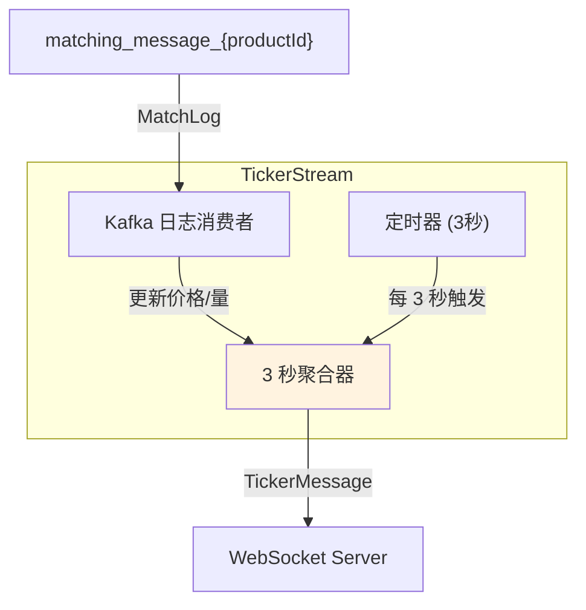
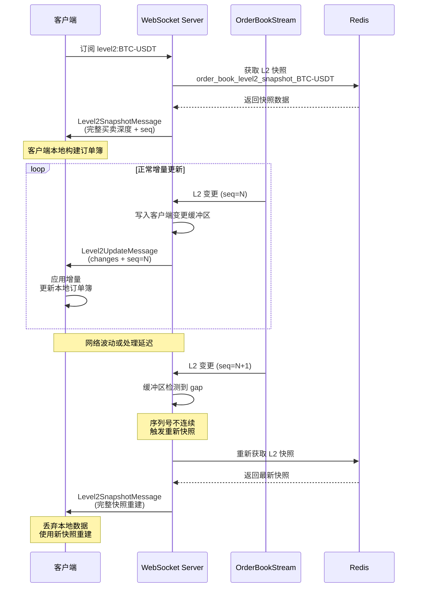
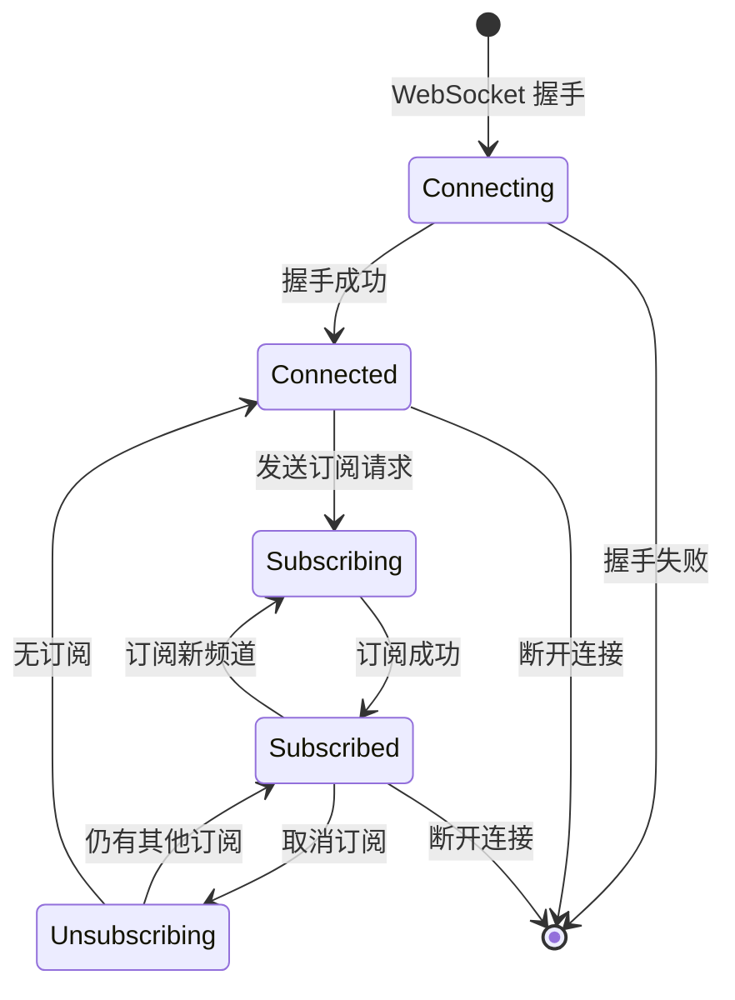

# WebSocket 实时推送系统

## 1. 概述

GitBitEx-Spot 通过 WebSocket 为客户端提供实时的行情数据和用户私有数据推送。系统采用多个数据 Stream 汇聚到 WebSocket Server 的架构，支持按频道订阅，提供 L2 订单簿增量更新、实时成交、Ticker 聚合和用户资产/订单变更等推送。

## 2. 系统架构



## 3. 服务配置

| 配置项 | 值 | 说明 |
|--------|-----|------|
| 监听端口 | `:8002` | 配置文件中 `wsServer.address` |
| 路径 | `/ws` | WebSocket 握手路径 |
| 协议 | Gorilla WebSocket | 基于 gorilla/websocket 库 |

## 4. 频道列表

| 频道格式 | 方向 | 说明 |
|----------|------|------|
| `level2:{productId}` | 公开 | L2 订单簿深度（前 1000 档） |
| `match:{productId}` | 公开 | 实时成交流 |
| `ticker:{productId}` | 公开 | 3 秒聚合 Ticker 信息 |
| `funds:{userId}` | 私有 | 用户资产余额变更 |
| `order:{productId}:{userId}` | 私有 | 用户订单状态变更 |

## 5. 消息类型详解

### 5.1 Level2SnapshotMessage - L2 快照

客户端首次订阅 `level2:{productId}` 或检测到数据缺口时收到的完整快照。

| 字段 | 类型 | 说明 |
|------|------|------|
| `type` | string | 固定值 `"l2_snapshot"` |
| `productId` | string | 交易对 ID |
| `bids` | array | 买方深度 `[[price, size], ...]` |
| `asks` | array | 卖方深度 `[[price, size], ...]` |

### 5.2 Level2UpdateMessage - L2 增量更新

订单簿变化时的增量推送。

| 字段 | 类型 | 说明 |
|------|------|------|
| `type` | string | 固定值 `"l2_update"` |
| `productId` | string | 交易对 ID |
| `changes` | array | 变更列表 `[[side, price, size], ...]` |

**size 的含义**:
- `size > 0`: 该价格层级的新总量
- `size = 0`: 该价格层级已清空，应移除

### 5.3 MatchMessage - 成交消息

实时成交发生时推送。

| 字段 | 类型 | 说明 |
|------|------|------|
| `type` | string | 固定值 `"match"` |
| `tradeId` | int64 | 交易 ID |
| `productId` | string | 交易对 ID |
| `price` | string | 成交价格 |
| `size` | string | 成交数量 |
| `side` | string | Taker 方向 (buy/sell) |
| `time` | string | 成交时间 |
| `sequence` | int64 | 序列号 |

### 5.4 TickerMessage - 行情聚合

每 3 秒推送一次的行情聚合数据。

| 字段 | 类型 | 说明 |
|------|------|------|
| `type` | string | 固定值 `"ticker"` |
| `productId` | string | 交易对 ID |
| `price` | string | 最新成交价 |
| `open24h` | string | 24 小时开盘价 |
| `close24h` | string | 24 小时收盘价 |
| `high24h` | string | 24 小时最高价 |
| `low24h` | string | 24 小时最低价 |
| `volume24h` | string | 24 小时成交量 |
| `time` | string | 时间戳 |

### 5.5 FundsMessage - 资产变更

用户资产余额变化时推送。

| 字段 | 类型 | 说明 |
|------|------|------|
| `type` | string | 固定值 `"funds"` |
| `userId` | int64 | 用户 ID |
| `currency` | string | 币种 |
| `available` | string | 可用余额 |
| `hold` | string | 冻结余额 |

### 5.6 OrderMessage - 订单变更

用户订单状态变化时推送。

| 字段 | 类型 | 说明 |
|------|------|------|
| `type` | string | 固定值 `"order"` |
| `userId` | int64 | 用户 ID |
| `productId` | string | 交易对 ID |
| `orderId` | int64 | 订单 ID |
| `side` | string | 方向 |
| `orderType` | string | 类型 |
| `price` | string | 价格 |
| `size` | string | 数量 |
| `filledSize` | string | 已成交数量 |
| `status` | string | 订单状态 |

## 6. Stream 处理详解

### 6.1 TickerStream - Ticker 聚合



**工作流程**:
1. 消费 Kafka 撮合日志中的 MatchLog
2. 在内存中维护最新价格、24小时 OHLCV 数据
3. 每 3 秒向所有订阅了 `ticker:{productId}` 的客户端推送聚合数据

### 6.2 MatchStream - 实时成交

**工作流程**:
1. 消费 Kafka 撮合日志中的 MatchLog
2. 将每条 MatchLog 实时转换为 MatchMessage
3. 立即推送给订阅了 `match:{productId}` 的客户端

### 6.3 OrderBookStream - L2 订单簿增量

OrderBookStream 维护一个本地订单簿副本，计算增量变更推送给客户端：

**工作流程**:
1. 消费 Kafka 撮合日志（OpenLog、MatchLog、DoneLog）
2. 在本地维护完整的订单簿副本
3. 每次变更后计算 L2 聚合差异（delta）
4. 将差异作为 Level2UpdateMessage 推送

### 6.4 RedisStream - Binlog CDC 推送

**工作流程**:
1. 订阅 Redis 的 `g_order` 和 `g_account` Pub/Sub 频道
2. 收到订单变更时，推送 OrderMessage 到 `order:{productId}:{userId}`
3. 收到账户变更时，推送 FundsMessage 到 `funds:{userId}`

## 7. L2 增量更新机制

L2 订单簿的增量更新是 WebSocket 推送中最复杂的部分，需要处理数据缺口和断线重连：



### 缺口检测

- 每个客户端维护一个变更缓冲区
- 推送前检查序列号是否连续
- 检测到序列号缺口时自动触发快照重发
- 客户端收到快照后丢弃本地数据，重建订单簿

## 8. 客户端连接管理

### 连接生命周期



### 订阅/取消订阅

**订阅请求**:
```json
{
    "type": "subscribe",
    "channels": [
        {"name": "level2", "productIds": ["BTC-USDT"]},
        {"name": "ticker", "productIds": ["BTC-USDT", "ETH-USDT"]},
        {"name": "match", "productIds": ["BTC-USDT"]}
    ]
}
```

**取消订阅**:
```json
{
    "type": "unsubscribe",
    "channels": [
        {"name": "level2", "productIds": ["BTC-USDT"]}
    ]
}
```

### 连接管理要点

| 特性 | 说明 |
|------|------|
| 并发连接 | 支持多客户端同时连接 |
| 多频道订阅 | 单连接可同时订阅多个频道 |
| 订阅管理 | 通过 subscription 模块统一管理 |
| 消息路由 | 按频道精确推送，不做广播 |
| 断线处理 | 断开后自动清理订阅关系 |

## 9. 关键源文件

| 文件路径 | 说明 |
|----------|------|
| `pushing/server.go` | WebSocket 服务器主体 |
| `pushing/bootstrap.go` | WS 服务启动，注册 Stream |
| `pushing/client.go` | 客户端连接管理 |
| `pushing/subscription.go` | 频道订阅管理 |
| `pushing/message.go` | 消息类型定义（6 种消息） |
| `pushing/ticker_stream.go` | TickerStream 3 秒聚合 |
| `pushing/match_stream.go` | MatchStream 实时成交 |
| `pushing/order_book_stream.go` | OrderBookStream L2 增量 |
| `pushing/order_book.go` | 本地订单簿副本 |
| `pushing/redis_stream.go` | RedisStream Binlog CDC |

## 10. 相关文档

- [系统架构概览](architecture.md)
- [订单簿数据结构](order-book.md)
- [Worker 处理管道](workers.md)
