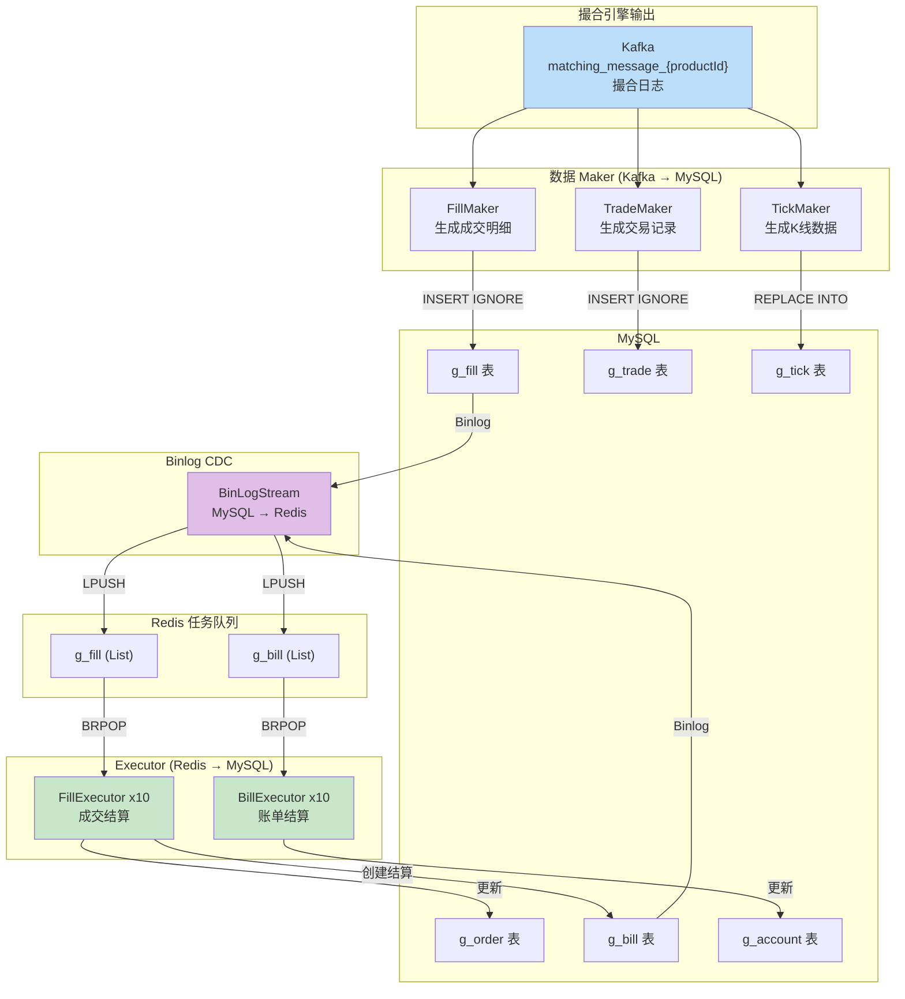
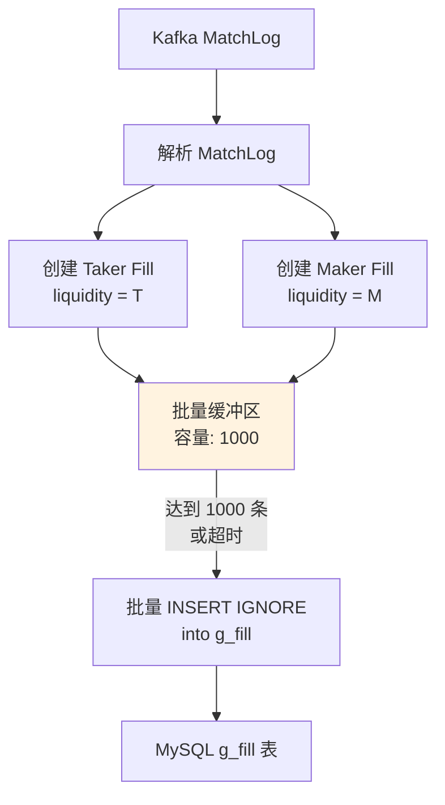
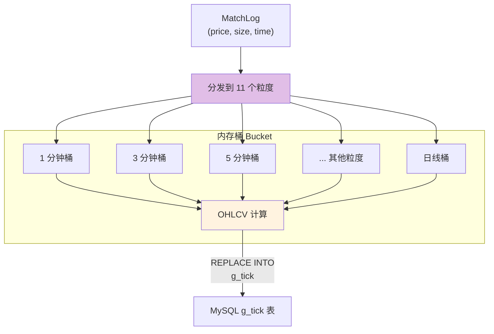
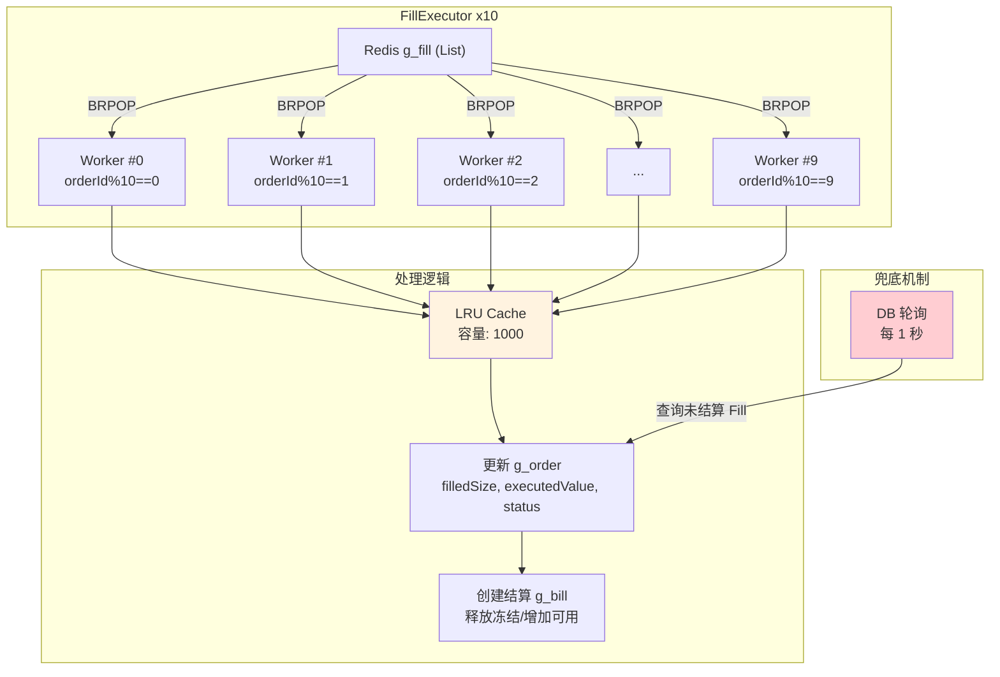
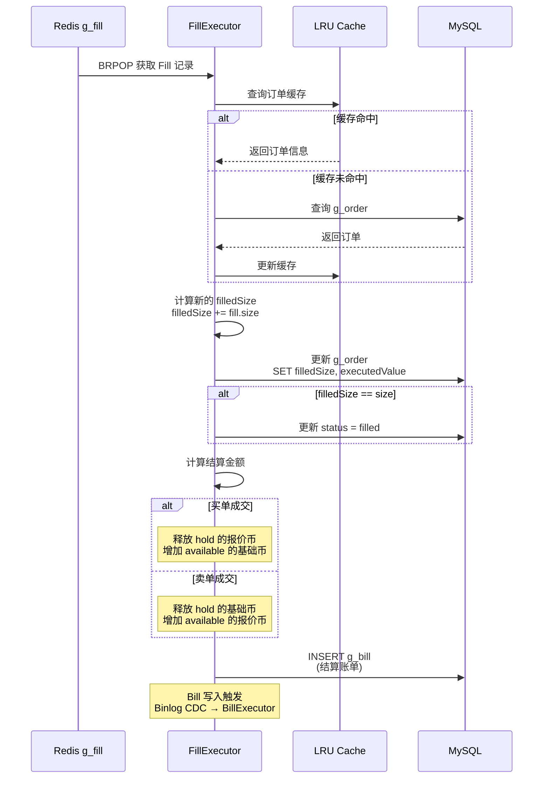
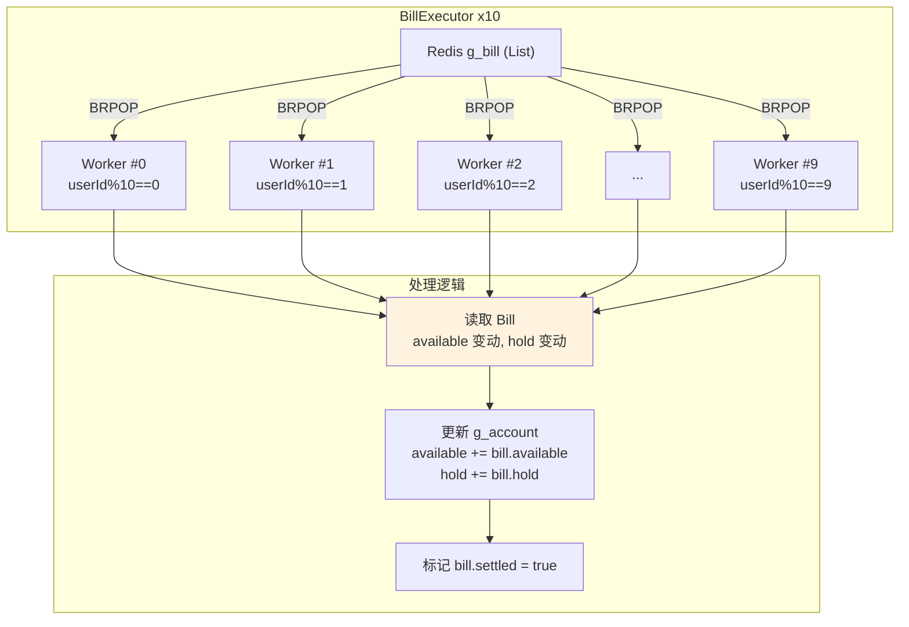
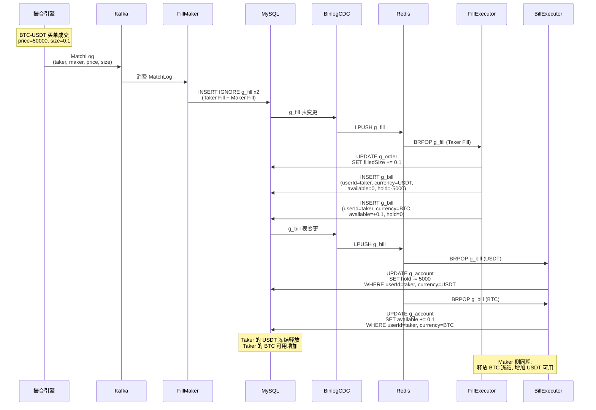
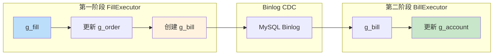

# Worker 处理管道

## 1. 概述

Worker 处理管道是连接撮合引擎与数据持久化、资金结算的核心环节。系统通过多种 Worker 将 Kafka 中的撮合日志转化为数据库记录，再通过 MySQL Binlog CDC 驱动 Redis 任务队列，最终由 Executor 完成资金结算。

## 2. 整体管道架构



## 3. FillMaker - 成交记录生成器

### 职责

消费 Kafka 撮合日志中的 MatchLog，为 Taker 和 Maker 双方各创建一条 Fill 记录。

### 工作流程



### 关键机制

| 特性 | 说明 |
|------|------|
| 每条 MatchLog 产生 2 条 Fill | Taker (liquidity=T) 和 Maker (liquidity=M) |
| 批量写入 | 缓冲 1000 条后批量 INSERT |
| 幂等去重 | `INSERT IGNORE` + `UNIQUE(order_id, message_seq)` |
| 记录字段 | orderId, tradeId, messageSeq, size, price, funds, liquidity, fee |

### Fill 字段计算

| 字段 | Taker Fill | Maker Fill |
|------|-----------|-----------|
| `order_id` | takerOrderId | makerOrderId |
| `trade_id` | tradeId | tradeId |
| `message_seq` | MatchLog.sequence | MatchLog.sequence |
| `size` | 成交数量 | 成交数量 |
| `price` | Maker 价格 | Maker 价格 |
| `funds` | size * price | size * price |
| `liquidity` | T | M |

## 4. TradeMaker - 交易记录生成器

### 职责

消费 Kafka 撮合日志中的 MatchLog，为每次成交创建一条 Trade 记录。

### 关键机制

| 特性 | 说明 |
|------|------|
| 每条 MatchLog 产生 1 条 Trade | 记录完整的成交信息 |
| 批量写入 | 批量 INSERT IGNORE |
| 幂等去重 | `INSERT IGNORE` 基于主键或唯一索引 |
| 记录字段 | productId, takerOrderId, makerOrderId, price, size, side |

### Trade 与 Fill 的关系

```
1 个 MatchLog → 1 个 Trade + 2 个 Fill (Taker + Maker)
```

## 5. TickMaker - K 线生成器

### 职责

消费 Kafka 撮合日志中的 MatchLog，维护内存中的 K 线桶，计算 OHLCV 数据。

### 支持的粒度

| 粒度 (分钟) | 说明 |
|-------------|------|
| 1 | 1 分钟 K |
| 3 | 3 分钟 K |
| 5 | 5 分钟 K |
| 15 | 15 分钟 K |
| 30 | 30 分钟 K |
| 60 | 1 小时 K |
| 120 | 2 小时 K |
| 240 | 4 小时 K |
| 360 | 6 小时 K |
| 720 | 12 小时 K |
| 1440 | 日 K |

共 **11 种** 粒度同时维护。

### 工作流程



### OHLCV 计算规则

| 字段 | 计算方式 |
|------|----------|
| **Open** | 时间窗口内第一笔成交价 |
| **High** | 时间窗口内最高成交价 |
| **Low** | 时间窗口内最低成交价 |
| **Close** | 时间窗口内最后一笔成交价 |
| **Volume** | 时间窗口内成交量之和 |

### 数据写入

- 使用 `REPLACE INTO` 语句
- 以 `(product_id, granularity, time)` 为唯一键
- 每次成交都可能更新多个粒度的 K 线数据

## 6. FillExecutor - 成交结算执行器

### 职责

消费 Redis `g_fill` 列表中的成交记录，执行订单状态更新和结算账单创建。

### 架构



### 关键机制

| 特性 | 说明 |
|------|------|
| 实例数量 | 10 个并行 Worker |
| 分片策略 | `orderId % 10` 路由到对应 Worker |
| 消费方式 | Redis `BRPOP` 阻塞弹出 |
| LRU 缓存 | 容量 1000，缓存已处理的订单状态 |
| 兜底机制 | 每 1 秒轮询数据库查找未结算 Fill |

### 处理流程



### 分片的意义

- **相同订单路由到同一 Worker**: 避免并发更新同一订单的竞态条件
- **不同订单并行处理**: 10 个 Worker 并行执行，提升吞吐量
- **LRU 缓存局部性**: 同一订单的多次 Fill 可命中缓存

## 7. BillExecutor - 账单结算执行器

### 职责

消费 Redis `g_bill` 列表中的账单记录，将账单中的变动金额应用到用户账户。

### 架构



### 关键机制

| 特性 | 说明 |
|------|------|
| 实例数量 | 10 个并行 Worker |
| 分片策略 | `userId % 10` 路由到对应 Worker |
| 消费方式 | Redis `BRPOP` 阻塞弹出 |
| 操作 | 将 bill 中的 available/hold 增量应用到 account |

### 分片的意义

- **相同用户路由到同一 Worker**: 避免并发更新同一用户账户的竞态条件
- **保证余额一致性**: 同一用户的所有账单按序处理
- **不同用户并行处理**: 10 个 Worker 并行执行

## 8. 完整结算流程

以一笔限价买单成交为例，展示从撮合到余额更新的完整结算链路：



## 9. 两阶段结算机制

系统采用两阶段结算（Two-Phase Settlement）设计，将结算过程分为两个独立的阶段：

### 第一阶段: FillExecutor

| 操作 | 说明 |
|------|------|
| 输入 | g_fill 记录（Binlog CDC 触发） |
| 处理 | 更新订单状态（filledSize, executedValue, status） |
| 输出 | 创建结算 g_bill 记录 |

### 第二阶段: BillExecutor

| 操作 | 说明 |
|------|------|
| 输入 | g_bill 记录（Binlog CDC 触发） |
| 处理 | 将 bill 的 available/hold 增量应用到 g_account |
| 输出 | 更新用户账户余额，标记 bill 已结算 |

### 设计优势



1. **解耦**: 订单结算和余额结算分离，降低系统复杂度
2. **可靠性**: 每个阶段都有 Binlog CDC 驱动，即使 Worker 崩溃也能恢复
3. **可追溯**: 通过 g_bill 表记录每一笔余额变动，完整审计链
4. **并发安全**: 按 orderId/userId 分片，避免竞态条件
5. **兜底机制**: FillExecutor 每 1 秒轮询数据库，确保不遗漏未处理的 Fill

## 10. 关键源文件

| 文件路径 | 说明 |
|----------|------|
| `worker/fill_maker.go` | FillMaker: Kafka MatchLog → g_fill |
| `worker/trade_maker.go` | TradeMaker: Kafka MatchLog → g_trade |
| `worker/tick_maker.go` | TickMaker: Kafka MatchLog → g_tick (11种粒度) |
| `worker/fill_executor.go` | FillExecutor: g_fill → g_order 更新 + g_bill 创建 |
| `worker/bill_executor.go` | BillExecutor: g_bill → g_account 更新 |
| `models/binlog_stream.go` | MySQL Binlog CDC 到 Redis 的桥接 |

## 11. 相关文档

- [系统架构概览](architecture.md)
- [撮合引擎详解](matching-engine.md)
- [数据模型设计](data-model.md)
- [Kafka 消息系统](kafka-messaging.md)
