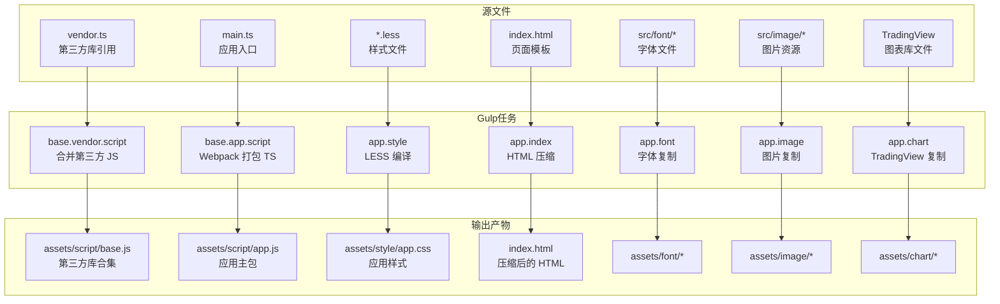
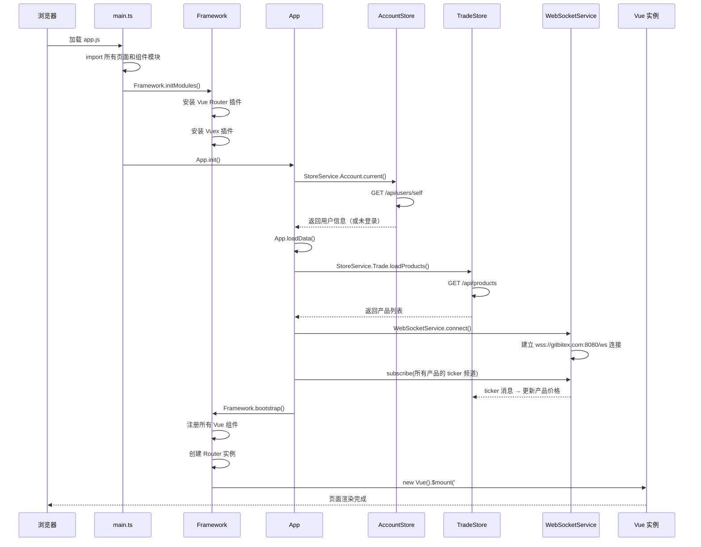
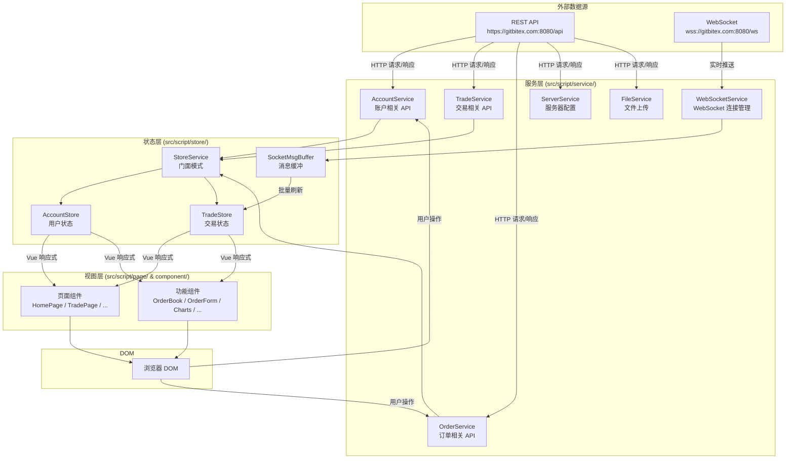

# gitbitex-web 项目架构文档

## 1. 项目背景

gitbitex-web 是一个基于 Vue 2 的单页应用 (SPA)，用于加密货币交易所的前端界面。该项目提供了完整的交易所功能，包括实时行情展示、K 线图表、深度图、订单簿、下单交易、钱包管理、用户账户等核心模块。项目采用 TypeScript 开发，通过自定义装饰器框架对 Vue/Router/Vuex 进行了封装抽象。

## 2. 技术栈

| 类别 | 技术 | 版本 | 用途 |
|------|------|------|------|
| 前端框架 | Vue.js | 2.5.17 | 核心 UI 框架 |
| 类组件 | vue-class-component | 6.2.0 | 类风格 Vue 组件 |
| 属性装饰器 | vue-property-decorator | 6.1.0 | 组件属性装饰器 |
| 状态管理 | Vuex | 3.0.1 | 全局状态管理 |
| 路由 | Vue Router | 3.0.1 | SPA 路由（history 模式）|
| HTTP 客户端 | Axios | 0.19.0 | API 请求 |
| UI 框架 | Bootstrap | 4.3.1 | 响应式布局和基础样式 |
| CSS 预处理 | LESS | - | 样式预编译 |
| 图表库 | Highcharts | 7.2.0 | K 线图和深度图 |
| 高级图表 | TradingView Charting Library | - | 专业交易图表 |
| 构建工具 | Gulp | 3.9.1 | 任务流编排 |
| 打包工具 | Webpack | 3.10.0 | TypeScript 模块打包 |
| 语言 | TypeScript | 2.9 | 类型安全的 JavaScript |

## 3. 构建系统

### 3.1 构建流程概览

构建系统由 Gulp 作为任务编排器，集成 Webpack 进行 TypeScript 打包。核心配置文件：

- `gulpfile.js` -- Gulp 任务入口
- `gulp/gulp.config.js` -- Gulp 路径与任务配置
- `gulp/webpack.config.js` -- Webpack 打包配置



### 3.2 Gulp 任务详解

| 任务名 | 说明 | 输入 | 输出 |
|--------|------|------|------|
| `base.vendor.script` | 合并所有第三方 JS 库为一个文件 | `vendor.ts` 引用的外部库 | `assets/script/base.js` |
| `base.app.script` | 通过 Webpack + awesome-typescript-loader 编译打包 TypeScript | `src/script/main.ts` | `assets/script/app.js` |
| `app.style` | 编译 LESS 为 CSS | `src/style/app.less` | `assets/style/app.css` |
| `app.index` | 压缩 HTML 模板 | `src/index.html` | `index.html` |
| `app.font` | 复制字体资源 | `src/font/*` | `assets/font/*` |
| `app.image` | 复制图片资源 | `src/image/*` | `assets/image/*` |
| `app.chart` | 复制 TradingView 图表库 | TradingView 库文件 | `assets/chart/*` |

### 3.3 Webpack 配置

Webpack 配置位于 `gulp/webpack.config.js`：

- **入口文件**: `src/script/main.ts`
- **输出文件**: `assets/script/app.js`
- **TypeScript 编译**: 使用 `awesome-typescript-loader`
- **模板处理**: 使用 `html-loader` 处理 HTML 模板

### 3.4 开发服务器

开发环境使用 BrowserSync 提供本地开发服务：

- **本地地址**: `localhost:3000`
- **API 代理**: `/api/*` 请求转发至 `https://gitbitex.com:8080/`
- **热更新**: 文件修改后自动刷新浏览器

### 3.5 生产构建

生产环境构建增加以下优化：

- **代码压缩**: 使用 UglifyJs 压缩 JavaScript
- **文件指纹**: MD5 哈希值追加到文件名，用于缓存控制
- **版本清单**: 生成 revision manifest 文件，映射原始文件名到带哈希的文件名
- **Source Map**: 生产环境移除 source maps

## 4. 项目目录结构

```
gitbitex-web/
├── gulpfile.js                          # Gulp 任务入口
├── gulp/
│   ├── gulp.config.js                   # Gulp 配置
│   └── webpack.config.js               # Webpack 配置
├── src/
│   ├── index.html                       # HTML 模板
│   ├── font/                            # 字体资源
│   ├── image/                           # 图片资源
│   ├── style/
│   │   ├── app.less                     # 样式入口
│   │   ├── base.less                    # 基础样式
│   │   ├── bootstrap.less               # Bootstrap 覆盖
│   │   ├── page/
│   │   │   ├── home.less                # 首页样式
│   │   │   ├── trade.less               # 交易页样式
│   │   │   └── account.less             # 账户页样式
│   │   └── component/
│   │       ├── header.less              # 头部组件样式
│   │       ├── panel.less               # 面板组件样式
│   │       ├── chart.less               # 图表组件样式
│   │       ├── form.less                # 表单组件样式
│   │       ├── modal.less               # 弹窗组件样式
│   │       ├── format.less              # 格式化组件样式
│   │       ├── select.less              # 下拉选择样式
│   │       └── icon.less                # 图标组件样式
│   └── script/
│       ├── main.ts                      # 应用入口
│       ├── app.ts                       # 应用初始化逻辑
│       ├── framework.ts                 # 框架封装（Vue/Router/Vuex）
│       ├── constant.ts                  # 常量定义
│       ├── helper.ts                    # 工具函数
│       ├── vendor.ts                    # 第三方库引用
│       ├── watch.ts                     # 监听器
│       ├── chart/
│       │   ├── datafeed.ts              # TradingView 数据源
│       │   └── config.ts               # TradingView 配置
│       ├── service/
│       │   ├── service.ts               # 服务基类
│       │   ├── request.ts               # Axios 封装
│       │   ├── http.ts                  # HTTP 服务入口
│       │   ├── account.ts               # 账户 API 服务
│       │   ├── trade.ts                 # 交易 API 服务
│       │   ├── order.ts                 # 订单 API 服务
│       │   ├── server.ts                # 服务器配置 API
│       │   ├── file.ts                  # 文件上传 API
│       │   └── websocket.ts             # WebSocket 服务
│       ├── store/
│       │   ├── store.ts                 # Store 基类
│       │   ├── service.ts               # StoreService 门面
│       │   ├── account.ts               # 账户状态
│       │   ├── trade.ts                 # 交易状态
│       │   ├── buffer.ts                # WebSocket 消息缓冲
│       │   └── channel.ts               # WebSocket 频道管理
│       ├── page/
│       │   ├── page.ts                  # 页面基类
│       │   ├── home/home.ts             # 首页
│       │   ├── trade/trade.ts           # 交易页
│       │   ├── proxy/proxy.ts           # 代理页
│       │   └── account/
│       │       ├── signin/signin.ts     # 登录页
│       │       ├── signup/signup.ts     # 注册页
│       │       ├── profile/profile.ts   # 个人资料页
│       │       ├── forgot/forgot.ts     # 忘记密码页
│       │       ├── order/order.ts       # 订单页
│       │       └── wallet/
│       │           ├── wallet.ts        # 钱包页
│       │           ├── deposit/deposit.ts     # 充值页
│       │           └── withdrawal/withdrawal.ts # 提现页
│       └── component/
│           ├── component.ts             # 组件基类
│           ├── header/                  # 头部导航组件
│           ├── form/                    # 表单组件
│           ├── panel/                   # 面板组件
│           ├── chart/                   # 图表组件
│           ├── format/                  # 格式化组件
│           ├── modal/                   # 弹窗组件
│           ├── pagination/              # 分页组件
│           ├── select/                  # 下拉选择组件
│           ├── link-proxy/              # 链接代理组件
│           ├── logo/                    # Logo 组件
│           ├── icon/                    # 图标组件
│           └── page/                    # 页面状态组件
└── assets/                              # 构建输出目录
    ├── script/
    │   ├── base.js                      # 第三方库合集
    │   └── app.js                       # 应用主包
    ├── style/
    │   └── app.css                      # 应用样式
    ├── font/                            # 字体输出
    ├── image/                           # 图片输出
    └── chart/                           # TradingView 输出
```

## 5. 应用初始化流程

应用的启动流程从 `src/script/main.ts` 开始，经历框架初始化、数据加载、WebSocket 连接等阶段。



### 5.1 初始化阶段说明

1. **模块导入**: `main.ts` 使用 ES6 import 导入所有页面和组件文件，触发装饰器注册
2. **框架初始化**: `Framework.initModules()` 安装 Vue Router 和 Vuex 插件
3. **用户认证**: `App.init()` 调用 `GET /api/users/self` 获取当前登录状态
4. **数据加载**: `App.loadData()` 加载产品列表（交易对信息）
5. **WebSocket 连接**: 建立 WebSocket 连接并订阅所有产品的 ticker 频道
6. **应用挂载**: `Framework.bootstrap()` 注册组件、创建路由、挂载 Vue 实例到 `#App`

## 6. 路由配置

Vue Router 采用 history 模式，通过 `@Route` 装饰器在页面类上声明路由。

| 路径 | 页面 | 需要登录 | 说明 |
|------|------|----------|------|
| `/` | HomePage | 否 | 首页，展示市场概览和产品行情 |
| `/trade/:id` | TradePage | 否 | 核心交易页面，根据产品 ID 显示 |
| `/account/signin` | SigninPage | 否 | 用户登录页 |
| `/account/signup` | SignupPage | 否 | 用户注册页 |
| `/account/forgot` | ForgotPage | 否 | 忘记密码页 |
| `/account/profile` | ProfilePage | **是** | 个人资料管理 |
| `/account/wallet` | WalletPage | **是** | 钱包总览 |
| `/account/wallet/deposit` | DepositPage | **是** | 充值页面 |
| `/account/wallet/withdrawal` | WithdrawalPage | **是** | 提现页面 |
| `/account/order` | OrderPage | **是** | 历史订单查看 |
| `/proxy` | ProxyPage | 否 | 链接代理页 |

### 6.1 页面基类 — @Route 装饰器

页面基类定义在 `src/script/page/page.ts` 中。通过 `@Route(path, template)` 装饰器进行路由注册：

```typescript
@Route('/trade/:id', template)
class TradePage extends Page {
    // ...
}
```

装饰器在模块导入时执行，将路由信息收集到框架的路由注册表中，最终在 `Framework.bootstrap()` 中统一创建 Router 实例。

### 6.2 组件基类 — @Dom 装饰器

组件基类定义在 `src/script/component/component.ts` 中。通过 `@Dom(elementName, template, props)` 装饰器注册为全局 Vue 组件：

```typescript
@Dom('order-book-panel', template, ['productId'])
class OrderBookPanelComponent extends Component {
    // ...
}
```

注册的组件可以在任何模板中以标签形式使用：`<order-book-panel :productId="currentProduct">`

## 7. 整体数据流架构



### 7.1 数据流说明

1. **HTTP 数据流**: 页面加载时通过 REST API 获取初始数据（产品列表、K 线历史、交易历史、订单、资金等），数据写入 Vuex Store
2. **WebSocket 数据流**: 建立连接后订阅频道，服务端实时推送行情数据。消息先进入 `SocketMsgBuffer` 缓冲，以 200-300ms 间隔批量刷新到 Vuex Store
3. **响应式更新**: Vuex Store 中的状态变更通过 Vue 的响应式系统自动触发组件重新渲染
4. **用户交互**: 用户操作（下单、取消订单、充提等）通过 HTTP 服务发送请求，服务端处理后通过 WebSocket 推送结果更新

## 8. 关键源文件索引

| 文件路径 | 职责 |
|----------|------|
| `src/script/main.ts` | 应用入口，导入所有模块并启动 |
| `src/script/app.ts` | 应用初始化逻辑，数据加载编排 |
| `src/script/framework.ts` | Vue/Router/Vuex 封装，组件注册，应用挂载 |
| `src/script/constant.ts` | 全局常量（聚合精度、时间范围等）|
| `src/script/helper.ts` | 工具函数（价格格式化、订单簿聚合等）|
| `src/script/service/request.ts` | Axios 单例封装，请求拦截器 |
| `src/script/service/websocket.ts` | WebSocket 连接管理 |
| `src/script/store/service.ts` | StoreService 门面 |
| `src/script/store/trade.ts` | 交易状态管理核心 |
| `src/script/store/buffer.ts` | WebSocket 消息缓冲 |
| `src/script/page/page.ts` | 页面基类与 @Route 装饰器 |
| `src/script/component/component.ts` | 组件基类与 @Dom 装饰器 |
