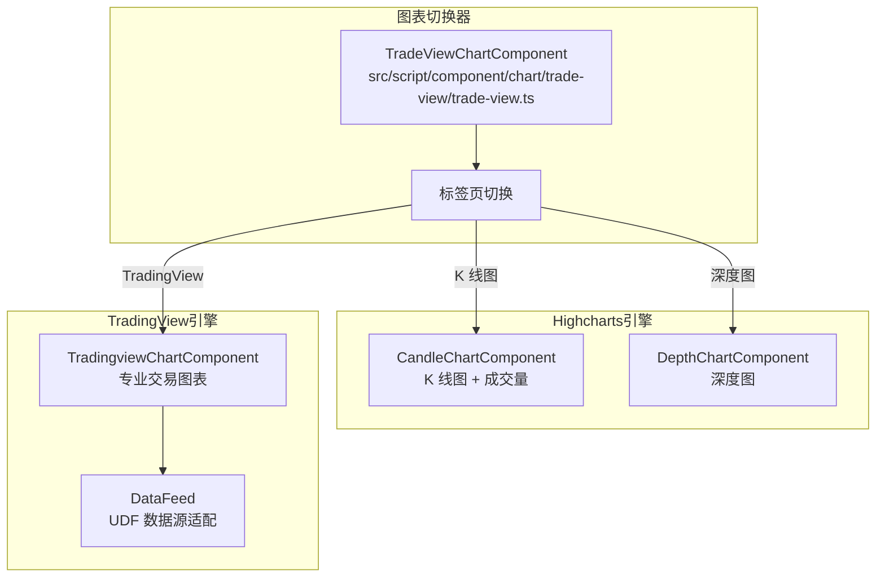
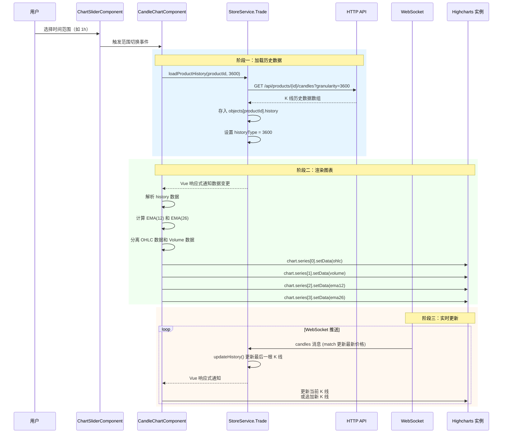
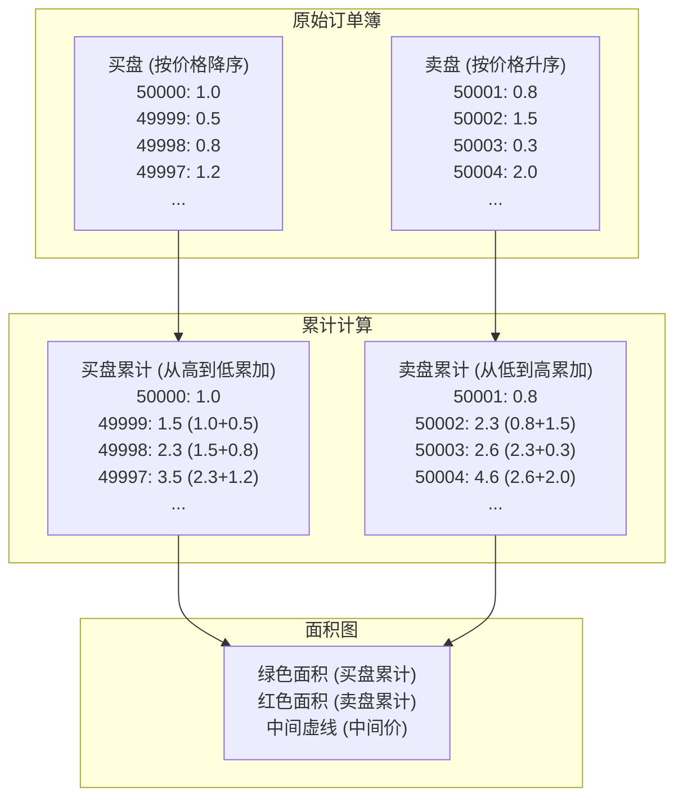
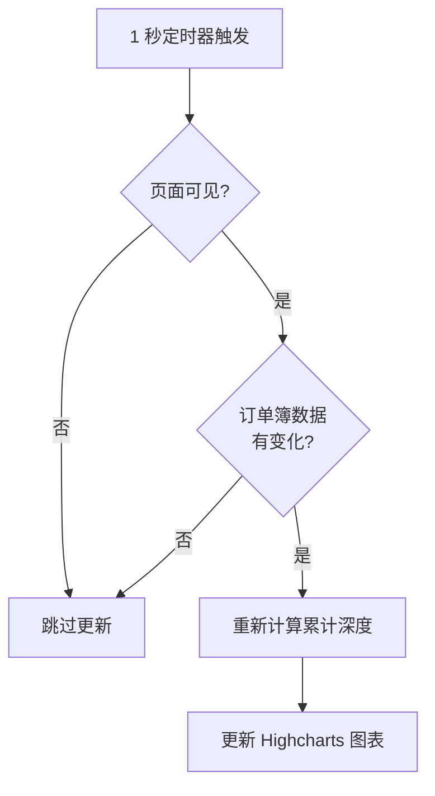
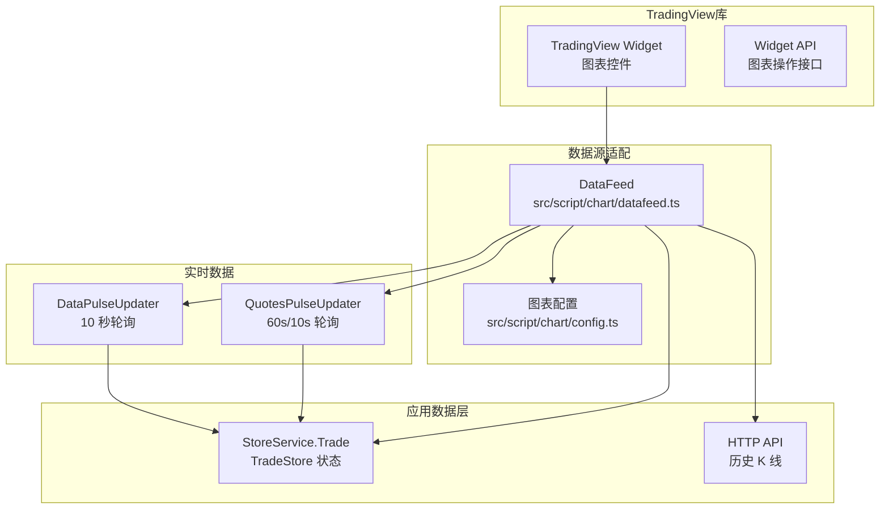
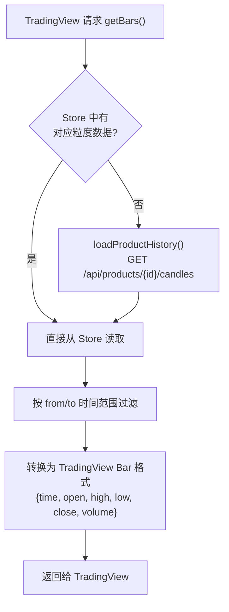
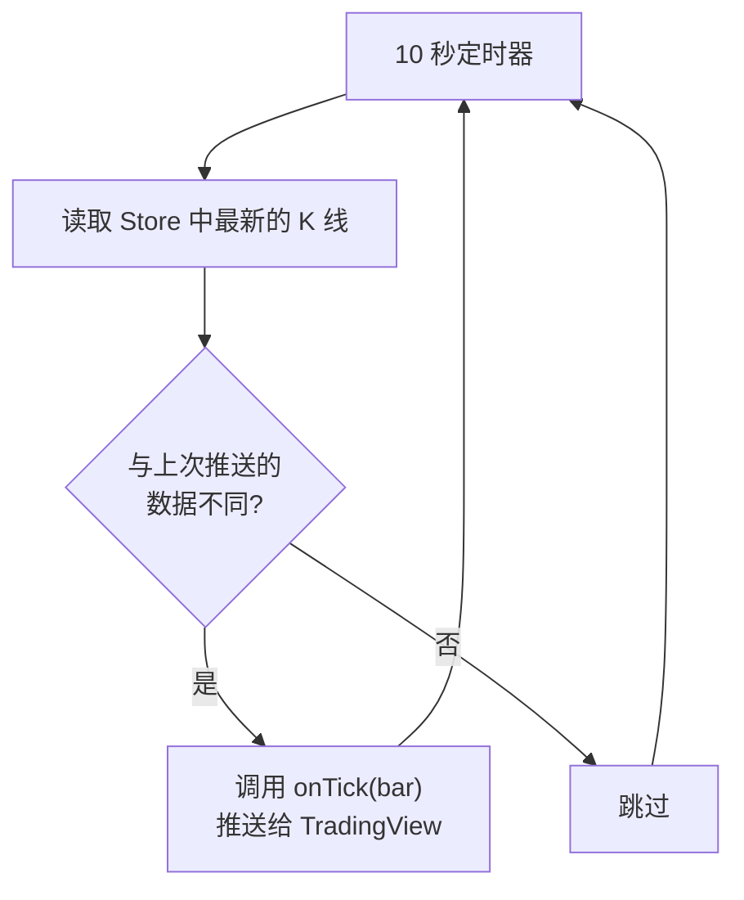
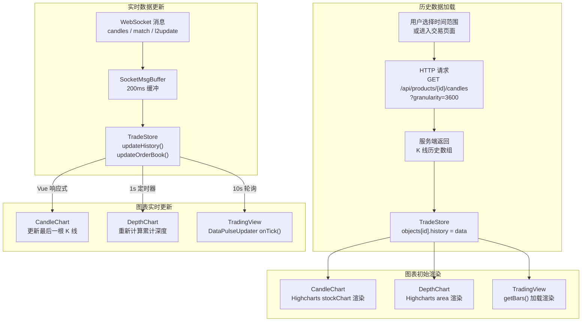
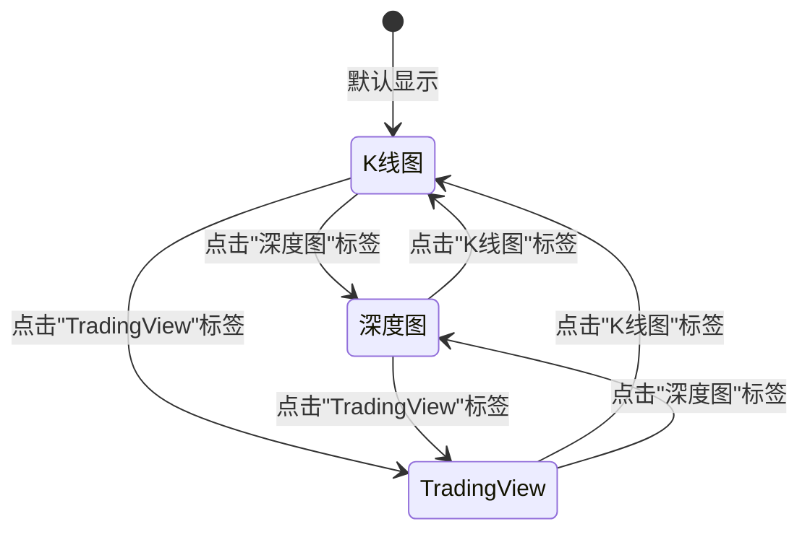

# gitbitex-web 图表系统文档

## 1. 图表系统概览

gitbitex-web 的图表系统采用双引擎架构，同时集成 Highcharts 和 TradingView 两个图表库，分别用于不同场景下的行情展示需求。

| 图表引擎 | 用途 | 源文件路径 |
|----------|------|------------|
| Highcharts 7.2.0 | K 线图（内置版）和深度图 | `src/script/component/chart/candle/candle.ts` <br/> `src/script/component/chart/depth/depth.ts` |
| TradingView Charting Library | 专业级交易图表 | `src/script/component/chart/tradingview/tradingview.ts` <br/> `src/script/chart/datafeed.ts` <br/> `src/script/chart/config.ts` |



## 2. K 线图 (CandleChartComponent)

源文件: `src/script/component/chart/candle/candle.ts`

### 2.1 Highcharts.stockChart 配置

CandleChartComponent 使用 Highcharts 的 `stockChart` 类型，这是专门为金融时间序列数据设计的图表类型。

**核心配置：**

- **图表类型**: `Highcharts.stockChart`
- **主题**: 深色主题 (背景 #15232c)
- **子图**: 两个 Y 轴区域 -- 价格区域（上方 70%）和成交量区域（下方 30%）
- **交互**: 十字准线 (crosshair)、工具提示 (tooltip)

### 2.2 时间范围

| 范围标签 | 粒度 (秒) | 粒度标识 | K 线类型 |
|----------|-----------|----------|----------|
| 1m (1 分钟) | 60 | `candles_60` | 分钟线 |
| 5m (5 分钟) | 300 | `candles_300` | 分钟线 |
| 15m (15 分钟) | 900 | `candles_900` | 分钟线 |
| 30m (30 分钟) | 1800 | `candles_1800` | 分钟线 |
| 1h (1 小时) | 3600 | `candles_3600` | 小时线 |
| 6h (6 小时) | 21600 | `candles_21600` | 小时线 |
| 1d (1 天) | 86400 | `candles_86400` | 日线 |

用户通过 `ChartSliderComponent` (`src/script/component/chart/slider/slider.ts`) 切换时间范围。切换后触发重新加载对应粒度的历史数据并重新订阅 WebSocket 频道。

### 2.3 图表类型

| 类型 | 说明 | Highcharts 系列类型 |
|------|------|---------------------|
| 蜡烛图 (Candlestick) | 显示开盘/最高/最低/收盘价 | `candlestick` |
| 折线图 (Line) | 仅显示收盘价连线 | `line` |

### 2.4 技术指标

| 指标 | 参数 | 颜色 | 说明 |
|------|------|------|------|
| EMA 12 | 周期 = 12 | 黄色 | 12 周期指数移动平均线，反映短期趋势 |
| EMA 26 | 周期 = 26 | 紫色 | 26 周期指数移动平均线，反映中期趋势 |

EMA (指数移动平均线) 计算公式: `EMA_today = Price_today * k + EMA_yesterday * (1 - k)`，其中 `k = 2 / (N + 1)`。

### 2.5 成交量子图

- 位于价格图下方
- 柱状图 (`column` 系列)
- 颜色: 上涨蜡烛对应绿色柱，下跌蜡烛对应红色柱
- Y 轴独立于价格轴

### 2.6 深色主题配置

| 属性 | 值 | 说明 |
|------|-----|------|
| 背景色 | #15232c | 深蓝黑色 |
| 网格线颜色 | #1c2d3a | 微暗网格 |
| 文字颜色 | #7f8c97 | 灰色文字 |
| 上涨颜色 | #00c087 | 绿色 |
| 下跌颜色 | #ef5454 | 红色 |
| 十字准线 | #4c5c68 | 灰色虚线 |

### 2.7 数据加载流程



### 2.8 实时 K 线更新逻辑

当收到 WebSocket 的 `candles` 或 `match` 消息时：

1. **当前 K 线更新**: 如果消息的时间戳在最后一根 K 线的时间区间内
   - 更新 high (如果新价更高)
   - 更新 low (如果新价更低)
   - 更新 close 为最新价
   - 累加 volume
2. **新 K 线追加**: 如果消息的时间戳超过当前 K 线区间
   - 创建新的 K 线数据点: `[timestamp, open, high, low, close, volume]`
   - open = close = high = low = 最新价

## 3. 深度图 (DepthChartComponent)

源文件: `src/script/component/chart/depth/depth.ts`

### 3.1 Highcharts.chart 配置

深度图使用 Highcharts 基础 `chart` 类型，以面积图 (`area`) 形式展示买卖双方的累计挂单深度。

### 3.2 核心特性

| 特性 | 说明 |
|------|------|
| 图表类型 | 面积图 (area) |
| 深度档数 | 最大 200 档 |
| 买盘颜色 | 绿色 (#00c087) 面积 |
| 卖盘颜色 | 红色 (#ef5454) 面积 |
| 中间价标线 | 买一卖一中间的 plotline 虚线 |
| 更新频率 | 每 1 秒检查更新 |
| 聚合精度 | 与订单簿面板共享 8 级聚合 |
| 可见性优化 | 页面不可见时停止更新 |

### 3.3 累计深度计算

深度图的 Y 轴显示的是累计挂单量，而非单档挂单量。计算方式如下：



### 3.4 聚合与订单簿同步

深度图支持与订单簿面板相同的 8 级聚合精度：

| 聚合级别 | 精度值 | 效果 |
|----------|--------|------|
| 1 | 0.01 | 精细显示，曲线锯齿多 |
| 2 | 0.1 | |
| 3 | 1 | |
| 4 | 10 | |
| 5 | 50 | |
| 6 | 100 | |
| 7 | 500 | |
| 8 | 1000 | 粗略显示，曲线平滑 |

聚合使用与订单簿相同的 `Trade_margeOrderBook()` 函数 (`src/script/helper.ts`)。

### 3.5 更新策略



**可见性优化**: 使用 Page Visibility API 检测页面是否在前台显示。当用户切换到其他标签页时，停止深度图的定时更新，节省计算资源。当页面重新可见时，立即执行一次更新并恢复定时器。

### 3.6 中间价标线

在买盘最高价和卖盘最低价之间绘制一条垂直虚线 (Highcharts plotLine)：

- **位置**: `(bestBid + bestAsk) / 2`
- **颜色**: 灰色虚线
- **用途**: 直观标识当前市场价差位置

## 4. TradingView 集成

### 4.1 架构概览

TradingView 图表通过其 JavaScript Charting Library 集成，采用 UDF (Universal Data Feed) 协议与应用数据层对接。



源文件:
- `src/script/component/chart/tradingview/tradingview.ts` -- TradingView 组件
- `src/script/chart/datafeed.ts` -- UDF DataFeed 实现
- `src/script/chart/config.ts` -- 图表配置

### 4.2 UDF DataFeed 协议

DataFeed 是 TradingView 与应用数据层之间的适配器，实现了 TradingView 要求的 UDF 接口：

| 方法 | 说明 | 数据来源 |
|------|------|----------|
| `onReady(callback)` | 初始化 DataFeed，返回配置 | 静态配置 |
| `resolveSymbol(symbolName, onResolve)` | 解析交易对符号信息 | `StoreService.Trade.products` |
| `getBars(symbolInfo, resolution, from, to, onResult)` | 获取历史 K 线数据 | `StoreService.Trade.getObject().history` / HTTP |
| `subscribeBars(symbolInfo, resolution, onTick)` | 订阅实时 K 线更新 | DataPulseUpdater |
| `unsubscribeBars(listenerGuid)` | 取消订阅实时更新 | - |
| `searchSymbols(input, exchange, type, onResult)` | 搜索交易对符号 | `StoreService.Trade.products` |

### 4.3 resolveSymbol 元数据

`resolveSymbol()` 方法返回交易对的元数据，供 TradingView 图表使用：

```javascript
{
    name: "BTC-USDT",
    full_name: "BTC-USDT",
    description: "BTC/USDT",
    type: "crypto",
    session: "24x7",          // 加密货币 24 小时交易
    exchange: "GitBitEx",
    timezone: "Asia/Shanghai",
    minmov: 1,
    pricescale: 100,          // 价格精度
    has_intraday: true,
    has_daily: true,
    supported_resolutions: ["1", "5", "15", "30", "60", "360", "D"]
}
```

### 4.4 getBars 数据获取



### 4.5 DataPulseUpdater

`DataPulseUpdater` 负责将实时数据推送给 TradingView 图表：

| 属性 | 值 | 说明 |
|------|-----|------|
| 轮询间隔 | 10 秒 | 每 10 秒检查新数据 |
| 数据来源 | StoreService.Trade 中的 history | 由 WebSocket 持续更新 |
| 推送方式 | 调用 `onTick(bar)` 回调 | TradingView 注册的回调函数 |

工作流程：



### 4.6 QuotesPulseUpdater

`QuotesPulseUpdater` 负责更新 TradingView 的报价信息（如当前价格、涨跌等）：

| 属性 | 值 | 说明 |
|------|-----|------|
| 首次间隔 | 10 秒 | 首次加载后较快更新 |
| 后续间隔 | 60 秒 | 稳定后降低更新频率 |
| 数据来源 | StoreService.Trade.products | 由 WebSocket ticker 更新 |

### 4.7 深色主题

TradingView 图表使用与整体应用一致的深色主题：

| 属性 | 值 |
|------|-----|
| 背景色 | #15232c |
| 网格线颜色 | #1c2d3a |
| 文字颜色 | #7f8c97 |
| 蜡烛上涨色 | #00c087 |
| 蜡烛下跌色 | #ef5454 |
| 工具栏背景 | #15232c |

## 5. 图表数据生命周期

展示从数据产生到图表渲染的完整生命周期：



### 5.1 各图表的更新机制对比

| 图表 | 更新触发 | 更新延迟 | 更新方式 |
|------|----------|----------|----------|
| CandleChart | Vue 响应式 (watch) | ~200ms (Buffer 延迟) | 直接操作 Highcharts API 更新数据点 |
| DepthChart | 1 秒定时器轮询 | ~1000ms | 重新计算并替换整个数据集 |
| TradingView | 10 秒定时器轮询 | ~10000ms | 通过 `onTick()` 回调推送新数据 |

### 5.2 更新策略选择原因

- **CandleChart (200ms)**: K 线图需要较快反映价格变化，Vue 响应式提供最低延迟
- **DepthChart (1s)**: 深度图计算量较大（200 档累计），适当降低频率平衡性能
- **TradingView (10s)**: TradingView 库自身有渲染优化，较低频率的推送已经足够，且避免与库内部状态冲突

## 6. 图表组件切换器 (TradeViewChartComponent)

源文件: `src/script/component/chart/trade-view/trade-view.ts`

TradeViewChartComponent 作为图表区域的容器，管理三种图表之间的切换：



**切换行为：**
- 非活跃图表通过 CSS `display:none` 隐藏（不销毁），保留内部状态
- 切换到 CandleChart 时，如果时间范围已更改，触发数据重新加载
- 切换到 DepthChart 时，立即执行一次深度计算更新
- 切换到 TradingView 时，触发 `chart.resize()` 适配容器尺寸

## 7. ChartSliderComponent (时间范围选择器)

源文件: `src/script/component/chart/slider/slider.ts`

时间范围选择器与 K 线图联动，允许用户在 7 个时间粒度之间切换：

```
 [1m] [5m] [15m] [30m] [1h] [6h] [1d]   [蜡烛图/折线图切换]
```

**交互流程：**

1. 用户点击时间范围按钮（如 "1h"）
2. SliderComponent 发出 `change` 事件，携带 granularity 值 (3600)
3. CandleChartComponent 接收事件
4. 调用 `StoreService.Trade.loadProductHistory(productId, 3600)`
5. 取消旧粒度的 WebSocket 频道订阅 (如 `candles_60`)
6. 订阅新粒度的 WebSocket 频道 (`candles_3600`)
7. 历史数据加载完成后重新渲染图表

## 8. 核心源文件索引

| 文件路径 | 职责 |
|----------|------|
| `src/script/component/chart/candle/candle.ts` | K 线图组件，Highcharts stockChart |
| `src/script/component/chart/depth/depth.ts` | 深度图组件，Highcharts area chart |
| `src/script/component/chart/trade-view/trade-view.ts` | 图表切换器容器 |
| `src/script/component/chart/tradingview/tradingview.ts` | TradingView 图表组件 |
| `src/script/component/chart/slider/slider.ts` | 时间范围选择器 |
| `src/script/chart/datafeed.ts` | TradingView UDF DataFeed 实现 |
| `src/script/chart/config.ts` | TradingView 图表配置 |
| `src/script/helper.ts` | 工具函数（深度聚合计算等）|
| `src/script/store/trade.ts` | K 线和订单簿数据存储 |
| `src/script/constant.ts` | 聚合精度常量、时间范围常量 |
| `src/style/component/chart.less` | 图表组件样式 |
