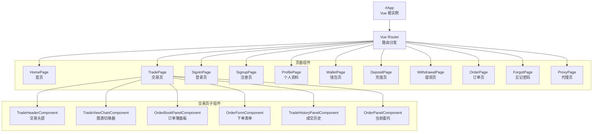
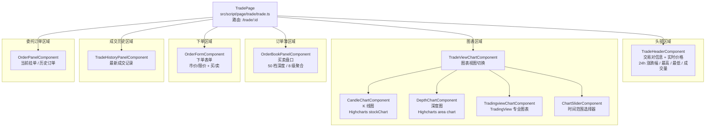
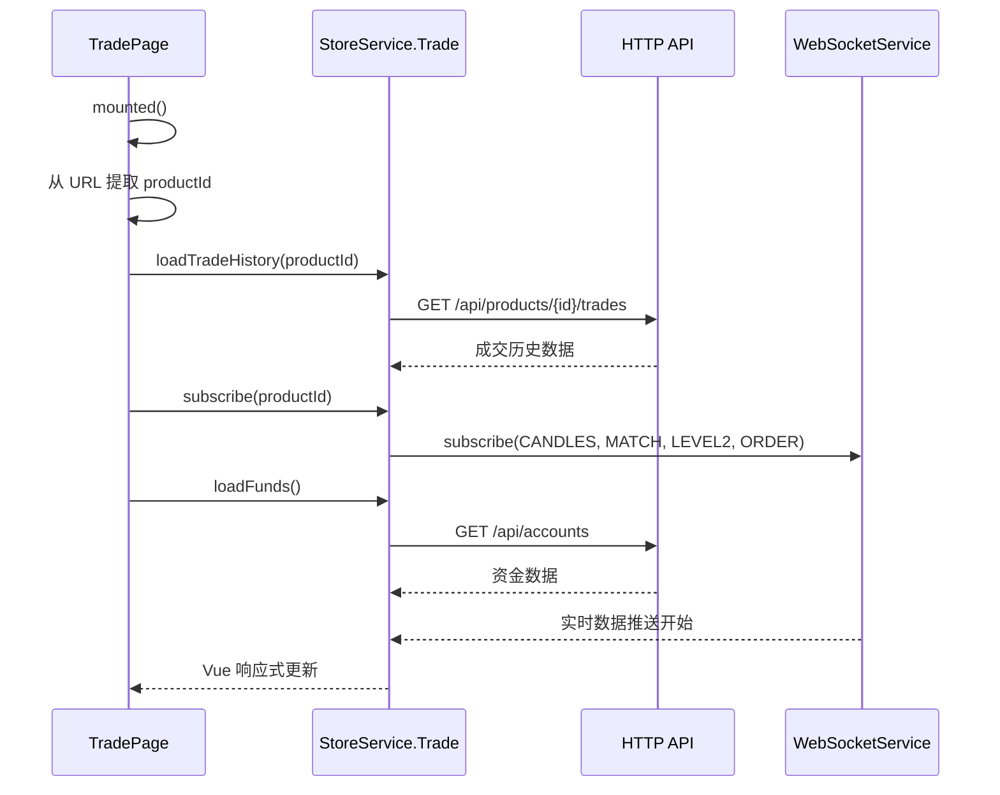
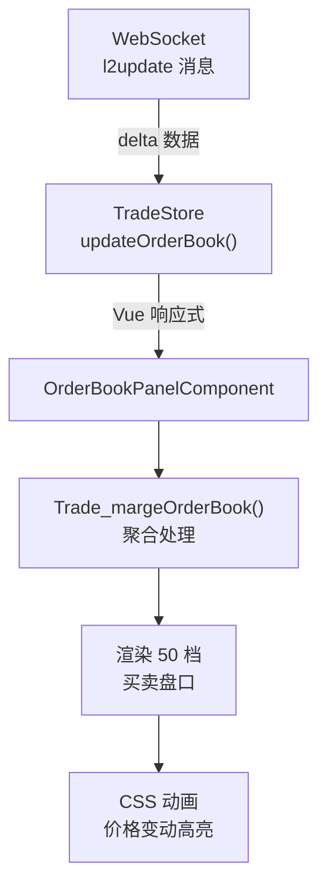
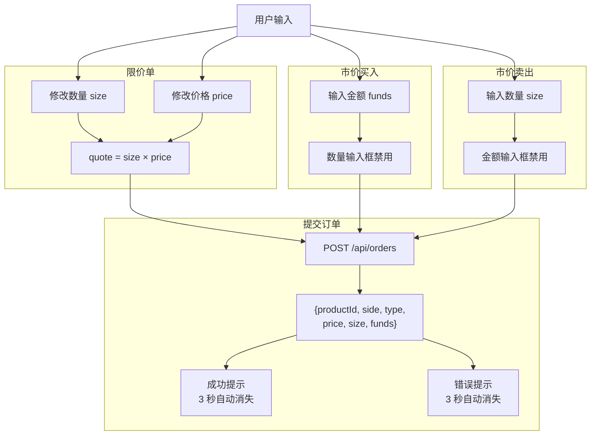
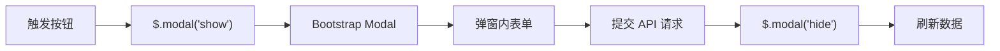

# gitbitex-web 组件系统文档

## 1. 组件体系概览

gitbitex-web 采用自定义装饰器系统管理 Vue 组件，所有组件通过 `@Dom` 装饰器注册为全局组件，页面通过 `@Route` 装饰器注册路由。组件分为页面组件和功能组件两大类。

### 1.1 整体组件层级



## 2. 组件注册机制

### 2.1 @Dom 装饰器

组件基类定义在 `src/script/component/component.ts`，通过 `@Dom` 装饰器注册：

```typescript
@Dom('element-name', template, ['prop1', 'prop2'])
class MyComponent extends Component {
    // 组件逻辑
}
```

**参数说明：**
- `element-name`: 组件的 HTML 标签名，在模板中使用 `<element-name>`
- `template`: 组件的 HTML 模板字符串（通过 html-loader 导入）
- `['prop1', 'prop2']`: 组件接收的 props 列表

装饰器在 `main.ts` 导入时执行，将组件信息收集到框架的组件注册表中。在 `Framework.bootstrap()` 阶段统一调用 `Vue.component()` 注册为全局组件。

### 2.2 @Route 装饰器

页面基类定义在 `src/script/page/page.ts`，通过 `@Route` 装饰器注册路由：

```typescript
@Route('/trade/:id', template)
class TradePage extends Page {
    // 页面逻辑
}
```

装饰器将路由路径和模板收集到路由注册表，在 `Framework.bootstrap()` 中统一创建 Vue Router 实例。

## 3. 组件分类清单

### 3.1 布局与导航组件

| 组件 | 标签名 | 源文件路径 | 说明 |
|------|--------|------------|------|
| NavbarHeaderComponent | `navbar-header` | `src/script/component/header/navbar/navbar.ts` | 全局导航栏，显示 Logo、菜单、用户信息 |
| NavbarHomeComponent | `navbar-home` | `src/script/component/header/home/home.ts` | 首页专用导航栏 |
| TradeHeaderComponent | `trade-header` | `src/script/component/header/trade/trade.ts` | 交易页头部，显示交易对信息和实时价格 |
| LogoComponent | `logo` | `src/script/component/logo/logo.ts` | 网站 Logo |

### 3.2 表单组件

| 组件 | 标签名 | 源文件路径 | 说明 |
|------|--------|------------|------|
| OrderFormComponent | `order-form` | `src/script/component/form/order/order.ts` | 核心下单表单，支持市价/限价、买/卖 |
| DepositFormComponent | `deposit-form` | `src/script/component/form/deposit/deposit.ts` | 充值表单 |
| WithdrawalFormComponent | `withdrawal-form` | `src/script/component/form/withdrawal/withdrawal.ts` | 提现表单 |

### 3.3 面板组件

| 组件 | 标签名 | 源文件路径 | 说明 |
|------|--------|------------|------|
| OrderBookPanelComponent | `order-book-panel` | `src/script/component/panel/order-book/order-book.ts` | 订单簿面板，50 档深度，8 级聚合 |
| OrderPanelComponent | `order-panel` | `src/script/component/panel/order/order.ts` | 当前委托订单面板 |
| OrderListPanelComponent | `order-list-panel` | `src/script/component/panel/order-list/order-list.ts` | 订单列表面板（历史订单）|
| TradePanelComponent | `trade-panel` | `src/script/component/panel/trade/trade.ts` | 交易面板 |
| TradeHistoryPanelComponent | `trade-history-panel` | `src/script/component/panel/trade-history/trade-history.ts` | 成交历史面板 |
| WalletPanelComponent | `wallet-panel` | `src/script/component/panel/wallet/wallet.ts` | 钱包面板 |
| WalletListPanelComponent | `wallet-list-panel` | `src/script/component/panel/wallet-list/wallet-list.ts` | 钱包列表面板（多币种）|
| TransactionPanelComponent | `transaction-panel` | `src/script/component/panel/transaction/transaction.ts` | 交易记录面板 |

### 3.4 图表组件

| 组件 | 标签名 | 源文件路径 | 说明 |
|------|--------|------------|------|
| CandleChartComponent | `candle-chart` | `src/script/component/chart/candle/candle.ts` | K 线图（Highcharts）|
| DepthChartComponent | `depth-chart` | `src/script/component/chart/depth/depth.ts` | 深度图（Highcharts）|
| TradeViewChartComponent | `trade-view-chart` | `src/script/component/chart/trade-view/trade-view.ts` | 图表视图切换器 |
| TradingviewChartComponent | `tradingview-chart` | `src/script/component/chart/tradingview/tradingview.ts` | TradingView 专业图表 |
| ChartSliderComponent | `chart-slider` | `src/script/component/chart/slider/slider.ts` | 图表时间范围滑块 |

### 3.5 格式化组件

| 组件 | 标签名 | 源文件路径 | 说明 |
|------|--------|------------|------|
| NumberFormatComponent | `number-format` | `src/script/component/format/number/number.ts` | 数字格式化显示 |
| PriceFormatComponent | `price-format` | `src/script/component/format/price/price.ts` | 价格格式化显示（涨跌颜色）|

### 3.6 弹窗组件

| 组件 | 标签名 | 源文件路径 | 说明 |
|------|--------|------------|------|
| DepositModal | `deposit-modal` | `src/script/component/modal/deposit/deposit.ts` | 充值弹窗 |
| WithdrawalModal | `withdrawal-modal` | `src/script/component/modal/withdrawal/withdrawal.ts` | 提现弹窗 |
| TransactionModal | `transaction-modal` | `src/script/component/modal/transaction/transaction.ts` | 交易详情弹窗 |
| ChangePasswordModal | `change-password-modal` | `src/script/component/modal/change-password/change-password.ts` | 修改密码弹窗 |

### 3.7 工具组件

| 组件 | 标签名 | 源文件路径 | 说明 |
|------|--------|------------|------|
| PaginationComponent | `pagination` | `src/script/component/pagination/pagination.ts` | 分页导航 |
| SelectComponent | `select-box` | `src/script/component/select/select.ts` | 自定义下拉选择框 |
| LinkProxyComponent | `link-proxy` | `src/script/component/link-proxy/link-proxy.ts` | 外部链接代理 |
| PageLoading | `page-loading` | `src/script/component/page/loading/loading.ts` | 页面加载中状态 |
| PageError | `page-error` | `src/script/component/page/error/error.ts` | 页面错误状态 |
| PageAlert | `page-alert` | `src/script/component/page/alert/alert.ts` | 页面提示消息 |

### 3.8 图标组件

| 组件 | 源文件路径 | 说明 |
|------|------------|------|
| ArrowIcon | `src/script/component/icon/arrow/arrow.ts` | 箭头图标 |
| BarDownIcon | `src/script/component/icon/bar-down/bar-down.ts` | 下降柱状图标 |
| CodeIcon | `src/script/component/icon/code/code.ts` | 代码图标 |
| QrcodeIcon | `src/script/component/icon/qrcode/qrcode.ts` | 二维码图标 |
| ReceivedIcon | `src/script/component/icon/received/received.ts` | 接收图标 |
| SendIcon | `src/script/component/icon/send/send.ts` | 发送图标 |
| SentIcon | `src/script/component/icon/sent/sent.ts` | 已发送图标 |
| SuccessIcon | `src/script/component/icon/success/success.ts` | 成功图标 |
| TransactionIcon | `src/script/component/icon/transaction/transaction.ts` | 交易图标 |

## 4. 交易页面组件详解

交易页面 (`TradePage`) 是整个应用最复杂的页面，包含多个实时更新的子组件。

### 4.1 交易页组件树



### 4.2 交易页数据加载流程



## 5. 订单簿面板 (OrderBookPanelComponent)

源文件: `src/script/component/panel/order-book/order-book.ts`

### 5.1 功能概述

订单簿面板是交易页面的核心组件之一，实时展示市场买卖深度。

### 5.2 聚合机制

订单簿支持 8 级价格聚合精度，定义在 `src/script/constant.ts` 的 `Constant.AGGREGATION` 中：

| 聚合级别 | 精度值 | 说明 |
|----------|--------|------|
| 级别 1 | 0.01 | 最精细，适合稳定价格 |
| 级别 2 | 0.1 | |
| 级别 3 | 1 | 整数聚合 |
| 级别 4 | 10 | |
| 级别 5 | 50 | |
| 级别 6 | 100 | |
| 级别 7 | 500 | |
| 级别 8 | 1000 | 最粗略，适合剧烈波动 |

聚合算法通过 `src/script/helper.ts` 中的 `Trade_margeOrderBook()` 和 `Trade_scalePrice()` 函数实现：

1. `Trade_scalePrice(price, scale)`: 将原始价格取整到最近的聚合精度
2. `Trade_margeOrderBook(orderBook, scale)`: 按聚合精度合并订单簿，相同价位的订单量累加

### 5.3 实时更新机制



### 5.4 点击交互

订单簿支持"点击填单"功能：

- 点击买盘或卖盘中的某一价位
- 触发 `select` 事件
- `OrderFormComponent` 监听该事件
- 自动将点击的价格填入下单表单的价格输入框

### 5.5 动画效果

- 价格上涨：添加绿色高亮 CSS 类
- 价格下跌：添加红色高亮 CSS 类
- 买卖量条：根据当前档位量占最大量的百分比，动态计算宽度

## 6. 下单表单 (OrderFormComponent)

源文件: `src/script/component/form/order/order.ts`

### 6.1 订单类型

| 类型 | 说明 |
|------|------|
| 限价单 (limit) | 指定价格和数量 |
| 市价单 (market) | 市价买入指定金额 / 市价卖出指定数量 |

### 6.2 买/卖模式差异

| 操作 | 限价单 | 市价单 |
|------|--------|--------|
| 买入 | 输入价格 + 数量，自动计算金额 | 输入金额(funds)，数量自动计算 |
| 卖出 | 输入价格 + 数量，自动计算金额 | 输入数量(size)，金额自动计算 |

### 6.3 自动计算逻辑



### 6.4 余额显示

- 从 `StoreService.Trade.funds` 获取当前用户的资金信息
- 买入时显示计价货币可用余额（如 USDT）
- 卖出时显示基础货币可用余额（如 BTC）
- 资金数据通过 WebSocket `funds` 频道实时更新

### 6.5 下单请求

```
POST /api/orders
{
    productId: "BTC-USDT",
    side: "buy" | "sell",
    type: "limit" | "market",
    price: "50000.00",      // 限价单必填
    size: "0.1",            // 限价单和市价卖必填
    funds: "5000.00"        // 市价买必填
}
```

## 7. 成交历史面板 (TradeHistoryPanelComponent)

源文件: `src/script/component/panel/trade-history/trade-history.ts`

- 展示最近的市场成交记录
- 数据来源: `StoreService.Trade.getObject().tradeHistory`
- 初始数据通过 HTTP 加载: `GET /api/products/{id}/trades`
- 实时更新通过 WebSocket `match` 消息推送
- 显示字段: 时间、价格、数量、买卖方向
- 价格颜色: 买入(绿)、卖出(红)

## 8. 钱包页面组件

### 8.1 钱包总览 (WalletPage)

源文件: `src/script/page/account/wallet/wallet.ts`

- 使用 `WalletPanelComponent` 和 `WalletListPanelComponent`
- 显示所有币种的余额、冻结和可用资金
- 提供充值和提现入口

### 8.2 充值页面 (DepositPage)

源文件: `src/script/page/account/wallet/deposit/deposit.ts`

- 使用 `DepositFormComponent`
- 获取充值地址: `GET /api/accounts/{currency}/deposit-address`
- 显示充值地址和二维码

### 8.3 提现页面 (WithdrawalPage)

源文件: `src/script/page/account/wallet/withdrawal/withdrawal.ts`

- 使用 `WithdrawalFormComponent`
- 提交提现: `POST /api/accounts/{currency}/withdrawal`
- 输入提现地址和金额

## 9. 账户页面组件

### 9.1 登录页 (SigninPage)

源文件: `src/script/page/account/signin/signin.ts`

- 邮箱 + 密码登录
- 成功后获取 access-token，存入 localStorage
- 重定向到之前页面或首页

### 9.2 注册页 (SignupPage)

源文件: `src/script/page/account/signup/signup.ts`

- 邮箱 + 密码注册
- 邮箱验证码验证

### 9.3 个人资料页 (ProfilePage)

源文件: `src/script/page/account/profile/profile.ts`

- 头像上传（通过 FileService）
- 昵称修改
- 密码修改（弹出 ChangePasswordModal）

### 9.4 订单页 (OrderPage)

源文件: `src/script/page/account/order/order.ts`

- 使用 `OrderListPanelComponent`
- 分页加载历史订单
- 支持按状态筛选
- 使用 `PaginationComponent` 分页

## 10. 弹窗系统

所有弹窗组件基于 Bootstrap 4 的 Modal 组件：



| 弹窗 | 触发场景 | 功能 |
|------|----------|------|
| DepositModal | 钱包页点击"充值" | 显示充值地址和二维码 |
| WithdrawalModal | 钱包页点击"提现" | 输入提现地址和金额 |
| TransactionModal | 交易记录点击详情 | 显示交易详细信息 |
| ChangePasswordModal | 个人资料页点击"修改密码" | 旧密码 + 新密码表单 |

## 11. 格式化组件

### 11.1 NumberFormatComponent

源文件: `src/script/component/format/number/number.ts`

- 将数字格式化为指定小数位数
- 添加千分位分隔符
- 处理极小数和极大数

### 11.2 PriceFormatComponent

源文件: `src/script/component/format/price/price.ts`

- 继承 NumberFormatComponent 的格式化功能
- 根据价格变动方向显示不同颜色
- 上涨: 绿色 / 下跌: 红色 / 不变: 默认色
