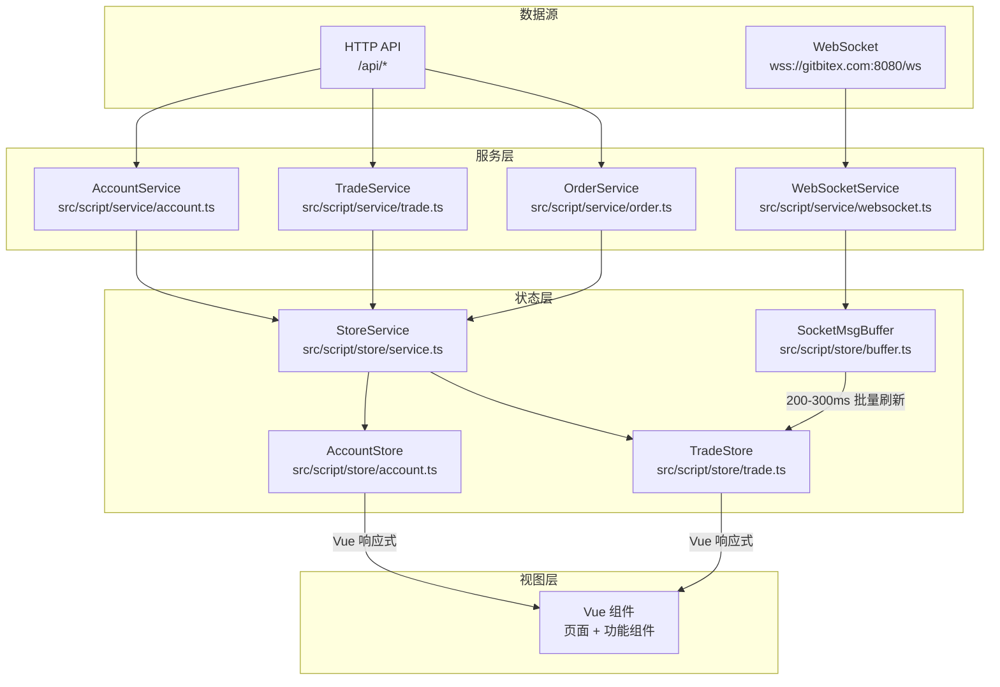
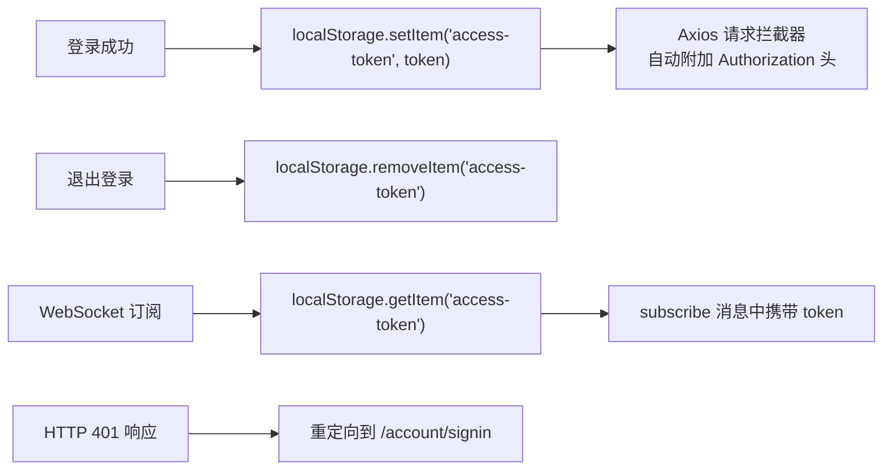
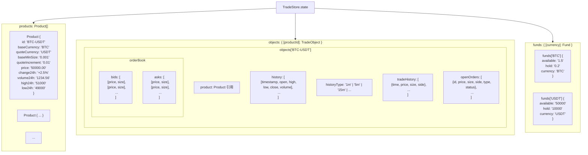
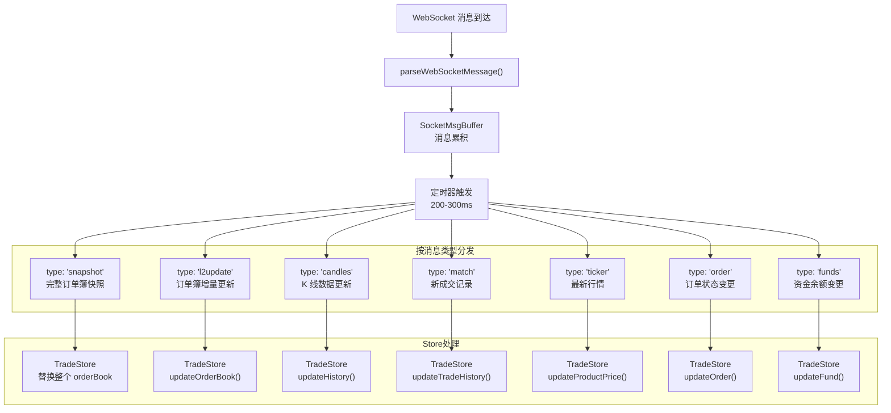
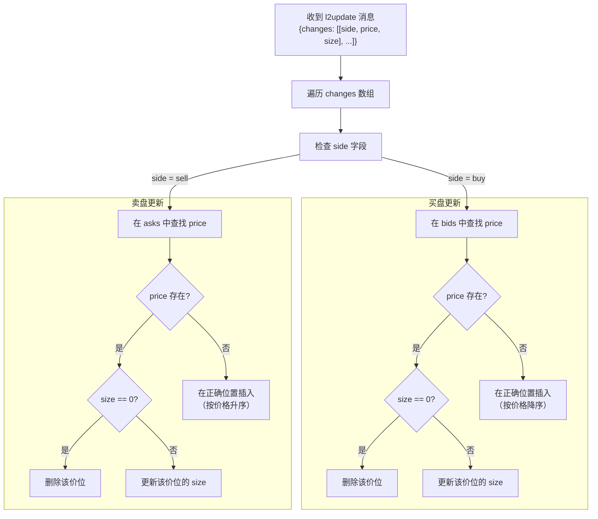
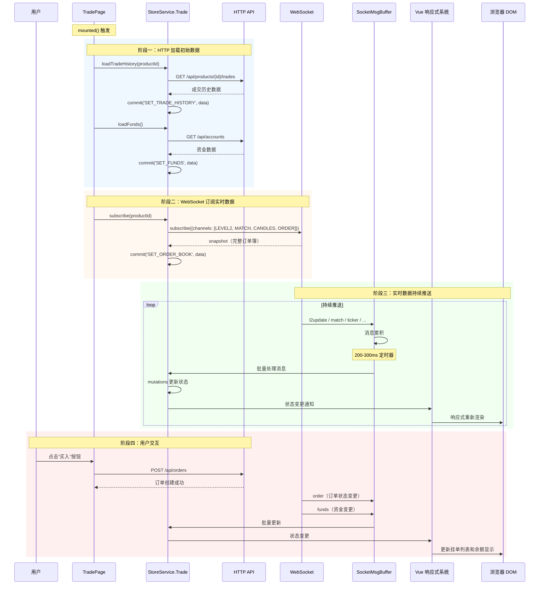

# gitbitex-web 状态管理文档

## 1. 状态管理架构概览

gitbitex-web 使用 Vuex 3.0.1 作为全局状态管理方案，通过 `StoreService` 门面模式提供统一的访问接口。状态层负责接收来自 HTTP API 和 WebSocket 的数据，并通过 Vue 的响应式系统驱动视图更新。



## 2. StoreService 门面模式

`StoreService` 定义在 `src/script/store/service.ts`，是访问所有 Store 的唯一入口。它以静态属性的形式暴露各个子 Store：

```
StoreService
├── .Account  →  AccountStore 实例
└── .Trade    →  TradeStore 实例
```

所有组件和页面通过 `StoreService.Account` 和 `StoreService.Trade` 访问状态，而不是直接引用 Vuex store。这种门面模式提供了以下好处：

- **统一访问接口**: 所有数据操作通过一个入口
- **解耦依赖**: 组件不直接依赖 Vuex store 实例
- **便于测试**: 可以轻松替换 StoreService 实现

## 3. AccountStore 详解

源文件: `src/script/store/account.ts`

### 3.1 状态结构

```typescript
state: {
    userInfo: {
        id: string;
        email: string;
        nickname: string;
        avatar: string;
    } | null;
}
```

### 3.2 方法列表

| 方法 | 类型 | 说明 |
|------|------|------|
| `current()` | 异步 | 获取当前登录用户信息，调用 `GET /api/users/self` |
| `signOut()` | 异步 | 退出登录，清除 token 和用户状态 |
| `saveAvatar(url)` | 异步 | 保存头像，调用 `PUT /api/users/self/avatar` |
| `saveNickname(name)` | 异步 | 保存昵称，调用 `PUT /api/users/self/nickname` |

### 3.3 Token 管理

认证 Token 存储在浏览器 `localStorage` 中，key 为 `access-token`：



- **登录**: 成功后将服务端返回的 token 存入 localStorage
- **请求拦截器**: `src/script/service/request.ts` 中 Axios 实例的请求拦截器自动从 localStorage 读取 token 并附加到 HTTP 请求头
- **401 处理**: 响应拦截器检测到 401 状态码时，自动重定向到登录页
- **WebSocket 认证**: 订阅消息中携带 token 字段

## 4. TradeStore 详解

源文件: `src/script/store/trade.ts`

TradeStore 是应用中最复杂的状态模块，管理所有交易相关数据。

### 4.1 状态结构



### 4.2 状态字段说明

| 字段 | 类型 | 说明 |
|------|------|------|
| `products` | `Product[]` | 所有可交易产品（交易对）列表 |
| `objects` | `{ [productId]: TradeObject }` | 按产品 ID 索引的交易数据对象 |
| `objects[id].product` | `Product` | 产品引用 |
| `objects[id].orderBook` | `{ bids, asks }` | 订单簿数据，bids(买盘)和 asks(卖盘) |
| `objects[id].history` | `Array` | K 线历史数据 |
| `objects[id].historyType` | `string` | 当前 K 线时间粒度 |
| `objects[id].tradeHistory` | `Array` | 最新成交历史 |
| `objects[id].openOrders` | `Array` | 用户当前挂单 |
| `funds` | `{ [currency]: Fund }` | 按币种索引的资金数据 |
| `funds[currency].available` | `string` | 可用余额 |
| `funds[currency].hold` | `string` | 冻结金额 |

### 4.3 数据加载方法

| 方法 | HTTP 端点 | 说明 |
|------|-----------|------|
| `loadProducts()` | `GET /api/products` | 加载所有交易对信息，初始化 objects 结构 |
| `loadProductHistory(productId, granularity)` | `GET /api/products/{id}/candles?granularity=` | 加载指定粒度的 K 线历史数据 |
| `loadTradeHistory(productId)` | `GET /api/products/{id}/trades` | 加载最新成交记录 |
| `loadOpenOrders(productId)` | `GET /api/orders?productId=&status=open` | 加载用户当前挂单 |
| `loadFunds()` | `GET /api/accounts` | 加载用户所有币种的资金信息 |

### 4.4 WebSocket 相关方法

| 方法 | 说明 |
|------|------|
| `subscribe(productId)` | 订阅指定产品的 WebSocket 频道 |
| `unsubscribe(productId)` | 取消订阅指定产品的 WebSocket 频道 |
| `updateOrderBook(productId, data)` | 更新订单簿（应用 l2update delta） |
| `updateHistory(productId, data)` | 更新 K 线数据（追加或更新最后一根） |
| `updateTradeHistory(productId, data)` | 追加新的成交记录 |
| `updateProductPrice(productId, data)` | 更新产品的最新价格和涨跌信息 |
| `updateOrder(data)` | 更新用户订单状态 |
| `updateFund(data)` | 更新用户资金余额 |

## 5. WebSocket 消息处理流程

### 5.1 消息路由

WebSocket 收到的消息通过 `parseWebSocketMessage()` 函数按类型分发到对应的 Store 方法。



### 5.2 消息类型与处理

| 消息类型 | 触发条件 | Store 方法 | 处理逻辑 |
|----------|----------|------------|----------|
| `snapshot` | 订阅 level2 后首次推送 | 替换 orderBook | 用完整数据替换当前买卖盘 |
| `l2update` | 订单簿有变化时 | `updateOrderBook()` | 增量更新买卖盘中变化的价位 |
| `candles` | K 线数据变化时 | `updateHistory()` | 更新最后一根 K 线或追加新 K 线 |
| `match` | 新成交产生时 | `updateTradeHistory()` | 在成交列表头部插入新记录 |
| `ticker` | 行情变化时 | `updateProductPrice()` | 更新产品最新价格和 24h 统计 |
| `order` | 用户订单状态变化时 | `updateOrder()` | 更新或移除挂单列表中的订单 |
| `funds` | 用户资金变化时 | `updateFund()` | 更新对应币种的可用和冻结余额 |

### 5.3 updateOrderBook 逻辑详解

订单簿的增量更新是最复杂的状态操作之一：



**关键规则：**
- `size == 0` 表示该价位已无挂单，需要从列表中移除
- 买盘 (bids) 按价格**降序**排列（最高买价在前）
- 卖盘 (asks) 按价格**升序**排列（最低卖价在前）
- 新价位需要插入到正确的排序位置

## 6. HTTP 服务层

### 6.1 Request 基础类

源文件: `src/script/service/request.ts`

- 基于 Axios 的单例封装
- Base URL: `/api`
- **请求拦截器**: 自动附加 `Authorization: Bearer {token}` 头
- **响应拦截器**: 401 状态码自动重定向到登录页 `/account/signin`

### 6.2 AccountService

源文件: `src/script/service/account.ts`

| 方法 | HTTP 方法 | 端点 | 说明 |
|------|-----------|------|------|
| `signup(email, password)` | POST | `/api/users` | 用户注册 |
| `signin(email, password)` | POST | `/api/users/sessions` | 用户登录 |
| `signOut()` | DELETE | `/api/users/sessions` | 退出登录 |
| `current()` | GET | `/api/users/self` | 获取当前用户 |
| `getFunds()` | GET | `/api/accounts` | 获取所有币种资金 |
| `getDepositAddress(currency)` | GET | `/api/accounts/{currency}/deposit-address` | 获取充值地址 |
| `postWithdrawal(currency, data)` | POST | `/api/accounts/{currency}/withdrawal` | 提交提现 |
| `getTransactions(currency)` | GET | `/api/accounts/{currency}/transactions` | 获取交易记录 |
| `changePassword(data)` | PUT | `/api/users/self/password` | 修改密码 |
| `sendEmailVerifyCode(email)` | POST | `/api/users/verify-code` | 发送邮箱验证码 |
| `resetPassword(data)` | PUT | `/api/users/password` | 重置密码 |
| `getFileUrl(fileId)` | GET | `/api/files/{id}` | 获取文件 URL |
| `saveNickname(name)` | PUT | `/api/users/self/nickname` | 保存昵称 |
| `saveAvatar(url)` | PUT | `/api/users/self/avatar` | 保存头像 |

### 6.3 TradeService

源文件: `src/script/service/trade.ts`

| 方法 | HTTP 方法 | 端点 | 说明 |
|------|-----------|------|------|
| `getProducts()` | GET | `/api/products` | 获取所有交易对 |
| `getProductHistory(productId, granularity)` | GET | `/api/products/{id}/candles?granularity=` | 获取 K 线历史 |
| `getProductTradeHistory(productId)` | GET | `/api/products/{id}/trades` | 获取成交历史 |

### 6.4 OrderService

源文件: `src/script/service/order.ts`

| 方法 | HTTP 方法 | 端点 | 说明 |
|------|-----------|------|------|
| `createOrder(data)` | POST | `/api/orders` | 创建订单 |
| `getOrders(params)` | GET | `/api/orders?page=&size=&status=` | 分页查询订单 |
| `cancelOrder(orderId)` | DELETE | `/api/orders/{id}` | 取消指定订单 |
| `cancelAll(productId)` | DELETE | `/api/orders?productId=` | 取消某产品所有订单 |

### 6.5 ServerService

源文件: `src/script/service/server.ts`

| 方法 | HTTP 方法 | 端点 | 说明 |
|------|-----------|------|------|
| `getConfig()` | GET | `/api/configs` | 获取服务器配置 |

### 6.6 FileService

源文件: `src/script/service/file.ts`

| 方法 | HTTP 方法 | 端点 | 说明 |
|------|-----------|------|------|
| `getFileUrl(fileId)` | GET | `/api/files/{id}` | 获取文件 URL |
| `upload(file)` | POST | `/api/files` | 上传文件 |

## 7. 数据流完整生命周期

以交易页面为例，展示数据从加载到更新的完整生命周期：


