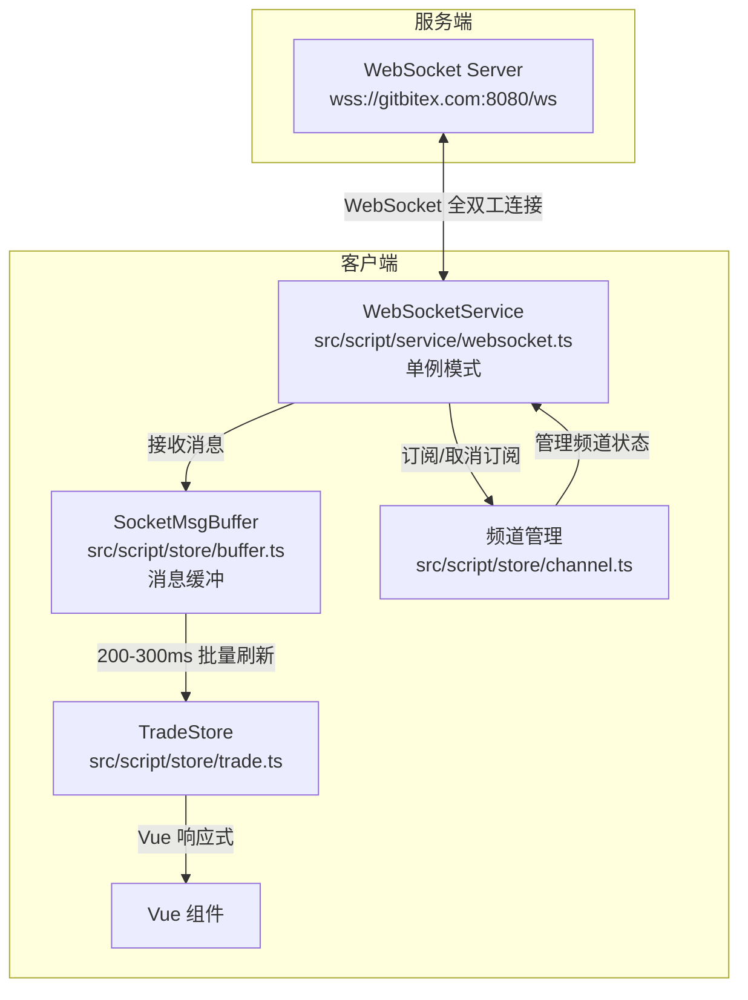
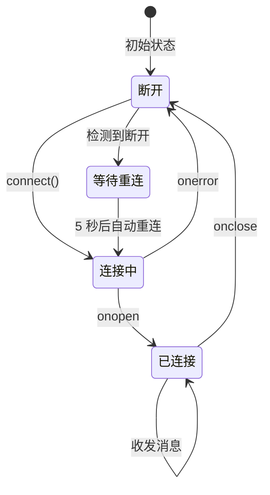
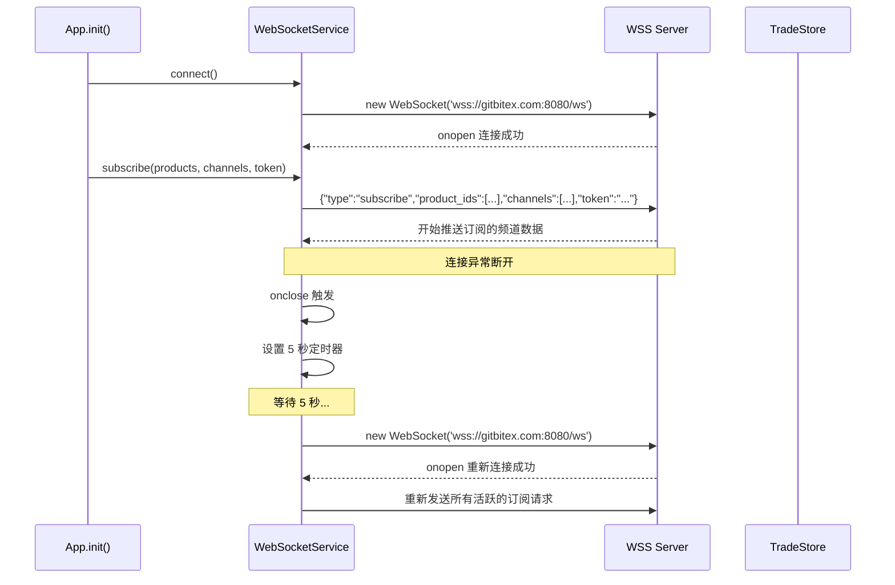
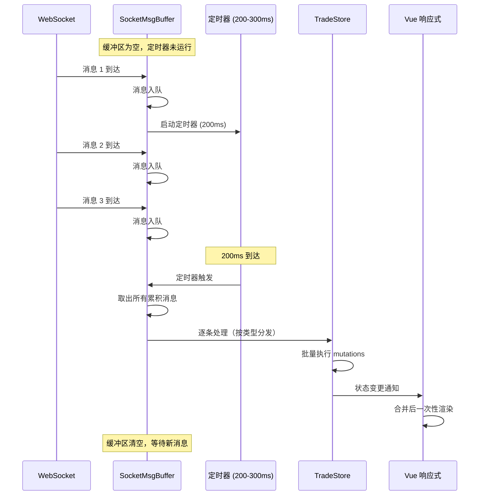
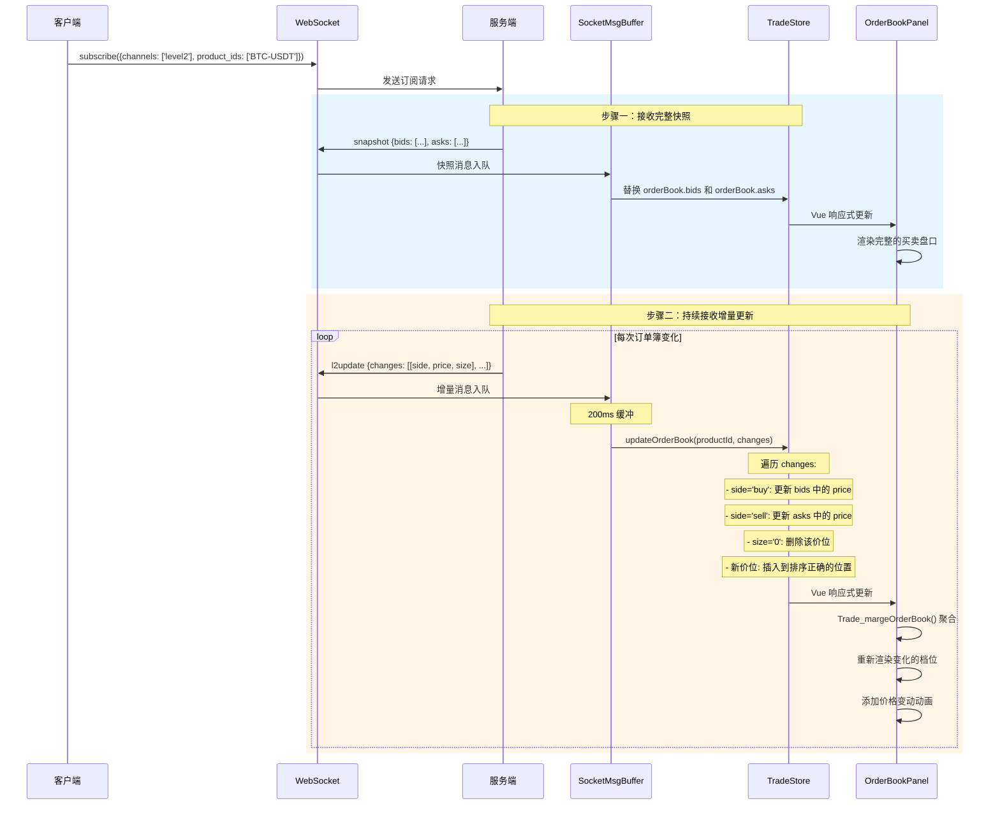
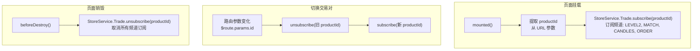

# gitbitex-web WebSocket 实时通信文档

## 1. WebSocket 连接架构

gitbitex-web 通过 WebSocket 实现与服务端的双向实时通信，用于推送行情数据、订单簿更新、成交记录、订单状态和资金变更等信息。



## 2. 连接生命周期

### 2.1 连接建立

WebSocketService 是全局单例，在应用初始化阶段由 `App.init()` 触发连接。



### 2.2 连接流程



### 2.3 自动重连机制

- **触发条件**: WebSocket 连接关闭（`onclose` 事件）或出错（`onerror` 事件）
- **重连间隔**: 5 秒
- **重连策略**: 创建新的 WebSocket 实例，连接成功后重新发送所有活跃的订阅请求
- **频道恢复**: 重连后自动恢复之前的订阅状态，无需页面组件干预

## 3. 订阅机制

### 3.1 订阅消息格式

**订阅请求 (subscribe):**

```json
{
    "type": "subscribe",
    "product_ids": ["BTC-USDT", "ETH-USDT"],
    "channels": ["level2", "match", "ticker", "candles_60"],
    "token": "eyJhbGciOiJIUzI1NiIs..."
}
```

**取消订阅请求 (unsubscribe):**

```json
{
    "type": "unsubscribe",
    "product_ids": ["BTC-USDT"],
    "channels": ["level2", "match"]
}
```

### 3.2 字段说明

| 字段 | 类型 | 说明 |
|------|------|------|
| `type` | string | 消息类型: `subscribe` 或 `unsubscribe` |
| `product_ids` | string[] | 要订阅的产品（交易对）ID 列表 |
| `channels` | string[] | 要订阅的频道列表 |
| `token` | string | 用户认证 token（可选，仅登录用户需要） |

### 3.3 可订阅频道

| 频道名 | 说明 | 推送消息类型 |
|--------|------|-------------|
| `level2` | 订单簿深度数据 | `snapshot`, `l2update` |
| `match` | 市场成交记录 | `match` |
| `ticker` | 最新行情摘要 | `ticker` |
| `candles_60` | 1 分钟 K 线 | `candles` |
| `candles_300` | 5 分钟 K 线 | `candles` |
| `candles_900` | 15 分钟 K 线 | `candles` |
| `candles_1800` | 30 分钟 K 线 | `candles` |
| `candles_3600` | 1 小时 K 线 | `candles` |
| `candles_21600` | 6 小时 K 线 | `candles` |
| `candles_86400` | 1 天 K 线 | `candles` |
| `order` | 用户订单状态 | `order` |
| `funds` | 用户资金变更 | `funds` |

### 3.4 认证频道

`order` 和 `funds` 频道是认证频道，仅对登录用户有效。订阅时必须携带有效的 `token` 字段，服务端会验证 token 并将消息推送给对应用户。

## 4. 消息类型详解

### 4.1 消息类型总览

| 消息类型 | 频道 | 触发时机 | 数据描述 |
|----------|------|----------|----------|
| `snapshot` | level2 | 首次订阅后 | 完整的订单簿快照，包含所有价位 |
| `l2update` | level2 | 订单簿变化时 | 增量更新，仅包含变化的价位 |
| `candles` | candles_* | K 线数据变化时 | 最新的 K 线数据点 |
| `match` | match | 新成交发生时 | 成交记录详情 |
| `ticker` | ticker | 行情更新时 | 最新价格、涨跌、成交量等 |
| `order` | order | 用户订单变更时 | 订单状态变更通知 |
| `funds` | funds | 用户资金变更时 | 可用/冻结余额变更 |

### 4.2 snapshot 消息

```json
{
    "type": "snapshot",
    "product_id": "BTC-USDT",
    "bids": [
        ["50000.00", "1.5"],
        ["49999.50", "0.8"],
        ...
    ],
    "asks": [
        ["50001.00", "2.0"],
        ["50001.50", "1.2"],
        ...
    ]
}
```

- **触发**: 订阅 `level2` 频道后，服务端首先推送完整的订单簿快照
- **处理**: 直接替换 `TradeStore.objects[productId].orderBook`
- **bids**: 买盘数组，按价格降序排列，每项为 `[price, size]`
- **asks**: 卖盘数组，按价格升序排列，每项为 `[price, size]`

### 4.3 l2update 消息

```json
{
    "type": "l2update",
    "product_id": "BTC-USDT",
    "changes": [
        ["buy", "50000.00", "1.8"],
        ["sell", "50001.00", "0"],
        ["buy", "49998.00", "0.5"]
    ]
}
```

- **触发**: 订单簿有任何变化时推送
- **changes**: 变更列表，每项为 `[side, price, size]`
- **side**: `"buy"` (买盘) 或 `"sell"` (卖盘)
- **size 为 "0"**: 表示删除该价位

### 4.4 candles 消息

```json
{
    "type": "candles",
    "product_id": "BTC-USDT",
    "granularity": 60,
    "time": 1638316800,
    "open": "50000.00",
    "high": "50100.00",
    "low": "49900.00",
    "close": "50050.00",
    "volume": "123.45"
}
```

- **触发**: 对应时间粒度的 K 线数据变化时
- **granularity**: 时间粒度（秒），对应订阅的频道

### 4.5 match 消息

```json
{
    "type": "match",
    "product_id": "BTC-USDT",
    "time": "2024-01-01T12:00:00.000Z",
    "price": "50000.00",
    "size": "0.1",
    "side": "buy"
}
```

- **触发**: 市场上有新成交发生时
- **side**: 吃单方向（taker side）

### 4.6 ticker 消息

```json
{
    "type": "ticker",
    "product_id": "BTC-USDT",
    "price": "50000.00",
    "open_24h": "49000.00",
    "volume_24h": "1234.56",
    "high_24h": "51000.00",
    "low_24h": "48500.00"
}
```

- **触发**: 行情数据更新时
- **用途**: 更新产品列表中的价格和 24h 统计数据

### 4.7 order 消息

```json
{
    "type": "order",
    "product_id": "BTC-USDT",
    "order_id": "abc123",
    "price": "50000.00",
    "size": "0.1",
    "filled_size": "0.05",
    "side": "buy",
    "order_type": "limit",
    "status": "open"
}
```

- **触发**: 用户订单状态发生变化时（创建、部分成交、完全成交、取消）
- **认证**: 需要有效 token，仅推送给订单所有者
- **status**: `open`(挂单中), `done`(已完成), `cancelled`(已取消)

### 4.8 funds 消息

```json
{
    "type": "funds",
    "currency": "BTC",
    "available": "1.5",
    "hold": "0.2"
}
```

- **触发**: 用户资金余额发生变化时（下单冻结、成交释放、充提等）
- **认证**: 需要有效 token，仅推送给资金所有者

## 5. SocketMsgBuffer 消息缓冲机制

源文件: `src/script/store/buffer.ts`

### 5.1 为什么需要缓冲

在行情剧烈波动时，WebSocket 可能在极短时间内推送大量消息。如果每条消息都立即触发 Vuex mutation 和 Vue 重新渲染，会导致：

- **DOM 抖动 (DOM Thrashing)**: 频繁的小量 DOM 更新导致性能下降
- **渲染阻塞**: 大量同步渲染任务阻塞浏览器主线程
- **视觉闪烁**: 用户看到不断闪烁的数字变化

### 5.2 缓冲机制原理

```mermaid
flowchart TB
    subgraph 无缓冲（问题场景）
        WS1["WS 消息 1"] --> M1["Mutation 1"] --> R1["渲染 1"]
        WS2["WS 消息 2"] --> M2["Mutation 2"] --> R2["渲染 2"]
        WS3["WS 消息 3"] --> M3["Mutation 3"] --> R3["渲染 3"]
        WS4["WS 消息 4"] --> M4["Mutation 4"] --> R4["渲染 4"]
        WS5["WS 消息 5"] --> M5["Mutation 5"] --> R5["渲染 5"]
    end

    subgraph 有缓冲（实际方案）
        WSA["WS 消息 1"] --> BufA["缓冲区累积"]
        WSB["WS 消息 2"] --> BufA
        WSC["WS 消息 3"] --> BufA
        WSD["WS 消息 4"] --> BufA
        WSE["WS 消息 5"] --> BufA
        BufA -->|"200ms 定时器触发"| Batch["批量处理 5 条消息"]
        Batch --> MBatch["合并后的 Mutation"]
        MBatch --> RBatch["一次渲染"]
    end
```

### 5.3 工作流程



### 5.4 缓冲参数

| 参数 | 值 | 说明 |
|------|-----|------|
| 刷新间隔 | 200-300ms | 定时器触发间隔 |
| 缓冲策略 | 全量累积 | 定时器周期内所有消息都会累积 |
| 消息合并 | 同类型合并 | 同一 productId 的同类消息可被后到的覆盖 |

## 6. L2 订单簿更新流程

订单簿的实时更新是 WebSocket 通信中最关键的数据流之一。



## 7. 页面级订阅管理

### 7.1 交易页面订阅

交易页面 (`src/script/page/trade/trade.ts`) 在生命周期中管理 WebSocket 订阅：



### 7.2 首页订阅

首页 (`src/script/page/home/home.ts`) 的订阅更简单：

- **挂载时**: 所有产品的 `ticker` 频道在应用初始化阶段已订阅
- **无需额外订阅**: 首页只读取 `StoreService.Trade.products` 显示价格

### 7.3 订阅频道矩阵

| 页面 | level2 | match | candles | ticker | order | funds |
|------|--------|-------|---------|--------|-------|-------|
| 首页 (HomePage) | - | - | - | 全局订阅 | - | - |
| 交易页 (TradePage) | 当前产品 | 当前产品 | 当前产品 | 全局订阅 | 已登录时 | 已登录时 |
| 钱包页 (WalletPage) | - | - | - | - | - | 已登录时 |
| 订单页 (OrderPage) | - | - | - | - | 已登录时 | - |

## 8. WebSocket 认证机制

### 8.1 认证流程

```mermaid
flowchart TB
    Login["用户登录成功"]
    SaveToken["Token 存入 localStorage"]
    Subscribe["WebSocket subscribe()"]
    ReadToken["读取 localStorage<br/>中的 access-token"]
    
    subgraph 订阅消息
        Msg["{"
        Type["  type: 'subscribe',"]
        Products["  product_ids: [...],"]
        Channels["  channels: ['order', 'funds'],"]
        Token["  token: 'eyJhbG...'"]
        End["}"]
    end

    ServerVerify["服务端验证 Token"]
    Valid{Token 有效?}
    AuthChannels["开始推送认证频道数据<br/>(order, funds)"]
    PublicOnly["仅推送公开频道数据<br/>(level2, match, ticker, candles)"]

    Login --> SaveToken
    SaveToken --> Subscribe
    Subscribe --> ReadToken
    ReadToken --> Msg
    Msg --> ServerVerify
    ServerVerify --> Valid
    Valid -->|是| AuthChannels
    Valid -->|否| PublicOnly
```

### 8.2 认证与非认证频道

| 类型 | 频道 | 是否需要 Token | 说明 |
|------|------|---------------|------|
| 公开频道 | level2, match, ticker, candles | 否 | 所有用户可见的市场数据 |
| 认证频道 | order, funds | 是 | 仅推送给 token 对应的用户 |

### 8.3 未登录用户

- 未登录用户只能接收公开频道的数据
- 订阅消息中 `token` 字段为空或不发送
- 交易页面的挂单列表和资金显示为空
- 登录后需要重新发送带 token 的订阅请求

## 9. 核心源文件索引

| 文件路径 | 职责 |
|----------|------|
| `src/script/service/websocket.ts` | WebSocket 连接管理，建立/重连/收发消息 |
| `src/script/store/buffer.ts` | SocketMsgBuffer 消息缓冲实现 |
| `src/script/store/channel.ts` | 频道订阅状态管理 |
| `src/script/store/trade.ts` | 消息处理和状态更新 |
| `src/script/store/service.ts` | StoreService 门面，暴露订阅接口 |
| `src/script/page/trade/trade.ts` | 交易页面中的订阅/取消订阅逻辑 |
| `src/script/app.ts` | 应用初始化时的全局 ticker 订阅 |
