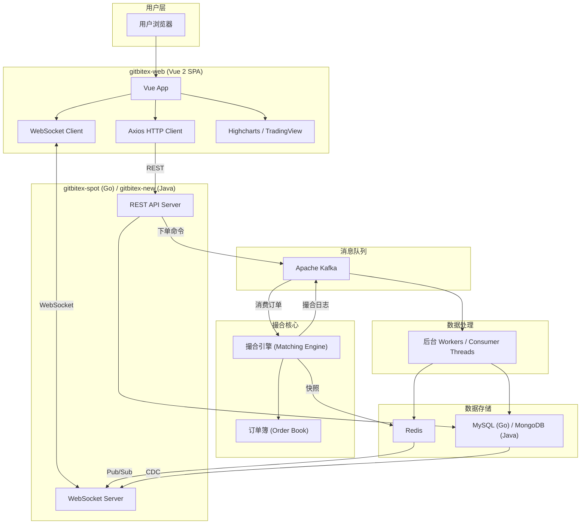
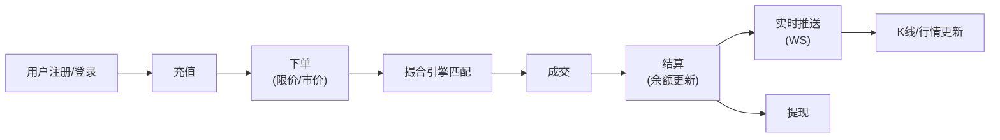

# GitBitEx CEX 交易所 — 项目总览

> 本文档提供三个子项目的全局视角，帮助开发者快速了解整个系统的定位、技术选型和项目间关系。

---

## 1. 项目背景

GitBitEx 是一个开源的中心化加密货币交易所（CEX）系统，实现了完整的现货交易功能闭环：

**用户注册 → 充值 → 下单 → 撮合 → 成交 → 结算 → 实时行情推送 → 提现**

该系统包含三个子项目，分别对应后端（两个版本）和前端：

| 项目 | 语言 | 定位 | 状态 |
|------|------|------|------|
| **gitbitex-spot** | Go | 老版本后端 | 初始实现，MySQL + Redis + Kafka |
| **gitbitex-new** | Java (Spring Boot) | 新版本后端 | 重构版，MongoDB + Redis + Kafka |
| **gitbitex-web** | TypeScript (Vue 2) | 前端 | 交易所 Web UI |

---

## 2. 系统全景架构图



---

## 3. 技术栈对比

### 3.1 后端技术栈

| 维度 | gitbitex-spot (Go) | gitbitex-new (Java) |
|------|-------------------|-------------------|
| 语言 | Go | Java 14 |
| 框架 | Gin (REST) + gorilla/websocket | Spring Boot + Spring WebSocket |
| 数据库 | MySQL | MongoDB（副本集） |
| 缓存 | Redis (go-redis) | Redis (Redisson, 200连接池) |
| 消息队列 | Kafka (sarama) | Kafka (kafka-clients) |
| 序列化 | JSON | 1字节类型头 + FastJSON + Zstandard |
| 订单簿 | TreeMap 红黑树 | TreeMap + LinkedHashMap |
| CDC | MySQL Binlog (go-mysql) | Redis Pub/Sub |
| 监控 | pprof (:6060) | Micrometer + Prometheus (:7002) |
| 部署 | 原生二进制 | Docker (JIB + OpenJDK 14) |
| 配置 | conf.json | application.properties |

### 3.2 前端技术栈

| 维度 | 技术 | 版本 |
|------|------|------|
| 框架 | Vue 2 + TypeScript | 2.5.17 / 2.9 |
| 状态管理 | Vuex | 3.0.1 |
| 路由 | Vue Router (History) | 3.0.1 |
| HTTP | Axios | 0.19.0 |
| K 线图 | Highcharts + TradingView | 7.2.0 |
| 构建 | Gulp + Webpack | 3.9.1 / 3.10.0 |
| 样式 | Bootstrap 4 + LESS | 4.3.1 |
| 实时通信 | 原生 WebSocket API | - |

---

## 4. 核心业务流程



---

## 5. 项目目录结构

```
cex/
├── docs/                    # 本文档目录
│   ├── overview.md          # 总览（本文件）
│   ├── comparison.md        # Go vs Java 详细对比
│   ├── gitbitex-spot/       # Go 版各模块文档
│   ├── gitbitex-new/        # Java 版各模块文档
│   └── gitbitex-web/        # 前端各模块文档
├── gitbitex-spot/           # Go 版源码
│   ├── main.go
│   ├── matching/            # 撮合引擎
│   ├── pushing/             # WebSocket 推送
│   ├── models/              # 数据模型 + MySQL
│   ├── service/             # 业务逻辑
│   ├── worker/              # 后台处理
│   ├── rest/                # REST API
│   ├── conf/                # 配置
│   └── utils/               # 工具
├── gitbitex-new/            # Java 版源码
│   └── src/main/java/com/gitbitex/
│       ├── matchingengine/  # 撮合引擎
│       ├── marketdata/      # 行情数据
│       ├── openapi/         # REST API
│       ├── feed/            # WebSocket 推送
│       ├── wallet/          # 钱包
│       ├── enums/           # 枚举
│       └── stripexecutor/   # 条带化执行器
└── gitbitex-web/            # 前端源码
    └── src/
        ├── script/
        │   ├── service/     # HTTP/WS 服务
        │   ├── store/       # Vuex 状态
        │   ├── chart/       # 图表配置
        │   ├── component/   # Vue 组件
        │   └── page/        # 页面路由
        └── style/           # LESS 样式
```

---

## 6. 文档导航

| 文档 | 说明 |
|------|------|
| **总览** | |
| [overview.md](./overview.md) | 本文件 — 全局概览 |
| [comparison.md](./comparison.md) | Go 版 vs Java 版详细技术对比 |
| **gitbitex-spot (Go 版)** | |
| [architecture.md](./gitbitex-spot/architecture.md) | 项目背景、整体架构、启动流程 |
| [matching-engine.md](./gitbitex-spot/matching-engine.md) | 撮合引擎核心算法与实现 |
| [order-book.md](./gitbitex-spot/order-book.md) | 订单簿数据结构与操作 |
| [kafka-messaging.md](./gitbitex-spot/kafka-messaging.md) | Kafka 消息流设计 |
| [data-model.md](./gitbitex-spot/data-model.md) | MySQL 数据模型与 ER 图 |
| [rest-api.md](./gitbitex-spot/rest-api.md) | REST API 接口文档 |
| [websocket.md](./gitbitex-spot/websocket.md) | WebSocket 推送系统 |
| [workers.md](./gitbitex-spot/workers.md) | Worker 处理管线 |
| **gitbitex-new (Java 版)** | |
| [architecture.md](./gitbitex-new/architecture.md) | 项目背景、整体架构、启动流程 |
| [matching-engine.md](./gitbitex-new/matching-engine.md) | 撮合引擎核心算法与实现 |
| [order-book.md](./gitbitex-new/order-book.md) | 订单簿数据结构与操作 |
| [kafka-messaging.md](./gitbitex-new/kafka-messaging.md) | Kafka 命令/消息双 Topic 架构 |
| [data-model.md](./gitbitex-new/data-model.md) | MongoDB 数据模型 |
| [rest-api.md](./gitbitex-new/rest-api.md) | REST API 接口文档 |
| [websocket.md](./gitbitex-new/websocket.md) | WebSocket Feed 系统 |
| [market-data.md](./gitbitex-new/market-data.md) | 行情数据管线 |
| **gitbitex-web (前端)** | |
| [architecture.md](./gitbitex-web/architecture.md) | 项目背景、整体架构、构建系统 |
| [components.md](./gitbitex-web/components.md) | Vue 组件体系 |
| [state-management.md](./gitbitex-web/state-management.md) | Vuex 状态管理 |
| [websocket.md](./gitbitex-web/websocket.md) | WebSocket 实时通信 |
| [charts.md](./gitbitex-web/charts.md) | 图表系统（K 线、深度图） |
