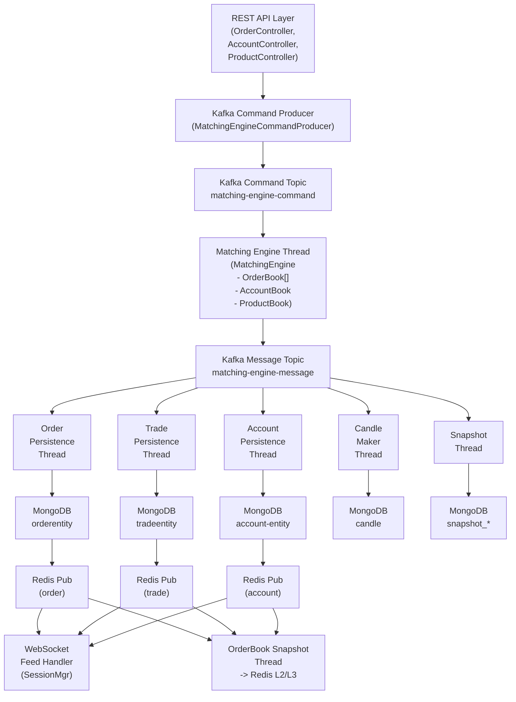
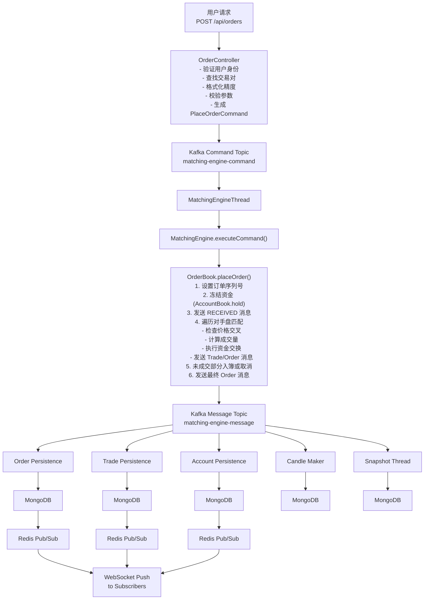
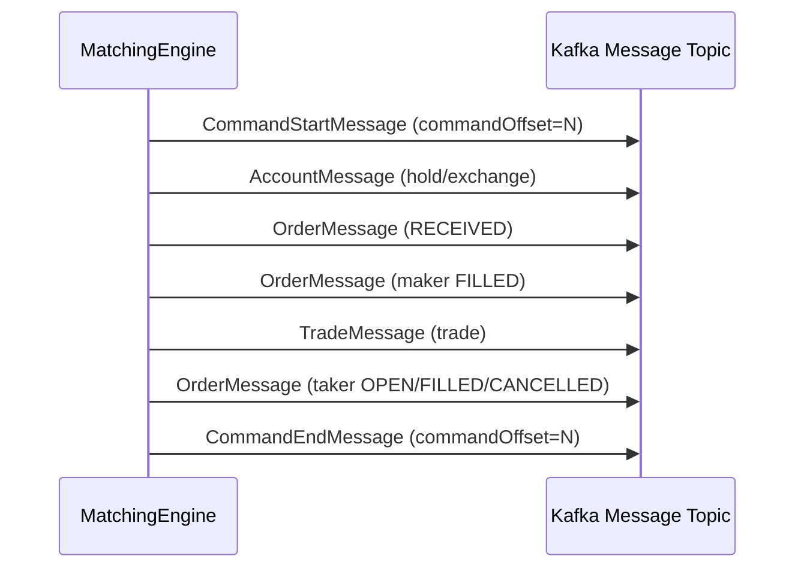

# GitBitEx 系统架构文档

## 1. 系统总览

GitBitEx 是一个基于 Spring Boot 构建的加密货币交易所系统，采用事件驱动架构，核心设计理念是将撮合引擎的计算过程完全放在内存中执行，通过 Kafka 实现命令的有序分发和状态变更的可靠传播，通过 MongoDB 实现持久化存储，通过 Redis 实现实时数据的缓存与推送。

### 1.1 技术栈

| 层次 | 技术选型 | 版本 | 用途 |
|------|----------|------|------|
| 运行时 | Java | 17 | 主语言 |
| 框架 | Spring Boot | 2.6.4 | 应用框架 |
| 消息队列 | Apache Kafka | 3.4.0 (KRaft) | 命令分发与事件传播 |
| 数据库 | MongoDB | 5.0 (Replica Set) | 持久化存储与快照 |
| 缓存 | Redis | 7.0 | 订单簿快照缓存与实时推送 |
| 构建工具 | Maven | - | 依赖管理与构建 |
| JSON | FastJSON | - | 高性能 JSON 序列化 |
| Redis客户端 | Redisson | - | 分布式数据结构与发布订阅 |
| 监控 | Micrometer + Prometheus | - | 指标采集与暴露 |

### 1.2 设计原则

- **内存优先**: 撮合引擎的所有状态（订单簿、账户余额）完全驻留内存，避免磁盘 I/O 瓶颈
- **事件溯源**: 所有状态变更以事件形式写入 Kafka，下游消费者通过重放事件恢复状态
- **命令-事件分离**: 写入请求以 Command 形式进入系统，状态变更以 Message 形式输出
- **最终一致性**: 持久化层通过异步消费 Kafka 消息实现，与撮合引擎解耦
- **容错恢复**: 通过快照+事件重放机制实现撮合引擎的崩溃恢复

---

## 2. 整体架构图



---

## 3. 核心模块划分

### 3.1 撮合引擎模块 (matchingengine)

撮合引擎是整个交易所的心脏，负责处理所有交易命令并产生状态变更事件。

**核心类:**

| 类名 | 职责 |
|------|------|
| `MatchingEngine` | 引擎主类，接收并分派命令，管理所有 OrderBook |
| `MatchingEngineThread` | Kafka 消费者线程，从 command topic 消费命令并交给引擎执行 |
| `MatchingEngineLoader` | 引擎预加载器，每分钟从快照恢复一个新引擎实例备用 |
| `OrderBook` | 单个交易对的订单簿，实现撮合逻辑 |
| `AccountBook` | 全局账户簿，管理用户资金冻结与划转 |
| `ProductBook` | 交易对管理器 |
| `MessageSender` | 将引擎产生的消息发送到 Kafka message topic |

**命令类型 (CommandType):**

| 命令 | 字节标识 | 说明 |
|------|---------|------|
| `PLACE_ORDER` | 0x01 | 下单 |
| `CANCEL_ORDER` | 0x02 | 撤单 |
| `DEPOSIT` | 0x03 | 充值 |
| `WITHDRAWAL` | 0x04 | 提现 |
| `PUT_PRODUCT` | 0x05 | 添加/更新交易对 |

**消息类型 (MessageType):**

| 消息 | 字节标识 | 说明 |
|------|---------|------|
| `ACCOUNT` | 0x01 | 账户余额变更 |
| `PRODUCT` | 0x02 | 交易对变更 |
| `ORDER` | 0x03 | 订单状态变更 |
| `TRADE` | 0x04 | 成交 |
| `COMMAND_START` | 0x05 | 命令开始处理 |
| `COMMAND_END` | 0x06 | 命令处理完毕 |

### 3.2 订单簿模块

订单簿采用内存数据结构实现，核心是两棵 TreeMap（买盘和卖盘），按价格排序。

- `Depth`: 继承自 `TreeMap<BigDecimal, PriceGroupedOrderCollection>`，卖盘使用自然序（价格从低到高），买盘使用逆序（价格从高到低）
- `PriceGroupedOrderCollection`: 继承自 `LinkedHashMap<String, Order>`，同一价格的订单按插入顺序排列（即时间优先）
- `Order`: 订单对象，包含 remainingSize/remainingFunds 实现部分成交跟踪

### 3.3 行情系统模块 (marketdata)

行情系统由多个独立的 Kafka 消费者线程组成，各自消费 message topic 中的消息并完成不同职责。

| 线程 | 职责 | Consumer Group |
|------|------|---------------|
| `OrderPersistenceThread` | 订单持久化到 MongoDB + Redis 发布 | Order |
| `TradePersistenceThread` | 成交记录持久化到 MongoDB + Redis 发布 | Trade1 |
| `AccountPersistenceThread` | 账户余额持久化到 MongoDB + Redis 发布 | Account |
| `CandleMakerThread` | 根据成交生成 K 线数据 | CandlerMaker |
| `TickerThread` | 更新行情 Ticker（24h/30d 统计） | Ticker |
| `MatchingEngineSnapshotThread` | 引擎状态快照持久化 | EngineSnapshot |
| `OrderBookSnapshotThread` | 订单簿 L2 快照写入 Redis | OrderBookSnapshot |

### 3.4 API 层

REST API 基于 Spring MVC 构建，主要控制器：

| 控制器 | 路径前缀 | 功能 |
|--------|---------|------|
| `OrderController` | `/api/orders` | 下单、撤单、查询订单 |
| `AccountController` | `/api/accounts` | 查询账户余额 |
| `ProductController` | `/api/products` | 查询交易对信息 |
| `AdminController` | - | 管理端操作 |
| `UserController` | - | 用户注册、登录 |

### 3.5 WebSocket 层

WebSocket 基于 Spring WebSocket 框架实现，通过 `FeedTextWebSocketHandler` 处理连接。

**支持的频道 (Channel):**

| 频道 | 格式 | 功能 |
|------|------|------|
| `level2` | `{productId}.level2` | L2 订单簿变更（价格聚合） |
| `ticker` | `{productId}.ticker` | 行情 Ticker 更新 |
| `match` | `{productId}.match` | 成交推送 |
| `order` | `{userId}.{productId}.order` | 用户订单状态变更 |
| `funds` | `{userId}.{currency}.funds` | 用户资金变更 |

**WebSocket 推送机制:**
1. 持久化线程将消息写入 MongoDB 后，同时通过 Redis Pub/Sub 发布通知
2. WebSocket 层订阅 Redis Topic（order/trade/account/l2_batch），收到通知后通过 `SessionManager` 向已订阅的客户端推送
3. L2 订单簿采用增量推送策略：首次订阅发送完整快照，后续只发送差量变更（diff 算法）
4. `StripedExecutorService` 保证同一 session 的消息发送有序

---

## 4. 数据流架构

### 4.1 从下单到成交的完整链路



### 4.2 命令处理的事务边界

每个命令的处理被 `CommandStartMessage` 和 `CommandEndMessage` 包裹，形成逻辑事务边界：



快照线程利用这个边界来确保快照的原子性：只在 `CommandEndMessage` 到达时保存快照，保证不会在命令执行的中间状态进行快照。

---

## 5. Kafka 消息流设计

### 5.1 Command Topic (`matching-engine-command`)

**用途:** 承载所有改变系统状态的命令，是撮合引擎的唯一输入源。

**特性:**
- 单 Partition 设计，保证命令的全局有序性
- 消费者组 `MatchingEngine`，只有一个活跃消费者
- 使用 `CommandSerializer`/`CommandDeserializer`，首字节标识命令类型，后续为 JSON 载荷
- 压缩算法: zstd
- 幂等生产者 (`enable.idempotence=true`)，防止消息重复
- ACK 策略: `all`，确保消息持久化

**生产者:** `MatchingEngineCommandProducer`，由 REST API 层调用
**消费者:** `MatchingEngineThread`，消费后交给 `MatchingEngine.executeCommand()` 处理

### 5.2 Message Topic (`matching-engine-message`)

**用途:** 承载撮合引擎产生的所有状态变更事件，是系统的唯一真相来源 (Single Source of Truth)。

**特性:**
- 单 Partition 设计，保证消息的全局有序性
- 每条消息携带全局递增的 `sequence` 号，消费者可检测并拒绝乱序消息
- 多个消费者组独立消费：Order, Trade1, Account, CandlerMaker, Ticker, EngineSnapshot, OrderBookSnapshot
- 使用 `MessageSerializer`/`MessageDeserializer`，首字节标识消息类型

**生产者:** `MessageSender`，由撮合引擎内部调用
**生产者配置优化:**
- `linger.ms=100`: 批量发送，减少网络往返
- `batch.size=32768`: 增大批次大小
- `compression.type=zstd`: 高效压缩
- `max.in.flight.requests.per.connection=5`: 配合幂等保证有序性

---

## 6. 快照与恢复机制

### 6.1 快照设计

快照机制是保证撮合引擎可恢复性的关键。系统在 MongoDB 中维护四个快照集合：

| 集合 | 存储内容 |
|------|---------|
| `snapshot_engine` | 引擎全局状态（命令偏移、消息序列号、各交易对序列号） |
| `snapshot_account` | 所有用户的账户余额快照 |
| `snapshot_order` | 所有在订单簿中的活跃订单（仅 OPEN 状态） |
| `snapshot_product` | 所有交易对配置 |

### 6.2 快照流程

`MatchingEngineSnapshotThread` 消费 message topic，在每个 `CommandEndMessage` 到达时触发快照保存：

1. 累积自上次快照以来的所有变更（账户、订单、产品）
2. 收到 `CommandEndMessage` 时，记录当前 `commandOffset`
3. 在 MongoDB 事务中原子性写入所有变更
4. 非 OPEN 状态的订单从快照中删除（`DeleteOneModel`），OPEN 状态的订单 upsert
5. 清空累积缓冲区

### 6.3 恢复流程

`MatchingEngineLoader` 每分钟创建一个新的 `MatchingEngine` 实例，恢复步骤：

1. 从 `snapshot_engine` 读取 `EngineState`
2. 恢复 `messageSequence`（全局消息序列号）
3. 恢复 `startupCommandOffset`（记录到哪个命令已处理）
4. 从 `snapshot_product` 恢复所有交易对到 `ProductBook`
5. 从 `snapshot_account` 恢复所有账户到 `AccountBook`
6. 为每个交易对创建 `OrderBook`，恢复各自的序列号
7. 从 `snapshot_order` 按 sequence 升序恢复所有活跃订单

当 `MatchingEngineThread` 被分配 Kafka 分区时：
1. 从 `MatchingEngineLoader` 获取已预加载的引擎实例
2. 将 Kafka 消费者 seek 到 `startupCommandOffset + 1`，从快照之后的命令开始重放
3. 开始正常消费处理命令

### 6.4 MongoDB 快照一致性读

快照恢复使用 MongoDB 的 **Snapshot Read Concern**：

```java
ClientSessionOptions.builder().snapshot(true).build()
```

这保证在恢复过程中读取到的是同一个时间点的一致性快照，不会看到部分写入的数据。

---

## 7. 性能设计要点

### 7.1 内存撮合

撮合引擎的核心数据结构完全驻留内存：

- `OrderBook`: 每个交易对一个，包含 `asks`（卖盘 TreeMap）和 `bids`（买盘 TreeMap）
- `AccountBook`: 全局账户簿，使用嵌套 `HashMap<userId, HashMap<currency, Account>>`
- `ProductBook`: 交易对映射，`HashMap<productId, Product>`

TreeMap 保证价格排序的 O(log n) 复杂度，LinkedHashMap 保证同价格订单的 O(1) 查找和插入顺序遍历。

### 7.2 条纹执行器 (StripedExecutorService)

WebSocket 消息推送使用 `StripedExecutorService`，其设计原理是：

- 按 session ID 做条纹化分组
- 同一 session 的消息保证串行发送，避免消息乱序
- 不同 session 的消息并行发送，提高吞吐量
- 线程数 = CPU 核数 (`Runtime.getRuntime().availableProcessors()`)

```java
messageSenderExecutor.execute(sessionId, () -> {
    // 同一 sessionId 的任务串行执行
    doSendJson(session, message);
});
```

### 7.3 序列化优化

Command 和 Message 的 Kafka 序列化采用"类型字节 + JSON"格式：

```
[1 byte: type] [N bytes: JSON payload]
```

- 首字节是类型标识（枚举的 byte 值），用于快速路由反序列化类
- JSON 载荷使用 FastJSON 的 `toJSONBytes()` 直接生成字节数组，避免中间字符串开销
- Kafka 生产者启用 zstd 压缩，进一步减小传输体积

### 7.4 批量持久化

所有持久化线程采用批量写入策略：

```java
// 从 Kafka 批量拉取消息（max.poll.records=2000）
var records = consumer.poll(Duration.ofSeconds(5));

// 在内存中按 ID 去重合并
Map<String, OrderEntity> orders = new HashMap<>();
records.forEach(x -> {
    orders.put(orderEntity.getId(), orderEntity);  // 同一订单只保留最新状态
});

// 批量写入 MongoDB（bulkWrite + unordered）
orderManager.saveAll(orders.values());
```

MongoDB 的 `BulkWriteOptions.ordered(false)` 允许无序批量执行，最大化写入并发度。

### 7.5 消息序列号

系统使用全局递增的 `messageSequence`（`AtomicLong`）保证消息有序：

- 撮合引擎在每次发送消息时递增序列号
- 下游消费者检查序列号连续性，检测到跳号则抛异常
- 快照恢复时从 `EngineState.messageSequence` 恢复，保证重启后序列号不回退

---

## 8. 安全设计

### 8.1 用户认证

用户模型 (`User`) 支持以下认证机制：

- **密码认证**: 使用 `passwordHash` + `passwordSalt` 存储，不存储明文密码
- **两步验证 (2FA)**: `twoStepVerificationType` 标识验证类型，`gotpSecret` 存储 GOTP 密钥

### 8.2 API Key 认证

系统通过 `AppEntity` 支持 API Key 机制：

- `accessKey`: 公钥，随请求发送用于识别身份
- `secretKey`: 私钥，用于请求签名
- 每个 App 关联一个 `userId`

### 8.3 WebSocket 认证

WebSocket 连接通过 `AuthHandshakeInterceptor` 在握手阶段进行认证：
- 认证通过后将 `CURRENT_USER_ID` 存入 session attributes
- 后续订阅 `order` 和 `funds` 等私有频道时检查用户身份

### 8.4 REST API 认证

REST API 通过 `@RequestAttribute User currentUser` 获取当前用户：
- 未认证用户请求需要认证的接口时返回 `401 UNAUTHORIZED`
- 撤单等操作会校验订单所有权，防止越权操作

---

## 9. 部署架构

### 9.1 Docker Compose 组件

```yaml
services:
  redis:          # Redis 7.0 Alpine, 端口 6379
  mongo1:         # MongoDB 5.0, Replica Set 节点 1, 端口 30001
  mongo2:         # MongoDB 5.0, Replica Set 节点 2, 端口 30002
  mongo3:         # MongoDB 5.0, Replica Set 节点 3, 端口 30003
  mongo-express:  # MongoDB 管理界面, 端口 8082
  kafka:          # Kafka 3.4.0 (KRaft 模式), 端口 19092
```

### 9.2 MongoDB Replica Set

MongoDB 使用三节点副本集 (`my-replica-set`)，这是系统的硬性要求：

- **原因 1**: 快照保存使用 MongoDB 事务 (`session.startTransaction()`)，事务要求副本集
- **原因 2**: 快照恢复使用 Snapshot Read Concern，也要求副本集
- 通过 healthcheck 脚本自动初始化副本集配置

### 9.3 Kafka KRaft 模式

Kafka 采用 KRaft (Kafka Raft) 模式部署，无需 ZooKeeper：

- 单节点同时担任 broker 和 controller 角色
- `KAFKA_CFG_PROCESS_ROLES=broker,controller`
- 适用于开发和小规模部署

### 9.4 应用层线程模型

应用启动时 (`Bootstrap.init()`) 创建以下线程：

```
MatchingEngine Thread (1)          -- 消费 command topic
OrderPersistenceThread (1)         -- 消费 message topic
TradePersistenceThread (1)         -- 消费 message topic
AccountPersistenceThread (1)       -- 消费 message topic
CandleMakerThread (1)              -- 消费 message topic
TickerThread (1)                   -- 消费 message topic
MatchingEngineSnapshotThread (1)   -- 消费 message topic
OrderBookSnapshotThread (1)        -- 消费 message topic
MatchingEngineLoader (定时)         -- 每分钟预加载引擎
ScheduledExecutorService (8 线程)   -- 线程异常后延迟重启
```

### 9.5 线程容错机制

每个线程都设置了 `UncaughtExceptionHandler`，当线程因异常崩溃时：
1. 记录错误日志
2. 通过 `ScheduledExecutorService` 延迟 3 秒启动一个新的同类型线程
3. 新线程从 Kafka 的 last committed offset 继续消费

```java
thread.setUncaughtExceptionHandler((t, ex) -> {
    logger.error("Thread {} triggered an uncaught exception, restarting in 3s", t.getName());
    executor.schedule(() -> startXxxThread(1), 3, TimeUnit.SECONDS);
});
```

### 9.6 应用端口

| 服务 | 端口 | 说明 |
|------|------|------|
| 应用主服务 | 80 | REST API + WebSocket |
| 管理端口 | 7002 | Actuator (health/metrics/prometheus) |
| Redis | 6379 | 缓存与发布订阅 |
| MongoDB | 30001-30003 | 三节点副本集 |
| Kafka | 19092 | 消息队列 |
| Mongo Express | 8082 | MongoDB 管理界面 |

---

## 10. 扩展性分析

### 10.1 水平扩展限制

当前架构的撮合引擎采用单线程消费 Kafka Command Topic 的方式，所有交易对的命令在同一线程中串行处理。这意味着：

- 撮合引擎是系统的单点，不能水平扩展
- 所有交易对共享同一个命令队列

### 10.2 可能的扩展方向

- **按交易对分区**: 将 Command Topic 按 productId 分区，每个分区由一个独立的撮合引擎消费
- **读写分离**: 当前 Message Topic 已经支持多消费者组并行消费，读侧天然支持水平扩展
- **持久化线程扩展**: 各持久化线程已经是独立的消费者组，可以通过增加 Topic 分区数和消费者数来扩展

### 10.3 监控集成

系统通过 Micrometer 暴露 Prometheus 指标：

- `gbe.matching-engine.command.processed`: 命令处理计数器
- Spring Boot Actuator 端点: `/actuator/health`, `/actuator/metrics`, `/actuator/prometheus`
