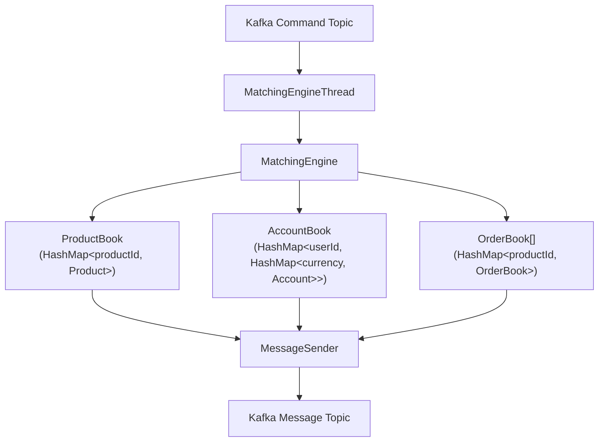
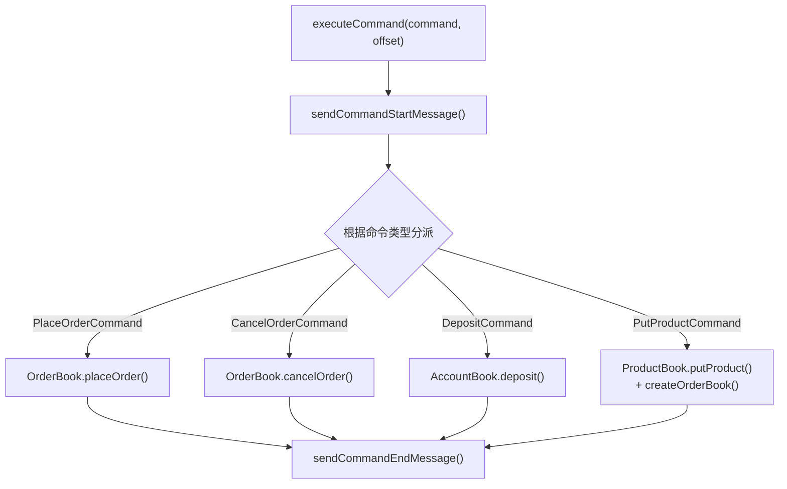
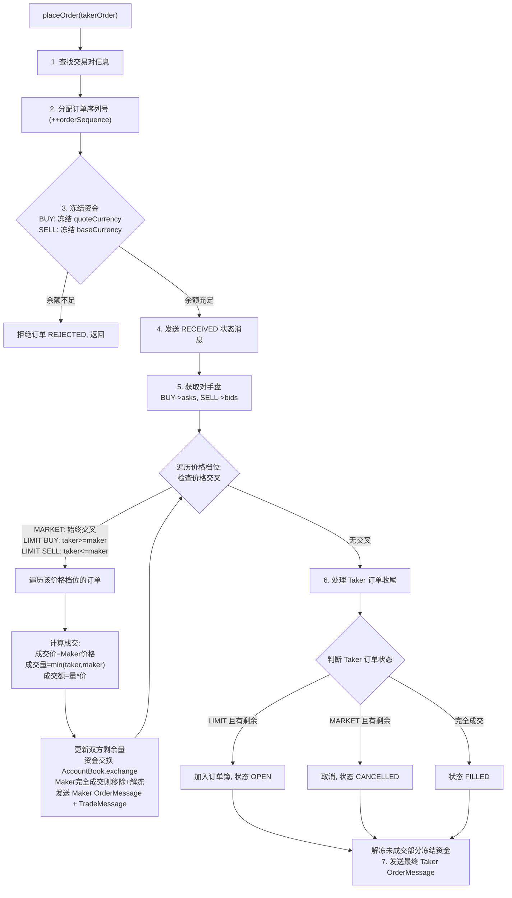
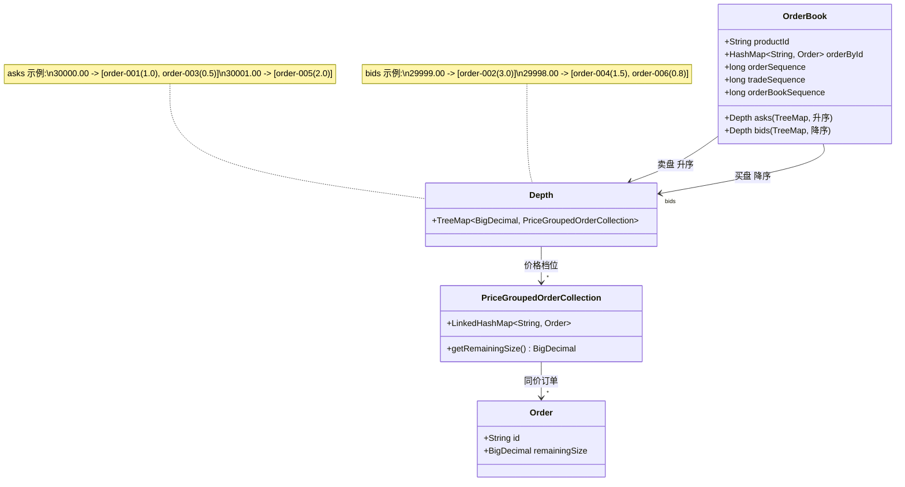
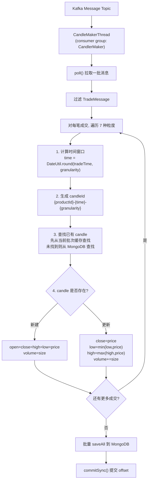
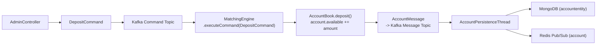
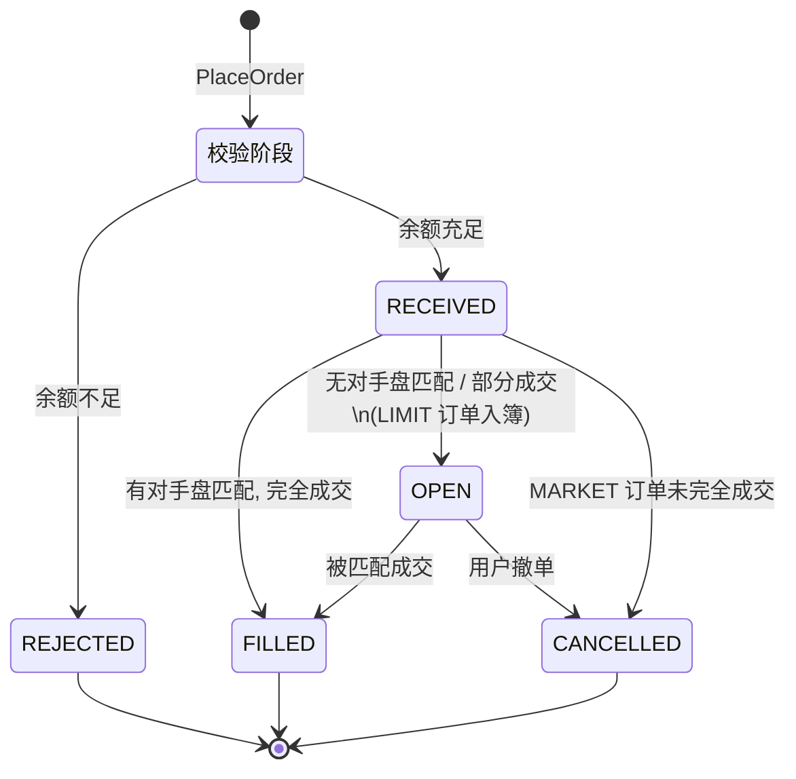
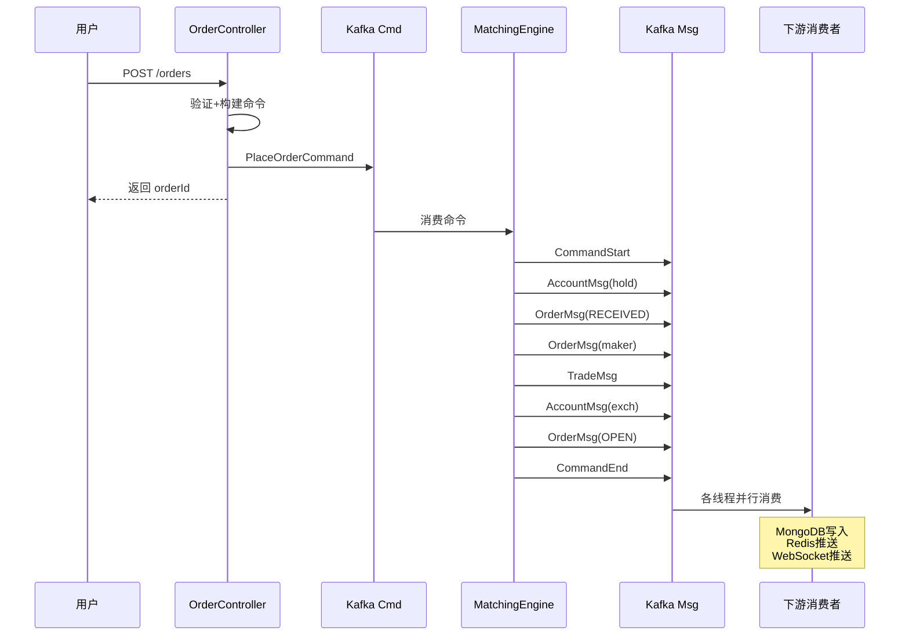
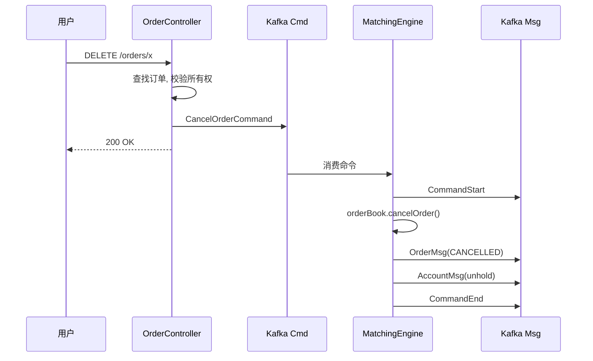

# GitBitEx 核心业务文档

## 1. 撮合引擎

### 1.1 架构设计

撮合引擎是交易所的核心组件，采用经典的 CQRS（命令查询职责分离）+ 事件溯源架构。



**关键设计决策:**

1. **单线程命令处理**: 所有命令在同一线程中串行执行，消除并发竞争，无需加锁
2. **全内存状态**: 订单簿、账户余额完全在内存中，零磁盘I/O
3. **Command-Message 分离**: 输入是 Command（意图），输出是 Message（事实），实现读写解耦
4. **预加载恢复**: `MatchingEngineLoader` 每分钟从快照预构建引擎实例，分区再平衡时直接使用

### 1.2 命令处理流程

`MatchingEngine.executeCommand()` 是所有命令的入口：



每条命令的处理被 `CommandStartMessage` 和 `CommandEndMessage` 包裹，为下游快照线程提供事务边界。快照线程在 `CommandStartMessage` 时将 `commandOffset` 设为 null，在 `CommandEndMessage` 时设置为当前 offset 并触发保存。若在命令执行中途崩溃，由于 `commandOffset` 为 null，恢复时将从上一个成功的命令之后开始重放。

### 1.3 订单匹配算法

撮合引擎实现了标准的**价格优先-时间优先 (Price-Time Priority)** 连续竞价撮合算法。

#### 1.3.1 价格优先

- 卖盘 (asks): 按价格**升序**排列 (`Comparator.naturalOrder()`)，最低卖价优先成交
- 买盘 (bids): 按价格**降序**排列 (`Comparator.reverseOrder()`)，最高买价优先成交
- 价格交叉判定：买单价格 >= 卖盘最优价，或卖单价格 <= 买盘最优价

#### 1.3.2 时间优先

同一价格档位的订单使用 `LinkedHashMap` (即 `PriceGroupedOrderCollection`)，按插入顺序遍历，先进入订单簿的订单先被匹配。

#### 1.3.3 撮合核心代码逻辑



### 1.4 限价单处理逻辑

限价单 (LIMIT Order) 指定了价格和数量：

**下单时资金计算:**
```java
funds = size * price  // 限价买单：冻结金额 = 数量 * 价格
```

**买入限价单 (LIMIT BUY):**
1. 冻结 `quoteCurrency` 的 `remainingFunds` (= size * price)
2. 匹配卖盘中价格 <= 买入价的订单
3. 成交后：买家得到 baseCurrency，从 hold 中扣除 quoteCurrency
4. 未成交部分进入买盘等待，状态变为 OPEN

**卖出限价单 (LIMIT SELL):**
1. 冻结 `baseCurrency` 的 `remainingSize`
2. 匹配买盘中价格 >= 卖出价的订单
3. 成交后：卖家得到 quoteCurrency，从 hold 中扣除 baseCurrency
4. 未成交部分进入卖盘等待，状态变为 OPEN

### 1.5 市价单处理逻辑

市价单 (MARKET Order) 不指定价格，以最优价格立即成交。

**市价买单 (MARKET BUY):**
- 不指定数量，只指定金额 (`funds`)
- 冻结 `quoteCurrency` 的 `funds`
- 计算 takerSize 时使用 Maker 价格：`takerSize = remainingFunds / makerPrice`
- 精度截断：`RoundingMode.DOWN`，向下取整防止超额成交
- 未花完的 funds 在匹配结束后解冻

**市价卖单 (MARKET SELL):**
- 指定数量 (`size`)，不指定价格
- 冻结 `baseCurrency` 的 `size`
- 直接用 `remainingSize` 与 Maker 匹配

**市价单的特殊规则:**
- 市价单**永远不会进入订单簿**
- 如果没有完全成交，剩余部分被取消（状态 CANCELLED），而非像限价单那样挂在订单簿中
- 价格交叉检查始终返回 true（`isPriceCrossed` 对 MARKET 类型直接返回 true）

### 1.6 成交价格规则

成交价格始终使用 **Maker 方的价格**：

```java
BigDecimal price = makerOrder.getPrice();
```

这是交易所的标准规则：
- Maker（挂单方）提供了流动性，其委托价格作为成交价
- Taker（吃单方）接受 Maker 的报价

对于限价买单 taker，若买入价 30100 而卖盘最优价 30000，则以 30000 成交，taker 获得价格改善。

---

## 2. 订单簿

### 2.1 数据结构设计

订单簿是撮合引擎的核心数据结构，每个交易对维护一个 `OrderBook` 实例。



### 2.2 Depth (深度)

`Depth` 继承自 `TreeMap<BigDecimal, PriceGroupedOrderCollection>`，是价格到同价订单集合的有序映射。

```java
public class Depth extends TreeMap<BigDecimal, PriceGroupedOrderCollection> {
    // 卖盘: new Depth(Comparator.naturalOrder())   -- 价格升序
    // 买盘: new Depth(Comparator.reverseOrder())   -- 价格降序
}
```

**关键操作:**

| 操作 | 方法 | 复杂度 | 说明 |
|------|------|--------|------|
| 添加订单 | `addOrder(order)` | O(log n) | 按价格找到或创建档位，追加订单 |
| 移除订单 | `removeOrder(order)` | O(log n) | 从对应价格档位移除，档位空则删除 |
| 遍历最优价 | `entrySet().iterator()` | O(1) | TreeMap 迭代器从最优价开始 |

### 2.3 PriceGroupedOrderCollection (同价订单集合)

`PriceGroupedOrderCollection` 继承自 `LinkedHashMap<String, Order>`，管理同一价格档位的所有订单。

```java
public class PriceGroupedOrderCollection extends LinkedHashMap<String, Order> {
    public BigDecimal getRemainingSize() {
        return values().stream()
                .map(Order::getRemainingSize)
                .reduce(BigDecimal::add)
                .get();
    }
}
```

**选择 LinkedHashMap 的原因:**
- **保持插入顺序**: 实现时间优先原则，先挂单的先匹配
- **O(1) 随机访问**: 通过订单ID快速删除已成交/已取消的订单
- **顺序遍历**: 撮合时按插入顺序遍历同价订单

### 2.4 买卖盘维护

**订单入簿 (addOrder):**
```java
public void addOrder(Order order) {
    var depth = order.getSide() == OrderSide.BUY ? bids : asks;
    depth.addOrder(order);          // 加入对应 Depth
    orderById.put(order.getId(), order);  // 加入 ID 索引
}
```

**订单出簿（匹配时移除 Maker）:**
```java
if (makerOrder.getStatus() == OrderStatus.FILLED || makerOrder.getStatus() == OrderStatus.CANCELLED) {
    orderItr.remove();               // 从 PriceGroupedOrderCollection 移除
    orderById.remove(makerOrder.getId()); // 从 ID 索引移除
    unholdOrderFunds(makerOrder, product); // 解冻剩余冻结资金
}
// 价格档位为空时从 Depth 中移除
if (orders.isEmpty()) {
    depthEntryItr.remove();
}
```

**撤单 (cancelOrder):**
```java
public void cancelOrder(String orderId) {
    var order = orderById.remove(orderId);     // 从 ID 索引移除
    var depth = order.getSide() == OrderSide.BUY ? bids : asks;
    depth.removeOrder(order);                   // 从 Depth 移除
    order.setStatus(OrderStatus.CANCELLED);
    messageSender.send(orderMessage(order));     // 发送撤单消息
    unholdOrderFunds(order, product);            // 解冻所有冻结资金
}
```

### 2.5 L2/L3 订单簿

系统支持多级别的订单簿视图：

**L2 订单簿 (价格聚合):**
- 每个价格档位聚合为一行：`[价格, 总数量, 订单数]`
- 前 25 档买卖盘
- 携带 `sequence` 版本号和 `time` 时间戳
- 存储在 Redis 中，由 `OrderBookSnapshotThread` 维护

```java
public L2OrderBook(OrderBook orderBook, int depth) {
    this.asks = orderBook.getAsks().entrySet().stream()
            .limit(depth)  // 最多 25 档
            .map(x -> new Line(x.getKey(), x.getValue().getRemainingSize(), x.getValue().size()))
            .collect(Collectors.toList());
    // bids 类似
}
```

**L3 订单簿 (完整订单列表):**
- 包含每一笔订单的详细信息
- 存储在 Redis 中

**L2 增量更新:**

`L2OrderBook.diff()` 方法计算两个 L2 快照之间的差量：
1. 将新旧快照的价格档位转为 Map
2. 遍历旧快照：新快照中不存在的价格 -> 删除变更（size=0）
3. 遍历旧快照：新快照中 size 变化的价格 -> 更新变更
4. 遍历新快照：旧快照中不存在的价格 -> 新增变更

WebSocket 首次订阅发送完整 L2 快照（`L2SnapshotFeedMessage`），后续发送增量变更（`L2UpdateFeedMessage`）。

### 2.6 快照触发条件

`OrderBookSnapshotThread` 按以下条件触发 L2 快照：

```java
if (l2OrderBook == null ||
    orderBook.getSequence() - l2OrderBook.getSequence() > 1000 ||
    System.currentTimeMillis() - l2OrderBook.getTime() > 1000) {
    takeL2OrderBookSnapshot(orderBook);
}
```

即满足以下任一条件：
- 还没有 L2 快照
- 订单簿版本号变化超过 1000
- 距离上次快照超过 1 秒

---

## 3. K 线系统

### 3.1 K 线生成逻辑

K 线数据由 `CandleMakerThread` 根据成交记录 (`TradeMessage`) 实时生成。

**支持的 7 种时间粒度:**

| 粒度 | 分钟 | 含义 | 适用场景 |
|------|------|------|---------|
| 1min | 1 | 1 分钟线 | 超短线交易 |
| 5min | 5 | 5 分钟线 | 短线交易 |
| 15min | 15 | 15 分钟线 | 短线至中线 |
| 30min | 30 | 30 分钟线 | 中线观察 |
| 1hour | 60 | 1 小时线 | 中线交易 |
| 6hour | 360 | 6 小时线 | 中长线观察 |
| 1day | 1440 | 日线 | 长线趋势 |

### 3.2 CandleMakerThread 工作原理



### 3.3 时间窗口对齐

`DateUtil.round()` 将成交时间对齐到对应粒度的时间窗口起点：

```
示例: 成交时间 14:37:25

1min  -> 14:37:00 (分钟取整)
5min  -> 14:35:00 (5的倍数)
15min -> 14:30:00 (15的倍数)
30min -> 14:30:00 (30的倍数)
1hour -> 14:00:00 (小时取整)
6hour -> 12:00:00 (6小时取整)
1day  -> 00:00:00 (日取整)
```

对齐后的时间转为 Unix 秒，作为 K 线的时间标识。

### 3.4 K 线 OHLCV 更新规则

| 字段 | 新建时 | 更新时 |
|------|--------|--------|
| `open` | 首笔成交价 | 不变 |
| `high` | 首笔成交价 | `max(当前high, 新成交价)` |
| `low` | 首笔成交价 | `min(当前low, 新成交价)` |
| `close` | 首笔成交价 | 新成交价 |
| `volume` | 首笔成交量 | `当前volume + 新成交量` |

### 3.5 幂等性与连续性检查

K 线更新包含严格的成交序列号检查：

```java
if (candle.getTradeId() >= trade.getSequence()) {
    continue;  // 忽略已处理的成交（幂等）
} else if (candle.getTradeId() + 1 != trade.getSequence()) {
    throw new RuntimeException("out of order sequence");  // 检测到跳号
}
candle.setTradeId(trade.getSequence());  // 更新最后处理的成交ID
```

这保证了：
- **幂等性**: 重复消费同一成交不会重复计入 K 线
- **连续性**: 检测到成交序列号不连续时抛异常，防止数据丢失
- **可恢复**: 通过 `tradeId` 字段可以知道 K 线处理到了哪笔成交

### 3.6 批量写入优化

CandleMakerThread 在一次 poll 中可能处理多笔成交，这些成交可能更新同一根 K 线。使用 `LinkedHashMap<String, Candle>` 作为缓存：
- Key 是 candleId，保证同一 K 线只保留一份
- 一批消息处理完后统一 `saveAll`，减少 MongoDB 写入次数
- 使用 `ReplaceOneModel` + upsert 保证幂等写入

---

## 4. 行情系统

### 4.1 Ticker 更新机制

`TickerThread` 消费 message topic 中的 `TradeMessage`，维护每个交易对的实时行情统计。

**Ticker 包含的信息:**

| 字段 | 说明 |
|------|------|
| `price` | 最新成交价 |
| `lastSize` | 最新成交量 |
| `side` | 最新成交方向 |
| `time` | 最新成交时间 |
| `tradeId` | 最新成交序列号 |

### 4.2 24 小时统计

Ticker 维护 24 小时滚动窗口的统计数据：

| 字段 | 说明 |
|------|------|
| `open24h` | 24小时开盘价 |
| `close24h` | 24小时收盘价 (= 最新成交价) |
| `high24h` | 24小时最高价 |
| `low24h` | 24小时最低价 |
| `volume24h` | 24小时成交量 |

**窗口更新逻辑:**

```java
long time24h = DateUtil.round(tradeTime, 24 * 60).toEpochSecond();

if (ticker.getTime24h() == null || ticker.getTime24h() != time24h) {
    // 进入新的24小时窗口，重置统计
    ticker.setTime24h(time24h);
    ticker.setOpen24h(trade.getPrice());
    ticker.setClose24h(trade.getPrice());
    ticker.setHigh24h(trade.getPrice());
    ticker.setLow24h(trade.getPrice());
    ticker.setVolume24h(trade.getSize());
} else {
    // 同一窗口内，累积更新
    ticker.setClose24h(trade.getPrice());
    ticker.setHigh24h(ticker.getHigh24h().max(trade.getPrice()));
    ticker.setVolume24h(ticker.getVolume24h().add(trade.getSize()));
}
```

> **注意:** 24 小时窗口是按自然日对齐的（使用 `DateUtil.round` 按 1440 分钟对齐），而非滑动窗口。

### 4.3 30 天统计

Ticker 同样维护 30 天的统计数据：

| 字段 | 说明 |
|------|------|
| `open30d` | 30天开盘价 |
| `close30d` | 30天收盘价 |
| `high30d` | 30天最高价 |
| `low30d` | 30天最低价 |
| `volume30d` | 30天成交量 |

30 天窗口按 `24 * 60 * 30 = 43200` 分钟对齐。

### 4.4 连续性校验

Ticker 更新同样包含成交序列号的连续性检查：

```java
long diff = trade.getSequence() - ticker.getTradeId();
if (diff <= 0) {
    return;     // 幂等：忽略已处理的成交
} else if (diff > 1) {
    throw new RuntimeException("tradeId is discontinuous");  // 检测跳号
}
```

### 4.5 Ticker 推送

Ticker 更新后通过 `TickerManager.saveTicker()` 持久化，同时通过 Redis Pub/Sub 推送到 WebSocket 层。WebSocket 层将 Ticker 数据封装为 `TickerFeedMessage` 推送给订阅了 `{productId}.ticker` 频道的客户端。

---

## 5. 账户系统

### 5.1 账户模型

每个用户的每种币种对应一个 `Account` 对象：

```mermaid
classDiagram
    class Account {
        +String id : "{userId}-{currency}"
        +String userId
        +String currency
        +BigDecimal available : 可用余额
        +BigDecimal hold : 冻结余额
    }
    note for Account "余额恒等式:\n总资产 = available + hold\navailable >= 0\nhold >= 0"
```

系统在每次资金操作后都会校验 `validateAccount`，确保 available 和 hold 均非负。

### 5.2 资金冻结/解冻机制

#### 5.2.1 冻结 (hold)

当用户下单时，系统冻结相应资金，从 `available` 转移到 `hold`：

```java
public boolean hold(String userId, String currency, BigDecimal amount) {
    Account account = getAccount(userId, currency);
    if (account == null || account.getAvailable().compareTo(amount) < 0) {
        return false;  // 余额不足，返回 false
    }
    account.setAvailable(account.getAvailable().subtract(amount));
    account.setHold(account.getHold().add(amount));
    messageSender.send(accountMessage(account.clone()));
    return true;
}
```

**冻结规则:**
- 买单：冻结 `quoteCurrency` 的 `remainingFunds` (= size * price 对于限价单)
- 卖单：冻结 `baseCurrency` 的 `remainingSize`
- 余额不足时订单被拒绝 (REJECTED)

#### 5.2.2 解冻 (unhold)

当订单完成（成交、取消）后，解冻未使用的冻结资金：

```java
public void unhold(String userId, String currency, BigDecimal amount) {
    account.setAvailable(account.getAvailable().add(amount));
    account.setHold(account.getHold().subtract(amount));
    messageSender.send(accountMessage(account.clone()));
}
```

**解冻时机:**
- 订单完全成交 (FILLED)：冻结资金已全部用于成交，剩余冻结为 0
- 订单被取消 (CANCELLED)：解冻所有剩余的 remainingFunds 或 remainingSize
- Maker 部分成交后被取消：解冻未成交部分对应的冻结资金

#### 5.2.3 资金交换 (exchange)

成交发生时，Taker 和 Maker 之间进行资金交换：

```java
public void exchange(takerUserId, makerUserId, baseCurrency, quoteCurrency, takerSide, size, funds) {
    if (takerSide == BUY) {
        // Taker 买入:
        // Taker: hold(quote) -= funds, available(base) += size
        // Maker: hold(base) -= size, available(quote) += funds
        takerBaseAccount.available  += size;    // Taker 得到基础货币
        takerQuoteAccount.hold      -= funds;   // 从 Taker 冻结中扣除报价货币
        makerBaseAccount.hold       -= size;    // 从 Maker 冻结中扣除基础货币
        makerQuoteAccount.available += funds;   // Maker 得到报价货币
    } else {
        // Taker 卖出:
        // Taker: hold(base) -= size, available(quote) += funds
        // Maker: hold(quote) -= funds, available(base) += size
        takerBaseAccount.hold       -= size;
        takerQuoteAccount.available += funds;
        makerBaseAccount.available  += size;
        makerQuoteAccount.hold      -= funds;
    }
}
```

**关键理解:** exchange 操作的资金流转方向：
- 成交金额从 Taker 的 `hold` 中扣除，加到 Maker 的 `available`
- 成交数量从 Maker 的 `hold` 中扣除，加到 Taker 的 `available`
- 资金始终在 hold 和 available 之间流转，不会凭空产生或消失

### 5.3 充值流程



充值通过 `DepositCommand` 进入撮合引擎，直接增加用户的 `available` 余额。这保证了充值操作与撮合操作在同一线程中顺序执行，避免并发问题。

### 5.4 账户创建

账户采用懒创建策略，不需要预先为用户创建所有币种的账户：

```java
public Account createAccount(String userId, String currency) {
    Account account = new Account();
    account.setId(userId + "-" + currency);
    account.setAvailable(BigDecimal.ZERO);
    account.setHold(BigDecimal.ZERO);
    this.accounts.computeIfAbsent(userId, x -> new HashMap<>()).put(currency, account);
    return account;
}
```

在以下场景中自动创建：
- `deposit`: 充值时若账户不存在则创建
- `exchange`: 资金交换时若对方账户不存在则创建（例如首次成交获得某币种）

---

## 6. 订单生命周期

### 6.1 订单状态机



### 6.2 各状态详细说明

| 状态 | 含义 | 触发条件 | 后续可能状态 |
|------|------|---------|-------------|
| `REJECTED` | 订单被拒绝 | 余额不足 | 终态 |
| `RECEIVED` | 订单已接收 | 资金冻结成功 | OPEN, FILLED, CANCELLED |
| `OPEN` | 订单在簿中等待 | 限价单未完全成交，入簿 | FILLED, CANCELLED |
| `FILLED` | 订单完全成交 | remainingSize = 0 | 终态 |
| `CANCELLED` | 订单已取消 | 用户主动撤单，或市价单未完全成交 | 终态 |

### 6.3 完整下单流程时序



### 6.4 撤单流程



### 6.5 订单精度处理

下单前 `OrderController.formatPlaceOrderCommand()` 负责精度对齐：

**限价单:**
```java
size = size.setScale(product.getBaseScale(), RoundingMode.DOWN);   // 数量按基础货币精度截断
price = price.setScale(product.getQuoteScale(), RoundingMode.DOWN); // 价格按报价货币精度截断
funds = size * price;  // 重新计算金额
```

**市价买单:**
```java
price = 0;           // 市价单无价格
size = 0;            // 买入数量在撮合时根据价格动态计算
funds = funds.setScale(product.getQuoteScale(), RoundingMode.DOWN); // 金额精度截断
```

**市价卖单:**
```java
price = 0;
size = size.setScale(product.getBaseScale(), RoundingMode.DOWN);
funds = 0;
```

所有截断都使用 `RoundingMode.DOWN`（向下取整），这是交易所的通用做法——宁可少成交，不可超额成交。

### 6.6 订单校验

```java
private void validatePlaceOrderCommand(PlaceOrderCommand command) {
    if (side == SELL) {
        if (size <= 0) throw "bad SELL order: size must be positive";
    } else {
        if (funds <= 0) throw "bad BUY order: funds must be positive";
    }
}
```

- 卖单必须有正的 size（要卖出多少基础货币）
- 买单必须有正的 funds（要花费多少报价货币）

### 6.7 异步性说明

下单接口是**异步非阻塞**的：

1. `OrderController.placeOrder()` 将命令发送到 Kafka 后**立即返回** orderId
2. 此时订单还未被撮合引擎处理
3. 客户端需要通过以下方式获取订单状态：
   - 轮询 `GET /api/orders/{orderId}`
   - 订阅 WebSocket `order` 频道
4. 从下单到状态可查有毫秒到秒级延迟（取决于 Kafka 和撮合引擎的处理速度）
