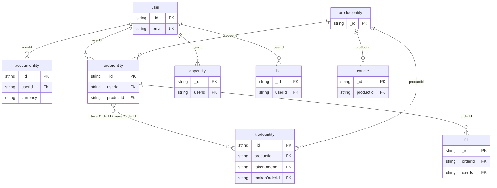
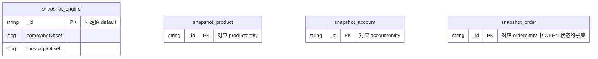
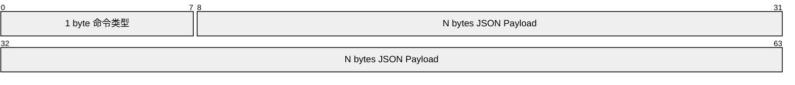
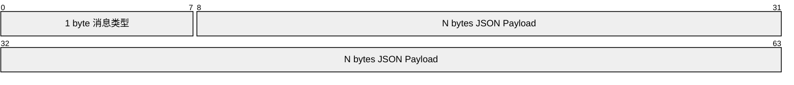

# GitBitEx 数据库设计文档

## 1. 存储架构总览

GitBitEx 采用多存储引擎架构，不同类型的数据选择最适合的存储方案：

| 存储引擎 | 用途 | 数据特征 |
|---------|------|---------|
| MongoDB (Replica Set) | 主数据库 + 引擎快照 | 结构化业务数据、事务性快照 |
| Redis | 实时缓存 + 发布订阅 | 订单簿快照、Ticker、事件通知 |
| Kafka | 事件流 | 命令队列、状态变更事件 |

### 1.1 MongoDB 集合总览

系统使用两类 MongoDB 集合：

**业务数据集合（由持久化线程写入）：**

| 集合名 | 对应实体 | 说明 |
|--------|---------|------|
| `orderentity` | OrderEntity | 订单记录 |
| `tradeentity` | TradeEntity | 成交记录 |
| `accountentity` | AccountEntity | 用户账户余额 |
| `candle` | Candle | K 线数据 |
| `productentity` | ProductEntity | 交易对配置 |
| `user` | User | 用户信息 |
| `appentity` | AppEntity | API Key 应用 |

**快照集合（由快照线程写入，引擎恢复时读取）：**

| 集合名 | 对应实体 | 说明 |
|--------|---------|------|
| `snapshot_engine` | EngineState | 引擎全局状态 |
| `snapshot_account` | Account | 账户余额快照 |
| `snapshot_order` | Order | 活跃订单快照 |
| `snapshot_product` | Product | 交易对快照 |

> **命名约定**: 业务集合名 = 实体类名的全小写形式（如 `OrderEntity` -> `orderentity`），快照集合名 = `snapshot_` 前缀 + 领域名。

---

## 2. 业务数据集合详细设计

### 2.1 用户集合 (user)

存储用户账户信息，支持密码认证和两步验证。

| 字段名 | 类型 | 说明 |
|--------|------|------|
| `_id` | String | 用户ID（主键） |
| `createdAt` | Date | 创建时间 |
| `updatedAt` | Date | 更新时间 |
| `email` | String | 邮箱地址（唯一） |
| `passwordHash` | String | 密码哈希值 |
| `passwordSalt` | String | 密码盐值 |
| `twoStepVerificationType` | String | 两步验证类型 |
| `gotpSecret` | BigDecimal | GOTP 密钥 |
| `nickName` | String | 昵称 |

**索引:**

| 索引字段 | 类型 | 说明 |
|---------|------|------|
| `email` | 降序, 唯一 | 确保邮箱唯一，支持按邮箱查找 |

### 2.2 账户集合 (accountentity)

存储用户的各币种余额信息。每个用户的每种币种对应一条记录。

| 字段名 | 类型 | 说明 |
|--------|------|------|
| `_id` | String | 主键 (格式: `{userId}-{currency}`) |
| `createdAt` | Date | 创建时间 |
| `updatedAt` | Date | 更新时间 |
| `userId` | String | 用户ID |
| `currency` | String | 币种代码 (如 BTC, USDT) |
| `available` | BigDecimal | 可用余额 |
| `hold` | BigDecimal | 冻结余额（挂单中锁定的资金） |

**索引:**

| 索引字段 | 类型 | 说明 |
|---------|------|------|
| `userId` + `currency` | 降序, 唯一 | 保证每个用户每种币种只有一条记录 |

**余额恒等式:**
```
总资产 = available + hold
```
- `available`: 可自由使用的余额，可用于下单或提现
- `hold`: 被挂单锁定的余额，撤单或成交后释放

### 2.3 订单集合 (orderentity)

存储所有订单的完整状态。

| 字段名 | 类型 | 说明 |
|--------|------|------|
| `_id` | String | 订单ID (UUID) |
| `createdAt` | Date | 持久化时间 |
| `updatedAt` | Date | 更新时间 |
| `sequence` | long | 订单在交易对内的序列号 |
| `productId` | String | 交易对ID (如 BTC-USDT) |
| `userId` | String | 下单用户ID |
| `clientOid` | String | 客户端自定义订单ID |
| `time` | Date | 下单时间 |
| `size` | BigDecimal | 订单数量（基础货币） |
| `funds` | BigDecimal | 订单金额（报价货币） |
| `filledSize` | BigDecimal | 已成交数量 |
| `executedValue` | BigDecimal | 已成交金额 |
| `price` | BigDecimal | 委托价格（市价单为0） |
| `fillFees` | BigDecimal | 手续费 |
| `type` | String(Enum) | 订单类型: `LIMIT` / `MARKET` |
| `side` | String(Enum) | 买卖方向: `BUY` / `SELL` |
| `status` | String(Enum) | 订单状态: `RECEIVED` / `OPEN` / `FILLED` / `CANCELLED` / `REJECTED` |
| `timeInForce` | String | 有效期策略: `GTC` / `GTT` / `IOC` / `FOK` |
| `settled` | boolean | 是否已结算 |
| `postOnly` | boolean | 是否为仅做 Maker 订单 |

**索引:**

| 索引字段 | 类型 | 说明 |
|---------|------|------|
| `userId` + `productId` + `sequence` | 降序 | 支持按用户+交易对+序号查询，分页排序 |

**计算字段说明:**
- `filledSize = size - remainingSize`（由持久化线程计算）
- `executedValue = funds - remainingFunds`（由持久化线程计算）

### 2.4 成交集合 (tradeentity)

存储每一笔成交记录。

| 字段名 | 类型 | 说明 |
|--------|------|------|
| `_id` | String | 成交ID (格式: `{productId}-{sequence}`) |
| `createdAt` | Date | 持久化时间 |
| `updatedAt` | Date | 更新时间 |
| `sequence` | long | 成交在交易对内的序列号 |
| `productId` | String | 交易对ID |
| `takerOrderId` | String | Taker 订单ID |
| `makerOrderId` | String | Maker 订单ID |
| `price` | BigDecimal | 成交价格 |
| `size` | BigDecimal | 成交数量 |
| `side` | String(Enum) | Maker 方向: `BUY` / `SELL` |
| `time` | Date | 成交时间 |

**索引:**

| 索引字段 | 类型 | 说明 |
|---------|------|------|
| `productId` + `sequence` | 降序 | 支持按交易对查询最近成交 |

**注意:** `side` 字段记录的是 Maker 方的方向，这在 K 线图的红绿着色中有重要意义：
- Maker 是 SELL -> 说明 Taker 主动买入 -> K 线红色（买盘主动）
- Maker 是 BUY -> 说明 Taker 主动卖出 -> K 线绿色（卖盘主动）

### 2.5 K 线集合 (candle)

存储各时间粒度的 OHLCV K 线数据。

| 字段名 | 类型 | 说明 |
|--------|------|------|
| `_id` | String | K线ID (格式: `{productId}-{time}-{granularity}`) |
| `createdAt` | Date | 创建时间 |
| `updatedAt` | Date | 更新时间 |
| `productId` | String | 交易对ID |
| `granularity` | int | 时间粒度（分钟）: 1/5/15/30/60/360/1440 |
| `time` | long | K 线开始时间（Unix 秒，已按粒度对齐） |
| `open` | BigDecimal | 开盘价 |
| `close` | BigDecimal | 收盘价 |
| `high` | BigDecimal | 最高价 |
| `low` | BigDecimal | 最低价 |
| `volume` | BigDecimal | 成交量（基础货币） |
| `tradeId` | long | 最后一笔成交的序列号（用于幂等性和连续性检查） |

**时间粒度说明:**

| 粒度(分钟) | 含义 | 说明 |
|-----------|------|------|
| 1 | 1分钟 | 最小粒度 |
| 5 | 5分钟 | |
| 15 | 15分钟 | |
| 30 | 30分钟 | |
| 60 | 1小时 | |
| 360 | 6小时 | |
| 1440 | 1天 | 日K |

**ID 设计原理:** `{productId}-{time}-{granularity}` 的复合 ID 天然具有唯一性，因为同一交易对在同一时间窗口同一粒度下只会有一根 K 线。

### 2.6 交易对集合 (productentity)

存储交易对的配置信息。

| 字段名 | 类型 | 说明 |
|--------|------|------|
| `_id` | String | 交易对ID (如 BTC-USDT) |
| `createdAt` | Date | 创建时间 |
| `updatedAt` | Date | 更新时间 |
| `baseCurrency` | String | 基础货币 (如 BTC) |
| `quoteCurrency` | String | 报价货币 (如 USDT) |
| `baseMinSize` | BigDecimal | 基础货币最小数量 |
| `baseMaxSize` | BigDecimal | 基础货币最大数量 |
| `quoteMinSize` | BigDecimal | 报价货币最小金额 |
| `quoteMaxSize` | BigDecimal | 报价货币最大金额 |
| `baseScale` | int | 基础货币精度（小数位数） |
| `quoteScale` | int | 报价货币精度（小数位数） |
| `quoteIncrement` | float | 报价最小变动单位 |
| `takerFeeRate` | float | Taker 手续费率 |
| `makerFeeRate` | float | Maker 手续费率 |
| `displayOrder` | int | 显示排序 |

### 2.7 API 应用集合 (appentity)

存储 API Key 信息，用于程序化交易接入。

| 字段名 | 类型 | 说明 |
|--------|------|------|
| `_id` | String | 应用ID |
| `createdAt` | Date | 创建时间 |
| `updatedAt` | Date | 更新时间 |
| `userId` | String | 所属用户ID |
| `name` | String | 应用名称 |
| `accessKey` | String | 访问密钥（公钥） |
| `secretKey` | String | 私密密钥（签名用） |

### 2.8 流水集合 (bill) - 实体定义

资金流水记录，追踪每一笔余额变动。

| 字段名 | 类型 | 说明 |
|--------|------|------|
| `_id` | String | 流水ID |
| `createdAt` | Date | 创建时间 |
| `updatedAt` | Date | 更新时间 |
| `userId` | String | 用户ID |
| `currency` | String | 币种 |
| `holdIncrement` | BigDecimal | 冻结余额增量（正为冻结，负为解冻） |
| `availableIncrement` | BigDecimal | 可用余额增量（正为增加，负为减少） |
| `type` | String | 流水类型 |
| `settled` | boolean | 是否已结算 |
| `notes` | String | 备注说明 |

### 2.9 成交明细集合 (fill) - 实体定义

记录每个订单的成交明细。

| 字段名 | 类型 | 说明 |
|--------|------|------|
| `_id` | String | 明细ID |
| `createdAt` | Date | 创建时间 |
| `updatedAt` | Date | 更新时间 |
| `orderId` | String | 订单ID |
| `tradeId` | long | 成交ID |
| `productId` | String | 交易对ID |
| `userId` | String | 用户ID |
| `size` | BigDecimal | 成交数量 |
| `price` | BigDecimal | 成交价格 |
| `funds` | BigDecimal | 成交金额 |
| `fee` | BigDecimal | 手续费 |
| `liquidity` | String | 流动性角色: `maker` / `taker` |
| `settled` | boolean | 是否已结算 |
| `side` | String(Enum) | 买卖方向 |
| `done` | boolean | 订单是否已完成 |
| `doneReason` | String | 完成原因 |

---

## 3. 快照集合详细设计

快照集合用于撮合引擎的状态持久化和崩溃恢复，是系统可靠性的核心。

### 3.1 引擎状态集合 (snapshot_engine)

存储撮合引擎的全局状态信息。整个系统只有一条记录（`_id = "default"`）。

| 字段名 | 类型 | 说明 |
|--------|------|------|
| `_id` | String | 固定值 `"default"` |
| `commandOffset` | Long | 已完整处理的最后一条命令的 Kafka offset |
| `messageOffset` | Long | 快照线程消费到的 Kafka message offset |
| `messageSequence` | Long | 当前全局消息序列号 |
| `tradeSequences` | Map<String, Long> | 各交易对的成交序列号 (key=productId) |
| `orderSequences` | Map<String, Long> | 各交易对的订单序列号 (key=productId) |
| `orderBookSequences` | Map<String, Long> | 各交易对的订单簿版本号 (key=productId) |

**关键字段语义:**

- `commandOffset`: 恢复时从 `commandOffset + 1` 开始重放命令。若为 null 则从头开始。只在 `CommandEndMessage` 时设置，保证不在命令执行中途快照。
- `messageSequence`: 撮合引擎产生消息的全局序列号，恢复时设置到 `AtomicLong`，保证序列号单调递增。
- `tradeSequences` / `orderSequences` / `orderBookSequences`: 各交易对级别的序列号，恢复时传递给对应的 `OrderBook`。

### 3.2 账户快照集合 (snapshot_account)

存储所有用户账户的实时余额快照。

| 字段名 | 类型 | 说明 |
|--------|------|------|
| `_id` | String | 账户ID (格式: `{userId}-{currency}`) |
| `userId` | String | 用户ID |
| `currency` | String | 币种 |
| `available` | BigDecimal | 可用余额 |
| `hold` | BigDecimal | 冻结余额 |

**写入策略:** Upsert（按 `_id` 匹配，存在则替换，不存在则插入）

### 3.3 订单快照集合 (snapshot_order)

存储所有在订单簿中的活跃订单。

| 字段名 | 类型 | 说明 |
|--------|------|------|
| `_id` | String | 订单ID |
| `sequence` | long | 订单序列号 |
| `userId` | String | 用户ID |
| `type` | String(Enum) | 订单类型 |
| `side` | String(Enum) | 买卖方向 |
| `remainingSize` | BigDecimal | 剩余数量 |
| `price` | BigDecimal | 委托价格 |
| `remainingFunds` | BigDecimal | 剩余金额 |
| `size` | BigDecimal | 原始数量 |
| `funds` | BigDecimal | 原始金额 |
| `postOnly` | boolean | 仅做 Maker |
| `time` | Date | 下单时间 |
| `productId` | String | 交易对ID |
| `status` | String(Enum) | 订单状态 |
| `clientOid` | String | 客户端订单ID |

**索引:**

| 索引字段 | 类型 | 说明 |
|---------|------|------|
| `product_id` + `sequence` | 降序, 唯一 | 保证同交易对内序列号唯一，支持按序恢复 |

**写入策略:**
- 状态为 `OPEN` 的订单: Upsert（替换或插入）
- 其他状态的订单: Delete（从快照中移除）

这种设计确保快照集合只保留当前在订单簿中的活跃订单，恢复时无需过滤。

### 3.4 交易对快照集合 (snapshot_product)

存储交易对的基本信息。

| 字段名 | 类型 | 说明 |
|--------|------|------|
| `_id` | String | 交易对ID |
| `baseCurrency` | String | 基础货币 |
| `quoteCurrency` | String | 报价货币 |

**写入策略:** Upsert

### 3.5 快照写入的事务保证

快照通过 MongoDB 事务原子性写入：

```java
session.startTransaction();
try {
    // 1. 替换引擎状态
    engineStateCollection.replaceOne(session, ...);
    // 2. 批量写入账户变更
    accountCollection.bulkWrite(session, accountWriteModels);
    // 3. 批量写入交易对变更
    productCollection.bulkWrite(session, productWriteModels);
    // 4. 批量写入订单变更（OPEN -> upsert, 其他 -> delete）
    orderCollection.bulkWrite(session, orderWriteModels);
    session.commitTransaction();
} catch (Exception e) {
    session.abortTransaction();
    throw e;
}
```

---

## 4. 集合间关系图



**快照集合关系（独立体系）：**



### 关联关系说明

| 关系 | 说明 |
|------|------|
| user -> accountentity | 一对多：一个用户拥有多个币种的账户 |
| user -> orderentity | 一对多：一个用户可以有多个订单 |
| user -> appentity | 一对多：一个用户可以创建多个 API 应用 |
| orderentity -> tradeentity | 多对多：通过 takerOrderId/makerOrderId 关联 |
| orderentity -> fill | 一对多：一个订单可以有多次部分成交 |
| productentity -> orderentity | 一对多：一个交易对有多个订单 |
| productentity -> tradeentity | 一对多：一个交易对有多笔成交 |
| productentity -> candle | 一对多：一个交易对有多根K线（按粒度和时间） |

---

## 5. 索引设计汇总

### 5.1 业务集合索引

| 集合 | 索引字段 | 类型 | 唯一 | 用途 |
|------|---------|------|------|------|
| `user` | `email` | 降序 | 是 | 邮箱登录查找 |
| `accountentity` | `userId`, `currency` | 降序 | 是 | 按用户查询各币种余额 |
| `orderentity` | `userId`, `productId`, `sequence` | 降序 | 否 | 用户订单列表查询与分页 |
| `tradeentity` | `productId`, `sequence` | 降序 | 否 | 按交易对查询最近成交 |

### 5.2 快照集合索引

| 集合 | 索引字段 | 类型 | 唯一 | 用途 |
|------|---------|------|------|------|
| `snapshot_order` | `product_id`, `sequence` | 降序 | 是 | 按交易对+序号恢复订单 |

### 5.3 索引设计原则

1. **查询驱动**: 索引设计严格对应实际查询模式
2. **复合索引左前缀**: 如 `(userId, productId, sequence)` 同时支持 `userId` 单字段查询
3. **唯一索引保证数据完整性**: 如账户的 `(userId, currency)` 唯一索引防止重复记录
4. **降序索引优化分页**: 订单和成交通常按时间倒序查询，降序索引避免排序开销

---

## 6. Redis 缓存设计

### 6.1 订单簿快照缓存

Redis 中缓存多级别的订单簿快照，供 WebSocket 推送和 API 查询使用。

| Key 格式 | 数据类型 | 内容 | 说明 |
|---------|---------|------|------|
| `{productId}.l1_order_book` | String (JSON) | L1 订单簿 | 最佳买卖价 |
| `{productId}.l2_order_book` | String (JSON) | L2 订单簿 | 价格聚合的前 25 档 |
| `{productId}.l2_batch_order_book` | String (JSON) | L2 批量订单簿 | 用于 WebSocket 增量推送 |
| `{productId}.l3_order_book` | String (JSON) | L3 订单簿 | 完整订单列表 |

**L2OrderBook JSON 结构:**

```json
{
  "productId": "BTC-USDT",
  "sequence": 12345,
  "time": 1679900000000,
  "asks": [
    [30000.00, 1.5, 3],     // [价格, 总数量, 订单数]
    [30001.00, 2.0, 5]
  ],
  "bids": [
    [29999.00, 1.0, 2],
    [29998.00, 3.5, 8]
  ]
}
```

**更新策略:**
- `OrderBookSnapshotThread` 消费 message topic 中的 OrderMessage
- 在内存中维护完整订单簿，当序列号变化超过 1000 或距上次快照超过 1 秒时生成新的 L2 快照
- 写入 Redis 的同时发布到 `l2_batch` Redis Topic 通知 WebSocket 层

### 6.2 Redis Pub/Sub Topic

| Topic 名 | 消息内容 | 生产者 | 消费者 |
|----------|---------|--------|--------|
| `order` | OrderMessage JSON | OrderPersistenceThread | WebSocket SessionManager |
| `trade` | TradeMessage JSON | TradePersistenceThread | WebSocket SessionManager |
| `account` | AccountMessage JSON | AccountPersistenceThread | WebSocket SessionManager |
| `l2_batch` | L2OrderBook JSON | OrderBookSnapshotThread | WebSocket SessionManager |

### 6.3 Ticker 缓存

Ticker 数据由 `TickerManager` 管理，存储在 Redis 或 MongoDB 中（取决于 TickerManager 的实现），包含 24 小时和 30 天的行情统计。

---

## 7. Kafka Topic 设计

### 7.1 Topic 配置

| Topic 名 | 用途 | 分区数 | 消费者组 |
|----------|------|--------|---------|
| `matching-engine-command` | 撮合引擎命令队列 | 1 | MatchingEngine |
| `matching-engine-message` | 撮合引擎状态变更事件 | 1 | Order, Trade1, Account, CandlerMaker, Ticker, EngineSnapshot, OrderBookSnapshot |

### 7.2 Command Topic 消息格式



**PlaceOrderCommand 示例:**
```json
{
  "type": "PLACE_ORDER",
  "productId": "BTC-USDT",
  "orderId": "550e8400-e29b-41d4-a716-446655440000",
  "userId": "user-001",
  "orderType": "LIMIT",
  "orderSide": "BUY",
  "size": "1.5",
  "price": "30000.00",
  "funds": "45000.00",
  "time": "2024-01-01T00:00:00.000Z"
}
```

**CancelOrderCommand 示例:**
```json
{
  "type": "CANCEL_ORDER",
  "productId": "BTC-USDT",
  "orderId": "550e8400-e29b-41d4-a716-446655440000"
}
```

**DepositCommand 示例:**
```json
{
  "type": "DEPOSIT",
  "userId": "user-001",
  "currency": "USDT",
  "amount": "10000.00",
  "transactionId": "tx-001"
}
```

### 7.3 Message Topic 消息格式



**OrderMessage 示例:**
```json
{
  "sequence": 100,
  "orderBookSequence": 50,
  "order": {
    "id": "order-001",
    "userId": "user-001",
    "productId": "BTC-USDT",
    "type": "LIMIT",
    "side": "BUY",
    "price": "30000.00",
    "size": "1.5",
    "remainingSize": "0.5",
    "remainingFunds": "15000.00",
    "status": "OPEN",
    "sequence": 10
  }
}
```

**TradeMessage 示例:**
```json
{
  "sequence": 101,
  "trade": {
    "productId": "BTC-USDT",
    "sequence": 5,
    "size": "1.0",
    "funds": "30000.00",
    "price": "30000.00",
    "side": "SELL",
    "takerOrderId": "order-001",
    "makerOrderId": "order-002",
    "time": "2024-01-01T00:00:00.000Z"
  }
}
```

### 7.4 生产者配置

| 配置项 | 值 | 说明 |
|--------|------|------|
| `compression.type` | `zstd` | 高压缩比 |
| `retries` | `2147483647` | 无限重试 |
| `linger.ms` | `100` | 批量发送延迟 |
| `batch.size` | `32768` | 批量大小 (32KB) |
| `enable.idempotence` | `true` | 幂等生产者，防消息重复 |
| `max.in.flight.requests.per.connection` | `5` | 配合幂等保有序 |
| `acks` | `all` | 所有副本确认 |

### 7.5 消费者配置

| 配置项 | 值 | 说明 |
|--------|------|------|
| `enable.auto.commit` | `false` | 手动提交 offset |
| `session.timeout.ms` | `30000` | 会话超时 30 秒 |
| `auto.offset.reset` | `earliest` | 新消费者组从头消费 |
| `max.poll.records` | `2000` | 单次最大拉取 2000 条 |

---

## 8. 数据一致性设计

### 8.1 撮合引擎内部一致性

撮合引擎在内存中维护的数据始终一致：

- 下单时先冻结资金再撮合，资金不足则拒绝
- 成交时原子性完成资金划转（exchange 方法内部同步执行）
- 每次划转后校验余额非负 (`validateAccount`)

### 8.2 引擎与持久化层的一致性

引擎与持久化层之间是最终一致的：

- 引擎的所有状态变更通过 Kafka 消息传播到持久化层
- 消息带有全局递增的 sequence，消费者检测乱序并拒绝
- 消费者使用手动 offset 提交，确保消息至少被处理一次
- 持久化使用 upsert 语义，重复处理同一消息幂等

### 8.3 快照一致性

- 快照只在 `CommandEndMessage` 时保存，保证完整命令的原子性
- 快照使用 MongoDB 事务写入，多集合原子更新
- 恢复时使用 Snapshot Read Concern，保证读取一致性视图
