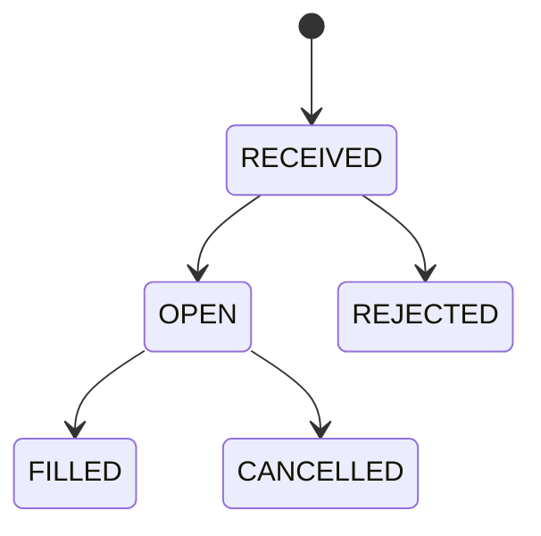

# GitBitEx 加密货币交易所 - 产品需求文档

> 文档版本: v1.0
> 更新日期: 2026-03-21
> 编写人: 产品团队
> 状态: 初稿

---

## 目录

1. [产品概述](#1-产品概述)
2. [功能模块总览](#2-功能模块总览)
3. [用户系统](#3-用户系统)
4. [交易系统](#4-交易系统)
5. [行情系统](#5-行情系统)
6. [账户系统](#6-账户系统)
7. [WebSocket 实时推送](#7-websocket-实时推送)
8. [API Key 管理](#8-api-key-管理)
9. [管理后台](#9-管理后台)
10. [非功能性需求](#10-非功能性需求)
11. [API 接口清单](#11-api-接口清单)

---

## 1. 产品概述

### 1.1 产品定位

GitBitEx 是一款开源的加密货币现货交易所系统，提供完整的数字资产交易基础设施。系统采用高性能撮合引擎架构，支持限价单和市价单交易，通过 WebSocket 实现实时行情推送，面向需要快速搭建数字资产交易平台的开发者和企业。

### 1.2 目标用户

| 用户类型 | 描述 | 核心诉求 |
|---------|------|---------|
| 个人交易者 | 进行加密货币现货买卖的普通用户 | 快速下单、实时行情、资产安全 |
| 量化交易者 | 通过 API 进行程序化交易的专业用户 | 低延迟 API、WebSocket 推送、API Key 管理 |
| 平台运营方 | 部署和运营交易所的企业或团队 | 交易对管理、用户管理、系统可扩展性 |
| 开源开发者 | 基于本项目进行二次开发的技术人员 | 代码清晰、架构合理、易于扩展 |

### 1.3 产品价值

- **开箱即用**: 提供完整的交易所核心功能，包含用户系统、交易撮合、行情推送、账户管理等模块
- **高性能撮合**: 基于 Kafka 消息队列的撮合引擎，支持高并发订单处理
- **实时数据**: 通过 WebSocket 提供毫秒级行情推送，覆盖订单簿深度、Ticker、成交等数据
- **技术栈先进**: 基于 Spring Boot + MongoDB + Kafka + Redis 构建，易于部署和水平扩展
- **前后端一体**: 内置前端交易界面，支持 SPA 路由（trade/\*、account/\*），降低部署复杂度

### 1.4 技术架构概述

| 组件 | 技术选型 | 用途 |
|------|---------|------|
| 应用框架 | Spring Boot | Web 服务、REST API |
| 数据库 | MongoDB (Replica Set) | 持久化存储 |
| 消息队列 | Apache Kafka | 撮合引擎命令/消息传递 |
| 缓存 | Redis | 会话管理、热数据缓存 |
| 实时通信 | WebSocket | 行情推送、订单状态推送 |
| 监控 | Spring Actuator + Prometheus | 系统健康检查和指标监控 |

---

## 2. 功能模块总览

| 模块 | 功能 | 优先级 | 状态 |
|------|------|--------|------|
| 用户系统 | 注册、登录、个人信息、2FA、退出 | P0 | 已实现 |
| 交易系统 | 限价单、市价单、撤单、批量撤单、订单查询 | P0 | 已实现 |
| 行情系统 | Ticker、订单簿深度(L1/L2/L3)、K线、最近成交 | P0 | 已实现 |
| 账户系统 | 多币种账户、余额查询、资金变动记录 | P0 | 已实现 |
| WebSocket 推送 | 订单簿深度、Ticker、成交、订单状态、账户变动 | P0 | 已实现 |
| API Key 管理 | 创建应用、AccessKey/SecretKey 管理 | P1 | 已实现 |
| 管理后台 | 交易对创建、用户创建、充值管理 | P1 | 已实现(演示版) |
| 充值/提现 | 链上充值、提现申请与审核 | P2 | 待实现 |
| 验证码 | 邮箱验证码发送与校验 | P2 | 接口已预留 |
| 系统配置 | 全局参数配置 | P2 | 接口已预留 |

---

## 3. 用户系统

### 3.1 用户注册

#### 功能描述

新用户通过邮箱和密码完成账户注册。注册成功后系统自动创建用户账户。

#### 业务规则

- 邮箱为必填项，必须符合标准邮箱格式（系统通过 `@Email` 注解校验）
- 密码为必填项，不能为空
- 邮箱不可重复注册（唯一性约束）
- 注册时可选填验证码（code 字段，预留后续邮箱验证功能）
- 注册成功后返回用户基本信息（id、email、createdAt）

#### 演示模式特殊逻辑

当前版本为演示模式，注册成功后系统会自动为用户充值以下资产：
- BTC: 1,000,000,000
- ETH: 1,000,000,000
- USDT: 1,000,000,000

> 注意: 正式环境须移除此自动充值逻辑，改为通过链上充值或管理员手动充值。

#### 数据模型

**请求参数 (SignUpRequest):**

| 字段 | 类型 | 必填 | 说明 |
|------|------|------|------|
| email | String | 是 | 用户邮箱，需符合邮箱格式 |
| password | String | 是 | 用户密码 |
| code | String | 否 | 验证码（预留） |

**响应数据 (UserDto):**

| 字段 | 类型 | 说明 |
|------|------|------|
| id | String | 用户唯一标识 |
| email | String | 用户邮箱 |
| name | String | 用户昵称 |
| band | Boolean | 是否被封禁 |
| twoStepVerificationType | String | 二步验证类型 |
| createdAt | String | 创建时间（ISO 8601 格式） |

### 3.2 用户登录

#### 功能描述

已注册用户通过邮箱和密码进行身份验证，获取访问令牌（Access Token）。

#### 业务规则

- 用户提交邮箱和密码进行身份验证
- 验证通过后，系统生成 Access Token 并关联当前 Session
- Token 同时以 Cookie 形式写入响应，Cookie 有效期为 7 天
- Cookie 配置: `path=/`、`secure=false`、`httpOnly=false`
- 登录失败返回 401 错误，提示"email or password error"
- 响应中包含二步验证状态（当前默认为 "none"）

#### 认证机制

系统采用 Token 认证方式，认证拦截器（AuthInterceptor）支持两种 Token 传递方式：
1. **URL 参数**: `?accessToken=xxx`
2. **Cookie**: 名为 `accessToken` 的 Cookie

认证流程：
1. 拦截器从请求中提取 Access Token
2. 通过 Token 查询关联用户
3. 将用户信息注入请求属性（`currentUser`）
4. 需要认证的接口检查 `currentUser` 是否为 null，为 null 则返回 401

**请求参数 (SignInRequest):**

| 字段 | 类型 | 必填 | 说明 |
|------|------|------|------|
| email | String | 是 | 用户邮箱 |
| password | String | 是 | 用户密码 |
| code | String | 否 | 二步验证码（预留） |

**响应数据 (TokenDto):**

| 字段 | 类型 | 说明 |
|------|------|------|
| token | String | 访问令牌 |
| twoStepVerification | String | 二步验证状态 |

### 3.3 个人信息管理

#### 功能描述

已登录用户可以查看和修改个人资料。

#### 查看个人信息

- 需要登录认证
- 返回当前用户的完整资料

#### 修改个人信息

可修改字段：
- **nickName**: 用户昵称
- **twoStepVerificationType**: 二步验证类型

修改逻辑为部分更新：仅传入的非空字段会被更新，未传入的字段保持不变。

**请求参数 (UpdateProfileRequest):**

| 字段 | 类型 | 必填 | 说明 |
|------|------|------|------|
| nickName | String | 否 | 用户昵称 |
| twoStepVerificationType | String | 否 | 二步验证类型 |

### 3.4 二步验证（TOTP）

#### 功能描述

系统支持基于 TOTP（Time-based One-Time Password）协议的二步验证机制，用户可通过 Google Authenticator 等应用生成动态验证码。

#### 业务规则

- 用户实体中包含 `gotpSecret` 字段用于存储 TOTP 密钥
- 用户可通过修改个人信息接口设置 `twoStepVerificationType`
- 登录接口预留了 `code` 字段用于接收二步验证码

> 注意: 当前版本 TOTP 验证流程尚未完整实现，登录时 twoStepVerification 固定返回 "none"。

### 3.5 退出登录

#### 功能描述

已登录用户可以主动退出登录，使当前 Access Token 失效。

#### 业务规则

- 需要登录认证
- 系统删除当前请求中携带的 Access Token
- Token 失效后，使用该 Token 的后续请求将无法通过认证

---

## 4. 交易系统

### 4.1 交易对管理

#### 功能描述

交易对（Product）定义了可交易的币对信息，如 BTC-USDT、ETH-USDT 等。交易对 ID 由 `{baseCurrency}-{quoteCurrency}` 构成。

#### 交易对数据模型 (ProductEntity)

| 字段 | 类型 | 说明 |
|------|------|------|
| id | String | 交易对唯一标识，格式为 `{baseCurrency}-{quoteCurrency}` |
| baseCurrency | String | 基础货币，如 BTC |
| quoteCurrency | String | 计价货币，如 USDT |
| baseMinSize | BigDecimal | 基础货币最小交易数量 |
| baseMaxSize | BigDecimal | 基础货币最大交易数量 |
| quoteMinSize | BigDecimal | 计价货币最小金额 |
| quoteMaxSize | BigDecimal | 计价货币最大金额 |
| baseScale | int | 基础货币精度（小数位数），默认 6 |
| quoteScale | int | 计价货币精度（小数位数），默认 2 |
| quoteIncrement | float | 报价最小增量 |
| takerFeeRate | float | Taker 手续费率 |
| makerFeeRate | float | Maker 手续费率 |
| displayOrder | int | 前端显示排序 |

#### 交易对查询响应 (ProductDto)

| 字段 | 类型 | 说明 |
|------|------|------|
| id | String | 交易对 ID |
| baseCurrency | String | 基础货币 |
| quoteCurrency | String | 计价货币 |
| baseMinSize | String | 最小交易数量 |
| baseMaxSize | String | 最大交易数量 |
| quoteIncrement | String | 报价最小增量 |
| baseScale | int | 基础货币精度 |
| quoteScale | int | 计价货币精度 |

### 4.2 下单功能

#### 功能描述

已登录用户可以在指定交易对上提交买入或卖出订单。系统支持限价单（Limit Order）和市价单（Market Order）两种订单类型。

#### 订单类型详解

##### 4.2.1 限价单（LIMIT）

限价单允许用户指定交易价格和数量。订单将以指定价格或更优价格成交。

**下单参数:**

| 字段 | 类型 | 必填 | 说明 |
|------|------|------|------|
| productId | String | 是 | 交易对 ID，如 "BTC-USDT" |
| type | String | 是 | 固定值 "limit" |
| side | String | 是 | "buy"（买入）或 "sell"（卖出） |
| price | String | 是 | 委托价格，按 quoteScale 精度截断（向下取整） |
| size | String | 是 | 委托数量（基础货币），按 baseScale 精度截断（向下取整） |
| timeInForce | String | 否 | 时间策略，默认 GTC |

**限价单处理规则:**
- 价格（price）按交易对的 quoteScale 精度向下截断
- 数量（size）按交易对的 baseScale 精度向下截断
- 买单: 冻结资金（funds）= size * price
- 卖单: 冻结资金（funds）= 0，冻结对应数量的基础货币

##### 4.2.2 市价单（MARKET）

市价单以当前市场最优价格立即成交，不保证成交价格。

**买入市价单参数:**

| 字段 | 类型 | 必填 | 说明 |
|------|------|------|------|
| productId | String | 是 | 交易对 ID |
| type | String | 是 | 固定值 "market" |
| side | String | 是 | "buy" |
| funds | String | 是 | 买入金额（计价货币），按 quoteScale 精度截断 |
| size | String | 是 | 传入但不使用，系统会置为 0 |

**卖出市价单参数:**

| 字段 | 类型 | 必填 | 说明 |
|------|------|------|------|
| productId | String | 是 | 交易对 ID |
| type | String | 是 | 固定值 "market" |
| side | String | 是 | "sell" |
| size | String | 是 | 卖出数量（基础货币），按 baseScale 精度截断 |
| funds | String | 否 | 传入但不使用，系统会置为 0 |

**市价单处理规则:**
- 价格（price）固定为 0（由撮合引擎按市场价执行）
- 买入: size 置为 0，funds 按 quoteScale 精度截断，funds 必须大于 0
- 卖出: funds 置为 0，size 按 baseScale 精度截断，size 必须大于 0

#### 4.2.3 时间有效策略（Time In Force）

| 策略 | 全称 | 说明 |
|------|------|------|
| GTC | Good Till Canceled | 订单持续有效直到被手动撤销。默认策略 |
| GTT | Good Till Time | 订单在指定时间前有效，到期自动撤销 |
| IOC | Immediate Or Cancel | 订单立即以可用量成交，剩余部分自动撤销 |
| FOK | Fill Or Kill | 订单必须全部成交，否则整单撤销 |

#### 4.2.4 下单验证规则

- 用户必须已登录
- 交易对（productId）必须存在
- 卖单: size 必须大于 0
- 买单: funds 必须大于 0
- 验证不通过时抛出异常

#### 4.2.5 下单响应

下单为异步操作，请求提交后立即返回订单 ID，订单实际执行由撮合引擎异步处理。

**响应数据 (OrderDto):**

| 字段 | 类型 | 说明 |
|------|------|------|
| id | String | 订单 ID（UUID） |

### 4.3 订单状态流转

订单在生命周期中经历以下状态变化：



| 状态 | 说明 |
|------|------|
| RECEIVED | 订单已被撮合引擎接收，正在处理中 |
| OPEN | 订单已进入订单簿，等待成交（限价单未完全成交时） |
| FILLED | 订单已完全成交 |
| CANCELLED | 订单已被撤销（用户主动撤销或系统自动撤销） |
| REJECTED | 订单被拒绝（如余额不足等原因） |

### 4.4 撤单功能

#### 单笔撤单

已登录用户可以撤销自己的指定订单。

**业务规则:**
- 需要登录认证
- 只能撤销自己的订单（校验 userId）
- 订单必须存在，否则返回 404
- 非本人订单返回 403
- 撤单为异步操作，发送撤单命令到撮合引擎

#### 批量撤单

已登录用户可以批量撤销符合条件的所有活跃订单。

**筛选条件:**

| 参数 | 类型 | 必填 | 说明 |
|------|------|------|------|
| productId | String | 否 | 交易对 ID，不传则撤销所有交易对 |
| side | String | 否 | 订单方向（buy/sell），不传则撤销双向 |

**业务规则:**
- 需要登录认证
- 查询当前用户所有 OPEN 状态的订单
- 最多处理 20,000 笔订单
- 逐笔发送撤单命令到撮合引擎

### 4.5 订单查询

#### 功能描述

已登录用户可以查询自己的历史订单，支持按交易对和状态筛选，支持分页。

**请求参数:**

| 参数 | 类型 | 必填 | 默认值 | 说明 |
|------|------|------|--------|------|
| productId | String | 否 | - | 交易对 ID |
| status | String | 否 | - | 订单状态筛选（open/filled/cancelled 等） |
| page | int | 否 | 1 | 页码 |
| pageSize | int | 否 | 50 | 每页数量 |

**响应数据 (PagedList\<OrderDto\>):**

| 字段 | 类型 | 说明 |
|------|------|------|
| items | List\<OrderDto\> | 订单列表 |
| count | long | 总记录数 |

**OrderDto 完整字段:**

| 字段 | 类型 | 说明 |
|------|------|------|
| id | String | 订单 ID |
| productId | String | 交易对 ID |
| side | String | 买卖方向（buy/sell） |
| type | String | 订单类型（limit/market） |
| price | String | 委托价格 |
| size | String | 委托数量 |
| funds | String | 委托金额 |
| filledSize | String | 已成交数量 |
| executedValue | String | 已成交金额 |
| status | String | 订单状态 |
| createdAt | String | 创建时间（ISO 8601 格式） |

---

## 5. 行情系统

### 5.1 实时行情（Ticker）

#### 功能描述

Ticker 提供每个交易对的最新成交价格和统计数据，包括 24 小时和 30 天的价格统计。

#### 数据模型 (Ticker)

| 字段 | 类型 | 说明 |
|------|------|------|
| productId | String | 交易对 ID |
| tradeId | long | 最新成交 ID |
| sequence | long | 序列号 |
| time | Date | 最新成交时间 |
| price | BigDecimal | 最新成交价 |
| side | OrderSide | 最新成交方向 |
| lastSize | BigDecimal | 最新成交量 |
| open24h | BigDecimal | 24 小时开盘价 |
| close24h | BigDecimal | 24 小时收盘价 |
| high24h | BigDecimal | 24 小时最高价 |
| low24h | BigDecimal | 24 小时最低价 |
| volume24h | BigDecimal | 24 小时成交量 |
| volume30d | BigDecimal | 30 天成交量 |

Ticker 数据通过 WebSocket 的 `ticker` 频道实时推送（详见第 7 节）。

### 5.2 订单簿深度

#### 功能描述

订单簿（Order Book）展示当前市场上的买卖挂单分布情况，系统支持三个级别的订单簿深度：

| 级别 | 说明 | 适用场景 |
|------|------|---------|
| Level 1 | 仅返回最优买/卖价 | 快速获取市场最优价格 |
| Level 2 | 按价格聚合的深度数据（批量） | 前端深度图展示，最常用 |
| Level 3 | 完整订单簿（每笔挂单明细） | 高级交易分析 |

**请求参数:**

| 参数 | 类型 | 必填 | 默认值 | 说明 |
|------|------|------|--------|------|
| productId | Path | 是 | - | 交易对 ID |
| level | int | 否 | 2 | 深度级别（1/2/3） |

#### L2 订单簿数据结构

L2 订单簿包含按价格聚合后的买卖双方挂单数据，每个价格档位包含：
- 价格（price）
- 该价格的总挂单量（size）
- 挂单笔数（numOrders）

L2 订单簿还支持通过 WebSocket 的 `level2` 频道进行实时增量更新。

### 5.3 最近成交

#### 功能描述

获取指定交易对的最近成交记录。

**请求参数:**

| 参数 | 类型 | 必填 | 说明 |
|------|------|------|------|
| productId | Path | 是 | 交易对 ID |

**业务规则:**
- 默认返回最近 50 条成交记录
- 按时间倒序排列

**响应数据 (TradeDto):**

| 字段 | 类型 | 说明 |
|------|------|------|
| sequence | long | 成交序列号 |
| time | String | 成交时间（ISO 8601 格式） |
| price | String | 成交价格 |
| size | String | 成交数量 |
| side | String | 成交方向（buy/sell） |

### 5.4 K 线数据（Candles）

#### 功能描述

K 线数据提供指定交易对在不同时间粒度下的 OHLCV（开盘价、最高价、最低价、收盘价、成交量）数据，用于绘制 K 线图。

#### 支持的时间粒度

| 粒度（分钟） | API 参数值（秒） | 说明 |
|-------------|----------------|------|
| 1 分钟 | 60 | 超短线交易 |
| 5 分钟 | 300 | 短线交易 |
| 15 分钟 | 900 | 短线交易 |
| 30 分钟 | 1800 | 日内交易 |
| 1 小时 | 3600 | 日内/波段交易 |
| 6 小时 | 21600 | 波段交易 |
| 1 天 | 86400 | 中长线交易 |

> 注意: API 接收的 granularity 参数单位为秒，系统内部存储单位为分钟（除以 60 转换）。

**请求参数:**

| 参数 | 类型 | 必填 | 默认值 | 说明 |
|------|------|------|--------|------|
| productId | Path | 是 | - | 交易对 ID |
| granularity | int | 是 | - | 时间粒度（秒） |
| limit | int | 否 | 1000 | 返回条数上限 |

**响应格式:**

返回二维数组，每个元素为一根 K 线：

```json
[
    [time, low, high, open, close, volume],
    [1415398768, 0.32, 4.2, 0.35, 4.2, 12.3]
]
```

| 索引 | 字段 | 类型 | 说明 |
|------|------|------|------|
| 0 | time | long | K 线起始时间（Unix 时间戳，秒） |
| 1 | low | BigDecimal | 最低价 |
| 2 | high | BigDecimal | 最高价 |
| 3 | open | BigDecimal | 开盘价 |
| 4 | close | BigDecimal | 收盘价 |
| 5 | volume | BigDecimal | 成交量 |

---

## 6. 账户系统

### 6.1 多币种账户

#### 功能描述

每个用户拥有多个币种账户，每个币种对应一个独立的账户实体。系统支持查询指定币种的账户余额信息。

#### 账户数据模型 (AccountEntity)

| 字段 | 类型 | 说明 |
|------|------|------|
| id | String | 账户唯一标识 |
| userId | String | 所属用户 ID |
| currency | String | 币种（如 BTC、ETH、USDT） |
| available | BigDecimal | 可用余额（可用于下单或提现） |
| hold | BigDecimal | 冻结余额（已被挂单占用的金额） |

### 6.2 可用余额与冻结余额

#### 余额机制说明

- **可用余额（available）**: 用户可自由使用的资金，可用于下单或提现
- **冻结余额（hold）**: 已被活跃订单占用的资金，订单成交或撤销后释放
- **总余额** = 可用余额 + 冻结余额

#### 余额变动场景

| 场景 | available 变化 | hold 变化 |
|------|----------------|-----------|
| 充值 | +充值金额 | 不变 |
| 下买单（限价） | -funds | +funds |
| 下卖单 | -size | +size（基础货币） |
| 订单成交（买方） | +买入数量（基础货币） | -对应冻结 |
| 订单成交（卖方） | +卖出金额（计价货币） | -对应冻结 |
| 撤单 | +释放金额 | -释放金额 |

### 6.3 账户查询

**请求参数:**

| 参数 | 类型 | 必填 | 说明 |
|------|------|------|------|
| currency | List\<String\> | 是 | 需要查询的币种列表 |

**响应数据 (AccountDto):**

| 字段 | 类型 | 说明 |
|------|------|------|
| id | String | 账户 ID |
| currency | String | 币种 |
| available | String | 可用余额 |
| hold | String | 冻结余额 |

**业务规则:**
- 需要登录认证
- 若用户在某币种下无账户记录，返回 available=0、hold=0 的默认值
- 仅返回请求中指定的币种账户

### 6.4 资金变动记录（Bill）

#### 功能描述

系统记录每一笔资金变动明细，用于资金审计和对账。

#### 数据模型 (Bill)

| 字段 | 类型 | 说明 |
|------|------|------|
| id | String | 记录唯一标识 |
| userId | String | 用户 ID |
| currency | String | 币种 |
| holdIncrement | BigDecimal | 冻结金额变动量（正数为冻结，负数为释放） |
| availableIncrement | BigDecimal | 可用余额变动量（正数为增加，负数为减少） |
| type | String | 变动类型（如 trade、deposit 等） |
| settled | boolean | 是否已结算 |
| notes | String | 备注信息 |

### 6.5 充值/提现

#### 当前状态

当前版本充值功能仅通过管理后台 API 实现（演示用途），尚未实现完整的链上充值和提现流程。

#### 充值流程（管理员操作）

1. 管理员通过 `/api/admin/deposit` 接口为指定用户充值
2. 系统生成 DepositCommand 发送至撮合引擎
3. 撮合引擎处理充值命令，更新用户账户余额

> 注意: 正式环境需实现链上充值监控、提现审核、冷热钱包管理等完整流程。

---

## 7. WebSocket 实时推送

### 7.1 连接与通信协议

#### 连接方式

客户端通过 WebSocket 协议连接到服务器，建立全双工通信通道。

#### 心跳机制

客户端需定时发送 ping 消息保持连接活跃：

```json
{"type": "ping"}
```

服务器响应：

```json
{"type": "pong"}
```

### 7.2 订阅/取消订阅机制

#### 订阅请求

```json
{
    "type": "subscribe",
    "productIds": ["BTC-USDT", "ETH-USDT"],
    "currencyIds": ["BTC", "USDT"],
    "channels": ["level2", "ticker", "match", "order", "funds"]
}
```

#### 取消订阅请求

```json
{
    "type": "unsubscribe",
    "productIds": ["BTC-USDT"],
    "currencyIds": ["BTC"],
    "channels": ["level2"]
}
```

**参数说明:**

| 字段 | 类型 | 说明 |
|------|------|------|
| type | String | "subscribe" 或 "unsubscribe" |
| productIds | List\<String\> | 交易对列表，level2/ticker/match/order 频道需要 |
| currencyIds | List\<String\> | 币种列表，funds 频道需要 |
| channels | List\<String\> | 频道列表 |

### 7.3 频道详细说明

#### 7.3.1 level2 - 订单簿深度

**频道名**: `level2`
**所需参数**: productIds
**是否需要认证**: 否

**行为说明:**
- 订阅后，服务器首先推送一条完整的 L2 订单簿快照（type: "snapshot"）
- 之后实时推送增量更新（type: "l2update"）
- 系统内部通过 sequence 号保证数据有序性，丢弃过期数据
- 增量更新基于上次发送的快照进行 diff 计算

**快照消息格式:**

```json
{
    "type": "snapshot",
    "productId": "BTC-USDT",
    "sequence": 12345,
    "bids": [["10100.00", "0.5", 3]],
    "asks": [["10200.00", "1.2", 5]]
}
```

**增量更新消息格式:**

```json
{
    "type": "l2update",
    "productId": "BTC-USDT",
    "time": "2026-03-21T10:00:00.000Z",
    "changes": [
        ["buy", "10101.80000000", "0.162567"]
    ]
}
```

changes 数组中每个元素包含: [方向, 价格, 数量]。数量为 0 表示该价格档位已被移除。

#### 7.3.2 ticker - 实时行情

**频道名**: `ticker`
**所需参数**: productIds
**是否需要认证**: 否

**行为说明:**
- 订阅后，服务器立即推送当前最新的 Ticker 数据
- 之后每有新成交即推送更新的 Ticker

**消息格式:**

```json
{
    "type": "ticker",
    "productId": "BTC-USDT",
    "tradeId": 12345,
    "sequence": 67890,
    "time": "2026-03-21T10:00:00.000Z",
    "price": "45000.50",
    "side": "buy",
    "lastSize": "0.1",
    "open24h": "44500.00",
    "close24h": "45000.50",
    "high24h": "45500.00",
    "low24h": "44000.00",
    "volume24h": "1234.56",
    "volume30d": "98765.43"
}
```

#### 7.3.3 match - 成交

**频道名**: `match`
**所需参数**: productIds
**是否需要认证**: 否

**行为说明:**
- 每当指定交易对发生新的撮合成交时推送

**消息格式:**

```json
{
    "type": "match",
    "productId": "BTC-USDT",
    "tradeId": 12345,
    "sequence": 67890,
    "takerOrderId": "uuid-taker",
    "makerOrderId": "uuid-maker",
    "time": "2026-03-21T10:00:00.000Z",
    "size": "0.1",
    "price": "45000.50",
    "side": "buy"
}
```

#### 7.3.4 order - 订单状态变动

**频道名**: `order`
**所需参数**: productIds
**是否需要认证**: 是（需要通过 WebSocket Session 获取 userId）

**行为说明:**
- 推送当前用户在指定交易对上的订单状态变化
- 频道格式为 `{userId}.{productId}.order`，确保用户只能收到自己的订单推送

**消息格式:**

```json
{
    "type": "order",
    "productId": "BTC-USDT",
    "userId": "user-uuid",
    "sequence": "12345",
    "id": "order-uuid",
    "price": "45000.50",
    "size": "0.1",
    "funds": "4500.05",
    "side": "buy",
    "orderType": "limit",
    "createdAt": "2026-03-21T10:00:00.000Z",
    "fillFees": "0.01",
    "filledSize": "0.05",
    "executedValue": "2250.00",
    "status": "open",
    "settled": true
}
```

#### 7.3.5 funds - 账户资金变动

**频道名**: `funds`
**所需参数**: currencyIds
**是否需要认证**: 是（需要通过 WebSocket Session 获取 userId）

**行为说明:**
- 推送当前用户指定币种的资金余额变动
- 频道格式为 `{userId}.{currency}.funds`，确保用户只能收到自己的账户推送

**消息格式:**

```json
{
    "type": "funds",
    "userId": "user-uuid",
    "currencyCode": "BTC",
    "available": "999.50",
    "hold": "0.50"
}
```

### 7.4 频道总览

| 频道 | 说明 | 需要认证 | 所需参数 | 推送频率 |
|------|------|---------|---------|---------|
| level2 | 订单簿深度 | 否 | productIds | 订单簿变化时 |
| ticker | 实时行情 | 否 | productIds | 每次成交时 |
| match | 成交记录 | 否 | productIds | 每次撮合成交时 |
| order | 订单状态 | 是 | productIds | 订单状态变化时 |
| funds | 账户资金 | 是 | currencyIds | 余额变动时 |

---

## 8. API Key 管理

### 8.1 功能描述

系统支持用户创建 API 应用（App），每个应用拥有独立的 AccessKey 和 SecretKey，用于程序化 API 调用的身份认证。

### 8.2 创建应用

**业务规则:**
- 需要登录认证
- 系统自动生成 UUID 格式的 AccessKey 和 SecretKey
- 一个用户可创建多个应用

**请求参数 (CreateAppRequest):**

| 字段 | 类型 | 必填 | 说明 |
|------|------|------|------|
| name | String | 是 | 应用名称 |

**响应数据 (AppDto):**

| 字段 | 类型 | 说明 |
|------|------|------|
| id | String | 应用 ID |
| name | String | 应用名称 |
| key | String | AccessKey |
| secret | String | SecretKey |
| createdAt | String | 创建时间（ISO 8601 格式） |

### 8.3 查询应用列表

**业务规则:**
- 需要登录认证
- 仅返回当前用户创建的应用

### 8.4 删除应用

**业务规则:**
- 需要登录认证
- 只能删除自己创建的应用
- 应用不存在返回 404
- 非本人应用返回 403

---

## 9. 管理后台

### 9.1 说明

管理后台接口仅用于演示和开发目的，正式环境中不应暴露给外部用户。当前版本未实现管理员权限验证。

### 9.2 交易对创建

#### 功能描述

管理员可以创建新的交易对，交易对创建后会同步通知撮合引擎加载。

**请求参数 (PutProductRequest):**

| 字段 | 类型 | 必填 | 说明 |
|------|------|------|------|
| baseCurrency | String | 是 | 基础货币（如 BTC） |
| quoteCurrency | String | 是 | 计价货币（如 USDT） |

**默认配置:**
- baseScale: 6（基础货币精度）
- quoteScale: 2（计价货币精度）
- baseMinSize: 0
- baseMaxSize: 100,000,000
- quoteMinSize: 0
- quoteMaxSize: 10,000,000,000

**处理流程:**
1. 生成交易对 ID: `{baseCurrency}-{quoteCurrency}`
2. 保存交易对到 MongoDB
3. 发送 PutProductCommand 到撮合引擎
4. 撮合引擎加载新交易对并开始接受该交易对的订单

### 9.3 用户创建

管理员可以直接创建用户账户，如果邮箱已存在则返回已有用户。

**请求参数:**

| 参数 | 类型 | 说明 |
|------|------|------|
| email | String | 用户邮箱 |
| password | String | 用户密码 |

### 9.4 充值管理

管理员可以为指定用户的指定币种进行充值操作。

**请求参数:**

| 参数 | 类型 | 说明 |
|------|------|------|
| userId | String | 用户 ID |
| currency | String | 币种 |
| amount | String | 充值金额 |

---

## 10. 非功能性需求

### 10.1 性能要求

| 指标 | 要求 | 说明 |
|------|------|------|
| 撮合延迟 | < 10ms | 从订单进入撮合引擎到完成匹配的时间 |
| API 响应时间 | < 200ms (P99) | REST API 请求响应时间 |
| WebSocket 推送延迟 | < 50ms | 从事件发生到推送至客户端的时间 |
| 并发连接数 | >= 10,000 | WebSocket 同时在线连接数 |
| 订单吞吐量 | >= 10,000 TPS | 撮合引擎每秒处理订单数 |

### 10.2 可用性要求

| 指标 | 要求 | 实现方式 |
|------|------|---------|
| 系统可用性 | 99.9% | MongoDB Replica Set、Kafka 集群 |
| 数据一致性 | 最终一致性 | 基于 Kafka 消息的异步处理架构 |
| 故障恢复 | < 5 分钟 | 撮合引擎快照预加载机制 |
| 健康检查 | 支持 | Spring Actuator（端口 7002）暴露 health/metrics/prometheus |

### 10.3 安全要求

| 方面 | 要求 | 当前状态 |
|------|------|---------|
| 密码存储 | 加盐哈希存储（passwordHash + passwordSalt） | 已实现 |
| 身份认证 | Token 认证 + Cookie | 已实现 |
| 二步验证 | TOTP 支持 | 部分实现 |
| API 权限 | 需认证接口返回 401/403 | 已实现 |
| 资源隔离 | 用户只能操作自己的订单和账户 | 已实现 |
| 管理接口 | 不应暴露给外部用户 | 待加固 |
| HTTPS | 生产环境必须启用 | 待配置（当前 Cookie secure=false） |
| CSRF 防护 | 需评估并实施 | 待实现 |
| 频率限制 | API 调用频率限制 | 待实现 |

### 10.4 可扩展性

| 方面 | 设计 | 说明 |
|------|------|------|
| 撮合引擎 | Kafka 分区 | 通过 Kafka Topic 分区实现多交易对并行撮合 |
| API 服务 | 无状态 | Spring Boot 应用无状态，可水平扩展 |
| 数据存储 | MongoDB Replica Set | 支持读写分离和自动故障转移 |
| 缓存 | Redis | 热点数据缓存，减轻数据库压力 |
| 消息推送 | Striped Executor | 按 Session 分条带执行，避免竞争 |

### 10.5 监控与运维

- **健康检查端点**: `http://host:7002/actuator/health`
- **指标监控**: `http://host:7002/actuator/metrics`
- **Prometheus 集成**: `http://host:7002/actuator/prometheus`
- **应用标签**: `application=gitbitex`

---

## 11. API 接口清单

### 11.1 用户相关

| 方法 | 路径 | 描述 | 需要认证 |
|------|------|------|---------|
| POST | `/api/users` | 用户注册 | 否 |
| POST | `/api/users/accessToken` | 用户登录 | 否 |
| DELETE | `/api/users/accessToken` | 退出登录 | 是 |
| GET | `/api/users/self` | 获取当前用户信息 | 是 |
| PUT | `/api/users/self` | 修改个人信息 | 是 |

### 11.2 交易相关

| 方法 | 路径 | 描述 | 需要认证 |
|------|------|------|---------|
| POST | `/api/orders` | 下单 | 是 |
| DELETE | `/api/orders/{orderId}` | 撤销指定订单 | 是 |
| DELETE | `/api/orders` | 批量撤单 | 是 |
| GET | `/api/orders` | 查询订单列表 | 是 |

### 11.3 行情相关

| 方法 | 路径 | 描述 | 需要认证 |
|------|------|------|---------|
| GET | `/api/products` | 获取所有交易对 | 否 |
| GET | `/api/products/{productId}/trades` | 获取最近成交记录 | 否 |
| GET | `/api/products/{productId}/candles` | 获取 K 线数据 | 否 |
| GET | `/api/products/{productId}/book` | 获取订单簿深度 | 否 |

### 11.4 账户相关

| 方法 | 路径 | 描述 | 需要认证 |
|------|------|------|---------|
| GET | `/api/accounts` | 查询账户余额 | 是 |

### 11.5 API Key 管理

| 方法 | 路径 | 描述 | 需要认证 |
|------|------|------|---------|
| GET | `/api/apps` | 获取应用列表 | 是 |
| POST | `/api/apps` | 创建应用 | 是 |
| DELETE | `/api/apps/{appId}` | 删除应用 | 是 |

### 11.6 管理后台（仅限内部使用）

| 方法 | 路径 | 描述 | 需要认证 |
|------|------|------|---------|
| GET | `/api/admin/createUser` | 创建用户 | 否（待加固） |
| GET | `/api/admin/deposit` | 用户充值 | 否（待加固） |
| PUT | `/api/admin/products` | 创建交易对 | 否（待加固） |

### 11.7 其他

| 方法 | 路径 | 描述 | 需要认证 |
|------|------|------|---------|
| GET | `/configs` | 获取系统配置 | 否 |
| POST | `/api/codes` | 发送验证码 | 否 |
| GET | `trade/*`, `account/*` | 前端 SPA 路由转发 | 否 |

### 11.8 WebSocket

| 端点 | 描述 | 协议 |
|------|------|------|
| WebSocket Endpoint | 实时数据推送（行情、订单、账户） | WS/WSS |

---

## 附录 A: 术语表

| 术语 | 说明 |
|------|------|
| Product | 交易对，如 BTC-USDT |
| Base Currency | 基础货币，交易对中被交易的币种（如 BTC-USDT 中的 BTC） |
| Quote Currency | 计价货币，交易对中用于计价的币种（如 BTC-USDT 中的 USDT） |
| Maker | 挂单方，提供流动性的一方 |
| Taker | 吃单方，消耗流动性的一方 |
| Order Book | 订单簿，记录所有未成交的挂单 |
| Ticker | 行情摘要，包含最新价和统计数据 |
| Candle | K 线，一段时间内的 OHLCV 数据 |
| L2 | Level 2 深度，按价格聚合的订单簿数据 |
| Fill | 成交，两个订单匹配成功 |
| Bill | 账单，一笔资金变动记录 |
| TOTP | 基于时间的一次性密码，二步验证协议 |
| TIF | Time In Force，订单时间有效策略 |

## 附录 B: 错误码说明

| HTTP 状态码 | 场景 |
|------------|------|
| 200 | 请求成功 |
| 400 | 请求参数错误（如交易对不存在） |
| 401 | 未认证（未登录或 Token 无效） |
| 403 | 无权限（操作非本人资源） |
| 404 | 资源不存在（如订单不存在） |
| 500 | 服务器内部错误 |
