# Chain Parse Service 项目说明文档

## 1. 项目概述

Chain Parse Service 是一个企业级多链 DEX（去中心化交易所）数据解析服务，主要功能包括：

- **多链支持**：实时监控以太坊、BSC、Solana、Sui 等多条区块链网络
- **DEX 事件提取**：从链上交易中提取 Swap、流动性变化、池子创建等事件
- **数据转换**：将原始区块链数据转换为结构化信息
- **REST API**：提供数据查询和分析接口
- **多协议支持**：支持 AMM（PancakeSwap、Uniswap）、Bonding Curve（PumpFun、FourMeme）、Move-based DEX（Bluefin）等协议

### 1.1 技术栈

| 分类      | 技术                                 | 版本     |
| ------- | ---------------------------------- | ------ |
| 语言      | Go                                 | 1.21+  |
| Web 框架  | Gin                                | v1.9.1 |
| 日志      | Logrus                             | v1.9.0 |
| 数据库     | PostgreSQL / MySQL / InfluxDB      | -      |
| 缓存      | Redis                              | v7     |
| 区块链 SDK | go-ethereum, solana-go, sui-go-sdk | -      |

## 2. 系统架构

### 2.1 整体架构图

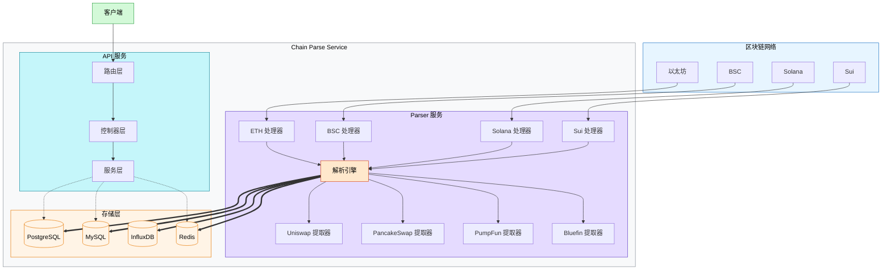

### 2.2 数据流程图

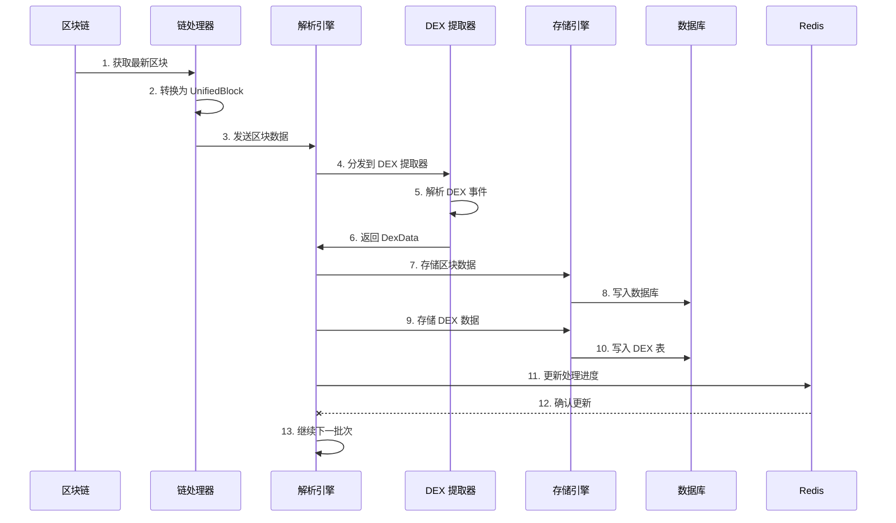

### 2.3 组件交互图

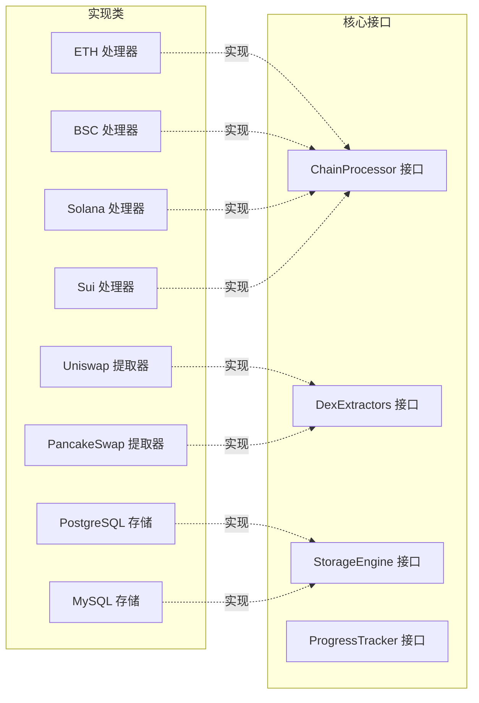

### 2.4 DEX Extractor 的组合关系图
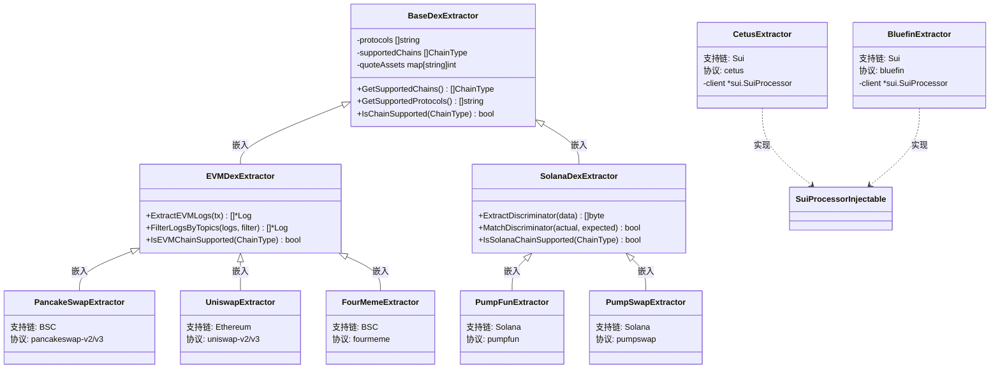

### 2.5 Processor 的组合关系图
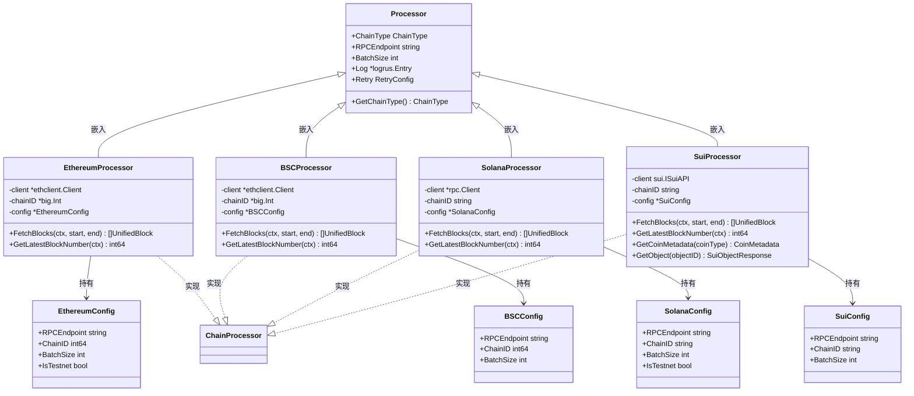


### 2.6 存储层结构体组合关系图

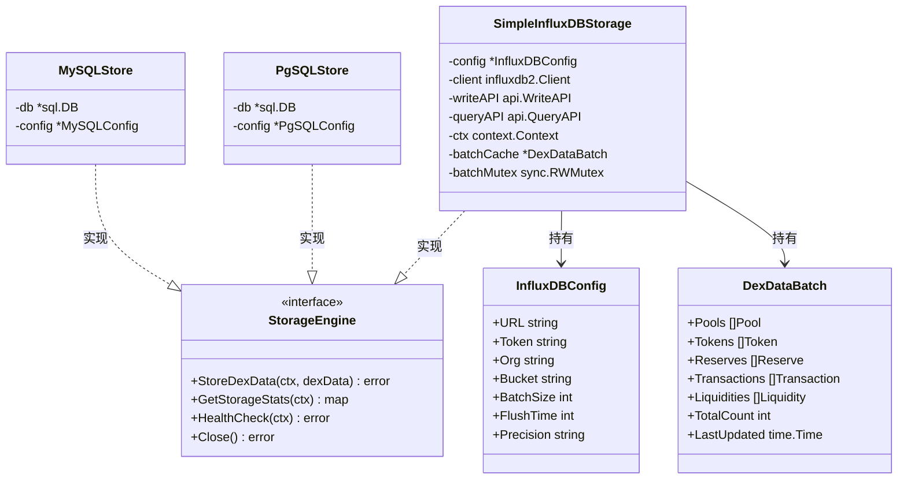


### 2.7 项目核心结构体组合关系图

```mermaid
classDiagram
    direction TB

    %% ========== 应用入口层 ==========
    class application {
        +engine *Engine
        +redisClient *redis.Client
    }

    %% ========== 引擎层 ==========
    class Engine {
        -chainProcessors map~ChainType~ChainProcessor~~
        -dexExtractors []DexExtractors
        -storage StorageEngine
        -progressTracker ProgressTracker
        -config *EngineConfig
        -running bool
        -mu sync.RWMutex
        -ctx context.Context
        -cancel context.CancelFunc
        +Start() error
        +Stop()
        +RegisterChainProcessor(processor)
        +RegisterDexExtractor(extractor)
    }

    class EngineConfig {
        +BatchSize int
        +ProcessInterval time.Duration
        +MaxRetries int
        +ConcurrentChains int
        +RealTimeMode bool
        +ChainConfigs map~ChainType~ChainConfig~~
    }

    %% ========== 接口层 ==========
    class ChainProcessor {
        <<interface>>
        +GetChainType() ChainType
        +GetLatestBlockNumber(ctx) *big.Int
        +GetBlocksByRange(ctx, start, end) []UnifiedBlock
        +GetBlock(ctx, blockNumber) UnifiedBlock
        +HealthCheck(ctx) error
    }

    class DexExtractors {
        <<interface>>
        +GetSupportedProtocols() []string
        +GetSupportedChains() []ChainType
        +ExtractDexData(ctx, blocks) *DexData
        +SupportsBlock(block) bool
    }

    class StorageEngine {
        <<interface>>
        +StoreDexData(ctx, dexData) error
        +GetStorageStats(ctx) map
        +HealthCheck(ctx) error
        +Close() error
    }

    class ProgressTracker {
        <<interface>>
        +GetProgress(chainType) ProcessProgress
        +UpdateProgress(chainType, progress) error
        +SetProcessingStatus(chainType, status) error
        +RecordError(chainType, err) error
        +HealthCheck() error
    }

    class SuiProcessorInjectable {
        <<interface>>
        +SetSuiProcessor(processor)
    }

    %% ========== 链处理器基类 ==========
    class Processor {
        +ChainType ChainType
        +RPCEndpoint string
        +BatchSize int
        +Log *logrus.Entry
        +Retry RetryConfig
    }

    class BSCProcessor {
        -client *ethclient.Client
        -chainID *big.Int
        -config *BSCConfig
    }

    class EthereumProcessor {
        -client *ethclient.Client
        -chainID *big.Int
        -config *EthereumConfig
    }

    class SolanaProcessor {
        -client *rpc.Client
        -chainID string
        -config *SolanaConfig
    }

    class SuiProcessor {
        -client sui.ISuiAPI
        -chainID string
        -config *SuiConfig
    }

    %% ========== DEX 提取器基类 ==========
    class BaseDexExtractor {
        -protocols []string
        -supportedChains []ChainType
        -quoteAssets map~string~int~
        -log *logrus.Entry
        -cacheMutex sync.RWMutex
    }

    class EVMDexExtractor {
        +ExtractEVMLogs(tx) []*Log
        +FilterLogsByTopics(logs, filter) []*Log
    }

    class SolanaDexExtractor {
        +ExtractDiscriminator(data) []byte
        +MatchDiscriminator(actual, expected) bool
    }

    %% ========== DEX 提取器 - EVM ==========
    class PancakeSwapExtractor {
        支持链: BSC
        协议: pancakeswap-v2/v3
    }

    class UniswapExtractor {
        支持链: Ethereum
        协议: uniswap-v2/v3
    }

    class FourMemeExtractor {
        支持链: BSC
        协议: fourmeme
    }

    %% ========== DEX 提取器 - Solana ==========
    class PumpFunExtractor {
        支持链: Solana
        协议: pumpfun
    }

    class PumpSwapExtractor {
        支持链: Solana
        协议: pumpswap
    }

    %% ========== DEX 提取器 - Sui ==========
    class CetusExtractor {
        支持链: Sui
        协议: cetus
        -client *sui.SuiProcessor
        -tokenCache map
        -config *CetusConfig
    }

    class BluefinExtractor {
        支持链: Sui
        协议: bluefin
        -client *sui.SuiProcessor
        -tokenCache map
        -poolCache map
    }

    %% ========== DEX 事件提取器（组合入口） ==========
    class DEXExtractor {
        -supportedChains []ChainType
        -factory *ExtractorFactory
        +GetSupportedProtocols() []string
        +GetSupportedChains() []ChainType
        +ExtractDexData(ctx, blocks) *DexData
        +SupportsBlock(block) bool
    }

    %% ========== 提取器工厂 ==========
    class ExtractorFactory {
        -extractors map~string~DexExtractors~
        +RegisterExtractor(name, extractor)
        +GetAllExtractors() []DexExtractors
    }

    %% ========== 存储层 ==========
    class MySQLStore {
        -db *sql.DB
        -config *MySQLConfig
    }

    class PgSQLStore {
        -db *sql.DB
        -config *PgSQLConfig
    }

    class SimpleInfluxDBStorage {
        -config *InfluxDBConfig
        -client influxdb2.Client
        -writeAPI api.WriteAPI
        -queryAPI api.QueryAPI
        -ctx context.Context
        -batchCache *DexDataBatch
        -batchMutex sync.RWMutex
    }

    class RedisProgressTracker {
        -client *redis.Client
        -keyPrefix string
        -maxErrorHistory int
    }

    class MemoryProgressTracker {
        -progresses map~ChainType~ProcessProgress~
        -stats map~ChainType~ProcessingStats~
        -errors map~ChainType~~ProcessingError~
    }

    %% ========== 数据模型 ==========
    class DexData {
        +Pools []Pool
        +Transactions []Transaction
        +Liquidities []Liquidity
        +Reserves []Reserve
        +Tokens []Token
    }

    %% ========== 组合关系 ==========

    application *-- Engine : 持有
    application *-- RedisClient : 持有

    Engine o-- ChainProcessor : 持有多个
    Engine o-- DexExtractors : 持有多个
    Engine o-- StorageEngine : 持有
    Engine o-- ProgressTracker : 持有
    Engine *-- EngineConfig : 持有

    Processor <|-- BSCProcessor : 嵌入
    Processor <|-- EthereumProcessor : 嵌入
    Processor <|-- SolanaProcessor : 嵌入
    Processor <|-- SuiProcessor : 嵌入

    BSCProcessor ..|> ChainProcessor : 实现
    EthereumProcessor ..|> ChainProcessor : 实现
    SolanaProcessor ..|> ChainProcessor : 实现
    SuiProcessor ..|> ChainProcessor : 实现

    BaseDexExtractor <|-- EVMDexExtractor : 嵌入
    BaseDexExtractor <|-- SolanaDexExtractor : 嵌入

    EVMDexExtractor <|-- PancakeSwapExtractor : 嵌入
    EVMDexExtractor <|-- UniswapExtractor : 嵌入
    EVMDexExtractor <|-- FourMemeExtractor : 嵌入

    SolanaDexExtractor <|-- PumpFunExtractor : 嵌入
    SolanaDexExtractor <|-- PumpSwapExtractor : 嵌入

    CetusExtractor ..|> SuiProcessorInjectable : 实现
    BluefinExtractor ..|> SuiProcessorInjectable : 实现

    PancakeSwapExtractor ..|> DexExtractors : 实现
    UniswapExtractor ..|> DexExtractors : 实现
    FourMemeExtractor ..|> DexExtractors : 实现
    PumpFunExtractor ..|> DexExtractors : 实现
    PumpSwapExtractor ..|> DexExtractors : 实现
    CetusExtractor ..|> DexExtractors : 实现
    BluefinExtractor ..|> DexExtractors : 实现

    ExtractorFactory o-- DexExtractors : 持有多个

    DEXExtractor *-- ExtractorFactory : 持有
    DEXExtractor ..|> DexExtractors : 实现

    MySQLStore ..|> StorageEngine : 实现
    PgSQLStore ..|> StorageEngine : 实现
    SimpleInfluxDBStorage ..|> StorageEngine : 实现

    RedisProgressTracker ..|> ProgressTracker : 实现
    MemoryProgressTracker ..|> ProgressTracker : 实现

    DexData *-- Pool : 包含
    DexData *-- Transaction : 包含
    DexData *-- Liquidity : 包含
    DexData *-- Reserve : 包含
    DexData *-- Token : 包含
```

## 3. 目录结构

```
chain-parse-service/
├── cmd/                        # 应用程序入口
│   ├── parser/                 # 解析服务入口
│   │   └── main.go            # Parser 服务启动文件
│   └── api/                    # API 服务入口
│       └── main.go            # API 服务启动文件
│
├── configs/                    # 配置文件
│   ├── base.yaml              # 共享基础配置
│   ├── api.yaml               # API 服务配置
│   ├── bsc.yaml               # BSC 链配置
│   ├── ethereum.yaml          # 以太坊链配置
│   ├── solana.yaml            # Solana 链配置
│   └── sui.yaml               # Sui 链配置
│
├── database/                   # 数据库脚本
│   ├── mysql/                 # MySQL 建表脚本
│   │   └── schema.sql
│   └── pgsql/                 # PostgreSQL 建表脚本
│       └── schema.sql
│
├── docker/                     # Docker 部署
│   ├── docker-compose.yml     # 服务编排
│   ├── Dockerfile             # 镜像构建
│   └── .env.example           # 环境变量模板
│
├── internal/                   # 内部代码
│   ├── api/                   # API 层
│   │   ├── controller/        # 请求处理器
│   │   ├── middleware/        # HTTP 中间件
│   │   ├── router/            # 路由定义
│   │   └── service/           # 业务逻辑
│   │
│   ├── config/                # 配置管理
│   │   └── config.go
│   │
│   ├── model/                 # 数据模型
│   │   ├── token.go           # Token 模型
│   │   ├── pool.go            # Pool 模型
│   │   ├── reserve.go         # Reserve 模型
│   │   ├── liquidity.go       # Liquidity 模型
│   │   └── transaction.go     # Transaction 模型
│   │
│   ├── parser/                # 解析引擎
│   │   ├── chains/            # 链处理器
│   │   │   ├── base/          # 基础处理器
│   │   │   ├── bsc/           # BSC 处理器
│   │   │   ├── ethereum/      # 以太坊处理器
│   │   │   ├── solana/        # Solana 处理器
│   │   │   └── sui/           # Sui 处理器
│   │   │
│   │   ├── dexs/              # DEX 提取器
│   │   │   ├── bsc/           # BSC DEX
│   │   │   │   ├── pancakeswap/
│   │   │   │   └── fourmeme/
│   │   │   ├── eth/           # 以太坊 DEX
│   │   │   │   └── uniswap/
│   │   │   ├── solanadex/     # Solana DEX
│   │   │   │   ├── pumpfun/
│   │   │   │   └── pumpswap/
│   │   │   └── suidex/        # Sui DEX
│   │   │       └── bluefin/
│   │   │
│   │   └── engine/            # 解析引擎
│   │       └── engine.go
│   │
│   ├── storage/               # 存储层
│   │   ├── mysql/             # MySQL 实现
│   │   ├── pgsql/             # PostgreSQL 实现
│   │   └── influxdb/          # InfluxDB 实现
│   │
│   ├── types/                 # 类型定义
│   │   └── interfaces.go      # 核心接口
│   │
│   └── app/                   # 应用初始化
│
├── docs/                      # 文档
├── Makefile                   # 构建自动化
├── go.mod                     # Go 模块依赖
├── go.sum                     # 依赖校验和
└── README.md                  # 项目说明
```

## 4. 支持的链和协议

### 4.1 支持的区块链

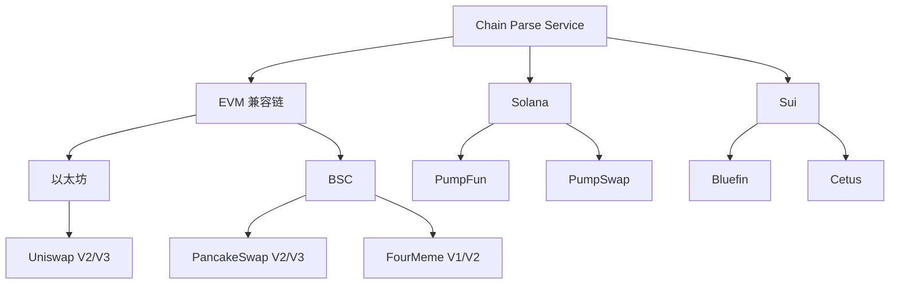

### 4.2 协议支持详情

| 链 | 协议 | 类型 | 状态 |
|---|------|------|------|
| BSC | PancakeSwap V2/V3 | AMM | ✅ |
| BSC | FourMeme V1/V2 | Bonding Curve | ✅ |
| Ethereum | Uniswap V2/V3 | AMM | ✅ |
| Solana | PumpFun | Bonding Curve | ✅ |
| Solana | PumpSwap | Bonding Curve | ✅ |
| Sui | Bluefin | Move DEX | ✅ |
| Sui | Cetus | Move DEX | ✅ |

## 5. 数据模型

### 5.1 核心数据模型

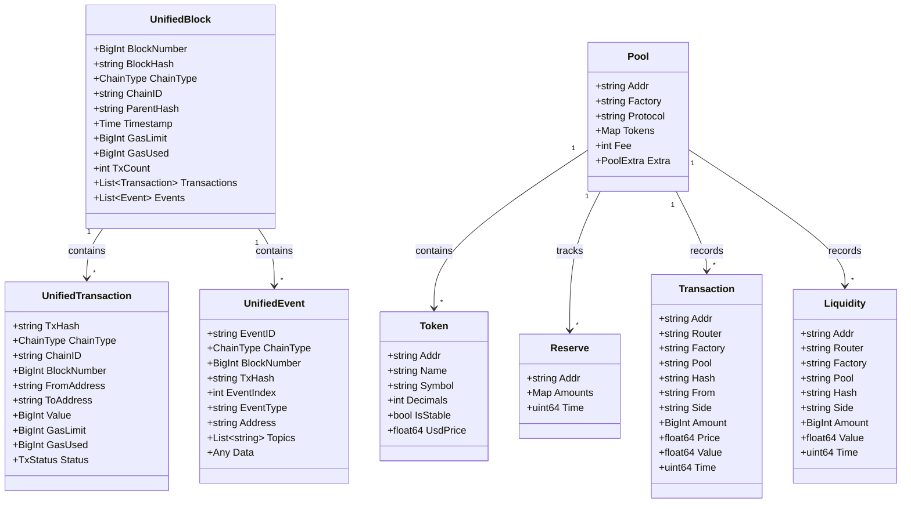

### 5.2 数据库表结构

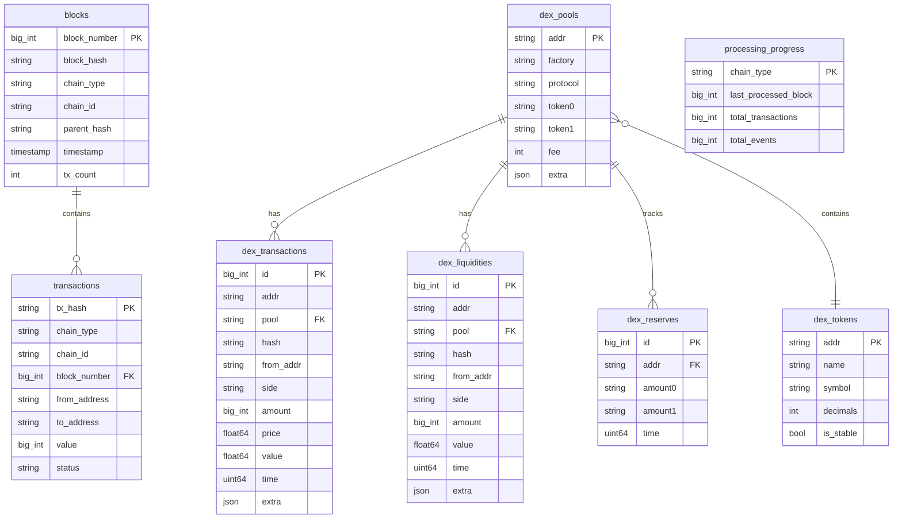

## 6. 核心接口

### 6.1 ChainProcessor 接口

区块链处理器接口，所有链实现必须遵循：

```go
type ChainProcessor interface {
    GetChainType() ChainType
    GetChainID() string
    GetLatestBlockNumber(ctx context.Context) (*big.Int, error)
    GetBlocksByRange(ctx context.Context, startBlock, endBlock *big.Int) ([]UnifiedBlock, error)
    GetBlock(ctx context.Context, blockNumber *big.Int) (*UnifiedBlock, error)
    GetTransaction(ctx context.Context, txHash string) (*UnifiedTransaction, error)
    HealthCheck(ctx context.Context) error
}
```

### 6.2 DexExtractors 接口

DEX 事件提取器接口：

```go
type DexExtractors interface {
    GetSupportedProtocols() []string
    GetSupportedChains() []ChainType
    ExtractDexData(ctx context.Context, blocks []UnifiedBlock) (*DexData, error)
    SupportsBlock(block *UnifiedBlock) bool
}
```

### 6.3 StorageEngine 接口

存储引擎接口：

```go
type StorageEngine interface {
    StoreBlocks(ctx context.Context, blocks []UnifiedBlock) error
    StoreTransactions(ctx context.Context, txs []UnifiedTransaction) error
    StoreDexData(ctx context.Context, dexData *DexData) error
    GetTransactionsByHash(ctx context.Context, hashes []string) ([]UnifiedTransaction, error)
    GetStorageStats(ctx context.Context) (map[string]interface{}, error)
    HealthCheck(ctx context.Context) error
    Close() error
}
```

### 6.4 ProgressTracker 接口

进度追踪接口：

```go
type ProgressTracker interface {
    GetProgress(chainType ChainType) (*ProcessProgress, error)
    UpdateProgress(chainType ChainType, progress *ProcessProgress) error
    GetProcessingStats(chainType ChainType) (*ProcessingStats, error)
    GetGlobalStats() (*GlobalProcessingStats, error)
    SetProcessingStatus(chainType ChainType, status ProcessingStatus) error
    RecordError(chainType ChainType, err error) error
    HealthCheck() error
}
```

## 7. API 接口

### 7.1 API 端点

| 方法 | 路径 | 描述 |
|------|------|------|
| GET | /health | 健康检查 |
| GET | /api/v1/transactions/:hash | 根据哈希获取交易 |
| GET | /api/v1/storage/stats | 存储统计信息 |
| GET | /api/v1/progress | 链处理进度 |
| GET | /api/v1/progress/stats | 全局处理统计 |

### 7.2 API 架构图

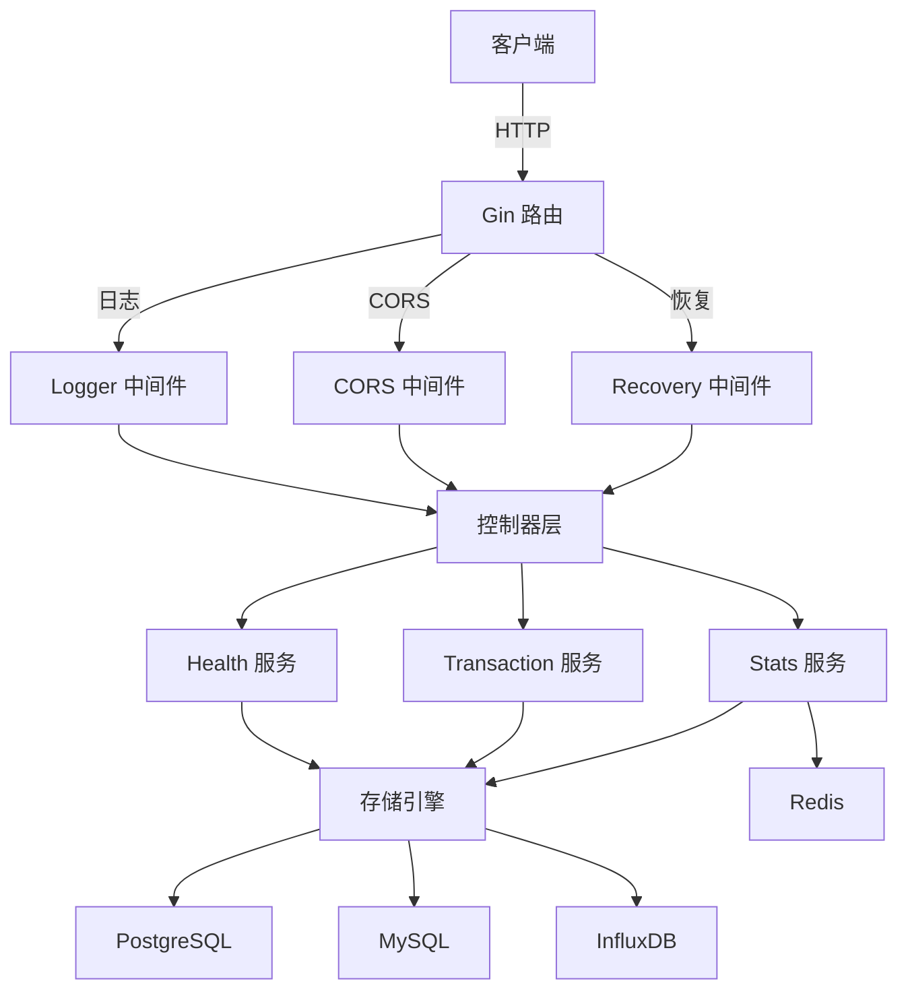

## 8. 配置管理

### 8.1 配置层次结构

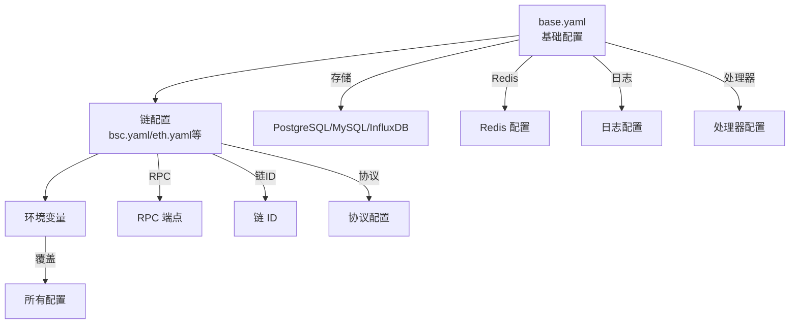

### 8.2 配置文件示例

**base.yaml（基础配置）**
```yaml
api:
  port: 8081
  read_timeout: 30
  write_timeout: 30

redis:
  host: "localhost"
  port: 6379
  db: 0

processor:
  batch_size: 10
  max_concurrent: 10
  retry_delay: 5
  max_retries: 3

storage:
  type: "pgsql"  # pgsql, mysql, influxdb
  pgsql:
    host: "localhost"
    port: 5432
    username: "postgres"
    password: "password"
    database: "unified_tx_parser"
```

**bsc.yaml（链配置）**
```yaml
chains:
  bsc:
    enabled: true
    rpc_endpoint: "https://bsc.publicnode.com"
    chain_id: "bsc-mainnet"
    batch_size: 10

protocols:
  pancakeswap:
    enabled: true
    chain: "bsc"
    contract_addresses:
      - "0xcA143Ce32Fe78f1f7019d7d551a6402fC5350c73"
```

## 9. 部署架构

### 9.1 Docker 部署架构

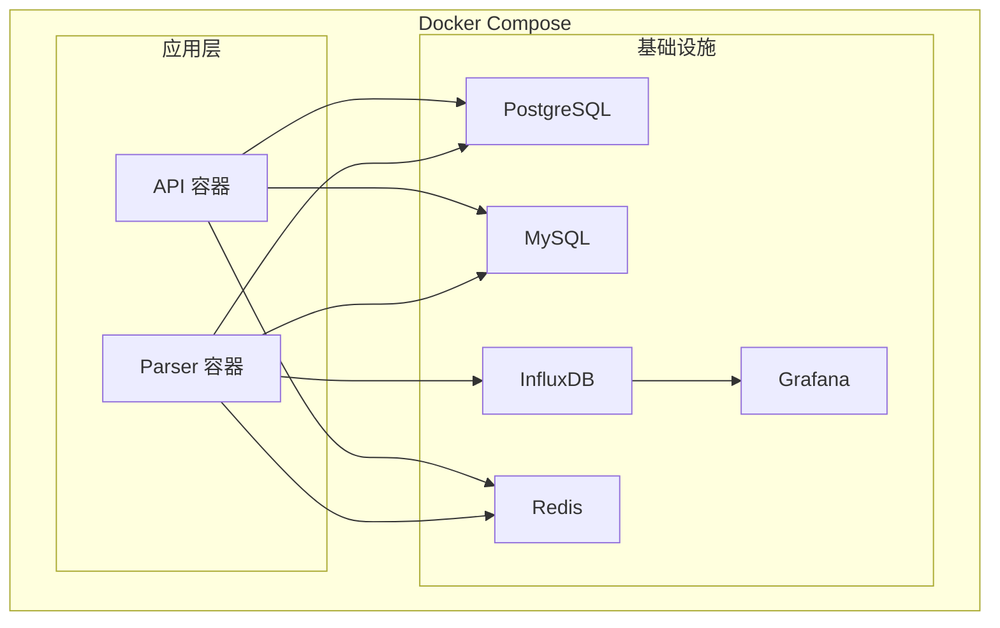

### 9.2 部署命令

```bash
# 构建镜像
make docker-build

# 启动基础设施
docker compose -f docker/docker-compose.yml --profile base up -d

# 启动完整栈
CHAIN_TYPE=bsc docker compose -f docker/docker-compose.yml --profile app up -d

# 查看日志
make docker-logs

# 停止服务
make docker-down
```

## 10. 设计模式

### 10.1 工厂模式

DEX 提取器使用工厂模式注册和管理：

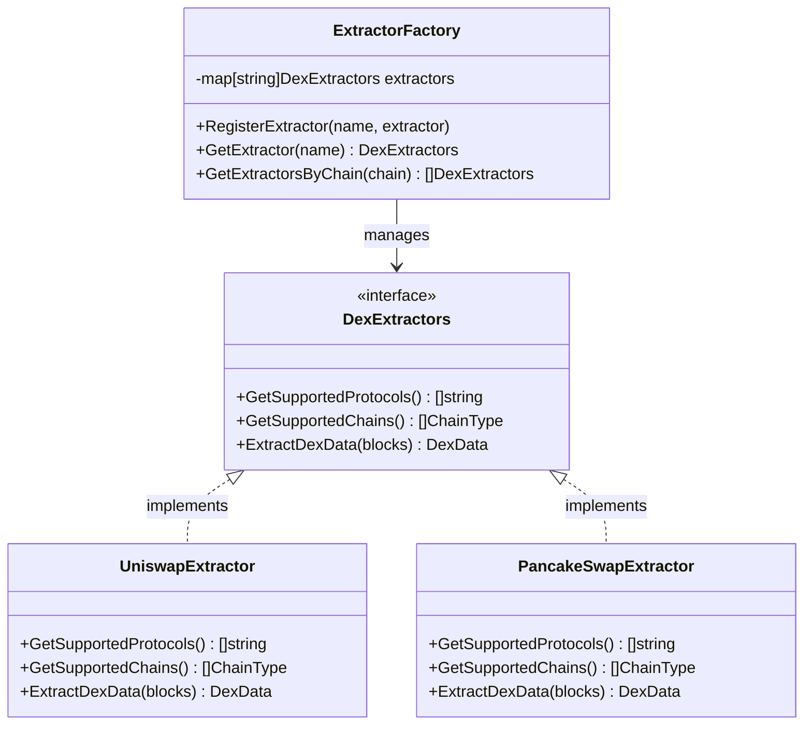

### 10.2 策略模式

不同链使用不同的处理策略：

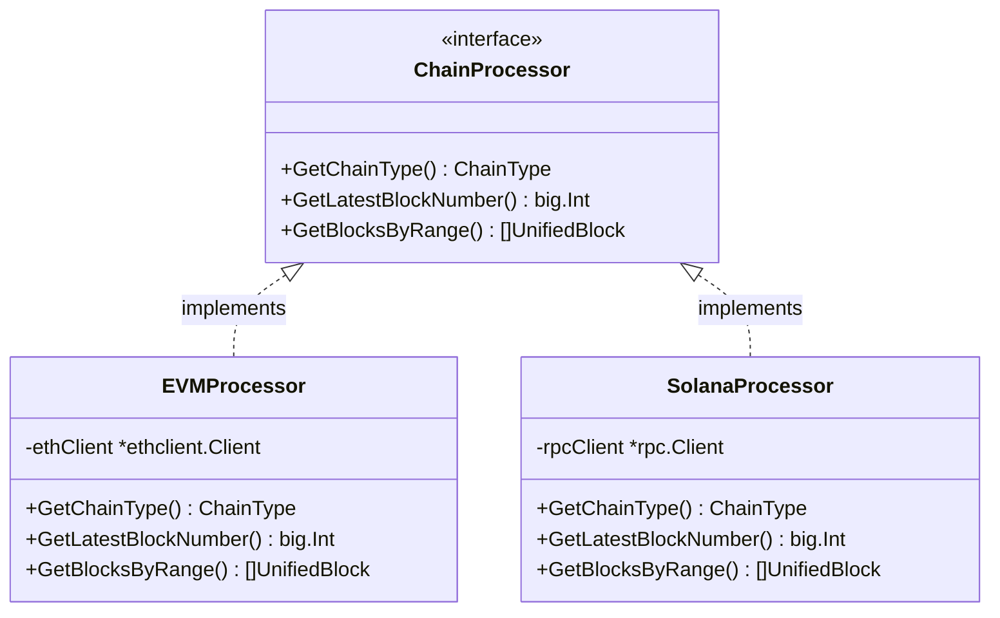

### 10.3 仓储模式

存储层使用仓储模式抽象数据访问：

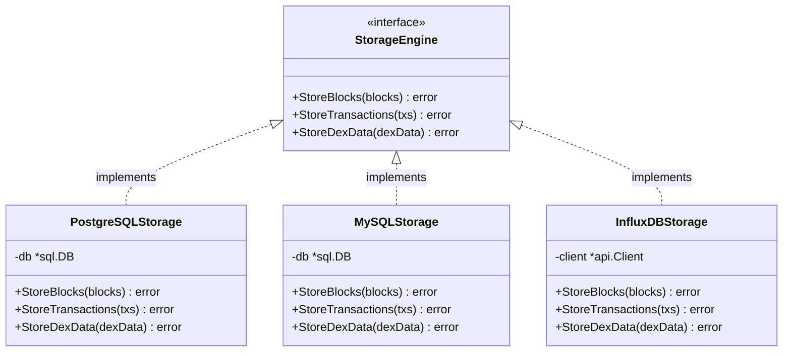

## 11. 运行流程

### 11.1 Parser 服务启动流程

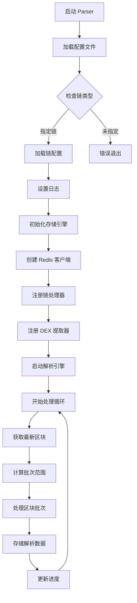

### 11.2 API 服务启动流程

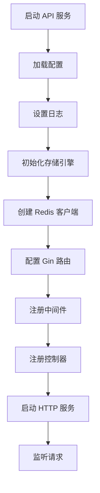

## 12. 监控与可观测性

### 12.1 监控架构

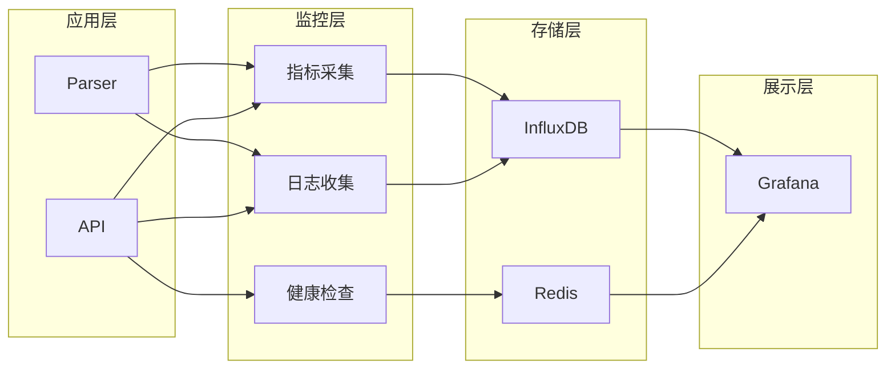

### 12.2 健康检查端点

- **GET /health**: 服务健康状态
- **GET /api/v1/storage/stats**: 存储统计
- **GET /api/v1/progress**: 各链处理进度
- **GET /api/v1/progress/stats**: 全局处理统计

## 13. 快速开始

### 13.1 环境要求

- Go 1.21+
- Docker & Docker Compose
- Make

### 13.2 启动步骤

```bash
# 1. 启动基础设施
cd docker
docker compose up -d postgres redis

# 2. 启动 Parser（选择一条链）
make run-parser CHAIN=bsc

# 3. 启动 API 服务
make run-api

# 4. 测试 API
curl http://localhost:8081/health
```

## 14. 开发指南

### 14.1 添加新链支持

1. 在 `internal/parser/chains/` 下创建新目录
2. 实现 `ChainProcessor` 接口
3. 在 `configs/` 下添加链配置文件
4. 注册到解析引擎

### 14.2 添加新 DEX 协议

1. 在 `internal/parser/dexs/{chain}/` 下创建目录
2. 实现 `DexExtractors` 接口
3. 在配置文件中启用协议
4. 注册到提取器工厂

### 14.3 常用命令

```bash
make build-all       # 编译所有服务
make test            # 运行测试
make test-cover      # 测试覆盖率
make vet             # 静态检查
make fmt             # 格式化代码
make clean           # 清理构建产物
```

## 15. 许可证

本项目采用 MIT 许可证。
