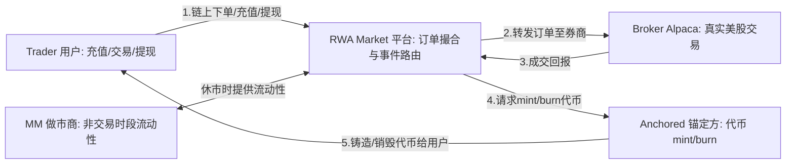

# RWA 代币化平台 -- 产品需求文档 (PRD)

> **产品经理**: PM Agent
> **版本**: v1.6
> **日期**: 2026-03-08
> **状态**: 开发中

---

## 一、项目概述

### 1.1 产品定位

RWA（Real World Assets）代币化平台，将传统美股资产映射为链上 ERC20 代币。用户通过链上合约下单，后端服务监听合约事件后到 Alpaca 美股市场执行真实交易，成交后通过合约 mint 对应的股票代币给用户。

### 1.2 核心价值

- 用户无需传统券商账户，通过链上操作即可交易美股
- 股票代币 7x24 可转账（非交易时段由做市商提供流动性）
- 资金透明，链上可追溯

### 1.3 业务角色

| 角色 | 说明 |
|------|------|
| **Trader（用户）** | 终端用户，通过 DApp 进行充值、交易、提现 |
| **RWA Market（平台）** | 核心市场，处理代币化资产的交易撮合 |
| **MM（做市商）** | 非交易时段提供流动性 |
| **Anchored（锚定方）** | 资产锚定和代币发行方，连接链上链下 |
| **Broker（Alpaca）** | 传统美股券商，执行真实股票交易 |

**角色关系图**:



**协作流程说明**:

1. **Trader → RWA Market**：用户通过 DApp 与平台合约交互，提交订单、充值 USDC、提现 USDM
2. **RWA Market → Broker**：平台监听到链上订单事件后，通过 Alpaca API 在真实美股市场执行交易
3. **Broker → RWA Market**：Alpaca 成交回报（filled）触发后续链上操作
4. **RWA Market → Anchored**：平台请求锚定方完成代币操作 —— 买入成交后 mint 股票代币（如 AAPL.anc），卖出成交后 burn 股票代币并 mint USDM
5. **Anchored → Trader**：代币直接铸造到用户地址，完成链上资产交付
6. **MM ↔ RWA Market**：美股休市（非交易时段）时，做市商代替 Broker 在平台内提供流动性，使用户可 7×24 交易

### 1.4 代币体系

| 代币 | 精度 | 说明 |
|------|------|------|
| USDC | 6 位 | 底层稳定币，用户入金/出金使用 |
| USDM (ancUSDC) | 18 位 | 平台稳定币，1:1 锚定 USDC，用于平台内交易 |
| XXX.anc（如 AAPL.anc） | 18 位 | 股票代币，代表对应美股资产份额 |
| pendingAncUSDC | 18 位 | 充值挂起凭证（仅生产级 Gate 使用） |
| pendingUSDC | 6 位 | 提现挂起凭证（仅生产级 Gate 使用） |

---

## 二、Phase 规划总览

| Phase | 主题 | 优先级 | 状态 |
|-------|------|--------|------|
| Phase 1 | 合约基础 + 后端框架 | P0 | ✅ 已完成 |
| Phase 2 | 核心交易流程 | P0 | ✅ 已完成 |
| Phase 3 | 资金管理（充值/提现） | P1 | 🟡 合约已完成，后端 Gate handlers 待开发 |
| Phase 4 | API + 实时行情推送 | P2 | ✅ 已完成 |
| Phase 5 | 做市商 + 非交易时段 | P3 | 规划中 |

---

## 三、Phase 1 -- 合约基础 + 后端框架

> **目标**: 合约部署就绪，后端服务框架跑通，能监听链上事件

### F1.1 合约部署与初始化

**用户故事**: 作为管理员，我需要部署并初始化所有基础合约，以便系统可以开始运作。

**已有合约**:

| 合约 | 文件 | 状态 |
|------|------|------|
| OrderContract | `contracts/poc/Order.sol` | 已完成 |
| PocGate | `contracts/poc/PocGate.sol` | 已完成 |
| PocToken | `contracts/poc/PocToken.sol` | 已完成 |
| MockUSDC | `contracts/poc/MockUSDC.sol` | 已完成 |
| Gate（生产级） | `contracts/gate/Gate.sol` | 已完成 |
| AnchoredToken | `contracts/AnchoredToken.sol` | 已完成 |

**验收标准**:
- [x] AC1: OrderContract 初始化成功，USDM 地址、admin、backend 角色正确设置
- [x] AC2: PocGate 初始化成功，USDC/USDM 地址正确，最低充提金额设置
- [x] AC3: PocToken（USDM）部署成功，Gate 和 OrderContract 拥有 MINTER/BURNER 角色
- [x] AC4: 至少一个股票代币（如 AAPL.anc）通过 `setSymbolToken` 注册到 OrderContract
- [x] AC5: 部署脚本可重复执行，支持 testnet 和 mainnet 两套配置

**负责人**: Contract Engineer

---

### F1.2 数据库 Schema 设计

**用户故事**: 作为后端开发者，我需要数据库表结构就绪，以便存储订单、账户、持仓等业务数据。

**已有 Model**:

| 表 | Model | 说明 |
|----|-------|------|
| orders | `Order` | 订单记录 |
| order_executions | `OrderExecution` | 订单成交明细 |
| account | `Account` | 用户账户（链上地址） |
| stocks | `Stock` | 支持的股票列表 |
| trading_accounts | `TradingAccount` | Alpaca 交易账户 |
| positions | `Position` | 用户持仓 |
| event_logs | `EventLog` | 链上事件日志 |

**验收标准**:
- [x] AC1: 数据库迁移脚本正确创建所有表
- [x] AC2: `orders` 表包含完整字段：client_order_id, symbol, side, type, quantity, price, status, external_order_id 等
- [x] AC3: 索引正确创建（account_id, symbol, status, contract_tx_hash）
- [x] AC4: 迁移脚本可重复执行（幂等）

**负责人**: Golang Developer

---

### F1.3 Indexer 基础框架

**用户故事**: 作为系统，我需要 Indexer 服务能实时监听链上事件并正确解析处理。

**实现方案**: 采用链上直接轮询模式（非 Kafka），核心机制如下：

- **RPC 轮询**: 直接通过 RPC 调用 `FilterLogs` 轮询区块事件，按配置的合约地址和事件签名过滤
- **断点续传**: `event_client_record` 表记录每个事件客户端已处理的区块高度，重启后从上次位置继续
- **确认区块机制**: 支持配置 confirmation blocks 数量，仅处理已确认的区块，避免链重组导致的数据不一致
- **事务原子性**: `ProcessBatch` 批量处理事件，事件解析、业务处理、区块高度更新在同一数据库事务中完成

**验收标准**:
- [x] AC1: Indexer 服务启动成功，Uber FX 依赖注入正常
- [x] AC2: 能通过 RPC `FilterLogs` 轮询指定合约的链上事件
- [x] AC3: 能根据 topic0 将事件路由到对应 handler
- [x] AC4: 已注册的事件 handler：OrderSubmitted, OrderExecuted, OrderCancelled, CancelRequested, PocToken Transfer, TokensMinted
- [x] AC5: 事件处理有幂等保证（相同 txHash + logIndex 不重复处理）
- [x] AC6: `event_client_record` 表正确记录已处理区块高度，支持断点续传
- [x] AC7: confirmation blocks 机制正常工作，避免处理未确认区块

**负责人**: Golang Developer

---

### F1.4 Alpaca SDK 集成

**用户故事**: 作为后端服务，我需要能调用 Alpaca API 执行美股交易操作。

**SDK**: `github.com/alpacahq/alpaca-trade-api-go/v3`
**API 文档**: https://docs.alpaca.markets/reference/api-references

**验收标准**:
- [x] AC1: Alpaca Client 初始化成功（API Key/Secret 从环境变量读取）
- [x] AC2: 支持 Paper Trading 和 Live Trading 环境切换
- [x] AC3: 能调用 `PlaceOrder` 下单（Market / Limit）
- [x] AC4: 能调用 `GetOrder` 查询订单状态
- [x] AC5: 能调用 `CancelOrder` 取消订单
- [x] AC6: 能调用 `GetAccount` 查询账户信息
- [x] AC7: 错误处理完善（网络超时、API 限流、认证失败）

**负责人**: Golang Developer

---

## 四、Phase 2 -- 核心交易流程

> **目标**: 用户在链上下单 → 后端监听事件 → Alpaca 执行交易 → 成交后 mint 代币，完整流程跑通

### F2.1 买入流程（Buy Order）

**用户故事**: 作为用户，我在链上提交买入订单（如买 10 股 AAPL），系统自动在 Alpaca 执行真实买入，成交后我收到对应数量的 AAPL.anc 代币。

**流程**:

```
用户 → approve USDM → submitOrder(AAPL, 10, price, Buy, Market/Limit, DAY)
  → 合约锁定 USDM（price * qty）
  → emit OrderSubmitted 事件
  → Indexer 轮询链上事件 → 创建 DB 订单（status=pending）
  → 调用 Alpaca PlaceOrder
  → 更新 DB 订单（status=accepted, external_order_id=xxx）
  → Alpaca Stream 监听到 filled
  → 更新 DB 订单（status=filled, filled_qty, filled_price）
  → 后端调用合约 markExecuted（退还多余 USDM）
  → 后端调用 PocToken.mint（mint AAPL.anc 给用户）
  → 更新 DB 订单（status=filled）
  → WebSocket 通知用户
```

**状态说明**:

| 阶段 | 状态 | 含义 |
|------|------|------|
| 链上 | approve USDM | 授权 OrderContract 合约可从用户地址扣取 USDM |
| 链上 | 合约锁定 USDM | submitOrder 时将 `price * qty` 的 USDM 转入合约托管（escrow），防止资金不足 |
| 链上 | markExecuted | 成交后合约结算，扣除实际成交金额，退还多余 USDM（市价单实际价格可能低于报价） |
| DB | pending | Indexer 监听到 `OrderSubmitted` 事件，用户已下单，等待提交到 Alpaca |
| DB | accepted | Alpaca 下单成功并返回 `external_order_id`，券商已受理订单 |
| DB | filled | Alpaca Stream 监听到 `filled` 事件，订单完全成交，触发 `markExecuted` 结算和 `mint` 铸造代币 |

**qty和price说明**:
- qty（quantity）= 10，要买的股数（10 股 AAPL）
- price = 用户愿意支付的每股价格（如 $180.5）

合约锁定的 USDM = price × qty，即这笔订单的最大花费（如 180.5 × 10 = 1805 USDM）。

成交后通过 markExecuted 多退少补：
- 市价单：实际成交价可能低于报价，多余部分退还
- 限价单：按指定价格成交，差额退还

**订单生命周期**:

```
pending → accepted → filled
   │                     │
   └→ rejected/cancelled └→ 结束（退款）
```

**验收标准**:
- [x] AC1: Indexer 正确解析 `OrderSubmitted` 事件，提取 user, orderId, symbol, qty, price, side, orderType, tif
- [x] AC2: DB 创建订单记录，client_order_id 对应链上 orderId
- [x] AC3: 调用 Alpaca `PlaceOrder`，symbol 映射正确（AAPL.anc → AAPL）
- [x] AC4: Alpaca 下单成功后，DB 记录 external_order_id
- [x] AC5: Alpaca Stream 监听到 `fill` 事件后更新 DB（filled_qty, filled_price, filled_at）
- [x] AC6: 后端调用合约 `markExecuted(orderId, refundAmount)`，多余 USDM 退还用户
  - ✅ refundAmount = escrowAmount - (filledQty * filledPrice)，从链上查询 escrow 金额动态计算
- [x] AC7: 后端调用 `PocToken.mint(user, filledQty)` 铸造股票代币
  - ✅ markExecuted 成功后，通过 `symbolToToken(symbol)` 查询代币地址，调用 `PocToken.mint(user, filledQty)`
- [x] AC8: 市价单和限价单均能正确处理
- [x] AC9: 部分成交（partially_filled）能正确处理

**异常场景**:

| 场景 | 预期行为 |
|------|----------|
| Alpaca 下单失败（余额不足） | 调用合约 cancelOrder 退还 USDM |
| Alpaca 订单被拒绝（rejected） | 调用合约 cancelOrder 退还 USDM |
| Indexer 重复收到同一事件 | 幂等处理，不重复下单 |
| 后端 mint 代币失败 | 记录错误日志，进入人工处理队列 |
| 事件处理失败 | 写入 `failed_events` 表持久化，支持后续排查和重试 |
| fill 事件重复到达 | 通过 execution_id 去重，保证幂等性 |
| Alpaca WebSocket 断线 | 自动重连（指数退避），重连后自动重订阅 trade_updates |
| GTC 订单休市（done_for_day） | 暂停处理，等待下一交易日继续 |

> GTC(Good Till Cancelled, 撤销前有效): 是订单有效期类型（TimeInForce）的一种，意思是订单会一直有效，直到被手动取消或成交。与之对应的是 PRD 流程中出现的 DAY（当日有效），当天收盘未成交就自动过期。
> PRD 中提到 GTC 订单在休市时会收到 done_for_day 事件，暂停处理，等下一交易日继续，而不是直接过期。

**负责人**: Golang Developer + Contract Engineer

---

### F2.2 卖出流程（Sell Order）

**用户故事**: 作为用户，我在链上提交卖出订单（如卖 5 股 AAPL.anc），系统在 Alpaca 执行卖出，成交后我收到对应的 USDM。

**流程**:

```
用户 → approve AAPL.anc → submitOrder(AAPL, 5, price, Sell, Market/Limit, DAY)
  → 合约锁定 AAPL.anc（qty）
  → emit OrderSubmitted 事件
  → Indexer 消费 → 创建 DB 订单（status=pending）
  → 调用 Alpaca PlaceOrder（sell）
  → Alpaca Stream 监听到 filled
  → 后端调用合约 markExecuted（退还多余代币，如限价卖出有差额）
  → 后端调用 USDM.mint（mint USDM 给用户，金额 = filled_qty * filled_price）
  → 更新 DB 订单
  → WebSocket 通知用户
```

**验收标准**:
- [x] AC1: 卖出时合约正确锁定 AAPL.anc 代币
- [x] AC2: Alpaca 卖出订单正确执行
- [x] AC3: 成交后 mint 给用户的 USDM 金额 = filled_qty * filled_price
  - ✅ markExecuted 成功后，通过 `OrderCaller.USDM()` 查询 USDM 地址，调用 `PocToken.mint(user, filledQty * filledPrice)`
- [x] AC4: 合约 markExecuted 退还多余锁定代币
- [x] AC5: 用户 AAPL.anc 余额减少，USDM 余额增加
  - ✅ AC3 已实现，合约锁定 AAPL.anc 后 markExecuted 消耗，mint USDM 给用户

**负责人**: Golang Developer + Contract Engineer

---

### F2.3 取消订单流程

**用户故事**: 作为用户，我可以取消尚未成交的订单，锁定的资金退还给我。

**流程**:

```
用户 → cancelOrderIntent(orderId)
  → 合约将状态改为 CancelRequested
  → emit CancelRequested 事件
  → Indexer 消费 → 调用 Alpaca CancelOrder
  → Alpaca 确认取消
  → 后端调用合约 cancelOrder(orderId)
  → 合约退还全部锁定资金
  → emit OrderCancelled 事件
  → 更新 DB 订单 status=cancelled
```

**验收标准**:
- [x] AC1: 用户只能取消自己的订单
- [x] AC2: 只有 Pending 状态的订单可以发起取消意图
- [x] AC3: 后端收到 CancelRequested 事件后调用 Alpaca CancelOrder
- [x] AC4: Alpaca 取消成功后，后端调用合约 `cancelOrder` 退款
- [x] AC5: 已成交的订单不能取消
- [x] AC6: 部分成交后取消，已成交部分正常处理，未成交部分退款

**负责人**: Golang Developer + Contract Engineer

---

### F2.4 Alpaca Stream 订单状态监听

**用户故事**: 作为系统，我需要实时监听 Alpaca 的订单状态变更，以便及时触发后续操作。

**验收标准**:
- [x] AC1: 建立 Alpaca Trade WebSocket 连接，认证成功
- [x] AC2: 能接收订单状态更新：new, accepted, filled, partially_filled, cancelled, rejected, expired
- [x] AC3: 每种状态更新对应正确的后续操作
- [x] AC4: 断线自动重连（指数退避策略）
- [x] AC5: 重连后能恢复监听，不丢失事件

**状态映射**:

| Alpaca 状态 | 后端操作 |
|-------------|----------|
| new | 更新 DB status=new |
| accepted | 更新 DB status=accepted |
| partially_filled | 更新 filled_qty, filled_price（execution_id 去重） |
| filled | 更新 DB → 调用合约 markExecuted → mint 代币（execution_id 去重） |
| cancelled | 无部分成交 → 调用合约 cancelOrder 全额退款；有部分成交 → 调用 markExecuted（结算已成交 + refund 未成交）+ mint 代币 |
| rejected | 调用合约 cancelOrder → 全额退款 |
| expired | 同 cancelled 逻辑（部分成交 → markExecuted + mint，无成交 → cancelOrder） |
| done_for_day | GTC 订单休市暂停，仅记录日志，待下一交易日继续 |

**负责人**: Golang Developer

---

## 五、Phase 3 -- 资金管理（充值/提现）

> **当前状态**: 合约（PocGate）已完成并通过测试。后端 Gate 事件 handler 完全未开发。

> **目标**: 用户可以用 USDC 充值获取 USDM，也可以将 USDM 提现为 USDC

### F3.1 充值流程（USDC → USDM）-- POC 版

**用户故事**: 作为用户，我将 USDC 存入 Gate 合约，立即获得等值的 USDM，用于在平台内交易。

**流程（PocGate -- 简化版，无挂起状态）**:

```
用户 → approve USDC 给 PocGate
  → PocGate.deposit(usdcAmount)
  → 合约转入 USDC，mint USDM 给用户（精度自动转换 6→18 位）
  → 用户获得 USDM
```

**验收标准**:
- [x] AC1: 用户 approve USDC 后调用 deposit 成功（合约已实现）
- [x] AC2: USDC 从用户转入 Gate 合约（合约已实现）
- [x] AC3: 用户获得的 USDM 金额 = usdcAmount * 10^12（6位→18位精度转换）（合约已实现）
- [x] AC4: 低于 minimumDepositAmount 拒绝充值（合约已实现）
- [x] AC5: depositsArePaused=true 时拒绝充值（合约已实现）
- [x] AC6: 零金额充值被拒绝（合约已实现）
- [ ] AC7: 后端 Indexer 监听 Deposited 事件并记录到 DB（❌ 未实现）

**负责人**: Contract Engineer（合约已完成 ✅） + Golang Developer（后端 handler 待开发 ❌）

---

### F3.2 提现流程（USDM → USDC）-- POC 版

**用户故事**: 作为用户，我将 USDM 提交给 Gate 合约，立即获得等值的 USDC。

**流程（PocGate -- 简化版）**:

```
用户 → approve USDM 给 PocGate
  → PocGate.withdraw(usdmAmount)
  → 合约转入并 burn USDM，返还 USDC 给用户（精度转换 18→6 位）
  → 用户获得 USDC
```

**验收标准**:
- [x] AC1: 用户 approve USDM 后调用 withdraw 成功（合约已实现）
- [x] AC2: USDM 从用户转入合约并被 burn（合约已实现）
- [x] AC3: 用户获得的 USDC 金额 = usdmAmount / 10^12（18位→6位精度转换）（合约已实现）
- [x] AC4: 低于 minimumWithdrawalAmount 拒绝提现（合约已实现）
- [x] AC5: withdrawalsArePaused=true 时拒绝提现（合约已实现）
- [x] AC6: Gate 合约 USDC 储备不足时提现失败（合约已实现）
- [ ] AC7: 后端 Indexer 监听 Withdrawn 事件并记录到 DB（❌ 未实现）

**负责人**: Contract Engineer（合约已完成 ✅） + Golang Developer（后端 handler 待开发 ❌）

---

### F3.3 充值流程（USDC → ancUSDC）-- 生产级 Gate

**用户故事**: 作为用户，我存入 USDC 后先获得 pendingAncUSDC 凭证，后端确认 Broker 入账后我获得正式的 ancUSDC。

**流程（Gate -- 带挂起状态）**:

```
用户 → approve USDC 给 Gate
  → Gate.deposit(usdcAmount)
  → 合约转入 USDC，mint pendingAncUSDC 给用户
  → emit PendingDeposit 事件
  → Indexer 消费事件
  → 后端确认 Broker 资金到账
  → 后端调用 Gate.processDeposit(operationId, ancUSDCAmount)
  → 合约 burn pendingAncUSDC，mint ancUSDC 给用户
  → emit DepositProcessed 事件
```

**验收标准**:
- [ ] AC1: deposit 后用户获得 pendingAncUSDC（不可用于交易）
- [ ] AC2: Indexer 正确监听 PendingDeposit 事件
- [ ] AC3: 后端确认 Broker 入账后调用 processDeposit
- [ ] AC4: processDeposit 成功后，用户 pendingAncUSDC → ancUSDC
- [ ] AC5: 同一 operationId 不能重复处理
- [ ] AC6: 充值操作状态：PENDING → ACTIVE

**负责人**: Contract Engineer + Golang Developer

---

### F3.4 提现流程（ancUSDC → USDC）-- 生产级 Gate

**用户故事**: 作为用户，我提交 ancUSDC 后先获得 pendingUSDC 凭证，后端从 Broker 赎回 USDC 后我获得真实 USDC。

**流程（Gate -- 带挂起状态）**:

```
用户 → approve ancUSDC 给 Gate
  → Gate.withdraw(ancUSDCAmount)
  → 合约 burn ancUSDC，mint pendingUSDC 给用户
  → emit PendingWithdraw 事件
  → Indexer 消费事件
  → 后端从 Broker 赎回 USDC
  → 后端调用 Gate.processWithdrawal(operationId, usdcAmount)
  → 合约 burn pendingUSDC，transfer USDC 给用户
  → emit WithdrawalProcessed 事件
```

**验收标准**:
- [ ] AC1: withdraw 后用户 ancUSDC 被 burn，获得 pendingUSDC
- [ ] AC2: Indexer 正确监听 PendingWithdraw 事件
- [ ] AC3: 后端从 Broker 赎回 USDC 后调用 processWithdrawal
- [ ] AC4: processWithdrawal 成功后，用户 pendingUSDC 被 burn，获得 USDC
- [ ] AC5: 同一 operationId 不能重复处理
- [ ] AC6: 提现操作状态：PENDING → REDEEMED

**负责人**: Contract Engineer + Golang Developer

---

### F3.5 为什么需要 USDM（ancUSDC）而不是直接使用 USDC 交易

#### 技术原因：精度不匹配

| 代币 | 精度 |
|------|------|
| USDC | **6 位**（1 USD = 1,000,000） |
| USDM (ancUSDC) | **18 位** |
| 股票代币（AAPL.anc） | **18 位** |

如果直接用 USDC 交易，6 位精度与 18 位精度的股票代币之间做乘除运算，Solidity 中容易出现**精度丢失**。统一为 18 位后，链上所有代币精度一致，计算简单安全。

#### 业务原因

| 考虑 | 说明 |
|------|------|
| **平台内闭环** | USDM 是平台内流通货币，USDC 是外部稳定币。充值/提现是明确的边界操作，方便对账 |
| **风控卡点** | 充值 USDC → USDM 的过程可以加审核（生产级 Gate 的 pending 机制），直接用 USDC 就没有这个卡点 |
| **手续费/汇率** | 未来如果在充值环节收取手续费或调整汇率，有中间代币更容易操作 |
| **合规隔离** | USDC 在用户和 Gate 之间流转，USDM 在平台内流转，两条资金流清晰分离 |

简单说：**USDM 就是平台内的"游戏币"，USDC 是真钱**。进门换币、出门换回，中间的交易全用统一精度的平台币，技术上好算，业务上好管。

---

### F3.6 POC Gate 与生产级 Gate 对比

> **目标**: 说明 POC 版和生产级 Gate 的区别、设计动机以及生产级场景下的数据流

#### POC Gate vs 生产级 Gate

| 对比项 | POC Gate | 生产级 Gate |
|--------|---------|------------|
| 充值结果 | 立即 mint 可用的 USDM | 先 mint pendingAncUSDC（不可交易），确认后转 ancUSDC |
| 提现结果 | 立即返回 USDC | 先 mint pendingUSDC 凭证，确认后返回真实 USDC |
| 确认环节 | 无（链上操作即最终结果） | 后端验证 Broker 侧资金到账/赎回 |
| 风险承担 | 平台承担资金未到账风险 | 用户持有凭证，确认后才到账 |
| 适用场景 | 开发测试、快速验证 | 生产环境、资金安全要求高 |

#### 设计动机

1. **资金安全**：链上操作是即时的，但链下资金转移有延迟。POC 版无条件信任链上操作，生产版必须验证链下资金真实到账后才放行
2. **防止套利攻击**：如果充值立即到账，攻击者可在 USDC 未真实到账前利用 ancUSDC 交易提现，造成资金空洞
3. **合规要求**：生产环境需要可审计的资金流 — 凭证（pending token）提供了明确的审计轨迹
4. **异常处理**：如果 Broker 侧出问题（入账失败、延迟），pending 状态可以暂停处理，而不是让错误扩散到交易系统

#### 生产级 Gate 完整数据流

**充值数据流（USDC → ancUSDC）**:

```
链上                              链下
────                              ────
用户 approve USDC
    │
    ▼
Gate.deposit(usdcAmount)
    │ USDC → Gate 合约
    │ mint pendingAncUSDC → 用户
    │ emit PendingDeposit
    │
    ▼                             平台将 USDC 兑换为 USD
Indexer 消费事件 ──────────────→ 转入 Alpaca 券商账户
    │                                  │
    │                              确认 Alpaca 入账
    │                                  │
    │ ◄──────────────────────────── processDeposit
    │
Gate.processDeposit(opId, amount)
    │ burn pendingAncUSDC
    │ mint ancUSDC → 用户
    │ emit DepositProcessed
    ▼
用户获得可交易的 ancUSDC
```

**提现数据流（ancUSDC → USDC）**:

```
链上                              链下
────                              ────
用户 approve ancUSDC
    │
    ▼
Gate.withdraw(ancUSDCAmount)
    │ burn ancUSDC
    │ mint pendingUSDC → 用户
    │ emit PendingWithdraw
    │
    ▼                             平台从 Alpaca 赎回 USD
Indexer 消费事件 ──────────────→ 兑换为 USDC 准备返还
    │                                  │
    │                              确认 USDC 就绪
    │                                  │
    │ ◄──────────────────────────── processWithdrawal
    │
Gate.processWithdrawal(opId, amount)
    │ burn pendingUSDC
    │ transfer USDC → 用户
    │ emit WithdrawalProcessed
    ▼
用户获得真实 USDC
```

---

## 六、Phase 4 -- API + 实时行情推送

> **目标**: 提供完整的 REST API 和 WebSocket 实时数据推送
> **当前状态**: 已完成 — 读接口、分页、Redis 缓存、WebSocket 订阅/推送均已实现

### F4.1 股票信息接口

**验收标准**:
- [x] AC1: `GET /api/v1/stock/list` 返回支持的股票列表（symbol, name, exchange, status）
- [x] AC2: `GET /api/v1/stock/detail?symbol=AAPL` 返回股票详情
- [x] AC3: 支持分页查询（page/page_size 参数，默认 page=1, page_size=20, max=100，响应包含 total）
- [x] AC4: 只返回 status=active 的股票

---

### F4.2 行情数据接口

**验收标准**:
- [x] AC1: `GET /api/v1/trade/currentPrice?symbol=AAPL` 返回当前价格
- [x] AC2: `GET /api/v1/trade/latestQuote?symbol=AAPL` 返回最新报价（bid/ask）
- [x] AC3: `GET /api/v1/trade/snapshot?symbol=AAPL` 返回快照（价格、成交量等）
- [x] AC4: `GET /api/v1/trade/historicalData?symbol=AAPL&timeframe=1D&start=xxx&end=xxx` 返回历史 K 线
- [x] AC5: `GET /api/v1/trade/marketClock` 返回市场开收盘时间
- [x] AC6: `GET /api/v1/trade/assets` 返回 Alpaca 支持的资产列表
- [x] AC7: 数据来源为 Alpaca Market Data API
- [x] AC8: 支持 Redis 缓存，减少 Alpaca API 调用频率（cache-first 模式，TTL: currentPrice 5s, latestQuote 5s, snapshot 10s, historicalData 60s, marketClock 30s）

---

### F4.3 订单查询接口

**验收标准**:
- [x] AC1: `GET /api/v1/order/list?account_id=xxx` 返回用户订单列表
- [x] AC2: 支持按 symbol, side, status, account_id 过滤
- [x] AC3: 支持分页（page/page_size，max 100）
- [x] AC4: 返回完整订单信息（含 filled_qty, filled_price, external_order_id）
- [x] AC5: API 签名验证中间件正常工作（ApiSignMiddleware 已应用于所有路由）

---

### F4.4 WebSocket 实时行情推送

**验收标准**:
- [x] AC1: 客户端可通过 WebSocket 连接 ws-server（框架已实现）
- [x] AC2: 支持订阅 bar 数据（ws_sub_unsub_service.go）
- [x] AC3: 支持取消订阅（ws_sub_unsub_service.go）
- [x] AC4: 订阅后实时接收 bar 数据。Bar 数据由 alpaca-stream 统一订阅 Alpaca Market Data WebSocket，通过 Kafka topic `rwa.market.bar` 发布；ws-server 通过 `BarUpdateSubscriber` 消费 Kafka 消息后广播给已订阅的 WebSocket 客户端（ws-server 不直连 Alpaca Market Data WebSocket）
- [x] AC5: 多客户端订阅同一 symbol 不重复推送（subscribedSymbols map 去重）
- [x] AC6: 客户端断开后自动清理订阅（melody session 清理已实现）
- [x] AC7: alpaca-stream 的 Alpaca Market Data WebSocket 断线自动重连（指数退避 + 重连后自动重订阅）

**负责人**: Golang Developer

---

### F4.5 订单状态实时推送

**用户故事**: 作为用户，我希望在 WebSocket 连接上实时收到我的订单状态更新（成交、部分成交、取消、拒绝、过期等），以便及时了解交易进展。

**验收标准**:
- [x] AC1: 客户端可通过 WebSocket 订阅指定 account_id 的订单更新（SUBSCRIBE method, type="order", account_id=xxx）
- [x] AC2: 客户端可取消订阅（UNSUBSCRIBE method, type="order", account_id=xxx）
- [x] AC3: 订单状态变更（new/fill/partial_fill/cancelled/rejected/expired）时，已订阅用户实时收到推送
- [x] AC4: 推送数据包含完整订单信息：orderId, clientOrderId, symbol, side, status, filledQuantity, filledPrice, remainingQuantity, quantity, event, timestamp
- [x] AC5: 使用 Kafka 实现 alpaca-stream → ws-server 跨服务通信（已从 Redis Pub/Sub 迁移至 Kafka）
  - Topic: `rwa.order.update`，Consumer Group: `rwa_order_update_consumer_group`
  - alpaca-stream 通过 `OrderUpdateKafkaService` 同步发布消息（`sarama.WaitForAll`，最多重试 3 次）
  - ws-server 通过 `OrderUpdateSubscriber` 消费消息，按 `account_id` 过滤后推送给对应 WS 客户端
  - 消息 Key 为 `accountId`，保证同一用户的订单更新有序
- [x] AC6: 用户只能收到自己 account_id 的订单更新
- [x] AC7: Kafka 发布失败仅记录错误日志，不影响订单状态变更流程

**配置要求**:
- alpaca-stream 和 ws-server 均需配置 Kafka 连接（`kafka.enabled: true`, `kafka.brokers: [...]`）
- Kafka 配置结构：`KafkaConfig { Brokers []string, Enabled bool }`
- 需预先创建 Topic `rwa.order.update` 和 `rwa.market.bar`（或启用 Kafka auto-create-topics）

**负责人**: Golang Developer

---

## 七、Phase 5 -- 做市商 + 非交易时段（规划中）

### F5.1 做市商流动性提供

**用户故事**: 在美股休市时间，做市商为平台提供流动性，用户仍可交易。

> 待详细设计

### F5.2 非交易时段订单处理

**用户故事**: 在美股休市时间提交的订单，由做市商直接撮合，或在开市后转发到 Alpaca。

> 待详细设计

---

## 八、非功能性需求

### 8.1 安全性

| 需求 | 说明 |
|------|------|
| 合约权限控制 | 所有关键操作使用 AccessControl，角色分离 |
| 重入攻击防护 | 所有涉及资金的函数使用 ReentrancyGuard |
| 私钥安全 | 后端服务私钥通过环境变量/密钥管理服务存储 |
| API 认证 | REST API 使用签名验证中间件 |
| Alpaca 密钥 | API Key/Secret 通过环境变量，不硬编码 |

### 8.2 可靠性

| 需求 | 说明 |
|------|------|
| 幂等性 | 所有事件处理幂等（txHash + logIndex 去重） |
| fill 事件幂等 | 通过 execution_id 去重，同一笔成交不重复处理 |
| 断点续传 | Indexer 通过 `event_client_record` 表记录已处理的区块高度，重启后继续 |
| 失败事件持久化 | `failed_events` 表持久化处理失败的事件，支持后续排查和重试 |
| 自动重连 | Alpaca Trade WebSocket 断线自动重连（指数退避策略），重连后自动重订阅 trade_updates |
| done_for_day 处理 | GTC 订单在休市时收到 done_for_day 事件，暂停处理，待下一交易日继续 |
| 跨服务通信 | 订单状态推送通过 Kafka（Topic: `rwa.order.update`），Bar 行情数据通过 Kafka（Topic: `rwa.market.bar`），保证消息持久化和有序消费 |
| 事务一致性 | 数据库事务边界清晰，避免部分更新 |
| 监控告警 | 关键操作日志完整，异常情况告警 |

### 8.3 性能

| 需求 | 说明 |
|------|------|
| 事件处理延迟 | 链上事件到 Alpaca 下单 < 5 秒 |
| API 响应时间 | p99 < 500ms |
| WebSocket 推送延迟 | Alpaca 数据到客户端 < 1 秒 |
| 数据库查询 | 订单查询支持索引优化，大数据量下不退化 |

### 8.4 可观测性

| 需求 | 说明 |
|------|------|
| 结构化日志 | 使用 Zap，所有关键操作记录 order_id, symbol, status |
| 链路追踪 | 链上 orderId → DB orderId → Alpaca orderId 全链路可追踪 |
| 健康检查 | 每个服务提供 /health 接口 |

---

## 九、开发优先级与依赖关系

```
Phase 1 (基础)
├── F1.1 合约部署 ─────────────────────────────────┐
├── F1.2 数据库 Schema ──────────────────────┐      │
├── F1.3 Indexer 框架 ───────────────────┐   │      │
└── F1.4 Alpaca SDK ─────────────────┐   │   │      │
                                     │   │   │      │
Phase 2 (交易)                       ▼   ▼   ▼      ▼
├── F2.1 买入流程 ◄──────────────── 全部依赖 Phase 1
├── F2.2 卖出流程 ◄──── 同 F2.1
├── F2.3 取消订单 ◄──── 依赖 F2.1
└── F2.4 Alpaca Stream ◄── 依赖 F1.4

Phase 3 (资金)
├── F3.1 充值 POC ◄──── 合约已有，后端需记录事件
├── F3.2 提现 POC ◄──── 同 F3.1
├── F3.3 充值生产级 ◄── 依赖 F1.3 (Indexer) + Gate 合约
└── F3.4 提现生产级 ◄── 同 F3.3

Phase 4 (API)
├── F4.1 股票接口 ◄──── 依赖 F1.2 (DB) + F1.4 (Alpaca)
├── F4.2 行情接口 ◄──── 依赖 F1.4 (Alpaca)
├── F4.3 订单查询 ◄──── 依赖 F2.1 (订单数据)
├── F4.4 WebSocket ◄──── 依赖 F1.4 (Alpaca)
└── F4.5 订单状态推送 ◄── 依赖 F2.4 (Alpaca Stream) + F4.4 (WebSocket)
```

---

## 十、术语表

| 术语 | 说明 |
|------|------|
| RWA | Real World Assets，现实世界资产 |
| USDM / ancUSDC | 平台稳定币，1:1 锚定 USDC |
| XXX.anc | 股票代币（如 AAPL.anc），代表美股资产 |
| Alpaca | 美股交易 API 平台（https://alpaca.markets） |
| Indexer | 链上事件监听和处理服务 |
| Gate | 资金网关合约（USDC ↔ USDM 兑换） |
| OrderContract | 订单管理合约（下单、执行、取消） |
| PocToken | ERC20 代币合约（USDM 和股票代币） |
| Kafka | 分布式消息队列，用于跨服务异步通信（订单状态推送等） |
| Paper Trading | Alpaca 模拟交易环境 |
| mint | 铸造代币（增发） |
| burn | 销毁代币 |
| escrow | 托管/锁定资金 |
| tif (TimeInForce) | 订单有效期类型（DAY, GTC, IOC 等） |

---

## 十一、待办事项汇总（按优先级排序）

> 更新时间: 2026-03-08 v1.6

### P0 — 阻塞核心交易流程

| # | 模块 | 待办项 | 状态 |
|---|------|--------|------|
| 1 | alpaca-stream | **买入成交后 mint 股票代币** | ✅ 已完成 — `callMarkExecuted` 后调用 `PocToken.mint(user, filledQty)` |
| 2 | alpaca-stream | **卖出成交后 mint USDM** | ✅ 已完成 — 调用 `USDM.mint(user, filledQty * filledPrice)` |
| 3 | alpaca-stream | **refundAmount 动态计算** | ✅ 已完成 — 从链上查询 escrow，计算 escrow - actualCost |

### P1 — Phase 3 完整性

| # | 模块 | 待办项 | 说明 |
|---|------|--------|------|
| 4 | indexer | **Gate Deposited 事件 handler** | 监听 PocGate.Deposited 事件，记录充值到 DB |
| 5 | indexer | **Gate Withdrawn 事件 handler** | 监听 PocGate.Withdrawn 事件，记录提现到 DB |
| 6 | contracts | **Gate 合约 ABI Go 绑定** | 需 abigen 生成 PocGate 的 Go 绑定代码 |

### P2 — Phase 4 完善

| # | 模块 | 待办项 | 说明 |
|---|------|--------|------|
| 7 | ws-server | **WebSocket 订阅/推送业务逻辑** | ✅ 已完成 — 订阅/取消订阅、bar 数据推送、去重、重连均已实现 |
| 8 | api | **API 分页和过滤** | ✅ 已完成 — stock/list 分页、order/list 按条件过滤 |
| 9 | api | **Redis 缓存接入** | ✅ 已完成 — cache-first 模式，各接口配置独立 TTL |
| 10 | ws-server + alpaca-stream | **订单状态实时推送 (F4.5)** | ✅ 已完成 — Kafka 跨服务通信（已从 Redis Pub/Sub 迁移），按 account_id 订阅/推送订单状态 |

### P3 — 待规划

| # | 模块 | 待办项 | 说明 |
|---|------|--------|------|
| 11 | indexer | **failed_events 自动重试机制** | 表已存在，重试逻辑待实现 |
| 12 | 全局 | **TradeService 接口拆分** | 拆为 OrderService/MarketDataService/AccountService |
| 13 | 全局 | **Phase 5 做市商设计** | 待详细设计 |
