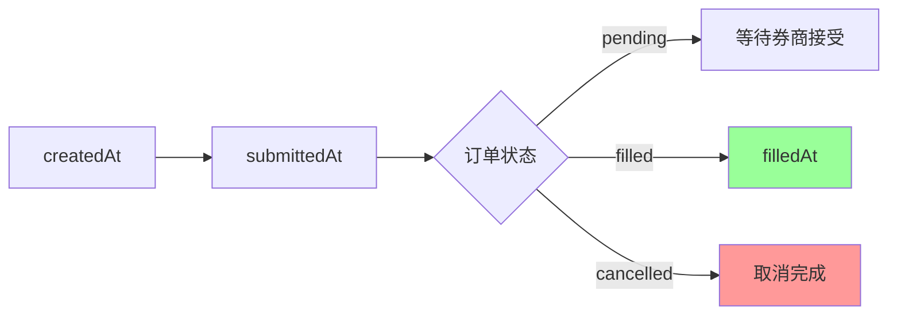
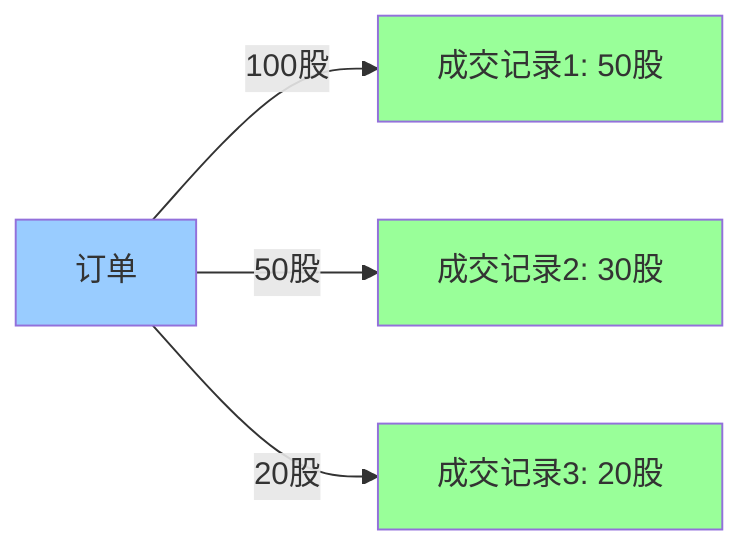
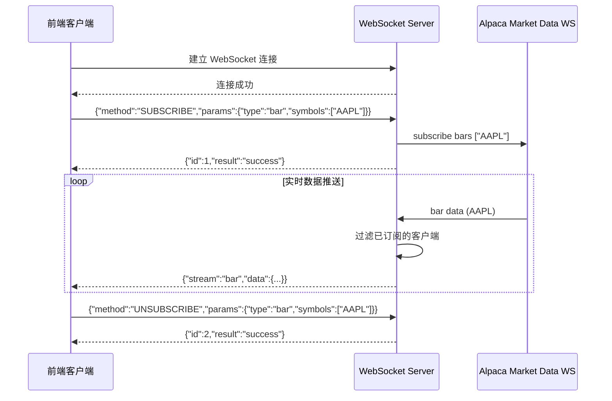

# Anchored Finance API 接口文档

## 1. API 概述

### 1.1 基础信息

| 项目 | 说明 |
|------|------|
| 基础 URL | `http://{host}:{port}{basePath}`，basePath 在配置文件中定义 |
| 协议 | HTTP REST API + WebSocket |
| 数据格式 | JSON |
| 时间戳 | 所有时间字段均为 Unix 秒级时间戳（int64） |
| Swagger | 非生产环境可访问 `{basePath}/swagger-ui/index.html` |

### 1.2 认证方式

#### API Key 认证

在请求头中携带 `X-API-Key`，仅在非 dev 环境且配置了 ApiKeys 时生效。

```
X-API-Key: your-api-key-here
```

#### API 签名认证（ApiSignMiddleware）

所有 API 请求均需通过签名中间件验证（可通过配置关闭）。签名所需请求头：

| Header | 类型 | 必填 | 说明 |
|--------|------|------|------|
| `X-Api-Nonce` | string | 是 | 随机字符串，用于生成签名密钥 |
| `X-Api-Sign` | string | 是 | 请求签名（Keccak256 哈希） |
| `X-Api-Ts` | string | 是 | 当前时间戳（毫秒），有效窗口 45 秒 |
| `Authorization` | string | 否 | 可选的授权令牌（参与签名计算） |

**签名流程**：
1. 使用 nonce 的 Keccak256 哈希派生 AES-256-CBC 密钥和 IV
2. 构造 JSON payload：`{"uri": "<排序后的请求路径>", "nonce": "<nonce>", "ts": <timestamp>, "body": "<canonical body>", "authorization": "<auth>"}`
3. AES-256-CBC 加密 payload，Base64 编码
4. 对密文再做一次 Base64 编码
5. 对双重 Base64 结果取 Keccak256 哈希，得到最终签名（hex 字符串）

### 1.3 统一响应格式

```json
{
  "data": {},
  "msg": "",
  "code": 0,
  "requestId": "uuid-v4"
}
```

| 字段 | 类型 | 说明 |
|------|------|------|
| `data` | any | 业务数据，成功时返回 |
| `msg` | string | 错误信息，成功时为空字符串 |
| `code` | int | 状态码，`0` 表示成功，其他为错误码 |
| `requestId` | string | 请求唯一 ID（UUID v4） |

---

## 2. 接口列表

### 2.1 通用接口（Common）

#### 健康检查

检查服务是否正常运行。

- **URL**: `GET /common/health`
- **请求参数**: 无
- **响应示例**:

```json
{
  "data": "ok",
  "msg": "",
  "code": 0,
  "requestId": "550e8400-e29b-41d4-a716-446655440000"
}
```

---

### 2.2 行情接口（Trade）

#### 获取当前价格

获取指定股票的当前价格。

- **URL**: `GET /trade/currentPrice`
- **请求参数**:

| 参数       | 类型     | 必填  | 说明   | 示例     |
| -------- | ------ | --- | ---- | ------ |
| `symbol` | string | 是   | 股票代码 | `AAPL` |

- **响应示例**:

```json
{
  "data": {
    "symbol": "AAPL",
    "price": 178.52,
    "volume": 52341200.0,
    "timestamp": 1704067200
  },
  "code": 0,
  "msg": "",
  "requestId": "..."
}
```

**当前价格字段说明**：

| 字段 | 类型 | 说明 |
|------|------|------|
| `symbol` | string | 股票代码 |
| `price` | float64 | 最新成交价格 |
| `volume` | float64 | 当日累计成交量（股数） |
| `timestamp` | int64 | 价格更新时间戳（Unix 秒级时间戳） |

---

#### 获取最新报价

获取指定股票的最新买卖报价（Bid/Ask）。

- **URL**: `GET /trade/latestQuote`
- **请求参数**:

| 参数       | 类型     | 必填  | 说明   | 示例     |
| -------- | ------ | --- | ---- | ------ |
| `symbol` | string | 是   | 股票代码 | `AAPL` |

- **响应示例**:

```json
{
  "data": {
    "quote": {
      "timestamp": 1704067200,
      "bid_price": 178.50,
      "bid_size": 100,
      "ask_price": 178.55,
      "ask_size": 200,
      "bid_exchange": "Q",
      "ask_exchange": "Q",
      "conditions": ["R"],
      "tape": "C"
    }
  },
  "code": 0,
  "msg": "",
  "requestId": "..."
}
```

**Quote 字段说明**：

| 字段 | 类型 | 说明 |
|------|------|------|
| `timestamp` | int64 | 报价时间戳（Unix 秒级时间戳） |
| `bid_price` | float64 | 买入价（Bid Price）：买方愿意支付的最高价格 |
| `bid_size` | uint32 | 买入量：以买入价可交易的股数 |
| `ask_price` | float64 | 卖出价（Ask Price）：卖方愿意接受的最低价格 |
| `ask_size` | uint32 | 卖出量：以卖出价可交易的股数 |
| `bid_exchange` | string | 买入报价交易所代码（如 Q=NASDAQ, N=NYSE, A=AMEX, P=ARCA 等） |
| `ask_exchange` | string | 卖出报价交易所代码 |
| `conditions` | string[] | 报价条件代码数组（用于标识特殊交易条件） |
| `tape` | string | 报价带标识：`A`= Tape A（NYSE）、`B`= Tape B（NASDAQ/AMEX/区域交易所）、`C`= Tape C（其他区域交易所） |

**买卖价差（Bid-Ask Spread）**：
- 买卖价差 = `ask_price` - `bid_price`，反映市场流动性
- 价差越小，流动性越好；价差越大，交易成本越高

---

#### 获取市场快照

获取指定股票的综合市场快照，包括最新交易、报价和 K 线数据。

- **URL**: `GET /trade/snapshot`
- **请求参数**:

| 参数 | 类型 | 必填 | 说明 | 示例 |
|------|------|------|------|------|
| `symbol` | string | 是 | 股票代码 | `AAPL` |

- **响应示例**:

```json
{
  "data": {
    "snapshot": {
      "symbol": "AAPL",
      "latest_trade": {
        "timestamp": 1704067200,
        "price": 178.52,
        "size": 100,
        "exchange": "V",
        "id": 12345,
        "conditions": ["@"],
        "tape": "C"
      },
      "latest_quote": {
        "timestamp": 1704067200,
        "bid_price": 178.50,
        "bid_size": 100,
        "ask_price": 178.55,
        "ask_size": 200
      },
      "minute_bar": {
        "timestamp": 1704067200,
        "open": 178.40,
        "high": 178.60,
        "low": 178.35,
        "close": 178.52,
        "volume": 15234,
        "trade_count": 120,
        "vwap": 178.48
      },
      "daily_bar": {
        "timestamp": 1704067200,
        "open": 177.50,
        "high": 179.20,
        "low": 177.10,
        "close": 178.52,
        "volume": 52341200,
        "trade_count": 432100,
        "vwap": 178.35
      },
      "prev_daily_bar": {
        "timestamp": 1703980800,
        "open": 176.80,
        "high": 178.00,
        "low": 176.50,
        "close": 177.50,
        "volume": 48200300,
        "trade_count": 398000,
        "vwap": 177.25
      }
    }
  },
  "code": 0,
  "msg": "",
  "requestId": "..."
}
```

**Snapshot 字段说明**：

| 字段 | 类型 | 说明 |
|------|------|------|
| `symbol` | string | 股票代码 |
| `latest_trade` | object | 最新成交数据 |
| `latest_quote` | object | 最新买卖报价 |
| `minute_bar` | object | 当前 1 分钟 K 线数据 |
| `daily_bar` | object | 当日 K 线数据 |
| `prev_daily_bar` | object | 前一交易日 K 线数据 |

**最新成交（latest_trade）字段**：

| 字段 | 类型 | 说明 |
|------|------|------|
| `timestamp` | int64 | 成交时间戳 |
| `price` | float64 | 成交价格 |
| `size` | uint32 | 成交数量 |
| `exchange` | string | 成交交易所代码 |
| `id` | int64 | 成交唯一 ID |
| `conditions` | string[] | 成交条件代码 |
| `tape` | string | 报价带标识 |

**K 线数据（minute_bar / daily_bar / prev_daily_bar）字段**：

| 字段 | 类型 | 说明 |
|------|------|------|
| `timestamp` | int64 | K 线时间戳（周期开始时间） |
| `open` | float64 | 开盘价 |
| `high` | float64 | 最高价 |
| `low` | float64 | 最低价 |
| `close` | float64 | 收盘价 |
| `volume` | uint64 | 成交总量（股票数量） |
| `trade_count` | uint64 | 成交笔数（交易次数） |
| `vwap` | float64 | 成交量加权平均价 |

**Volume vs Trade Count 区别**：

| 指标 | 含义 | 示例 |
|------|------|------|
| `volume` | 成交的股票/合约总数量 | 一笔交易买入 1000 股 → volume = 1000 |
| `trade_count` | 独立交易的次数（tick 数） | 一笔交易买入 1000 股 → trade_count = 1 |

**实际场景对比**：
```
场景1：一笔大单
买方以 $178.50 一次性买入 1000 股
→ volume = 1000，trade_count = 1

场景2：多笔小单
买方分 10 次买入，每次 100 股
→ volume = 1000，trade_count = 10
```

**VWAP 计算公式**：

```
VWAP = Σ(价格 × 成交量) / 总成交量
```

**计算示例**：
```
交易1：以 $178.00 买入 100 股
交易2：以 $178.50 买入 200 股  
交易3：以 $179.00 买入 150 股

VWAP = (178.00 × 100 + 178.50 × 200 + 179.00 × 150) / 450
     = $178.56
```

---

#### 获取历史 K 线数据

获取指定股票的历史价格数据。

- **URL**: `GET /trade/historicalData`
- **请求参数**:

| 参数 | 类型 | 必填 | 说明 | 示例 |
|------|------|------|------|------|
| `symbol` | string | 是 | 股票代码 | `AAPL` |
| `start_time` | int | 是 | 采集的开始时间（Unix 秒级时间戳） | `1704067200` |
| `end_time` | int | 是 | 采集的结束时间（Unix 秒级时间戳） | `1706745599` |
| `interval` | string | 是 | 采集的时间间隔 | `1d` |
| `limit` | int | 否 | 返回最大条数 | `100` |

**interval 支持的格式**：

| 短格式 | 完整格式 | 说明 |
|--------|----------|------|
| `1m` | `1Min` | 1 分钟 |
| `5m` | `5Min` | 5 分钟 |
| `15m` | `15Min` | 15 分钟 |
| `1h` | `1Hour` | 1 小时 |
| `1d` | `1Day` | 1 天 |
| `1w` | `1Week` | 1 周 |

- **响应示例**:

```json
{
  "data": {
    "symbol": "AAPL",
    "data": [
      {
        "open": 187.15,
        "high": 188.44,
        "low": 183.885,
        "close": 185.64,
        "volume": 82496943,
        "timestamp": 1704171600
      },
      {
        "open": 184.22,
        "high": 185.88,
        "low": 183.43,
        "close": 184.25,
        "volume": 58418916,
        "timestamp": 1704258000
      },
      ...
    ]
  },
  "code": 0,
  "msg": "",
  "requestId": "..."
}
```

---

#### 获取市场时钟

获取当前市场状态（开盘/闭盘），以及下一次开盘和闭盘时间。

- **URL**: `GET /trade/marketClock`
- **请求参数**: 无
- **响应示例**:

```json
{
  "data": {
    "timestamp": 1704067200,
    "is_open": true,
    "next_open": 1704153600,
    "next_close": 1704110400
  },
  "code": 0,
  "msg": "",
  "requestId": "..."
}
```

**市场时钟字段说明**：

| 字段 | 类型 | 说明 |
|------|------|------|
| `timestamp` | int64 | 当前服务器时间戳（Unix 秒级时间戳） |
| `is_open` | bool | 市场是否开盘 |
| `next_open` | int64 | 下一次开盘时间戳（Unix 秒级时间戳） |
| `next_close` | int64 | 下一次闭盘时间戳（Unix 秒级时间戳） |

**美股交易时间**：
- **常规交易时间**：周一至周五 9:30 - 16:00（美东时间）
- **盘前交易**：04:00 - 9:30
- **盘后交易**：16:00 - 20:00

---

#### 获取资产列表

获取可交易资产列表，支持按状态、类型、交易所筛选。

- **URL**: `GET /trade/assets`
- **请求参数**:

| 参数 | 类型 | 必填 | 说明 | 示例 |
|------|------|------|------|------|
| `status` | string | 否 | 资产状态（`active` / `inactive`） | `active` |
| `asset_class` | string | 否 | 资产类型（`us_equity` / `crypto`） | `us_equity` |
| `exchange` | string | 否 | 交易所名称 | `NASDAQ` |

**支持的资产类型**：

| 资产类型 | 标识符 | 说明 | 示例 |
|---------|--------|------|------|
| 美股股票 | `us_equity` | 美国交易所上市的股票 | AAPL、GOOGL、TSLA |
| 加密货币 | `crypto` | 数字货币交易对 | BTC/USD、ETH/USD |

- **响应示例**:

```json
{
  "data": {
    "assets": [
      {
          "id": "4ce9353c-66d1-46c2-898f-fce867ab0247",
          "class": "us_equity",
          "exchange": "NASDAQ",
          "symbol": "NVDA",
          "name": "NVIDIA Corporation Common Stock",
          "status": "active",
          "tradable": true,
          "marginable": true,
          "maintenance_margin_requirement": 30,
          "shortable": true,
          "easy_to_borrow": true,
          "fractionable": true,
          "attributes": [
              "fractional_eh_enabled",
              "has_options",
              "overnight_tradable"
          ]
      },
      ...
    ]
  },
  "code": 0,
  "msg": "",
  "requestId": "..."
}
```

**资产字段说明**：

| 字段 | 类型 | 说明 |
|------|------|------|
| `id` | string | 资产唯一标识符（UUID） |
| `class` | string | 资产类型：`us_equity`（美股）或 `crypto`（加密货币） |
| `exchange` | string | 交易所名称（如 NASDAQ、NYSE、AMEX 等） |
| `symbol` | string | 股票/资产代码 |
| `name` | string | 资产全称 |
| `status` | string | 资产状态：`active`（活跃）或 `inactive`（停用） |
| `tradable` | bool | 是否可交易 |
| `marginable` | bool | 是否支持保证金交易（融资买入） |
| `maintenance_margin_requirement` | uint | 维持保证金要求（百分比） |
| `shortable` | bool | 是否支持做空 |
| `easy_to_borrow` | bool | 是否易于借入（做空时需要借入股票） |
| `fractionable` | bool | 是否支持零股交易（可买入 < 1 股） |
| `attributes` | string[] | 资产额外属性列表 |

**资产属性（attributes）说明**：

| 属性 | 说明 |
|------|------|
| `fractional_eh_enabled` | 支持盘后零股交易 |
| `has_options` | 该股票有期权交易 |
| `overnight_tradable` | 支持隔夜交易 |

**保证金交易说明**：
保证金交易（Margin Trading）是指向券商借钱购买股票，放大你的购买力和潜在收益，但也同时放大风险。
- `marginable = true`：可使用保证金账户融资买入该股票
- `maintenance_margin_requirement = 30`：需维持 30% 的保证金比例
- 例如：融资 $10,000 买入股票，需维持至少 $3,000 的账户权益

**账户权益（Account Equity）详解**：

账户权益是指你**实际拥有的资金**，计算公式为：

```
账户权益 = 持仓市值 - 借款金额
```

**实际案例**：

```
初始状态：
├─ 自有资金：$10,000
├─ 借入资金：$10,000
├─ 总投资：  $20,000（200股 @ $100）
└─ 账户权益：$10,000

---

股价涨到 $120 时：
├─ 持仓市值：$24,000（200股 × $120）
├─ 借款金额：$10,000（不变）
├─ 账户权益：$14,000 = $24,000 - $10,000
└─ 收益：    +$4,000（40%）

---

股价跌到 $80 时：
├─ 持仓市值：$16,000（200股 × $80）
├─ 借款金额：$10,000（不变）
├─ 账户权益：$6,000 = $16,000 - $10,000
└─ 亏损：    -$4,000（-40%）

---

股价跌到 $40 时（危险）：
├─ 持仓市值：$8,000（200股 × $40）
├─ 借款金额：$10,000（不变）
├─ 账户权益：-$2,000 = $8,000 - $10,000
└─ ⚠️ 负权益！触发强制平仓
```

**维持保证金检查**：

```
维持保证金要求 = 持仓市值 × 维持比例
实际账户权益 ≥ 维持保证金要求 ✅ 安全
实际账户权益 < 维持保证金要求 ❌ 追加保证金
```

**示例检查**（维持比例 30%）：

```
股价 $70：
持仓市值：$14,000
维持要求：$14,000 × 30% = $4,200
账户权益：$14,000 - $10,000 = $4,000

$4,000 < $4,200 ❌ 低于维持线！
→ 需要存入现金或卖出股票
```

**做空交易说明**：
- `shortable = true`：可做空该股票
- `easy_to_borrow = true`：股票易于借入，做空费用较低
- `easy_to_borrow = false`：股票难以借入，做空费用较高或无法做空

**零股交易说明**：
- `fractionable = true`：可购买少于 1 股的股票
- 例如：可投入 $100 购买 $178.52 的股票，获得约 0.56 股

---

#### 获取单个资产信息

按股票代码获取单个资产的详细信息。

- **URL**: `GET /trade/asset`
- **请求参数**:

| 参数 | 类型 | 必填 | 说明 | 示例 |
|------|------|------|------|------|
| `symbol` | string | 是 | 股票代码 | `AAPL` |

- **响应示例**:

```json
{
  "data": {
    "asset": {
      "id": "b0b6dd9d-8b9b-48a9-ba46-b9d54906e415",
      "class": "us_equity",
      "exchange": "NASDAQ",
      "symbol": "AAPL",
      "name": "Apple Inc.",
      "status": "active",
      "tradable": true,
      "marginable": true,
      "maintenance_margin_requirement": 25,
      "shortable": true,
      "easy_to_borrow": true,
      "fractionable": true,
      "attributes": []
    }
  },
  "code": 0,
  "msg": "",
  "requestId": "..."
}
```

---

### 2.3 股票接口（Stock）

#### 获取股票列表

获取系统中已上架的活跃股票列表。

- **URL**: `GET /stock/list`
- **请求参数**: 无
- **响应示例**:

```json
{
  "data": {
    "list": [
      {
        "id": 1,
        "symbol": "AAPL",
        "name": "Apple Inc.",
        "exchange": "NASDAQ",
        "about": "Apple Inc. designs, manufactures...",
        "status": "active",
        "contract": "0x1234...abcd",
        "createdAt": 1704067200,
        "updatedAt": 1704067200
      }
    ]
  },
  "code": 0,
  "msg": "",
  "requestId": "..."
}
```

---

#### 获取股票详情

按股票代码获取股票的详细信息。

- **URL**: `GET /stock/detail`
- **请求参数**:

| 参数 | 类型 | 必填 | 说明 | 示例 |
|------|------|------|------|------|
| `symbol` | string | 是 | 股票代码 | `AAPL` |

- **响应示例**:

```json
{
  "data": {
    "id": 1,
    "symbol": "AAPL",
    "name": "Apple Inc.",
    "exchange": "NASDAQ",
    "about": "Apple Inc. designs, manufactures...",
    "status": "active",
    "contract": "0x1234...abcd",
    "createdAt": 1704067200,
    "updatedAt": 1704067200
  },
  "code": 0,
  "msg": "",
  "requestId": "..."
}
```

---

### 2.4 订单接口（Order）

#### 获取订单列表

获取订单列表，支持筛选和分页。

- **URL**: `GET /order/list`
- **请求参数**:

| 参数 | 类型 | 必填 | 说明 | 示例 |
|------|------|------|------|------|
| `account_id` | int | 否 | 账户 ID | `1` |
| `symbol` | string | 否 | 股票代码 | `AAPL` |
| `side` | string | 否 | 订单方向（`buy` / `sell`） | `buy` |
| `status` | string | 否 | 订单状态 | `filled` |
| `page` | int | 否 | 页码（默认 1） | `1` |
| `page_size` | int | 否 | 每页条数（默认 20，最大 100） | `20` |

- **响应示例**:

```json
{
  "data": {
    "list": [
      {
        "id": 1,
        "clientOrderId": "order-001",
        "accountId": 1,
        "symbol": "AAPL",
        "assetType": "us_equity",
        "side": "buy",
        "type": "market",
        "quantity": "10.000000000000000000",
        "price": "178.520000000000000000",
        "stopPrice": "0",
        "status": "filled",
        "filledQuantity": "10.000000000000000000",
        "filledPrice": "178.520000000000000000",
        "remainingQuantity": "0",
        "contractTxHash": "0xabc...123",
        "externalOrderId": "alpaca-order-id",
        "provider": "alpaca",
        "commission": "0.01",
        "commissionAsset": "USD",
        "createdAt": 1704067200,
        "updatedAt": 1704067200,
        "submittedAt": 1704067200,
        "filledAt": 1704067210
      }
    ],
    "total": 1
  },
  "code": 0,
  "msg": "",
  "requestId": "..."
}
```

**订单字段说明**：

| 字段 | 类型 | 说明 |
|------|------|------|
| `id` | uint64 | 数据库内部订单 ID |
| `clientOrderId` | string | 客户端订单 ID（链上订单唯一标识） |
| `accountId` | uint64 | 账户 ID |
| `symbol` | string | 股票代码 |
| `assetType` | string | 资产类型（`us_equity` 美股 / `crypto` 加密货币） |
| `side` | string | 订单方向：`buy`（买入）/ `sell`（卖出） |
| `type` | string | 订单类型：`market`（市价）/ `limit`（限价）/ `stop`（止损）/ `stop_limit`（止损限价） |
| `quantity` | string | 订单数量（18 位精度字符串） |
| `price` | string | 订单价格（限价单有效，18 位精度字符串） |
| `stopPrice` | string | 止损价格（止损单有效，18 位精度字符串） |
| `status` | string | 订单状态（见下方状态说明） |
| `filledQuantity` | string | 已成交数量（18 位精度字符串） |
| `filledPrice` | string | 成交均价（18 位精度字符串） |
| `remainingQuantity` | string | 剩余未成交数量（18 位精度字符串） |
| `contractTxHash` | string | 链上订单交易哈希 |
| `externalOrderId` | string | 外部订单 ID（Alpaca 订单 ID） |
| `provider` | string | 交易提供商（`alpaca`） |
| `commission` | string | 手续费金额 |
| `commissionAsset` | string | 手续费资产（`USD`） |
| `createdAt` | int64 | 订单创建时间戳 |
| `updatedAt` | int64 | 订单最后更新时间戳 |
| `submittedAt` | int64 | 订单提交时间戳 |
| `filledAt` | int64 | 订单成交时间戳 |

**订单状态（status）说明**：

| 状态 | 说明 | 时机 |
|------|------|------|
| `pending` | 待处理 | 订单已创建，等待提交到券商 |
| `accepted` | 已接受 | 订单已被券商接受，等待成交 |
| `partially_filled` | 部分成交 | 订单部分成交，剩余继续等待 |
| `filled` | 完全成交 | 订单完全成交 |
| `cancelled` | 已取消 | 订单被取消（可能部分成交） |
| `expired` | 已过期 | 订单过期未成交 |
| `rejected` | 已拒绝 | 订单被券商拒绝 |

**订单类型（type）说明**：

| 类型 | 说明 | 必填字段 |
|------|------|----------|
| `market` | 市价单 | 以当前最优价格立即成交 |
| `limit` | 限价单 | 指定价格，优于该价格才成交 |
| `stop` | 止损单 | 触发止损价后转为市价单 |
| `stop_limit` | 止损限价单 | 触发止损价后转为限价单 |

**数量精度说明**：
- 所有数量字段使用 **18 位精度**的字符串表示（与链上合约一致）
- 例如：`"10.000000000000000000"` = 10 股
- 例如：`"178.520000000000000000"` = $178.52

**订单时间线**：



---

#### 获取订单详情

按订单 ID 或客户端订单 ID 获取单个订单详情。

- **URL**: `GET /order/detail`
- **请求参数**:

| 参数 | 类型 | 必填 | 说明 | 示例 |
|------|------|------|------|------|
| `id` | int | 否* | 订单 ID | `1` |
| `client_order_id` | string | 否* | 客户端订单 ID | `order-001` |

> *`id` 和 `client_order_id` 至少提供一个。

- **响应示例**:

```json
{
  "data": {
    "order": {
      "id": 1,
      "clientOrderId": "order-001",
      "accountId": 1,
      "symbol": "AAPL",
      "assetType": "us_equity",
      "side": "buy",
      "type": "market",
      "quantity": "10.000000000000000000",
      "price": "178.520000000000000000",
      "stopPrice": "0",
      "status": "filled",
      "filledQuantity": "10.000000000000000000",
      "filledPrice": "178.520000000000000000",
      "remainingQuantity": "0",
      "contractTxHash": "0xabc...123",
      "externalOrderId": "alpaca-order-id",
      "provider": "alpaca",
      "commission": "0.01",
      "commissionAsset": "USD",
      "createdAt": 1704067200,
      "updatedAt": 1704067200,
      "submittedAt": 1704067200,
      "filledAt": 1704067210
    }
  },
  "code": 0,
  "msg": "",
  "requestId": "..."
}
```

---

#### 获取订单成交记录

获取指定订单的成交执行记录。

- **URL**: `GET /order/executions`
- **请求参数**:

| 参数 | 类型 | 必填 | 说明 | 示例 |
|------|------|------|------|------|
| `order_id` | int | 是 | 订单 ID | `1` |

- **响应示例**:

```json
{
  "data": {
    "list": [
      {
        "id": 1,
        "orderId": 1,
        "executionId": "exec-001",
        "quantity": "5.000000000000000000",
        "price": "178.520000000000000000",
        "commission": "0.005",
        "commissionAsset": "USD",
        "provider": "alpaca",
        "externalId": "alpaca-exec-id",
        "executedAt": 1704067205,
        "createdAt": 1704067205
      }
    ]
  },
  "code": 0,
  "msg": "",
  "requestId": "..."
}
```

**订单成交记录字段说明**：

| 字段 | 类型 | 说明 |
|------|------|------|
| `id` | uint64 | 成交记录内部 ID |
| `orderId` | uint64 | 所属订单 ID |
| `executionId` | string | 成交唯一标识符 |
| `quantity` | string | 本次成交数量（18 位精度字符串） |
| `price` | string | 本次成交价格（18 位精度字符串） |
| `commission` | string | 本次成交手续费 |
| `commissionAsset` | string | 手续费资产（`USD`） |
| `provider` | string | 交易提供商（`alpaca`） |
| `externalId` | string | 外部成交 ID（Alpaca 成交 ID） |
| `executedAt` | int64 | 成交时间戳 |
| `createdAt` | int64 | 记录创建时间戳 |

**订单 vs 成交记录关系**：



**实际案例**：
```
订单：买入 100 股 AAPL @ $178.50（限价单）

成交记录拆分：
├─ 记录1：成交 50 股 @ $178.50，手续费 $0.025
├─ 记录2：成交 30 股 @ $178.50，手续费 $0.015
└─ 记录3：成交 20 股 @ $178.50，手续费 $0.010

订单状态：filled（完全成交）
```

**为什么会有多条成交记录**：
- 大额订单可能被拆分成多个小订单执行
- 不同时间点成交，价格可能不同
- 每条成交记录独立计算手续费

---

## 3. WebSocket 协议

### 3.1 连接方式

```
ws://{host}:{port}{basePath}
```

WebSocket 服务基于 [melody](https://github.com/olahol/melody) 库实现，使用标准 WebSocket 协议。

### 3.2 心跳保活

客户端发送文本消息 `ping`，服务端回复 `pong`。

```
--> ping
<-- pong
```

### 3.3 消息格式

#### 客户端发送消息（请求）

```json
{
  "id": 1,
  "method": "SUBSCRIBE",
  "params": {
    "type": "bar",
    "symbols": ["AAPL", "GOOGL"]
  }
}
```

| 字段 | 类型 | 说明 |
|------|------|------|
| `id` | uint64 | 消息 ID，服务端原样返回 |
| `method` | string | 操作类型：`SUBSCRIBE` 或 `UNSUBSCRIBE` |
| `params` | object | 参数对象 |
| `params.type` | string | 订阅类型，目前支持 `bar`（K 线数据） |
| `params.symbols` | string[] | 股票代码列表 |

#### 服务端响应（操作结果）

```json
{
  "id": 1,
  "result": "success"
}
```

| 字段 | 类型 | 说明 |
|------|------|------|
| `id` | uint64 | 对应请求的消息 ID |
| `result` | any | 操作结果 |

#### 服务端推送（数据流）

```json
{
  "stream": "bar",
  "data": {
    "symbol": "AAPL",
    "open": 178.40,
    "high": 178.60,
    "low": 178.35,
    "close": 178.52,
    "volume": 15234,
    "timestamp": 1704067200,
    "tradeCount": 120,
    "vwap": 178.48
  }
}
```

| 字段 | 类型 | 说明 |
|------|------|------|
| `stream` | string | 数据流类型，目前为 `bar` |
| `data` | object | 推送数据 |

**BarData 字段说明**：

| 字段 | 类型 | 说明 |
|------|------|------|
| `symbol` | string | 股票代码 |
| `open` | float64 | 开盘价 |
| `high` | float64 | 最高价 |
| `low` | float64 | 最低价 |
| `close` | float64 | 收盘价 |
| `volume` | int64 | 成交量 |
| `timestamp` | int64 | 时间戳 |
| `tradeCount` | int64 | 成交笔数（可选） |
| `vwap` | float64 | 成交量加权平均价（可选） |

### 3.4 订阅/取消订阅

#### 订阅 K 线数据

```json
{
  "id": 1,
  "method": "SUBSCRIBE",
  "params": {
    "type": "bar",
    "symbols": ["AAPL", "GOOGL", "MSFT"]
  }
}
```

订阅后，服务端会将对应股票的实时 K 线数据通过 `stream: "bar"` 推送给该客户端。数据来源于 Alpaca Market Data WebSocket。

#### 取消订阅

```json
{
  "id": 2,
  "method": "UNSUBSCRIBE",
  "params": {
    "type": "bar",
    "symbols": ["GOOGL"]
  }
}
```

取消订阅后，该客户端不再接收对应股票的 K 线推送。

### 3.5 数据流架构



---

## 4. 错误码

### 4.1 通用错误码

| 错误码 | 常量 | 说明 |
|--------|------|------|
| 0 | - | 成功 |
| 401 | - | 未授权（API Key 无效或签名校验失败） |
| 1000 | `ErrInvalidRequestParams` | 请求参数无效 |
| 1001 | `ErrInternalServerError` | 服务器内部错误 |
| 1002 | `ErrNotFound` | 数据未找到 |

### 4.2 股票模块错误码（2xxx）

| 错误码 | 常量 | 说明 |
|--------|------|------|
| 2000 | `ErrFailedToGetStockList` | 获取股票列表失败 |
| 2001 | `ErrFailedToGetStockDetail` | 获取股票详情失败 |
| 2002 | `ErrStockNotFound` | 股票未找到 |

### 4.3 行情模块错误码（3xxx）

| 错误码 | 常量 | 说明 |
|--------|------|------|
| 3000 | `ErrFailedToGetCurrentPrice` | 获取当前价格失败 |
| 3001 | `ErrFailedToGetHistoricalData` | 获取历史数据失败 |
| 3002 | `ErrFailedToGetMarketClock` | 获取市场时钟失败 |
| 3003 | `ErrFailedToGetLatestQuote` | 获取最新报价失败 |
| 3004 | `ErrInvalidTimestampFormat` | 时间戳格式无效 |
| 3005 | `ErrFailedToGetSnapshot` | 获取市场快照失败 |
| 3006 | `ErrFailedToGetAssets` | 获取资产列表失败 |
| 3007 | `ErrSymbolRequired` | 股票代码为必填项 |
| 3008 | `ErrFailedToGetAsset` | 获取资产信息失败 |

### 4.4 订单模块错误码（4xxx）

| 错误码 | 常量 | 说明 |
|--------|------|------|
| 4000 | `ErrFailedToGetOrders` | 获取订单列表失败 |
| 4001 | `ErrFailedToGetOrderDetail` | 获取订单详情失败 |
| 4002 | `ErrOrderNotFound` | 订单未找到 |
| 4003 | `ErrFailedToGetOrderExecutions` | 获取订单成交记录失败 |

---

## 5. 第三方 API 文档链接

本系统的行情数据和交易执行通过 Alpaca 平台实现。以下为相关 API 文档：

### 5.1 Alpaca Trading API

- **官方文档**: [https://docs.alpaca.markets/docs/trading-api](https://docs.alpaca.markets/docs/trading-api)
- **订单 API**: [https://docs.alpaca.markets/reference/postorder](https://docs.alpaca.markets/reference/postorder)
- **账户 API**: [https://docs.alpaca.markets/reference/getaccount-1](https://docs.alpaca.markets/reference/getaccount-1)
- **资产 API**: [https://docs.alpaca.markets/reference/get-v2-assets](https://docs.alpaca.markets/reference/get-v2-assets)

### 5.2 Alpaca Market Data API

- **官方文档**: [https://docs.alpaca.markets/docs/market-data-api](https://docs.alpaca.markets/docs/market-data-api)
- **实时行情 WebSocket**: [https://docs.alpaca.markets/docs/real-time-stock-pricing-data](https://docs.alpaca.markets/docs/real-time-stock-pricing-data)
- **WebSocket 端点**: `wss://stream.data.alpaca.markets/v2/iex`（IEX 数据源）
- **历史 K 线**: [https://docs.alpaca.markets/reference/stockbars](https://docs.alpaca.markets/reference/stockbars)
- **快照数据**: [https://docs.alpaca.markets/reference/stocksnapshot](https://docs.alpaca.markets/reference/stocksnapshot)
- **最新报价**: [https://docs.alpaca.markets/reference/stocklatestquote](https://docs.alpaca.markets/reference/stocklatestquote)

### 5.3 Alpaca 认证方式

Alpaca API 使用 API Key + Secret 认证：

```
APCA-API-KEY-ID: <your-api-key>
APCA-API-SECRET-KEY: <your-api-secret>
```

WebSocket 认证消息：
```json
{
  "action": "auth",
  "key": "<your-api-key>",
  "secret": "<your-api-secret>"
}
```
