# Anchored Finance RWA 系统架构文档

> 本文档面向新加入项目的开发者，目标是读完后能理解系统的完整运作方式。

---

## 1. 项目概述

Anchored Finance RWA（Real World Asset）是一个将传统金融资产（如美股）代币化的系统。用户通过链上智能合约提交买卖订单并托管资金，后端服务监听链上事件后将订单转发至 Alpaca 券商执行真实股票交易，交易完成后在链上标记订单已执行并铸造/销毁对应的代币资产。整个系统实现了"链上提交意图 -> 链下执行交易 -> 链上结算确认"的 RWA 交易闭环。

---

## 2. 技术栈

| 类别 | 技术 | 版本 | 说明 |
|------|------|------|------|
| 后端语言 | Go | 1.25.1 | 所有后端服务使用 Go 编写 |
| 依赖注入 | uber/fx | v1.24.0 | 服务生命周期管理和依赖注入框架 |
| 日志 | uber/zap | v1.27.0 | 结构化高性能日志 |
| CLI 框架 | urfave/cli/v3 | v3.4.1 | 命令行参数解析 |
| 数据库 | PostgreSQL + GORM | gorm v1.31.0 | ORM 框架，配合 gorm-plus v0.1.5 |
| 缓存 | Redis | - | 行情数据缓存、API 缓存 |
| 以太坊交互 | go-ethereum | v1.16.4 | 链上事件监听、合约调用 |
| 券商 API | alpaca-trade-api-go | v3.5.0 | 美股券商 API（下单/撤单/查询） |
| WebSocket | gorilla/websocket | - | Alpaca WS 连接、WS Server 推送 |
| 精度计算 | shopspring/decimal | v1.4.0 | 金融精度安全的十进制运算 |
| 智能合约 | Solidity | ^0.8.20 | 使用 OpenZeppelin 合约库 |
| 合约框架 | Foundry | - | 合约编译、测试、部署 |
| 合约绑定 | abigen | - | 生成 Go 语言合约绑定代码 |
| 配置管理 | YAML | gopkg.in/yaml.v3 | 各服务配置文件 |
| Web 框架 | Gin | - | API 服务的 HTTP 路由框架 |

---

## 3. 系统架构图

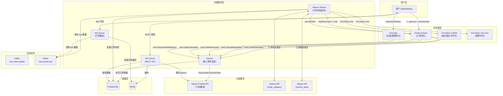

---

## 4. 服务模块说明

系统采用 Go Monorepo 结构，所有服务共享 `libs/` 下的公共库，各自独立编译部署。

### 4.1 Indexer -- 链上事件监听服务

| 项目 | 内容 |
|------|------|
| **入口** | `apps/indexer/main.go` |
| **职责** | 轮询区块链 RPC 获取合约事件日志，解析后执行业务逻辑（创建订单、向 Alpaca 下单、处理取消等） |
| **依赖模块** | `evm_helper`（以太坊客户端）、`database`（PostgreSQL）、`trade`（Alpaca API） |
| **核心配置** | `chain.chainId`、`chain.pocAddress`、`chain.gateAddress`、`indexer.pollInterval`、`indexer.batchSize`、`indexer.startBlock`、`indexer.confirmationBlocks` |
| **CLI 参数** | `-c` / `--config` 指定配置文件路径 |

**核心组件：**

- **EventListener** -- 轮询区块链获取事件日志
- **BlockService** -- 管理已处理的区块号和事件 ID（断点续传）
- **ProcessTxService** -- 事件分发和幂等处理
- **EventHandler 接口** -- 各事件的具体处理器（`HandleOrderSubmitted`、`HandleCancelRequested`、`HandleOrderExecuted`、`HandleOrderCancelled`）

### 4.2 Alpaca Stream -- Alpaca WebSocket 订单状态监听

| 项目 | 内容 |
|------|------|
| **入口** | `apps/alpaca-stream/main.go` |
| **职责** | 通过 Alpaca WebSocket 实时接收订单状态变化（new/fill/partial_fill/canceled/rejected/expired），同步更新数据库，订单完全成交后调用链上 `markExecuted`；统一订阅 Alpaca Market Data WebSocket 接收 bar 数据，通过 Kafka topic `rwa.market.bar` 发布给下游消费者 |
| **依赖模块** | `evm_helper`（链上交易）、`database`（PostgreSQL）、`kafka`（消息发布） |
| **核心配置** | `alpaca.apiKey`、`alpaca.apiSecret`、`alpaca.wsURL`、`alpaca.wsDataURL`、`chain.chainId`、`chain.pocAddress`、`backend.privateKey` |
| **CLI 参数** | `-a` / `--app` 选择子应用，`-c` / `--config` 指定配置文件 |

**核心组件：**

- **ws.Client** -- Alpaca WebSocket 客户端（连接/认证/Ping-Pong 保活/自动重连）
- **AlpacaWebSocketService** -- 管理 Trade Updates 和 Market Data 两个 WS 连接
- **OrderSyncService** -- 处理各种订单事件的业务逻辑，调用链上合约
- **BarKafkaPublisher** -- 将 Market Data WS 收到的 bar 数据发布到 Kafka topic `rwa.market.bar`

### 4.3 API Server -- REST API 服务

| 项目 | 内容 |
|------|------|
| **入口** | `apps/api/main.go` |
| **职责** | 提供 RESTful API，供前端查询订单、账户、行情等数据 |
| **依赖模块** | `web`（Gin 路由）、`evm_helper`、`database`、`redis_cache`、`trade`（Alpaca API） |
| **核心配置** | HTTP 监听地址、数据库连接、Redis 连接、Alpaca API 凭证 |
| **CLI 参数** | `-a` / `--app` 选择子应用，`-c` / `--config` 指定配置文件 |

### 4.4 WS Server -- 实时行情 WebSocket 推送

| 项目 | 内容 |
|------|------|
| **入口** | `apps/ws-server/main.go` |
| **职责** | 向前端客户端推送实时行情数据（K线、报价等）。Bar 数据通过 `BarUpdateSubscriber` 消费 Kafka topic `rwa.market.bar` 获取，不直连 Alpaca Market Data WebSocket |
| **依赖模块** | `kafka`（消费 bar 数据）、`redis_cache`（行情缓存）、`ws`（WebSocket 管理） |
| **核心配置** | WS 监听地址、Redis 连接 |
| **CLI 参数** | `-a` / `--app` 选择子应用，`-c` / `--config` 指定配置文件 |

---

## 5. 核心业务流程

### 5.1 买入订单完整流程

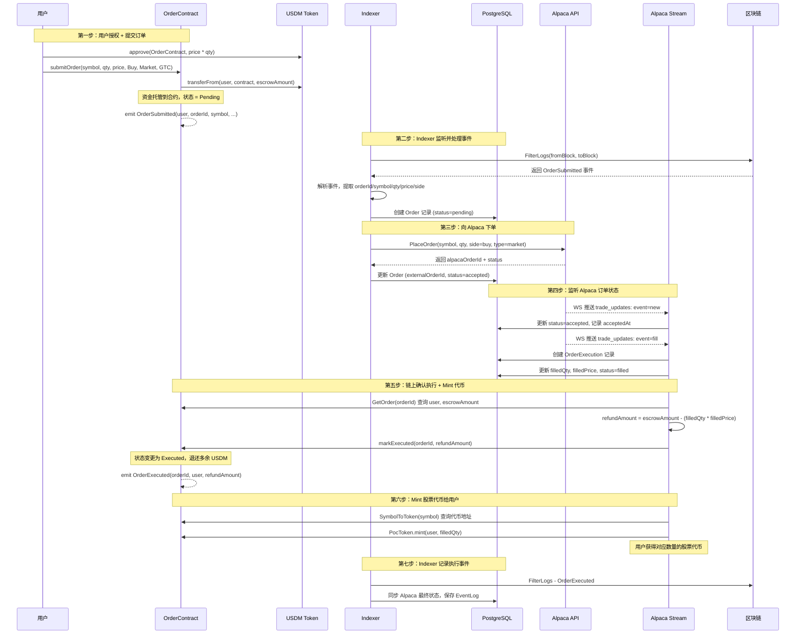

**关键细节：**
- 买入订单的托管资产是 USDM，托管金额 = price * qty（18 位精度）
- `markExecuted` 由 Alpaca Stream 服务在订单完全成交后异步调用
- refundAmount = escrowAmount - (filledQty * filledPrice)，从链上查询 escrow 金额动态计算
- markExecuted 成功后，通过 `SymbolToToken(symbol)` 查询代币地址，调用 `PocToken.mint(user, filledQty)` 铸造股票代币

### 5.2 卖出订单完整流程

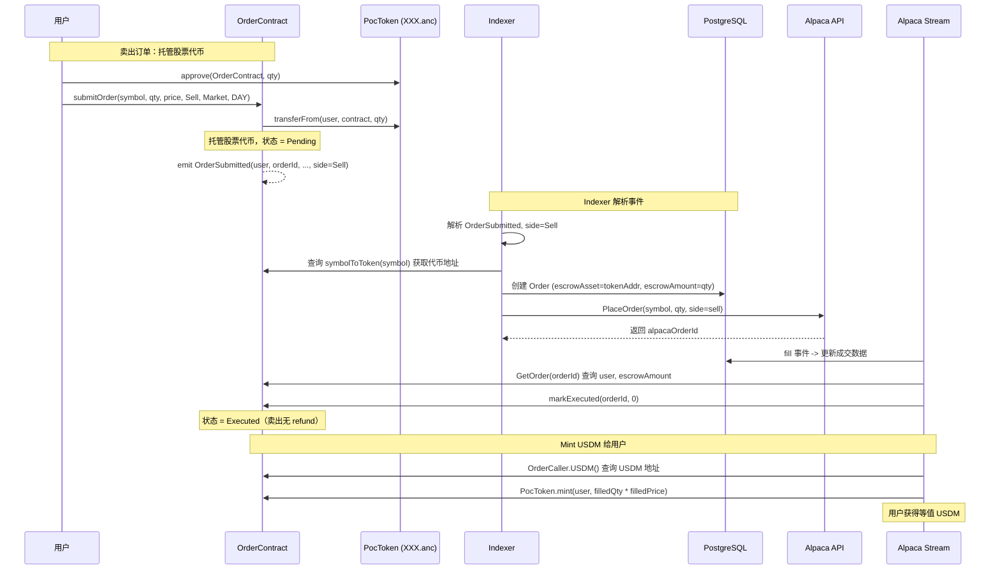

**与买入的区别：**
- 卖出订单托管的是对应股票的 PocToken（如 AAPL.anc），而非 USDM
- 托管金额 = qty（数量），而非 price * qty
- refundAmount = 0（托管的股票代币全部消耗）
- 成交后 mint 给用户的是 USDM（金额 = filledQty * filledPrice），而非股票代币
- Indexer 需要调用合约的 `symbolToToken(symbol)` 查询对应代币地址作为 escrowAsset

### 5.3 取消订单完整流程

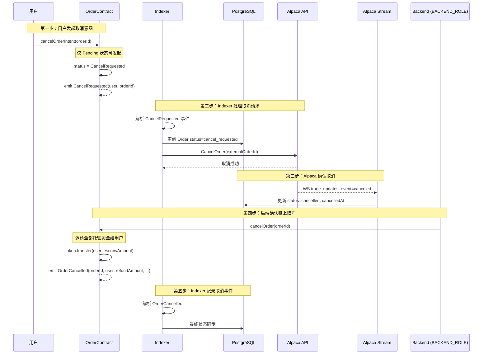

**关键细节：**
- 取消是两阶段流程：用户先 `cancelOrderIntent`（链上状态变 CancelRequested），后端再 `cancelOrder`（链上状态变 Cancelled 并退款）
- `cancelOrder` 仅 `BACKEND_ROLE` 可调用，会退还全部托管资金
- 合约同时支持从 Pending 和 CancelRequested 状态直接取消
- **部分成交后取消**：如果订单在取消前已有部分成交（filledQty > 0），则调用 `markExecuted`（而非 `cancelOrder`），通过 refundAmount 退还未成交部分的资金，并 mint 已成交部分的代币给用户。`markExecuted` 和 `cancelOrder` 在合约层面互斥，不能对同一订单同时调用。

### 5.4 充值/提现流程

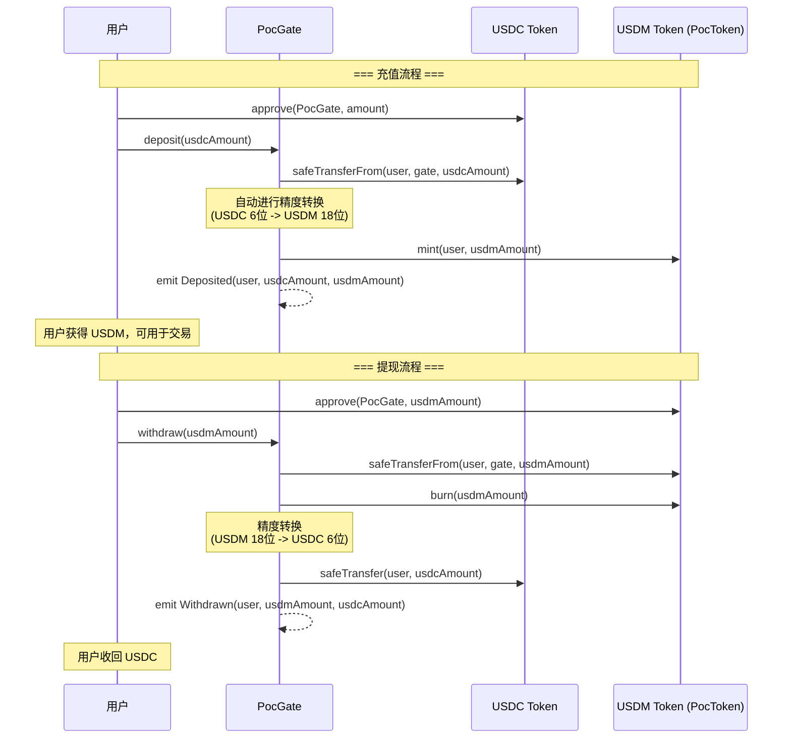

**关键细节：**
- PocGate 充当 USDC 和 USDM 之间的兑换网关
- 充值：用户存入 USDC，PocGate 铸造等值 USDM 给用户
- 提现：用户退回 USDM，PocGate 销毁 USDM 并退还 USDC
- 支持暂停充值/提现（`PAUSE_ROLE`）
- 有最低充值/提现金额限制

---

## 6. 链上合约架构

### 6.1 合约关系图

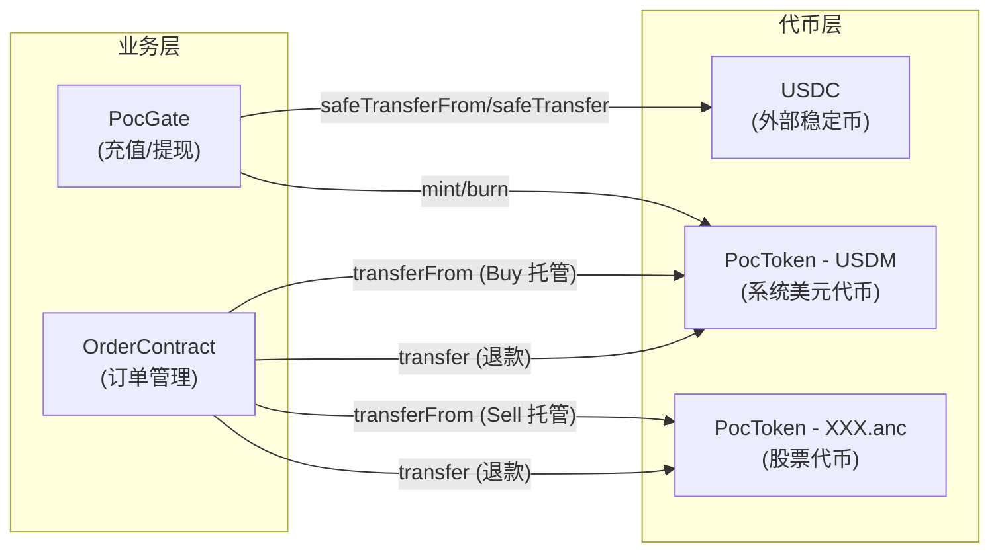

### 6.2 角色权限体系

| 合约 | 角色 | 权限 | 持有者 |
|------|------|------|--------|
| **OrderContract** | `DEFAULT_ADMIN_ROLE` | 注册代币映射 (`setSymbolToken`)、设置后端地址 | 管理员 |
| **OrderContract** | `BACKEND_ROLE` | 执行订单 (`markExecuted`)、取消订单 (`cancelOrder`) | 后端服务地址 |
| **PocGate** | `DEFAULT_ADMIN_ROLE` | 所有管理操作 | Guardian |
| **PocGate** | `CONFIGURE_ROLE` | 设置最低充值/提现金额 | Guardian |
| **PocGate** | `PAUSE_ROLE` | 暂停/恢复充值和提现 | Guardian |
| **PocToken** | `MINTER_ROLE` | 铸造代币 | PocGate / 管理员 |
| **PocToken** | `BURNER_ROLE` | 销毁代币 | PocGate / 管理员 |

### 6.3 合约事件定义

| 合约 | 事件 | 参数 | 触发时机 |
|------|------|------|----------|
| **OrderContract** | `OrderSubmitted` | user, orderId, symbol, qty, price, side, orderType, tif, blockTimestamp | 用户提交订单 |
| **OrderContract** | `CancelRequested` | user, orderId, blockTimestamp | 用户请求取消 |
| **OrderContract** | `OrderExecuted` | orderId, user, refundAmount, tif | 后端标记已执行 |
| **OrderContract** | `OrderCancelled` | orderId, user, asset, refundAmount, side, orderType, tif, previousStatus | 后端确认取消 |
| **PocGate** | `Deposited` | user, usdcAmount, usdmAmount | 用户充值 |
| **PocGate** | `Withdrawn` | user, usdmAmount, usdcAmount | 用户提现 |

### 6.4 订单状态机（链上）

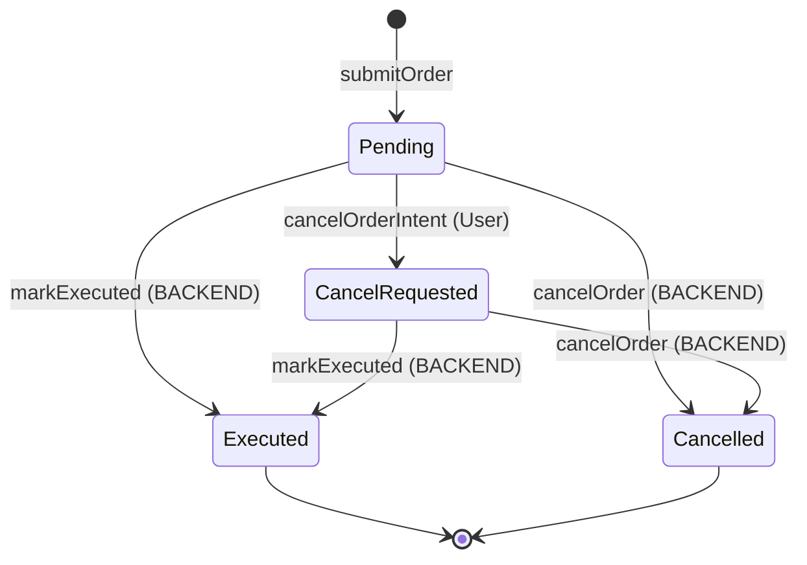

---

## 7. Indexer 工作原理

### 7.1 轮询机制

Indexer 采用**主动轮询**（Polling）模式而非 WebSocket 订阅，以提高可靠性：

```
┌──────────────────────────────────────────────────────────┐
│                    轮询循环 (Ticker)                      │
│                                                          │
│  每 N 秒执行一次 (N = conf.Indexer.PollInterval):         │
│                                                          │
│  1. 获取链上最新区块号 latestBlock                         │
│  2. 减去确认区块数 (latestBlock -= ConfirmationBlocks)     │
│  3. 获取上次处理的区块号 lastBlock (从 DB)                  │
│  4. 如果 latestBlock <= lastBlock，跳过                    │
│  5. 计算本批次范围: [lastBlock+1, lastBlock+BatchSize]     │
│  6. 调用 FilterLogs 获取事件                               │
│  7. 在一个 DB 事务中处理所有事件并更新进度                   │
└──────────────────────────────────────────────────────────┘
```

### 7.2 区块确认机制

通过 `ConfirmationBlocks` 配置（例如设为 12），Indexer 始终处理比最新区块落后 N 个区块的数据。这样做是为了避免处理可能被链重组（reorg）撤销的区块中的事件。

### 7.3 事务原子性

所有事件的处理和区块进度更新在**同一个数据库事务**中完成：

```go
err := s.db.Transaction(func(tx *gorm.DB) error {
    for _, event := range events {
        // 处理每个事件（使用同一个 tx）
        if err := s.ProcessEvent(ctx, tx, event, batchResolvedUpTo); err != nil {
            return err  // 任何一个事件失败，整个批次回滚
        }
    }
    // 更新区块进度（同一个 tx）
    return blockService.UpdateLastProcessedBlockTx(ctx, tx, toBlock, maxEventID)
})
```

这确保了：
- 要么所有事件都处理成功且进度更新，要么全部回滚
- 不会出现"事件处理了但进度没更新"或"进度更新了但事件没处理"的不一致情况

### 7.4 幂等性保证

每个事件都有唯一的 `EventId`（全局递增）。`ProcessTxService` 在处理事件前检查：

```go
if event.EventId <= resolvedUpTo {
    // 已处理过，跳过
    return nil
}
```

各 Handler 内部也有业务级幂等检查，例如 `HandleOrderSubmitted` 检查 `clientOrderID` 是否已存在。

### 7.5 EventHandler 接口

所有事件处理器实现统一接口：

```go
type EventHandler interface {
    ContractType() ContractType  // 返回合约类型（Order / Gate）
    Topic0() string              // 返回事件的 topic0 哈希
    HandleEvent(ctx context.Context, tx *gorm.DB, event *EventLogWithId) error
}
```

事件路由机制：`ProcessTxService` 内部维护一个二级 map：`map[ContractType]map[topic0]EventHandler`，根据事件的合约地址和 topic0 自动路由到对应的 Handler。

**已注册的 Handler：**

| Handler | 事件 | 处理逻辑 |
|---------|------|----------|
| `HandleOrderSubmitted` | OrderSubmitted | 创建订单记录 -> 调用 Alpaca PlaceOrder |
| `HandleCancelRequested` | CancelRequested | 更新状态为 cancel_requested -> 调用 Alpaca CancelOrder |
| `HandleOrderExecuted` | OrderExecuted | 同步 Alpaca 最终成交数据 -> 更新状态为 filled |
| `HandleOrderCancelled` | OrderCancelled | 同步 Alpaca 状态 -> 更新状态为 cancelled |

---

## 8. Alpaca Stream 工作原理

### 8.1 WebSocket 连接与认证

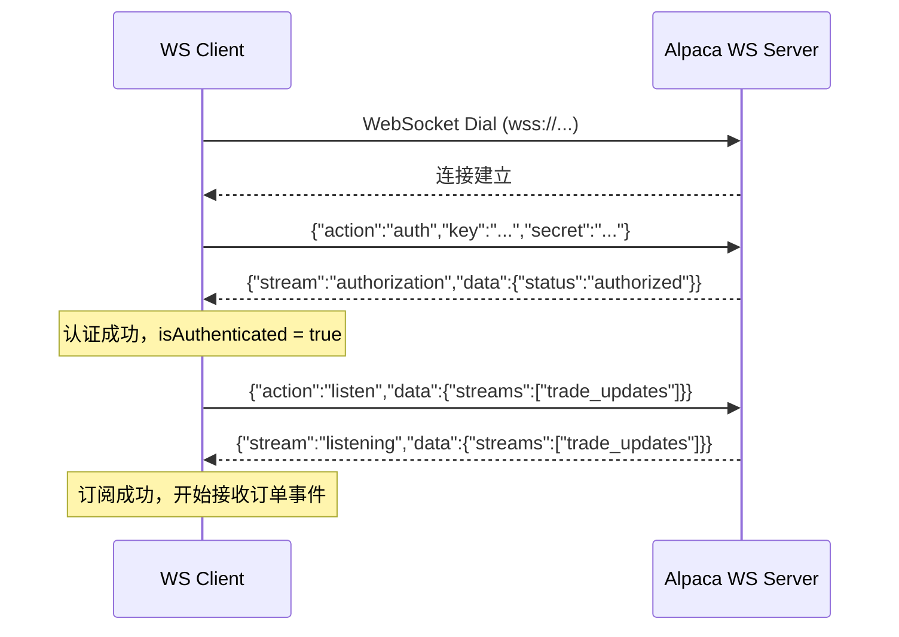

**认证超时机制：** 发送认证消息后，客户端以 100ms 间隔轮询 `isAuthenticated` 状态，超过 `AuthTimeout` 秒未收到成功响应则认证失败。

### 8.2 Ping-Pong 保活机制

非交易时段（美股休市期间）WebSocket 上没有消息流动，连接可能因超时断开。为此，客户端实现了 Ping-Pong 保活：

```
┌─────────────────────────────────────────────┐
│  pingLoop goroutine:                        │
│                                             │
│  每 PingInterval 秒:                         │
│    1. 设置 WriteDeadline                     │
│    2. 发送 Ping 帧                           │
│                                             │
│  PongHandler:                               │
│    收到 Pong 时延长 ReadDeadline              │
│    保持连接活跃                               │
└─────────────────────────────────────────────┘
```

### 8.3 自动重连机制

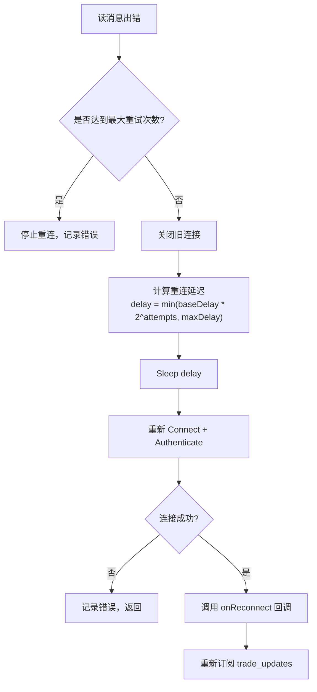

**防并发重连：** 使用 `atomic.CompareAndSwapInt32` 保证同一时间只有一个 goroutine 在执行重连逻辑。

**指数退避：** 重连延迟 = `min(baseDelay * 2^attempts, maxDelay)`，避免对 Alpaca 服务器造成过大压力。

### 8.4 订单状态同步状态机

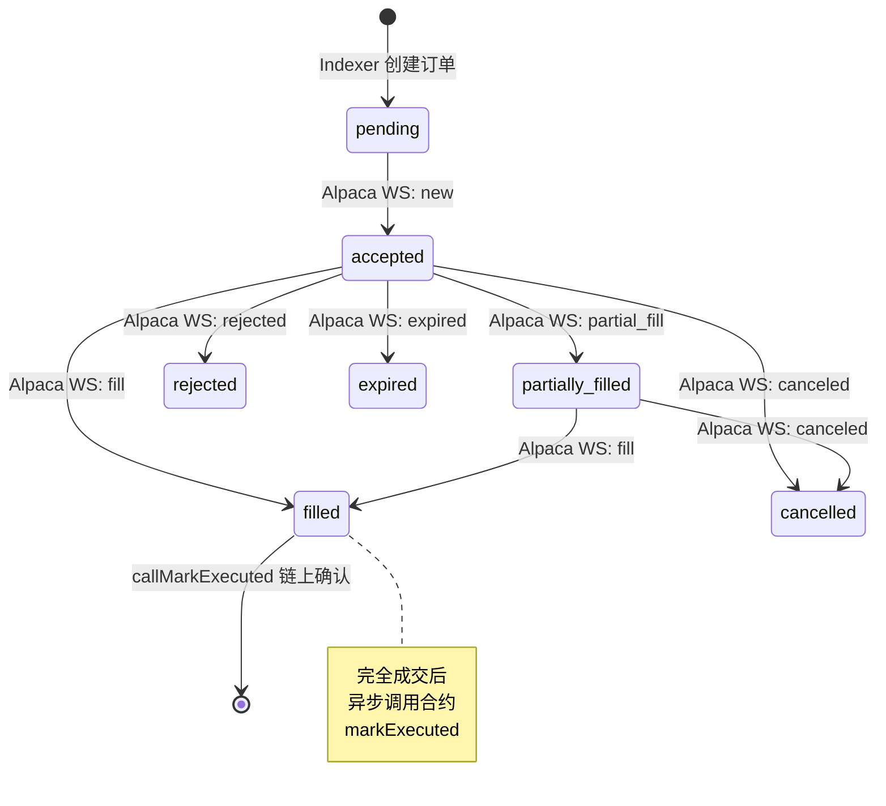

**OrderSyncService 处理的事件类型：**

| Alpaca 事件 | 处理方法 | 关键逻辑 |
|-------------|----------|----------|
| `new` | `HandleNew` | 状态更新为 accepted，记录 acceptedAt |
| `fill` | `HandleFill` | 创建 OrderExecution，计算 VWAP，状态 = filled，触发 `callMarkExecuted` |
| `partial_fill` | `HandlePartialFill` | 同 fill 但状态 = partially_filled |
| `canceled` | `HandleCanceled` | 状态 = cancelled；若有部分成交 → `callMarkExecuted`（结算已成交 + 退款未成交），否则 → `callCancelOrder`（全额退款） |
| `rejected` | `HandleRejected` | 状态 = rejected，记录拒绝原因 → `callCancelOrder`（全额退款） |
| `expired` | `HandleExpired` | 状态 = expired；逻辑同 canceled（部分成交 → markExecuted，无成交 → cancelOrder） |
| `done_for_day` | `HandleDoneForDay` | 仅记录日志（GTC 订单收盘通知） |

**fill 事件的幂等性：** 通过 `execution_id` 去重。如果同一个 `execution_id` 已存在于 `order_executions` 表中，则跳过处理。

**VWAP（成交量加权平均价）计算：**

```
新均价 = (旧成交量 * 旧均价 + 本次成交量 * 本次价格) / 新总成交量
```

如果 Alpaca 返回了权威的 `filled_avg_price` 和 `filled_qty`，则优先使用 Alpaca 的数据。

**失败事件持久化：** 如果事件处理的数据库事务失败，事件数据会被保存到 `failed_events` 表以便后续恢复。

### 8.5 链上结算流程（callMarkExecuted + mintTokensAfterFill）

订单完全成交（或部分成交后取消/过期）时，`OrderSyncService` 异步执行链上结算：

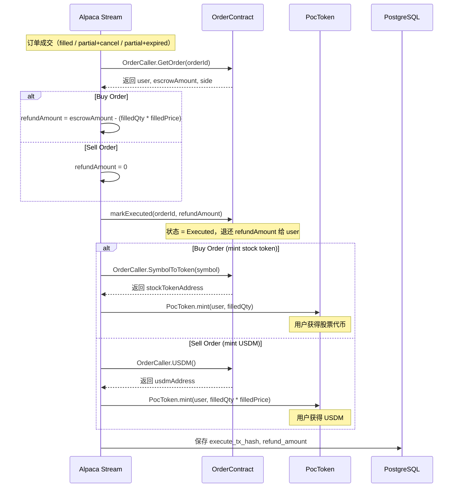

**关键实现细节：**

- **refundAmount 计算**：买入订单 `refundAmount = escrowAmount(链上) - actualCost(filledQty * filledPrice)`；卖出订单 `refundAmount = 0`（托管的股票代币全部消耗）
- **decimalToWei 转换**：Alpaca 返回的 filledQty/filledPrice 是人类可读的小数，链上使用 18 位精度 wei，需要 `d * 10^18` 转换
- **markExecuted vs cancelOrder 互斥**：合约不允许对同一订单同时调用两者；部分成交后取消/过期必须用 `markExecuted`（带 refundAmount），不能用 `cancelOrder`（会退还全部 escrow）
- **异步执行**：链上调用在 goroutine 中执行，使用独立 context（120s 超时），不阻塞 WebSocket 消息处理
- **Indexer 侧 cancelOrder**：当 Alpaca PlaceOrder 失败时，Indexer 的 `HandleOrderSubmitted` 会异步调用 `cancelOrder` 退还用户锁定资金

### 8.6 链上取消流程（callCancelOrder）

未成交的订单被取消/拒绝/过期时，后端调用链上 `cancelOrder` 退还全部托管资金：

```
OrderSyncService.callCancelOrder(order)
  1. 解析 clientOrderID 为链上 orderId (uint256)
  2. 创建 OrderTransactor
  3. 调用 orderTransactor.CancelOrder(auth, orderId)
  4. 合约退还全部 escrow 给 user
  5. 保存 cancel_tx_hash 到 DB
```

---

## 9. 数据流图

### 9.1 买入订单完整数据流

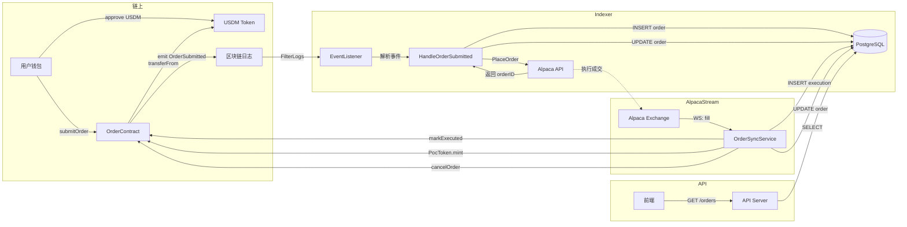

### 9.2 数据存储模型概要

```
┌──────────────────────┐     ┌──────────────────────┐
│       orders         │     │   order_executions   │
├──────────────────────┤     ├──────────────────────┤
│ id (PK)              │──┐  │ id (PK)              │
│ client_order_id      │  │  │ order_id (FK)        │
│ external_order_id    │  └──│ execution_id         │
│ account_id (FK)      │     │ quantity             │
│ symbol               │     │ price                │
│ side (buy/sell)      │     │ provider             │
│ type (market/limit)  │     │ executed_at          │
│ status               │     └──────────────────────┘
│ quantity             │
│ price                │     ┌──────────────────────┐
│ filled_quantity      │     │ event_client_record  │
│ filled_price         │     ├──────────────────────┤
│ remaining_quantity   │     │ chain_id             │
│ escrow_amount        │     │ last_block           │
│ escrow_asset         │     │ last_event_id        │
│ contract_tx_hash     │     │ update_at            │
│ execute_tx_hash      │     └──────────────────────┘
│ submitted_at         │
│ filled_at            │     ┌──────────────────────┐
│ cancelled_at         │     │   failed_events      │
│ provider             │     ├──────────────────────┤
│ notes                │     │ client_order_id      │
└──────────────────────┘     │ event_type           │
                             │ execution_id         │
┌──────────────────────┐     │ event_data (JSON)    │
│     event_logs       │     │ error_message        │
├──────────────────────┤     │ source               │
│ id (PK)              │     │ status               │
│ event_name           │     └──────────────────────┘
│ account_id           │
│ order_id             │
│ tx_hash              │
│ block_number         │
│ raw_data             │
└──────────────────────┘
```

---

## 10. 第三方服务和文档链接

### 10.1 Alpaca Markets

Alpaca 是美国持牌券商，提供股票交易 API。

| 资源 | 链接 |
|------|------|
| Alpaca 官网 | https://alpaca.markets/ |
| Trading API 文档 | https://docs.alpaca.markets/docs/trading-api |
| WebSocket Streaming | https://docs.alpaca.markets/docs/streaming |
| Market Data API | https://docs.alpaca.markets/docs/market-data-api |
| Go SDK | https://github.com/alpacahq/alpaca-trade-api-go |
| Paper Trading（模拟交易） | https://paper-api.alpaca.markets |
| WS Trade Updates URL | `wss://paper-api.alpaca.markets/stream` (Paper) / `wss://api.alpaca.markets/stream` (Live) |
| WS Market Data URL | `wss://stream.data.alpaca.markets/v2/{feed}` |

### 10.2 以太坊 / EVM

| 资源 | 链接 |
|------|------|
| go-ethereum (Geth) | https://github.com/ethereum/go-ethereum |
| go-ethereum 文档 | https://geth.ethereum.org/docs |
| abigen（合约绑定生成） | https://geth.ethereum.org/docs/tools/abigen |
| Solidity 文档 | https://docs.soliditylang.org/ |

### 10.3 合约开发

| 资源 | 链接 |
|------|------|
| Foundry | https://book.getfoundry.sh/ |
| OpenZeppelin Contracts | https://docs.openzeppelin.com/contracts/ |
| AccessControlEnumerable | https://docs.openzeppelin.com/contracts/5.x/api/access#AccessControlEnumerable |
| ReentrancyGuard | https://docs.openzeppelin.com/contracts/5.x/api/utils#ReentrancyGuard |

### 10.4 后端框架

| 资源 | 链接 |
|------|------|
| Uber Fx（依赖注入） | https://uber-go.github.io/fx/ |
| Uber Zap（日志） | https://pkg.go.dev/go.uber.org/zap |
| GORM（ORM） | https://gorm.io/docs/ |
| Gin（Web 框架） | https://gin-gonic.com/docs/ |
| gorilla/websocket | https://pkg.go.dev/github.com/gorilla/websocket |
| shopspring/decimal | https://pkg.go.dev/github.com/shopspring/decimal |
