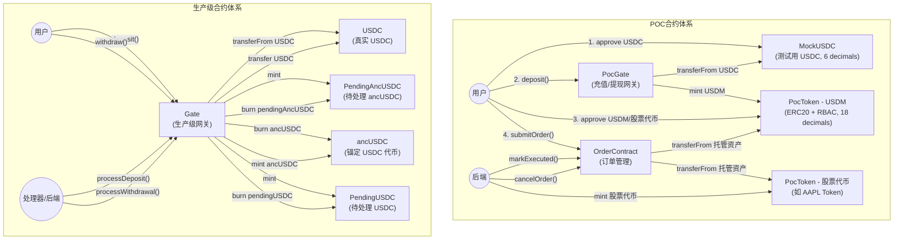
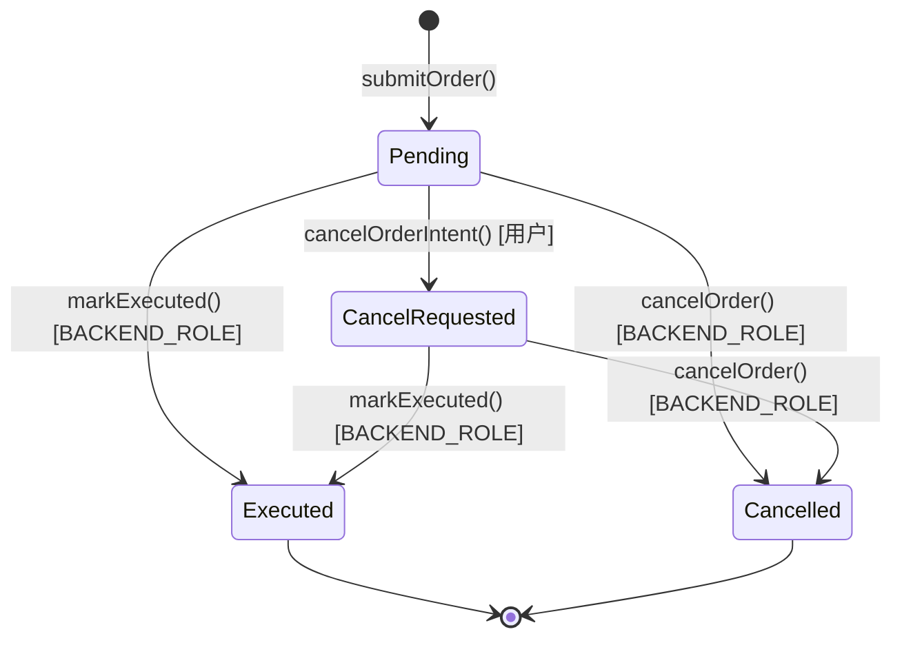
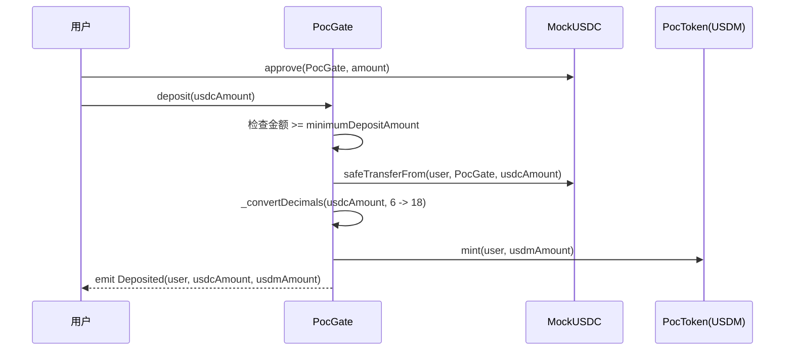
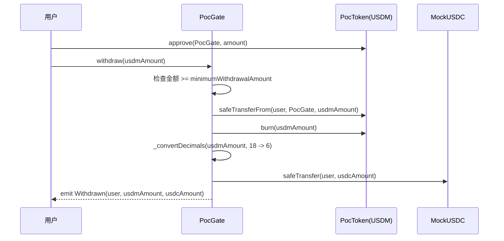
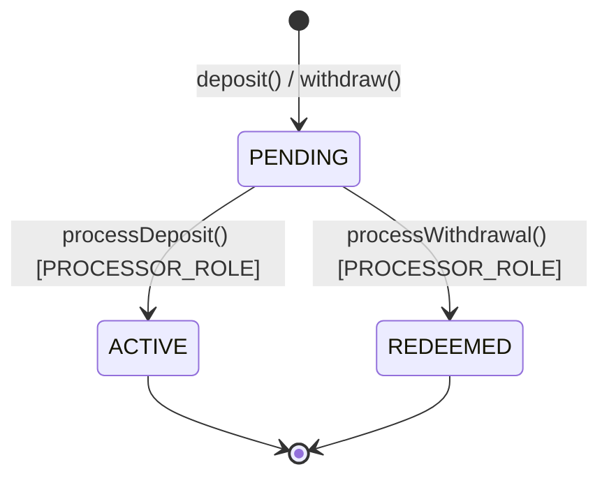

# Anchored Finance 智能合约架构文档

## 1. 合约架构总览

本项目包含两套合约体系：**POC（概念验证）合约** 和 **生产级 Gate 合约**。POC 合约用于快速验证核心业务流程，生产级合约引入了 pending 状态机制，适用于正式环境。

### 1.1 合约间关系图



---

## 2. POC 合约详解

### 2.1 OrderContract（Order.sol）

OrderContract 是核心订单管理合约，负责订单提交、资金托管、执行确认和取消退款。

#### 2.1.1 枚举定义

| 枚举 | 值 | 说明 |
|------|-----|------|
| `Side` | `Buy(0)`, `Sell(1)` | 订单方向：买入 / 卖出 |
| `OrderType` | `Market(0)`, `Limit(1)` | 订单类型：市价 / 限价 |
| `Status` | `Pending(0)`, `Executed(1)`, `CancelRequested(2)`, `Cancelled(3)` | 订单状态 |
| `TimeInForce` | `DAY(0)`, `GTC(1)`, `OPG(2)`, `IOC(3)`, `FOK(4)`, `GTX(5)`, `GTD(6)`, `CLS(7)` | 订单有效期策略 |

#### 2.1.2 状态转换图



#### 2.1.3 存储结构

```solidity
struct Order {
    uint id;              // 全局自增 ID（存储键）
    uint orderNumber;     // 展示用结构化订单号 AAAAAABBSSSSSSSSSS
    address user;         // 下单用户地址
    string symbol;        // 交易标的符号（如 "AAPL"）
    uint qty;             // 订单数量（18 decimals）
    address escrowAsset;  // 托管资产地址（USDM 或股票代币）
    uint amount;          // 托管金额（Buy: price*qty; Sell: qty）
    uint price;           // 价格（18 decimals）
    Side side;            // 买/卖方向
    OrderType orderType;  // 市价/限价
    Status status;        // 订单状态
    TimeInForce tif;      // 有效期策略
}
```

**订单号编码规则**：`AAAAAABBSSSSSSSSSS`
- `AAAAAA`（6位）：用户地址的 keccak256 哈希取模 1,000,000
- `BB`（2位）：订单类型编码（01=Market, 02=Limit）
- `SSSSSSSSSS`（10位）：用户维度的自增序号

#### 2.1.4 函数列表

| 函数 | 访问控制 | 说明 |
|------|----------|------|
| `initialize(usdm_, admin_, backend_)` | `initializer` | 初始化合约，设置 USDM 地址和角色 |
| `setSymbolToken(symbol, token)` | `DEFAULT_ADMIN_ROLE` | 注册/更新交易标的对应的 PocToken |
| `setBackend(backend)` | `DEFAULT_ADMIN_ROLE` | 添加后端地址的 BACKEND_ROLE |
| `submitOrder(symbol, qty, price, side, orderType, tif)` | 任意用户 | 提交订单并托管资金。Buy 托管 USDM（price*qty），Sell 托管股票代币（qty） |
| `cancelOrderIntent(orderId)` | 订单所有者 | 用户发起取消意图（仅 Pending 可发起） |
| `markExecuted(orderId, refundAmount)` | `BACKEND_ROLE` | 后端标记订单已执行，可退还多余托管金额 |
| `cancelOrder(orderId)` | `BACKEND_ROLE` | 后端最终取消订单，退还全部托管资金 |
| `getOrder(orderId)` | 任意（view） | 查询订单详情 |
| `getOrderNumber(orderId)` | 任意（view） | 查询结构化订单号 |

#### 2.1.5 资金流转逻辑

**买入订单 (Buy)**：
1. 用户先 `approve` OrderContract 花费 USDM
2. `submitOrder()` 时，合约通过 `transferFrom` 将 `price * qty / 1e18` 的 USDM 从用户转入合约
3. Alpaca 成交后，后端调用 `markExecuted(orderId, refundAmount)`，其中 `refundAmount = escrowAmount - (filledQty * filledPrice)`，退还多余 USDM 给用户
4. 后端调用 `PocToken.mint(user, filledQty)` 铸造对应数量的股票代币给用户（通过 `symbolToToken(symbol)` 查询代币地址）
5. `cancelOrder()` 时，退还全部托管的 USDM（仅在未成交时调用）

**卖出订单 (Sell)**：
1. 用户先 `approve` OrderContract 花费对应股票的 PocToken
2. `submitOrder()` 时，合约通过 `transferFrom` 将 `qty` 的股票代币从用户转入合约
3. Alpaca 成交后，后端调用 `markExecuted(orderId, 0)`，托管的股票代币留在合约中（refundAmount = 0）
4. 后端调用 `PocToken.mint(user, filledQty * filledPrice)` 铸造等值 USDM 给用户（通过 `OrderCaller.USDM()` 查询 USDM 地址）
5. `cancelOrder()` 时，退还全部托管的股票代币（仅在未成交时调用）

**部分成交后取消/过期**：
- 如果订单在取消/过期前已有部分成交，不能调用 `cancelOrder`（会退还全部 escrow，导致超额退款）
- 必须调用 `markExecuted(orderId, refundAmount)`，通过 refundAmount 退还未成交部分的资金
- 同时 mint 已成交部分对应的代币给用户
- `markExecuted` 和 `cancelOrder` 在合约层面互斥，同一订单只能调用其中之一

---

### 2.2 PocToken（PocToken.sol）

PocToken 是基于 ERC20 标准的代币合约，增加了基于角色的 mint/burn 机制。系统中部署多个 PocToken 实例：一个作为 USDM（美元稳定币映射），其余作为各股票标的的代币。

#### 2.2.1 角色

| 角色 | 常量 | 说明 |
|------|------|------|
| 管理员 | `DEFAULT_ADMIN_ROLE` | 可管理所有角色，设置 operator |
| 铸币者 | `MINTER_ROLE` | 可调用 `mint()` 铸造代币 |
| 销毁者 | `BURNER_ROLE` | 可调用 `burn()` / `burnFrom()` 销毁代币 |

#### 2.2.2 函数列表

| 函数 | 访问控制 | 说明 |
|------|----------|------|
| `initialize(name_, symbol_)` | `initializer` | 初始化代币名称和符号，授予调用者 ADMIN/MINTER/BURNER 角色 |
| `setOperator(operator)` | `DEFAULT_ADMIN_ROLE` | 为指定地址授予 MINTER 和 BURNER 角色 |
| `mint(to, amount)` | `MINTER_ROLE` | 铸造代币到指定地址 |
| `burn(amount)` | `BURNER_ROLE` | 销毁调用者持有的代币 |
| `burnFrom(from, amount)` | `BURNER_ROLE` | 销毁指定地址持有的代币（无需 allowance） |
| `isMinter(account)` | 任意（view） | 查询地址是否拥有 MINTER 角色 |
| `isBurner(account)` | 任意（view） | 查询地址是否拥有 BURNER 角色 |
| `name()` | 任意（view） | 返回代币名称（可在初始化时自定义） |
| `symbol()` | 任意（view） | 返回代币符号（可在初始化时自定义） |

#### 2.2.3 关键特性

- **Beacon Proxy 模式**：构造函数接收 `gateContract_` 地址，通过 `_disableInitializers()` 禁止直接初始化实现合约
- **RBAC 控制**：mint 和 burn 操作均受角色约束，防止未授权操作
- **灵活命名**：通过覆盖 `name()` 和 `symbol()` 函数，支持在 proxy 部署后自定义名称

---

### 2.3 PocGate（PocGate.sol）

PocGate 是 POC 版本的充值/提现网关，提供 USDC 和 USDM 之间的即时兑换（无 pending 状态）。

#### 2.3.1 角色

| 角色 | 常量 | 说明 |
|------|------|------|
| 管理员 | `DEFAULT_ADMIN_ROLE` | 最高权限 |
| 配置员 | `CONFIGURE_ROLE` | 可设置最低充值/提现金额 |
| 暂停员 | `PAUSE_ROLE` | 可暂停/恢复充值和提现功能 |

#### 2.3.2 充值流程



#### 2.3.3 提现流程



#### 2.3.4 函数列表

| 函数 | 访问控制 | 说明 |
|------|----------|------|
| `initialize(guardian_, minDeposit, minWithdrawal)` | `initializer` | 初始化合约参数和角色 |
| `deposit(usdcAmount)` | 任意用户 | 充值 USDC，即时获得 USDM |
| `withdraw(usdmAmount)` | 任意用户 | 提现 USDM，即时获得 USDC |
| `setMinimumDepositAmount(amount)` | `CONFIGURE_ROLE` | 设置最低充值金额 |
| `setMinimumWithdrawalAmount(amount)` | `CONFIGURE_ROLE` | 设置最低提现金额 |
| `pauseDeposits()` | `PAUSE_ROLE` | 暂停充值 |
| `unpauseDeposits()` | `PAUSE_ROLE` | 恢复充值 |
| `pauseWithdrawals()` | `PAUSE_ROLE` | 暂停提现 |
| `unpauseWithdrawals()` | `PAUSE_ROLE` | 恢复提现 |

#### 2.3.5 精度转换

PocGate 内部通过 `_convertDecimals()` 处理 USDC（6 decimals）和 USDM（18 decimals）之间的精度转换：
- 充值：`usdcAmount * 10^12` 得到 usdmAmount
- 提现：`usdmAmount / 10^12` 得到 usdcAmount

---

### 2.4 MockUSDC（MockUSDC.sol）

MockUSDC 是测试环境使用的模拟 USDC 代币，行为简化。

| 特性 | 值 |
|------|-----|
| 名称 | Mock USDC |
| 符号 | USDC |
| 精度 | 6 decimals |
| mint | 任意地址均可调用（无权限控制，仅用于测试） |
| burn | 任意地址均可调用（无权限控制，仅用于测试） |

---

## 3. 生产级 Gate 合约详解（Gate.sol）

Gate 合约是生产环境使用的充值/提现网关，与 PocGate 的核心区别是引入了 **pending 状态机制**，充值/提现操作需要后端确认后才最终完成。

### 3.1 操作状态机



| 状态 | 值 | 说明 |
|------|-----|------|
| `PENDING` | 0 | 操作已创建，等待后端处理 |
| `ACTIVE` | 1 | 充值已处理完成（用户获得 ancUSDC） |
| `REDEEMED` | 2 | 提现已处理完成（用户获得 USDC） |

### 3.2 角色

| 角色 | 常量 | 说明 |
|------|------|------|
| 管理员 | `DEFAULT_ADMIN_ROLE` | 最高权限 |
| 配置员 | `CONFIGURE_ROLE` | 设置最低金额参数 |
| 暂停员 | `PAUSE_ROLE` | 暂停/恢复操作 |
| 处理器 | `PROCESSOR_ROLE` | 后端处理 pending 操作 |

### 3.3 充值流程（含 pending）

1. 用户调用 `deposit(usdcAmount)`
2. 合约将 USDC 从用户转入合约
3. 合约铸造 **PendingAncUSDC**（待确认代币）给用户
4. 记录 `DepositOperation`，状态为 `PENDING`
5. 后端调用 `processDeposit(operationId, ancUSDCAmount)`
6. 合约销毁用户的 PendingAncUSDC，铸造正式 **ancUSDC** 给用户
7. 状态变为 `ACTIVE`

### 3.4 提现流程（含 pending）

1. 用户调用 `withdraw(ancUSDCAmount)`
2. 合约销毁用户的 ancUSDC
3. 合约铸造 **PendingUSDC**（待确认代币）给用户
4. 记录 `WithdrawalOperation`，状态为 `PENDING`
5. 后端调用 `processWithdrawal(operationId, usdcAmount)`
6. 合约销毁用户的 PendingUSDC，将 USDC 转给用户
7. 状态变为 `REDEEMED`

### 3.5 数据结构

```solidity
struct DepositOperation {
    address user;                    // 充值用户
    uint256 usdcAmount;             // USDC 充值金额
    uint256 pendingAncUSDCAmount;   // 待确认 ancUSDC 数量
    OperationStatus status;         // 操作状态
    uint256 timestamp;              // 创建时间戳
}

struct WithdrawalOperation {
    address user;                    // 提现用户
    uint256 ancUSDCAmount;          // ancUSDC 提现金额
    uint256 pendingUSDCAmount;      // 待确认 USDC 数量
    OperationStatus status;         // 操作状态
    uint256 timestamp;              // 创建时间戳
}
```

### 3.6 函数列表

| 函数 | 访问控制 | 说明 |
|------|----------|------|
| `initialize(usdc_, ancUSDC_, guardian_, minDeposit, minWithdrawal)` | `initializer` | 初始化并创建 PendingAncUSDC / PendingUSDC 合约 |
| `deposit(usdcAmount)` | 任意用户 | 充值 USDC，获得 PendingAncUSDC |
| `withdraw(ancUSDCAmount)` | 任意用户 | 提现 ancUSDC，获得 PendingUSDC |
| `processDeposit(operationId, ancUSDCAmount)` | `PROCESSOR_ROLE` | 处理充值：销毁 pending 代币，铸造正式 ancUSDC |
| `processWithdrawal(operationId, usdcAmount)` | `PROCESSOR_ROLE` | 处理提现：销毁 pending 代币，转 USDC |
| `setMinimumDepositAmount(amount)` | `CONFIGURE_ROLE` | 设置最低充值金额 |
| `setMinimumWithdrawalAmount(amount)` | `CONFIGURE_ROLE` | 设置最低提现金额 |
| `pauseDeposits()` / `unpauseDeposits()` | `PAUSE_ROLE` | 暂停/恢复充值 |
| `pauseWithdrawals()` / `unpauseWithdrawals()` | `PAUSE_ROLE` | 暂停/恢复提现 |
| `getDepositOperation(operationId)` | 任意（view） | 查询充值操作详情 |
| `getWithdrawalOperation(operationId)` | 任意（view） | 查询提现操作详情 |

### 3.7 operationId 生成

```solidity
operationId = keccak256(abi.encodePacked(block.timestamp, block.number, msg.sender, ++_operationCounter))
```

由区块时间戳、区块号、调用者地址和自增计数器共同生成，确保唯一性。

---

## 4. 权限模型

所有合约均基于 OpenZeppelin 的 `AccessControlEnumerable` 实现 RBAC（基于角色的访问控制）。

### 4.1 角色汇总

| 合约 | 角色 | bytes32 值 | 说明 |
|------|------|------------|------|
| OrderContract | `DEFAULT_ADMIN_ROLE` | `0x00` | 管理员，可设置 symbol token 和 backend |
| OrderContract | `BACKEND_ROLE` | `keccak256("BACKEND_ROLE")` | 后端服务，可执行/取消订单 |
| PocToken | `DEFAULT_ADMIN_ROLE` | `0x00` | 管理员，可设置 operator |
| PocToken | `MINTER_ROLE` | `keccak256("MINTER_ROLE")` | 铸币角色 |
| PocToken | `BURNER_ROLE` | `keccak256("BURNER_ROLE")` | 销毁角色 |
| PocGate | `DEFAULT_ADMIN_ROLE` | `0x00` | 管理员 |
| PocGate | `CONFIGURE_ROLE` | `keccak256("CONFIGURE_ROLE")` | 配置参数 |
| PocGate | `PAUSE_ROLE` | `keccak256("PAUSE_ROLE")` | 暂停/恢复操作 |
| Gate | `DEFAULT_ADMIN_ROLE` | `0x00` | 管理员 |
| Gate | `CONFIGURE_ROLE` | `keccak256("CONFIGURE_ROLE")` | 配置参数 |
| Gate | `PAUSE_ROLE` | `keccak256("PAUSE_ROLE")` | 暂停/恢复操作 |
| Gate | `PROCESSOR_ROLE` | `keccak256("PROCESSOR_ROLE")` | 处理 pending 操作 |

### 4.2 角色管理

- `DEFAULT_ADMIN_ROLE` 是所有角色的默认管理角色，拥有者可以 grant/revoke 任何角色
- `grantRole(role, account)` / `revokeRole(role, account)` 由管理角色的持有者调用
- `renounceRole(role, account)` 允许用户放弃自己的角色

---

## 5. 事件定义

### 5.1 OrderContract 事件

```solidity
// 订单提交
event OrderSubmitted(
    address indexed user,      // 下单用户
    uint indexed orderId,      // 订单 ID
    string symbol,             // 交易标的
    uint qty,                  // 数量
    uint price,                // 价格
    Side side,                 // 买/卖
    OrderType orderType,       // 市价/限价
    TimeInForce tif,           // 有效期策略
    uint blockTimestamp        // 区块时间戳
);

// 用户请求取消
event CancelRequested(
    address indexed user,      // 用户
    uint indexed orderId,      // 订单 ID
    uint blockTimestamp        // 区块时间戳
);

// 订单已执行
event OrderExecuted(
    uint indexed orderId,      // 订单 ID
    address indexed user,      // 用户
    uint refundAmount,         // 退款金额
    TimeInForce tif            // 有效期策略
);

// 订单已取消
event OrderCancelled(
    uint indexed orderId,      // 订单 ID
    address indexed user,      // 用户
    address asset,             // 退款资产地址
    uint refundAmount,         // 退款金额
    Side side,                 // 买/卖
    OrderType orderType,       // 市价/限价
    TimeInForce tif,           // 有效期策略
    Status previousStatus      // 取消前的状态
);
```

### 5.2 PocToken 事件

```solidity
event TokensMinted(address indexed to, uint256 amount);    // 代币铸造
event TokensBurned(address indexed from, uint256 amount);  // 代币销毁
```

### 5.3 PocGate 事件

```solidity
event Deposited(address indexed user, uint256 usdcAmount, uint256 usdmAmount);  // 充值完成
event Withdrawn(address indexed user, uint256 usdmAmount, uint256 usdcAmount);  // 提现完成
event MinimumDepositAmountSet(uint256 indexed oldAmount, uint256 indexed newAmount);
event MinimumWithdrawalAmountSet(uint256 indexed oldAmount, uint256 indexed newAmount);
event DepositsPaused();
event DepositsUnpaused();
event WithdrawalsPaused();
event WithdrawalsUnpaused();
```

### 5.4 Gate 事件

```solidity
event PendingDeposit(bytes32 indexed operationId, address indexed user, uint256 usdcAmount, uint256 pendingAncUSDCAmount);
event DepositProcessed(bytes32 indexed operationId, address indexed user, uint256 ancUSDCAmount);
event PendingWithdraw(bytes32 indexed operationId, address indexed user, uint256 ancUSDCAmount, uint256 pendingUSDCAmount);
event WithdrawalProcessed(bytes32 indexed operationId, address indexed user, uint256 usdcAmount);
event MinimumDepositAmountSet(uint256 indexed oldAmount, uint256 indexed newAmount);
event MinimumWithdrawalAmountSet(uint256 indexed oldAmount, uint256 indexed newAmount);
event DepositsPaused();
event DepositsUnpaused();
event WithdrawalsPaused();
event WithdrawalsUnpaused();
```

---

## 6. 合约部署顺序

### 6.1 POC 合约部署

```mermaid
graph LR
    Step1["1. 部署 MockUSDC"] --> Step2["2. 部署 PocToken(USDM)"]
    Step2 --> Step3["3. 部署 PocGate(USDC, USDM)"]
    Step3 --> Step4["4. 初始化 PocGate"]
    Step4 --> Step5["5. 为 PocGate 授予<br/>USDM 的 MINTER/BURNER 角色"]
    Step5 --> Step6["6. 部署 OrderContract"]
    Step6 --> Step7["7. 初始化 OrderContract(USDM, admin, backend)"]
    Step7 --> Step8["8. 部署各股票 PocToken"]
    Step8 --> Step9["9. OrderContract.setSymbolToken()"]
    Step9 --> Step10["10. 为后端授予各 PocToken<br/>的 MINTER 角色"]
```



**详细步骤**：

1. **部署 MockUSDC** -- 无依赖
2. **部署 PocToken 实现合约** -- 传入 Gate 地址（此时可用零地址占位）
3. **通过 Beacon Proxy 部署 USDM 实例** -- 调用 `initialize("USDM", "USDM")`
4. **部署 PocGate** -- 构造函数传入 `USDC` 和 `USDM` 地址
5. **初始化 PocGate** -- 调用 `initialize(guardian, minDeposit, minWithdrawal)`
6. **授权 PocGate** -- 在 USDM 上调用 `setOperator(PocGateAddress)`，授予 MINTER + BURNER
7. **部署 OrderContract** -- 通过 Proxy 部署
8. **初始化 OrderContract** -- 调用 `initialize(USDM, admin, backend)`
9. **部署各股票 PocToken** -- 如 AAPL Token，调用 `initialize("Anchored AAPL", "ancAAPL")`
10. **注册股票代币** -- 在 OrderContract 上调用 `setSymbolToken("AAPL", ancAAPLAddress)`
11. **授权后端** -- 在各股票 PocToken 上调用 `setOperator(backendAddress)`

### 6.2 生产级 Gate 部署

1. **部署 USDC**（使用真实 USDC 合约地址）
2. **部署 ancUSDC 代币**
3. **部署 Gate 合约** -- 构造函数传入 USDC 和 ancUSDC 地址
4. **初始化 Gate** -- 调用 `initialize(usdc, ancUSDC, guardian, minDeposit, minWithdrawal)`
   - 初始化过程中自动创建 PendingAncUSDC 和 PendingUSDC 合约
5. **授权 Gate** -- 在 ancUSDC 上授予 Gate 合约 MINTER + BURNER 角色

---

## 7. 安全机制

### 7.1 ReentrancyGuard

`OrderContract`、`PocGate` 和 `Gate` 均继承了 OpenZeppelin 的 `ReentrancyGuard`，通过 `nonReentrant` 修饰符防止重入攻击。涉及代币转账的关键函数（`submitOrder`、`markExecuted`、`cancelOrder`、`deposit`、`withdraw`、`processDeposit`、`processWithdrawal`）均使用了该修饰符。

### 7.2 AccessControl

所有管理操作和后端操作均受 `onlyRole()` 修饰符保护：
- 用户不能调用后端专属函数（如 `markExecuted`、`cancelOrder`、`processDeposit`）
- 后端不能绕过角色检查
- 角色可通过 `grantRole` / `revokeRole` 动态管理

### 7.3 Initializable（可升级代理模式）

所有核心合约均继承 `Initializable`，支持通过代理模式（Proxy）部署：
- 构造函数中调用 `_disableInitializers()` 防止实现合约被直接初始化
- `initialize()` 函数使用 `initializer` 修饰符确保只能被调用一次
- 支持后续通过升级代理合约来更新逻辑

### 7.4 SafeERC20

`PocGate` 和 `Gate` 使用 OpenZeppelin 的 `SafeERC20` 库进行代币转账，通过 `safeTransferFrom` 和 `safeTransfer` 确保转账失败时 revert，避免静默失败。

### 7.5 输入校验

- 零地址检查：所有涉及地址参数的函数均检查 `address(0)`
- 零金额检查：所有涉及金额参数的函数均检查 `amount == 0`
- 状态检查：订单操作前验证当前状态是否允许转换
- 所有权检查：`cancelOrderIntent()` 验证 `msg.sender == order.user`
