# RWA Backend Services

Anchored Finance RWA 后端服务，采用 Go 微服务架构，包含 4 个独立服务：

- **Indexer** - 链上事件监听和处理服务
- **Alpaca Stream** - Alpaca WebSocket 监听和订单状态同步服务
- **API Server** - REST API 服务
- **WS Server** - WebSocket 实时行情推送服务

---

## 技术栈

| 技术 | 版本 | 用途 |
|------|------|------|
| Go | 1.25.1 | 开发语言 |
| Uber Fx | v1.24.0 | 依赖注入 |
| Uber Zap | v1.27.0 | 结构化日志 |
| GORM | v1.31.0 | PostgreSQL ORM |
| Gin | - | Web 框架 |
| go-ethereum | v1.16.4 | 以太坊交互 |
| Alpaca SDK | v3.5.0 | 美股交易 API |
| gorilla/websocket | - | WebSocket |
| shopspring/decimal | v1.4.0 | 精度计算 |
| IBM Sarama | - | Kafka 客户端 |

---

## 项目结构

```
rwa-backend/
├── apps/                      # 应用程序入口
│   ├── indexer/               # Indexer 服务
│   │   ├── main.go
│   │   ├── config/
│   │   ├── service/
│   │   │   └── handlers/      # 事件处理器
│   │   └── types/
│   │
│   ├── alpaca-stream/         # Alpaca Stream 服务
│   │   ├── main.go
│   │   ├── config/
│   │   ├── service/           # 业务逻辑
│   │   ├── handlers/          # WebSocket 消息处理
│   │   ├── ws/                # WebSocket 客户端
│   │   └── types/
│   │
│   ├── api/                   # API Server
│   │   ├── main.go
│   │   ├── config/
│   │   ├── controller/        # HTTP 控制器
│   │   ├── service/           # 业务服务
│   │   ├── dto/               # 数据传输对象
│   │   └── server/
│   │       └── middleware/    # 中间件
│   │
│   └── ws-server/             # WebSocket Server
│       ├── main.go
│       ├── config/
│       ├── service/
│       ├── ws/
│       └── types/
│
├── libs/                      # 共享库
│   ├── core/                  # 核心业务逻辑
│   │   ├── bootstrap/
│   │   ├── evm_helper/        # 以太坊交互封装
│   │   │   ├── client.go      # RPC 客户端
│   │   │   ├── transactor.go  # 合约交易
│   │   │   └── caller.go      # 合约查询
│   │   ├── models/            # 数据模型
│   │   │   └── rwa/
│   │   │       ├── order.go   # 订单模型
│   │   │       ├── account.go # 账户模型
│   │   │       ├── stock.go   # 股票模型
│   │   │       └── trading.go # 交易账户模型
│   │   ├── trade/             # Alpaca 交易封装
│   │   │   ├── client.go
│   │   │   ├── order.go
│   │   │   └── market_data.go
│   │   ├── redis_cache/       # Redis 缓存
│   │   ├── kafka_help/        # Kafka 封装
│   │   ├── web/               # Web 工具
│   │   └── types/             # 通用类型
│   │
│   ├── contracts/             # 智能合约 Go 绑定
│   │   └── rwa/
│   │       ├── order.go       # OrderContract 绑定
│   │       ├── poc_gate.go    # PocGate 绑定
│   │       └── poc_token.go   # PocToken 绑定
│   │
│   ├── database/              # 数据库
│   │   ├── postgres.go        # PostgreSQL 连接
│   │   └── gorm_plus.go       # GORM 扩展
│   │
│   ├── log/                   # 日志
│   │   └── zap_logger.go
│   │
│   └── errors/                # 错误处理
│       └── errors.go
│
├── migrations/                 # 数据库迁移
│   └── rwa/
│       ├── 000001_rwa.up.sql             # 初始化表
│       ├── 000002_event_client_record    # 事件处理记录
│       ├── 000003_add_deposit_withdrawal # 充值提现
│       ├── 000004_fix_schema             # Schema 修复
│       └── 000005_add_failed_events      # 失败事件记录
│
├── go.work                     # Go workspace 配置
├── Makefile                    # 构建命令
└── README.md                   # 本文件
```

---

## 核心服务说明

### 1. Indexer - 链上事件监听服务

#### 1.1 架构概览

**职责**：
- 轮询区块链 RPC 获取合约事件日志
- 解析事件并执行业务逻辑
- 向 Alpaca 下单、处理取消请求
- 记录事件日志到数据库

**处理架构**：

```
┌─────────────────────────────────────────────────────────────┐
│                      EventListener                          │
│         (轮询新区块 → FetchEventsByBlockRange)              │
└────────────────────────┬────────────────────────────────────┘
                         │ Events
                         ▼
┌─────────────────────────────────────────────────────────────┐
│                   ProcessTxService                          │
│         (幂等性检查 → Handler分发 → 事务处理)                │
└────────────────────────┬────────────────────────────────────┘
                         │ Topic0路由
                         ▼
┌──────────────┬────────────────┬──────────────┬──────────────┐
│   Handle     │   Handle       │   Handle     │   Handle     │
│OrderSubmitted│CancelRequested │OrderCancelled│OrderExecuted │
└──────────────┴────────────────┴──────────────┴──────────────┘
                         │
                         ▼
                  ┌──────────────┐
                  │   Database   │
                  │  PostgreSQL  │
                  └──────────────┘
```

**事件监听机制**：
- 轮询间隔：配置文件中的 `PollInterval`
- 批处理大小：`BatchSize`
- 区块确认：`ConfirmationBlocks`（避免链重组）
- Handler路由：通过 `Topic0`（事件签名）匹配具体处理器

#### 1.2 核心组件

**EventListener** (`apps/indexer/service/event_listener.go`)
- 定时轮询新区块
- 使用 `ethereum.FilterQuery` 获取指定合约的事件日志
- 为每个事件生成全局唯一的 EventId（自增ID）

**ProcessTxService** (`apps/indexer/service/process_tx.go`)
- 管理所有 EventHandler 的注册和路由
- 实现 `handlerMap[ContractType][Topic0]` 双层Map路由
- 批量处理事件，保证原子性（单一事务）
- 记录处理进度到 `event_client_record` 表

**EventHandler 接口** (`apps/indexer/service/handlers/event_handler.go`)
```go
type EventHandler interface {
    ContractType() ContractType  // 返回合约类型
    Topic0() string              // 返回事件签名
    HandleEvent(ctx, tx, event)  // 处理事件
}
```

**Handler注册** (`apps/indexer/service/fx.go`)
- 使用 Uber Fx 依赖注入注册所有Handler
- 每个Handler在启动时注册到ProcessTxService的路由表

#### 1.3 事件处理流程

##### 1.3.1 OrderSubmitted 事件处理

**触发条件**：用户通过前端调用 Order 合约 `submitOrder()` 函数

**事件参数**：`orderId`, `user`, `symbol`, `qty`, `price`, `side`, `orderType`, `tif`, `blockTimestamp`

**处理流程**：

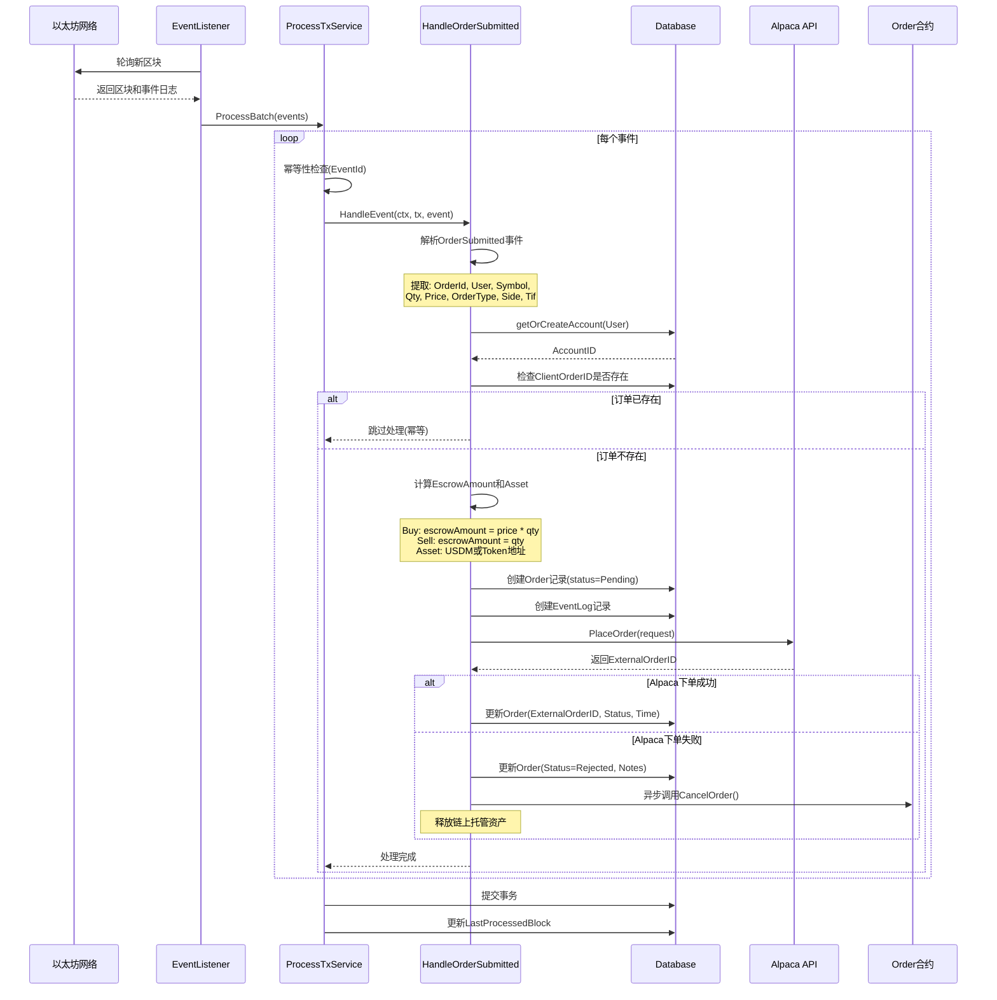
```mermaid
sequenceDiagram
    participant Blockchain as 以太坊网络
    participant Listener as EventListener
    participant Processor as ProcessTxService
    participant Handler as HandleOrderSubmitted
    participant DB as Database
    participant Alpaca as Alpaca API
    participant Contract as Order合约

    Listener->>Blockchain: 轮询新区块
    Blockchain-->>Listener: 返回区块和事件日志
    Listener->>Processor: ProcessBatch(events)

    loop 每个事件
        Processor->>Processor: 幂等性检查(EventId)
        Processor->>Handler: HandleEvent(ctx, tx, event)

        Handler->>Handler: 解析OrderSubmitted事件
        Note over Handler: 提取: OrderId, User, Symbol,<br/>Qty, Price, OrderType, Side, Tif

        Handler->>DB: getOrCreateAccount(User)
        DB-->>Handler: AccountID

        Handler->>DB: 检查ClientOrderID是否存在
        alt 订单已存在
            Handler-->>Processor: 跳过处理(幂等)
        else 订单不存在
            Handler->>Handler: 计算EscrowAmount和Asset
            Note over Handler: Buy: escrowAmount = price * qty<br/>Sell: escrowAmount = qty<br/>Asset: USDM或Token地址

            Handler->>DB: 创建Order记录(status=Pending)
            Handler->>DB: 创建EventLog记录

            Handler->>Alpaca: PlaceOrder(request)
            Alpaca-->>Handler: 返回ExternalOrderID

            alt Alpaca下单成功
                Handler->>DB: 更新Order(ExternalOrderID, Status, Time)
            else Alpaca下单失败
                Handler->>DB: 更新Order(Status=Rejected, Notes)
                Handler->>Contract: 异步调用CancelOrder()
                Note over Handler: 释放链上托管资产
            end

            Handler-->>Processor: 处理完成
        end
    end

    Processor->>DB: 提交事务
    Processor->>DB: 更新LastProcessedBlock
```

**处理步骤详解**：
1. **解析事件参数**：从链上事件提取订单信息
2. **获取或创建用户账户**：通过 `getOrCreateAccount()` 确保 Account 记录存在
3. **幂等性检查**：通过 `ClientOrderID` 查询，避免重复处理
4. **计算托管金额**：
   - Buy订单：`escrowAmount = price × quantity`
   - Sell订单：`escrowAmount = quantity`
5. **确定托管资产**：
   - Buy订单：USDM 地址
   - Sell订单：从合约查询 `symbolToToken[symbol]` 获取代币地址
6. **创建数据库记录**：Order（状态=Pending）、EventLog
7. **向 Alpaca 提交订单**：根据订单类型构建 PlaceOrderRequest
8. **处理 Alpaca 响应**：
   - 成功：更新 ExternalOrderID、Status、时间戳
   - 失败：更新为 Rejected，异步调用链上 `CancelOrder()` 退款

**数据库操作**：INSERT orders, INSERT event_logs

**错误处理**：Alpaca 失败不阻断事务，订单标记为 Rejected，异步释放链上托管资产

##### 1.3.2 CancelRequested 事件处理

**触发条件**：用户调用合约 `requestCancel(orderId)`

**事件参数**：`orderId`, `user`, `blockTimestamp`

**处理流程**：

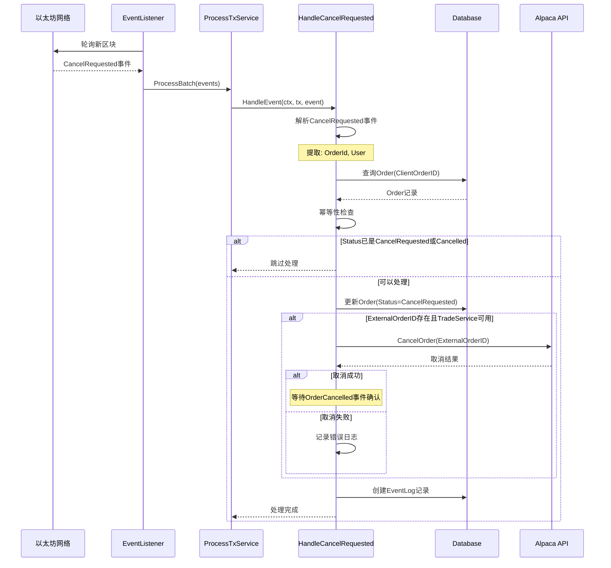
```mermaid
sequenceDiagram
    participant Blockchain as 以太坊网络
    participant Listener as EventListener
    participant Processor as ProcessTxService
    participant Handler as HandleCancelRequested
    participant DB as Database
    participant Alpaca as Alpaca API

    Listener->>Blockchain: 轮询新区块
    Blockchain-->>Listener: CancelRequested事件
    Listener->>Processor: ProcessBatch(events)
    Processor->>Handler: HandleEvent(ctx, tx, event)

    Handler->>Handler: 解析CancelRequested事件
    Note over Handler: 提取: OrderId, User

    Handler->>DB: 查询Order(ClientOrderID)
    DB-->>Handler: Order记录

    Handler->>Handler: 幂等性检查
    alt Status已是CancelRequested或Cancelled
        Handler-->>Processor: 跳过处理
    else 可以处理
        Handler->>DB: 更新Order(Status=CancelRequested)

        alt ExternalOrderID存在且TradeService可用
            Handler->>Alpaca: CancelOrder(ExternalOrderID)
            Alpaca-->>Handler: 取消结果

            alt 取消成功
                Note over Handler: 等待OrderCancelled事件确认
            else 取消失败
                Handler->>Handler: 记录错误日志
            end
        end

        Handler->>DB: 创建EventLog记录
        Handler-->>Processor: 处理完成
    end
```

**处理步骤详解**：
1. **解析事件参数**：提取 orderId 和 user
2. **查询订单记录**：通过 ClientOrderID 查找
3. **幂等性检查**：状态已是 CancelRequested 或 Cancelled 则跳过
4. **更新订单状态**：设置状态为 CancelRequested
5. **向 Alpaca 发送取消请求**：如果存在 ExternalOrderID
6. **记录事件日志**

**中间状态**：CancelRequested 是取消前的过渡状态，最终由 OrderCancelled 事件确认

**数据库操作**：UPDATE orders(status), INSERT event_logs

##### 1.3.3 OrderCancelled 事件处理

**触发条件**：合约执行取消操作后发出

**事件参数**：`orderId`, `user`, `asset`, `refundAmount`, `side`, `orderType`, `tif`, `previousStatus`

**处理流程**：

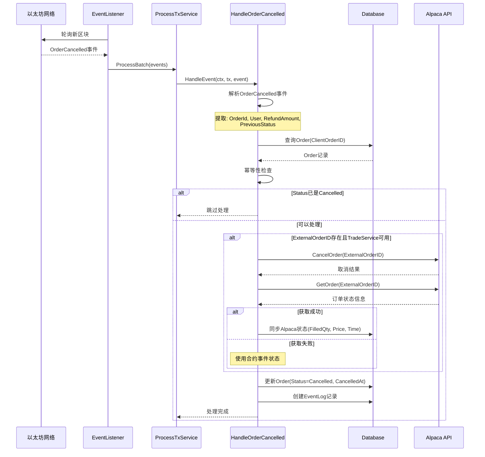
```mermaid
sequenceDiagram
    participant Blockchain as 以太坊网络
    participant Listener as EventListener
    participant Processor as ProcessTxService
    participant Handler as HandleOrderCancelled
    participant DB as Database
    participant Alpaca as Alpaca API

    Listener->>Blockchain: 轮询新区块
    Blockchain-->>Listener: OrderCancelled事件
    Listener->>Processor: ProcessBatch(events)
    Processor->>Handler: HandleEvent(ctx, tx, event)

    Handler->>Handler: 解析OrderCancelled事件
    Note over Handler: 提取: OrderId, User, RefundAmount,<br/>PreviousStatus

    Handler->>DB: 查询Order(ClientOrderID)
    DB-->>Handler: Order记录

    Handler->>Handler: 幂等性检查
    alt Status已是Cancelled
        Handler-->>Processor: 跳过处理
    else 可以处理
        alt ExternalOrderID存在且TradeService可用
            Handler->>Alpaca: CancelOrder(ExternalOrderID)
            Alpaca-->>Handler: 取消结果

            Handler->>Alpaca: GetOrder(ExternalOrderID)
            Alpaca-->>Handler: 订单状态信息

            alt 获取成功
                Handler->>DB: 同步Alpaca状态(FilledQty, Price, Time)
            else 获取失败
                Note over Handler: 使用合约事件状态
            end
        end

        Handler->>DB: 更新Order(Status=Cancelled, CancelledAt)
        Handler->>DB: 创建EventLog记录
        Handler-->>Processor: 处理完成
    end
```

**处理步骤详解**：
1. **解析事件参数**：提取订单信息和退款金额
2. **查询订单记录**：通过 ClientOrderID 查找
3. **幂等性检查**：状态已是 Cancelled 则跳过
4. **同步 Alpaca 状态**（双向同步）：
   - 尝试取消 Alpaca 订单
   - 获取 Alpaca 最新状态（成交量、价格、时间）
   - 如果获取失败，使用合约事件数据
5. **更新订单状态**：设置状态为 Cancelled，记录取消时间
6. **记录事件日志**

**双向同步**：链上事件驱动 Alpaca 状态同步，确保一致性

**数据库操作**：UPDATE orders(status, cancelled_at, filled_*), INSERT event_logs

##### 1.3.4 OrderExecuted 事件处理

**触发条件**：订单执行完成后合约发出

**事件参数**：`orderId`, `refundAmount`, `tif`

**处理流程**：

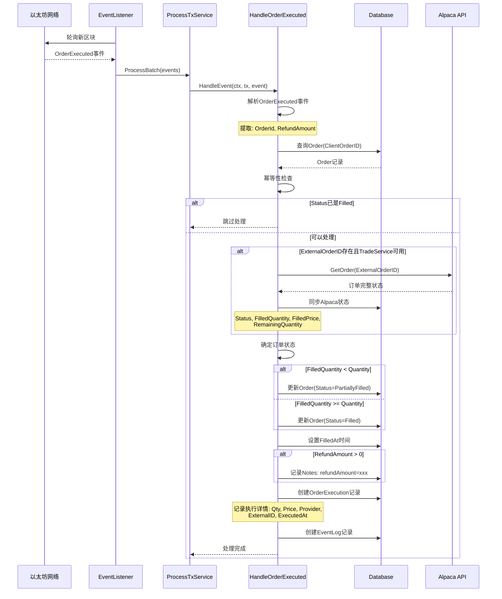
```mermaid
sequenceDiagram
    participant Blockchain as 以太坊网络
    participant Listener as EventListener
    participant Processor as ProcessTxService
    participant Handler as HandleOrderExecuted
    participant DB as Database
    participant Alpaca as Alpaca API

    Listener->>Blockchain: 轮询新区块
    Blockchain-->>Listener: OrderExecuted事件
    Listener->>Processor: ProcessBatch(events)
    Processor->>Handler: HandleEvent(ctx, tx, event)

    Handler->>Handler: 解析OrderExecuted事件
    Note over Handler: 提取: OrderId, RefundAmount

    Handler->>DB: 查询Order(ClientOrderID)
    DB-->>Handler: Order记录

    Handler->>Handler: 幂等性检查
    alt Status已是Filled
        Handler-->>Processor: 跳过处理
    else 可以处理
        alt ExternalOrderID存在且TradeService可用
            Handler->>Alpaca: GetOrder(ExternalOrderID)
            Alpaca-->>Handler: 订单完整状态

            Handler->>DB: 同步Alpaca状态
            Note over Handler: Status, FilledQuantity, FilledPrice,<br/>RemainingQuantity
        end

        Handler->>Handler: 确定订单状态
        alt FilledQuantity < Quantity
            Handler->>DB: 更新Order(Status=PartiallyFilled)
        else FilledQuantity >= Quantity
            Handler->>DB: 更新Order(Status=Filled)
        end
        Handler->>DB: 设置FilledAt时间

        alt RefundAmount > 0
            Handler->>DB: 记录Notes: refundAmount=xxx
        end

        Handler->>DB: 创建OrderExecution记录
        Note over Handler: 记录执行详情: Qty, Price, Provider,<br/>ExternalID, ExecutedAt

        Handler->>DB: 创建EventLog记录
        Handler-->>Processor: 处理完成
    end
```

**处理步骤详解**：
1. **解析事件参数**：提取 orderId 和 refundAmount
2. **查询订单记录**：通过 ClientOrderID 查找
3. **幂等性检查**：状态已是 Filled 则跳过
4. **同步 Alpaca 状态**（优先级最高）：
   - 获取 Alpaca 订单完整状态
   - 同步 Status、FilledQuantity、FilledPrice、RemainingQuantity
5. **确定订单状态**：
   - FilledQuantity < Quantity：PartiallyFilled
   - FilledQuantity >= Quantity：Filled
6. **记录退款金额**：如有，记录在 Notes 字段
7. **创建执行记录**：OrderExecution 记录执行详情
8. **记录事件日志**

**状态同步优先级**：Alpaca 状态 > 合约事件数据

**数据库操作**：UPDATE orders(status, filled_*, remaining_quantity), INSERT order_executions, INSERT event_logs

#### 1.4 幂等性与容错机制

**事件级幂等性**：
- 通过全局 EventId（自增 ID）防止重复处理
- 事件处理失败时回滚事务，不更新断点

**业务级幂等性**：
- **OrderSubmitted**：通过 ClientOrderID 唯一性检查
- **CancelRequested**：检查状态是否已是 CancelRequested/Cancelled
- **OrderCancelled**：检查状态是否已是 Cancelled
- **OrderExecuted**：检查状态是否已是 Filled

**断点续传机制**：
- `event_client_record` 表记录每个链的 LastEventId 和 LastBlock
- 重启后从上次位置继续处理
- 批量处理在单一事务中，保证原子性

**失败处理**：
- **处理失败**：事务回滚，不更新断点
- **Alpaca 失败**：记录错误但不阻断（OrderSubmitted 特例）
- **链上查询失败**：降级处理（使用事件数据）

#### 1.5 数据库表关系

**核心表关系**：

```
┌──────────────┐     ┌──────────────┐     ┌──────────────────┐
│   account    │────<│   orders     │────<│ order_executions │
└──────────────┘     └──────┬───────┘     └──────────────────┘
                            │
                            │
                     ┌──────┴───────┐
                     │ event_logs   │
                     └──────────────┘

┌──────────────────────────────────────┐
│    event_client_record               │
│  (chain_id, last_event_id, block)    │
└──────────────────────────────────────┘
```

**表说明**：
- **orders**：订单主表，记录完整订单生命周期
- **order_executions**：订单执行记录，支持部分成交跟踪
- **event_logs**：事件日志，记录所有处理的链上事件
- **event_client_record**：断点续传记录
- **account**：用户账户（链上地址）

**启动命令**：
```bash
go run ./apps/indexer -c config/indexer.yaml
```

**入口文件**：`apps/indexer/main.go`

### 2. Alpaca Stream - Alpaca WebSocket 监听

#### 2.1 架构概览

**职责**：
- 通过 Alpaca WebSocket 接收订单状态更新
- 订单成交后调用链上合约确认
- 铸造/销毁代币
- 统一订阅 Alpaca Market Data WebSocket
- 通过 Kafka 发布 Bar 数据和订单更新

**双客户端架构**：
```
┌─────────────────────────────────────────────────────────────┐
│                    AlpacaWebSocketService                   │
├──────────────────────────────────────┬──────────────────────┤
│       Trade Updates Client           │    Market Data Client │
│   (paper-api.alpaca.markets)         │ (stream.data.alpaca) │
├──────────────────────────────────────┼──────────────────────┤
│  - trade_updates 流                  │  - bars 流            │
│  - 订单生命周期事件 (13种)            │  - quotes 流          │
│  - OrderSyncService 处理             │  - trades 流          │
│  - 链上交互 (markExecuted/cancel)    │  - BarKafkaService    │
└──────────────────────────────────────┴──────────────────────┘
```

**核心组件**：
- `AlpacaWebSocketService` (`service/alpaca_ws_service.go`) - WebSocket 服务管理
- `OrderSyncService` (`service/order_sync_service.go`) - 订单状态同步
- `SubscriptionManager` (`ws/subscription.go`) - 订阅管理
- `TradeUpdatesHandler` (`handlers/trade_updates_handler.go`) - 订单事件路由
- `BarsHandler` (`handlers/bars_handler.go`) - K线数据处理

#### 2.2 WebSocket 连接管理

**连接流程**：

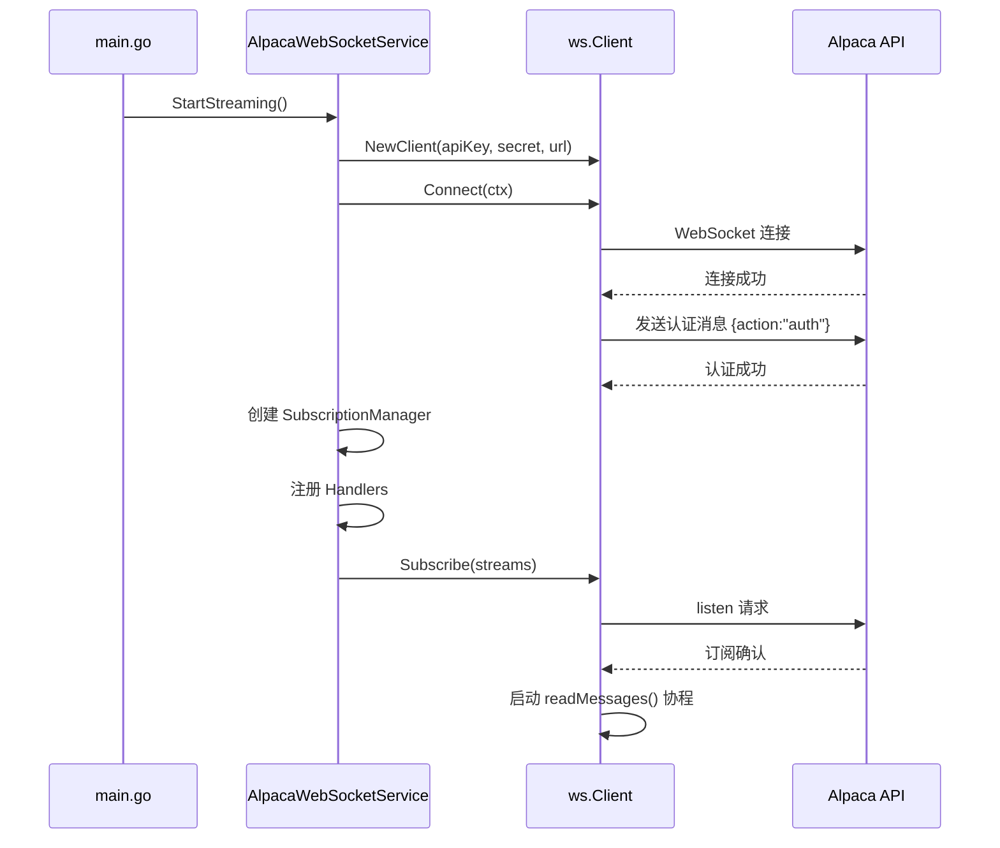
```mermaid
sequenceDiagram
    participant Main as main.go
    participant Service as AlpacaWebSocketService
    participant WS as ws.Client
    participant Alpaca as Alpaca API

    Main->>Service: StartStreaming()
    Service->>WS: NewClient(apiKey, secret, url)
    Service->>WS: Connect(ctx)
    WS->>Alpaca: WebSocket 连接
    Alpaca-->>WS: 连接成功
    WS->>Alpaca: 发送认证消息 {action:"auth"}
    Alpaca-->>WS: 认证成功
    Service->>Service: 创建 SubscriptionManager
    Service->>Service: 注册 Handlers
    Service->>WS: Subscribe(streams)
    WS->>Alpaca: listen 请求
    Alpaca-->>WS: 订阅确认
    WS->>WS: 启动 readMessages() 协程
```

**连接特性**：
- **认证机制**: 连接后发送 `{action:"auth", key:apiKey, secret:apiSecret}`
- **心跳保活**: 定期发送 Ping 帧，接收 Pong 时延长 ReadDeadline
- **自动重连**: 连接断开时自动重连，支持指数退避策略
- **订阅恢复**: 重连成功后自动重新订阅所有流

#### 2.3 订单生命周期事件处理（trade_updates）

**事件类型列表**：

| 事件 | 说明 | 处理函数 | 主要操作 |
|------|------|---------|----------|
| `pending_new` | 新订单待确认 | (待实现) | - |
| `new` | 订单已被接收 | HandleNew | 状态→accepted，保存 ExternalOrderID |
| `rejected` | 订单被拒绝 | HandleRejected | 状态→rejected，调用 callCancelOrder |
| `partial_fill` | 部分成交 | HandlePartialFill | 创建 OrderExecution，更新成交量 |
| `fill` | 完全成交 | HandleFill | 同 partial_fill，调用 callMarkExecuted |
| `canceled` | 订单已取消 | HandleCanceled | 状态→cancelled，根据情况调用链上方法 |
| `expired` | 订单已过期 | HandleExpired | 状态→expired，根据情况调用链上方法 |
| `done_for_day` | 当日交易结束 | HandleDoneForDay | 仅记录日志，不修改状态 |
| `pending_cancel` | 取消请求待确认 | (待实现) | - |
| `pending_replace` | 修改请求待确认 | (待实现) | - |
| `cancel_rejected` | 取消请求被拒绝 | (待实现) | - |
| `replace_rejected` | 修改请求被拒绝 | (待实现) | - |
| `replaced` | 订单被修改替换 | (待实现) | - |

**fill 事件完整处理流程**：

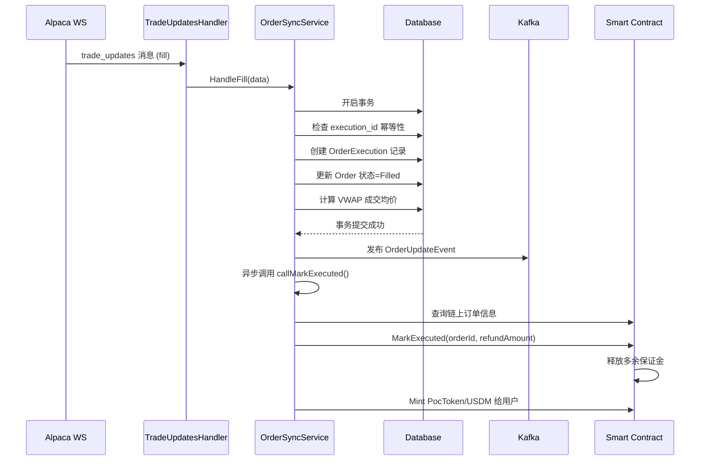
```mermaid
sequenceDiagram
    participant WS as Alpaca WS
    participant Handler as TradeUpdatesHandler
    participant Service as OrderSyncService
    participant DB as Database
    participant Kafka as Kafka
    participant Chain as Smart Contract

    WS->>Handler: trade_updates 消息 (fill)
    Handler->>Service: HandleFill(data)

    Service->>DB: 开启事务
    Service->>DB: 检查 execution_id 幂等性
    Service->>DB: 创建 OrderExecution 记录
    Service->>DB: 更新 Order 状态=Filled
    Service->>DB: 计算 VWAP 成交均价
    DB-->>Service: 事务提交成功

    Service->>Kafka: 发布 OrderUpdateEvent

    Service->>Service: 异步调用 callMarkExecuted()
    Service->>Chain: 查询链上订单信息
    Service->>Chain: MarkExecuted(orderId, refundAmount)
    Chain->>Chain: 释放多余保证金
    Service->>Chain: Mint PocToken/USDM 给用户
```

**数据库操作**：
- **HandleNew**: 更新订单状态为 `accepted`，保存 `ExternalOrderID`
- **HandleFill/PartialFill**: 在事务中创建 `OrderExecution` 记录，更新订单成交量和状态
- **HandleCanceled/Expired/Rejected**: 更新订单状态，设置对应时间戳

**Kafka 发布**：
每个事件处理完成后发布 `OrderUpdateEvent`，包含账户ID、订单ID、状态、成交量等信息。

#### 2.4 市场数据事件处理

**bars 事件处理流程**：

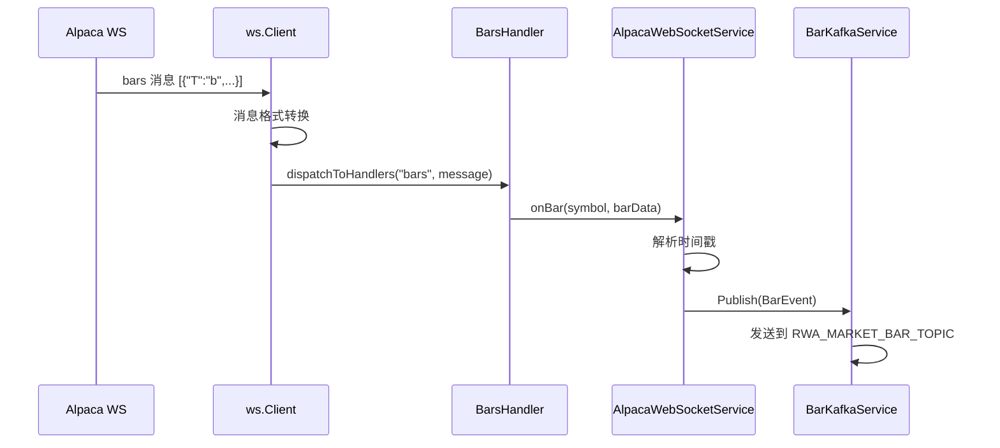
```mermaid
sequenceDiagram
    participant WS as Alpaca WS
    participant Client as ws.Client
    participant Handler as BarsHandler
    participant Service as AlpacaWebSocketService
    participant Kafka as BarKafkaService

    WS->>Client: bars 消息 [{"T":"b",...}]
    Client->>Client: 消息格式转换
    Client->>Handler: dispatchToHandlers("bars", message)
    Handler->>Service: onBar(symbol, barData)
    Service->>Service: 解析时间戳
    Service->>Kafka: Publish(BarEvent)
    Kafka->>Kafka: 发送到 RWA_MARKET_BAR_TOPIC
```

**支持的市场数据流**：
- **bars**: K线数据（OHLCV）
- **quotes**: 实时报价数据（当前未实现业务逻辑）
- **trades**: 实时成交数据（当前未实现业务逻辑）

#### 2.5 链上交互

**callMarkExecuted 调用时机**：
- 订单完全成交时
- 订单部分成交后取消/过期时

**处理流程**：
1. 查询链上订单信息（用户地址、质押金额）
2. 计算退款金额（Buy订单：退还超额 USDM；Sell订单：无需退款）
3. 调用 `OrderContract.MarkExecuted(orderId, refundAmount)`
4. 释放多余保证金给用户
5. Mint 代币：Buy订单→股票代币，Sell订单→USDM

**callCancelOrder 调用时机**：
- 订单完全取消时
- 订单拒绝时
- 订单未成交时过期时

**处理流程**：
1. 调用 `OrderContract.CancelOrder(orderId)`
2. 全额退还质押资产（Buy订单→USDM，Sell订单→股票代币）

#### 2.6 错误处理与容错

**幂等性保证**：
- HandleNew: 检查订单状态是否已是 accepted/filled/partially_filled
- HandleFill/PartialFill: 通过 execution_id 检查重复事件
- HandleCanceled/Expired: 检查订单是否已是目标状态

**失败事件持久化**：
- 处理失败时保存到 `failed_events` 表
- 包含完整事件 JSON 和错误信息
- 支持后续人工恢复

**重连机制**：
- WebSocket 断开时自动重连
- 指数退避策略：每次重连延迟翻倍，最大 60 秒
- 重连成功后自动重新订阅所有流

**监听的订单状态**：
- `new` - 订单创建
- `fill` - 完全成交
- `partial_fill` - 部分成交
- `canceled` - 已取消
- `rejected` - 被拒绝
- `expired` - 已过期

**启动命令**：
```bash
go run ./apps/alpaca-stream -a alpaca-stream -c config/alpaca-stream.yaml
```

**入口文件**：`apps/alpaca-stream/main.go`

### 3. API Server - REST API

#### 3.1 架构概览

**职责**：
- 提供 RESTful API 接口
- 查询订单、账户、行情数据
- 支持分页和过滤
- API 签名验证机制
- Redis 缓存优化

**整体架构**：

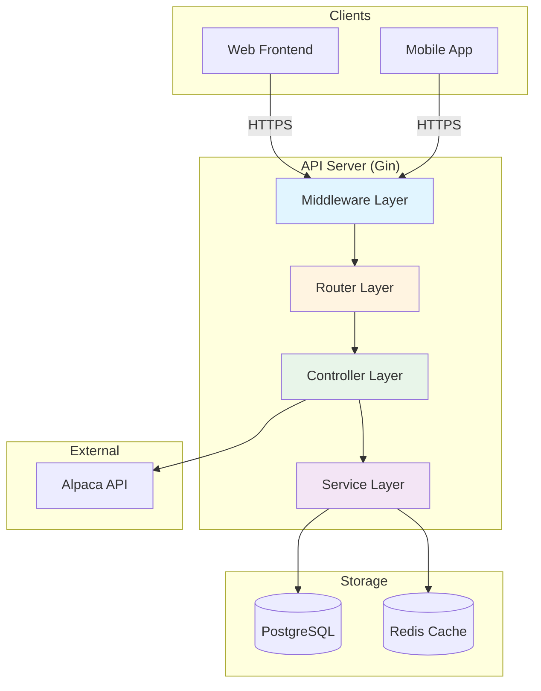
```mermaid
flowchart TB
    subgraph Clients
        C1[Web Frontend]
        C2[Mobile App]
    end

    subgraph "API Server (Gin)"
        G1[Middleware Layer]
        G2[Router Layer]
        G3[Controller Layer]
        G4[Service Layer]
    end

    subgraph External
        ALP[Alpaca API]
    end

    subgraph Storage
        PG[(PostgreSQL)]
        REDIS[(Redis Cache)]
    end

    C1 & C2 -->|HTTPS| G1
    G1 --> G2
    G2 --> G3
    G3 --> G4
    G4 --> PG
    G4 --> REDIS
    G3 --> ALP

    style G1 fill:#e1f5ff
    style G2 fill:#fff4e1
    style G3 fill:#e8f5e9
    style G4 fill:#f3e5f5
```

#### 3.2 核心组件说明

| 组件 | 文件路径 | 职责 |
|------|---------|------|
| Router | `apps/api/server/router.go` | 路由注册、中间件配置、Swagger 文档 |
| Controllers | `apps/api/controller/` | HTTP 请求处理、参数验证、响应格式化 |
| Services | `apps/api/service/` | 业务逻辑实现、数据库查询 |
| Middleware | `apps/api/server/middleware/` | API 签名验证、安全防护 |
| DTO | `apps/api/dto/` | 数据传输对象、请求/响应模型 |

#### 3.3 API 签名验证机制

API 服务器实现了自定义的签名验证中间件，确保请求的合法性和完整性。

**签名验证流程**：

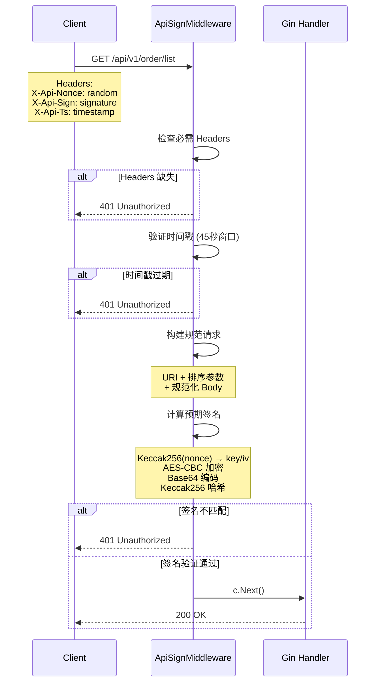
```mermaid
sequenceDiagram
    participant Client
    participant Middleware as ApiSignMiddleware
    participant Server as Gin Handler

    Client->>Middleware: GET /api/v1/order/list
    Note over Client: Headers:<br/>X-Api-Nonce: random<br/>X-Api-Sign: signature<br/>X-Api-Ts: timestamp

    Middleware->>Middleware: 检查必需 Headers
    alt Headers 缺失
        Middleware-->>Client: 401 Unauthorized
    end

    Middleware->>Middleware: 验证时间戳 (45秒窗口)
    alt 时间戳过期
        Middleware-->>Client: 401 Unauthorized
    end

    Middleware->>Middleware: 构建规范请求
    Note over Middleware: URI + 排序参数<br/>+ 规范化 Body

    Middleware->>Middleware: 计算预期签名
    Note over Middleware: Keccak256(nonce) → key/iv<br/>AES-CBC 加密<br/>Base64 编码<br/>Keccak256 哈希

    alt 签名不匹配
        Middleware-->>Client: 401 Unauthorized
    else 签名验证通过
        Middleware->>Server: c.Next()
        Server-->>Client: 200 OK
    end
```

**加密算法详解**：
1. 使用 `Keccak256(nonce)` 生成 32 字节密钥和 16 字节 IV
2. 使用 AES-CBC 模式加密规范请求字符串
3. 加密结果进行 Base64 编码
4. 再次 Base64 编码后进行 Keccak256 哈希
5. 最终签名为哈希值的十六进制表示

**关键代码位置**：`apps/api/server/middleware/api_sign_middleware.go`

**安全特性**：
- **防止重放攻击**：Nonce 机制 + 时间窗口验证（45秒）
- **请求完整性**：规范化的请求字符串确保参数排序和 JSON 格式一致
- **双向验证**：支持 Authorization Header 验证

#### 3.4 请求处理流程

**典型请求处理流程**：

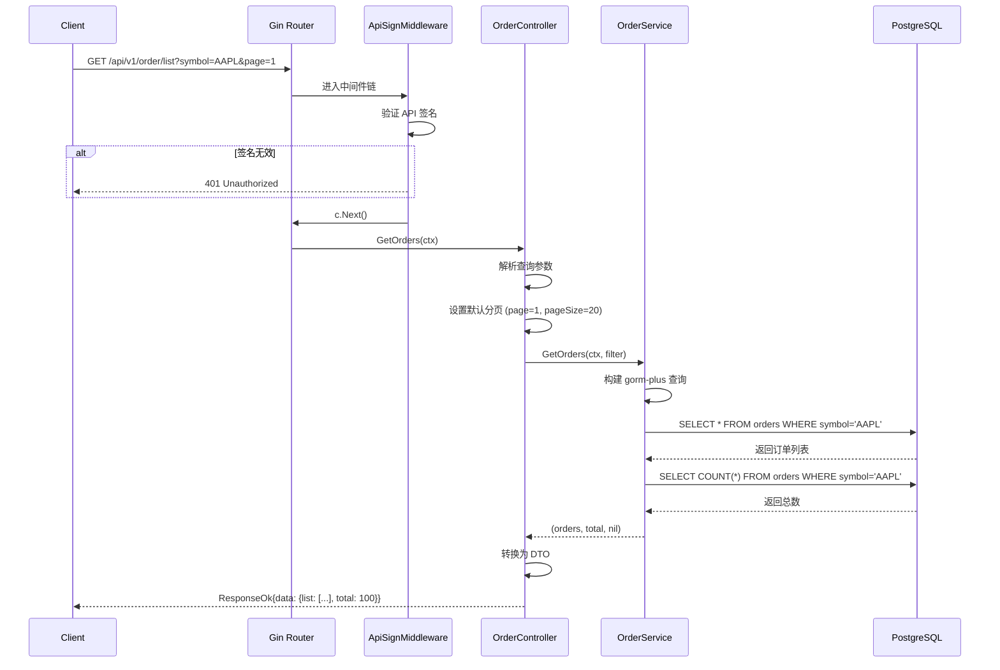
```mermaid
sequenceDiagram
    participant Client
    participant Router as Gin Router
    participant Middleware as ApiSignMiddleware
    participant Controller as OrderController
    participant Service as OrderService
    participant DB as PostgreSQL

    Client->>Router: GET /api/v1/order/list?symbol=AAPL&page=1
    Router->>Middleware: 进入中间件链

    Middleware->>Middleware: 验证 API 签名
    alt 签名无效
        Middleware-->>Client: 401 Unauthorized
    end

    Middleware->>Router: c.Next()
    Router->>Controller: GetOrders(ctx)

    Controller->>Controller: 解析查询参数
    Controller->>Controller: 设置默认分页 (page=1, pageSize=20)

    Controller->>Service: GetOrders(ctx, filter)
    Service->>Service: 构建 gorm-plus 查询
    Service->>DB: SELECT * FROM orders WHERE symbol='AAPL'
    DB-->>Service: 返回订单列表
    Service->>DB: SELECT COUNT(*) FROM orders WHERE symbol='AAPL'
    DB-->>Service: 返回总数
    Service-->>Controller: (orders, total, nil)

    Controller->>Controller: 转换为 DTO
    Controller-->>Client: ResponseOk{data: {list: [...], total: 100}}
```

**处理步骤详解**：
1. **路由匹配**：Gin Router 根据 HTTP 方法和路径匹配处理函数
2. **中间件验证**：API 签名验证、CORS、GZIP 压缩、请求日志
3. **参数绑定**：使用 `ShouldBindQuery` 解析查询参数
4. **参数校验**：设置默认值、范围检查（如 pageSize 最大 100）
5. **业务处理**：调用 Service 层执行业务逻辑
6. **数据转换**：将数据库模型转换为 DTO
7. **响应返回**：使用统一的 `ResponseOk` 或 `ResponseError` 格式

#### 3.5 API 端点清单

**公共接口** (`/common/`)
- `GET /health` - 健康检查

**交易接口** (`/trade/`)
- `GET /currentPrice` - 获取当前价格
- `GET /latestQuote` - 获取最新报价
- `GET /snapshot` - 获取市场快照
- `GET /historicalData` - 获取历史 K 线数据
- `GET /marketClock` - 获取市场时钟
- `GET /assets` - 获取资产列表
- `GET /asset` - 获取单个资产信息

**股票接口** (`/stock/`)
- `GET /list` - 获取股票列表（分页）
- `GET /detail` - 获取股票详情

**订单接口** (`/order/`)
- `GET /list` - 获取订单列表（分页，支持过滤）
- `GET /detail` - 获取订单详情
- `GET /executions` - 获取订单执行记录

#### 3.6 分层设计详解

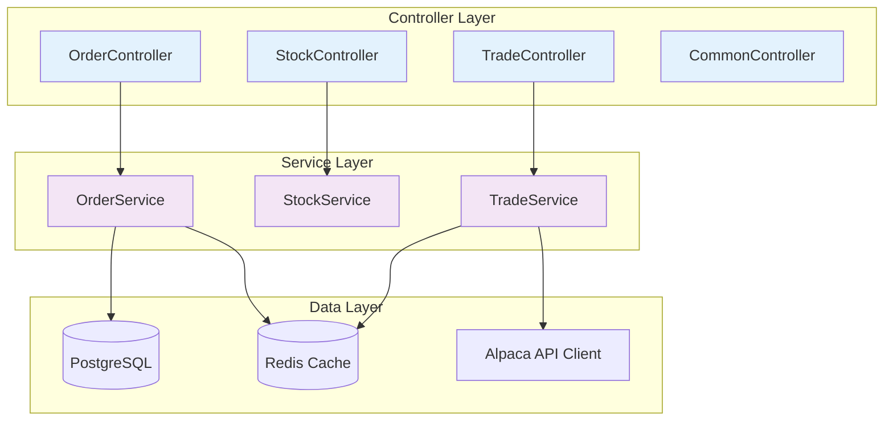
```mermaid
graph TB
    subgraph "Controller Layer"
        direction TB
        C1[OrderController]
        C2[StockController]
        C3[TradeController]
        C4[CommonController]
    end

    subgraph "Service Layer"
        direction TB
        S1[OrderService]
        S2[StockService]
        S3[TradeService]
    end

    subgraph "Data Layer"
        direction TB
        D1[(PostgreSQL)]
        D2[(Redis Cache)]
        D3[Alpaca API Client]
    end

    C1 --> S1
    C2 --> S2
    C3 --> S3

    S1 --> D1
    S1 --> D2
    S3 --> D2
    S3 --> D3

    style C1 fill:#e3f2fd
    style C2 fill:#e3f2fd
    style C3 fill:#e3f2fd
    style C4 fill:#e3f2fd
    style S1 fill:#f3e5f5
    style S2 fill:#f3e5f5
    style S3 fill:#f3e5f5
```

**设计原则**：
- **Controller 层**：仅负责 HTTP 请求/响应处理，不包含业务逻辑
- **Service 层**：包含业务逻辑和数据处理，使用 gorm-plus 简化数据库操作
- **数据访问层**：通过 GORM 访问 PostgreSQL，使用 Redis 缓存热点数据

**代码示例**：订单列表查询

```go
// Controller: apps/api/controller/order_ctl.go
func (ctl *OrderController) GetOrders(g *gin.Context) {
    ctx := g.Request.Context()

    var req dto.GetOrdersRequest
    if err := g.ShouldBindQuery(&req); err != nil {
        web.ResponseError(error_msg.ErrInvalidRequestParams, g)
        return
    }

    // 默认分页参数
    page := req.Page
    if page <= 0 {
        page = 1
    }
    pageSize := req.PageSize
    if pageSize <= 0 {
        pageSize = 20
    }
    if pageSize > 100 {
        pageSize = 100
    }

    filter := rwa.OrderFilter{
        Symbol: req.Symbol,
        Side:   req.Side,
        Status: req.Status,
        Limit:  pageSize,
        Offset: (page - 1) * pageSize,
    }

    orders, total, err := ctl.orderService.GetOrders(ctx, filter)
    // ...
}

// Service: apps/api/service/order_service.go
func (s *OrderService) GetOrders(ctx context.Context, filter rwa.OrderFilter) ([]*rwa.Order, int64, error) {
    q, u := gplus.NewQuery[rwa.Order]()

    // 构建查询条件
    if filter.AccountID != "" {
        q.Eq(&u.AccountID, filter.AccountID)
    }
    if filter.Symbol != "" {
        q.Eq(&u.Symbol, filter.Symbol)
    }
    // ... 其他过滤条件

    // 获取总数
    total, _ := gplus.SelectCount[rwa.Order](countQuery, gplus.Db(s.db))

    // 分页查询
    db := s.db.WithContext(ctx).Order("created_at DESC")
    if filter.Limit > 0 {
        db = db.Limit(filter.Limit)
    }
    if filter.Offset > 0 {
        db = db.Offset(filter.Offset)
    }

    list, _ := gplus.SelectList(q, gplus.Db(db))
    return list, total, nil
}
```

#### 3.7 分页和过滤

**分页参数**：
- `page`: 页码，默认 1
- `page_size`: 每页数量，默认 20，最大 100

**过滤参数**（订单接口示例）：
- `account_id`: 账户 ID
- `symbol`: 股票代码
- `side`: 买卖方向 (buy/sell)
- `status`: 订单状态

**响应格式**：
```json
{
  "code": 0,
  "message": "success",
  "data": {
    "list": [
      {
        "id": 1,
        "clientOrderId": "0x123...",
        "symbol": "AAPL",
        "side": "buy",
        "quantity": "100",
        "price": "150.25",
        "status": "filled",
        "createdAt": 1625097600
      }
    ],
    "total": 100
  }
}
```

#### 3.8 缓存策略

- **Trade 接口**：使用 Redis 缓存市场数据（价格、报价、K线）
- **订单/股票接口**：直接查询数据库，确保数据实时性
- **缓存失效**：根据业务需求设置 TTL

#### 3.9 依赖注入和模块化

使用 Uber FX 进行依赖注入和服务生命周期管理：

```go
// apps/api/main.go
app := fx.New(
    config.LoadModule(conf),         // 配置模块
    server.LoadModule(),              // 服务器模块
    service.LoadModule(),             // 服务模块
    controller.LoadModule(),          // 控制器模块
    redis_cache.LoadModule(conf.Redis),  // Redis 模块
    database.LoadModule(conf.Db),     // 数据库模块
    trade.LoadModule(conf.Alpaca),    // Alpaca 交易模块
)
```

#### 3.10 启动命令和配置

**启动命令**：
```bash
go run ./apps/api -a api -c config/api.yaml
```

**配置文件**：`apps/api/config/config.yaml`

主要配置项：
- `server.port`: 服务端口（默认 8000）
- `server.env`: 环境（dev/prod）
- `server.basePath`: API 基础路径（/api/v1）
- `server.apiKeys`: API 密钥列表
- `server.enableSignCheck`: 是否启用签名验证
- `db`: PostgreSQL 连接配置
- `redis`: Redis 连接配置
- `alpaca`: Alpaca API 配置

**入口文件**：`apps/api/main.go`

### 4. WS Server - WebSocket Server

#### 4.1 架构概览

**职责**：
- 向前端推送实时行情数据（K线、订单更新）
- 管理客户端连接和订阅状态
- 消费 Kafka 消息并广播给订阅客户端

**核心组件**：

| 组件 | 文件 | 职责 |
|------|------|------|
| Server | ws/ws_server.go | WebSocket 服务器核心，基于 Melody |
| SubUnsubService | ws/ws_sub_unsub_service.go | 订阅/取消订阅处理 |
| OrderUpdateSubscriber | service/order_update_subscriber.go | 订单更新推送 |
| BarUpdateSubscriber | service/bar_update_subscriber.go | K线数据推送 |

**数据流**：
```
Alpaca Stream → Kafka → WS Server → 客户端
                     ↓
                 订阅管理 (Session)
```

#### 4.2 模块启动流程

**依赖注入配置 (fx.go)**：

```go
func LoadModule() fx.Option {
	return fx.Module("ws",
		fx.Provide(
			NewServer,           // 提供 Server 实例
			NewSubUnsubService,  // 提供 SubUnsubService 实例
		),
		fx.Invoke(func(_ *Server, _ *SubUnsubService) {}),
	)
}
```

**启动流程图**：

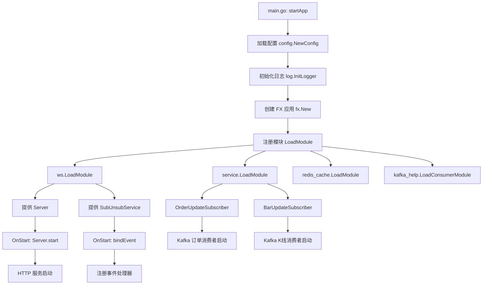
```mermaid
flowchart TD
    A[main.go: startApp] --> B[加载配置 config.NewConfig]
    B --> C[初始化日志 log.InitLogger]
    C --> D[创建 FX 应用 fx.New]
    D --> E[注册模块 LoadModule]

    E --> F1[ws.LoadModule]
    E --> F2[service.LoadModule]
    E --> F3[redis_cache.LoadModule]
    E --> F4[kafka_help.LoadConsumerModule]

    F1 --> G1[提供 Server]
    F1 --> G2[提供 SubUnsubService]

    F2 --> H1[OrderUpdateSubscriber]
    F2 --> H2[BarUpdateSubscriber]

    G1 --> I1[OnStart: Server.start]
    G2 --> I2[OnStart: bindEvent]

    I1 --> J[HTTP 服务启动]
    I2 --> K[注册事件处理器]

    H1 --> L[Kafka 订单消费者启动]
    H2 --> M[Kafka K线消费者启动]
```

**组件初始化顺序**：
1. **NewServer** - 创建 Melody 实例，注册生命周期钩子
2. **NewSubUnsubService** - 依赖 Server，注册 OnStart 钩子调用 bindEvent
3. **NewOrderUpdateSubscriber** - 依赖 Server，创建 Kafka 消费者
4. **NewBarUpdateSubscriber** - 依赖 Server，创建 Kafka 消费者

#### 4.3 WebSocket 连接建立流程

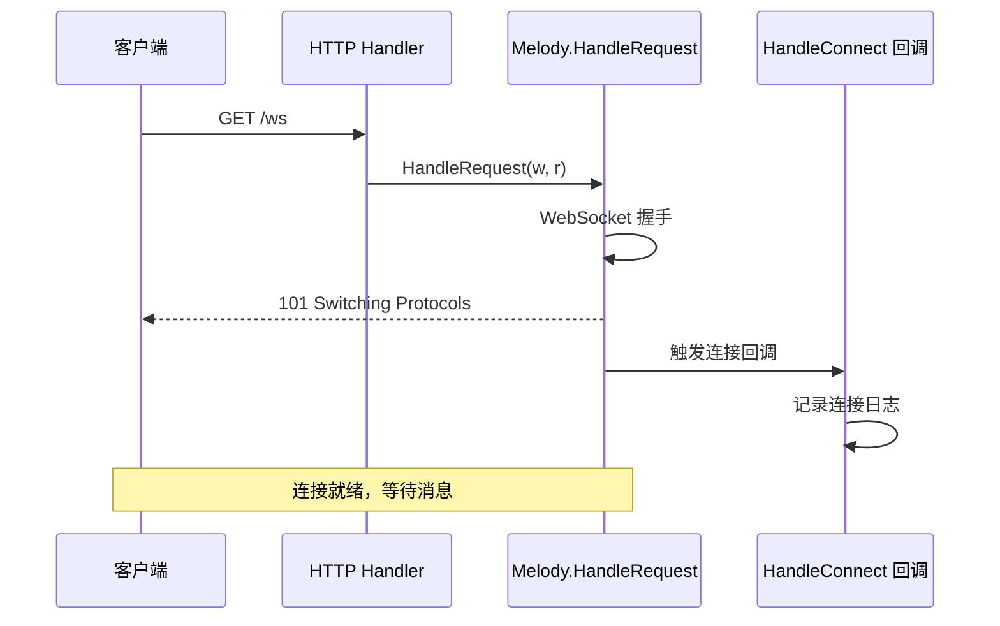
```mermaid
sequenceDiagram
    participant Client as 客户端
    participant HTTP as HTTP Handler
    participant Melody as Melody.HandleRequest
    participant OnConnect as HandleConnect 回调

    Client->>HTTP: GET /ws
    HTTP->>Melody: HandleRequest(w, r)
    Melody->>Melody: WebSocket 握手
    Melody-->>Client: 101 Switching Protocols
    Melody->>OnConnect: 触发连接回调
    OnConnect->>OnConnect: 记录连接日志
    Note over Client,Melody: 连接就绪，等待消息
```

**关键代码**：

```go
// ws_server.go: bindHttp
http.HandleFunc(basePath, func(w http.ResponseWriter, r *http.Request) {
    err := s.m.HandleRequest(w, r)  // Melody 处理握手升级
})

// ws_sub_unsub_service.go: bindEvent
s.wsServer.GetMelody().HandleConnect(func(session *melody.Session) {
    log.InfoZ(ctx, "ws client connected", zap.String("client", session.Request.RemoteAddr))
})
```

#### 4.4 订阅/取消订阅流程

**消息格式**：

```json
// 订阅 K 线
{"id":1,"method":"SUBSCRIBE","params":{"type":"bar","symbols":["AAPL","MSFT"]}}

// 订阅订单
{"id":2,"method":"SUBSCRIBE","params":{"type":"order","account_id":12345}}

// 取消订阅
{"id":3,"method":"UNSUBSCRIBE","params":{"type":"bar","symbols":["AAPL"]}}
```

**处理流程**：

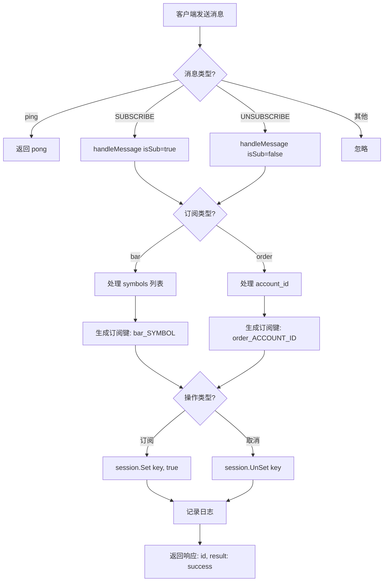
```mermaid
flowchart TD
    A[客户端发送消息] --> B{消息类型?}
    B -->|ping| C[返回 pong]
    B -->|SUBSCRIBE| D[handleMessage isSub=true]
    B -->|UNSUBSCRIBE| E[handleMessage isSub=false]
    B -->|其他| F[忽略]

    D --> G{订阅类型?}
    E --> G

    G -->|bar| H[处理 symbols 列表]
    G -->|order| I[处理 account_id]

    H --> J[生成订阅键: bar_SYMBOL]
    I --> K[生成订阅键: order_ACCOUNT_ID]

    J --> L{操作类型?}
    K --> L

    L -->|订阅| M[session.Set key, true]
    L -->|取消| N[session.UnSet key]

    M --> O[记录日志]
    N --> O

    O --> P[返回响应: id, result: success]
```

**订阅键规则**：
- K线订阅：`bar_{SYMBOL}`（如 `bar_AAPL`）
- 订单订阅：`order_{ACCOUNT_ID}`（如 `order_12345`）

#### 4.5 消息推送流程

**订单更新推送**：

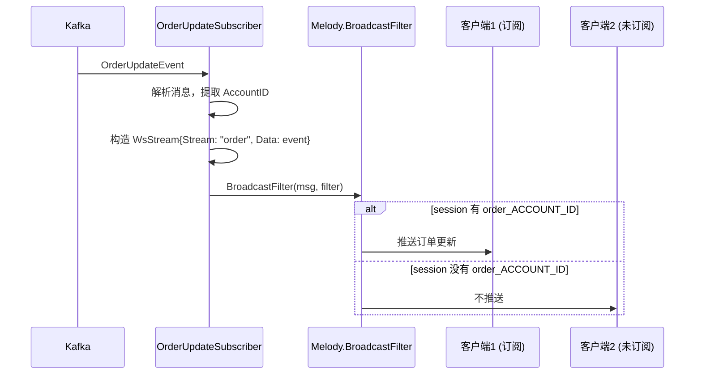
```mermaid
sequenceDiagram
    participant Kafka as Kafka
    participant Sub as OrderUpdateSubscriber
    participant Melody as Melody.BroadcastFilter
    participant S1 as 客户端1 (订阅)
    participant S2 as 客户端2 (未订阅)

    Kafka->>Sub: OrderUpdateEvent
    Sub->>Sub: 解析消息，提取 AccountID
    Sub->>Sub: 构造 WsStream{Stream: "order", Data: event}
    Sub->>Melody: BroadcastFilter(msg, filter)

    alt session 有 order_ACCOUNT_ID
        Melody->>S1: 推送订单更新
    else session 没有 order_ACCOUNT_ID
        Melody->>S2: 不推送
    end
```

**K线数据推送**：

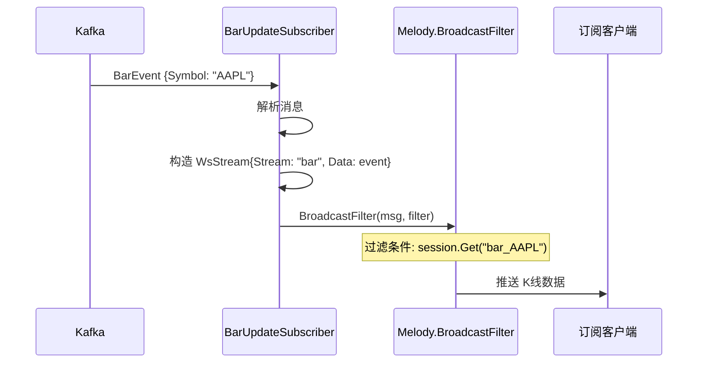
```mermaid
sequenceDiagram
    participant Kafka as Kafka
    participant Sub as BarUpdateSubscriber
    participant Melody as Melody.BroadcastFilter
    participant Client as 订阅客户端

    Kafka->>Sub: BarEvent {Symbol: "AAPL"}
    Sub->>Sub: 解析消息
    Sub->>Sub: 构造 WsStream{Stream: "bar", Data: event}
    Sub->>Melody: BroadcastFilter(msg, filter)

    Note over Melody: 过滤条件: session.Get("bar_AAPL")

    Melody->>Client: 推送 K线数据
```

**推送消息格式**：

```json
{
  "stream": "bar",
  "data": {
    "symbol": "AAPL",
    "open": "150.25",
    "high": "151.00",
    "low": "150.10",
    "close": "150.75",
    "volume": 1000000,
    "timestamp": 1625097600
  }
}
```

#### 4.6 核心设计特点

**会话状态管理**：
- 使用 `session.Set(key, value)` 存储订阅标记
- 使用 `session.Get(key)` 检查订阅状态
- 使用 `session.UnSet(key)` 取消订阅

**精确推送**：
- `BroadcastFilter()` 只向满足条件的客户端推送
- 基于 session 中存储的订阅键进行过滤

**错误处理**：
- 消息格式错误静默忽略
- 推送失败记录日志但不中断服务

#### 4.7 启动命令

```bash
go run ./apps/ws-server -a ws-server -c config/ws-server.yaml
```

**入口文件**：`apps/ws-server/main.go`

---

## 数据库表结构

### 核心表

| 表名 | 说明 |
|------|------|
| `orders` | 订单记录 |
| `order_executions` | 订单成交明细 |
| `accounts` | 用户账户（链上地址） |
| `stocks` | 支持的股票列表 |
| `trading_accounts` | Alpaca 交易账户 |
| `positions` | 用户持仓 |
| `event_logs` | 链上事件日志 |
| `event_client_record` | 事件处理记录（断点续传） |
| `failed_events` | 失败事件持久化 |

### Order 表字段说明

```go
type Order struct {
    ID                uint64          // 主键
    ClientOrderID     string          // 链上订单 ID
    AccountID         uint64          // 账户 ID
    Symbol            string          // 交易标的（如 AAPL）
    Side              OrderSide       // 买卖方向 (buy/sell)
    Type              OrderType       // 订单类型 (market/limit)
    Quantity          decimal.Decimal // 订单数量
    Price             decimal.Decimal // 订单价格
    Status            OrderStatus     // 订单状态
    FilledQuantity    decimal.Decimal // 成交数量
    FilledPrice       decimal.Decimal // 成交价格
    EscrowAmount      decimal.Decimal // 托管金额
    EscrowAsset       string          // 托管资产地址
    RefundAmount      decimal.Decimal // 退款金额
    ExternalOrderID   string          // Alpaca 订单 ID
    ContractTxHash    string          // 链上下单交易哈希
    ExecuteTxHash     string          // 链上执行交易哈希
    CreatedAt         time.Time       // 创建时间
    UpdatedAt         time.Time       // 更新时间
}
```

### 订单状态机

```
new → pending → accepted → filled/partially_filled/cancelled/rejected/expired
```

---

## 开发指南

### 环境要求

```
go 1.25.1+
redis 7.0+
postgres 15+
kafka 3.5+
```

### 本地开发环境设置

```bash
# 启动依赖服务
make install_all

# 或分别启动
make install_database  # PostgreSQL + Redis
make install_kafka     # Kafka
```

### 配置文件

各服务需要独立的 YAML 配置文件，包含：
- 数据库连接
- Redis 连接
- Kafka 配置
- 区块链 RPC
- Alpaca API 凭证
- 服务监听端口

### 依赖注入

项目使用 `uber/fx` 进行依赖注入和服务生命周期管理：

```go
app := fx.New(
    config.LoadModule(conf),
    database.LoadModule(conf.Db),
    evm_helper.LoadModule(conf.RpcInfo),
    trade.LoadModule(conf.Alpaca),
    service.LoadModule(),
)
```

### 日志

使用 `uber/zap` 结构化日志：

```go
log.InfoZ(ctx, "order submitted",
    zap.String("orderId", orderId),
    zap.String("symbol", symbol),
)
```

---

## 测试

```bash
# 运行所有测试
go test ./... -v

# 运行特定服务测试
go test ./apps/indexer/... -v
```

---

## 生成合约绑定

```bash
# 生成 OrderContract 绑定
abigen --abi contracts/rwa/Order.abi \
       --pkg rwa \
       --type OrderContract \
       --out libs/contracts/rwa/order.go
```

---

## 常见问题

### Q: Indexer 如何保证断点续传？

A: `event_client_record` 表记录每个事件客户端已处理的区块高度，重启后从上次位置继续。

### Q: 如何处理事件重复？

A: 每个事件有唯一的 EventId，通过 `txHash + logIndex` 业务级去重。

### Q: Kafka 如何保证消息顺序？

A: 消息 Key 设置为 `accountId`，同一用户的消息发送到同一分区。

---

## 相关文档

- [系统架构文档](../docs/architecture.md)
- [API 接口文档](../docs/api-reference.md)
- [数据库设计](../docs/database-design.md)