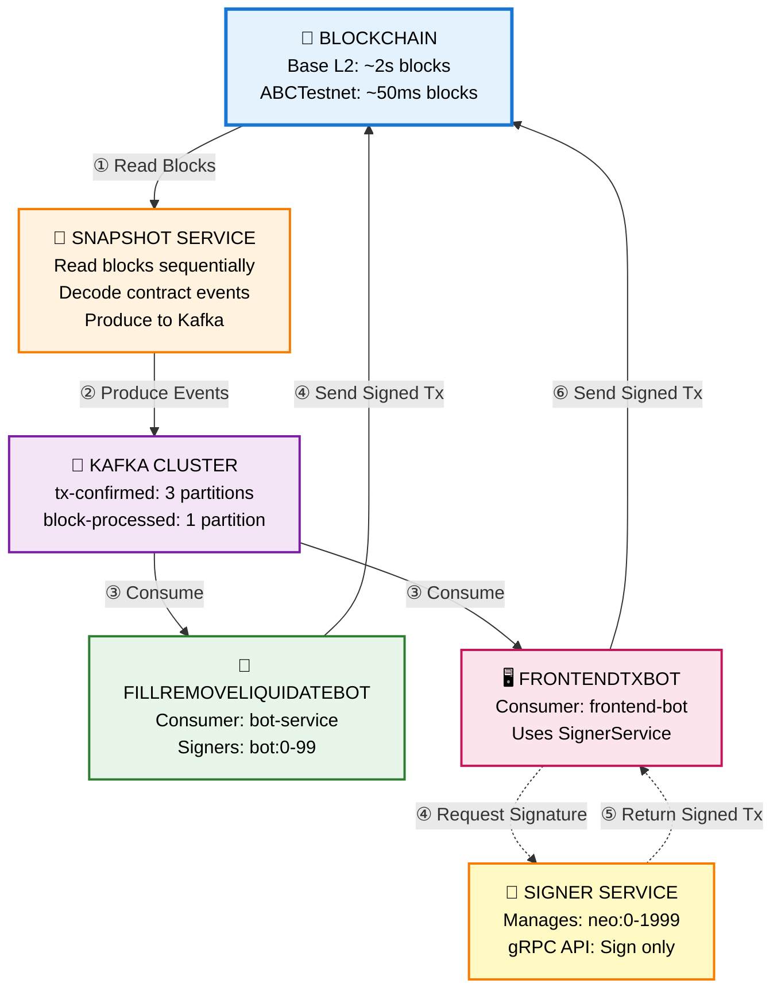
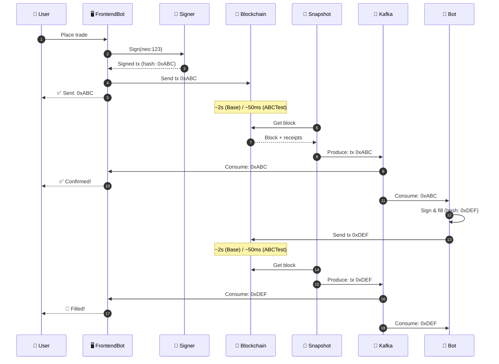
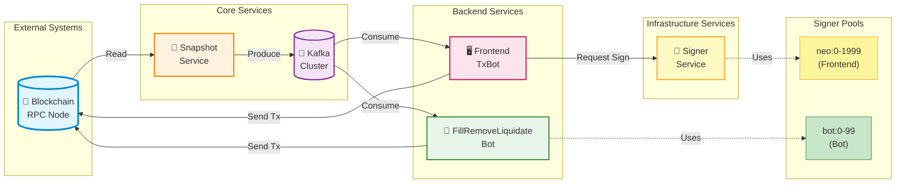
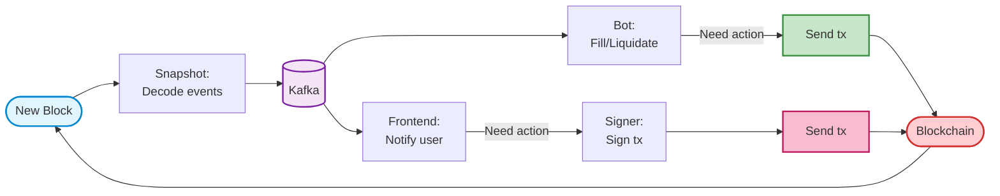

# Kafka-Based Backend Architecture

This document describes the event-driven architecture for SynFutures backend services using Kafka for event streaming.

## Overview

The architecture consists of:
- **Snapshot Service**: Indexes blockchain blocks and produces events to Kafka
- **Kafka**: Event streaming platform for decoupled service communication
- **FillRemoveLiquidateBot**: Automated market-making and risk management
- **FrontendTxBot**: User transaction monitoring and management
- **SignerService**: Centralized transaction signing service

## System Architecture



## Transaction Lifecycle

### Block Time Comparison

| Network | Block Interval | Confirmation Time |
|---------|---------------|-------------------|
| **Base (L2)** | ~2 seconds | Near-instant |
| **ABCTestnet** | ~50 milliseconds | Sub-second |

### Sequence Diagram



## Component Architecture



## Data Flow



## Service Responsibilities

### Snapshot Service (Indexer)

**Responsibility**: Read blockchain and produce events to Kafka

- ✅ Reads blocks sequentially
- ✅ Decodes all contract events from transaction logs
- ✅ Groups events by transaction hash
- ✅ Produces to Kafka topics (`tx-confirmed`, `block-processed`)
- ❌ Never sends transactions to blockchain

**Network Support**:
- Base (L2): ~2 second block time
- ABCTestnet: ~50ms block time

### FillRemoveLiquidateBot

**Responsibility**: Automated market operations (self-contained)

- ✅ Consumes Kafka events
- ✅ Decision logic for filling, liquidations, removals
- ✅ Manages own signers (`bot:0-99`)
- ✅ Signs transactions internally
- ✅ Sends transactions directly to blockchain
- ✅ Self-contained nonce management

**Key Operations**:
- Fill pending orders
- Execute liquidations
- Process liquidity removals
- Monitor position risk

### FrontendTxBot

**Responsibility**: User transaction monitoring and management

- ✅ Consumes Kafka events
- ✅ Filters for frontend user transactions (`neo:0-1999`)
- ✅ Updates UI and notifies users
- ✅ Requests signatures from SignerService
- ✅ Sends signed transactions to blockchain
- ❌ Does not manage signers directly

**Key Operations**:
- Monitor user transactions
- Update UI in real-time
- Handle transaction retries
- Send follow-up transactions (settlements, etc.)
- User notifications

### SignerService

**Responsibility**: Transaction signing service (pure signing, no sending)

- ✅ Manages frontend signers (`neo:0-1999`)
- ✅ Centralized nonce management (prevents collisions)
- ✅ Signs transactions and returns signed bytes
- ❌ Never sends transactions to blockchain
- ✅ Exposes gRPC API for signing

**Key Features**:
- Centralized nonce tracking
- SignerPool with 50 workers
- Optimistic nonce increment
- Rollback on failed sends

## Responsibility Matrix

| Component | Signers | Nonce Management | Signing | Sending | Blockchain Access |
|-----------|---------|------------------|---------|---------|-------------------|
| **SnapshotService** | None | N/A | ❌ No | ❌ No | 📖 Read-only |
| **FillRemoveLiquidateBot** | bot:0-99 | Self-managed | ✅ Yes | ✅ Yes | 📖 Read + ✍️ Write |
| **FrontendTxBot** | None | N/A | ❌ No | ✅ Yes | ✍️ Write-only |
| **SignerService** | neo:0-1999 | Centralized | ✅ Yes | ❌ No | ❌ None |

## Kafka Topics

### tx-confirmed

**Purpose**: Broadcast confirmed transactions with decoded events

**Schema**:
```json
{
  "txHash": "0x123...",
  "blockNumber": 12345,
  "blockTimestamp": 1234567890,
  "transactionIndex": 5,
  "status": 1,
  "gasUsed": 150000,
  "from": "0xaaa...",
  "to": "0xbbb...",
  "events": [
    {
      "eventName": "Trade",
      "contractAddress": "0x...",
      "logIndex": 10,
      "args": {
        "trader": "0x...",
        "amount": "1000000000000000000"
      }
    }
  ]
}
```

**Partitioning**: 3 partitions by `txHash % 3`

**Consumers**:
- FillRemoveLiquidateBot (Group: `bot-service`)
- FrontendTxBot (Group: `frontend-bot`)

### block-processed

**Purpose**: Signal that a block has been fully processed

**Schema**:
```json
{
  "blockNumber": 12345,
  "blockHash": "0xabc...",
  "timestamp": 1234567890,
  "txCount": 42,
  "eventCount": 156
}
```

**Partitioning**: 1 partition (ordered by block number)

## Performance Characteristics

### Base Network (L2)
- Block time: ~2 seconds
- Confirmation time: Near-instant (1 block)
- Throughput: ~500 tx/block
- Total latency (user → confirmed): ~2-4 seconds

### ABCTestnet
- Block time: ~50 milliseconds
- Confirmation time: Sub-second (1 block)
- Throughput: ~100 tx/block
- Total latency (user → confirmed): ~50-100 milliseconds

### Kafka Performance
- Message latency: <10ms
- Throughput: 10,000+ messages/second
- Partition parallelism: 3x for `tx-confirmed`

## Scalability

### Horizontal Scaling

Each service can scale independently:

```
FillRemoveLiquidateBot (3 instances)
├── Instance 1 → Partition 0
├── Instance 2 → Partition 1
└── Instance 3 → Partition 2

FrontendTxBot (3 instances)
├── Instance 1 → Partition 0
├── Instance 2 → Partition 1
└── Instance 3 → Partition 2

SignerService (3 instances, load balanced)
├── Instance 1 → neo:0-666
├── Instance 2 → neo:667-1333
└── Instance 3 → neo:1334-1999
```

## Key Benefits

1. **Single Source of Truth**: Snapshot service is the only service reading blockchain
2. **Efficient Event Decoding**: Decode events once, consume many times
3. **Event Context**: Full transaction context (block, gas, status) with events
4. **Replay Capability**: Re-process historical data by replaying Kafka messages
5. **Service Isolation**: Each service has its own consumer group, processes at its own pace
6. **No RPC Overload**: Backend services don't need RPC access for reading
7. **Fast Confirmations**: Base ~2s, ABCTestnet ~50ms block times
8. **Centralized Nonce Management**: SignerService prevents nonce collisions for frontend signers
9. **Separation of Concerns**: Signing and sending are separated for better security and auditability

## Future Enhancements

- [ ] Dead letter queue for failed transactions
- [ ] Transaction priority management (gas price bidding)
- [ ] Advanced retry strategies with exponential backoff
- [ ] Metrics and monitoring integration (Prometheus/Grafana)
- [ ] Distributed tracing (Jaeger/OpenTelemetry)
- [ ] Multi-region Kafka deployment
- [ ] Transaction simulation before sending
- [ ] Gas optimization strategies per network

