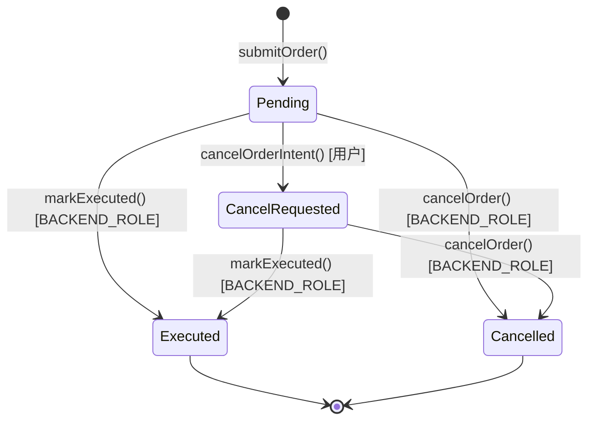
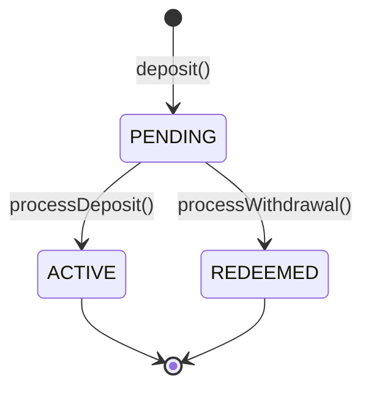
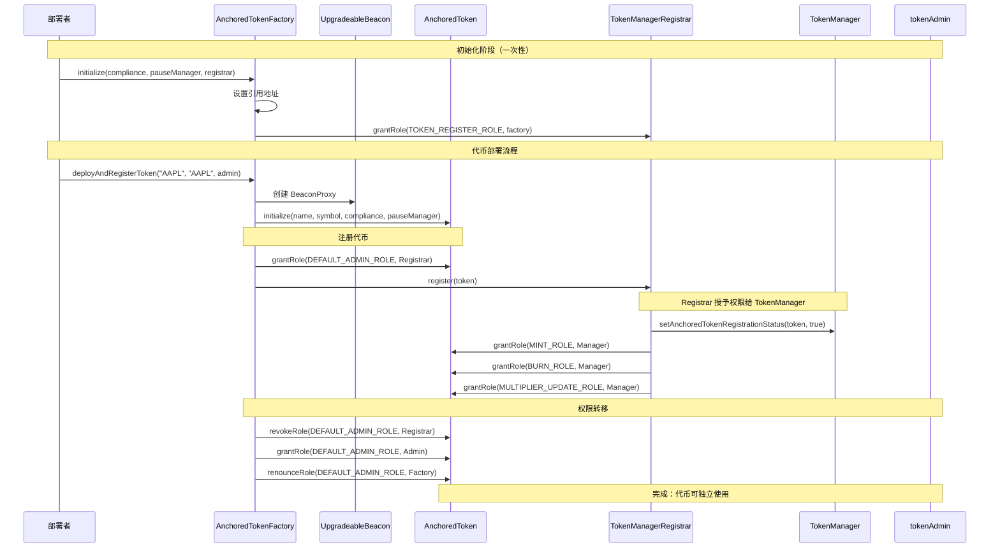
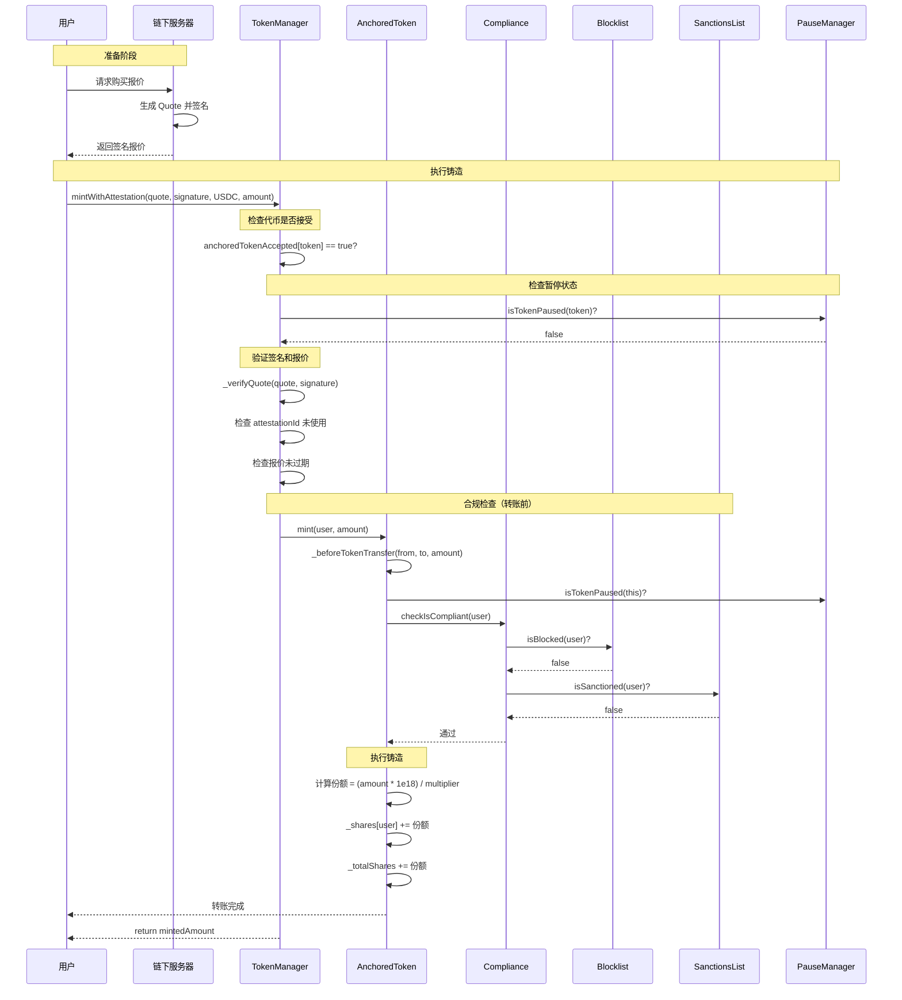
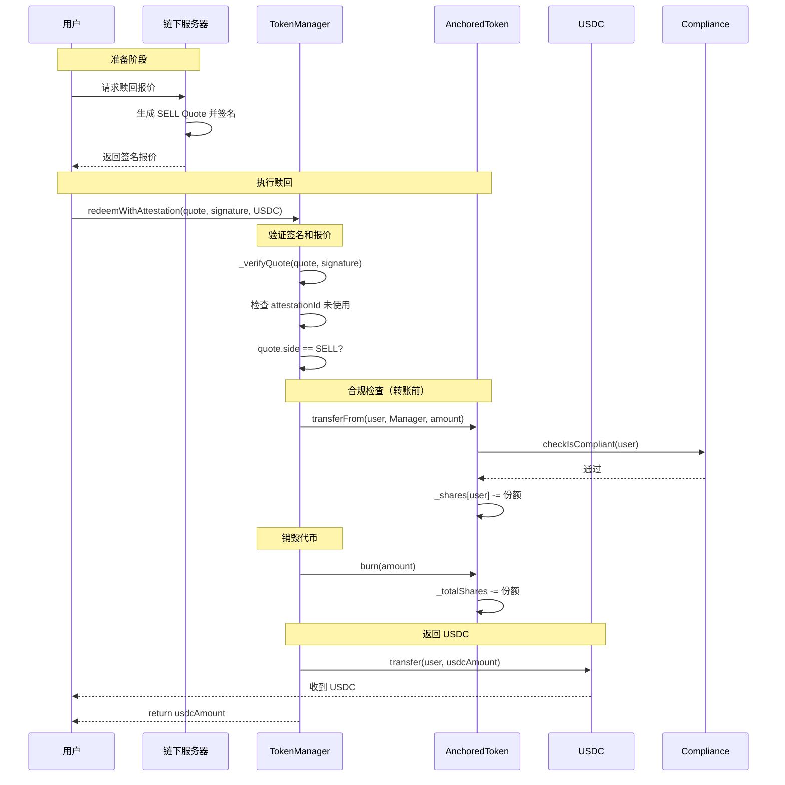
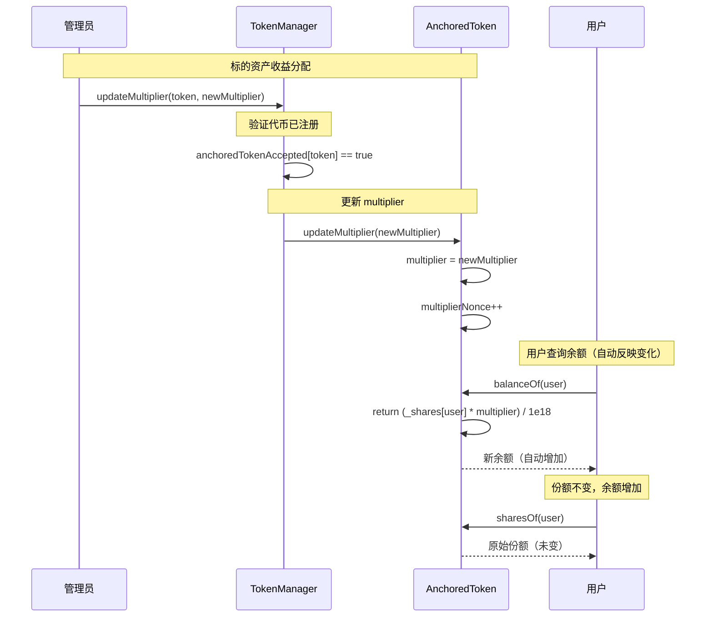
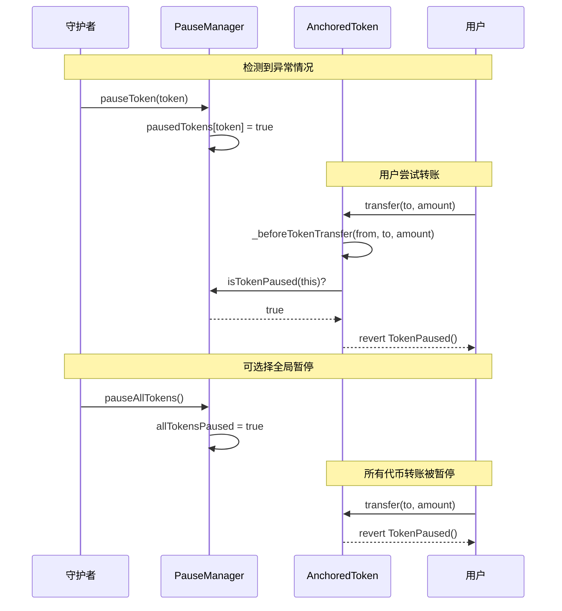

# RWA Smart Contracts

Anchored Finance RWA 智能合约，实现现实资产（美股）代币化的链上逻辑。

---

## 概述

本合约库包含两套体系：

1. **POC 合约** - 概念验证版本，用于快速验证核心业务流程
2. **生产级 Gate 合约** - 引入 pending 状态机制，适用于正式环境

---

## 技术栈

- **Solidity** ^0.8.20
- **Foundry** - 合约开发框架
- **OpenZeppelin** 5.x - 安全合约库
- **solmate** 6.8.0 - 优化版 ERC20 实现
- **viem** 2.22.11 - TypeScript 合约交互库

---

## 合约架构

### POC 合约体系

#### OrderContract (Order.sol)

订单管理合约，负责订单提交、资金托管、执行确认和取消退款。

**核心功能**：
- `submitOrder()` - 提交订单并托管资金
- `cancelOrderIntent()` - 用户发起取消意图
- `markExecuted()` - 后端标记订单已执行
- `cancelOrder()` - 后端取消订单并退款

**状态机**：


#### PocToken (PocToken.sol)

基于 ERC20 的代币合约，支持基于角色的 mint/burn。

**部署实例**：
- USDM - 系统美元稳定币（18 decimals）
- AAPL.anc - 苹果股票代币
- 其他股票代币

#### PocGate (PocGate.sol)

充值/提现网关，实现 USDC ↔ USDM 即时兑换。

**功能**：
- `deposit()` - 存入 USDC，获得 USDM
- `withdraw()` - 退回 USDM，获得 USDC

**精度转换**：USDC (6 decimals) ↔ USDM (18 decimals)

### 生产级 Gate 合约体系

#### Gate (gate/Gate.sol)

生产级充值/提现网关，引入 pending 状态机制。

**操作流程**：
1. 用户 `deposit()` → 获得 `PendingAncUSDC`
2. 后端确认 Broker 入账
3. 后端 `processDeposit()` → 用户获得 `ancUSDC`

**状态机**：


### AnchoredToken 系列

支持重新基准（rebasing）的代币合约，实现 RWA 资产的完整生命周期管理：

#### 核心合约
- **`AnchoredToken.sol`** - 核心代币合约
  - 可重新基准（rebasing）的 ERC20 代币
  - 使用 shares 模型支持 multiplier 动态调整
  - 集成合规检查和暂停管理

#### 管理合约
- **`AnchoredTokenManager.sol`** - 代币管理器
  - 处理代币铸造（mintWithAttestation）和赎回（redeemWithAttestation）
  - 验证链下签名报价
  - 管理最小金额限制

- **`AnchoredTokenFactory.sol`** - 代币工厂
  - 使用 Beacon 模式部署新代币
  - 自动注册代币到系统
  - 管理代币符号唯一性

- **`AnchoredTokenManagerRegistrar.sol`** - 注册器
  - 注册代币到 TokenManager
  - 授予 TokenManager MINT/BURN/MULTIPLIER_UPDATE 权限

#### 合规合约
- **`AnchoredCompliance.sol`** - 合规检查中心
  - 管理每个代币的黑名单和制裁名单
  - 支持主配置角色和代币专属配置角色

- **`AnchoredBlocklist.sol`** - 黑名单管理
  - 批量添加/移除黑名单地址
  - 基于角色的访问控制

- **`AnchoredSanctionsList.sol`** - 制裁名单管理
  - 管理受制裁地址（如 OFAC 名单）
  - 支持详细的制裁状态查询

#### 控制合约
- **`AnchoredTokenPauseManager.sol`** - 暂停管理器
  - 单独暂停/恢复特定代币
  - 全局暂停/恢复所有代币

#### 合约交互时序图

##### 1. 代币部署流程



##### 2. 代币铸造流程



##### 3. 代币赎回流程



##### 4. Rebase (Multiplier 更新) 流程



##### 5. 紧急暂停流程



---

## 目录结构

```
rwa-contract/
├── contracts/
│   ├── poc/                   # POC 合约（概念验证）
│   │   ├── Order.sol          # 订单管理合约：提交/执行/取消订单
│   │   ├── PocGate.sol        # 充值/提现网关：USDC ↔ USDM 即时兑换
│   │   ├── PocToken.sol       # ERC20 代币：基于角色的 mint/burn
│   │   ├── MockUSDC.sol       # 测试用 USDC：6 decimals 稳定币
│   │   └── IPocToken.sol      # PocToken 接口定义
│   │
│   ├── gate/                  # 生产级 Gate（含 pending 状态）
│   │   ├── Gate.sol           # 充值/提现网关：异步确认机制
│   │   ├── PendingToken.sol   # Pending 代币基类：继承 ERC20
│   │   ├── PendingUSDC.sol    # Pending USDC：等待确认的 USDC
│   │   ├── PendingAncUSDC.sol # Pending ancUSDC：等待确认的 ancUSDC
│   │   ├── IGate.sol          # Gate 接口定义
│   │   └── sequenceDiagram.md # 交互流程时序图文档
│   │
│   ├── interfaces/            # AnchoredToken 系列接口
│   │   ├── IAnchoredLike.sol          # 共享接口定义
│   │   ├── IAnchoredToken.sol          # 代币核心接口
│   │   ├── IAnchoredTokenFactory.sol   # 代币工厂接口
│   │   ├── IAnchoredTokenManager.sol   # 代币管理器接口
│   │   ├── IAnchoredTokenPauseManager.sol # 暂停管理器接口
│   │   ├── IAnchoredTokenManagerRegistrar.sol # 注册器接口
│   │   ├── IAnchoredCompliance.sol     # 合规检查接口
│   │   ├── IAnchoredBlocklist.sol      # 黑名单接口
│   │   └── IAnchoredSanctionsList.sol  # 制裁名单接口
│   │
│   ├── AnchoredToken.sol              # 可重新基准（rebasing）的 ERC20 代币
│   ├── AnchoredTokenManager.sol       # 代币管理器：处理 rebasing 逻辑
│   ├── AnchoredTokenFactory.sol       # 代币工厂：部署新代币实例
│   ├── AnchoredTokenPauseManager.sol  # 暂停管理器：统一暂停控制
│   ├── AnchoredTokenManagerRegistrar.sol # 注册器：管理 manager 注册
│   ├── AnchoredCompliance.sol         # 合规模块：KYC/AML 检查
│   ├── AnchoredBlocklist.sol          # 黑名单模块：地址封禁
│   └── AnchoredSanctionsList.sol      # 制裁名单模块：OFAC 合规
│
├── script/
│   ├── poc/                    # POC 部署脚本
│   │   ├── DeployAll.s.sol     # Foundry 部署脚本：部署所有 POC 合约
│   │   ├── BaseScript.s.sol    # 部署基类：提供通用部署工具
│   │   ├── config_poc.ts       # POC 配置文件
│   │   ├── constants.ts        # 常量定义
│   │   ├── deploy_poc_contracts.ts # TypeScript 部署脚本
│   │   ├── placeOrder.ts       # 下单脚本
│   │   └── upgrade_poc.ts      # 升级脚本
│   └── parsers/                # Foundry Cheatsheet 解析器
│
├── test/                       # 合约测试
│   └── foundry/                # Foundry 测试
│
├── foundry.toml                # Foundry 配置
├── foundry.lock                # Foundry 依赖锁定文件
├── package.json                # Node.js 依赖
└── README.md                   # 本文件
```

---

## Foundry 命令

### 编译

```bash
forge build
```


### 测试

```bash
# 运行所有测试
forge test

# 详细输出
forge test -vvv

# 测试特定合约
forge test --match-contract OrderTest -vvv

# 显示 gas 报告
forge test --gas-report
```

### 格式化

```bash
forge fmt
```

### Gas 快照

```bash
forge snapshot
```

### 部署

```bash
# 部署到测试网
forge script script/poc/DeployAll.s.sol:DeployAll \
  --rpc-url $RPC_URL \
  --private-key $PRIVATE_KEY \
  --broadcast \
  -vvv

# 部署到主网（验证）
forge script script/poc/DeployAll.s.sol:DeployAll \
  --rpc-url $RPC_URL \
  --private-key $PRIVATE_KEY \
  --broadcast \
  --verify \
  --etherscan-api-key $ETHERSCAN_API_KEY
```

### 本地节点

```bash
# 启动 Anvil 本地节点
anvil

# 在另一个终端部署
forge script script/poc/DeployAll.s.sol:DeployAll \
  --rpc-url http://localhost:8545 \
  --private-key 0xac0974bec39a17e36ba4a6b4d238ff944bacb478cbed5efcae784d7bf4f2ff80 \
  --broadcast
```

---

## 合约事件

### OrderContract 事件

```solidity
event OrderSubmitted(
    address indexed user,
    uint indexed orderId,
    string symbol,
    uint qty,
    uint price,
    Side side,
    OrderType orderType,
    TimeInForce tif,
    uint blockTimestamp
);

event CancelRequested(
    address indexed user,
    uint indexed orderId,
    uint blockTimestamp
);

event OrderExecuted(
    uint indexed orderId,
    address indexed user,
    uint refundAmount,
    TimeInForce tif
);

event OrderCancelled(
    uint indexed orderId,
    address indexed user,
    address asset,
    uint refundAmount,
    Side side,
    OrderType orderType,
    TimeInForce tif,
    Status previousStatus
);
```

### PocGate 事件

```solidity
event Deposited(
    address indexed user,
    uint256 usdcAmount,
    uint256 usdmAmount
);

event Withdrawn(
    address indexed user,
    uint256 usdmAmount,
    uint256 usdcAmount
);
```


### Gate 事件

```solidity
event DepositRequested(
    address indexed user,
    uint256 amount,
    uint256 pendingAmount
);

event WithdrawalRequested(
    address indexed user,
    uint256 amount,
    uint256 pendingAmount
);

event DepositProcessed(
    address indexed user,
    uint256 pendingAmount,
    uint256 amount
);

event WithdrawalProcessed(
    address indexed user,
    uint256 pendingAmount,
    uint256 amount
);
```

---

## 权限模型

### OrderContract 角色

| 角色                   | 权限            |
| -------------------- | ------------- |
| `DEFAULT_ADMIN_ROLE` | 注册代币映射、设置后端地址 |
| `BACKEND_ROLE`       | 执行订单、取消订单     |

### PocToken 角色

| 角色 | 权限 |
|------|------|
| `DEFAULT_ADMIN_ROLE` | 管理所有角色 |
| `MINTER_ROLE` | 铸造代币 |
| `BURNER_ROLE` | 销毁代币 |

### PocGate/Gate 角色

| 角色 | 权限 |
|------|------|
| `DEFAULT_ADMIN_ROLE` | 所有管理操作 |
| `CONFIGURE_ROLE` | 设置最低金额 |
| `PAUSE_ROLE` | 暂停/恢复操作 |
| `PROCESSOR_ROLE` | 处理 pending 操作（仅 Gate） |

---

## 安全特性

- **ReentrancyGuard** - 防止重入攻击
- **AccessControl** - 基于 RBAC 的权限控制
- **Initializable** - 支持代理模式部署
- **SafeERC20** - 安全的代币转账
- **Pausable** - 紧急暂停机制

---

## 部署顺序

### POC 合约部署

1. 部署 MockUSDC
2. 部署 PocToken 实现合约
3. 通过 Beacon Proxy 部署 USDM
4. 部署 PocGate
5. 初始化 PocGate
6. 授权 PocGate (MINTER/BURNER)
7. 部署 OrderContract
8. 初始化 OrderContract
9. 部署股票 PocToken
10. 注册股票代币
11. 授权后端

详见 [部署文档](../docs/contract-deployment.md)

---

## 测试覆盖率

```bash
# 生成覆盖率报告
forge coverage --report lcov

# 查看 lcov.info
genhtml lcov.info -o coverage
```

---

## 相关文档

- [智能合约架构](../docs/smart-contracts.md)
- [系统架构文档](../docs/architecture.md)
- [部署指南](../docs/contract-deployment.md)
- [Foundry 文档](https://book.getfoundry.sh/)