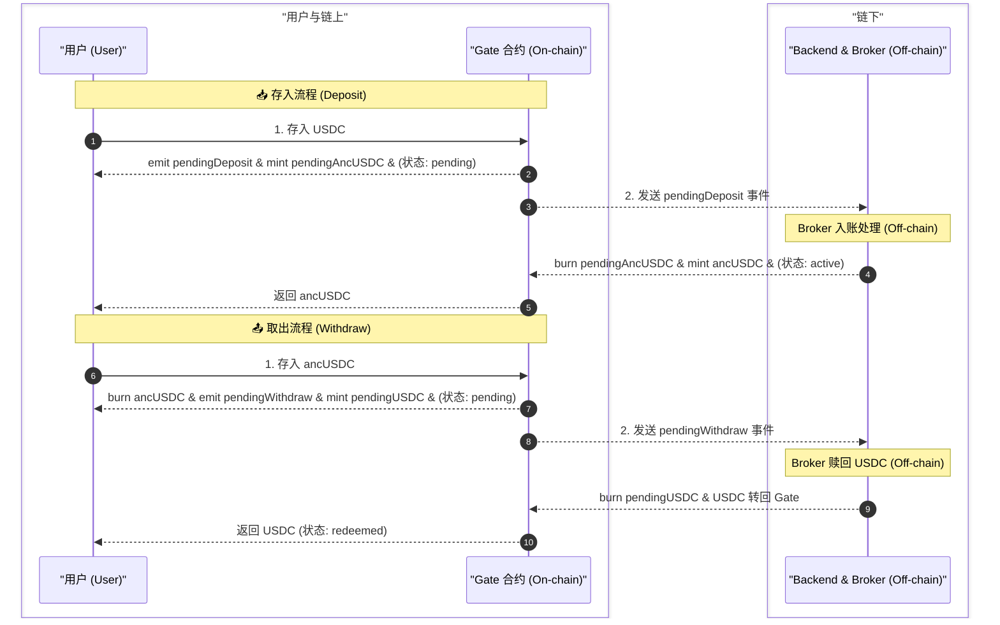

```mermaid
sequenceDiagram
    autonumber
    box "用户与链上"
        participant U as "用户 (User)"
        participant G as "Gate 合约 (On-chain)"
    end
    box "链下"
        participant B as "Backend & Broker (Off-chain)"
    end

    %% ---------------- 存入流程 ----------------
    Note over U,G: 📥 存入流程 (Deposit)

    U->>G: 1. 存入 USDC
    G-->>U: emit pendingDeposit & mint pendingAncUSDC & (状态: pending)

    G-->>B: 2. 发送 pendingDeposit 事件
    Note over B: Broker 入账处理 (Off-chain)
    B-->>G: burn pendingAncUSDC & mint ancUSDC & (状态: active)
    G-->>U: 返回 ancUSDC

    %% ---------------- 取出流程 ----------------
    Note over U,G: 📤 取出流程 (Withdraw)

    U->>G: 1. 存入 ancUSDC
    G-->>U: burn ancUSDC & emit pendingWithdraw & mint pendingUSDC & (状态: pending)

    G-->>B: 2. 发送 pendingWithdraw 事件
    Note over B: Broker 赎回 USDC (Off-chain)
    B-->>G: burn pendingUSDC & USDC 转回 Gate
    G-->>U: 返回 USDC (状态: redeemed)

```
